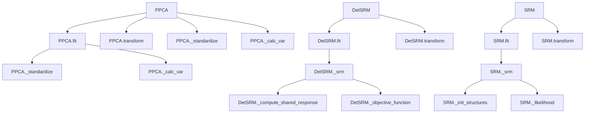

# `hypertools._externals`

## Tree:
_externals/
├── ppca.py
└── srm.py

## Role:
Provides external dimensionality reduction algorithms for neuroimaging data analysis, specifically probabilistic principal component analysis and shared response modeling techniques.

## Description:
This module encapsulates advanced dimensionality reduction algorithms that are not part of the standard scikit-learn library but are essential for analyzing neuroimaging datasets. The module contains implementations of Probabilistic Principal Component Analysis (PPCA) for single-subject data and Shared Response Models (SRM) for multi-subject data alignment. These algorithms are particularly useful in neuroscience research for extracting meaningful patterns from high-dimensional brain imaging data while handling various data characteristics like missing values and inter-subject variability.

The module serves as a bridge between standard machine learning libraries and specialized neuroimaging analysis techniques, providing robust implementations that handle real-world data challenges such as incomplete observations and multi-subject alignment.

## Components:
- **PPCA**: Class implementing probabilistic principal component analysis with support for missing data and infinite observations through iterative optimization.
- **DetSRM**: Class implementing deterministic shared response model for aligning neuroimaging data across multiple subjects.
- **SRM**: Class implementing probabilistic shared response model for multi-subject neuroimaging data analysis.
- **_init_w_transforms**: Function for initializing orthogonal weight matrices for SRM implementations.

### Mermaid Dependency Graph:

## Public API:
- **PPCA**: Class implementing probabilistic principal component analysis with fit, transform, load, and save methods
- **DetSRM**: Class implementing deterministic shared response model with fit and transform methods  
- **SRM**: Class implementing probabilistic shared response model with fit and transform methods
- **_init_w_transforms**: Function for initializing orthogonal weight matrices for SRM

## Dependencies:
- **Internal**: None
- **External**: 
  - numpy: For numerical computations and array operations
  - scipy: For linear algebra operations (QR decomposition, orthogonalization)
  - sklearn.utils.validation: For data validation utilities

## Constraints:
- All algorithms require numeric input data with potentially missing/infinite values
- PPCA requires single subject data with shape (n_samples, n_features)
- SRM algorithms require multi-subject data as a list of arrays with consistent time dimensions
- All methods assume finite numerical values except where explicitly handling missing data
- SRM implementations require at least 2 subjects for meaningful alignment

---

## Files

- [`ppca.py`](_externals/ppca.md)
- [`srm.py`](_externals/srm.md)

