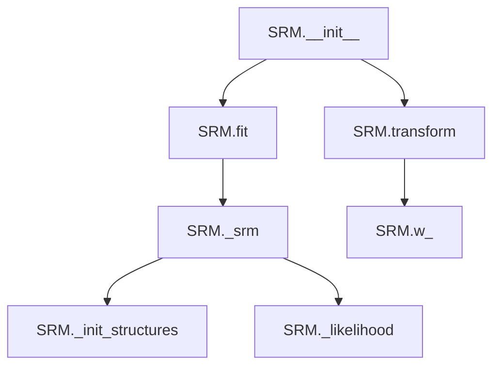
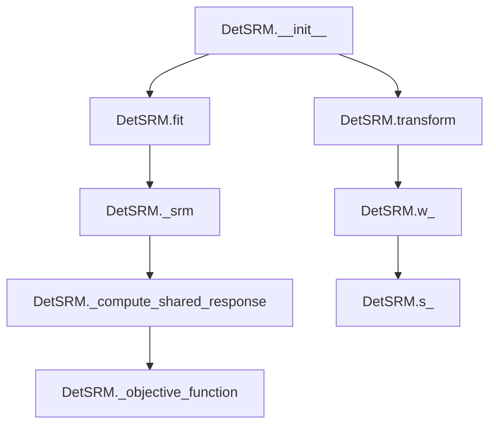

# `srm.py`

## `hypertools._externals.srm._init_w_transforms` · *function*

## Summary:
Initializes orthogonal weight matrices for each subject using QR decomposition of random matrices.

## Description:
This function creates a set of orthogonal weight matrices for each subject in neuroimaging data analysis. It generates random matrices for each subject and applies QR decomposition to produce orthonormal basis matrices that serve as initial weights for shared response models.

## Args:
    data (array-like): A collection of subject data arrays, where each array represents neuroimaging data for a subject.
    features (int): The number of features or components to initialize for each subject's weight matrix.

## Returns:
    tuple: A tuple containing:
        - w (list): List of orthogonal weight matrices (each matrix is orthonormal) for each subject.
        - voxels (numpy.ndarray): Array containing the number of voxels (rows) for each subject's data.

## Raises:
    None explicitly raised in the function body.

## Constraints:
    - Preconditions: 
        * data must be iterable with subject data arrays
        * features must be a positive integer
    - Postconditions:
        * Each returned weight matrix in w will be orthonormal (Q^T * Q = I)
        * voxels array will contain the shape[0] of each subject's data

## Side Effects:
    None.

## Control Flow:
```mermaid
flowchart TD
    A[Start _init_w_transforms] --> B{data is iterable?}
    B -->|Yes| C[Initialize w=[], subjects=len(data)]
    C --> D[Initialize voxels=np.empty(subjects,dtype=int)]
    D --> E[For each subject in range(subjects)]
    E --> F[voxels[subject] = data[subject].shape[0]]
    F --> G[rnd_matrix = np.random.random((voxels[subject], features))]
    G --> H[q, r = np.linalg.qr(rnd_matrix)]
    H --> I[w.append(q)]
    I --> J[Return (w, voxels)]
    J --> K[End]
```

## Examples:
```python
# Example usage with sample neuroimaging data
import numpy as np

# Sample data for 3 subjects with different numbers of voxels
sample_data = [
    np.random.rand(100, 50),  # Subject 1: 100 voxels, 50 features
    np.random.rand(150, 50),  # Subject 2: 150 voxels, 50 features  
    np.random.rand(120, 50)   # Subject 3: 120 voxels, 50 features
]

# Initialize weight transforms
weight_matrices, voxel_counts = _init_w_transforms(sample_data, 20)

print(f"Number of subjects: {len(weight_matrices)}")
print(f"Voxel counts: {voxel_counts}")
print(f"First subject weight matrix shape: {weight_matrices[0].shape}")
```

## `hypertools._externals.srm.SRM` · *class*

## Summary:
Probabilistic Shared Response Model (SRM) for aligning neuroimaging data across multiple subjects.

## Description:
The SRM class implements a probabilistic shared response model that finds a common low-dimensional representation across multiple subjects' neuroimaging data. It aligns individual subject data by identifying shared neural responses while accounting for subject-specific variations. This is commonly used in neuroimaging analysis to find common patterns across participants.

The class follows scikit-learn's transformer interface with fit() and transform() methods. During fit(), it learns shared response patterns across subjects. During transform(), it projects new data into the shared response space using the learned weights.

## State:
- n_iter (int, default=10): Number of iterations for the Expectation-Maximization algorithm
- features (int, default=50): Number of shared features/components to extract
- rand_seed (int, default=0): Random seed for reproducible results
- sigma_s_ (numpy.ndarray): Shared covariance matrix of the latent responses
- w_ (list): List of orthogonal weight matrices for each subject
- mu_ (list): List of mean vectors for each subject
- rho2_ (numpy.ndarray): Noise variance parameters for each subject
- s_ (numpy.ndarray): Shared response matrix

## Lifecycle:
1. Creation: Instantiate with parameters n_iter, features, and rand_seed
2. Usage: Call fit() with list of subject data arrays to learn shared patterns, then transform() with new data to project into shared response space
3. Destruction: No explicit cleanup required; relies on Python garbage collection

## Method Map:


## Raises:
- ValueError: Raised when there are insufficient subjects (< 2) or insufficient samples for the requested features
- ValueError: Raised when subjects have inconsistent number of timepoints
- NotFittedError: Raised when transform() is called before fit()

## Example:
```python
import numpy as np
from hypertools._externals.srm import SRM

# Create sample neuroimaging data for 3 subjects
subjects_data = [
    np.random.rand(100, 50),  # Subject 1: 100 voxels, 50 timepoints
    np.random.rand(120, 50),  # Subject 2: 120 voxels, 50 timepoints
    np.random.rand(110, 50)   # Subject 3: 110 voxels, 50 timepoints
]

# Initialize and fit SRM
srm = SRM(n_iter=15, features=30, rand_seed=42)
srm.fit(subjects_data)

# Transform new data using the fitted model to obtain shared responses
shared_responses = srm.transform(subjects_data)
```

### `hypertools._externals.srm.SRM.__init__` · *method*

## Summary:
Initializes a Probabilistic Shared Response Model (SRM) instance with configurable parameters for iterative optimization.

## Description:
Configures the SRM instance with hyperparameters controlling the model's behavior during training. This method sets up the fundamental configuration parameters that govern the shared response model's iterative optimization process, including the number of EM iterations, the number of shared features to extract, and the random seed for reproducible results. The method is called automatically during object instantiation and establishes the baseline configuration for subsequent model fitting and transformation operations.

## Args:
    n_iter (int, default=10): Number of iterations for the Expectation-Maximization algorithm used in model training. Must be a positive integer.
    features (int, default=50): Number of shared features/components to extract from the multi-subject neuroimaging data. Must be a positive integer.
    rand_seed (int, default=0): Random seed value for initializing random number generators to ensure reproducible results across runs. Can be any integer.

## Returns:
    None: This method does not return any value.

## Raises:
    None: This method does not raise any exceptions.

## State Changes:
    Attributes READ: None
    Attributes WRITTEN: 
        - self.n_iter: Stores the number of EM iterations for model training
        - self.features: Stores the number of shared features to extract
        - self.rand_seed: Stores the random seed for reproducibility

## Constraints:
    Preconditions:
        - n_iter must be a positive integer (>= 1)
        - features must be a positive integer (>= 1)
        - rand_seed can be any integer value
    Postconditions:
        - All instance attributes are properly initialized with provided values
        - The SRM instance is ready for subsequent fit() operations

## Side Effects:
    None: This method performs no I/O operations or external service calls. It only sets instance attributes.

### `hypertools._externals.srm.SRM.fit` · *method*

## Summary:
Trains a Probabilistic Shared Response Model (SRM) on multi-subject neuroimaging data by validating inputs and computing shared response parameters.

## Description:
This method fits a Probabilistic Shared Response Model to multi-subject neuroimaging data, finding common neural activity patterns across subjects while accounting for individual differences. It validates that sufficient subjects and samples are available, ensures consistent data dimensions across subjects, and computes model parameters through iterative optimization. The method is typically called during the model training phase of a machine learning pipeline involving multi-subject brain imaging data analysis.

## Args:
    X (list of array-like): List of subject data matrices, where each matrix represents neuroimaging data from a different subject with shape (n_voxels, n_time_samples).
    y (array-like, optional): Target values (default: None). Unused in this implementation but maintained for scikit-learn compatibility.

## Returns:
    self: Returns the fitted SRM instance for method chaining.

## Raises:
    ValueError: If there are fewer than 2 subjects in X, or if any subject has insufficient samples compared to the requested number of features, or if subjects have inconsistent numbers of time samples.

## State Changes:
    Attributes READ: 
        - self.features: Number of features to extract from the data
    Attributes WRITTEN: 
        - self.sigma_s_: Estimated covariance matrix of the shared response
        - self.w_: Subject-specific weight matrices for transforming data to shared space
        - self.mu_: Subject mean vectors for each subject's data
        - self.rho2_: Squared noise variance estimates for each subject
        - self.s_: Computed shared response matrix

## Constraints:
    Preconditions:
        - X must be a list with at least 2 subjects
        - Each subject's data matrix must have the same number of time samples
        - Each subject's data matrix must have at least as many voxels as self.features
        - All subject data matrices must contain finite values
    Postconditions:
        - Model parameters are stored in instance attributes for later use
        - The fitted model can be used for subsequent transform operations

## Side Effects:
    - Writes informational messages to the logger at INFO level
    - Calls the internal _srm method which performs iterative optimization
    - Uses sklearn's assert_all_finite for data validation

### `hypertools._externals.srm.SRM.transform` · *method*

## Summary:
Transforms input data using fitted shared response model weights to project data into shared response space.

## Description:
Applies the previously fitted shared response model weights to transform new input data into a shared response space. This method is typically called after fitting the SRM model with the fit() method to transform new subject data into the common shared representation.

## Args:
    X (list): A list of subject data arrays, where each array represents neuroimaging data for a subject. Each array should have the same number of subjects as were used during fitting.
    y (None): Placeholder parameter for scikit-learn compatibility, not used in this implementation.

## Returns:
    list: A list of transformed data arrays, where each array represents the input data projected into the shared response space using the corresponding subject's weight matrix.

## Raises:
    sklearn.utils.validation.NotFittedError: When the transform method is called before the model has been fitted (i.e., when w_ attribute is not present).
    ValueError: When the number of subjects in input data does not match the number of subjects used during model fitting.

## State Changes:
    Attributes READ: self.w_
    Attributes WRITTEN: None

## Constraints:
    Preconditions:
        * The SRM model must have been fitted using the fit() method before calling transform
        * The number of subjects in X must match the number of subjects used during fitting
        * Each subject's data in X must be compatible with the corresponding weight matrix dimensions
    Postconditions:
        * Returns a list of transformed data arrays with the same length as input X
        * Each transformed array has the same number of rows as the number of shared features

## Side Effects:
    None

### `hypertools._externals.srm.SRM._init_structures` · *method*

## Summary:
Initializes data structures for Shared Response Model computation by centering data and computing statistical moments.

## Description:
This method prepares the initial data structures required for the Shared Response Model (SRM) algorithm. It centers the input data for each subject, computes mean vectors, and calculates trace values needed for subsequent SRM iterations. The method is called during the initialization phase of the SRM training process.

## Args:
    data (list[np.ndarray]): List of subject data matrices, where each matrix has shape (voxels, samples)
    subjects (int): Number of subjects in the dataset

## Returns:
    tuple: Four-element tuple containing:
        - x (list[np.ndarray]): Centered data matrices for each subject, with shape (voxels, samples)
        - mu (list[np.ndarray]): Mean vectors for each subject, with shape (voxels,)
        - rho2 (np.ndarray): Array of squared noise variance estimates for each subject, shape (subjects,)
        - trace_xtx (np.ndarray): Array of trace values of centered data matrices, shape (subjects,)

## Raises:
    None explicitly raised

## State Changes:
    - Attributes READ: None
    - Attributes WRITTEN: None

## Constraints:
    - Preconditions: 
        * data must be a list of numpy arrays with consistent sample dimensions
        * subjects must equal the length of data
    - Postconditions:
        * All returned arrays are properly initialized with correct shapes
        * x contains centered versions of input data
        * mu contains mean vectors for each subject
        * rho2 and trace_xtx are initialized with appropriate values

## Side Effects:
    None

### `hypertools._externals.srm.SRM._likelihood` · *method*

*No documentation generated.*

### `hypertools._externals.srm.SRM._srm` · *method*

## Summary:
Performs iterative optimization to compute shared neural responses across multiple subjects using a probabilistic Shared Response Model (SRM) algorithm.

## Description:
This method implements the core iterative algorithm of the Shared Response Model (SRM) for neuroimaging data analysis. It optimizes the shared response matrix and subject-specific weight matrices by alternating between estimating the shared response and updating subject-specific transformations. The algorithm uses maximum likelihood estimation with conjugate priors to find optimal parameters that capture common neural activity patterns across subjects while accounting for individual differences.

The method is called internally by the `fit` method during model training and operates on preprocessed multi-subject neuroimaging data. It performs multiple iterations of coordinate ascent optimization to maximize the likelihood of the observed data under the SRM model.

## Args:
    data (list[np.ndarray]): List of subject data matrices, where each matrix has shape (voxels, samples) representing neuroimaging data for a subject.

## Returns:
    tuple: A five-element tuple containing:
        - sigma_s (np.ndarray): The estimated covariance matrix of the shared response, shape (features, features)
        - w (list[np.ndarray]): List of subject-specific weight matrices, each with shape (voxels, features) 
        - mu (list[np.ndarray]): List of subject mean vectors, each with shape (voxels,)
        - rho2 (np.ndarray): Array of squared noise variance estimates for each subject, shape (subjects,)
        - shared_response (np.ndarray): The computed shared response matrix, shape (features, samples)

## Raises:
    None explicitly raised in the method body

## State Changes:
    - Attributes READ: self.n_iter, self.features, self.rand_seed, self._init_structures, _init_w_transforms
    - Attributes WRITTEN: None (modifies local variables only)

## Constraints:
    - Preconditions:
        * data must be a list of numpy arrays with consistent sample dimensions
        * Each subject's data must have at least as many samples as the requested number of features
        * The number of subjects must be greater than 1
    - Postconditions:
        * All returned arrays have correct shapes and dimensions
        * The shared response captures common neural activity patterns across subjects
        * Subject-specific weight matrices are orthonormal
        * The algorithm converges to a local optimum of the likelihood function

## Side Effects:
    - Sets the random seed using self.rand_seed for reproducible results
    - Logs iteration progress and objective function values when logging level is INFO
    - Uses scipy.linalg for Cholesky factorization and solving linear systems
    - Uses numpy operations for matrix computations and SVD

## `hypertools._externals.srm.DetSRM` · *class*

## Summary:
Deterministic Shared Response Model (SRM) that aligns neuroimaging data across multiple subjects by finding a shared response space.

## Description:
The DetSRM class implements a deterministic version of the Shared Response Model, a dimensionality reduction technique commonly used in neuroimaging analysis to find common patterns across multiple subjects. It aligns data from different subjects by computing shared response matrices that capture common neural activity patterns while preserving subject-specific variations.

This class follows scikit-learn's estimator interface with fit() and transform() methods. It is designed for multi-subject neuroimaging data where each subject's data is represented as a matrix of voxels (rows) by timepoints (columns).

## State:
- n_iter: int, default=10
  - Number of iterations for the alternating optimization algorithm
  - Valid range: positive integers
  - Invariant: Must be >= 1 for meaningful execution

- features: int, default=50
  - Number of features/components to extract for the shared response
  - Valid range: positive integers
  - Invariant: Must be <= number of timepoints in subject data

- rand_seed: int, default=0
  - Random seed for reproducible initialization of weight matrices
  - Valid range: any integer
  - Invariant: Used to ensure deterministic results across runs

- w_: list of numpy.ndarray
  - Weight matrices computed for each subject during fitting
  - Set after successful call to fit()
  - Invariant: Length equals number of subjects, each matrix has appropriate dimensions

- s_: numpy.ndarray
  - Shared response matrix computed during fitting
  - Set after successful call to fit()
  - Invariant: Shape is (features, number_timepoints)

## Lifecycle:
- Creation: Instantiate with parameters n_iter, features, rand_seed
- Usage: Call fit() with list of subject data matrices, then transform() with new data
- Destruction: No explicit cleanup required; relies on Python garbage collection

## Method Map:


## Raises:
- ValueError: Raised in fit() when:
  - Number of subjects is less than or equal to 1
  - Insufficient samples for requested features
  - Inconsistent number of timepoints across subjects
- NotFittedError: Raised in transform() when fit() has not been called

## Example:
```python
import numpy as np
from hypertools._externals.srm import DetSRM

# Create sample neuroimaging data for 3 subjects
subjects_data = [
    np.random.rand(100, 50),  # Subject 1: 100 voxels, 50 timepoints
    np.random.rand(100, 50),  # Subject 2: 100 voxels, 50 timepoints  
    np.random.rand(100, 50)   # Subject 3: 100 voxels, 50 timepoints
]

# Initialize and fit the model
model = DetSRM(n_iter=5, features=20, rand_seed=42)
model.fit(subjects_data)

# Transform new data using the fitted model
transformed_data = model.transform(subjects_data)
print(f"Transformed data shapes: {[x.shape for x in transformed_data]}")
```

### `hypertools._externals.srm.DetSRM.__init__` · *method*

## Summary:
Initializes a Deterministic Shared Response Model (SRM) instance with configuration parameters.

## Description:
Configures the SRM algorithm parameters including the number of iterations for optimization, the number of features to extract, and the random seed for reproducible results. This constructor sets up the hyperparameters that control the behavior of the shared response model during fitting and transformation operations.

## Args:
    n_iter (int, optional): Number of iterations for the alternating optimization algorithm. Defaults to 10. Must be a positive integer.
    features (int, optional): Number of features/components to extract for the shared response. Defaults to 50. Must be a positive integer.
    rand_seed (int, optional): Random seed for reproducible initialization of weight matrices. Defaults to 0. Can be any integer value.

## Returns:
    None: This method initializes instance attributes and does not return a value.

## Raises:
    None: This method does not raise exceptions directly.

## State Changes:
    Attributes READ: No attributes are read from the instance.
    Attributes WRITTEN: 
    - self.n_iter: Stores the number of iterations parameter
    - self.features: Stores the number of features parameter  
    - self.rand_seed: Stores the random seed parameter

## Constraints:
    Preconditions: All arguments must be valid integers with appropriate ranges (n_iter and features must be positive).
    Postconditions: Instance attributes self.n_iter, self.features, and self.rand_seed are set to the provided values.

## Side Effects:
    None: This method performs no I/O operations or external service calls. It only assigns parameter values to instance attributes.

### `hypertools._externals.srm.DetSRM.fit` · *method*

## Summary:
Trains the Deterministic Shared Response Model by validating input data and computing subject-specific weight matrices and shared response representation.

## Description:
Validates input neuroimaging data from multiple subjects and computes the shared response model parameters using the internal SRM optimization algorithm. This method performs input validation checks and executes the deterministic SRM training process, storing the resulting weight matrices and shared response in the instance attributes for later use in transformation.

## Args:
    X (list of array-like): List of subject data matrices, where each matrix represents neuroimaging data from a different subject with shape (n_voxels, n_time_samples)
    y (None): Placeholder parameter for scikit-learn compatibility, not used in this implementation

## Returns:
    self: Returns the fitted DetSRM instance to enable method chaining

## Raises:
    ValueError: If there are fewer than 2 subjects in the input data, or if any subject has insufficient samples compared to the requested number of features, or if subjects have inconsistent numbers of time samples

## State Changes:
    Attributes READ: 
        - self.features: Number of features to extract from the data
    Attributes WRITTEN: 
        - self.w_: Subject-specific weight matrices computed during training
        - self.s_: Shared response matrix computed during training

## Constraints:
    Preconditions:
        - X must be a list with at least 2 subject matrices
        - Each subject matrix must have the same number of time samples
        - Each subject matrix must have at least as many voxels as self.features
        - All subject matrices must contain finite numerical values

    Postconditions:
        - self.w_ contains the trained weight matrices for all subjects
        - self.s_ contains the computed shared response matrix
        - The method returns self for method chaining

## Side Effects:
    - Writes informational log messages to the module logger
    - Performs finite value validation on input data using sklearn's assert_all_finite

### `hypertools._externals.srm.DetSRM.transform` · *method*

## Summary:
Transforms input data using previously learned shared response model weights.

## Description:
Applies the previously fitted shared response model weights to transform new neuroimaging data from individual subjects into a shared response space. This method validates that the model has been fitted and that the number of subjects in the input data matches the training data.

## Args:
    X (list): A list of numpy arrays, where each array represents neuroimaging data for a subject. Each array should have the same number of columns (timepoints) as the training data.
    y (None): Placeholder parameter for scikit-learn compatibility, not used in this implementation.

## Returns:
    list: A list of transformed data arrays, where each array represents the shared response for the corresponding subject in the input data.

## Raises:
    sklearn.utils.validation.NotFittedError: When the model has not been fitted yet (i.e., w_ attribute is missing).
    ValueError: When the number of subjects in the input data does not match the number of subjects in the fitted model.

## State Changes:
    Attributes READ: self.w_
    Attributes WRITTEN: None

## Constraints:
    Preconditions:
        * The model must have been fitted using the fit() method before calling transform()
        * The number of subjects in X must equal the number of subjects in the fitted model
        * Each subject's data in X must have compatible dimensions with the trained weights
    Postconditions:
        * The returned list contains transformed data for each subject
        * Each transformed array has the same number of rows as the number of shared features

## Side Effects:
    None

### `hypertools._externals.srm.DetSRM._objective_function` · *method*

## Summary:
Computes the objective function value for the Deterministic SRM algorithm by calculating the sum of squared reconstruction errors across all subjects.

## Description:
This private method calculates the objective function used to monitor convergence during the Deterministic SRM fitting process. It computes the sum of squared Frobenius norms between the original data matrices and their reconstructions using subject-specific weight matrices and the shared response space. The result is normalized by the number of time samples to provide a per-sample measure.

## Args:
    data (list of ndarray): List of subject data matrices, each of shape (n_voxels, n_time_samples)
    w (list of ndarray): List of subject-specific weight matrices, each of shape (n_voxels, n_features)
    s (ndarray): Shared response space matrix of shape (n_features, n_time_samples)

## Returns:
    float: Normalized objective function value representing the total reconstruction error across all subjects

## Raises:
    None explicitly raised

## State Changes:
    Attributes READ: None
    Attributes WRITTEN: None

## Constraints:
    Preconditions:
    - data must be a list of numpy arrays with consistent time dimensions
    - w must be a list of matrices with compatible dimensions (each w[m] should have same number of rows as data[m])
    - s must have compatible dimensions with w and data
    - data[0].shape[1] must be greater than zero to avoid division by zero

    Postconditions:
    - Returns a non-negative float value representing the reconstruction error
    - The returned value is scaled by 0.5 and normalized by the number of time samples

## Side Effects:
    None

### `hypertools._externals.srm.DetSRM._compute_shared_response` · *method*

## Summary:
Computes the shared response matrix by aggregating weighted transformations across multiple subjects in the SRM framework.

## Description:
This method implements a core computation in the Deterministic Shared Response Model (SRM) algorithm. It aggregates the weighted transformations from multiple subjects to compute a shared response matrix that represents common patterns across subjects. The method is called during the iterative optimization process to update the shared response representation.

## Args:
    data (list of array-like): List of subject data matrices, where each matrix represents neuroimaging data from a different subject
    w (list of array-like): List of transformation matrices, where each matrix represents the learned transformation for a subject

## Returns:
    numpy.ndarray: Shared response matrix with shape (n_features, n_timepoints) representing the common response across all subjects

## Raises:
    None explicitly raised

## State Changes:
    Attributes READ: None
    Attributes WRITTEN: None

## Constraints:
    Preconditions:
    - Both `data` and `w` must be lists of arrays with compatible dimensions
    - Each element in `data` and `w` must have matching shapes for corresponding indices
    - The first element of `w` and `data` must have compatible dimensions for matrix multiplication
    
    Postconditions:
    - The returned matrix has dimensions (w[0].shape[1], data[0].shape[1])
    - The result is the average of weighted transformations across all subjects

## Side Effects:
    None

### `hypertools._externals.srm.DetSRM._srm` · *method*

## Summary:
Performs iterative optimization to compute shared response model weights and shared response matrix for multi-subject neuroimaging data.

## Description:
Implements the core iterative algorithm for Deterministic Shared Response Models (SRM) that finds shared response patterns across multiple subjects. This private method alternates between updating subject-specific weight matrices and recomputing the shared response representation until convergence or maximum iterations are reached. It serves as the main optimization loop for the SRM algorithm and is called internally by the fit() method.

## Args:
    data (list of array-like): List of subject data matrices, where each matrix represents neuroimaging data from a different subject with shape (n_voxels, n_time_samples)

## Returns:
    tuple: A tuple containing:
        - w (list): List of optimized weight matrices for each subject, where each matrix has shape (n_voxels, n_features)
        - shared_response (numpy.ndarray): Shared response matrix with shape (n_features, n_time_samples) representing common patterns across subjects

## Raises:
    None explicitly raised in the method body

## State Changes:
    Attributes READ: 
        - self.rand_seed: Random seed for reproducible results
        - self.features: Number of features/components to extract
        - self.n_iter: Maximum number of iterations for optimization
    Attributes WRITTEN: 
        - None (method is pure computation, results returned)

## Constraints:
    Preconditions:
        - data must be a list with at least 2 subjects
        - Each subject's data matrix must have the same number of time samples
        - Each subject's data matrix must have at least as many voxels as self.features
        - self.rand_seed must be a valid integer for seeding numpy random number generator
        - self.n_iter must be a positive integer
        - self.features must be a positive integer

    Postconditions:
        - Returns optimized weight matrices for all subjects
        - Returns shared response matrix representing common patterns
        - Weight matrices are orthonormal (each W^T * W = I)
        - Algorithm converges after self.n_iter iterations or fewer

## Side Effects:
    - Writes iteration and objective function information to logger when INFO level is enabled
    - Seeds numpy random number generator with self.rand_seed
    - Uses numpy linear algebra operations (SVD, matrix multiplication)

