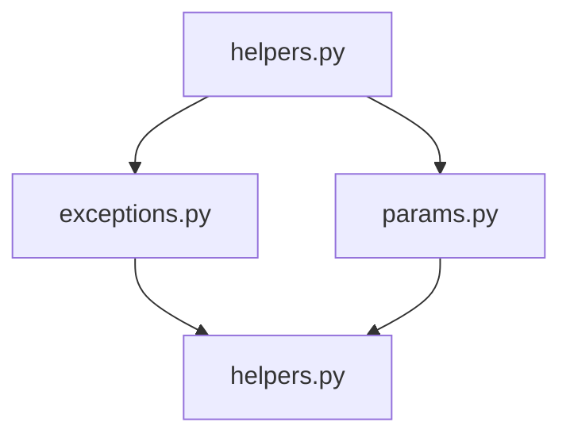

# `hypertools._shared`

## Tree:
    _shared/
    ├── exceptions.py
    ├── helpers.py
    └── params.py

## Role:
Provides shared infrastructure and utilities for the hypertools library, including exception handling, data processing helpers, and parameter management.

## Description:
The _shared module serves as a foundational layer that provides common utilities, error handling mechanisms, and data processing functions used across various components of the hypertools library. This module encapsulates functionality that is reused throughout the codebase, promoting consistency and reducing code duplication.

The module is organized into three main areas:
1. Exception definitions for library-specific error handling
2. Utility functions for data manipulation and processing
3. Parameter management for model configurations

This separation ensures that core functionality is available to all modules while maintaining clear boundaries between different types of shared utilities.

## Components:
- **exceptions.py**: Contains custom exception classes for the library
  - HypertoolsError: Base exception class for library-specific errors
  - HypertoolsBackendError: Specialized exception for backend-related failures
  - HypertoolsIOError: Exception for input/output related errors

- **helpers.py**: Provides various utility functions for data processing and manipulation
  - center: Centers arrays by subtracting the mean
  - check_geo: Processes DataGeometry objects for proper string encoding
  - convert_text: Converts text data to NumPy array format
  - get_dtype: Determines data type identifiers
  - get_type: Classifies data structures into categorical types
  - group_by_category: Maps categorical values to numeric group identifiers
  - interp_array: Performs piecewise cubic Hermite interpolation
  - is_line: Determines if matplotlib format string represents a line style
  - memoize: Creates a memoization decorator for caching function results
  - parse_args: Processes items and arguments to generate argument tuples
  - patch_lines: Modifies arrays by vertically stacking rows
  - reshape_data: Groups data points by categorical labels
  - scale: Scales data to [-1, 1] range
  - vals2bins: Converts numerical data into discrete bin indices

- **params.py**: Manages parameter configurations for models
  - default_params: Retrieves and merges default model parameters

## Public API:
- **HypertoolsError**: Base exception class for library-specific errors
- **HypertoolsBackendError**: Custom exception for backend-related failures
- **HypertoolsIOError**: Custom exception for input/output related errors
- **center**: Centers arrays by subtracting the mean
- **check_geo**: Processes DataGeometry objects for proper string encoding
- **convert_text**: Converts text data to NumPy array format
- **get_dtype**: Determines data type identifiers
- **get_type**: Classifies data structures into categorical types
- **group_by_category**: Maps categorical values to numeric group identifiers
- **interp_array**: Performs piecewise cubic Hermite interpolation
- **is_line**: Determines if matplotlib format string represents a line style
- **memoize**: Creates a memoization decorator for caching function results
- **parse_args**: Processes items and arguments to generate argument tuples
- **patch_lines**: Modifies arrays by vertically stacking rows
- **reshape_data**: Groups data points by categorical labels
- **scale**: Scales data to [-1, 1] range
- **vals2bins**: Converts numerical data into discrete bin indices
- **default_params**: Retrieves and merges default model parameters

## Dependencies:
- Internal imports:
  - None (this module is designed to be self-contained)
- External dependencies:
  - This module uses standard Python libraries and third-party libraries internally as needed by its components

## Constraints:
- All helper functions should maintain immutability where possible (avoid modifying input data structures)
- Exception classes should be used consistently throughout the library for proper error handling
- Parameter management functions should handle both existing and non-existing model types gracefully
- Helper functions should be thread-safe and not rely on global mutable state
- All functions should validate input parameters and provide clear error messages

---

## Files

- [`exceptions.py`](_shared/exceptions.md)
- [`helpers.py`](_shared/helpers.md)
- [`params.py`](_shared/params.md)

