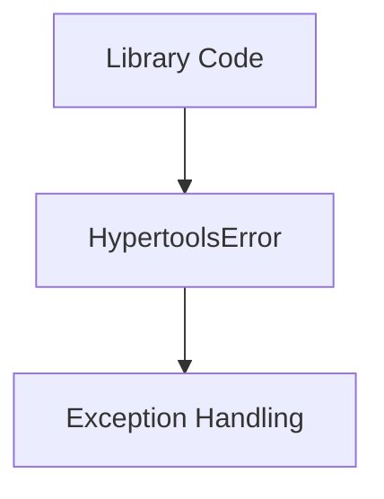
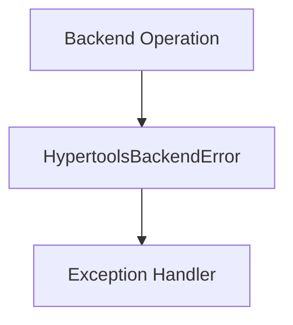
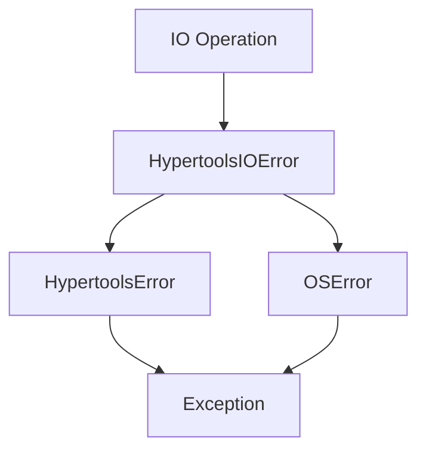

# `exceptions.py`

## `hypertools._shared.exceptions.HypertoolsError` · *class*

## Summary:
Base exception class for the hypertools library providing a common parent for library-specific exceptions.

## Description:
HypertoolsError is a simple exception class that inherits from Python's built-in Exception class. It serves as the base exception type for all custom exceptions within the hypertools library, enabling structured error handling and differentiation from standard Python exceptions.

This class is intended to be inherited by more specific exception types within the library rather than being raised directly. It provides a clear namespace for library-specific errors.

## State:
This class has no instance attributes beyond those inherited from Exception. It accepts the same constructor arguments as Exception, including an optional error message.

## Lifecycle:
Creation: Instantiate with `HypertoolsError(message)` or `HypertoolsError()` to create an exception instance.
Usage: Raise using the `raise` statement when library-specific errors occur.
Destruction: Follows standard Python exception lifecycle with automatic cleanup.

## Method Map:


## Raises:
This class does not raise exceptions during instantiation. It is designed to be raised during program execution when library logic detects an error condition.

## Example:
```python
# Basic usage
raise HypertoolsError("An error occurred in hypertools")

# In exception handling
try:
    # Some hypertools operation
    process_data(input_data)
except HypertoolsError:
    # Handle library-specific errors
    handle_library_error()
```

## `hypertools._shared.exceptions.HypertoolsBackendError` · *class*

## Summary:
Custom exception class for backend-related errors in the hypertools library.

## Description:
HypertoolsBackendError is a specialized exception type that extends HypertoolsError for handling backend-specific failures within the hypertools library. This exception should be raised when operations fail due to backend issues such as connection problems, service unavailability, or processing failures in underlying systems.

The exception serves as a distinct error type that allows callers to differentiate backend failures from other types of hypertools errors, enabling more granular error handling strategies.

## State:
- message (str): The error message describing the backend failure. Must be a string describing the specific backend issue encountered.

## Lifecycle:
Creation: Instantiate with `HypertoolsBackendError(message)` where message is a descriptive string explaining the backend error.
Usage: Raise using the `raise` statement when backend operations fail.
Destruction: Follows standard Python exception lifecycle with automatic cleanup.

## Method Map:


## Raises:
This class does not raise exceptions during initialization. It is designed to be raised during program execution when backend-specific errors occur.

## Example:
```python
# Raising the exception
raise HypertoolsBackendError("Failed to connect to database service")

# Catching the exception
try:
    perform_backend_operation()
except HypertoolsBackendError as e:
    log_error(f"Backend failure: {e.message}")
    retry_operation()
```

### `hypertools._shared.exceptions.HypertoolsBackendError.__init__` · *method*

## Summary:
Initializes a HypertoolsBackendError instance with a descriptive error message.

## Description:
The constructor for HypertoolsBackendError sets up the exception with a message describing the backend failure. This method properly initializes the parent Exception class and stores the error message as an instance attribute for later retrieval.

This method is called during exception instantiation when backend operations fail, allowing callers to access both the standard exception behavior and the specific error message through the message attribute.

## Args:
    message (str): A descriptive error message explaining the backend failure. This should clearly indicate what went wrong with the backend operation.

## Returns:
    None: This method does not return a value. It initializes the instance state.

## Raises:
    None: This method does not raise exceptions during initialization.

## State Changes:
    Attributes READ: None
    Attributes WRITTEN: 
    - self.message (str): Stores the provided error message for later access

## Constraints:
    Preconditions:
    - The message parameter must be a string describing the backend error
    - The message should be informative enough to help diagnose the backend failure
    
    Postconditions:
    - The instance is properly initialized with the provided message
    - The instance inherits all standard Exception behavior
    - The message attribute is set to the provided value

## Side Effects:
    None: This method performs no I/O operations, external service calls, or mutations to objects outside the instance.

## `hypertools._shared.exceptions.HypertoolsIOError` · *class*

## Summary:
Custom IOError exception for the hypertools library that extends both HypertoolsError and Python's built-in OSError.

## Description:
HypertoolsIOError is a specialized exception class designed to represent input/output related errors within the hypertools library. It inherits from both HypertoolsError (the library's base exception) and OSError (Python's built-in IO exception), making it compatible with both the library's exception hierarchy and standard Python IO error handling patterns.

This exception should be raised when hypertools encounters IO-related problems such as file access issues, network connectivity problems, or other input/output operations that fail during library execution. It allows for specific error handling within the library while maintaining compatibility with standard Python exception handling mechanisms.

## State:
- message (str): The error message describing the IO problem. Must be a string that will be passed to both parent constructors.
- The class maintains the standard Exception behavior with the message attribute

## Lifecycle:
Creation: Instantiate with `HypertoolsIOError(message)` where message is a descriptive string explaining the IO error.
Usage: Raise using the `raise` statement when IO operations fail within hypertools code.
Destruction: Follows standard Python exception lifecycle with automatic cleanup.

## Method Map:


## Raises:
This class does not raise exceptions during initialization. It is designed to be raised during program execution when IO-related errors occur.

## Example:
```python
# Raising the exception
raise HypertoolsIOError("Failed to read configuration file: config.json")

# Catching the exception
try:
    load_data_from_file("data.csv")
except HypertoolsIOError as e:
    print(f"IO Error occurred: {e}")
    # Handle the IO error appropriately
```

### `hypertools._shared.exceptions.HypertoolsIOError.__init__` · *method*

## Summary:
Initializes a HypertoolsIOError instance with a descriptive error message.

## Description:
Constructs a new HypertoolsIOError exception instance by calling the parent class constructors and storing the provided error message. This method serves as the primary entry point for creating IO-related exceptions within the hypertools library.

## Args:
    message (str): A descriptive error message explaining the IO operation failure. This message is stored as an instance attribute and passed to both parent constructors.

## Returns:
    None: This method initializes the object and does not return a value.

## Raises:
    None: This method does not raise any exceptions during initialization.

## State Changes:
    Attributes READ: None
    Attributes WRITTEN: 
        - self.message: Stores the provided error message for later retrieval

## Constraints:
    Preconditions:
        - The message parameter must be a string
        - The message should provide meaningful context about the IO error that occurred
    
    Postconditions:
        - The exception instance is properly initialized with the provided message
        - Both parent class constructors are called successfully
        - The message attribute is set and accessible via self.message

## Side Effects:
    None: This method performs no I/O operations or external service calls. It only initializes object state.

