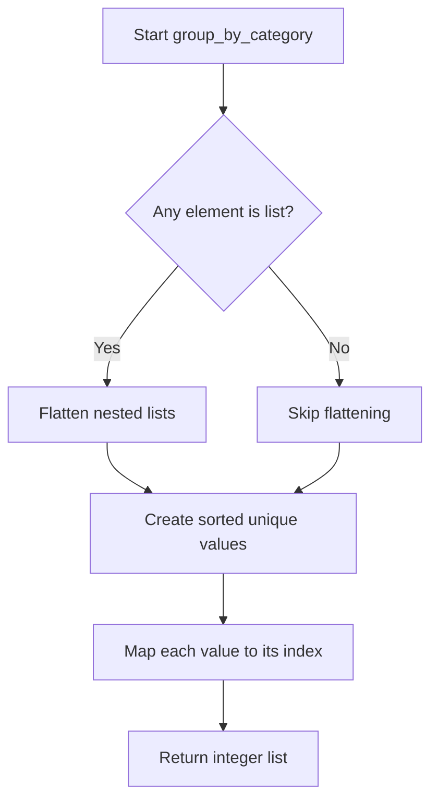
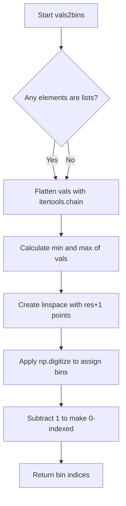
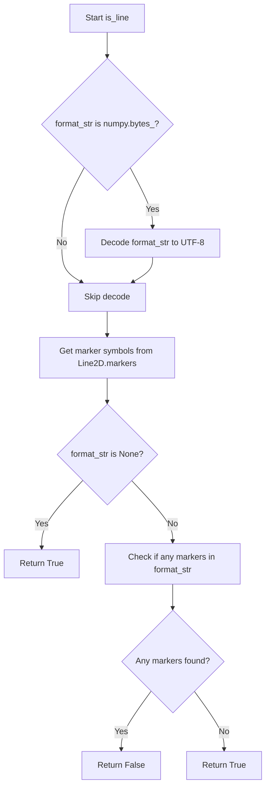
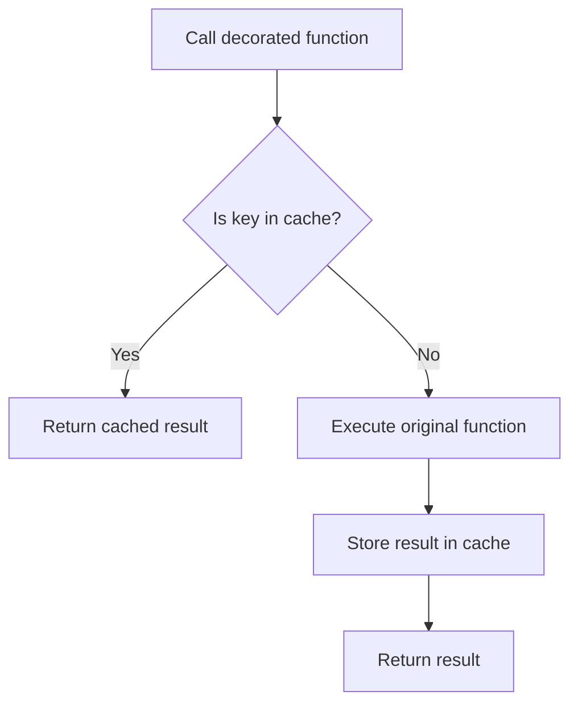

# `helpers.py`

## `hypertools._shared.helpers.center` · *function*

## Summary:
Centers a list of arrays by subtracting the mean of all arrays from each individual array.

## Description:
This function takes a list of arrays (typically NumPy arrays) and centers them by computing the mean across all arrays and subtracting this mean from each individual array. This is commonly used in data preprocessing to remove overall mean bias from datasets.

## Args:
    x (list): A list of arrays (e.g., NumPy arrays) to be centered. All arrays must have the same shape.

## Returns:
    list: A new list of arrays where each array has been centered by subtracting the mean of all input arrays.

## Raises:
    AssertionError: If the input x is not a list.

## Constraints:
    Preconditions:
        - Input x must be a list
        - All arrays in the list must have compatible shapes for vertical stacking
    Postconditions:
        - The returned list contains arrays of the same shape as the input arrays
        - Each returned array has zero mean when considered collectively

## Side Effects:
    None

## Control Flow:
```mermaid
flowchart TD
    A[Start center(x)] --> B{Is x a list?}
    B -- No --> C[Assertion Error]
    B -- Yes --> D[Stack arrays vertically]
    D --> E[Compute mean across stacked arrays]
    E --> F[Subtract mean from each array]
    F --> G[Return centered arrays]
```

## Examples:
```python
# Basic usage
data = [np.array([[1, 2], [3, 4]]), np.array([[5, 6], [7, 8]])]
centered_data = center(data)
# Result: each array will have its mean subtracted from the overall mean

# With different shaped arrays
data = [np.array([1, 2, 3]), np.array([4, 5, 6])]
centered_data = center(data)
# Result: both arrays centered around the overall mean
```

## `hypertools._shared.helpers.scale` · *function*

## Summary:
Scales input data to a [-1, 1] range using min-max normalization with a custom transformation formula.

## Description:
Applies a min-max scaling transformation to a list of numerical data, mapping values to the range [-1, 1]. This function is designed to normalize data while preserving relative relationships between values. The scaling uses the formula: 2*((x - min) / (max - min)) - 1, which maps the minimum value to -1 and maximum value to 1.

## Args:
    x (list): A list of numerical arrays or lists to be scaled. All elements must be compatible with numpy operations.

## Returns:
    list: A list of scaled arrays or lists, where each element has been transformed using the min-max scaling formula to map values to the range [-1, 1].

## Raises:
    AssertionError: If the input x is not of type list.

## Constraints:
    Preconditions:
        - Input x must be a list
        - All elements in the list must be compatible with numpy operations (arrays, lists, etc.)
        - Elements in the list should contain numerical data
    
    Postconditions:
        - Output list contains the same number of elements as the input list
        - Each element in the output list is scaled to the range [-1, 1]

## Side Effects:
    None

## Control Flow:
```mermaid
flowchart TD
    A[Start scale(x)] --> B{Input type is list?}
    B -- No --> C[Assertion Error]
    B -- Yes --> D[Stack input data]
    D --> E[Calculate min value]
    E --> F[Calculate max difference]
    F --> G[Define scaling function]
    G --> H[Apply scaling to each element]
    H --> I[Return scaled list]
```

## Examples:
    # Basic usage with numeric lists
    data = [[1, 2, 3], [4, 5, 6]]
    scaled_data = scale(data)
    # Result: each element scaled to [-1, 1] range
    
    # Usage with arrays
    data = [[10, 20], [30, 40]]
    scaled_data = scale(data)
    # Result: scaled values in [-1, 1] range

## `hypertools._shared.helpers.group_by_category` · *function*

## Summary:
Converts categorical values into numeric group identifiers by mapping each unique category to its position in a sorted list of unique values.

## Description:
This function performs categorical encoding by transforming input values into integer identifiers. It handles nested lists by flattening them first, then assigns each unique category an integer index based on its alphabetical/sorted order. This is commonly used for machine learning preprocessing where categorical features need to be converted to numerical representations.

## Args:
    vals (list): A list of values that may include nested lists. Values can be of any hashable type (strings, numbers, etc.).

## Returns:
    list[int]: A list of integer identifiers where each integer represents the group/category index of the corresponding input value. The indices are assigned based on the sorted order of unique values.

## Raises:
    None explicitly raised, but may raise exceptions from underlying operations like `sorted()` or `set()` if input contains unhashable types.

## Constraints:
    Preconditions:
    - Input `vals` must be iterable
    - All elements in `vals` must be hashable (can be added to a set)
    
    Postconditions:
    - Output list has the same length as input
    - Each returned integer is a valid index in the sorted unique values list
    - Returned integers are in the range [0, n) where n is the number of unique values

## Side Effects:
    None

## Control Flow:


## Examples:
    >>> group_by_category(['a', 'b', 'c', 'a'])
    [0, 1, 2, 0]
    
    >>> group_by_category([['a', 'b'], ['c', 'a']])
    [0, 1, 2, 0]
    
    >>> group_by_category([3, 1, 4, 1, 5])
    [1, 0, 2, 0, 3]
```

## `hypertools._shared.helpers.vals2bins` · *function*

## Summary:
Converts numerical data into discrete bin indices for histogram-style categorization.

## Description:
Transforms a collection of numerical values into discrete bin indices by creating evenly spaced bins across the range of input values. This utility function is commonly used in data visualization and analysis workflows to group continuous numerical data into categorical bins. The function automatically handles both flat lists and nested lists of numerical values, making it flexible for various data preprocessing needs.

## Args:
    vals (list): A list of numerical values or nested lists of numerical values to be binned.
    res (int): Resolution parameter specifying the number of bins to create. Defaults to 100.

## Returns:
    list[int]: A list of bin indices corresponding to each input value, where indices range from 0 to res-1. If input is empty, returns empty list.

## Raises:
    TypeError: If vals contains non-numerical values that cannot be processed by numpy functions.
    ValueError: If vals is empty or contains invalid numerical data.

## Constraints:
    Preconditions:
    - Input vals should contain numerical values that can be processed by numpy functions
    - All elements in vals must be comparable (support min/max operations)
    - res should be a positive integer
    
    Postconditions:
    - Output list length equals input list length
    - Bin indices are integers in range [0, res-1]
    - Empty input returns empty output

## Side Effects:
    None.

## Control Flow:


## Examples:
    >>> # Basic usage with flat list
    >>> vals2bins([1, 2, 3, 4, 5], res=3)
    [0, 0, 1, 1, 2]
    
    >>> # Usage with nested lists
    >>> vals2bins([[1, 2], [3, 4]], res=2)
    [0, 0, 1, 1]
    
    >>> # Empty input
    >>> vals2bins([], res=5)
    []
    
    >>> # Real-world scenario: binning age data
    >>> ages = [25, 30, 35, 40, 45, 50]
    >>> age_bins = vals2bins(ages, res=5)
    >>> print(age_bins)
    [0, 1, 2, 3, 4, 4]
```

## `hypertools._shared.helpers.interp_array` · *function*

## Summary:
Performs piecewise cubic Hermite interpolation on an array to increase its resolution.

## Description:
Interpolates the input array using PCHIP (Piecewise Cubic Hermite Interpolating Polynomial) to generate a higher-resolution version. This function is commonly used to smooth data or increase the number of data points for visualization purposes.

## Args:
    arr (array-like): Input array to be interpolated
    interp_val (int, optional): Interpolation factor determining the density of interpolated points. Defaults to 10.

## Returns:
    numpy.ndarray: Interpolated array with increased resolution. The length of the returned array depends on the input array length and interpolation factor.

## Raises:
    None explicitly raised in the function body.

## Constraints:
    Preconditions:
    - Input `arr` must be array-like and convertible to numpy array
    - `interp_val` must be a positive integer
    
    Postconditions:
    - Output array has increased resolution compared to input array
    - Interpolation preserves the general shape and trends of the original data

## Side Effects:
    None

## Control Flow:
```mermaid
flowchart TD
    A[Start interp_array] --> B[Create x = range(0, len(arr), 1)]
    B --> C[Create xx = range(0, len(arr)-1, 1/interp_val)]
    C --> D[Create PCHIP interpolator q(x) = pchip(x, arr)]
    D --> E[Return q(xx)]
```

## Examples:
```python
# Basic usage
original_data = [1, 2, 3, 4, 5]
interpolated = interp_array(original_data, interp_val=5)
# Returns array with increased resolution

# Default interpolation factor
data = [0, 1, 4, 9, 16]
result = interp_array(data)
# Returns array with increased resolution using default interp_val=10
```

## `hypertools._shared.helpers.interp_array_list` · *function*

*No documentation generated.*

## `hypertools._shared.helpers.parse_args` · *function*

## Summary:
Processes a list of items and corresponding arguments to generate argument tuples for each item, supporting both fixed arguments and per-item argument lists.

## Description:
This function takes a sequence of items (`x`) and a collection of arguments (`args`), then creates a list of argument tuples where each tuple corresponds to an item in `x`. For each argument in `args`, if it's a list or tuple, the function selects the element at the same index as the current item; otherwise, it uses the argument as-is. This allows for flexible argument specification where some arguments are constant across all items while others vary per item.

## Args:
    x (iterable): Sequence of items to process, where each item will get its own argument tuple
    args (list): List of arguments where each argument can be either:
        - A scalar value (used for all items)
        - A list/tuple of the same length as x (where each element corresponds to an item in x)

## Returns:
    list[tuple]: A list of argument tuples, where each tuple contains the processed arguments for the corresponding item in x

## Raises:
    SystemExit: When an argument list/tuple in args has a different length than x, causing the function to print an error message and exit

## Constraints:
    Preconditions:
        - All elements in args that are lists/tuples must have the same length as x
        - x must be iterable
    Postconditions:
        - Returns a list of tuples with the same length as x
        - Each tuple contains the same number of elements as the args parameter

## Side Effects:
    - Prints error message to stdout when argument validation fails
    - Exits the program with status code 1 when argument validation fails

## Control Flow:
```mermaid
flowchart TD
    A[Start parse_args] --> B{Is args[ii] list/tuple?}
    B -- Yes --> C{len(args[ii]) == len(x)?}
    C -- Yes --> D[Append args[ii][i] to tmp]
    C -- No --> E[Print error & Exit]
    B -- No --> F[Append args[ii] to tmp]
    D --> G[Next arg in args]
    F --> G
    G --> H[Append tmp tuple to args_list]
    H --> I[Next item in x]
    I --> J{More items in x?}
    J -- Yes --> B
    J -- No --> K[Return args_list]
```

## Examples:
    # Example 1: Fixed arguments for all items
    result = parse_args(['a', 'b', 'c'], [1, 2, 3])
    # Returns: [(1, 2, 3), (1, 2, 3), (1, 2, 3)]

    # Example 2: Variable arguments per item
    result = parse_args(['a', 'b', 'c'], [['x', 'y', 'z'], 2, ['p', 'q', 'r']])
    # Returns: [('x', 2, 'p'), ('y', 2, 'q'), ('z', 2, 'r')]

    # Example 3: Mixed fixed and variable arguments
    result = parse_args([1, 2], [[10, 20], 'fixed'])
    # Returns: [(10, 'fixed'), (20, 'fixed')]
```

## `hypertools._shared.helpers.parse_kwargs` · *function*

*No documentation generated.*

## `hypertools._shared.helpers.reshape_data` · *function*

## Summary:
Reorganizes data points into separate groups based on categorical labels while preserving their structure.

## Description:
Groups input data points according to their corresponding categorical labels (hue) and returns the data organized by category. This function is commonly used in visualization pipelines where data needs to be separated by discrete categories for plotting or analysis.

## Args:
    x (array-like): Input data points to be reshaped, typically a list of arrays or matrix-like objects
    hue (array-like): Categorical labels indicating which group each data point belongs to
    labels (array-like, optional): Optional labels associated with each data point. If None, defaults to None for all points

## Returns:
    tuple: A tuple containing two elements:
        - list of numpy.ndarray: Each array contains the stacked data points belonging to a specific category
        - list of lists: Each inner list contains the labels corresponding to data points in that category

## Raises:
    None explicitly raised in the function

## Constraints:
    Preconditions:
        - All inputs must be iterable
        - hue and labels must have the same length
        - x must have the same number of elements as hue
    Postconditions:
        - Output lists maintain the same order as categories derived from hue (preserving first occurrence order)
        - Each returned array contains data points from the corresponding category
        - Labels are preserved in their respective category groups

## Side Effects:
    None

## Control Flow:
```mermaid
flowchart TD
    A[Start reshape_data] --> B{labels is None?}
    B -- Yes --> C[Create labels=[None]*len(hue)]
    B -- No --> D[Use existing labels]
    C --> E[Get unique categories from hue]
    D --> E
    E --> F[Stack x data with np.vstack]
    F --> G[Initialize empty lists for each category]
    G --> H[Iterate through hue and labels]
    H --> I{Index of category in categories}
    I --> J[Append x_stacked[idx] to x_reshaped[i]]
    J --> K[Append labels[idx] to labels_reshaped[i]]
    K --> L[End iteration]
    L --> M[Stack each category's data with np.vstack]
    M --> N[Return (x_reshaped, labels_reshaped)]
```

## Examples:
    # Basic usage with data and categories
    x = [[1, 2], [3, 4], [5, 6], [7, 8]]
    hue = ['A', 'B', 'A', 'B']
    labels = ['p1', 'p2', 'p3', 'p4']
    result_x, result_labels = reshape_data(x, hue, labels)
    # Returns: ([array([[1, 2], [5, 6]]), array([[3, 4], [7, 8]])], [['p1', 'p3'], ['p2', 'p4']])
    
    # Usage with None labels
    x = [[1, 2], [3, 4], [5, 6], [7, 8]]
    hue = ['A', 'B', 'A', 'B']
    result_x, result_labels = reshape_data(x, hue, None)
    # Returns: ([array([[1, 2], [5, 6]]), array([[3, 4], [7, 8]])], [[None, None], [None, None]])

## `hypertools._shared.helpers.patch_lines` · *function*

## Summary:
In-place modifies a list of arrays by vertically stacking the first row of each subsequent array onto the preceding array.

## Description:
This function processes a list of array-like objects sequentially, modifying each element (except the last) by vertically stacking the first row of the next element onto it. It's commonly used in visualization or data processing contexts where sequential data segments need to be connected or merged.

## Args:
    x (list): A list of array-like objects that support numpy operations such as vstack and row indexing.

## Returns:
    list: The same list object with modifications made in-place. Each element (except the last) is updated to include the first row of the next element.

## Raises:
    IndexError: When attempting to access elements that don't exist or when array operations fail due to incompatible dimensions.

## Constraints:
    Preconditions:
        - Input x must be a list-like object
        - Each element in x must support numpy operations (vstack, indexing)
        - Elements should be compatible for vertical stacking operations
    
    Postconditions:
        - The returned list maintains the same length as the input
        - All elements except the last are modified in-place
        - The modification process stops before the last element

## Side Effects:
    None

## Control Flow:
```mermaid
flowchart TD
    A[Start patch_lines(x)] --> B{len(x) > 1?}
    B -- No --> C[Return x]
    B -- Yes --> D[For idx in range(len(x)-1)]
    D --> E[x[idx] = np.vstack([x[idx], x[idx+1][0,:]])]
    E --> F[idx++]
    F --> G{idx < len(x)-1?}
    G -- Yes --> D
    G -- No --> H[Return x]
```

## Examples:
    # Basic usage with numpy arrays
    import numpy as np
    data = [np.array([[1, 2], [3, 4]]), np.array([[5, 6], [7, 8]])]
    result = patch_lines(data)
    # First array becomes [[1, 2], [3, 4], [5, 6]]
    # Second array remains unchanged

## `hypertools._shared.helpers.is_line` · *function*

## Summary:
Determines whether a matplotlib format string represents a line style rather than a marker style.

## Description:
This utility function evaluates a matplotlib format string to determine if it represents a line style (such as '-', '--', ':') rather than a marker style (such as '.', 'o', 's'). It returns True when the format string is None or when it contains no marker symbols, indicating a line-style specification. This function is extracted to provide a clean interface for distinguishing between line and marker plot styles in visualization utilities.

## Args:
    format_str (str or bytes or None): A matplotlib format string or bytes object representing plot style specifications. Can be None to indicate default line styling. If provided as bytes, it must be UTF-8 decodable.

## Returns:
    bool: True if the format string represents a line style (no markers present) or if format_str is None. False if any marker symbols are found in the format string.

## Raises:
    None explicitly raised

## Constraints:
    Preconditions:
    - format_str can be None, str, or numpy.bytes_ type
    - If format_str is numpy.bytes_, it must be decodable as UTF-8
    
    Postconditions:
    - Always returns a boolean value
    - Returns True for None input or line-style format strings
    - Returns False for marker-style format strings

## Side Effects:
    None

## Control Flow:


## Examples:
    # Line styles (returns True)
    is_line(None)  # True
    is_line('-')   # True
    is_line('--')  # True
    is_line(':')   # True
    
    # Marker styles (returns False)
    is_line('.')   # False
    is_line('o')   # False
    is_line('s')   # False
    is_line('.-')  # False (contains marker '.')
```

## `hypertools._shared.helpers.memoize` · *function*

## Summary:
Creates a memoization decorator that caches function results based on input arguments.

## Description:
Implements a caching mechanism that stores previously computed results of function calls. When the same arguments are passed again, the cached result is returned instead of recomputing the function. This optimization is particularly useful for expensive function calls with repeated inputs.

## Args:
    obj (callable): The function to be decorated with memoization capabilities.

## Returns:
    callable: A decorated version of the input function with caching behavior.

## Raises:
    None explicitly raised by this function.

## Constraints:
    Preconditions:
    - The input `obj` must be a callable (function or method)
    - Arguments passed to the decorated function must be hashable (since they're converted to strings for caching keys)
    
    Postconditions:
    - The decorated function maintains the same interface as the original
    - Cached results persist for the lifetime of the decorated function object

## Side Effects:
    - Modifies the input object by adding a `.cache` attribute
    - Stores intermediate computation results in memory
    - No external I/O operations or state mutations beyond the cache

## Control Flow:


## Examples:
```python
@memoize
def expensive_function(x, y):
    # Simulate expensive computation
    return x * y + x ** 2

# First call - computes and caches result
result1 = expensive_function(2, 3)  # Computes 2*3 + 2^2 = 10

# Second call with same args - returns cached result
result2 = expensive_function(2, 3)  # Returns 10 without recomputation
```

## `hypertools._shared.helpers.get_type` · *function*

## Summary:
Determines and returns the categorical type identifier for input data structures.

## Description:
This function serves as a type classifier that examines the input data and returns a standardized string identifier representing its data type. It is designed to handle common data structures used in scientific computing and data analysis, including lists, NumPy arrays, Pandas DataFrames, strings, bytes, and custom DataGeometry objects. The function extracts type information from nested structures when appropriate, such as checking the first element of lists or array elements to determine their base type.

The logic is extracted into its own function to provide a centralized, reusable mechanism for type identification throughout the library, avoiding code duplication and ensuring consistent type classification across different modules.

## Args:
    data (any): The input data structure to classify. Can be of various supported types including lists, NumPy arrays, Pandas DataFrames, strings, bytes, or DataGeometry objects.

## Returns:
    str: A string identifier representing the data type, including:
        - 'list_str': List containing strings or bytes
        - 'list_num': List containing numbers (int or float)
        - 'list_arr': List containing NumPy arrays
        - 'arr_str': NumPy array containing strings or bytes
        - 'arr_num': NumPy array containing numbers
        - 'df': Pandas DataFrame
        - 'str': String or bytes object
        - 'geo': DataGeometry object

## Raises:
    TypeError: When the input data type is not supported. The error message specifies the supported data types: Numpy Array, Pandas DataFrame, String, List of strings, List of numbers.

## Constraints:
    Preconditions:
        - Input data must be one of the supported types
        - For list inputs, the list must not be empty (to access data[0])
        - For NumPy array inputs, the array must not be empty (to access data[0][0] for 2D arrays)
    
    Postconditions:
        - Function always returns one of the predefined string identifiers
        - Function raises TypeError for unsupported types

## Side Effects:
    None: This function performs no I/O operations or external state mutations.

## Control Flow:
```mermaid
flowchart TD
    A[get_type(data)] --> B{isinstance(data, list)?}
    B -- Yes --> C{isinstance(data[0], (str,bytes))?}
    C -- Yes --> D[return 'list_str']
    C -- No --> E{isinstance(data[0], (int,float))?}
    E -- Yes --> F[return 'list_num']
    E -- No --> G{isinstance(data[0], np.ndarray)?}
    G -- Yes --> H[return 'list_arr']
    G -- No --> I[raise TypeError]
    B -- No --> J{isinstance(data, np.ndarray)?}
    J -- Yes --> K{isinstance(data[0][0], (str,bytes))?}
    K -- Yes --> L[return 'arr_str']
    K -- No --> M[return 'arr_num']
    J -- No --> N{isinstance(data, pd.DataFrame)?}
    N -- Yes --> O[return 'df']
    N -- No --> P{isinstance(data, (str,bytes))?}
    P -- Yes --> Q[return 'str']
    P -- No --> R{isinstance(data, DataGeometry)?}
    R -- Yes --> S[return 'geo']
    R -- No --> T[raise TypeError]
```

## Examples:
```python
# Basic usage with different data types
result = get_type([1, 2, 3])  # Returns 'list_num'
result = get_type(['a', 'b', 'c'])  # Returns 'list_str'  
result = get_type(np.array([[1, 2], [3, 4]]))  # Returns 'arr_num'
result = get_type(pd.DataFrame({'A': [1, 2]}))  # Returns 'df'
result = get_type("hello")  # Returns 'str'
result = get_type(DataGeometry())  # Returns 'geo'

# Error case
try:
    get_type({"key": "value"})  # Raises TypeError
except TypeError as e:
    print(e)  # Prints error message about supported types
```

## `hypertools._shared.helpers.convert_text` · *function*

## Summary:
Converts text data (strings or lists of strings) into a NumPy array format with a single column.

## Description:
This function standardizes text-based data by converting lists of strings or string objects into NumPy arrays with shape (-1, 1). This ensures consistent data representation for downstream processing while leaving other data types unchanged. The function specifically targets text data types identified by the `get_type` helper function.

The logic is extracted into its own function to provide a clean abstraction for text data normalization, separating concerns between type detection and data transformation. This allows other components to rely on consistent text formatting without duplicating conversion logic.

## Args:
    data (any): Input data that may be a string, list of strings, or other data types. The function processes text data differently from numeric or other structured data.

## Returns:
    numpy.ndarray or original data type: Returns a NumPy array with shape (-1, 1) when input is string or list of strings. For all other data types, returns the input data unchanged.

## Raises:
    None: This function does not explicitly raise exceptions, though underlying operations may raise exceptions from numpy or get_type.

## Constraints:
    Preconditions:
        - Input data must be compatible with the `get_type` function's supported types
        - For list inputs, the list must not be empty (inherited from get_type requirements)
        
    Postconditions:
        - Text data (strings or lists of strings) is converted to NumPy array with shape (-1, 1)
        - Non-text data types remain unchanged
        - Function maintains data integrity for all processed inputs

## Side Effects:
    None: This function performs no I/O operations or external state mutations.

## Control Flow:
```mermaid
flowchart TD
    A[convert_text(data)] --> B[get_type(data)]
    B --> C{dtype in ['list_str', 'str']?}
    C -- Yes --> D[np.array(data).reshape(-1, 1)]
    C -- No --> E[return data]
    D --> F[Return reshaped array]
    E --> F
```

## Examples:
```python
# Convert list of strings to NumPy array
result = convert_text(['apple', 'banana', 'cherry'])
# Returns: array([['apple'], ['banana'], ['cherry']])

# Convert single string to NumPy array
result = convert_text('hello')
# Returns: array([['hello']])

# Non-text data remains unchanged
result = convert_text([1, 2, 3])
# Returns: [1, 2, 3] (unchanged)

result = convert_text([[1, 2], [3, 4]])
# Returns: [[1, 2], [3, 4]] (unchanged)
```

## `hypertools._shared.helpers.check_geo` · *function*

## Summary:
Processes a DataGeometry object to ensure proper string encoding by decoding bytes to strings in the reduce attribute and kwargs.

## Description:
This function sanitizes a DataGeometry object by converting any bytes objects to strings, particularly addressing encoding issues that may occur during object serialization or deserialization. It ensures that the reduce attribute and all values within the kwargs dictionary are properly decoded from bytes to strings, making the DataGeometry object usable in subsequent operations.

The function extracts this logic into a separate utility to maintain clean separation of concerns, allowing the DataGeometry class to focus on its core responsibilities while providing a standardized way to handle encoding issues that commonly arise when DataGeometry objects are serialized or loaded from files/network.

## Args:
    geo (DataGeometry): A DataGeometry object that may contain bytes-encoded attributes requiring conversion to strings. The object must have 'reduce' and 'kwargs' attributes.

## Returns:
    DataGeometry: A shallow copy of the input DataGeometry object with all bytes objects converted to strings in the reduce attribute and kwargs values. The original geo object remains unmodified.

## Raises:
    AttributeError: If the geo parameter doesn't have the expected attributes (reduce, kwargs).
    UnicodeDecodeError: If bytes in the geo object cannot be decoded to strings.

## Constraints:
    Preconditions:
    - The geo parameter must be a DataGeometry object with reduce and kwargs attributes
    - The geo.reduce attribute may be bytes or string
    - The geo.kwargs dictionary may contain bytes, lists, or arrays with bytes
    
    Postconditions:
    - The returned object is a shallow copy of the input with all bytes converted to strings
    - The original geo object remains unchanged
    - All bytes in reduce and kwargs are properly decoded

## Side Effects:
    None

## Control Flow:
```mermaid
flowchart TD
    A[Start check_geo] --> B{geo.reduce is bytes?}
    B -- Yes --> C[geo.reduce = geo.reduce.decode()]
    B -- No --> D[Skip reduce decoding]
    C --> E[Process geo.kwargs]
    D --> E
    E --> F[Iterate geo.kwargs keys]
    F --> G{kwargs[key] is not None?}
    G -- No --> H[Skip key processing]
    G -- Yes --> I{kwargs[key] is list/array?}
    I -- Yes --> J[Apply fix_list to kwargs[key]]
    I -- No --> K{kwargs[key] is bytes?}
    K -- Yes --> L[Apply fix_item to kwargs[key]]
    K -- No --> M[Skip key processing]
    J --> N[Update geo.kwargs[key]]
    L --> N
    M --> N
    N --> O[Return geo]
```

## Examples:
```python
# Basic usage with a DataGeometry object containing bytes
processed_geo = check_geo(original_geo)

# Typical usage in a deserialization pipeline
def load_and_process_geo(filename):
    with open(filename, 'rb') as f:
        geo = pickle.load(f)  # May contain bytes
    return check_geo(geo)  # Ensure proper string encoding

# Usage in a transformation pipeline where DataGeometry objects may come from serialization
def process_data_pipeline(data):
    geo = create_geo_object(data)
    # Deserialize from file or network may introduce bytes
    geo = check_geo(geo)  # Ensure proper string encoding
    return geo.transform()
```

## `hypertools._shared.helpers.get_dtype` · *function*

## Summary:
Determines and returns the data type identifier for a given input object.

## Description:
This utility function examines the type of the provided data object and returns a standardized string identifier representing its type. It serves as a type dispatcher for the hypertools library, enabling consistent type handling across different components. The function is extracted into its own utility to centralize type checking logic and avoid code duplication throughout the codebase.

## Args:
    data (Any): The input data object whose type needs to be identified.

## Returns:
    str: A string identifier representing the data type, including:
        - 'list' for Python lists
        - 'arr' for NumPy arrays
        - 'df' for Pandas DataFrames
        - 'str' for strings and bytes
        - 'geo' for DataGeometry objects

## Raises:
    TypeError: When the input data type is not supported. Supported types include: 
        Numpy Array, Pandas DataFrame, String, List of strings, List of numbers

## Constraints:
    Preconditions:
        - The input data parameter must be a valid Python object
    Postconditions:
        - Always returns one of the predefined string identifiers ('list', 'arr', 'df', 'str', 'geo')
        - Raises TypeError for any unsupported data type

## Side Effects:
    None

## Control Flow:
```mermaid
flowchart TD
    A[get_dtype(data)] --> B{isinstance(data, list)?}
    B -- Yes --> C[return 'list']
    B -- No --> D{isinstance(data, np.ndarray)?}
    D -- Yes --> E[return 'arr']
    D -- No --> F{isinstance(data, pd.DataFrame)?}
    F -- Yes --> G[return 'df']
    F -- No --> H{isinstance(data, (str, bytes))?}
    H -- Yes --> I[return 'str']
    H -- No --> J{isinstance(data, DataGeometry)?}
    J -- Yes --> K[return 'geo']
    J -- No --> L[raise TypeError]
```

## Examples:
```python
# Basic usage
get_dtype([1, 2, 3])           # Returns 'list'
get_dtype(numpy.array([1, 2])) # Returns 'arr'
get_dtype(pandas.DataFrame())   # Returns 'df'
get_dtype("hello")              # Returns 'str'
get_dtype(DataGeometry())       # Returns 'geo'

# Error case
get_dtype(42)                   # Raises TypeError
```

