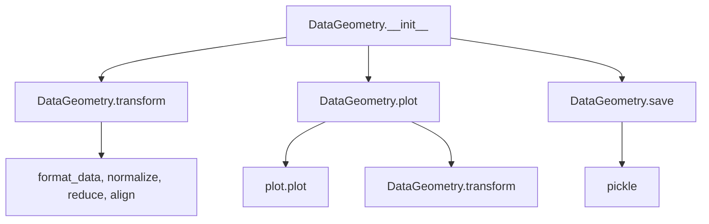

# `datageometry.py`

## `hypertools.datageometry.DataGeometry` · *class*

## Summary:
DataGeometry is a container class that manages data and its geometric transformations for visualization purposes, providing methods to manipulate, visualize, and persist data geometries.

## Description:
The DataGeometry class serves as a central data container that holds raw data, transformed data, and configuration parameters for data visualization and analysis. It encapsulates the state needed for geometric data operations and provides methods to transform data, generate visualizations, and save/load the complete state.

This class is designed to work with the hypertools library ecosystem, where data undergoes various transformations (formatting, normalization, dimensionality reduction, alignment) before being visualized. It acts as a stateful wrapper around data processing pipelines, allowing users to chain operations and maintain consistent configurations.

## State:
- fig: matplotlib figure object (optional) - stores the visualization figure
- ax: matplotlib axes object (optional) - stores the visualization axes  
- line_ani: animation object (optional) - stores animation data for animated plots
- data: raw data (list, array, or DataFrame) - original input data
- dtype: data type identifier - determined by get_dtype function
- xform_data: transformed data (list of arrays) - processed data ready for visualization
- reduce: reduction configuration (dict or str) - parameters for dimensionality reduction
- align: alignment configuration (dict or str) - parameters for data alignment
- normalize: normalization configuration (dict or str) - parameters for data normalization
- semantic: semantic analysis configuration (dict or str) - parameters for semantic processing
- vectorizer: text vectorization configuration (dict or str) - parameters for text processing
- corpus: text corpus configuration (str) - specifies corpus for semantic analysis
- kwargs: plotting configuration (dict) - additional parameters for plotting
- version: library version (str) - version of hypertools used

## Lifecycle:
Creation: Instantiate with optional parameters including data, transformation configurations, and plotting settings. Data can be provided as list of strings or other data types.

Usage: Users typically create a DataGeometry object with initial data, then call transform() to process data (either caching results or processing new data), followed by plot() to visualize it. The object can be saved with save() to persist the complete state.

Destruction: The save() method temporarily clears visualization-related attributes during serialization but restores all attributes to their original values afterward, ensuring the object remains unchanged after saving.

## Method Map:


## Raises:
- None explicitly raised by __init__ method
- The class delegates error handling to its constituent functions (format_data, normalize, reduce, align, plot)

## Example:
```python
# Create a DataGeometry object with text data
data = ["This is sample text data", "Another piece of text"]
geom = DataGeometry(data=data, reduce='IncrementalPCA', ndims=3)

# Transform the data (processes and caches the result)
transformed = geom.transform(data)

# Or retrieve cached transformed data
cached = geom.transform()  # Returns self.xform_data

# Plot the data
plot_geom = geom.plot()

# Save the object
geom.save('my_geometry.geo')
```

### `hypertools.datageometry.DataGeometry.__init__` · *method*

## Summary:
Initializes a DataGeometry object with visualization and data transformation parameters, setting up the object's state for subsequent data processing and visualization operations.

## Description:
The `__init__` method constructs a DataGeometry instance by initializing all configurable attributes. It handles special processing for text data by converting lists of strings to NumPy arrays and determines the data type using the `get_dtype` utility function. This method serves as the entry point for creating DataGeometry objects with specific configurations for data visualization and analysis workflows.

The method is separated from inline initialization logic to provide a clear, centralized location for object setup and to allow for future extension of initialization behavior without modifying the class structure directly.

## Args:
    fig (matplotlib.figure.Figure, optional): Matplotlib figure object for visualization. Defaults to None.
    ax (matplotlib.axes.Axes, optional): Matplotlib axes object for visualization. Defaults to None.
    line_ani (object, optional): Animation object for animated plots. Defaults to None.
    data (list, array, or DataFrame, optional): Raw input data for processing. Defaults to None.
    xform_data (list of arrays, optional): Pre-transformed data for visualization. Defaults to None.
    reduce (dict or str, optional): Configuration for dimensionality reduction. Defaults to None.
    align (dict or str, optional): Configuration for data alignment. Defaults to None.
    normalize (dict or str, optional): Configuration for data normalization. Defaults to None.
    semantic (dict or str, optional): Configuration for semantic analysis. Defaults to None.
    vectorizer (dict or str, optional): Configuration for text vectorization. Defaults to None.
    corpus (str, optional): Text corpus specification for semantic analysis. Defaults to None.
    kwargs (dict, optional): Additional plotting configuration parameters. Defaults to None.
    version (str, optional): Library version identifier. Defaults to __version__.
    dtype (str, optional): Explicit data type specification. Defaults to None.

## Returns:
    None: This method initializes the object's attributes and does not return a value.

## Raises:
    TypeError: When `get_dtype` encounters unsupported data types during type determination.

## State Changes:
    Attributes READ: None
    Attributes WRITTEN: 
        - self.fig
        - self.ax  
        - self.line_ani
        - self.data
        - self.dtype
        - self.xform_data
        - self.reduce
        - self.align
        - self.normalize
        - self.semantic
        - self.vectorizer
        - self.corpus
        - self.kwargs
        - self.version

## Constraints:
    Preconditions:
        - All input parameters must be compatible with their intended usage in downstream methods
        - If data is provided as a list, it should contain elements compatible with `convert_text`
        - The `version` parameter should be a valid string identifier
        
    Postconditions:
        - All provided parameters are stored as instance attributes
        - Text data lists are converted to NumPy arrays via `convert_text`
        - Data type is determined and stored in `self.dtype`
        - Object is initialized with all configuration parameters set

## Side Effects:
    None: This method performs no I/O operations or external state mutations. It only sets instance attributes.

### `hypertools.datageometry.DataGeometry.get_data` · *method*

## Summary:
Returns a shallow copy of the internal data stored in the DataGeometry object.

## Description:
This method provides controlled access to the internal data by returning a shallow copy of `self.data`. It ensures that external code cannot modify the internal state of the DataGeometry object by accident. The method is typically called during data processing pipelines when a snapshot of the current data is needed for analysis or visualization without affecting the original data.

## Args:
    None

## Returns:
    Copy of self.data with the same type as the original data. The returned object is a shallow copy, meaning nested mutable objects within the data structure are not recursively copied.

## Raises:
    None

## State Changes:
    Attributes READ: self.data
    Attributes WRITTEN: None

## Constraints:
    Preconditions: The DataGeometry object must have been properly initialized with data.
    Postconditions: The returned data is independent of the internal data, so modifications to the returned data won't affect the internal state of the DataGeometry object.

## Side Effects:
    None

### `hypertools.datageometry.DataGeometry.get_formatted_data` · *method*

## Summary:
Returns formatted data by applying the standard data formatting pipeline to the internal data attribute.

## Description:
This method provides access to the formatted version of the internal `self.data` attribute by applying the `format_data` transformation. It encapsulates the data formatting logic, ensuring consistent preprocessing of data throughout the DataGeometry class lifecycle.

The method is typically invoked during data processing workflows when raw data needs to be transformed into a standardized numerical format suitable for downstream operations such as dimensionality reduction, alignment, or visualization. This method is particularly useful in the context of the transform() method and plotting functionality where formatted data is required.

## Args:
    None

## Returns:
    list: A list of formatted data structures (typically numpy arrays) that have been processed through the format_data pipeline. Each element in the list corresponds to a formatted representation of the input data, with text data being converted to numerical representations and numerical data being appropriately structured for further analysis.

## Raises:
    None explicitly raised, though the underlying `format_data` function may raise exceptions if the data is malformed or unsupported.

## State Changes:
    Attributes READ: self.data
    Attributes WRITTEN: None

## Constraints:
    Preconditions: 
    - `self.data` must be set to a valid data structure that `format_data` can process
    - The data should be compatible with the format_data function's expectations
    
    Postconditions:
    - The returned data structure is properly formatted for subsequent processing steps
    - `self.data` remains unchanged

## Side Effects:
    None

### `hypertools.datageometry.DataGeometry.transform` · *method*

## Summary:
Transforms input data through a series of preprocessing steps including formatting, normalization, dimensionality reduction, and alignment, returning the transformed data.

## Description:
This method applies a complete data transformation pipeline to input data. When no data is provided, it returns previously transformed data stored in the instance. When data is provided, it processes the data through several stages: formatting (converting to appropriate matrix representations), normalization, dimensionality reduction, and alignment. This method serves as the primary interface for transforming data within the DataGeometry class and is typically called during data analysis workflows.

The transformation pipeline is particularly useful for preparing heterogeneous data types (text, numerical) for visualization or further analysis. It's commonly used in machine learning pipelines where data needs to be standardized and aligned across different datasets.

## Args:
    data (list, optional): Input data to transform. If None, returns cached transformed data. Defaults to None.

## Returns:
    list: Transformed data after formatting, normalization, reduction, and alignment. When data is None, returns self.xform_data.

## Raises:
    None explicitly raised, though underlying functions may raise exceptions.

## State Changes:
    Attributes READ: self.xform_data, self.semantic, self.vectorizer, self.corpus, self.normalize, self.reduce, self.align
    Attributes WRITTEN: None

## Constraints:
    Preconditions: 
    - self.reduce must be a dictionary containing 'params' with 'n_components' key when data is provided
    - self.semantic, self.vectorizer, self.corpus must be properly initialized when data is provided
    - self.normalize, self.align must be properly initialized
    
    Postconditions:
    - When data is None, returns self.xform_data unchanged
    - When data is provided, returns transformed data through the full pipeline

## Side Effects:
    None directly, but calls several external functions that may have side effects (format_data, normalize, reduce, align)

### `hypertools.datageometry.DataGeometry.plot` · *method*

## Summary:
Creates a visualization of the data stored in the DataGeometry object, applying transformations and merging configuration parameters.

## Description:
The plot method generates visualizations of the stored data by managing data transformations and combining class configuration with user-provided keyword arguments. It serves as a wrapper around the external plotting functionality while handling the internal state management of the DataGeometry object.

This method is separated from inline plotting logic to provide a clean interface for visualization that maintains the object's internal state and allows for flexible parameter passing.

## Args:
    data (array-like, optional): Alternative data to plot instead of the object's stored data. If None, uses self.data. Defaults to None.
    **kwargs: Additional keyword arguments that override class configuration parameters.

## Returns:
    DataGeometry: A new DataGeometry object containing the plot results and updated configuration, as returned by the underlying plotting function.

## Raises:
    None explicitly raised by this method.

## State Changes:
    Attributes READ: self.data, self.xform_data, self.reduce, self.align, self.normalize, self.semantic, self.vectorizer, self.corpus, self.kwargs
    Attributes WRITTEN: None (this method returns a new DataGeometry object rather than modifying the current instance)

## Constraints:
    Preconditions: The DataGeometry object must be properly initialized with valid data and configuration.
    Postconditions: Returns a new DataGeometry object with updated plotting configuration and visualization data.

## Side Effects:
    I/O: Calls external plotting functions which may create files or display figures.
    External service calls: May interact with external libraries for data processing and visualization.

### `hypertools.datageometry.DataGeometry.save` · *method*

## Summary:
Saves the DataGeometry object to a file in pickle format with .geo extension, temporarily clearing visualization and data attributes during serialization.

## Description:
This method serializes the entire DataGeometry object to disk using Python's pickle module. It handles the temporary clearing of visualization-related attributes (fig, ax, line_ani) and converts DataFrame data to dictionary format for compatibility with pickle serialization. The method ensures that the object can be properly restored later while maintaining data integrity.

## Args:
    fname (str): Path to the output file. If no .geo extension is provided, it will be automatically appended.
    compression (None): Deprecated parameter. Has no effect on serialization behavior and will be removed in future versions.

## Returns:
    None: This method does not return any value.

## Raises:
    None explicitly raised: The method does not raise any exceptions directly, though underlying file I/O operations may raise IOError or other file-related exceptions.

## State Changes:
    Attributes READ: self.fig, self.ax, self.line_ani, self.data
    Attributes WRITTEN: self.fig, self.ax, self.line_ani, self.data (temporarily cleared and restored)

## Constraints:
    Preconditions: The DataGeometry object must be properly initialized with valid attributes.
    Postconditions: The object remains unchanged after the method execution, with all attributes restored to their original values.

## Side Effects:
    I/O operation: Writes serialized object to disk using pickle module.
    Warning: Issues a FutureWarning when compression parameter is provided (deprecated functionality).

