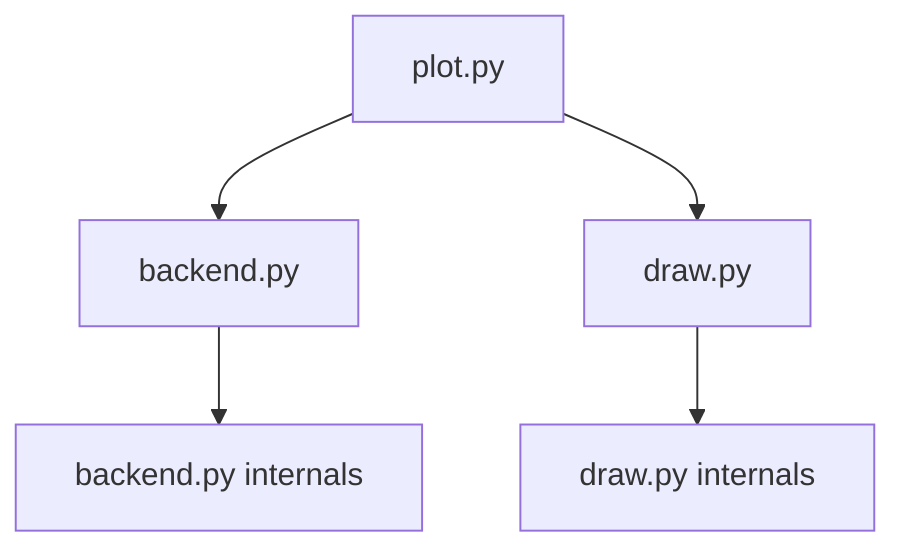

# `hypertools.plot`

## Tree:
```
plot/
├── backend.py
├── draw.py
└── plot.py
```

## Role:
Manages matplotlib backend configuration and provides a unified interface for creating multi-dimensional visualizations with support for 2D/3D plots, animations, clustering, and text processing.

## Description:
The plot module serves as the primary visualization interface for hypertools, providing a cohesive system for creating complex visualizations from diverse data types. It handles the complexity of backend management across different execution environments (Jupyter notebooks vs. regular Python) while offering a clean, intuitive API for plotting operations.

This module is organized around three core components that work together:
1. Backend management for matplotlib compatibility across environments
2. Drawing utilities for rendering visualizations  
3. Main plotting interface that orchestrates the entire visualization pipeline

The module is designed to be used by end-users who want to create visualizations without worrying about backend compatibility issues or complex data preparation steps. It automatically handles data preprocessing, dimensionality reduction, clustering, and visualization generation.

## Components:
- `backend.py`: Contains backend management classes and functions for matplotlib compatibility
  - `HypertoolsBackend`: String subclass for backend normalization and conversion
  - `BackendMapping`: Class for managing bidirectional backend mappings
  - `ParrotDict`: Dictionary subclass for backend-aware key storage
  - `set_interactive_backend`: Context manager for temporary backend switching
  - `manage_backend`: Decorator for managing matplotlib backend context
  - `_init_backend`: Initializes matplotlib backends with environment awareness
  - `_switch_backend_notebook`: Switches backends in Jupyter notebooks
  - `_switch_backend_regular`: Switches backends in regular Python environments
  - `_reset_backend_notebook`: Registers callbacks to reset backends in notebooks
  - `_null_backend_context`: Null context manager for backend operations
  - `_block_greedy_completer_execution`: Prevents conflicts with IPython completer
  - `_get_runtime_args`: Utility for argument inspection and binding

- `draw.py`: Provides drawing utilities for rendering visualizations
  - `_draw`: Core drawing function that renders plots with specified parameters

- `plot.py`: Implements the main plotting interface with data processing and visualization logic
  - `plot`: Main plotting function that handles data processing, dimensionality reduction, clustering, and visualization

### Mermaid Dependency Graph:


## Public API:
- `plot(x, **kwargs)`: Main plotting function that handles data processing, dimensionality reduction, clustering, and visualization
- `manage_backend(plot_func)`: Decorator for managing matplotlib backend context during plotting operations
- `set_interactive_backend(backend)`: Context manager for temporary backend switching
- `HypertoolsBackend`: String subclass for backend normalization and conversion
- `BackendMapping`: Class for managing bidirectional backend mappings
- `ParrotDict`: Dictionary subclass for backend-aware key storage

## Dependencies:
- Internal: `hypertools.utils` (for data processing utilities)
- External: `matplotlib`, `numpy`, `seaborn`, `scikit-learn`, `pandas`, `IPython`, `warnings`, `inspect`, `sys`, `os`, `io`, `contextlib`, `functools`, `collections`, `typing`

## Constraints:
- All plotting operations must be called after module initialization
- Backend switching requires matplotlib to be properly installed
- Interactive plotting requires appropriate matplotlib backends for the execution environment
- Animation features are limited to 3D visualizations
- Thread safety is not guaranteed for concurrent plotting operations

---

## Files

- [`backend.py`](plot/backend.md)
- [`draw.py`](plot/draw.md)
- [`plot.py`](plot/plot.md)

