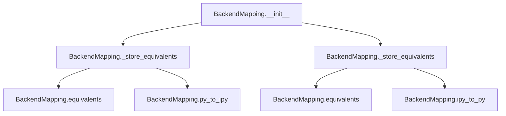
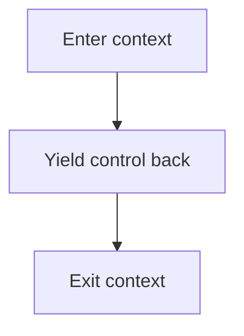

# `backend.py`

## `hypertools.plot.backend.ParrotDict` · *class*

## Summary:
A dictionary subclass that provides backend-aware key lookup and storage for HypertoolsBackend objects.

## Description:
ParrotDict is a custom dictionary implementation that extends Python's built-in dict class to provide specialized behavior for managing HypertoolsBackend objects. It ensures that all key lookups and assignments are properly handled through the HypertoolsBackend wrapper, making it suitable for storing and retrieving backend configurations in a consistent manner across different execution environments.

The class overrides standard dictionary methods to integrate seamlessly with the HypertoolsBackend type system, ensuring that keys and values maintain their backend-aware characteristics throughout dictionary operations.

## State:
- Inherits all standard dict behavior and state
- Keys and values are processed through HypertoolsBackend conversion during access operations
- Maintains all standard dictionary operations while adding backend-aware behavior

## Lifecycle:
- Creation: Instantiate with standard dict constructor arguments (*args, **kwargs)
- Usage: Access and modify dictionary entries normally; keys/values are processed through HypertoolsBackend
- No special cleanup required as it inherits standard dict behavior

## Method Map:
```mermaid
graph TD
    A[ParrotDict] --> B[__contains__]
    A --> C[__getitem__]
    A --> D[__missing__]
    A --> E[__setitem__]
    B --> F[keys()]
    C --> G[super().__getitem__]
    D --> H[HypertoolsBackend(key)]
    E --> I[HypertoolsBackend(key)]
    E --> J[HypertoolsBackend(value)]
```

## Raises:
- HypertoolsBackendError: May be raised indirectly when HypertoolsBackend constructor fails during key/value conversion

## Example:
```python
# Create a ParrotDict instance
pd = ParrotDict()

# Set items - keys and values are processed through HypertoolsBackend
pd["Agg"] = "TkAgg"

# Get items - keys are processed for lookup
value = pd["Agg"]  # Returns the value associated with the HypertoolsBackend("Agg") key

# Check membership - keys are processed for comparison
exists = "Agg" in pd  # Returns True if the HypertoolsBackend("Agg") key exists

# Operations maintain compatibility with HypertoolsBackend type system
```

### `hypertools.plot.backend.ParrotDict.__init__` · *method*

## Summary:
Initializes a ParrotDict instance by delegating initialization to its parent class.

## Description:
This constructor method sets up a ParrotDict instance by calling the parent class's initialization method with the provided arguments. It serves as a simple delegation pattern that allows ParrotDict to inherit all initialization behavior from its parent class while maintaining its own identity.

## Args:
    *args: Variable length argument list passed to the parent class constructor.
    **kwargs: Arbitrary keyword arguments passed to the parent class constructor.

## Returns:
    None: This method does not return a value.

## Raises:
    Exception: Any exceptions raised by the parent class's __init__ method.

## State Changes:
    Attributes READ: None
    Attributes WRITTEN: None

## Constraints:
    Preconditions: The parent class must be properly initialized and accept the provided arguments.
    Postconditions: The ParrotDict instance will be initialized with the same state as the parent class would provide.

## Side Effects:
    None: This method does not perform any I/O operations or mutate external state.

### `hypertools.plot.backend.ParrotDict.__contains__` · *method*

*No documentation generated.*

### `hypertools.plot.backend.ParrotDict.__getitem__` · *method*

## Summary:
Retrieves a value from the dictionary using a backend key, converting the key to a HypertoolsBackend instance for lookup.

## Description:
This method implements the `[]` operator for the ParrotDict class, enabling dictionary-style access to backend configurations. When a key is accessed, it converts the key to a HypertoolsBackend instance before performing the lookup in the parent dictionary.

The method is part of a specialized dictionary implementation designed to handle matplotlib backend specifications. It ensures that all keys are processed through the HypertoolsBackend wrapper, which provides consistent backend handling capabilities.

Known callers:
- Direct dictionary access operations like `dict[key]`
- Any code that uses bracket notation on ParrotDict instances
- Internal calls from other ParrotDict methods that require key lookup

This logic is separated into its own method because it needs to consistently convert all incoming keys to HypertoolsBackend instances before delegation to the parent dict class, ensuring uniform behavior across all dictionary operations.

## Args:
    key (Any): The key to look up in the dictionary. Any type that can be converted to a string and then to a HypertoolsBackend instance.

## Returns:
    Any: The value associated with the normalized key in the dictionary.

## Raises:
    KeyError: When the normalized key is not found in the dictionary.

## State Changes:
    Attributes READ: None
    Attributes WRITTEN: None

## Constraints:
    Preconditions:
    - The key must be convertible to a HypertoolsBackend instance
    - The parent dictionary must support the key lookup operation
    
    Postconditions:
    - The key is converted to a HypertoolsBackend instance before lookup
    - The result is returned as-is from the parent dictionary's __getitem__ method

## Side Effects:
    None

### `hypertools.plot.backend.ParrotDict.__missing__` · *method*

## Summary:
Returns a new HypertoolsBackend instance when a key is not found in the dictionary.

## Description:
This method implements the `__missing__` protocol for the ParrotDict class. When a key is accessed via `__getitem__` (bracket notation) but doesn't exist in the dictionary, Python automatically calls this method with the missing key as an argument. Instead of raising a KeyError, this implementation creates and returns a new `HypertoolsBackend` instance for the requested key.

This design enables the ParrotDict to act as a lazy factory for backend instances, allowing seamless access to backend specifications without requiring explicit initialization of all possible backends upfront.

Known callers:
- Dictionary access operations like `dict[key]` when the key is not present
- Internal calls from `__getitem__` method when a key lookup fails
- Part of the standard dictionary protocol handling in Python's mapping interface

This logic is implemented as its own method because it defines the specific behavior for handling missing keys in the ParrotDict context, which differs from standard dictionary behavior by creating HypertoolsBackend instances rather than raising exceptions.

## Args:
    key (Any): The key that was not found in the dictionary. Any type that can be converted to a string and then to a HypertoolsBackend instance.

## Returns:
    HypertoolsBackend: A new HypertoolsBackend instance created from the missing key.

## Raises:
    None: This method does not raise exceptions directly, though underlying conversions may raise exceptions.

## State Changes:
    Attributes READ: None
    Attributes WRITTEN: None

## Constraints:
    Preconditions:
    - The key must be convertible to a string and then to a HypertoolsBackend instance
    - The method assumes the key will be properly handled by HypertoolsBackend constructor
    
    Postconditions:
    - A new HypertoolsBackend instance is returned for the given key
    - The returned instance is not stored in the dictionary (this is the lazy behavior)

## Side Effects:
    None

### `hypertools.plot.backend.ParrotDict.__setitem__` · *method*

## Summary:
Sets a key-value pair in the dictionary after converting both to HypertoolsBackend objects.

## Description:
This method implements the dictionary assignment operation (`obj[key] = value`) for the ParrotDict class. It converts both the key and value to HypertoolsBackend instances before storing them in the underlying dictionary structure. This ensures consistent handling of keys and values throughout the plotting backend system.

## Args:
    key: The key to be stored, which will be converted to a HypertoolsBackend instance
    value: The value to be stored, which will be converted to a HypertoolsBackend instance

## Returns:
    None: This method doesn't return a meaningful value, but stores the converted key-value pair in the dictionary

## Raises:
    Any exceptions that may be raised by the parent class's __setitem__ method or HypertoolsBackend constructor

## State Changes:
    Attributes READ: None (reads no self attributes directly)
    Attributes WRITTEN: The underlying dictionary storage managed by the parent class

## Constraints:
    Preconditions: 
    - The key and value must be compatible with the HypertoolsBackend constructor
    - The parent class must support the __setitem__ operation
    
    Postconditions:
    - The key-value pair is stored in the dictionary with both key and value converted to HypertoolsBackend instances

## Side Effects:
    None: This method performs no I/O operations or external service calls. It only modifies the internal state of the dictionary.

## `hypertools.plot.backend.BackendMapping` · *class*

## Summary:
BackendMapping is a class that manages bidirectional mappings between Python and IPython/Jupyter backend identifiers, supporting equivalent key sets for seamless backend switching.

## Description:
The BackendMapping class facilitates backend compatibility by creating mappings between Python and IPython/Jupyter backend identifiers. It enables applications to work consistently across different execution environments (standalone Python vs. Jupyter notebooks) by maintaining equivalent key mappings. This class is particularly useful in visualization libraries that need to support multiple plotting backends while providing a unified interface.

The class accepts a dictionary where keys represent Python backend identifiers and values represent their corresponding IPython/Jupyter equivalents. It builds three internal dictionaries: py_to_ipy (Python to IPython mappings), ipy_to_py (IPython to Python mappings), and equivalents (equivalent key mappings).

## State:
- py_to_ipy (ParrotDict): Maps Python backend identifiers to their IPython/Jupyter equivalents
- ipy_to_py (ParrotDict): Maps IPython/Jupyter backend identifiers to their Python equivalents  
- equivalents (ParrotDict): Maps equivalent backend identifiers to their canonical forms

## Lifecycle:
- Creation: Instantiate with a dictionary mapping Python backend keys to IPython/Jupyter backend keys
- Usage: Access the three internal dictionaries for backend conversions
- No explicit destruction required as it inherits standard object behavior

## Method Map:


## Raises:
- HypertoolsBackendError: May be raised indirectly through ParrotDict operations when backend conversion fails

## Example:
```python
# Create a backend mapping with simple mappings
mapping = BackendMapping({
    "Agg": "nbAgg",
    "TkAgg": "TkAgg",  # Same key for both
    "Qt5Agg": ["Qt5Agg", "Qt5Agg2", "Qt5Agg3"]  # Multiple equivalents
})

# Use the mappings
python_backend = "TkAgg"
ipython_backend = mapping.py_to_ipy[python_backend]  # Returns "TkAgg"

# For equivalent keys, get the canonical form
qt5_backend = "Qt5Agg2"
canonical = mapping.equivalents[qt5_backend]  # Returns "Qt5Agg"
```

### `hypertools.plot.backend.BackendMapping.__init__` · *method*

## Summary:
Initializes a backend mapping object that establishes bidirectional relationships between Python and IPython plotting backends.

## Description:
The `__init__` method sets up the internal data structures for managing backend mappings between Python and IPython plotting environments. It creates three `ParrotDict` instances to store forward mappings, reverse mappings, and equivalent backend names respectively. The method processes a dictionary mapping that defines how Python backend identifiers correspond to IPython backend identifiers, handling cases where backends may have multiple equivalent names.

This method is designed as a dedicated initialization routine to properly set up the complex mapping relationships required for backend switching functionality in the Hypertools plotting system.

## Args:
    _dict (dict): A dictionary mapping Python backend keys to IPython backend keys. Each key-value pair represents a correspondence between backend identifiers in the two environments.

## Returns:
    None: This method initializes the object's state and does not return any value.

## Raises:
    None explicitly raised: The method does not raise any exceptions directly, though underlying operations in `ParrotDict` or `_store_equivalents` may raise `HypertoolsBackendError`.

## State Changes:
    Attributes READ: None
    Attributes WRITTEN: 
        - self.py_to_ipy: Initialized as a `ParrotDict` and populated with Python-to-IPython backend mappings
        - self.ipy_to_py: Initialized as a `ParrotDict` and populated with IPython-to-Python backend mappings  
        - self.equivalents: Initialized as a `ParrotDict` and populated with equivalent backend name mappings

## Constraints:
    Preconditions:
        - The `_dict` parameter must be a dictionary-like object with iterable items
        - Each key and value in `_dict` should be compatible with `ParrotDict` operations
    Postconditions:
        - Three `ParrotDict` instances (`py_to_ipy`, `ipy_to_py`, `equivalents`) are initialized and populated
        - Bidirectional mappings between Python and IPython backends are established
        - Equivalent backend names are stored for proper fallback handling

## Side Effects:
    None: This method performs only internal state initialization and does not cause any I/O operations, external service calls, or mutations to objects outside the instance.

### `hypertools.plot.backend.BackendMapping._store_equivalents` · *method*

## Summary:
Maps equivalent keys in backend configuration by establishing default key relationships for key equivalencies.

## Description:
Manages equivalent key mappings for backend configuration by treating the first element of an iterable as the default key and mapping all subsequent elements to it. This method is used during backend initialization to establish relationships between equivalent keys in Python and IPython backends.

## Args:
    keylist (str or Iterable[str]): Either a single string key or an iterable of string keys representing equivalent identifiers.

## Returns:
    str: The default key derived from the input keylist, which is either the first element of an iterable or the input string itself.

## Raises:
    None explicitly raised.

## State Changes:
    Attributes READ: None
    Attributes WRITTEN: self.equivalents

## Constraints:
    Preconditions: 
    - keylist must be either a string or an iterable of strings
    - If keylist is an iterable, it must be indexable (support indexing operations)
    
    Postconditions:
    - If keylist is an iterable, self.equivalents will contain mappings for all elements except the first
    - The returned value is always a string representing the default key

## Side Effects:
    None

## `hypertools.plot.backend.HypertoolsBackend` · *class*

## Summary:
A string subclass that provides backend normalization and conversion capabilities for Hypertools plotting backends between IPython and Python environments.

## Description:
The HypertoolsBackend class extends Python's built-in str class to provide specialized behavior for handling matplotlib backend specifications. It automatically intercepts string method calls and ensures their return values maintain the HypertoolsBackend type, while providing methods to normalize backend specifications based on the execution environment (notebook vs regular Python).

This class serves as a wrapper around backend identifiers that ensures consistent handling of matplotlib backends across different execution contexts, particularly when transitioning between Jupyter notebook environments and standard Python scripts. It maintains case-insensitive equality comparisons and proper hash behavior.

## State:
- Inherits all string properties and methods from str
- Implements case-insensitive equality comparison via __eq__ method
- Implements case-folded hash behavior via __hash__ method
- Overrides __getattribute__ to intercept all string method calls and wrap return values appropriately:
  * String returns are wrapped in HypertoolsBackend instances
  * Container returns (list, tuple, set) have their elements wrapped recursively
  * Other return types are returned unchanged
- Depends on global constants BACKEND_MAPPING and IS_NOTEBOOK (external dependencies)

## Lifecycle:
- Creation: Instantiate with a string backend identifier (e.g., "Agg", "TkAgg")
- Usage: Call normalize() to get appropriate backend for current environment
- No explicit destruction needed as it's a string subclass

## Method Map:
```mermaid
graph TD
    A[HypertoolsBackend] --> B[as_ipython()]
    A --> C[as_python()]
    A --> D[normalize()]
    D --> B
    D --> C
    A --> E[__getattribute__]
    E --> F[string operations returning HypertoolsBackend]
```

## Raises:
- HypertoolsBackendError: May be raised by internal operations through BACKEND_MAPPING (not directly visible in source)

## Example:
```python
# Create a backend instance
backend = HypertoolsBackend("Agg")

# Convert to IPython backend
ipython_backend = backend.as_ipython()

# Convert to Python backend  
python_backend = backend.as_python()

# Normalize for current environment
normalized = backend.normalize()

# String operations maintain HypertoolsBackend type
upper_case = backend.upper()  # Returns HypertoolsBackend instance
split_result = backend.split()  # Returns tuple of HypertoolsBackend instances
```

### `hypertools.plot.backend.HypertoolsBackend.__new__` · *method*

## Summary:
Creates a new instance of HypertoolsBackend by delegating to the parent str class constructor.

## Description:
This method overrides the standard object creation process to ensure proper instantiation of HypertoolsBackend objects. It serves as a bridge to the parent str class constructor while maintaining the specialized behavior of the HypertoolsBackend class. This method is called during object construction when creating new instances of HypertoolsBackend.

## Args:
    cls (type): The class being instantiated (HypertoolsBackend)
    x (str): The initial string value for the new HypertoolsBackend instance

## Returns:
    HypertoolsBackend: A new instance of HypertoolsBackend initialized with the provided string value

## Raises:
    TypeError: If the argument x cannot be converted to a string by the parent str class constructor

## State Changes:
    Attributes READ: None
    Attributes WRITTEN: None

## Constraints:
    Preconditions: 
    - cls must be the HypertoolsBackend class or a subclass
    - x must be convertible to a string by the str constructor
    
    Postconditions:
    - Returns a properly initialized HypertoolsBackend instance
    - The returned instance maintains all string properties and behaviors

## Side Effects:
    None

### `hypertools.plot.backend.HypertoolsBackend.__eq__` · *method*

## Summary:
Implements case-insensitive equality comparison between HypertoolsBackend instances or other objects.

## Description:
This method overrides the default equality operator (`==`) to provide case-insensitive string comparison. When comparing two HypertoolsBackend instances or a HypertoolsBackend instance with another object, it converts both to strings and performs a case-folded comparison. This allows for flexible matching regardless of case differences in backend identifiers.

The method is called during equality checks such as `obj1 == obj2` and is essential for proper backend identification and comparison in visualization contexts.

## Args:
    other (Any): Another object to compare for equality with this HypertoolsBackend instance.

## Returns:
    bool: True if the string representations of both objects (after case folding) are equal, False otherwise.

## Raises:
    None: This method does not raise any exceptions directly.

## State Changes:
    Attributes READ: None - this method only reads the string representation of self and other
    Attributes WRITTEN: None - this method does not modify any instance attributes

## Constraints:
    Preconditions: 
    - The method can accept any object as the `other` parameter
    - Both `self` and `other` must support conversion to string via `str()`
    
    Postconditions:
    - Returns a boolean value indicating case-insensitive string equality
    - The comparison is symmetric: if `a == b` then `b == a` (assuming both objects can be converted to strings)

## Side Effects:
    None: This method performs no I/O operations or external service calls. It only performs in-memory string comparisons.

### `hypertools.plot.backend.HypertoolsBackend.__getattribute__` · *method*

## Summary:
Intercepts attribute access to wrap string method results in HypertoolsBackend instances while delegating other attribute access to the parent class.

## Description:
This method overrides the standard `__getattribute__` behavior to provide enhanced string method handling. When accessing an attribute that exists on Python's built-in `str` class, it wraps the returned values in `HypertoolsBackend` instances to maintain the custom behavior throughout method chains. This enables fluent interface patterns where string operations return `HypertoolsBackend` objects instead of plain strings.

## Args:
    name (str): The name of the attribute being accessed

## Returns:
    Various: Either a wrapped method that returns `HypertoolsBackend` instances or the result from the parent class's attribute access

## Raises:
    AttributeError: When the requested attribute doesn't exist and isn't handled by the custom logic

## State Changes:
    Attributes READ: None - this method only reads the attribute name parameter
    Attributes WRITTEN: None - this method doesn't modify any instance attributes

## Constraints:
    Preconditions: The method assumes the class inherits from `str` and that `HypertoolsBackend` is properly defined
    Postconditions: String-returning methods will return `HypertoolsBackend` instances, collections containing strings will have their elements wrapped, and other return types remain unchanged

## Side Effects:
    None - This method performs no I/O operations or external service calls

### `hypertools.plot.backend.HypertoolsBackend.__hash__` · *method*

## Summary:
Computes a case-insensitive hash value for the HypertoolsBackend instance.

## Description:
This method implements a custom hash function that ensures consistency with the case-insensitive equality comparison implemented by `__eq__`. When used in hash-based collections like sets or dictionaries, this method guarantees that equivalent backend identifiers (differing only in case) will have identical hash values, enabling proper membership testing and key lookup.

The method is automatically invoked when the object is used as a dictionary key or set member, and is essential for maintaining the integrity of hash-based data structures containing `HypertoolsBackend` instances.

## Args:
    None: This is a special method that only accepts `self`.

## Returns:
    int: An integer hash value computed from the case-folded string representation of the object.

## Raises:
    None: This method does not raise any exceptions under normal circumstances.

## State Changes:
    Attributes READ: `self` - reads the instance's string representation
    Attributes WRITTEN: None - this method does not modify any instance attributes

## Constraints:
    Preconditions:
    - The object must be a valid `HypertoolsBackend` instance
    - The instance must be convertible to string via `str()`
    
    Postconditions:
    - Returns an integer hash value that is consistent with `__eq__` behavior
    - Equivalent objects (case-insensitively equal) will have identical hash values

## Side Effects:
    None: This method performs no I/O operations or external service calls. It only computes a hash value from internal string data.

### `hypertools.plot.backend.HypertoolsBackend.as_ipython` · *method*

## Summary:
Converts the current backend configuration to its IPython-compatible equivalent.

## Description:
This method transforms the current HypertoolsBackend instance into its corresponding IPython backend representation. It serves as part of the backend normalization system that adapts plotting backends based on the execution environment. This method is typically called internally by the `normalize()` method when running in a notebook environment.

## Args:
    None

## Returns:
    HypertoolsBackend: A new HypertoolsBackend instance representing the IPython-compatible version of the current backend.

## Raises:
    KeyError: If the current backend configuration is not found in the BACKEND_MAPPING equivalencies.

## State Changes:
    Attributes READ: None
    Attributes WRITTEN: None

## Constraints:
    Preconditions: The current instance must be a valid backend configuration that exists in BACKEND_MAPPING.equivalents
    Postconditions: The returned instance represents the same backend but in IPython-compatible form

## Side Effects:
    None

### `hypertools.plot.backend.HypertoolsBackend.as_python` · *method*

## Summary:
Converts an IPython backend identifier to its corresponding Python backend identifier.

## Description:
This method transforms a HypertoolsBackend instance that represents an IPython/Jupyter plotting backend into its equivalent Python-only backend representation. It uses a global backend mapping system to perform the conversion by looking up the equivalent Python backend for the current IPython backend.

## Args:
    self: HypertoolsBackend instance representing an IPython backend identifier

## Returns:
    HypertoolsBackend: A new instance representing the equivalent Python backend identifier

## Raises:
    KeyError: If the backend identifier is not found in the BACKEND_MAPPING.ipy_to_py dictionary

## State Changes:
    Attributes READ: None (method is pure)
    Attributes WRITTEN: None (method is pure)

## Constraints:
    Preconditions: 
    - The self parameter must be a valid HypertoolsBackend instance
    - The backend identifier in self must exist in BACKEND_MAPPING.equivalents
    - The equivalent Python backend must exist in BACKEND_MAPPING.ipy_to_py
    
    Postconditions:
    - Returns a new HypertoolsBackend instance with the Python backend identifier
    - The returned instance maintains the same string representation as the Python backend

## Side Effects:
    None

### `hypertools.plot.backend.HypertoolsBackend.normalize` · *method*

## Summary:
Conditionally converts the backend representation to match the current execution environment.

## Description:
This method performs environment-aware backend normalization by conditionally calling either `as_ipython()` or `as_python()` based on the `IS_NOTEBOOK` flag. When running in a notebook environment (`IS_NOTEBOOK` is True), it returns `self.as_ipython()`; otherwise, it returns `self.as_python()`. This ensures consistent backend representation across different execution contexts.

The method acts as a dispatcher that selects the appropriate backend conversion method based on the runtime environment, enabling seamless operation in both Jupyter notebooks and standard Python environments.

## Args:
    None

## Returns:
    HypertoolsBackend: A new HypertoolsBackend instance with the environment-appropriate backend representation.

## Raises:
    KeyError: If the backend conversion fails due to missing mappings in the backend mapping system during either `as_ipython()` or `as_python()` calls.

## State Changes:
    Attributes READ: None
    Attributes WRITTEN: None

## Constraints:
    Preconditions: 
    - The current instance must be a valid backend configuration
    - `IS_NOTEBOOK` must be a boolean flag determining the execution environment
    - Backend mapping system must be initialized to support conversions
    
    Postconditions:
    - Returns a new HypertoolsBackend instance with normalized backend representation
    - The result is appropriate for the current execution environment

## Side Effects:
    None

## `hypertools.plot.backend._init_backend` · *function*

## Summary:
Initializes matplotlib backends for hypertools plotting with environment-aware selection and fallback mechanisms.

## Description:
The `_init_backend` function configures matplotlib backends for the hypertools plotting system by detecting the execution environment (notebook vs regular Python) and selecting appropriate plotting backends with graceful fallbacks. It handles both interactive and static backend selection, manages environment variable overrides, and sets up necessary global state variables for backend management.

This function is extracted into its own component to encapsulate the complex logic of backend detection, selection, and initialization, separating concerns from the main plotting functionality and ensuring consistent backend setup across different execution contexts.

## Args:
    None

## Returns:
    None

## Raises:
    None explicitly raised: This function does not raise exceptions directly, though underlying operations may raise exceptions that are handled internally.

## Constraints:
    Preconditions:
        - Matplotlib must be properly installed and importable
        - The function must be called during module initialization
        - Environment variables like HYPERTOOLS_BACKEND may be set to override default backend selection
        
    Postconditions:
        - Global variables are set: BACKEND_MAPPING, BACKEND_WARNING, HYPERTOOLS_BACKEND, IPYTHON_INSTANCE, IS_NOTEBOOK, reset_backend, switch_backend
        - The matplotlib backend is properly configured for the current environment
        - Appropriate callback mechanisms are established for notebook environments

## Side Effects:
    - Modifies global variables including BACKEND_MAPPING, BACKEND_WARNING, HYPERTOOLS_BACKEND, IPYTHON_INSTANCE, IS_NOTEBOOK, reset_backend, switch_backend
    - Changes matplotlib backend state through mpl.use() calls
    - May issue warnings via the warnings module when fallbacks occur
    - Calls _block_greedy_completer_execution() in non-notebook environments

## Control Flow:
```mermaid
flowchart TD
    A[Start _init_backend] --> B{get_ipython() available?}
    B -- No --> C[_block_greedy_completer_execution]
    C --> D[IS_NOTEBOOK = False]
    D --> E[Define backend priority list]
    E --> F{HYPERTOOLS_BACKEND env var set?}
    F -- Yes --> G[Reorder backends with env var first]
    G --> H[Iterate through backends]
    H --> I{mpl.use(b) succeeds?}
    I -- Yes --> J[Set working_backend = b]
    I -- No --> K[Continue to next backend]
    K --> L{All backends exhausted?}
    L -- Yes --> M[Set fallback to 'Agg' backend]
    M --> N[Issue warning if env var not matched]
    N --> O[Set switch_backend = reset_backend = _switch_backend_regular]
    O --> P[End]
    B -- Yes --> Q[IS_NOTEBOOK = True]
    Q --> R[Try mpl.use('nbAgg')]
    R --> S{ImportError?}
    S -- Yes --> T[Set working_backend = 'inline']
    T --> U[Set warning about nbAgg failure]
    U --> V[Set switch_backend = _switch_backend_notebook]
    V --> W[Set reset_backend = _reset_backend_notebook]
    S -- No --> X[Set working_backend = 'nbAgg']
    X --> Y[Set switch_backend = _switch_backend_notebook]
    Y --> Z[Set reset_backend = _reset_backend_notebook]
    Z --> P
    P --> AA[Restore original backend]
    AA --> AB[Set BACKEND_MAPPING]
    AB --> AC[Set HYPERTOOLS_BACKEND]
```

## Examples:
```python
# This function is typically called during module initialization
# and is not meant to be called directly by users

# In a regular Python environment:
# - Attempts backends in order: TkAgg, QtAgg, Qt5Agg, etc.
# - Falls back to 'Agg' if none work
# - Sets up regular backend switching functions

# In a Jupyter notebook:
# - Attempts 'nbAgg' backend first
# - Falls back to 'inline' if 'nbAgg' is not available
# - Sets up notebook-specific backend switching and reset functions
```

## `hypertools.plot.backend._block_greedy_completer_execution` · *function*

## Summary:
Blocks execution when IPython's greedy completer is active by clearing specific modules from sys.modules and raising an exception.

## Description:
This function detects when IPython's greedy completer is actively running in the call stack and prevents potential conflicts by removing key modules from the Python module cache. It serves as a workaround for compatibility issues between hypertools plotting functionality and IPython's autocompletion system.

## Args:
    None

## Returns:
    None

## Raises:
    Exception: Raised when IPython's greedy completer is detected in the call stack, indicating that the function successfully identified and blocked the completer execution.

## Constraints:
    Preconditions:
    - The function must be called within a context where IPython's completer might interfere with plotting operations
    - The function relies on Python's traceback module to inspect the call stack
    
    Postconditions:
    - When triggered, the function removes 'hypertools.plot', 'hypertools.plot.backend', and 'numpy' from sys.modules
    - The function terminates execution by raising an exception when the completer is detected

## Side Effects:
    - Modifies sys.modules by removing entries for 'hypertools.plot', 'hypertools.plot.backend', and 'numpy'
    - Raises an exception that may interrupt normal program flow
    - May affect subsequent imports of the removed modules

## Control Flow:
```mermaid
flowchart TD
    A[Start function] --> B{Traceback stack available?}
    B -- Yes --> C[Get stack trace (-4::-1)]
    C --> D{Completer module found?}
    D -- No --> E[Return normally]
    D -- Yes --> F[Remove modules from sys.modules]
    F --> G[Raise Exception]
    E --> H[End]
    G --> H
```

## Examples:
```python
# This function is typically called internally by plotting functions
# and would not normally be called directly by users

# Example of internal usage pattern:
# When IPython's completer is active, this function prevents conflicts
# by clearing modules from sys.modules and raising an exception
```

## `hypertools.plot.backend._switch_backend_regular` · *function*

## Summary:
Switches the matplotlib plotting backend to the specified backend with enhanced error handling.

## Description:
This function provides a robust mechanism for switching matplotlib plotting backends. It converts the provided backend object to its Python representation and attempts to switch the matplotlib backend. The function implements specialized error handling for missing dependencies versus other unexpected errors, providing more informative error messages to users.

## Args:
    backend: A backend object that must have an `as_python()` method returning a string representation of the backend name.

## Returns:
    None: This function does not return any value.

## Raises:
    HypertoolsBackendError: Raised when switching the plotting backend fails. This includes two specific cases:
        - When ImportError or ModuleNotFoundError occurs (indicating missing dependencies or unavailable backend)
        - When any other exception occurs during backend switching (general unexpected errors)

## Constraints:
    Preconditions:
        - The backend parameter must have an `as_python()` method that returns a valid matplotlib backend string
        - The matplotlib library must be properly installed
    Postconditions:
        - The matplotlib backend has been switched to the requested backend (if successful)
        - If an error occurs, a HypertoolsBackendError is raised with a descriptive message

## Side Effects:
    - Modifies the global matplotlib backend state
    - May trigger matplotlib's backend initialization process

## Control Flow:
```mermaid
flowchart TD
    A[Start _switch_backend_regular] --> B{backend.as_python()}
    B --> C[plt.switch_backend(backend)]
    C --> D{Exception Occurred?}
    D -->|Yes| E{isinstance(e, ImportError or ModuleNotFoundError)?}
    E -->|Yes| F[Create specific error message]
    E -->|No| G[Create general error message]
    F --> H[Raise HypertoolsBackendError]
    G --> H
    D -->|No| I[Return None]
```

## Examples:
```python
# Switching to a valid backend
_switch_backend_regular("Agg")

# This would raise HypertoolsBackendError with specific message
# if the backend is not available or dependencies are missing
try:
    _switch_backend_regular("NonExistentBackend")
except HypertoolsBackendError as e:
    print(f"Backend switching failed: {e}")
```

## `hypertools.plot.backend._switch_backend_notebook` · *function*

## Summary:
Switches the matplotlib plotting backend in a Jupyter notebook environment, handling various error conditions and fallback mechanisms.

## Description:
This function manages the switching of matplotlib plotting backends specifically within Jupyter notebook environments using IPython magic commands. It attempts to set the specified backend and provides comprehensive error handling including fallback to regular backend switching when GUI toolkit conflicts occur.

## Args:
    backend: A backend object that must have an `as_ipython()` method returning a string representation of the backend name for IPython environments.

## Returns:
    None: This function does not return any value.

## Raises:
    ValueError: Raised when the specified backend is not a valid IPython plotting backend, with detailed information about available backends.
    HypertoolsBackendError: Raised when switching backends fails via both IPython and regular methods, providing detailed error context.

## Constraints:
    Preconditions:
        - The backend parameter must have an `as_ipython()` method that returns a valid IPython matplotlib backend string
        - IPYTHON_INSTANCE must be properly initialized in the Jupyter environment
        - The matplotlib library must be properly installed
    Postconditions:
        - The matplotlib backend has been switched to the requested backend (if successful)
        - If successful, the appropriate cleanup of figure flushing callbacks is performed

## Side Effects:
    - Modifies the global matplotlib backend state through IPython magic commands
    - May unregister figure flushing callbacks from IPython events
    - Captures and processes stdout output from IPython magic commands

## Control Flow:
```mermaid
flowchart TD
    A[Start _switch_backend_notebook] --> B[Convert backend to IPython format using as_ipython()]
    B --> C[Redirect stdout to StringIO buffer]
    C --> D[Try run_line_magic('matplotlib', backend)]
    D --> E{KeyError raised?}
    E -->|Yes| F[Run line magic with '-l' flag to show available backends]
    E -->|No| G[Get stdout output and check for warnings]
    G --> H{Output starts with warning about GUI toolkit?}
    H -->|Yes| I[Try fallback to _switch_backend_regular]
    I --> J{HypertoolsBackendError raised?}
    J -->|Yes| K[Raise HypertoolsBackendError with detailed context]
    H -->|No| L[Check if backend != 'inline']
    L --> M{flush_figures in post_execute callbacks?}
    M -->|Yes| N[Unregister flush_figures from post_execute events]
```

## Examples:
```python
# Switch to a valid backend
_switch_backend_notebook(my_backend_object)

# This would raise ValueError if backend is invalid
try:
    _switch_backend_notebook(invalid_backend)
except ValueError as e:
    print(f"Invalid backend: {e}")

# This would raise HypertoolsBackendError if both IPython and regular switching fail
try:
    _switch_backend_notebook(conflicting_backend)
except HypertoolsBackendError as e:
    print(f"Backend switching failed: {e}")
```

## `hypertools.plot.backend._reset_backend_notebook` · *function*

## Summary:
Registers a callback to reset the matplotlib backend in a Jupyter notebook before each cell execution.

## Description:
This function establishes a callback mechanism that ensures proper matplotlib backend management in Jupyter notebook environments. It registers a callback with IPython's event system that will execute a backend reset operation before each notebook cell runs, preventing conflicts that can arise from switching backends during interactive sessions.

## Args:
    backend: A backend object that must have an `as_ipython()` method returning a string representation of the matplotlib backend for IPython environments.

## Returns:
    None: This function does not return any value.

## Raises:
    None explicitly raised: This function doesn't contain explicit try/except blocks for raising exceptions.

## Constraints:
    Preconditions:
        - The backend parameter must have an `as_ipython()` method that returns a valid IPython matplotlib backend string
        - IPYTHON_INSTANCE must be available in the runtime environment (typically in Jupyter notebooks)
        - The `_switch_backend_notebook` function must be defined and accessible in the same scope
    Postconditions:
        - A callback function `_deferred_reset_cb` is registered with IPython's `pre_run_cell` event system
        - The callback will execute `_switch_backend_notebook(backend)` before each cell execution
        - The callback registration is idempotent (will not register duplicates)

## Side Effects:
    - Modifies IPython's event handling system by registering a callback with `pre_run_cell` events
    - The registered callback will unregister itself after executing once (through `_switch_backend_notebook` call)
    - May affect timing of notebook cell execution due to additional event handling

## Control Flow:
```mermaid
flowchart TD
    A[Start _reset_backend_notebook] --> B[Call backend.as_ipython()]
    B --> C[Check if _deferred_reset_cb already registered]
    C --> D{Is callback already registered?}
    D -->|Yes| E[Return without changes]
    D -->|No| F[Register _deferred_reset_cb with pre_run_cell event]
    F --> G[Callback executes _switch_backend_notebook(backend)]
    G --> H[Callback unregisters itself from pre_run_cell events]
```

## Examples:
```python
# Typical usage in a Jupyter notebook context
from hypertools.plot.backend import _reset_backend_notebook

# Reset backend to 'inline' for notebook display
backend_obj = SomeBackendObject()  # Must have as_ipython() method
_reset_backend_notebook(backend_obj)

# The callback will automatically execute before each cell
# and reset the backend to the specified value
```

## `hypertools.plot.backend._get_runtime_args` · *function*

## Summary:
Returns a dictionary of all argument names and their values for a given function, including default values for unspecified arguments.

## Description:
This utility function extracts and binds all arguments for a given function, applying default values where necessary. It enables argument inspection and manipulation by providing a standardized way to access function arguments regardless of how they were originally passed (positional vs keyword). This function is particularly useful for argument validation, debugging, and creating wrappers around functions.

## Args:
    func (callable): The function whose signature and arguments are being processed
    *func_args (tuple): Positional arguments passed to the function
    **func_kwargs (dict): Keyword arguments passed to the function

## Returns:
    dict: A dictionary mapping argument names to their resolved values, including default values for missing arguments. The keys are argument names and values are the corresponding argument values.

## Raises:
    TypeError: When the provided arguments don't match the function signature. This occurs when:
        - Too many positional arguments are provided
        - Unexpected keyword arguments are passed
        - Required arguments are missing

## Constraints:
    Preconditions:
        - The `func` parameter must be a callable object (function, method, etc.)
        - All provided arguments must be compatible with the function signature
    Postconditions:
        - The returned dictionary will contain all parameters defined in the function signature
        - Default values are applied for any arguments not provided in func_args or func_kwargs
        - The returned dictionary contains exactly one entry for each parameter in the function signature

## Side Effects:
    None

## Control Flow:
```mermaid
flowchart TD
    A[Start _get_runtime_args] --> B[Get function signature using inspect.signature]
    B --> C[Bind provided arguments using signature.bind]
    C --> D{Binding successful?}
    D -->|Yes| E[Apply default values using bind.apply_defaults()]
    E --> F[Return bound arguments.arguments]
    D -->|No| G[Raise TypeError from binding failure]
    G --> H[End with exception]
    F --> I[End successfully]
```

## Examples:
    # Basic usage with positional and keyword arguments
    def sample_func(a, b=10, c=20):
        return a + b + c
    
    args = _get_runtime_args(sample_func, 5, c=30)
    # Returns: {'a': 5, 'b': 10, 'c': 30}
    
    # Usage with only defaults (will raise TypeError if 'a' is required)
    try:
        args = _get_runtime_args(sample_func)
    except TypeError as e:
        print(f"Missing required argument: {e}")

## `hypertools.plot.backend.set_interactive_backend` · *class*

## Summary:
Context manager class for temporarily setting and restoring matplotlib interactive backends in Hypertools plotting.

## Description:
The `set_interactive_backend` class provides a context manager interface for temporarily switching matplotlib backends during interactive plotting operations. It ensures that backend changes are properly managed and restored when exiting the context, preventing side effects on the global matplotlib configuration.

This class is designed to handle backend switching in a controlled manner, particularly useful when working with different execution environments (Jupyter notebooks vs. regular Python scripts) where different backends may be preferred or required.

## State:
- `old_interactive_backend`: Stores the normalized version of the current backend configuration (type: HypertoolsBackend)
- `old_backend_warning`: Stores the previous backend warning state (type: varies)
- `new_interactive_backend`: The target backend to switch to, normalized for current environment (type: HypertoolsBackend)
- `new_is_different`: Boolean flag indicating if new backend differs from current (type: bool)
- `backend_switched`: Boolean flag tracking if backend was actually switched (type: bool)
- `curr_backend`: Current backend at context entry, normalized for current environment (type: HypertoolsBackend)
- Global variables modified:
  - `BACKEND_WARNING`: Backend warning state
  - `HYPERTOOLS_BACKEND`: Current Hypertools backend configuration
  - `IN_SET_CONTEXT`: Flag indicating if backend is currently being set

## Lifecycle:
- Creation: Instantiate with a backend string parameter
- Usage: Use as context manager (`with set_interactive_backend(backend): ...`)
- Destruction: Automatically restores previous backend configuration upon exit

## Method Map:


## Raises:
- HypertoolsBackendError: May be raised during backend normalization if invalid backend is specified

## Example:
```python
# Temporarily switch to TkAgg backend for interactive plotting
with set_interactive_backend("TkAgg"):
    # All plotting operations here use TkAgg backend
    plt.plot([1, 2, 3], [1, 4, 9])
    plt.show()

# Backend automatically restored to previous setting
```

### `hypertools.plot.backend.set_interactive_backend.__enter__` · *method*

## Summary:
Configures matplotlib backend for interactive plotting when entering a context manager.

## Description:
This method is invoked when entering a context manager that handles matplotlib backend switching. It records the current backend state and conditionally switches to an interactive backend if the current one differs from the target interactive backend. This method is automatically called during `with` statement entry.

## Args:
    None

## Returns:
    None

## Raises:
    None explicitly raised

## State Changes:
    Global variables modified: IN_SET_CONTEXT is set to True
    Instance attributes accessed: self.new_interactive_backend, self.curr_backend (assumed to exist)
    Instance attributes modified: self.curr_backend, self.backend_switched (assumed to exist)

## Constraints:
    Preconditions: The context manager instance must be properly initialized with required backend configuration.
    Postconditions: The current backend is recorded and backend switching status is tracked.

## Side Effects:
    Modifies global state by setting IN_SET_CONTEXT to True
    Potentially calls matplotlib's switch_backend function to change plotting backend
    Invokes HypertoolsBackend.normalize() method on current backend string

### `hypertools.plot.backend.set_interactive_backend.__exit__` · *method*

## Summary:
Restores the previous matplotlib backend configuration when exiting a context manager block.

## Description:
This method is the `__exit__` dunder method of the `set_interactive_backend` context manager class. It restores the original matplotlib backend settings when leaving the context block, ensuring proper cleanup of backend state changes made during context execution.

## Args:
    exc_type (type): Exception type if an exception was raised in the context, None otherwise
    exc_value (Exception): Exception value if an exception was raised in the context, None otherwise  
    traceback (traceback): Traceback object if an exception was raised in the context, None otherwise

## Returns:
    None: This method does not return any value

## Raises:
    None: This method does not explicitly raise exceptions

## State Changes:
    Attributes READ: 
    - self.new_is_different
    - self.old_interactive_backend  
    - self.old_backend_warning
    - self.backend_switched
    - self.curr_backend
    
    Attributes WRITTEN:
    - IN_SET_CONTEXT (global variable)
    - HYPERTOOLS_BACKEND (global variable)
    - BACKEND_WARNING (global variable)

## Constraints:
    Preconditions:
    - The context manager must have been entered via `__enter__` method
    - Instance attributes must be properly initialized from the `__init__` method
    - Global variables BACKEND_WARNING, HYPERTOOLS_BACKEND, and IN_SET_CONTEXT must be defined
    
    Postconditions:
    - The global IN_SET_CONTEXT flag is set to False
    - If the backend was changed during context entry, it's restored to the original backend
    - If a backend switch occurred during context execution, the original backend is restored

## Side Effects:
    - Modifies global variables: IN_SET_CONTEXT, HYPERTOOLS_BACKEND, BACKEND_WARNING
    - Calls reset_backend function (external to this method) to restore matplotlib backend

## `hypertools.plot.backend._null_backend_context` · *function*

## Summary:
Provides a no-operation context manager for matplotlib backend handling when no special backend configuration is required.

## Description:
This function serves as a null context manager that yields control back to the caller without performing any backend-specific operations. It's designed to be used in plotting workflows where a backend context manager is expected but no actual backend manipulation is needed. This function implements the context manager protocol through a generator that yields control back to the caller.

## Args:
    dummy_backend (any): A parameter that would typically represent a backend configuration, but is unused in the implementation. This parameter likely exists to maintain a consistent interface with other backend context managers in the system.

## Returns:
    Generator: A generator object that yields control back to the caller. The generator produces no meaningful values.

## Raises:
    None: This function does not raise any exceptions.

## Constraints:
    Preconditions: None - the function accepts any value for dummy_backend
    Postconditions: None - the function simply yields control back to the caller

## Side Effects:
    None: This function performs no I/O operations or external state mutations.

## Control Flow:


## Examples:
```python
# Typical usage in a plotting workflow
with _null_backend_context(None):
    # Plotting operations here
    plt.plot([1, 2, 3], [1, 4, 9])
```

## `hypertools.plot.backend.manage_backend` · *function*

## Summary:
Decorator function that manages matplotlib backend context for plotting operations, ensuring proper backend selection and restoration.

## Description:
The `manage_backend` function is a decorator that wraps plotting functions to handle matplotlib backend management. It intelligently selects and switches matplotlib backends based on plot parameters (like animate or interactive flags) and ensures proper restoration of the original matplotlib configuration after plotting operations complete.

This function extracts the logic for backend management into a reusable decorator, separating concerns between the actual plotting logic and the backend configuration management. This improves code organization and prevents backend configuration pollution across different plotting operations.

## Args:
    plot_func (callable): The plotting function to be decorated and wrapped with backend management logic.

## Returns:
    callable: A wrapped version of the input plotting function with enhanced backend management capabilities.

## Raises:
    HypertoolsBackendError: Raised by internal backend normalization operations when invalid backend configurations are encountered.

## Constraints:
    Preconditions:
        - The input `plot_func` must be a callable that accepts arbitrary arguments and keyword arguments
        - The matplotlib library must be properly imported and available (referenced as `mpl` in code)
        - Required global constants and helper functions must be defined in the module scope
        - The `IN_SET_CONTEXT` global variable must be properly defined
        
    Postconditions:
        - The original matplotlib rcParams are preserved and restored after execution
        - The matplotlib backend context is properly managed and restored
        - The wrapped function behaves identically to the original function in terms of inputs and outputs

## Side Effects:
    - Modifies matplotlib's rcParams temporarily during execution
    - May change matplotlib's active backend during execution when interactive/animation features are enabled
    - Issues warnings when BACKEND_WARNING is configured
    - May flush matplotlib figures in certain execution contexts

## Control Flow:
```mermaid
flowchart TD
    A[manage_backend called with plot_func] --> B[plot_wrapper created]
    B --> C[Copy current rcParams to old_rcParams]
    C --> D[Initialize backend_context to _null_backend_context]
    D --> E[Initialize tmp_backend to None]
    E --> F{IN_SET_CONTEXT is False?}
    F -->|Yes| G[Get runtime arguments using _get_runtime_args]
    G --> H{animate OR interactive flag set?}
    H -->|Yes| I[Get current backend with HypertoolsBackend(mpl.get_backend()).normalize()]
    I --> J[Get mpl_backend parameter from kwargs]
    J --> K{mpl_backend is 'auto'?}
    K -->|Yes| L[Set tmp_backend to HYPERTOOLS_BACKEND.normalize()]
    L --> M[Check if tmp_backend not in ('disable', curr_backend)]
    M -->|Yes| N[Set backend_context to set_interactive_backend]
    N --> O[Enter backend_context with tmp_backend]
    O --> P{BACKEND_WARNING is not None?}
    P -->|Yes| Q[Issue warning using warnings.warn]
    Q --> R[Execute original plot_func with *args, **kwargs]
    R --> S[Restore rcParams in finally block]
    S --> T[Return plot_func result]
    H -->|No| U[Use _null_backend_context]
    U --> V[Enter _null_backend_context]
    V --> W[Execute original plot_func with *args, **kwargs]
    W --> X[Restore rcParams in finally block]
    X --> Y[Return plot_func result]
    F -->|No| Z[Use _null_backend_context]
    Z --> AA[Enter _null_backend_context]
    AA --> AB[Execute original plot_func with *args, **kwargs]
    AB --> AC[Restore rcParams in finally block]
    AC --> AD[Return plot_func result]
```

## Examples:
```python
# Basic usage as decorator
@manage_backend
def my_plot_function(data, animate=False, interactive=False):
    # Plotting logic here
    plt.plot(data)
    return plt.gcf()

# Usage with backend specification
@manage_backend
def animated_plot(data, animate=True, mpl_backend='auto'):
    # This will use auto backend selection for animation
    plt.plot(data)
    return plt.gcf()

# The decorator ensures proper backend handling even when called multiple times
fig1 = my_plot_function([1, 2, 3])
fig2 = my_plot_function([4, 5, 6])
```

