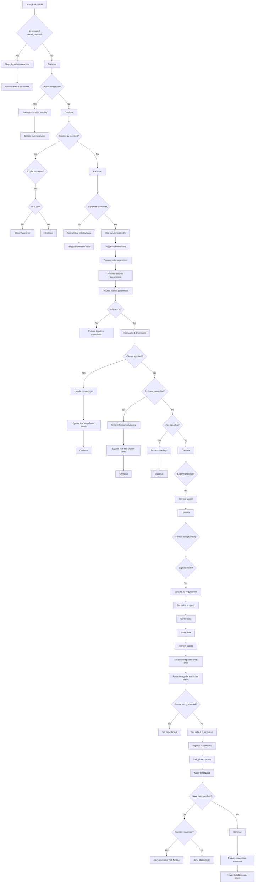

# `plot.py`

## `hypertools.plot.plot.plot` · *function*

## Summary:
Creates multi-dimensional visualizations of data with support for 2D/3D plots, animations, clustering, and text processing.

## Description:
The `plot` function serves as the primary interface for creating visualizations in the hypertools library. It handles diverse data types including numerical arrays, text data, and mixed data formats, applying appropriate preprocessing, dimensionality reduction, and clustering before generating plots. The function supports both static and animated visualizations with extensive customization options for appearance and behavior.

## Args:
    x: Input data to be plotted, which can be numerical arrays, text strings, or mixed data types
    fmt (str, optional): Matplotlib format string for line/marker styles. Defaults to '-'
    marker (str, optional): Single marker style for all data series
    markers (list, optional): List of marker styles for individual data series
    linestyle (str, optional): Single line style for all data series
    linestyles (list, optional): List of line styles for individual data series
    color (str, optional): Single color for all data series
    colors (list, optional): List of colors for individual data series
    palette (str, optional): Seaborn color palette name. Defaults to 'hls'
    group (str, optional): Deprecated alias for hue parameter
    hue (list, optional): Categorical grouping for data series
    labels (list, optional): Labels for individual data points
    legend (bool or list, optional): Whether to display legend or specific legend items
    title (str, optional): Plot title
    size (tuple, optional): Figure size as (width, height)
    elev (int, optional): Elevation angle for 3D plots. Defaults to 10
    azim (int, optional): Azimuth angle for 3D plots. Defaults to -60
    ndims (int, optional): Number of dimensions for visualization. Defaults to 3
    model (str, optional): Deprecated model parameter for dimensionality reduction
    model_params (dict, optional): Deprecated model parameters for dimensionality reduction
    reduce (str or dict, optional): Dimensionality reduction method. Defaults to 'IncrementalPCA'
    cluster (str or dict, optional): Clustering method for grouping data
    align (str or dict, optional): Alignment method for data
    normalize (bool or dict, optional): Normalization method for data
    n_clusters (int, optional): Number of clusters for KMeans clustering
    save_path (str, optional): Path to save the plot
    animate (bool or str, optional): Enable animation ('parallel', 'spin') or disable. Defaults to False
    duration (int, optional): Animation duration in seconds. Defaults to 30
    tail_duration (int, optional): Duration of animation trail. Defaults to 2
    rotations (int, optional): Number of rotations for spinning animations. Defaults to 2
    zoom (float, optional): Zoom level for 3D plots. Defaults to 1
    chemtrails (bool, optional): Enable chemtrail effect in animations. Defaults to False
    precog (bool, optional): Enable precognition effect in animations. Defaults to False
    bullettime (bool, optional): Enable bullet-time effect in animations. Defaults to False
    frame_rate (int, optional): Frame rate for animations. Defaults to 50
    interactive (bool, optional): Enable interactive plotting. Defaults to False
    explore (bool, optional): Enable exploration mode for 3D plots. Defaults to False
    mpl_backend (str, optional): Matplotlib backend to use. Defaults to 'auto'
    show (bool, optional): Whether to display the plot. Defaults to True
    transform (callable, optional): Custom transformation function
    vectorizer (str, optional): Text vectorizer method. Defaults to 'CountVectorizer'
    semantic (str, optional): Semantic analysis method. Defaults to 'LatentDirichletAllocation'
    corpus (str, optional): Text corpus for semantic analysis. Defaults to 'wiki'
    ax (matplotlib.axes.Axes, optional): Existing axes object for plotting

## Returns:
    DataGeometry: A container object holding the visualization figure, axes, transformed data, and configuration parameters for further manipulation and persistence.

## Raises:
    ValueError: When invalid parameters are provided (e.g., incompatible axis types for 3D plots, invalid cluster models)
    AssertionError: When explore mode is used with non-3D data or when animation is requested for non-3D plots

## Constraints:
    Preconditions:
        - Input data must be compatible with the processing pipeline
        - For 3D plots with custom axes, the axis must be 3D
        - Animation requires 3D data and specific parameters
        - Explore mode is limited to 3D plots only
    Postconditions:
        - Returns a properly initialized DataGeometry object
        - All data transformations are applied consistently
        - Visualization parameters are properly configured

## Side Effects:
    - Creates matplotlib figures and axes
    - May modify matplotlib backend context
    - Writes files to disk when save_path is specified
    - Issues warnings for deprecated parameters
    - May display plots to screen based on show parameter

## Control Flow:

## Examples:
    # Basic 3D plot with default settings
    data = [[1, 2, 3], [4, 5, 6], [7, 8, 9]]
    geometry = plot(data)
    
    # 2D plot with custom formatting
    plot(data, ndims=2, fmt='--o', color='blue', title='My Plot')
    
    # Animated plot
    plot(data, animate=True, duration=10, frame_rate=30)
    
    # Text data processing
    text_data = ["This is sample text", "Another text sample"]
    plot(text_data, reduce='TSNE', ndims=3)
    
    # Clustered visualization
    plot(data, cluster='KMeans', n_clusters=3)
    
    # Save plot to file
    plot(data, save_path='output.png')
    
    # Interactive plot
    plot(data, interactive=True, show=True)
    
    # Complex example with multiple features
    plot(text_data, 
         reduce='UMAP', 
         cluster='DBSCAN', 
         palette='Set1',
         title='Text Analysis with Clusters',
         save_path='analysis.png')

