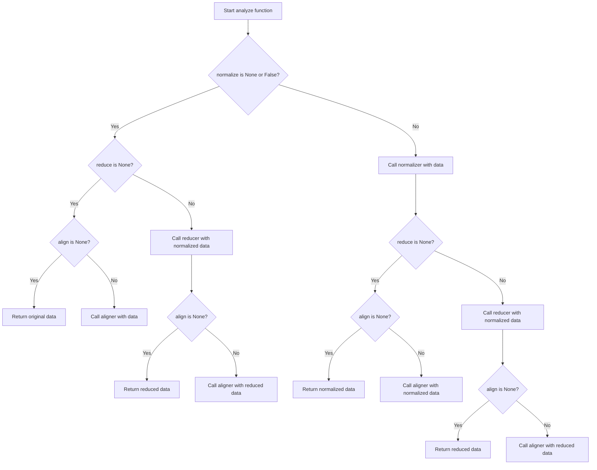

# `analyze.py`

## `hypertools.tools.analyze.analyze` · *function*

## Summary
Applies a sequential pipeline of data normalization, dimensionality reduction, and alignment operations to preprocess and transform input data for analysis or visualization.

## Description
The analyze function serves as a convenience wrapper that chains together three fundamental data processing operations: normalization, dimensionality reduction, and alignment. It provides a unified interface for applying these transformations in sequence to prepare data for downstream analysis or visualization.

This function extracts the logic for chaining these operations into a single cohesive unit, allowing users to specify all preprocessing parameters in one place rather than calling each function separately. This promotes consistency in data preprocessing workflows and reduces boilerplate code. The function is particularly useful for neuroimaging and other scientific data analysis where standardized preprocessing pipelines are essential.

## Args
    data (array-like or list): Input data to be processed. Can be a single data matrix or a list of data matrices for alignment operations.
    normalize (str or bool, optional): Normalization method to apply. Options include 'across', 'within', 'row', or None. Defaults to None.
    reduce (str or dict, optional): Reduction method to apply. Can be a string identifier or dictionary with 'model' and 'params' keys. Defaults to None.
    ndims (int, optional): Number of dimensions to reduce data to. Used when reduce is specified. Defaults to None.
    align (str or bool, optional): Alignment method to apply. Options include 'hyper', 'SRM', or None. Defaults to None.
    internal (bool): Internal flag for handling special cases in the processing pipeline. Passed through to all underlying functions. Defaults to False.

## Returns
    array-like or list: Processed data after applying normalization, reduction, and alignment in sequence. Returns a single array if input is single, list if input is list of data matrices.

## Raises
    ValueError: When invalid normalization, reduction, or alignment parameters are provided.
    Warning: Various warnings about deprecated parameters and data quality issues from the underlying functions.

## Constraints
    Precondition: Input data must be compatible with the respective operations (normalization, reduction, alignment)
    Precondition: For alignment operations, input should be a list of data matrices with compatible dimensions
    Postcondition: Output data will have been processed through all specified transformations in order

## Side Effects
    Issues warnings via Python's warnings module for deprecated parameters and data quality issues from underlying functions
    May modify data through preprocessing steps in the normalization, reduction, and alignment processes

## Control Flow


## Examples
```python
import numpy as np

# Standard preprocessing pipeline for neuroimaging data
data = np.random.rand(100, 50)
processed_data = analyze(data, normalize='across', reduce='IncrementalPCA', ndims=10)

# Multi-subject alignment pipeline
subjects_data = [
    np.random.rand(100, 50), 
    np.random.rand(120, 50), 
    np.random.rand(110, 50)
]
aligned_data = analyze(subjects_data, normalize='within', reduce='PCA', ndims=20, align='hyper')

# Quick preprocessing without alignment
processed_data = analyze(data, reduce='IncrementalPCA', ndims=15)

# Simple normalization only
normalized_data = analyze(data, normalize='row')
```

