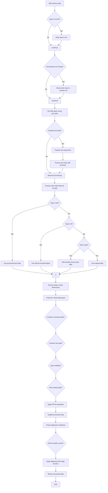

# `format_data.py`

## `hypertools.tools.format_data.format_data` · *function*

## Summary:
Formats heterogeneous data inputs (text, numerical, dataframe, geometric) into a consistent numerical matrix representation suitable for downstream analysis and visualization.

## Description:
The format_data function serves as a unified data preprocessing pipeline that normalizes diverse input data types into a consistent numerical format. It automatically detects input data types using get_type, applies appropriate transformations (text vectorization, numerical matrix conversion), and handles complex scenarios like mixed data types, missing values, and data alignment. This extraction prevents code duplication and provides a centralized interface for data preparation across the hypertools ecosystem.

## Args:
    x (any): Input data that can be a single item or list of items. Supports various data types including strings, lists of strings, numerical data, pandas DataFrames, and DataGeometry objects.
    vectorizer (str, optional): Text vectorization method for text data processing. Defaults to 'CountVectorizer'.
    semantic (str, optional): Semantic modeling approach for text data processing. Defaults to 'LatentDirichletAllocation'.
    corpus (str, optional): Predefined corpus name for loading pre-trained models. Defaults to 'wiki'.
    ppca (bool, optional): Whether to apply probabilistic PCA for missing data imputation. Defaults to True.
    text_align (str, optional): Alignment method for mixed text-numerical data. Defaults to 'hyper'.

## Returns:
    list: A list of numerical matrices where each input element has been transformed into a consistent numerical format. The structure preserves the original input ordering and handles mixed data types appropriately.

## Raises:
    TypeError: When input data types are not supported by the get_type function.
    RuntimeError: When vectorizer or semantic models don't have required fit_transform methods.
    ValueError: When data has inconsistent shapes or insufficient samples for alignment.

## Constraints:
    Preconditions:
        - Input data must be compatible with get_type function (lists, NumPy arrays, DataFrames, strings, DataGeometry objects)
        - For text processing, vectorizer and semantic parameters must be valid model specifications
        - When using pre-trained models, corpus parameter must be one of 'wiki', 'nips', 'sotus'
        
    Postconditions:
        - All returned elements are numerical matrices with consistent row dimensions
        - Text data is properly vectorized and semantically encoded
        - Numerical data is converted to standard matrix format
        - Mixed data types are handled through appropriate alignment when applicable

## Side Effects:
    - Issues warnings for deprecated parameters, missing data handling, and data alignment operations
    - May perform I/O operations when loading pre-trained models from disk
    - Modifies vectorizer and semantic models in-place during fitting processes
    - May trigger loading of example datasets when using predefined corpus names

## Control Flow:


## Examples:
```python
# Basic usage with text data
text_data = ["This is the first document.", "This document is the second document."]
formatted = format_data(text_data)
# Returns list of numerical matrices from text vectorization

# Mixed data types
import pandas as pd
import numpy as np

# Text and numerical data
text_input = ["Sample text for processing", "Another text sample"]
df_input = pd.DataFrame({'A': [1, 2, 3], 'B': [4, 5, 6]})
mixed_data = [text_input, df_input]

formatted = format_data(mixed_data)
# Returns list with text matrix and numerical matrix

# With custom parameters
custom_formatted = format_data(
    text_data, 
    vectorizer='TfidfVectorizer',
    semantic='NMF',
    corpus='nips'
)
# Uses custom text processing parameters
```

## `hypertools.tools.format_data.fill_missing` · *function*

## Summary:
Imputes missing values in multi-dimensional data using probabilistic principal component analysis and preserves data structure integrity.

## Description:
The fill_missing function applies probabilistic principal component analysis (PPCA) to impute missing values in datasets while maintaining the original data structure. It identifies completely missing rows (all NaN values) and preserves them as NaN in the transformed space, then splits the results back into the original input structure when multiple datasets are provided.

This function is extracted from the data processing pipeline to provide a dedicated mechanism for handling missing data through dimensionality reduction techniques, separating the imputation logic from data alignment or transformation operations.

## Args:
    x (list): A list of array-like structures (NumPy arrays, lists, etc.) to process. Each element should be compatible with NumPy operations and contain numerical data with potential missing values represented as NaN.

## Returns:
    list: A list of processed arrays with missing values imputed. If the input contains multiple arrays, the output maintains the same structure with each array processed independently. If a single array is provided, returns a list containing that single processed array. All returned arrays have the same shape as their corresponding input arrays.

## Raises:
    RuntimeError: When PPCA model fails to fit or transform data due to improper initialization or data issues.

## Constraints:
    Preconditions:
        - Input x must be a list of array-like structures that can be vertically stacked using np.vstack()
        - Each array in the list should be compatible with NumPy operations
        - Arrays should contain numerical data with potential NaN values
    
    Postconditions:
        - All returned arrays will have the same shape as their corresponding input arrays
        - Missing values in input data are replaced with imputed values based on PCA
        - Completely missing rows (all NaN) are preserved as NaN in the output
        - When multiple arrays are provided, the split operation maintains original array boundaries

## Side Effects:
    None: This function performs no I/O operations or external state mutations.

## Control Flow:
```mermaid
flowchart TD
    A[Start fill_missing] --> B[Initialize PPCA model]
    B --> C[Fit PPCA on stacked data using np.vstack(x)]
    C --> D[Transform data using PPCA]
    D --> E{Any all-NaN rows identified?}
    E -- Yes --> F[Set corresponding PCA results to NaN]
    E -- No --> G[Skip NaN row handling]
    G --> H{Multiple input arrays?}
    H -- Yes --> I[Calculate split points based on input array shapes]
    I --> J[Split transformed data at original boundaries]
    H -- No --> K[Return single transformed array]
    J --> L[Return split list]
    K --> L
```

## Examples:
```python
import numpy as np

# Basic usage with single array
data = [np.array([[1, 2], [np.nan, np.nan], [3, 4]])]
result = fill_missing(data)
# Returns imputed array with second row preserved as NaN

# Usage with multiple arrays
data1 = np.array([[1, 2], [np.nan, np.nan]])
data2 = np.array([[3, 4], [5, np.nan]])
result = fill_missing([data1, data2])
# Returns list of two imputed arrays, preserving original structure
```

