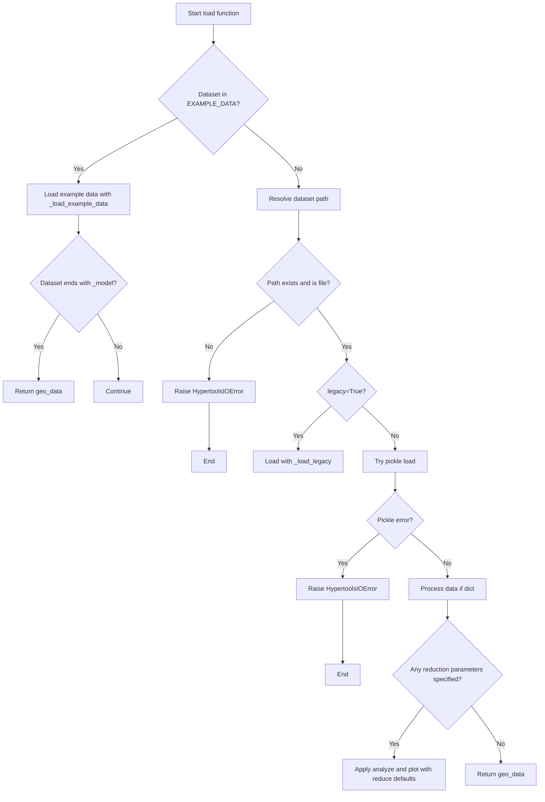
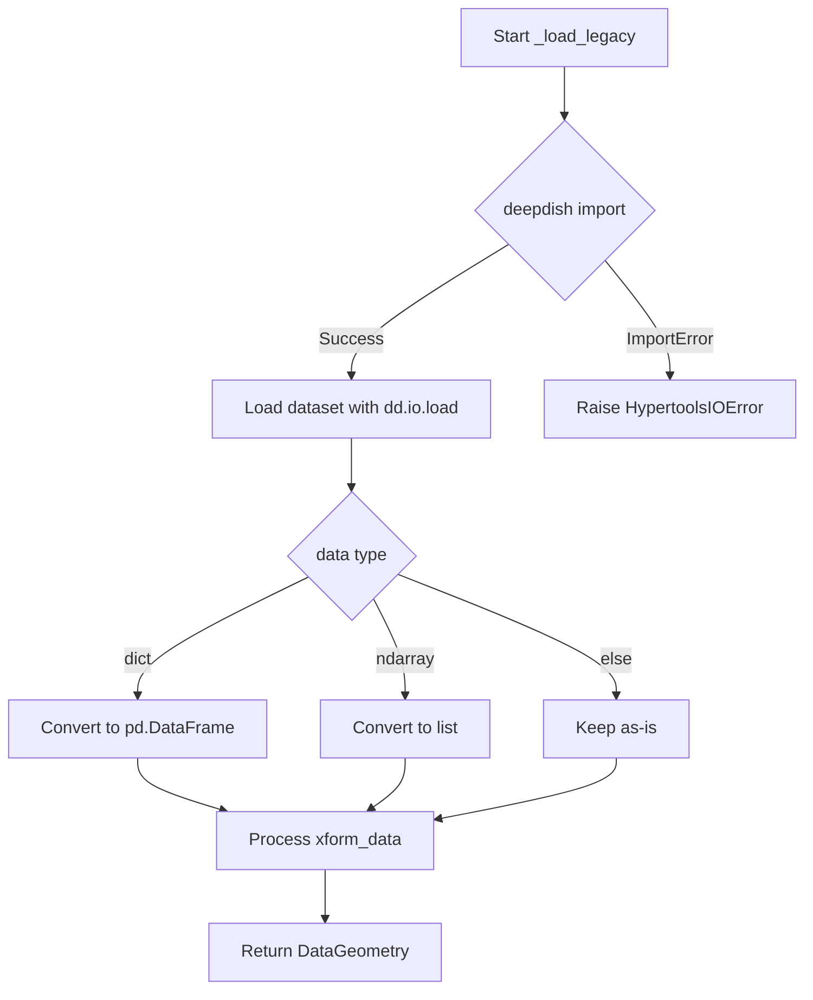
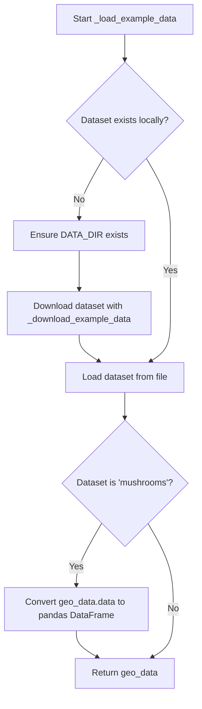

# `load.py`

## `hypertools.tools.load.load` · *function*

## Summary:
Loads data from example datasets or file paths, optionally applying dimensionality reduction and visualization transformations.

## Description:
The load function provides a unified interface for accessing both built-in example datasets and user-provided data files. It handles multiple data formats including legacy deepdish files, modern pickle files, and example datasets. When dimensionality reduction parameters are specified, it automatically applies analysis and plotting operations to generate visualizations.

This function serves as the primary entry point for data loading in the hypertools library, abstracting away the complexity of different file formats and data processing steps. It enforces a clear separation between data loading and data processing by handling both in a single coherent workflow.

## Args:
    dataset (str): Path to a data file or name of an example dataset. When a path is provided, it will be expanded using expanduser and expandvars. When a string matching an example dataset name is provided, it loads that predefined dataset.
    reduce (str or None, optional): Dimensionality reduction method to apply. Defaults to None. When None, defaults to 'IncrementalPCA' during analysis.
    ndims (int or None, optional): Number of dimensions to reduce data to. Required when reduce is specified. Defaults to None.
    align (str or None, optional): Alignment method to apply for multi-subject data. Defaults to None.
    normalize (str or None, optional): Normalization method to apply. Defaults to None.
    legacy (bool, optional): Flag to enable loading of legacy deepdish format files. Defaults to False.

## Returns:
    DataGeometry: A DataGeometry object containing the loaded data. If any of reduce, ndims, align, or normalize parameters are specified (are truthy), returns a plot result (DataGeometry with visualization data). If the dataset ends with '_model', returns the raw DataGeometry object.

## Raises:
    HypertoolsIOError: Raised when a dataset file cannot be found at the specified path, or when a legacy file cannot be loaded due to pickle errors. Also raised when example datasets fail to load from cache.

## Constraints:
    Preconditions:
    - When using example datasets, the dataset name must be one of the predefined names in EXAMPLE_DATA
    - When specifying dimensionality reduction parameters, ndims must be specified
    - When legacy=True, the file must be in deepdish format
    - The dataset parameter must be a valid string

    Postconditions:
    - Returns a properly initialized DataGeometry object
    - If any reduction parameters are specified (reduce, ndims, align, normalize), the returned object contains visualization-ready data
    - If the dataset is a model variant (ends with '_model'), the raw DataGeometry is returned

## Side Effects:
    - May read from the filesystem to load data files
    - May download example datasets from remote servers if not cached locally
    - May create directories in the filesystem for caching
    - May call external plotting functions that create figures and potentially save files

## Control Flow:


## Examples:
```python
# Load an example dataset
geo = load('spiral')

# Load a file with dimensionality reduction
geo = load('my_data.geo', reduce='IncrementalPCA', ndims=3)

# Load legacy file format
geo = load('legacy_data.h5', legacy=True)

# Load example dataset with analysis and plotting
plot_result = load('mushrooms', reduce='PCA', ndims=2, align='hyper')

# Load with only alignment parameter (still triggers analysis)
geo = load('data.geo', align='hyper')
```

## `hypertools.tools.load._load_legacy` · *function*

## Summary:
Loads legacy-format datasets saved with deepdish and converts them into a DataGeometry object for use in the hypertools visualization pipeline.

## Description:
This internal function handles loading of legacy datasets that were originally saved using the deepdish library format. It imports deepdish locally to avoid making it a hard dependency for the entire package, and processes the loaded data structure to ensure compatibility with current DataGeometry requirements. The function is typically called by the main load() function when it detects a legacy file format.

The function performs type conversion on the loaded data to ensure proper handling by subsequent processing steps in the hypertools pipeline. Specifically, it converts dictionary-based data to pandas DataFrames and numpy arrays to lists, while ensuring transformation data is properly formatted as lists.

## Args:
    dataset_path (str): Absolute or relative path to the legacy-format dataset file saved with deepdish.

## Returns:
    DataGeometry: A DataGeometry object containing the loaded data and associated metadata, ready for visualization and analysis operations.

## Raises:
    HypertoolsIOError: Raised when the deepdish module is not installed, which is required for loading legacy-format datasets.

## Constraints:
    Preconditions: 
    - The dataset_path must point to a valid file that was saved using deepdish format
    - The deepdish module must be available in the Python environment
    - The loaded data dictionary must contain 'data' and 'xform_data' keys
    
    Postconditions:
    - The returned DataGeometry object will have properly formatted data attributes
    - The 'data' attribute will be either a pandas DataFrame or list
    - The 'xform_data' attribute will be a list

## Side Effects:
    I/O operation: Reads from the filesystem to load the dataset file using deepdish

## Control Flow:


## Examples:
```python
# Load a legacy dataset file
from hypertools.tools.load import _load_legacy
geometry = _load_legacy('/path/to/legacy_dataset.h5')

# The returned object can be used for visualization
geometry.plot()
```

## `hypertools.tools.load._load_example_data` · *function*

## Summary:
Loads example datasets from a local cache directory, downloading them if necessary.

## Description:
This internal utility function retrieves example datasets from a local cache directory. If the requested dataset file doesn't exist locally, it ensures the cache directory exists and downloads the dataset from a remote source using the internal `_download_example_data` function. The function deserializes the cached data using pickle and applies special processing for certain datasets like 'mushrooms'.

The function is part of the hypertools library's data loading infrastructure and provides a standardized way to access example datasets that are bundled with the library for demonstration and testing purposes.

## Args:
    dataset (str): Name of the dataset to load. This corresponds to a filename within the DATA_DIR cache directory.

## Returns:
    DataGeometry: A DataGeometry object containing the loaded dataset. For the 'mushrooms' dataset, the data attribute is converted to a pandas DataFrame.

## Raises:
    HypertoolsIOError: Raised when the dataset cannot be loaded from the cache or when the download fails. The error message suggests deleting the cached file and reloading.

## Constraints:
    Preconditions:
    - The dataset parameter must be a valid string identifying an existing example dataset
    - DATA_DIR must be a valid pathlib.Path pointing to a directory for caching example datasets
    - The global _download_example_data function must be available for downloading missing datasets
    
    Postconditions:
    - If successful, returns a DataGeometry object with the requested dataset
    - If the dataset doesn't exist locally, it will be downloaded and cached
    - The returned DataGeometry object will have its data attribute properly formatted

## Side Effects:
    - May create directories in the filesystem if DATA_DIR doesn't exist
    - May download files from a remote server if the dataset is not cached locally
    - Reads binary files from the local filesystem
    - May modify the local cache directory contents

## Control Flow:


## Examples:
```python
# Load an example dataset
from hypertools.tools.load import _load_example_data

# Load the mushrooms dataset
mushrooms_data = _load_example_data('mushrooms')

# Load another example dataset
iris_data = _load_example_data('iris')
```

## `hypertools.tools.load._download_example_data` · *function*

## Summary:
Downloads example datasets from a remote server using file identifiers and handles confirmation cookies.

## Description:
This internal utility function downloads example datasets from a remote server using predefined file identifiers. It is specifically designed to handle services that require cookie-based confirmation for file downloads (such as Google Drive). The function streams the download in chunks to manage memory efficiently and cleans up partial downloads on failure.

## Args:
    dataset_path (pathlib.Path): The local file path where the downloaded dataset should be saved. The function uses dataset_path.name to look up the corresponding file identifier in an internal mapping.

## Returns:
    None: This function does not return any value. It performs file I/O operations to save the downloaded data to disk.

## Raises:
    HypertoolsIOError: Raised when the download process fails due to network issues, invalid file identifiers, or incomplete downloads. The error message includes the dataset name that failed to download.

## Constraints:
    Preconditions:
    - The dataset_path must be a valid pathlib.Path object
    - The dataset_path.parent directory must exist or be creatable
    - The global EXAMPLE_DATA dictionary must contain an entry for dataset_path.name
    - The global BASE_URL must be a valid URL string for the remote download service
    
    Postconditions:
    - If successful, the file at dataset_path will contain the downloaded dataset
    - If unsuccessful, the file at dataset_path will be removed (if it existed)

## Side Effects:
    - Creates or overwrites a file at the specified dataset_path
    - Makes HTTP requests to a remote server
    - May delete a partially downloaded file if the download fails

## Control Flow:
```mermaid
flowchart TD
    A[Start download] --> B{Lookup file_id in EXAMPLE_DATA}
    B --> C[Create requests.Session()]
    C --> D[Initial GET request to BASE_URL]
    D --> E{Check response cookies}
    E -->|download_warning found| F[Extract confirm token]
    F --> G[Update params with confirm token]
    G --> H[Second GET request]
    E -->|No warning| H
    H --> I{Response received}
    I --> J[Open file at dataset_path for writing]
    J --> K[Iterate through response chunks (32768 bytes)]
    K --> L{Chunk available}
    L -->|Yes| M[Write chunk to file]
    L -->|No| N[Continue loop]
    M --> K
    N --> K
    K --> O[Close file]
    O --> P[Success]
    P --> Q[End]
    I -->|Error| R[Delete partial file with unlink()]
    R --> S[Raise HypertoolsIOError]
    S --> Q
```

## Examples:
```python
# Typical usage would be within a larger data loading function
from pathlib import Path
from hypertools.tools.load import _download_example_data

# Download a dataset to a specific location
dataset_path = Path.home() / "datasets" / "example_dataset.h5"
_download_example_data(dataset_path)
```

