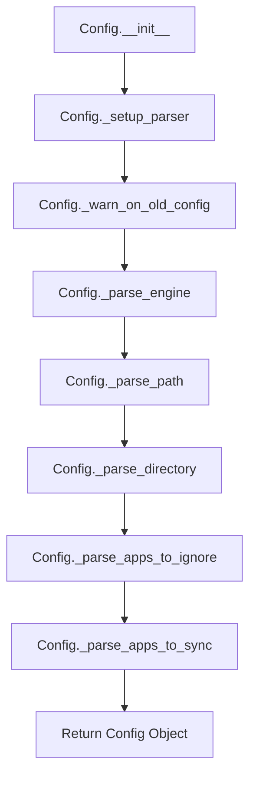
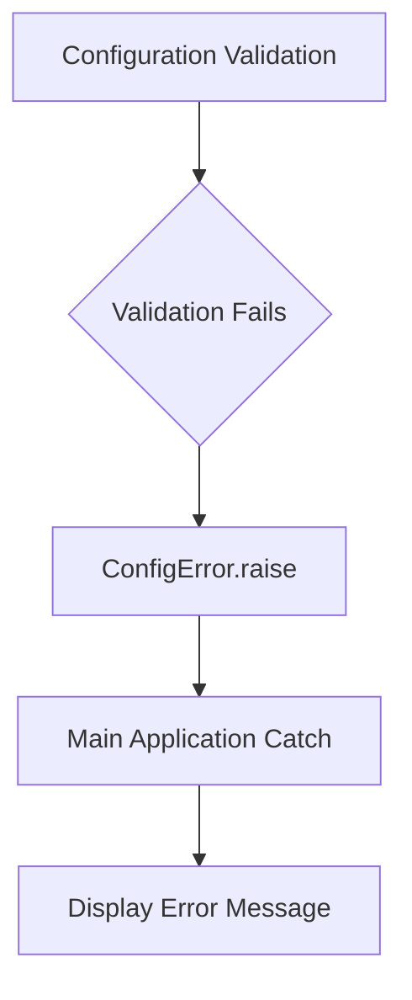

# `config.py`

## `mackup.config.Config` · *class*

## Summary:
Configuration class that parses and validates Mackup backup settings from a configuration file.

## Description:
The Config class is responsible for reading, validating, and providing access to Mackup backup configuration settings. It parses a configuration file to determine storage engine type, backup location path, storage directory, and application filtering settings. This class acts as a central configuration manager that ensures all backup operations use consistent and validated settings.

The class is typically instantiated at application startup to load configuration before performing any backup or restore operations. It performs validation checks including detecting deprecated configuration formats and ensuring required parameters are present for the selected storage engine.

## State:
- `_parser`: configparser object containing parsed configuration data
- `_engine`: string representing the storage engine type (one of ENGINE_DROPBOX, ENGINE_GDRIVE, ENGINE_COPY, ENGINE_ICLOUD, ENGINE_FS)
- `_path`: string representing the base path for storage location
- `_directory`: string representing the backup directory name within the storage path
- `_apps_to_ignore`: set of application names to exclude from backup operations
- `_apps_to_sync`: set of application names to include in backup operations

## Lifecycle:
Creation: Instantiate with optional filename parameter to specify configuration file location. Defaults to MACKUP_CONFIG_FILE in user's home directory.
Usage: Access properties like engine, path, directory, fullpath, apps_to_ignore, and apps_to_sync to retrieve configuration values.
Destruction: No explicit cleanup required; relies on Python's garbage collection.

## Method Map:


## Raises:
- ConfigError: Raised when configuration validation fails, such as:
  - Unknown storage engine specified
  - Required 'path' option missing when using 'file_system' engine
  - Deprecated configuration sections detected (Allowed Applications, Ignored Applications)
  - Invalid storage directory name (CUSTOM_APPS_DIR cannot be used)

## Example:
```python
# Create configuration instance
config = Config()

# Access configuration values
print(f"Storage engine: {config.engine}")
print(f"Backup path: {config.path}")
print(f"Backup directory: {config.directory}")
print(f"Full backup path: {config.fullpath}")

# Get applications to ignore/sync
ignored_apps = config.apps_to_ignore  # Set of app names to ignore
synced_apps = config.apps_to_sync     # Set of app names to sync
```

### `mackup.config.Config.__init__` · *method*

*No documentation generated.*

### `mackup.config.Config.engine` · *method*

## Summary:
Returns the configured storage engine type as a string.

## Description:
Provides access to the storage engine configuration that determines how Mackup backups are stored. This property is read-only and returns the engine type as a string value.

The engine is parsed from the configuration file during object initialization and can be one of several supported storage backends:
- Dropbox (ENGINE_DROPBOX)
- Google Drive (ENGINE_GDRIVE) 
- Copy (ENGINE_COPY)
- iCloud (ENGINE_ICLOUD)
- File System (ENGINE_FS)

## Args:
    None

## Returns:
    str: The storage engine type as a string. Valid values are:
         - ENGINE_DROPBOX
         - ENGINE_GDRIVE
         - ENGINE_COPY
         - ENGINE_ICLOUD
         - ENGINE_FS

## Raises:
    None

## State Changes:
    Attributes READ: self._engine
    Attributes WRITTEN: None

## Constraints:
    Preconditions: The Config object must be properly initialized with a valid configuration file
    Postconditions: Returns a string representation of the engine type that was parsed during initialization

## Side Effects:
    None

### `mackup.config.Config.path` · *method*

## Summary:
Returns the absolute path to the backup storage location as a string.

## Description:
Provides access to the configured backup storage path. This property is computed during object initialization based on the selected storage engine and returns the resolved path as a string. The path is determined by the `_parse_path()` method which handles different cloud storage providers and local filesystem configurations.

## Args:
    None

## Returns:
    str: The absolute path to the backup storage location as a string

## Raises:
    None

## State Changes:
    Attributes READ: self._path
    Attributes WRITTEN: None

## Constraints:
    Preconditions:
    - The Config object must be properly initialized
    - self._path must be set during initialization (via _parse_path method)
    Postconditions:
    - Returns a valid string path that represents the backup storage location

## Side Effects:
    None

### `mackup.config.Config.directory` · *method*

## Summary:
Returns the configured backup directory path as a string for storing application configurations.

## Description:
This property provides access to the backup directory path configured for the Mackup application. The directory path is determined during object initialization by parsing the configuration file and defaults to the standard Mackup backup location if not explicitly configured. This property ensures consistent access to the backup directory throughout the application lifecycle.

The method serves as a clean interface to retrieve the backup directory path without exposing the internal `_directory` attribute directly. It's commonly used when constructing full file paths for backup operations.

## Args:
    None

## Returns:
    str: The absolute path to the backup directory, or the default backup path if not explicitly configured in the settings.

## Raises:
    None

## State Changes:
    Attributes READ: self._directory
    Attributes WRITTEN: None

## Constraints:
    Preconditions: The Config object must be properly initialized with a valid configuration.
    Postconditions: The returned value is always a string representation of the directory path.

## Side Effects:
    None

### `mackup.config.Config.fullpath` · *method*

## Summary:
Computes and returns the complete filesystem path for Mackup backup storage by joining the storage path and backup directory.

## Description:
This method combines the configured storage path (`self.path`) with the backup directory name (`self.directory`) to construct the full filesystem path where Mackup backups are stored. This provides a centralized way to determine the complete backup location without manually performing path joining operations.

The method is typically called during backup/restore operations to determine where files should be stored or retrieved from.

## Args:
    None

## Returns:
    str: The absolute filesystem path formatted as "{self.path}/{self.directory}" representing the complete backup location

## Raises:
    None

## State Changes:
    Attributes READ: 
    - self.path: The base storage path for backups (e.g., Dropbox folder location)
    - self.directory: The subdirectory name where backups are stored (e.g., ".mackup")

    Attributes WRITTEN: None

## Constraints:
    Preconditions:
    - Both `self.path` and `self.directory` must be valid string values
    - The Config object must be properly initialized with valid path and directory settings
    
    Postconditions:
    - Returns a properly joined filesystem path string
    - The returned path represents the complete backup location for the configured storage engine

## Side Effects:
    None

### `mackup.config.Config.apps_to_ignore` · *method*

## Summary:
Returns a set of application names that should be excluded from backup operations.

## Description:
This method provides access to the list of applications configured to be ignored during backup and restore operations. It serves as a property accessor that ensures the internal `_apps_to_ignore` list is returned as an immutable set, preventing accidental modification of the configuration.

## Args:
    None

## Returns:
    set[str]: A set containing the names of applications configured to be ignored. Returns an empty set if no applications are configured to be ignored.

## Raises:
    None

## State Changes:
    Attributes READ: self._apps_to_ignore
    Attributes WRITTEN: None

## Constraints:
    Preconditions: The Config instance must be properly initialized with a valid configuration parser.
    Postconditions: The returned set is always immutable and independent of the internal `_apps_to_ignore` list.

## Side Effects:
    None

### `mackup.config.Config.apps_to_sync` · *method*

## Summary:
Provides access to the set of application names configured for synchronization in the Mackup configuration.

## Description:
This property serves as a controlled interface to retrieve the collection of applications designated for synchronization. It returns a copy of the internal `_apps_to_sync` data structure, ensuring that external code cannot modify the internal state directly. This method is typically used during the backup/restore process to determine which applications should be processed.

## Args:
    None

## Returns:
    set[str]: A set containing the names of applications configured to be synchronized. Returns an empty set if no applications are explicitly configured for syncing in the configuration file.

## Raises:
    None

## State Changes:
    Attributes READ: self._apps_to_sync
    Attributes WRITTEN: None

## Constraints:
    Preconditions: The Config instance must be properly initialized with a valid configuration file containing the 'applications_to_sync' section.
    Postconditions: The returned set is always a fresh copy of the internal data structure, maintaining encapsulation of the internal state.

## Side Effects:
    None

### `mackup.config.Config._setup_parser` · *method*

## Summary:
Initializes and configures a SafeConfigParser instance for reading configuration files.

## Description:
Sets up a configparser.SafeConfigParser with specific options for handling configuration files, including support for inline comments and values without explicit assignment. The parser is initialized with a configuration file path constructed from the user's home directory and the provided filename.

## Args:
    filename (str, optional): Path to the configuration file. When None, defaults to MACKUP_CONFIG_FILE constant.

## Returns:
    configparser.SafeConfigParser: ConfigParser instance ready to parse the specified configuration file.

## Raises:
    None explicitly raised in this method.

## State Changes:
    Attributes READ: None
    Attributes WRITTEN: None

## Constraints:
    Preconditions: filename must be either a string or None
    Postconditions: Returns a valid SafeConfigParser instance with the specified file loaded

## Side Effects:
    I/O: Reads from the filesystem at the path constructed from HOME directory and filename

### `mackup.config.Config._warn_on_old_config` · *method*

## Summary:
Checks for deprecated configuration sections and aborts execution if found.

## Description:
This method validates that the configuration file does not contain obsolete sections from previous versions of Mackup. If any of the deprecated sections "Allowed Applications" or "Ignored Applications" are detected, it displays an error message and terminates the program to prevent potential misconfiguration.

## Args:
    None

## Returns:
    None

## Raises:
    SystemExit: When deprecated configuration sections are detected, causing the program to terminate with an error message.

## State Changes:
    Attributes READ: 
        - self._parser: Used to check for existence of deprecated sections
    Attributes WRITTEN: 
        - None

## Constraints:
    Preconditions:
        - self._parser must be initialized and contain parsed configuration data
        - The method should only be called during Config object initialization
    
    Postconditions:
        - If deprecated sections exist, the program exits with error code
        - If no deprecated sections exist, the object remains unchanged

## Side Effects:
    - Writes error message to stderr
    - Terminates program execution via sys.exit() call

### `mackup.config.Config._parse_engine` · *method*

## Summary:
Parses and validates the storage engine configuration option from the configuration parser.

## Description:
This method extracts the storage engine setting from the configuration parser's "storage" section. If the engine option is not specified, it defaults to Dropbox. The method validates that the specified engine is one of the supported storage engines and raises a configuration error for unsupported engines.

## Args:
    None

## Returns:
    str: The validated storage engine identifier (one of: dropbox, google_drive, copy, icloud, filesystem)

## Raises:
    ConfigError: When an unknown or unsupported storage engine is specified in the configuration

## State Changes:
    Attributes READ: self._parser
    Attributes WRITTEN: None

## Constraints:
    Preconditions: 
    - self._parser must be initialized and contain a configparser object
    - The parser must have a "storage" section or the method will use the default
    
    Postconditions:
    - Returns a string representing a valid storage engine
    - The returned string is one of the predefined engine constants

## Side Effects:
    None

### `mackup.config.Config._parse_path` · *method*

## Summary:
Determines and returns the appropriate backup storage path based on the configured synchronization engine.

## Description:
This private method resolves the correct backup directory path according to the selected storage engine. It delegates to engine-specific utility functions for cloud storage services and handles local filesystem configuration parsing. The method is called during configuration processing to establish the proper backup location.

## Args:
    self: The Config instance containing engine configuration and parser state

## Returns:
    str: The absolute path to the backup storage location as a string

## Raises:
    ConfigError: When using the 'file_system' engine and the required 'path' option is missing from the configuration

## State Changes:
    Attributes READ: self.engine, self._parser
    Attributes WRITTEN: None

## Constraints:
    Preconditions: 
    - self.engine must be one of the defined engine constants (ENGINE_DROPBOX, ENGINE_GDRIVE, ENGINE_COPY, ENGINE_ICLOUD, ENGINE_FS)
    - For ENGINE_FS, self._parser must be initialized and contain a 'storage' section
    Postconditions:
    - Returns a valid string path that can be used for backup operations

## Side Effects:
    I/O: Calls utility functions that may access filesystem to determine cloud storage locations
    External service calls: May invoke system calls to locate cloud storage directories

### `mackup.config.Config._parse_directory` · *method*

## Summary:
Parses and validates the storage directory configuration from the config parser, returning the appropriate directory path.

## Description:
This method retrieves the storage directory setting from the configuration parser's "storage" section. If a custom directory is specified and it matches the reserved CUSTOM_APPS_DIR constant, it raises a ConfigError. When no directory is configured, it defaults to MACKUP_BACKUP_PATH. This method is called during object initialization to set the internal `_directory` attribute.

## Args:
    None

## Returns:
    str: The storage directory path, either from configuration or the default MACKUP_BACKUP_PATH

## Raises:
    ConfigError: When the configured directory equals CUSTOM_APPS_DIR, which is reserved and cannot be used as a storage directory

## State Changes:
    Attributes READ: self._parser
    Attributes WRITTEN: None (returns value instead of modifying attributes)

## Constraints:
    Preconditions: 
    - self._parser must be initialized and contain a valid configparser object
    - The method assumes the configuration has already been parsed and validated
    
    Postconditions:
    - Returns a string representing a valid directory path
    - Will not return the CUSTOM_APPS_DIR constant as a valid directory

## Side Effects:
    None

### `mackup.config.Config._parse_apps_to_ignore` · *method*

## Summary:
Parses the configuration file to extract a set of application names that should be ignored during backup and synchronization operations.

## Description:
This method reads the configuration parser to find the "applications_to_ignore" section and returns a set containing all application names listed as options in that section. It is called during the initialization of the Config class to populate the internal `_apps_to_ignore` attribute.

## Args:
    None

## Returns:
    set[str]: A set of application names to ignore, or an empty set if the "applications_to_ignore" section is not present in the configuration.

## Raises:
    None explicitly raised

## State Changes:
    Attributes READ: self._parser
    Attributes WRITTEN: None

## Constraints:
    Preconditions: The Config instance must have a properly initialized _parser attribute
    Postconditions: Returns a set of strings representing application names to ignore

## Side Effects:
    None

### `mackup.config.Config._parse_apps_to_sync` · *method*

## Summary:
Parses application names from the configuration file's 'applications_to_sync' section and returns them as a set.

## Description:
This private method extracts application names from the configuration parser's 'applications_to_sync' section. It's designed to be called during configuration parsing to determine which applications should be synchronized by Mackup. The method safely handles cases where the section doesn't exist by returning an empty set.

## Args:
    None

## Returns:
    set[str]: A set of application names configured to be synced, or an empty set if the section doesn't exist.

## Raises:
    None explicitly raised

## State Changes:
    Attributes READ: self._parser
    Attributes WRITTEN: None

## Constraints:
    Preconditions: The Config instance must have a properly initialized _parser attribute
    Postconditions: Returns a set of strings representing application names to sync

## Side Effects:
    None

## `mackup.config.ConfigError` · *class*

## Summary:
Custom exception class for configuration-related errors in the Mackup backup system.

## Description:
The ConfigError class represents configuration-specific exceptions that occur during the initialization or operation of the Mackup backup system. This exception is raised when configuration validation fails, such as when an invalid backup engine is specified, when required configuration parameters are missing, or when configuration file parsing encounters errors.

This distinct exception type allows the application to differentiate configuration-related failures from other types of errors and handle them appropriately in the user interface or logging systems.

## State:
The class has no instance attributes beyond those inherited from Exception. It serves purely as an exception type marker.

## Lifecycle:
- Creation: Instantiated when configuration validation fails, typically during application startup or configuration loading
- Usage: Raised by configuration validation functions and caught by the main application flow to display appropriate error messages to users
- Destruction: Automatically cleaned up by Python's exception handling mechanism

## Method Map:


## Raises:
- ConfigError: Raised when configuration validation fails during application initialization or runtime

## Example:
```python
try:
    # Attempt to load configuration
    config = load_config()
except ConfigError as e:
    print(f"Configuration error: {e}")
    exit(1)
```

