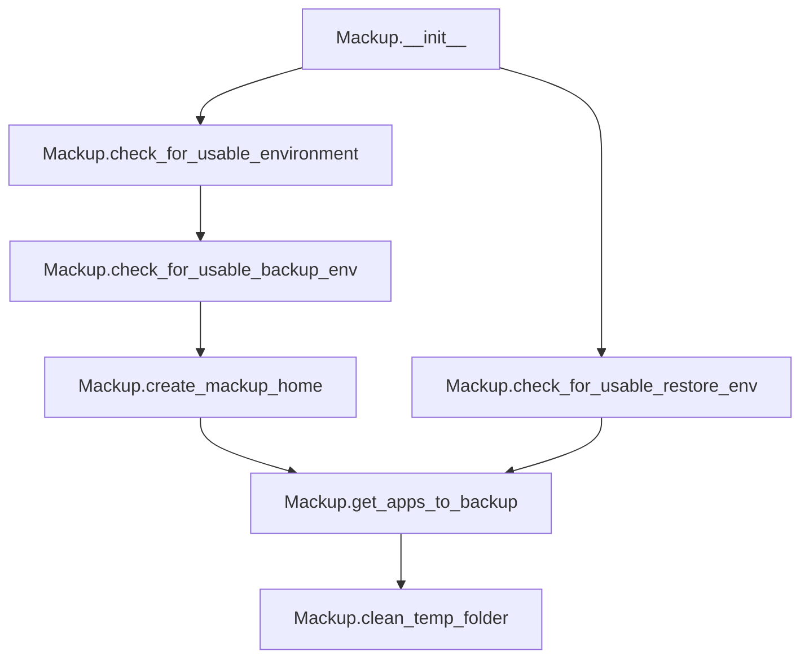

# `mackup.py`

## `mackup.mackup.Mackup` · *class*

## Summary:
Mackup is the main orchestrator class that manages backup and restore operations by coordinating configuration, environment validation, and application selection.

## Description:
The Mackup class serves as the central coordinator for all Mackup operations. It handles environment validation, manages temporary storage, creates necessary directories, and determines which applications should be backed up or restored. This class encapsulates the core workflow logic for backup and restore operations, ensuring that all prerequisites are met before proceeding with file synchronization.

The class is typically instantiated once at application startup and used throughout the backup/restore lifecycle. It relies on configuration management, utility functions, and application databases to make decisions about what files to process.

## State:
- `_config`: config.Config instance holding all configuration settings
- `mackup_folder`: str, absolute path to the Mackup configuration directory
- `temp_folder`: str, absolute path to a temporary directory for intermediate operations

## Lifecycle:
Creation: Instantiate Mackup() to initialize configuration and temporary directories. The constructor automatically creates a temporary directory using tempfile.mkdtemp().
Usage: Call methods in sequence:
1. Environment validation (check_for_usable_environment, check_for_usable_backup_env, check_for_usable_restore_env)
2. Directory creation (create_mackup_home) 
3. Application selection (get_apps_to_backup)
4. Cleanup (clean_temp_folder) when done
Destruction: Temporary directory is cleaned up via clean_temp_folder() method.

## Method Map:


## Raises:
- SystemExit: Raised by several methods when environment validation fails or user declines to create directories
- FileNotFoundError: Raised by clean_temp_folder when temporary directory doesn't exist
- PermissionError: Raised by clean_temp_folder when lacking permissions to delete temporary directory

## Example:
```python
# Initialize Mackup
mackup = Mackup()

# Validate environment and create backup directory for backup operations
mackup.check_for_usable_backup_env()

# Determine which applications to back up
apps_to_backup = mackup.get_apps_to_backup()

# Perform backup operations...

# Clean up temporary files
mackup.clean_temp_folder()
```

### `mackup.mackup.Mackup.__init__` · *method*

## Summary:
Initializes a Mackup instance by creating configuration and temporary directories.

## Description:
The `__init__` method sets up the Mackup object's core attributes by initializing a configuration object and creating necessary directory paths. This method is called during object instantiation to prepare the Mackup instance for operation.

## Args:
    None

## Returns:
    None

## Raises:
    None explicitly raised

## State Changes:
    Attributes READ: None
    Attributes WRITTEN: 
    - self._config: Stores a new Config instance from the config module
    - self.mackup_folder: Sets the path to the Mackup configuration directory from config
    - self.temp_folder: Creates and stores a temporary directory path for temporary files

## Constraints:
    Preconditions: None
    Postconditions: 
    - self._config is initialized as a Config instance
    - self.mackup_folder contains the full path to the Mackup configuration directory
    - self.temp_folder contains a valid temporary directory path

## Side Effects:
    - Creates a temporary directory using tempfile.mkdtemp()
    - May modify the filesystem by creating a temporary directory

### `mackup.mackup.Mackup.check_for_usable_environment` · *method*

## Summary:
Validates that the current environment meets safety and configuration requirements for Mackup operations.

## Description:
Checks two critical conditions for safe operation: prevents execution as root user unless explicitly allowed, and verifies that the configured storage directory exists. This method serves as a safety gate to ensure Mackup operates in a usable environment.

The method is called by both backup and restore workflows to validate prerequisites before proceeding with operations.

## Args:
    None

## Returns:
    None

## Raises:
    SystemExit: When either environment validation check fails, causing the application to terminate with an error message.

## State Changes:
    Attributes READ: 
    - self._config.path: Used to verify existence of the storage directory
    
    Attributes WRITTEN: 
    - None

## Constraints:
    Preconditions:
    - The Mackup instance must be initialized with a valid _config attribute
    - The _config.path must be a valid filesystem path
    
    Postconditions:
    - Application exits with error code if environment validation fails
    - No state changes occur on successful validation

## Side Effects:
    - Writes error messages to stderr when validation fails
    - Terminates the application via sys.exit() when validation fails

### `mackup.mackup.Mackup.check_for_usable_backup_env` · *method*

## Summary:
Initializes the backup environment by validating the system setup and creating the necessary configuration directory.

## Description:
This method ensures that the system is properly configured for performing backups. It first validates the environment conditions (such as user permissions and storage location) and then creates the Mackup home directory if it doesn't already exist. This method is typically called during backup operations to prepare the system state.

## Args:
    None

## Returns:
    None

## Raises:
    SystemExit: When environment validation fails due to insufficient permissions or missing storage folder, or when the user declines to create the Mackup home directory.

## State Changes:
    Attributes READ: 
    - self._config.path (used in check_for_usable_environment)
    - self.mackup_folder (used in create_mackup_home)
    
    Attributes WRITTEN:
    - self.mackup_folder (potentially modified by create_mackup_home if directory is created)

## Constraints:
    Preconditions:
    - The Mackup instance must be initialized with a valid _config object
    - The system must have appropriate filesystem permissions
    
    Postconditions:
    - Either the Mackup home directory exists and is accessible, or the program exits with an error
    - Environment validation has been completed successfully

## Side Effects:
    - May prompt user for confirmation via stdin when creating the Mackup home directory
    - May exit the program with sys.exit() if validation fails or user declines to create directory
    - May create a new directory on the filesystem

### `mackup.mackup.Mackup.check_for_usable_restore_env` · *method*

## Summary:
Checks if the restore environment is properly configured by verifying both general usability conditions and the existence of the Mackup folder.

## Description:
This method ensures that the system is ready for restore operations by performing two key validations: first, it verifies that the general environment meets basic requirements (such as proper permissions and storage location), and second, it confirms that the Mackup folder exists. This method is specifically designed for restore operations where the presence of backed-up files is essential.

The method is called during restore workflows to prevent errors when attempting to restore files from a non-existent Mackup folder. It serves as a guardrail to ensure that users have properly backed up their files before attempting to restore them.

## Args:
    None

## Returns:
    None

## Raises:
    SystemExit: When the Mackup folder cannot be found, causing the program to terminate with an error message.

## State Changes:
    Attributes READ: 
    - self.mackup_folder: Path to the Mackup folder where backed-up files are stored
    - self._config.path: Base path for storage location
    
    Attributes WRITTEN: 
    - None

## Constraints:
    Preconditions:
    - The Mackup class instance must be initialized with a valid configuration
    - The `self.mackup_folder` attribute must be properly set (derived from `self._config.fullpath`)
    
    Postconditions:
    - If successful, the method completes without returning
    - If unsuccessful, the program exits with an error message

## Side Effects:
    - I/O operations: Checks filesystem for directory existence
    - External service calls: None
    - Mutations to objects outside self: None
    - System exit: Calls sys.exit() when Mackup folder is not found

### `mackup.mackup.Mackup.clean_temp_folder` · *method*

## Summary:
Removes the temporary directory used during Mackup operations.

## Description:
Deletes the temporary folder created at initialization for storing intermediate files during backup or restore operations. This method is typically called at the end of a Mackup session to clean up temporary resources.

## Args:
    None

## Returns:
    None

## Raises:
    FileNotFoundError: If the temporary folder does not exist.
    PermissionError: If the process lacks permissions to delete the temporary folder.

## State Changes:
    Attributes READ: self.temp_folder
    Attributes WRITTEN: None

## Constraints:
    Preconditions: The self.temp_folder attribute must be initialized and point to a valid directory path.
    Postconditions: The temporary directory and all its contents are permanently deleted from the filesystem.

## Side Effects:
    I/O operation: Deletes files and directories from the filesystem using shutil.rmtree().

### `mackup.mackup.Mackup.create_mackup_home` · *method*

## Summary:
Creates the Mackup configuration directory if it doesn't already exist, prompting the user for confirmation before creation.

## Description:
This method ensures that the Mackup configuration directory exists before proceeding with backup operations. It checks if the directory specified by `self.mackup_folder` exists, and if not, prompts the user for confirmation to create it. This method is designed to be called during environment setup to validate that the backup destination is available.

The method is typically invoked as part of the backup environment validation process in `check_for_usable_backup_env()` which is called before initiating backup operations.

## Args:
    None

## Returns:
    None

## Raises:
    SystemExit: When the user declines to create the directory, causing the application to exit with an error message.

## State Changes:
    Attributes READ: 
    - self.mackup_folder: Path to the Mackup configuration directory
    
    Attributes WRITTEN: 
    - None

## Constraints:
    Preconditions:
    - The `self.mackup_folder` attribute must be properly initialized (typically from `self._config.fullpath`)
    - The application must have appropriate permissions to create directories in the specified location
    
    Postconditions:
    - Either the directory exists and can be used for backups, or the application exits with an error
    
## Side Effects:
    - I/O operations: Creates a directory on the filesystem using `os.makedirs`
    - User interaction: Displays a confirmation prompt to the user via `utils.confirm`
    - Program termination: Exits the application with `sys.exit()` if user declines creation

### `mackup.mackup.Mackup.get_apps_to_backup` · *method*

## Summary:
Determines the set of applications that should be backed up by combining configured sync applications with database applications, then filtering out ignored applications.

## Description:
This method computes the effective list of applications to back up by consulting the configuration settings and the applications database. It respects user-defined exclusions while honoring explicit inclusion requests. This logic is encapsulated in its own method to avoid duplication across different backup operations (backup, restore, uninstall) and to provide a single source of truth for application selection.

The method follows this precedence:
1. If `apps_to_sync` is configured, use those applications
2. Otherwise, use all applications from the database
3. Remove any applications listed in `apps_to_ignore`

## Args:
    None

## Returns:
    set[str]: A set of application names that should be backed up

## Raises:
    None

## State Changes:
    Attributes READ: self._config.apps_to_sync, self._config.apps_to_ignore
    Attributes WRITTEN: None

## Constraints:
    Preconditions: The Mackup instance must be properly initialized with a valid configuration
    Postconditions: The returned set contains only applications that should be backed up according to configuration

## Side Effects:
    None

