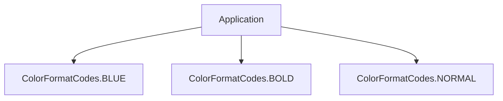
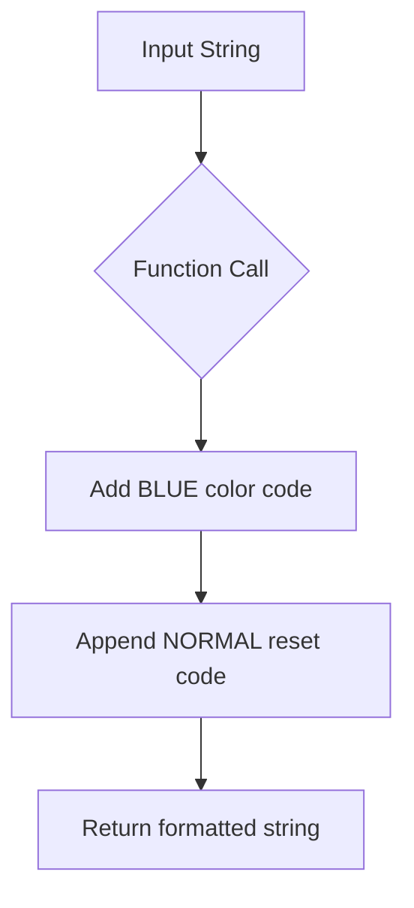
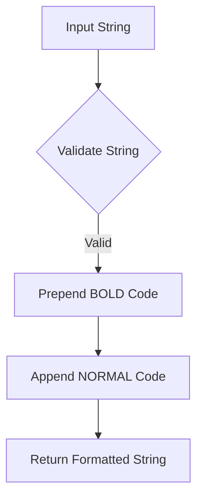

# `main.py`

## `mackup.main.ColorFormatCodes` · *class*

## Summary:
Defines ANSI escape sequences for terminal text formatting including colors and style modifiers.

## Description:
This utility class provides static constants for ANSI terminal color and formatting codes. It serves as a centralized location for terminal styling operations, making it easier to apply consistent formatting across the application's command-line interface. The class is typically used by other components that need to display colored or formatted text to users.

## State:
- BLUE: str = "\033[34m" - ANSI escape sequence for blue text color
- BOLD: str = "\033[1m" - ANSI escape sequence for bold text formatting  
- NORMAL: str = "\033[0m" - ANSI escape sequence to reset all formatting

All attributes are immutable class constants with no validation constraints.

## Lifecycle:
- Creation: The class is automatically initialized when imported and does not require instantiation
- Usage: Constants are accessed directly as class attributes (e.g., ColorFormatCodes.BLUE)
- Destruction: No explicit cleanup required as this is a pure utility class with no resources to manage

## Method Map:


## Raises:
None - This class does not raise exceptions during initialization or usage.

## Example:
```python
from mackup.main import ColorFormatCodes

# Apply formatting to text
formatted_text = f"{ColorFormatCodes.BLUE}This is blue text{ColorFormatCodes.NORMAL}"
bold_text = f"{ColorFormatCodes.BOLD}This is bold text{ColorFormatCodes.NORMAL}"

# Output would appear as formatted text in terminal
print(formatted_text)
print(bold_text)
```

## `mackup.main.header` · *function*

## Summary:
Formats a string with blue color codes for terminal output.

## Description:
This function applies blue color formatting to the input string, making it visually distinct in terminal environments. It's designed to create consistent header-style output throughout the application.

## Args:
    str (str): The string to be formatted with blue color codes.

## Returns:
    str: The input string wrapped with blue color escape codes and reset codes.

## Raises:
    None: This function does not raise any exceptions.

## Constraints:
    Preconditions: The input must be a string.
    Postconditions: The returned string contains terminal color escape codes for blue text followed by reset codes.

## Side Effects:
    None: This function has no side effects beyond returning a formatted string.

## Control Flow:


## Examples:
    >>> header("Welcome to Mackup")
    '\x1b[34mWelcome to Mackup\x1b[0m'

## `mackup.main.bold` · *function*

## Summary:
Formats a string with bold terminal text formatting using ANSI escape codes.

## Description:
Applies bold formatting to the input string by wrapping it with ANSI escape codes. This utility function centralizes the application of bold text formatting for consistent terminal output throughout the application. The function relies on external ColorFormatCodes constants for the actual ANSI formatting sequences.

## Args:
    str (str): The input string to be formatted with bold styling.

## Returns:
    str: The input string wrapped with ANSI bold formatting codes followed by normal formatting reset codes.

## Raises:
    None

## Constraints:
    Preconditions:
        - Input must be a string type
    Postconditions:
        - Output string contains ANSI escape codes for bold formatting
        - Original string content is preserved within the formatting wrapper

## Side Effects:
    None

## Control Flow:


## Examples:
    >>> bold("Hello World")
    '\x1b[1mHello World\x1b[0m'
    
    >>> bold("Important Message")
    '\x1b[1mImportant Message\x1b[0m'

## `mackup.main.main` · *function*

## Summary:
Main entry point for the Mackup command-line tool that handles backup, restore, uninstall, list, and show operations based on command-line arguments.

## Description:
The main function serves as the primary command-line interface for the Mackup tool, parsing command-line arguments using docopt and orchestrating the appropriate backup, restore, or management operations. It validates execution environments, initializes core components, and delegates to specialized handlers for different operations while maintaining proper state management and cleanup.

This function acts as the central coordination point for the entire Mackup workflow, extracting complex command-line routing logic into a dedicated entry point that separates concerns between argument parsing, environment validation, and operation execution.

## Args:
    None - This function reads command-line arguments via docopt and does not accept parameters directly.

## Returns:
    None - This function performs operations and exits with appropriate system codes, but does not return a value.

## Raises:
    SystemExit: Raised when unsupported applications are requested in show operations, or when environment validation fails.
    FileNotFoundError: Raised during cleanup operations when temporary directories don't exist.
    PermissionError: Raised during cleanup operations when insufficient permissions exist to delete temporary directories.

## Constraints:
    Preconditions:
    - Command-line arguments must be properly formatted according to docopt specification
    - User must have appropriate permissions for file operations
    - Environment must meet basic requirements for backup/restore operations
    
    Postconditions:
    - Temporary directories are cleaned up after execution
    - All requested operations are completed or aborted appropriately
    - System exits with appropriate status codes

## Side Effects:
    - Reads command-line arguments using docopt
    - Modifies global state through utils.FORCE_YES and utils.CAN_RUN_AS_ROOT
    - Performs file I/O operations for backup/restore/uninstall operations
    - Writes to stdout for informational messages and prompts
    - May prompt user for confirmation in interactive mode
    - Creates and modifies directories in the filesystem
    - May modify user's home directory configuration files

## Control Flow:
```mermaid
flowchart TD
    A[Parse CLI args with docopt] --> B{Backup operation?}
    B -- Yes --> C[Validate backup environment]
    C --> D[Get apps to backup]
    D --> E[Process each app with ApplicationProfile.backup()]
    E --> F[Clean temp folder]
    
    B -- No --> G{Restore operation?}
    G -- Yes --> H[Validate restore environment]
    H --> I[Restore Mackup app first]
    I --> J[Reinitialize Mackup and DB]
    J --> K[Get apps to backup (excluding Mackup)]
    K --> L[Process each app with ApplicationProfile.restore()]
    L --> F
    
    G -- No --> M{Uninstall operation?}
    M -- Yes --> N[Validate restore environment]
    N --> O{Dry run or user confirms?}
    O -- Yes --> P[Get apps to backup (excluding Mackup)]
    P --> Q[Process each app with ApplicationProfile.uninstall()]
    Q --> R[Uninstall Mackup app]
    R --> S[Print uninstall completion message]
    S --> F
    
    M -- No --> T{List operation?}
    T -- Yes --> U[Validate environment]
    U --> V[Print supported apps list]
    V --> F
    
    T -- No --> W{Show operation?}
    W -- Yes --> X[Validate environment]
    X --> Y[Get app name from args]
    Y --> Z{App supported?}
    Z -- No --> AA[SystemExit]
    Z -- Yes --> AB[Print app info]
    AB --> F
    
    W -- No --> AC[Clean temp folder]
    AC --> AD[Exit]
```

## Examples:
```python
# Backup all supported applications
$ mackup backup

# Restore configuration from backup
$ mackup restore

# Uninstall Mackup (will restore all files)
$ mackup uninstall

# List all supported applications
$ mackup list

# Show information about a specific application
$ mackup show vim
```

