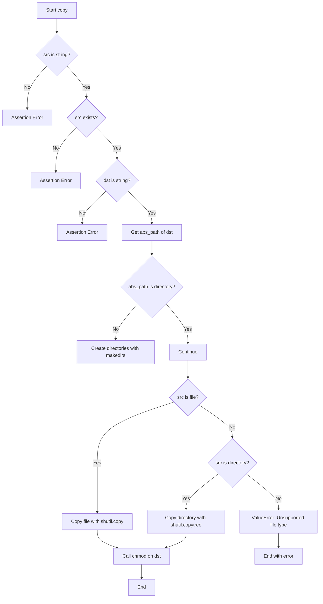
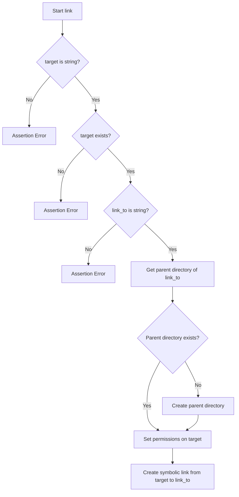
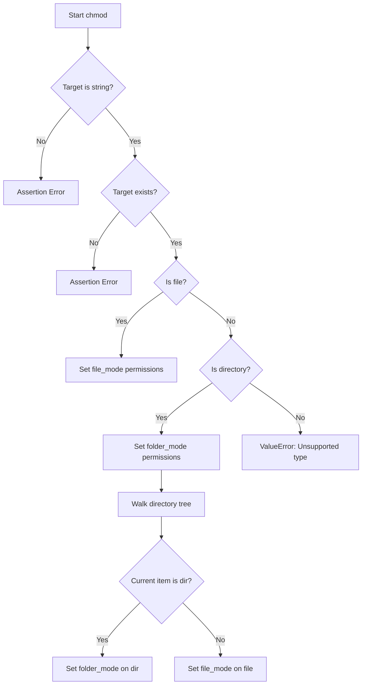
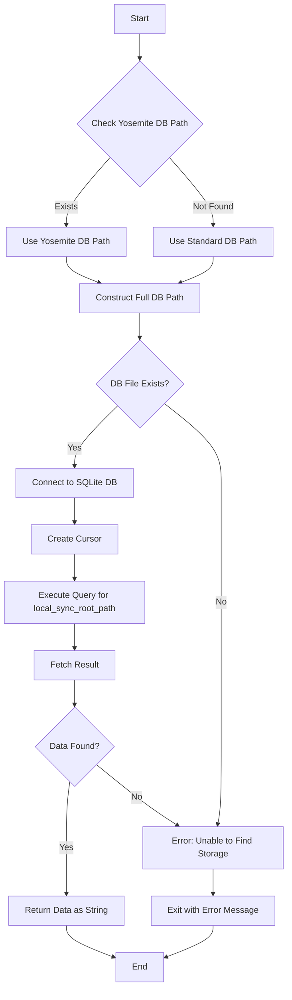
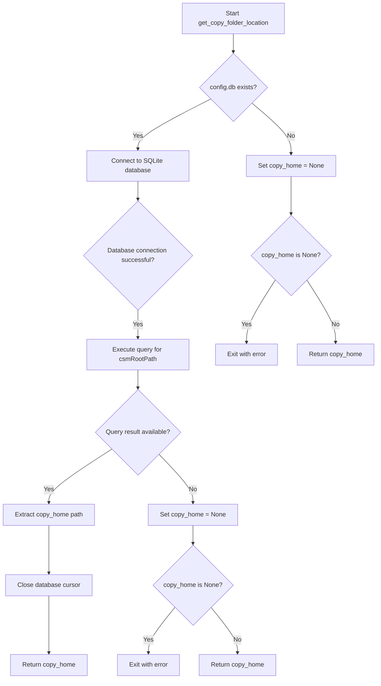
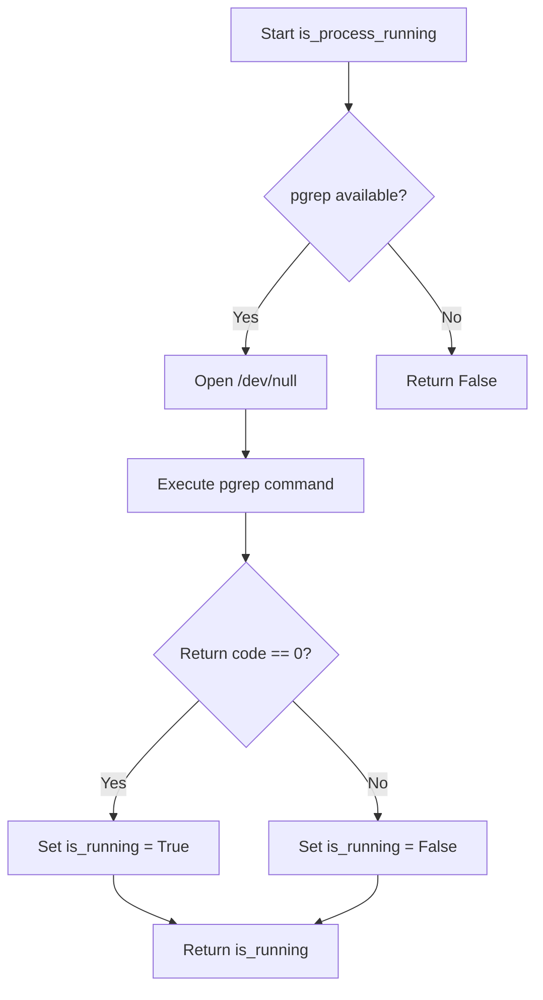
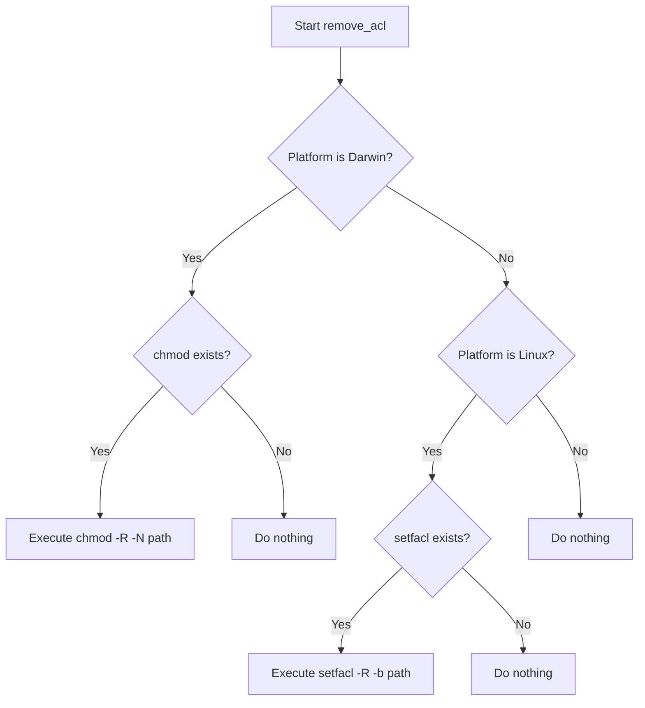
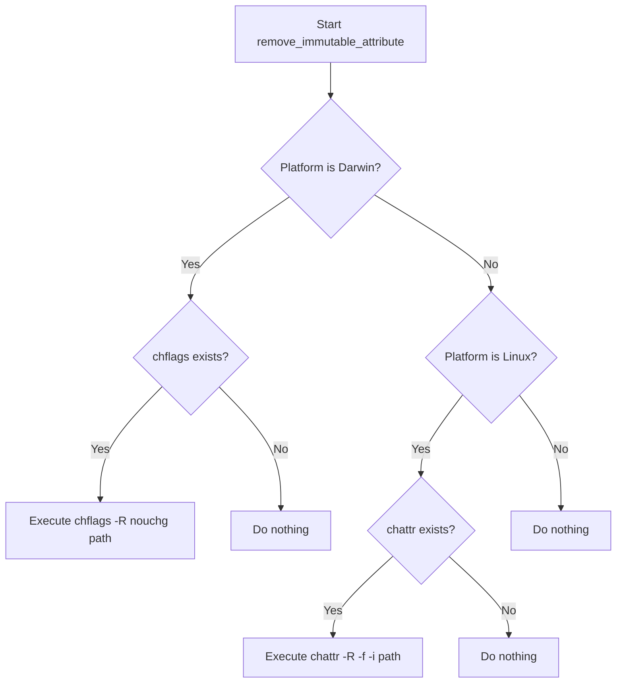

# `utils.py`

## `mackup.utils.confirm` · *function*

## Summary:
Prompts the user for confirmation with a yes/no question and returns a boolean indicating their choice.

## Description:
Displays a question to the user and waits for a yes/no response. This function provides a standardized way to obtain user consent for potentially destructive operations. When the global FORCE_YES flag is enabled, the function immediately returns True without prompting the user.

## Args:
    question (str): The question to display to the user for confirmation.

## Returns:
    bool: True if the user confirms with 'yes' or 'y', False if the user declines with 'no' or 'n'.

## Raises:
    None explicitly raised, but may raise KeyboardInterrupt if user interrupts input.

## Constraints:
    Preconditions:
        - The question parameter must be a string
        - The FORCE_YES global variable must be defined (though not shown in this file)
    
    Postconditions:
        - Always returns a boolean value (True or False)
        - User input is normalized to lowercase for comparison

## Side Effects:
    - Prints the question to standard output
    - Reads user input from standard input
    - May raise KeyboardInterrupt if user presses Ctrl+C during input

## Control Flow:
```mermaid
flowchart TD
    A[Start confirm()] --> B{FORCE_YES?}
    B -- Yes --> C[Return True]
    B -- No --> D[Display question]
    D --> E[Read user input]
    E --> F{Input is "yes" or "y"?}
    F -- Yes --> G[confirmed = True]
    F -- No --> H{Input is "no" or "n"?}
    H -- Yes --> I[confirmed = False]
    H -- No --> J[Loop back to input]
    G --> K[Return confirmed]
    I --> K
```

## Examples:
    >>> confirm("Do you want to delete this file?")
    Do you want to delete this file? <Yes|No> y
    True
    
    >>> confirm("Are you sure you want to proceed?")
    Are you sure you want to proceed? <Yes|No> n
    False

## `mackup.utils.delete` · *function*

## Summary:
Deletes files or directories while removing special attributes like ACLs and immutable flags.

## Description:
This function provides a robust file/directory deletion mechanism that first removes special file attributes (ACLs and immutable flags) before performing the actual deletion. It handles both regular files and symbolic links as files, and directories, making it suitable for cleaning up configuration files and directories that may have special permissions or attributes set.

The function is particularly useful in environments where files might have extended attributes that prevent normal deletion, such as on macOS or Linux systems with ACLs or immutable flags.

## Args:
    filepath (str): The absolute or relative path to the file or directory to be deleted.

## Returns:
    None: This function does not return any value.

## Raises:
    OSError: When the file or directory cannot be removed due to permission issues or other filesystem errors.

## Constraints:
    Preconditions:
    - The filepath must exist and be accessible
    - The system must have appropriate tools installed for removing ACLs and immutable attributes (chmod, setfacl, chflags, chattr)
    
    Postconditions:
    - The specified file or directory is completely removed from the filesystem
    - Any ACLs and immutable attributes are removed before deletion attempt

## Side Effects:
    - May execute system commands via subprocess to remove ACLs and immutable attributes
    - Modifies file permissions and attributes on the target path
    - Removes files or directories from the filesystem
    - May require elevated privileges depending on file ownership and permissions

## Control Flow:
```mermaid
flowchart TD
    A[Start delete] --> B[Remove ACLs from filepath]
    B --> C[Remove immutable attributes from filepath]
    C --> D{Is filepath a file or link?}
    D -- Yes --> E[os.remove(filepath)]
    D -- No --> F{Is filepath a directory?}
    F -- Yes --> G[shutil.rmtree(filepath)]
    F -- No --> H[Do nothing - invalid path type]
```

## Examples:
    # Delete a regular file
    delete("/home/user/.config/myapp/config.ini")
    
    # Delete a symbolic link
    delete("/home/user/.local/share/myapp/link_to_config")
    
    # Delete a directory with special attributes
    delete("/home/user/.config/myapp")
```

## `mackup.utils.copy` · *function*

## Summary:
Copies files or directories from a source location to a destination, creating parent directories as needed and setting appropriate file permissions.

## Description:
This function provides a robust mechanism for copying files or directories from a source path to a destination path. It automatically creates the destination directory structure if it doesn't exist, handles both file and directory copying appropriately, and ensures proper file permissions are set on the copied items. The function is designed to be used in backup and restore operations where file integrity and permissions are important.

The function extracts the copying logic into its own utility to provide a centralized, reusable approach for file/directory operations that need to handle directory creation and permission management consistently.

## Args:
    src (str): Absolute or relative path to the source file or directory to be copied. Must exist in the filesystem.
    dst (str): Absolute or relative path to the destination where the source will be copied. The parent directory will be created if it doesn't exist.

## Returns:
    None: This function does not return any value.

## Raises:
    AssertionError: If src is not a string, src does not exist, or dst is not a string.
    ValueError: If the source path is neither a file nor a directory (unsupported file type).

## Constraints:
    Preconditions:
    - The src parameter must be a string and must reference an existing file or directory
    - The dst parameter must be a string representing a valid file path
    - The user must have appropriate read permissions on the source and write permissions on the destination
    
    Postconditions:
    - The destination directory structure will be created if it doesn't exist
    - The source file or directory will be copied to the destination
    - The copied items will have appropriate file permissions set

## Side Effects:
    - Creates parent directories for the destination path if they don't exist
    - Copies files or directories from source to destination
    - Modifies file permissions on the copied destination items via chmod function call
    - May modify file attributes on the filesystem through chmod function

## Control Flow:


## Examples:
    # Copy a single file
    copy("/home/user/.bashrc", "/backup/.bashrc")
    
    # Copy a directory
    copy("/home/user/Documents", "/backup/Documents")
    
    # This would raise AssertionError if source doesn't exist
    # copy("/nonexistent/file", "/dest/file")
    
    # This would raise ValueError for unsupported file types
    # copy("/dev/null", "/dest/null")  # Would raise ValueError
```

## `mackup.utils.link` · *function*

## Summary:
Creates a symbolic link from a target file or directory to a specified location, ensuring proper directory structure and permissions.

## Description:
This function establishes a symbolic link between a target file or directory and a destination path. It automatically creates the parent directory structure for the destination if it doesn't exist, sets appropriate file permissions on the target, and then creates the symbolic link. This utility is commonly used in backup/restore operations where symbolic links need to be created with proper setup.

## Args:
    target (str): Absolute or relative path to the source file or directory that will be linked. Must exist in the filesystem.
    link_to (str): Absolute or relative path where the symbolic link will be created. The parent directory will be created if it doesn't exist.

## Returns:
    None: This function does not return any value.

## Raises:
    AssertionError: If target is not a string, does not exist, or link_to is not a string.

## Constraints:
    Preconditions:
    - The target parameter must be a string
    - The target path must exist in the filesystem
    - The link_to parameter must be a string
    
    Postconditions:
    - The parent directory of link_to will exist
    - The target will have appropriate permissions set
    - A symbolic link will be created from target to link_to

## Side Effects:
    - Creates parent directories for link_to if they don't exist
    - Modifies file permissions on the target using chmod function
    - Creates a symbolic link in the filesystem

## Control Flow:


## Examples:
    # Create a symbolic link for a configuration file
    link("/home/user/.bashrc", "/home/user/.config/bashrc")
    
    # Create a symbolic link for a directory
    link("/home/user/Documents", "/home/user/.config/documents")
```

## `mackup.utils.chmod` · *function*

## Summary:
Sets appropriate read/write permissions on files and directories while removing immutable attributes to enable modification.

## Description:
This function configures file system permissions for a given target path by setting appropriate read/write permissions based on whether the target is a file or directory. It first removes immutable attributes that might prevent permission changes, then applies the correct permission modes. For directories, it recursively applies permissions to all contained files and subdirectories. This function is typically used in backup/restore operations where files may have immutable flags that need to be removed before modification.

## Args:
    target (str): Absolute or relative path to the file or directory whose permissions need to be set. Must exist and be a valid file or directory path.

## Returns:
    None: This function does not return any value.

## Raises:
    AssertionError: If target is not a string or does not exist.
    ValueError: If the target is neither a file nor a directory (unsupported file type).

## Constraints:
    Preconditions:
    - The target parameter must be a string
    - The target path must exist in the filesystem
    - The user must have appropriate permissions to modify file attributes and permissions
    
    Postconditions:
    - The target and its contents (if directory) will have appropriate read/write permissions
    - Immutable attributes will be removed from the target and its contents

## Side Effects:
    - Modifies file permissions using os.chmod
    - Removes immutable attributes using remove_immutable_attribute function
    - May execute system commands via subprocess if remove_immutable_attribute is called
    - Modifies file attributes on the filesystem

## Control Flow:


## Examples:
    # Set permissions on a configuration file
    chmod("/home/user/.bashrc")
    
    # Set permissions on a directory and all its contents
    chmod("/home/user/.config/myapp")
    
    # This would raise ValueError for unsupported file types
    # chmod("/dev/null")  # Would raise ValueError
```

## `mackup.utils.error` · *function*

*No documentation generated.*

## `mackup.utils.get_dropbox_folder_location` · *function*

## Summary:
Retrieves the local Dropbox folder location by parsing the Dropbox host database file.

## Description:
This function extracts the Dropbox storage directory path from the Dropbox host database file (.dropbox/host.db). It reads the host database, decodes base64-encoded data, and returns the path where Dropbox stores synchronized files. This logic is encapsulated in a separate function to isolate the Dropbox-specific file parsing logic and make it reusable.

## Args:
    None

## Returns:
    str: The absolute path to the local Dropbox folder location

## Raises:
    SystemExit: When the Dropbox host database file cannot be found or accessed, causing the application to terminate with an error message

## Constraints:
    Preconditions:
    - The user's HOME environment variable must be set
    - The Dropbox installation must be present on the system
    - The .dropbox/host.db file must exist and be readable
    
    Postconditions:
    - Returns a valid absolute path string to the Dropbox folder
    - Function terminates the program if Dropbox installation is not found

## Side Effects:
    - Reads from the filesystem (specifically .dropbox/host.db in user's home directory)
    - Terminates the program via sys.exit() if Dropbox installation is not found

## Control Flow:
```mermaid
flowchart TD
    A[Start get_dropbox_folder_location] --> B{host.db exists?}
    B -- No --> C[error() with ERROR_UNABLE_TO_FIND_STORAGE]
    B -- Yes --> D[Read host.db file]
    D --> E[Split file content]
    E --> F[Base64 decode data[1]]
    F --> G[Return decoded path]
```

## Examples:
```python
# Typical usage in a backup/restore workflow
dropbox_path = get_dropbox_folder_location()
# Returns something like "/home/username/Dropbox" or "/Users/username/Dropbox"
```

## `mackup.utils.get_google_drive_folder_location` · *function*

## Summary
Retrieves the local synchronized folder path for Google Drive by querying the local configuration database.

## Description
This function determines the local directory where Google Drive files are synced by accessing the Google Drive sync configuration database. It handles different version paths of the database file and extracts the local sync root path from the database.

## Args
None

## Returns
str: The absolute path to the local Google Drive synchronization folder.

## Raises
SystemExit: When unable to locate the Google Drive installation or configuration database, causing the application to terminate with an error message.

## Constraints
Preconditions:
- The system must be running on macOS (since it looks for paths under Library/Application Support)
- The user's HOME environment variable must be set
- Google Drive must be installed on the system

Postconditions:
- The returned path is guaranteed to be a valid existing directory path
- Function will terminate the program if no valid Google Drive configuration is found

## Side Effects
- Reads from the local filesystem (specifically the Google Drive configuration database)
- May cause the application to exit if Google Drive configuration cannot be found

## Control Flow


## Examples
```python
# Typical usage in a backup/restore workflow
try:
    gdrive_path = get_google_drive_folder_location()
    print(f"Google Drive sync folder: {gdrive_path}")
except SystemExit:
    # Handle case where Google Drive isn't installed
    print("Google Drive not found - skipping Google Drive backup")
```

## `mackup.utils.get_copy_folder_location` · *function*

## Summary:
Retrieves the storage location for Copy backup service by parsing its configuration database.

## Description:
This function locates and reads the Copy backup service configuration database to extract the root storage path. It searches for a SQLite database file at a predefined path within the user's home directory and queries it for the 'csmRootPath' configuration value. This allows Mackup to discover where Copy stores its backup data for proper synchronization.

## Args:
    None

## Returns:
    str: The absolute path to the Copy backup storage directory as stored in the configuration database.

## Raises:
    SystemExit: When the Copy configuration database cannot be found or the required configuration value cannot be retrieved.

## Constraints:
    Preconditions:
    - The user's HOME environment variable must be set
    - The Copy application must be installed and configured
    - The Copy configuration database file must exist at the expected location
    
    Postconditions:
    - Returns a valid filesystem path string
    - Function terminates the program if configuration cannot be found

## Side Effects:
    - Reads from the local filesystem (SQLite database file)
    - Exits the program with error code if configuration is not found

## Control Flow:


## Examples:
```python
# Typical usage in Mackup backup process
try:
    storage_path = get_copy_folder_location()
    print(f"Copy storage located at: {storage_path}")
except SystemExit:
    print("Failed to locate Copy backup storage")
```

## `mackup.utils.get_icloud_folder_location` · *function*

## Summary:
Retrieves the local filesystem path to the iCloud Drive folder on macOS systems.

## Description:
This function determines the location of the iCloud Drive storage directory on macOS systems running Yosemite or later. It expands the user's home directory path and validates that the directory exists before returning it. The function is designed specifically for macOS environments where iCloud Drive uses the path "~/Library/Mobile Documents/com~apple~CloudDocs/".

## Args:
    None

## Returns:
    str: The absolute path to the iCloud Drive folder as a string, e.g., "/Users/username/Library/Mobile Documents/com~apple~CloudDocs"

## Raises:
    SystemExit: When the iCloud Drive directory cannot be found at the expected location, causing the application to terminate with an error message.

## Constraints:
    Preconditions:
        - Must be running on a macOS system (though the function doesn't explicitly check this)
        - The iCloud Drive folder must be properly configured and accessible
        - The user must have appropriate permissions to access the iCloud directory
    
    Postconditions:
        - Returns a valid string path to an existing directory
        - Function terminates the program if the directory doesn't exist

## Side Effects:
    - Terminates the program via sys.exit() if the iCloud directory is not found
    - No file I/O operations or external state mutations occur beyond program termination

## Control Flow:
```mermaid
flowchart TD
    A[Start get_icloud_folder_location] --> B{icloud_home directory exists?}
    B -- No --> C[error() with ERROR_UNABLE_TO_FIND_STORAGE]
    B -- Yes --> D[Return icloud_home as str]
```

## Examples:
```python
# Typical usage in a macOS environment with iCloud enabled
try:
    icloud_path = get_icloud_folder_location()
    print(f"iCloud Drive located at: {icloud_path}")
except SystemExit:
    # This will only happen if iCloud Drive is not found
    print("Failed to locate iCloud Drive")
```

## `mackup.utils.is_process_running` · *function*

## Summary:
Checks whether a process with the specified name is currently running on the system.

## Description:
This function determines if a process is actively running by utilizing the pgrep command-line utility. It's designed for Unix-like systems where pgrep is available and serves as a lightweight mechanism for process detection without requiring elevated privileges. The function is commonly used in system administration tools to prevent conflicts between multiple instances of the same application or to ensure proper application lifecycle management.

## Args:
    process_name (str): The name of the process to check for existence. This should be the exact process name as it appears in the system process table.

## Returns:
    bool: True if the process is currently running, False otherwise. Returns False if the pgrep utility is not available on the system or if the process is not found.

## Raises:
    None explicitly raised, though underlying subprocess calls may raise OSError if the system is in an invalid state.

## Constraints:
    Preconditions:
    - The system must have the pgrep utility installed at "/usr/bin/pgrep"
    - The process_name parameter must be a valid string representing a process name
    
    Postconditions:
    - The function returns a boolean value indicating process status
    - No modifications are made to system state

## Side Effects:
    - Opens /dev/null for writing to suppress stdout from subprocess calls
    - Makes a subprocess call to execute pgrep command
    - May cause slight performance overhead due to external command execution

## Control Flow:


## Examples:
    # Prevent multiple instances of an application from running
    if is_process_running("myapp"):
        print("Another instance of myapp is already running")
        sys.exit(1)
    
    # Check if a critical system service is active
    if not is_process_running("sshd"):
        print("SSH daemon is not running")
        # Handle the situation appropriately
```

## `mackup.utils.remove_acl` · *function*

## Summary:
Removes Access Control Lists (ACLs) from a specified path in a platform-appropriate manner.

## Description:
This function removes ACLs from files and directories recursively. It implements platform-specific behavior:
- On macOS (Darwin): Uses the chmod command with the -N flag to remove ACLs
- On Linux: Uses the setfacl command with the -b flag to remove ACLs

The function is designed to be safe by checking for the existence of required system commands before execution.

## Args:
    path (str): The absolute or relative path to the file or directory from which ACLs should be removed.

## Returns:
    None: This function does not return any value.

## Raises:
    None: This function does not explicitly raise exceptions, though underlying system calls may fail.

## Constraints:
    Preconditions:
    - The path must exist and be accessible
    - The system must have the appropriate ACL removal tools installed (/bin/chmod on macOS, /bin/setfacl on Linux)
    
    Postconditions:
    - ACLs are removed from the specified path and its contents recursively
    - No return value indicates success or failure of the operation

## Side Effects:
    - Executes system commands via subprocess
    - Modifies file permissions on the target path
    - May affect access control settings on files and directories

## Control Flow:


## Examples:
    # Remove ACLs from a configuration directory
    remove_acl("/Users/username/.config/myapp")
    
    # Remove ACLs from a backup directory
    remove_acl("/backup/myfiles")
```

## `mackup.utils.remove_immutable_attribute` · *function*

## Summary:
Removes immutable attributes from files and directories on macOS and Linux systems using system commands.

## Description:
This function removes the immutable flag from files and directories recursively by executing platform-specific system utilities. On macOS systems, it uses the `chflags` command with the `nouchg` option to remove the "uchg" (user immutable) flag. On Linux systems, it uses the `chattr` command with the `-i` option to remove the immutable attribute. The function is designed to be called when Mackup needs to modify files that have been marked as immutable, typically during backup restoration or configuration management operations.

## Args:
    path (str): The absolute or relative path to the file or directory from which to remove immutable attributes.

## Returns:
    None: This function does not return any value.

## Raises:
    None: This function does not explicitly raise exceptions, though underlying system calls may fail.

## Constraints:
    Preconditions:
    - The system must be either macOS (Darwin) or Linux
    - The appropriate system utility must be installed and executable:
      * `/usr/bin/chflags` for macOS
      * `/usr/bin/chattr` for Linux
    - The user must have sufficient privileges to modify file attributes
    
    Postconditions:
    - If the platform is supported and the utility exists, immutable flags are removed from the specified path and its contents recursively
    - The function returns None

## Side Effects:
    - Executes system commands via subprocess calls
    - Modifies file attributes on the filesystem
    - May require elevated privileges depending on file ownership and permissions

## Control Flow:


## Examples:
    # Remove immutable attributes from a configuration directory
    remove_immutable_attribute("/Users/username/.config/myapp")
    
    # Remove immutable attributes from a backup directory
    remove_immutable_attribute("/path/to/backup/directory")

## `mackup.utils.can_file_be_synced_on_current_platform` · *function*

## Summary:
Determines whether a file can be synced based on platform-specific restrictions, particularly excluding Library directories on Linux systems.

## Description:
This function evaluates if a given file path can be synchronized across platforms. On Linux systems, files located within the user's Library directory are excluded from synchronization to avoid potential conflicts or issues with platform-specific application data. The function constructs the absolute path by combining the HOME environment variable with the provided relative path and applies platform-specific filtering rules.

## Args:
    path (str): A relative path to a file or directory that needs to be evaluated for synchronization compatibility.

## Returns:
    bool: True if the file can be synced, False if it cannot be synced due to platform-specific restrictions (particularly on Linux systems where Library paths are excluded).

## Raises:
    None explicitly raised.

## Constraints:
    Preconditions:
    - The HOME environment variable must be set and accessible
    - The path parameter must be a valid string
    - The constants module must define PLATFORM_LINUX constant for proper platform detection
    
    Postconditions:
    - The function always returns a boolean value
    - The returned value indicates synchronization eligibility based on platform rules

## Side Effects:
    None.

## Control Flow:
```mermaid
flowchart TD
    A[Start] --> B{platform.system() == PLATFORM_LINUX?}
    B -- Yes --> C{fullpath.startswith(library_path)?}
    C -- Yes --> D[can_be_synced = False]
    C -- No --> E[can_be_synced = True]
    B -- No --> F[can_be_synced = True]
    D --> G[Return can_be_synced]
    E --> G
    F --> G
    G[Return can_be_synced] --> H[End]
```

## Examples:
    # Example 1: File on Linux that would be restricted
    result = can_file_be_synced_on_current_platform("Library/Application Support/myapp/config")
    # Returns False on Linux platforms
    
    # Example 2: File on Linux that would be allowed
    result = can_file_be_synced_on_current_platform("Documents/myfile.txt")
    # Returns True on Linux platforms
    
    # Example 3: File on non-Linux platform
    result = can_file_be_synced_on_current_platform("Library/Preferences/app.plist")
    # Returns True regardless of platform
```

