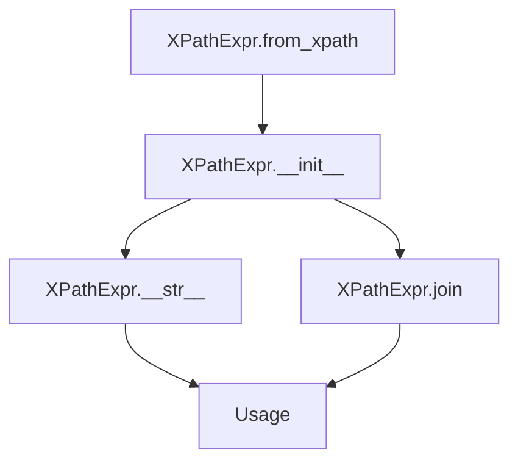
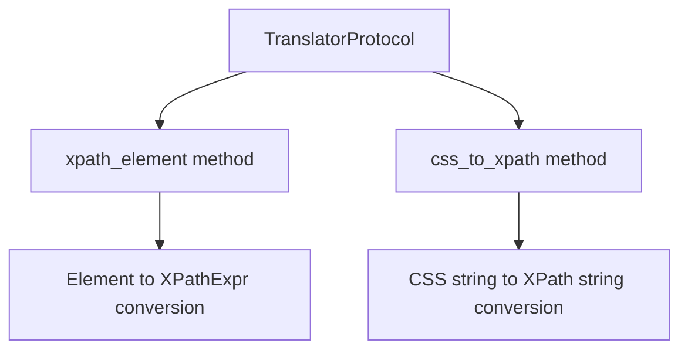
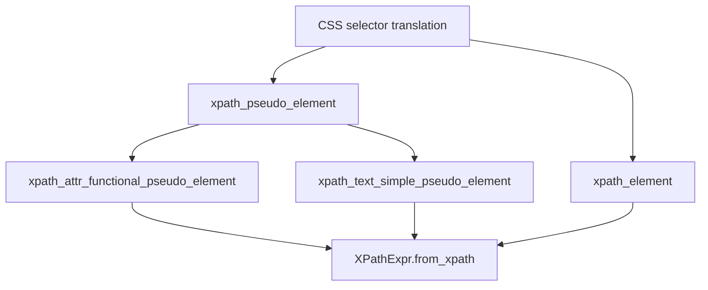

# `csstranslator.py`

## `parsel.csstranslator.XPathExpr` · *class*

## Summary:
A specialized XPath expression class that extends CSSSelect's XPathExpr to support text node and attribute handling.

## Description:
This class extends the base XPathExpr from cssselect to add support for text node selection and attribute access. It's designed to be used in CSS selector translation where additional XPath-specific features are needed beyond the standard CSS selectors.

The class is particularly useful when working with CSS selectors that need to target text content or specific attributes of elements, providing enhanced XPath expression capabilities.

## State:
- textnode: bool - Flag indicating whether this expression targets a text node. Defaults to False.
- attribute: Optional[str] - Name of the attribute this expression targets, or None if not targeting an attribute.

## Lifecycle:
- Creation: Instances can be created directly or via the `from_xpath` classmethod which copies properties from an existing XPathExpr
- Usage: Typically used in CSS selector translation processes where XPath expressions are constructed and manipulated
- Destruction: Inherits standard Python object destruction behavior

## Method Map:


## Raises:
- ValueError in join() method when attempting to join with non-XPathExpr objects
- ExpressionError from parent class methods when XPath construction fails

## Example:
```python
# Create from existing XPath expression
from cssselect.xpath import XPathExpr as BaseXPathExpr
base_expr = BaseXPathExpr("//div", Element("div"))
xpath_expr = XPathExpr.from_xpath(base_expr, textnode=True)

# String representation
print(str(xpath_expr))  # Outputs: "//div/text()" or similar

# Join with another expression
other_expr = XPathExpr("//span", Element("span"))
joined = xpath_expr.join("and", other_expr)
```

### `parsel.csstranslator.XPathExpr.from_xpath` · *method*

## Summary:
Creates a new XPathExpr instance by copying properties from an existing XPath expression while setting text node and attribute flags.

## Description:
This class method serves as a factory for creating XPathExpr instances from existing XPath expressions. It copies the fundamental XPath properties (path, element, condition) from the source expression and initializes the textnode and attribute attributes. This approach allows for creating modified XPath expressions while preserving the core XPath structure.

The method is typically called during CSS selector to XPath translation processes when additional metadata about text content or attribute access needs to be tracked alongside the basic XPath structure.

## Args:
    cls: The class type (used for classmethod)
    xpath (OriginalXPathExpr): Source XPath expression containing path, element, and condition attributes
    textnode (bool): Flag indicating if the expression targets text nodes. Defaults to False
    attribute (Optional[str]): Name of attribute to select, or None if selecting elements. Defaults to None

## Returns:
    Self: A new instance of XPathExpr with copied properties and specified textnode/attribute settings

## Raises:
    None explicitly raised

## State Changes:
    Attributes READ: xpath.path, xpath.element, xpath.condition
    Attributes WRITTEN: x.textnode, x.attribute

## Constraints:
    Preconditions: The xpath parameter must have path, element, and condition attributes
    Postconditions: Returned instance has identical path, element, and condition from source, plus specified textnode and attribute values

## Side Effects:
    None

### `parsel.csstranslator.XPathExpr.__str__` · *method*

## Summary:
Converts the XPath expression to its string representation, handling special cases for text nodes and attribute selections.

## Description:
This method overrides the standard string conversion to properly format XPath expressions that involve text nodes or attribute selections. It builds upon the base XPath expression string and applies special formatting rules to ensure correct XPath syntax for these edge cases.

The method is called during serialization of CSS selectors to XPath expressions, particularly when dealing with text content or attribute access in CSS selectors.

## Args:
    None

## Returns:
    str: A properly formatted XPath expression string that accounts for text node and attribute specifications.

## Raises:
    None explicitly raised

## State Changes:
    Attributes READ: self.textnode, self.attribute
    Attributes WRITTEN: None

## Constraints:
    Preconditions: The object must be properly initialized with textnode and attribute attributes
    Postconditions: Returns a valid XPath expression string that follows XPath syntax rules

## Side Effects:
    None

### `parsel.csstranslator.XPathExpr.join` · *method*

## Summary:
Combines this XPath expression with another XPath expression using a specified combiner operator, preserving text node and attribute metadata.

## Description:
This method extends the parent XPath expression joining functionality by ensuring that text node and attribute metadata are properly transferred from the other expression to this one. It validates that both expressions are of compatible types before performing the join operation.

The method is typically called during CSS selector to XPath translation when combining multiple CSS selector components into a single XPath expression. This occurs in the pipeline where CSS selectors are parsed and converted to their XPath equivalents for efficient DOM traversal.

This logic is separated into its own method rather than being inlined because it handles the specific requirements of the parsel library's enhanced XPath expression class, which tracks additional metadata beyond what standard XPath expressions provide.

## Args:
    self: The XPathExpr instance to join with another expression
    combiner (str): The XPath combiner operator to use for joining (e.g., "/", "//")
    other (XPathExpr): Another XPath expression to join with this one
    *args: Additional positional arguments passed to the parent join method
    **kwargs: Additional keyword arguments passed to the parent join method

## Returns:
    Self: Returns self to enable method chaining, allowing for fluent interface patterns

## Raises:
    ValueError: When the other expression is not an instance of XPathExpr

## State Changes:
    Attributes READ: other.textnode, other.attribute
    Attributes WRITTEN: self.textnode, self.attribute

## Constraints:
    Preconditions: The other parameter must be an instance of XPathExpr (or its descendants)
    Postconditions: The current instance's textnode and attribute attributes are updated to match those of the other expression

## Side Effects:
    None

## `parsel.csstranslator.TranslatorProtocol` · *class*

## Summary:
Defines a protocol for CSS selector to XPath expression translation interfaces.

## Description:
The TranslatorProtocol specifies the interface that CSS selector translators must implement. It provides methods for converting CSS selectors to XPath expressions, which is essential for parsing and querying HTML/XML documents using CSS selector syntax. This protocol enables polymorphic behavior where different translator implementations (such as GenericTranslator and HTMLTranslator) can be used interchangeably.

The protocol is particularly useful in scenarios where CSS selector processing needs to be abstracted away from the specific implementation details of the translation engine, allowing for flexible substitution of different translation strategies.

## State:
- Defines method signatures without implementing them
- No instance state maintained
- Methods are abstract and must be implemented by concrete classes

## Lifecycle:
- Creation: Not directly instantiated; serves as an interface specification
- Usage: Concrete implementations are created and used to translate CSS selectors to XPath expressions
- Destruction: Standard Python object cleanup when no longer referenced

## Method Map:


## Raises:
- No explicit exceptions defined in the protocol itself
- Concrete implementations may raise ExpressionError from cssselect when encountering invalid CSS selectors

## Example:
```python
from parsel.csstranslator import TranslatorProtocol
from parsel.csstranslator import GenericTranslator

# Using a concrete implementation that follows the protocol
translator: TranslatorProtocol = GenericTranslator()

# Translate CSS selector to XPath
xpath_result = translator.css_to_xpath("div.class p:nth-child(1)")
element_xpath = translator.xpath_element(Element("div"))
```

### `parsel.csstranslator.TranslatorProtocol.xpath_element` · *method*

## Summary:
Converts a CSS Element selector to its corresponding XPath expression representation.

## Description:
This method translates individual CSS Element selectors (such as tag names, class selectors, ID selectors, etc.) into their equivalent XPath expressions. It serves as a core component in the CSS-to-XPath translation pipeline, handling the conversion of specific element-level CSS selectors to XPath syntax that can be used for document traversal.

The method is part of the TranslatorProtocol interface and is typically called internally by the css_to_xpath method during the translation process. It's designed to be overridden by concrete implementations such as GenericTranslator and HTMLTranslator to provide specific XPath conversion logic.

## Args:
    selector (Element): A CSS parser Element object representing a single CSS selector element (tag name, class, ID, etc.)

## Returns:
    OriginalXPathExpr: The corresponding XPath expression representation for the given CSS element selector

## Raises:
    ExpressionError: When the selector contains invalid syntax or unsupported elements that cannot be converted to XPath

## State Changes:
    Attributes READ: None - This method operates purely on its input parameter
    Attributes WRITTEN: None - This method is stateless and doesn't modify object attributes

## Constraints:
    Preconditions: The selector parameter must be a valid cssselect.parser.Element object
    Postconditions: The returned value must be a valid XPath expression that represents the CSS selector semantics

## Side Effects:
    None - This method performs pure computation and has no observable side effects

### `parsel.csstranslator.TranslatorProtocol.css_to_xpath` · *method*

## Summary:
Converts a CSS selector string into an XPath expression for document traversal.

## Description:
This method transforms CSS selectors into their equivalent XPath expressions, enabling efficient document traversal and selection. It serves as the core interface for CSS-to-XPath translation within parsel's CSS selector processing pipeline. The method is defined in the TranslatorProtocol, which ensures consistent behavior across different translator implementations (GenericTranslator and HTMLTranslator).

The implementation leverages the underlying cssselect library for the actual conversion process, with concrete implementations providing caching optimizations to improve performance for repeated translations.

## Args:
    css (str): A valid CSS selector string to be converted to XPath.
    prefix (str): XPath prefix to prepend to the generated expression. Defaults to "descendant-or-self::".

## Returns:
    str: An XPath expression equivalent to the provided CSS selector with the specified prefix.

## Raises:
    ExpressionError: Raised when the CSS selector contains invalid syntax or unsupported pseudo-elements that cannot be translated to XPath.

## State Changes:
    Attributes READ: None
    Attributes WRITTEN: None

## Constraints:
    Preconditions: 
    - The css parameter must be a valid CSS selector string
    - The prefix parameter must be a valid string
    Postconditions:
    - Returns a valid XPath expression string
    - The returned XPath expression corresponds to the semantic meaning of the CSS selector

## Side Effects:
    None - This is a pure transformation method with no external I/O or state mutation.

## `parsel.csstranslator.TranslatorMixin` · *class*

## Summary:
A mixin class that extends CSS selector translation to handle custom pseudo-elements and XPath expression generation for parsel's CSS selector processing.

## Description:
The TranslatorMixin class is designed to extend cssselect's CSS-to-XPath translation capabilities by providing custom handling for pseudo-elements that are not natively supported. It acts as a mixin that can be combined with cssselect's GenericTranslator or HTMLTranslator classes to add support for additional pseudo-elements like ::attr() and ::text.

This mixin intercepts the translation process to provide specialized XPath generation for specific pseudo-elements, allowing parsel to handle CSS selectors that require custom XPath expressions.

## State:
- The class inherits functionality from cssselect translators and doesn't maintain significant instance state
- All methods operate on translation parameters and return XPath expressions
- The mixin relies on the parent class's implementation via super() calls

## Lifecycle:
- Creation: Used as a mixin alongside cssselect translators (GenericTranslator, HTMLTranslator) - no direct instantiation
- Usage: Methods are invoked automatically during CSS selector translation when pseudo-elements are encountered
- Destruction: Standard Python object cleanup; no special resources to manage

## Method Map:


## Raises:
- ExpressionError: Raised when encountering unknown functional pseudo-elements (::unknown()) or simple pseudo-elements (::unknown)
- ExpressionError: Raised when ::attr() function receives invalid arguments (not STRING or IDENT types)

## Example:
```python
# Usage pattern:
# class CustomTranslator(TranslatorMixin, GenericTranslator):
#     pass
# 
# translator = CustomTranslator()
# # This would translate "div::text" to XPath selecting text nodes within div elements
# xpath_expr = translator.css_to_xpath("div::text")
```

### `parsel.csstranslator.TranslatorMixin.xpath_element` · *method*

## Summary:
Ensures CSS selector elements are converted to properly typed XPath expressions.

## Description:
This method acts as a type conversion wrapper that ensures the result of the parent class's xpath_element method is properly wrapped in an XPathExpr object. It is part of the TranslatorMixin class that provides common CSS to XPath translation functionality for both GenericTranslator and HTMLTranslator classes. This method is typically called during the CSS selector parsing process when converting individual CSS elements to their XPath equivalents.

## Args:
    selector (Element): A CSS selector element parsed by cssselect parser

## Returns:
    XPathExpr: An XPath expression object that can be used in XPath operations

## Raises:
    None explicitly raised - inherits behavior from parent class

## State Changes:
    Attributes READ: None
    Attributes WRITTEN: None

## Constraints:
    Preconditions: 
    - The selector parameter must be a valid Element object from cssselect parser
    - The parent class must implement xpath_element method
    
    Postconditions:
    - Returns an XPathExpr object suitable for XPath operations
    - The returned object maintains compatibility with cssselect's XPath handling

## Side Effects:
    None - This method is pure and doesn't cause any I/O or external service calls

### `parsel.csstranslator.TranslatorMixin.xpath_pseudo_element` · *method*

## Summary:
Processes CSS pseudo-elements and transforms XPath expressions accordingly by delegating to specialized handler methods.

## Description:
Handles CSS pseudo-elements (both functional and simple) during CSS selector to XPath translation. This method dynamically discovers and invokes specialized handler methods based on the pseudo-element type, enabling support for various CSS pseudo-elements like `::attr()` and `::text`. The method serves as a central dispatcher in the CSS selector translation pipeline, ensuring proper handling of pseudo-elements while maintaining extensibility for new pseudo-elements.

## Args:
    xpath (OriginalXPathExpr): The base XPath expression to be modified by the pseudo-element
    pseudo_element (PseudoElement): The CSS pseudo-element to process, either functional or simple

## Returns:
    OriginalXPathExpr: A modified XPath expression that incorporates the pseudo-element semantics

## Raises:
    ExpressionError: When encountering an unknown functional pseudo-element (format: "The functional pseudo-element ::{name}() is unknown") or unknown simple pseudo-element (format: "The pseudo-element ::{name} is unknown")

## State Changes:
    Attributes READ: None
    Attributes WRITTEN: None

## Constraints:
    Preconditions:
        - The pseudo_element parameter must be a valid PseudoElement instance from cssselect parser
        - The xpath parameter must be a valid XPath expression compatible with cssselect's XPath handling
        
    Postconditions:
        - Returns a valid XPath expression object of type OriginalXPathExpr
        - The returned expression reflects the semantic meaning of the processed pseudo-element

## Side Effects:
    None - This method is pure and doesn't cause any I/O or external service calls

### `parsel.csstranslator.TranslatorMixin.xpath_attr_functional_pseudo_element` · *method*

## Summary:
Transforms an XPath expression to select elements with a specific attribute value using the ::attr() functional pseudo-element.

## Description:
This method processes CSS functional pseudo-elements of the form `::attr(attribute-name)` and converts them into XPath expressions that select elements based on the specified attribute. It is part of the CSS selector translation pipeline and is automatically invoked when parsing CSS selectors containing the `::attr()` pseudo-element.

The method validates that the pseudo-element receives exactly one argument of type STRING or IDENT, then constructs a new XPath expression that targets the specified attribute.

## Args:
    xpath (OriginalXPathExpr): The base XPath expression to modify
    function (FunctionalPseudoElement): The functional pseudo-element representing ::attr() with its arguments

## Returns:
    XPathExpr: A new XPath expression that selects elements with the specified attribute

## Raises:
    ExpressionError: When the ::attr() pseudo-element is called with invalid arguments (not exactly one STRING or IDENT argument) or when XPath construction fails

## State Changes:
    Attributes READ: None
    Attributes WRITTEN: None

## Constraints:
    Preconditions:
        - The function parameter must be a FunctionalPseudoElement instance
        - The function must have exactly one argument
        - The argument type must be either "STRING" or "IDENT"
    
    Postconditions:
        - Returns a valid XPathExpr instance when no exception is raised
        - The returned XPath expression will select elements with the specified attribute

## Side Effects:
    None

### `parsel.csstranslator.TranslatorMixin.xpath_text_simple_pseudo_element` · *method*

*No documentation generated.*

## `parsel.csstranslator.GenericTranslator` · *class*

## Summary:
A cached CSS selector to XPath translator that extends cssselect's GenericTranslator with memoization support for improved performance.

## Description:
The GenericTranslator class provides a cached interface for converting CSS selectors to XPath expressions. It inherits from TranslatorMixin (which adds support for custom pseudo-elements like ::attr() and ::text) and cssselect's GenericTranslator, combining standard CSS-to-XPath conversion with performance optimization through caching.

This class is designed to be used as part of parsel's CSS selector processing pipeline, where repeated CSS selector translations can benefit from memoization to avoid redundant computations.

## State:
- Inherits functionality from cssselect translators but maintains no significant instance state
- The caching mechanism is handled internally by the @lru_cache decorator
- All operations depend on the parent class implementations via super() calls

## Lifecycle:
- Creation: Instantiated as part of parsel's CSS selector processing infrastructure
- Usage: Called during CSS selector translation operations when converting CSS to XPath expressions
- Destruction: Standard Python object cleanup; no special resources to manage

## Method Map:
```mermaid
graph TD
    A[css_to_xpath call] --> B[LRU Cache lookup]
    B --> C{Cache hit?}
    C -->|Yes| D[Return cached result]
    C -->|No| E[Call super().css_to_xpath()]
    E --> F[Convert CSS to XPath]
    F --> G[Store result in cache]
    G --> D
```

## Raises:
- ExpressionError: Raised by the parent cssselect.GenericTranslator when encountering invalid CSS selectors or unsupported pseudo-elements
- ExpressionError: Raised by the parent class when pseudo-element arguments are invalid

## Example:
```python
from parsel import GenericTranslator

# Create translator instance
translator = GenericTranslator()

# Convert CSS selectors to XPath (cached operation)
xpath1 = translator.css_to_xpath("div.class p:nth-child(1)")
xpath2 = translator.css_to_xpath("div.class p:nth-child(1)")  # Uses cached result

# The second call will be much faster due to caching
```

### `parsel.csstranslator.GenericTranslator.css_to_xpath` · *method*

## Summary:
Converts a CSS selector string into an XPath expression using the parent class implementation.

## Description:
This method serves as a wrapper that delegates CSS selector parsing and conversion to XPath expression generation to its parent class implementation. It provides a standardized interface for converting CSS selectors to XPath expressions with configurable prefix handling.

## Args:
    css (str): A valid CSS selector string to be converted to XPath.
    prefix (str): XPath prefix to prepend to the generated expression. Defaults to "descendant-or-self::".

## Returns:
    str: An XPath expression equivalent to the provided CSS selector with the specified prefix.

## Raises:
    Exception types depend on the parent class implementation - typically includes parsing errors for invalid CSS selectors.

## State Changes:
    Attributes READ: None
    Attributes WRITTEN: None

## Constraints:
    Preconditions: 
    - The css parameter must be a valid CSS selector string
    - The prefix parameter must be a valid string
    Postconditions:
    - Returns a valid XPath expression string
    - The returned XPath expression corresponds to the semantic meaning of the CSS selector

## Side Effects:
    None - This is a pure transformation method with no external I/O or state mutation.

## `parsel.csstranslator.HTMLTranslator` · *class*

## Summary:
A CSS selector to XPath translator that extends cssselect's HTMLTranslator with caching capability for improved performance.

## Description:
The HTMLTranslator class provides CSS selector to XPath translation functionality specifically tailored for HTML documents. It inherits from both TranslatorMixin (for extended pseudo-element support) and the base HTMLTranslator from cssselect. This implementation adds LRU caching to the css_to_xpath method to optimize repeated translations of the same CSS selectors.

This class serves as a specialized translator that bridges CSS selector syntax to XPath expressions for HTML documents, with performance optimization through caching.

## State:
- Inherits functionality from cssselect's HTMLTranslator and TranslatorMixin
- No additional instance attributes maintained beyond those inherited from base classes
- The caching mechanism is managed internally by the @lru_cache decorator

## Lifecycle:
- Creation: Instantiated directly or through inheritance patterns; requires no special initialization
- Usage: The css_to_xpath method is called to translate CSS selectors to XPath expressions
- Destruction: Standard Python object cleanup; no special resources to manage

## Method Map:
```mermaid
graph TD
    A[css_to_xpath method call] --> B[LRU cache lookup]
    B --> C{Cache hit?}
    C -->|Yes| D[Return cached result]
    C -->|No| E[Call super().css_to_xpath()]
    E --> F[Base HTMLTranslator css_to_xpath]
    F --> G[Return XPath expression]
    G --> D
```

## Raises:
- ExpressionError: Raised by the parent class when CSS selectors contain invalid syntax or unsupported pseudo-elements
- ExpressionError: Raised when encountering unknown functional pseudo-elements or simple pseudo-elements that aren't supported

## Example:
```python
from parsel.csstranslator import HTMLTranslator

# Create translator instance
translator = HTMLTranslator()

# Translate CSS selector to XPath
xpath = translator.css_to_xpath("div.content p:first-child")
print(xpath)  # Outputs XPath expression for the selector

# Second call with same selector will use cached result
xpath_cached = translator.css_to_xpath("div.content p:first-child")
```

### `parsel.csstranslator.HTMLTranslator.css_to_xpath` · *method*

## Summary:
Converts a CSS selector string into an XPath expression for HTML document parsing with caching optimization.

## Description:
This method transforms CSS selectors into their equivalent XPath expressions, enabling efficient HTML/XML document traversal and selection. It leverages the underlying cssselect library's HTML translator capabilities while providing LRU caching for frequently used CSS selectors to improve performance.

## Args:
    css (str): A CSS selector string to be converted to XPath.
    prefix (str): XPath prefix to prepend to the result. Defaults to "descendant-or-self::", which enables descendant-or-self axis traversal.

## Returns:
    str: An XPath expression equivalent to the provided CSS selector.

## Raises:
    None explicitly documented - may raise exceptions from the parent class implementation when invalid CSS selectors are provided.

## State Changes:
    Attributes READ: None
    Attributes WRITTEN: None

## Constraints:
    Preconditions: The css parameter must be a valid CSS selector string.
    Postconditions: The returned string is a valid XPath expression that can be used for document traversal.

## Side Effects:
    None - this method is pure and doesn't cause external I/O or state changes.

