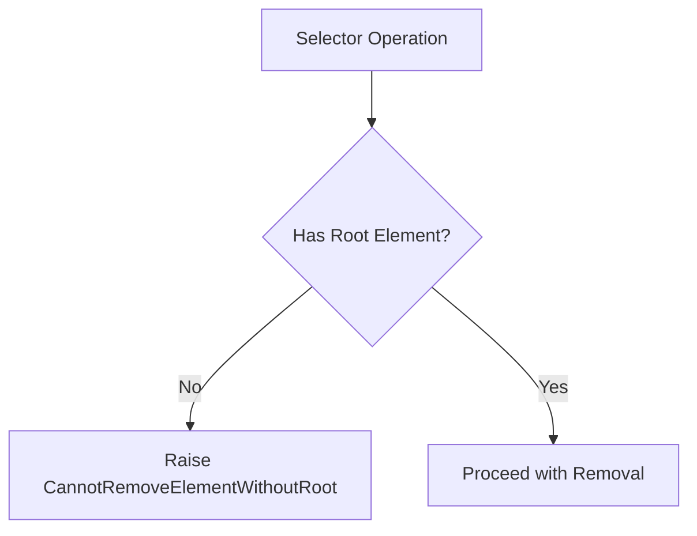
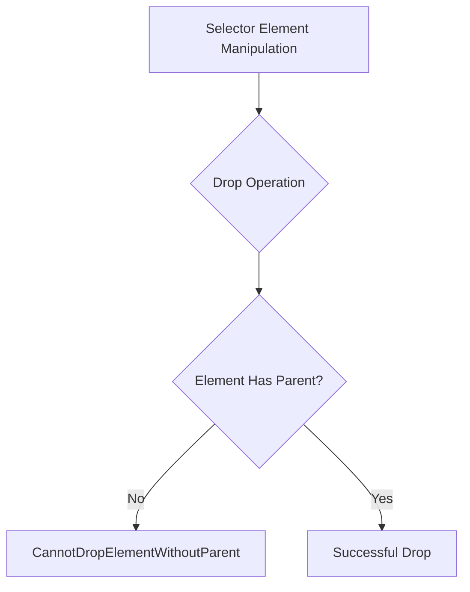
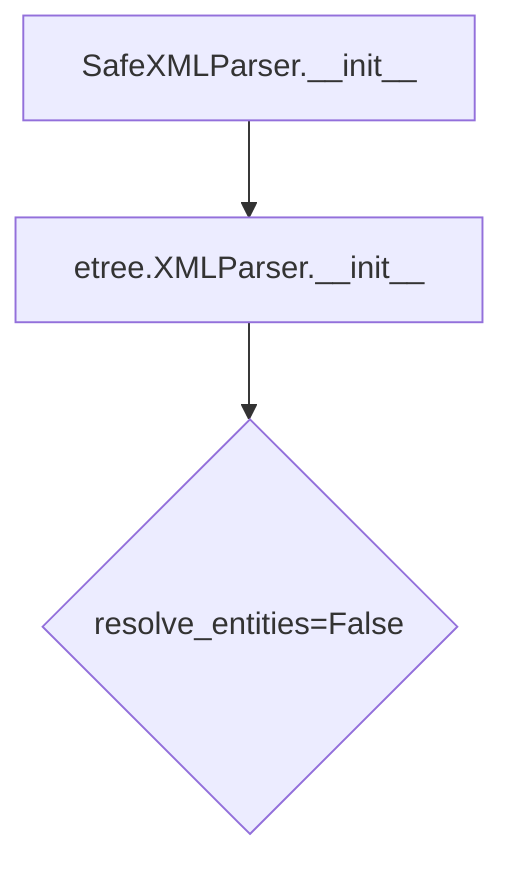
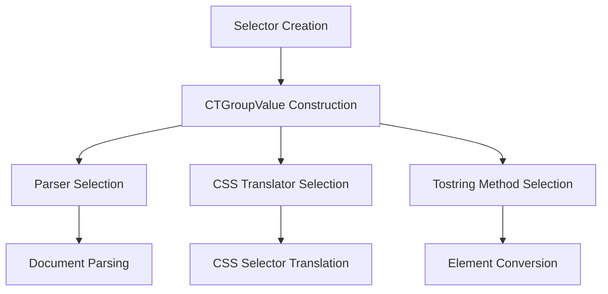
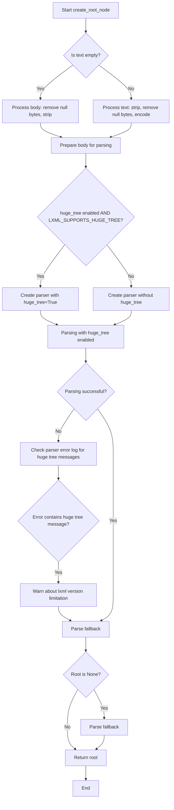
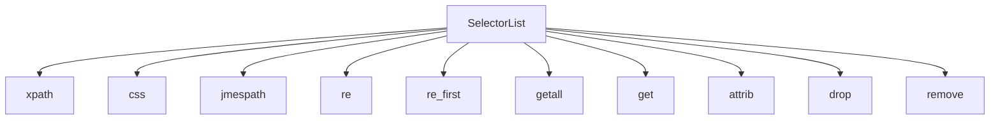

# `selector.py`

## `parsel.selector.CannotRemoveElementWithoutRoot` · *class*

## Summary:
Exception raised when attempting to remove an element from a selector without having a root element defined.

## Description:
This exception is thrown when a method attempts to remove an element from a selector structure but the selector has not been initialized with a root element. It serves as a guardrail to prevent operations on malformed or uninitialized selector objects.

## State:
- This is a simple exception class with no instance attributes
- Inherits from Python's built-in Exception class
- No initialization parameters required

## Lifecycle:
- Creation: Instantiated automatically by the selector system when validation fails
- Usage: Raised during element removal operations when root is missing
- Destruction: Handled by exception handling mechanisms in calling code

## Method Map:


## Raises:
- CannotRemoveElementWithoutRoot: Raised when attempting to remove elements from a selector that lacks a root element

## Example:
```python
# This would raise CannotRemoveElementWithoutRoot
selector = Selector(text='<div>Hello World</div>')
# selector.root is None or unset
try:
    selector.remove('p')  # Attempting to remove element without root
except CannotRemoveElementWithoutRoot as e:
    print("Cannot remove element without root element")
```

## `parsel.selector.CannotRemoveElementWithoutParent` · *class*

*No documentation generated.*

## `parsel.selector.CannotDropElementWithoutParent` · *class*

## Summary:
Exception raised when attempting to drop an element from a selector that does not have a parent node.

## Description:
This exception is a specialized subclass of CannotRemoveElementWithoutParent that is raised during selector element manipulation operations when a drop operation is attempted on an element that lacks a parent reference. It indicates that the element being dropped is not properly connected to a parent element in the document tree structure.

## State:
- Inherits all attributes and behavior from CannotRemoveElementWithoutParent parent class
- No additional instance variables or state beyond parent class
- The exception message would typically indicate the problematic element and the operation attempted

## Lifecycle:
- Creation: Automatically raised by the parsel selector library when drop() operations encounter orphaned elements
- Usage: Caught and handled by client code when performing element manipulation operations
- Destruction: Standard Python exception handling and cleanup

## Method Map:


## Raises:
- CannotDropElementWithoutParent: Raised when drop() method is called on an element with no parent node reference

## Example:
```python
from parsel import Selector

# Example scenario where this might occur
selector = Selector('<div><span>text</span></div>')
element = selector.xpath('//span')[0]

# If internal validation detects that element has no parent,
# attempting to drop it would raise this exception
try:
    element.drop()
except CannotDropElementWithoutParent as e:
    print(f"Cannot drop element without parent: {e}")
```

## `parsel.selector.SafeXMLParser` · *class*

## Summary:
A secure XML parser that disables entity resolution to prevent XXE vulnerabilities.

## Description:
The SafeXMLParser class extends lxml's XMLParser to provide a secure parsing configuration by disabling entity resolution. This prevents XML External Entity (XXE) injection attacks by ensuring that external entities are not resolved during XML parsing operations. This class should be used whenever parsing untrusted XML content to mitigate security risks.

## State:
- Inherits all attributes from etree.XMLParser
- The `resolve_entities` parameter is explicitly set to `False` in the constructor, overriding any user-specified value
- No additional instance attributes beyond those inherited from the parent class

## Lifecycle:
- Creation: Instantiate with standard etree.XMLParser arguments, or without arguments for default secure configuration
- Usage: Pass instances to lxml parsing functions like etree.fromstring() or etree.parse()
- Destruction: Managed automatically by Python's garbage collection; no explicit cleanup required

## Method Map:


## Raises:
- Any exceptions that etree.XMLParser.__init__ may raise due to invalid arguments
- Typically includes TypeError for invalid argument types, ValueError for invalid parameter combinations

## Example:
```python
from parsel.selector import SafeXMLParser
from lxml import etree

# Create a secure parser instance
parser = SafeXMLParser()

# Parse XML safely
xml_content = "<root><item>value</item></root>"
tree = etree.fromstring(xml_content, parser=parser)

# Can also pass additional arguments to the parent parser
secure_parser = SafeXMLParser(collect_ids=False, encoding='utf-8')
```

### `parsel.selector.SafeXMLParser.__init__` · *method*

## Summary:
Initializes a secure XML parser with entity resolution disabled to prevent XXE vulnerabilities.

## Description:
Configures the XML parser with secure defaults by ensuring entity resolution is disabled. This prevents XML External Entity (XXE) injection attacks by blocking resolution of external entities during XML parsing operations. The method overrides the parent class initialization to enforce this security measure.

## Args:
    *args (Any): Positional arguments passed to the parent etree.XMLParser constructor
    **kwargs (Any): Keyword arguments passed to the parent etree.XMLParser constructor

## Returns:
    None: This method initializes the object in-place and returns nothing

## Raises:
    Any exceptions that etree.XMLParser.__init__ may raise due to invalid arguments
    Typically includes TypeError for invalid argument types, ValueError for invalid parameter combinations

## State Changes:
    Attributes READ: None
    Attributes WRITTEN: None (initialization of parent class attributes)

## Constraints:
    Preconditions: None
    Postconditions: The parser instance is initialized with resolve_entities=False regardless of user-provided values

## Side Effects:
    None: This method performs no I/O operations or external service calls

## `parsel.selector.CTGroupValue` · *class*

## Summary:
Defines a configuration group for parsing and CSS translation operations in the parsel library.

## Description:
CTGroupValue is a TypedDict that represents a collection of configuration parameters used for HTML/XML parsing and CSS selector translation. It serves as a structured way to bundle together parser type, CSS translator implementation, and tostring method specification that are commonly used together in selector operations.

This abstraction allows for consistent configuration management across different parsing contexts while maintaining type safety through static type checking.

## State:
- `_parser`: Union[Type[etree.XMLParser], Type[html.HTMLParser]]
  - Type: Parser class type
  - Valid values: Either etree.XMLParser or html.HTMLParser classes
  - Purpose: Specifies the parser implementation to use for document parsing
  
- `_csstranslator`: Union[GenericTranslator, HTMLTranslator]
  - Type: CSS translator instance
  - Valid values: Either GenericTranslator or HTMLTranslator instances
  - Purpose: Provides CSS selector translation capabilities
  
- `_tostring_method`: str
  - Type: String identifier
  - Valid values: Any string representing a tostring method name
  - Purpose: Specifies which tostring method to use when converting elements back to strings

## Lifecycle:
- Creation: Instances are created by combining the three required configuration values
- Usage: Typically passed as part of a larger configuration object to selector functions or classes
- Destruction: No explicit cleanup required as it's a simple TypedDict structure

## Method Map:


## Raises:
- No exceptions are raised during initialization as this is a TypedDict definition
- Usage errors would occur at runtime if invalid values are provided to consuming functions

## Example:
```python
# Creating a CTGroupValue instance
from lxml import etree, html
from csstranslator import GenericTranslator, HTMLTranslator

config = CTGroupValue(
    _parser=html.HTMLParser,
    _csstranslator=HTMLTranslator(),
    _tostring_method="tostring"
)

# This configuration would be used by selector classes to maintain consistent parsing behavior
```

## `parsel.selector._xml_or_html` · *function*

## Summary:
Determines whether to process content as XML or HTML based on the provided type indicator.

## Description:
This utility function serves as a simple type resolver that maps an input type string to either "xml" or "html". When the input type is explicitly "xml", it returns "xml"; otherwise, it defaults to returning "html". This function is typically used to select appropriate parsing strategies for different markup formats.

## Args:
    type (Optional[str]): The type indicator string, typically representing the content format. If None or any value other than "xml", the function defaults to "html".

## Returns:
    str: Either "xml" or "html" indicating the appropriate processing mode for markup content.

## Raises:
    None: This function does not raise any exceptions.

## Constraints:
    Preconditions: The input parameter should be a string or None.
    Postconditions: The return value is always either "xml" or "html".

## Side Effects:
    None: This function has no side effects.

## Control Flow:
```mermaid
flowchart TD
    A[Input type] --> B{type == "xml"?}
    B -- Yes --> C[Return "xml"]
    B -- No --> D[Return "html"]
```

## Examples:
    >>> _xml_or_html("xml")
    'xml'
    >>> _xml_or_html("html")
    'html'
    >>> _xml_or_html(None)
    'html'
    >>> _xml_or_html("other")
    'html'

## `parsel.selector.create_root_node` · *function*

## Summary:
Creates an XML/HTML root node from text or byte content with robust error handling and fallback mechanisms.

## Description:
This function serves as a unified interface for parsing text or binary content into an lxml root element. It handles various edge cases including empty inputs, null bytes, encoding issues, and large tree parsing limitations. The function ensures consistent parsing behavior regardless of input format while providing appropriate fallbacks when parsing fails.

## Args:
    text (str): Text content to parse. If empty, the body parameter is used instead.
    parser_cls (Type[_ParserType]): The lxml parser class to use for parsing (e.g., etree.HTMLParser or etree.XMLParser).
    base_url (Optional[str]): Base URL to use for resolving relative URLs in the parsed content. Defaults to None.
    huge_tree (bool): Whether to enable huge tree parsing support. Defaults to LXML_SUPPORTS_HUGE_TREE.
    body (bytes): Binary content to parse when text is empty. Defaults to b"".
    encoding (str): Character encoding to use when encoding text. Defaults to "utf8".

## Returns:
    etree._Element: An lxml root element representing the parsed content. Always returns a valid root element, even if parsing fails or input is empty.

## Raises:
    None explicitly raised - though lxml parsing may raise exceptions internally which propagate up.

## Constraints:
    Preconditions:
    - parser_cls must be a valid lxml parser class (HTMLParser or XMLParser)
    - text should be a string or empty
    - body should be bytes or empty
    
    Postconditions:
    - Always returns a valid etree._Element instance
    - The returned element is suitable for further lxml operations

## Side Effects:
    - May emit warnings via the warnings module when huge_tree parsing fails due to version limitations
    - Uses lxml's etree.fromstring for parsing operations
    - May perform encoding operations on text input

## Control Flow:


## Examples:
```python
# Basic usage with HTML text
from lxml import etree
root = create_root_node("<div>Hello World</div>", etree.HTMLParser)

# Usage with empty text and body parameter
root = create_root_node("", etree.HTMLParser, body=b"<p>Content</p>")

# Usage with custom encoding
root = create_root_node("Hello", etree.HTMLParser, encoding="latin-1")
```

## `parsel.selector.SelectorList` · *class*

## Summary:
A list-like container that holds selector objects and provides batch operations for querying and extracting data from them.

## Description:
The SelectorList class extends Python's built-in list to provide a convenient interface for applying XPath, CSS, JMESPath queries, regular expressions, and extraction operations to multiple selector objects simultaneously. It enables batch processing of selector operations, allowing developers to apply the same query or extraction method to all elements in the collection at once.

When methods such as xpath(), css(), re(), getall(), etc. are called on a SelectorList, they execute the corresponding operation against each selector object contained within the list and return a new SelectorList with the results.

## State:
- Inherits from `List[_SelectorType]` where _SelectorType represents selector objects
- Each element in the list is a selector object that supports methods like xpath, css, get, etc.
- Maintains all standard list properties and behaviors
- Typically created through selector methods that return collections of selectors

## Lifecycle:
- Creation: Instantiated either directly with selector objects or through selector methods that return lists (e.g., response.xpath('//div'))
- Usage: Apply batch operations like xpath(), css(), re(), getall(), etc. to process all contained selectors
- Destruction: Standard Python list cleanup; no special cleanup required

## Method Map:


## Raises:
- TypeError from `__getstate__`: "can't pickle SelectorList objects" when attempting to serialize the object
- Various exceptions may be raised by underlying selector methods when invalid queries are applied

## Example:
```python
# Create a selector list (typically done through selector methods)
selectors = response.xpath('//div[@class="item"]')  # Returns SelectorList

# Apply batch operations
titles = selectors.css('h2.title::text').getall()
prices = selectors.xpath('.//span[@class="price"]/text()').getall()

# Extract first matching result from each selector
first_title = selectors.css('h2.title::text').get()

# Apply regular expressions to all selectors
matches = selectors.re(r'(\d+)')

# Get attributes from all selectors
all_attributes = selectors.attrib

# Drop/remove all selectors from the list
selectors.drop()
```

### `parsel.selector.SelectorList.__getitem__` · *method*

*No documentation generated.*

### `parsel.selector.SelectorList.__getstate__` · *method*

## Summary:
Prevents serialization of SelectorList objects by raising a TypeError during pickling operations.

## Description:
This method is part of Python's pickle protocol and is intentionally implemented to raise a TypeError to prevent SelectorList objects from being serialized. This is necessary because SelectorList instances contain lxml element objects and other non-pickleable components that cannot be properly serialized.

## Args:
    self: The SelectorList instance being pickled.

## Returns:
    None: This method never returns normally as it always raises an exception.

## Raises:
    TypeError: Always raised with the message "can't pickle SelectorList objects" to prevent serialization.

## State Changes:
    Attributes READ: None - This method doesn't read any instance attributes.
    Attributes WRITTEN: None - This method doesn't modify any instance attributes.

## Constraints:
    Preconditions: The method is called automatically by Python's pickle module during serialization attempts.
    Postconditions: The method always raises a TypeError, preventing successful pickling.

## Side Effects:
    None: This method doesn't perform any I/O operations or mutate external state. It simply raises an exception to prevent pickling.

### `parsel.selector.SelectorList.jmespath` · *method*

## Summary:
Applies a JMESPath query to each selector in the list and returns a flattened SelectorList of matching elements.

## Description:
This method executes a JMESPath query against each selector in the current SelectorList instance. It delegates to each individual selector's jmespath method, then flattens all results into a new SelectorList of the same type. This enables querying JSON data structures across multiple selectors simultaneously.

The method is particularly useful when working with JSON responses that contain arrays or nested structures, allowing for complex data extraction patterns across multiple JSON documents. When a selector's type is "json", it processes the JSON data directly; for HTML/XML selectors, it extracts JSON data from the text content.

## Args:
    query (str): A JMESPath query string to apply to each selector
    **kwargs (Any): Additional keyword arguments passed to the underlying jmespath library

## Returns:
    SelectorList[_SelectorType]: A new SelectorList containing all matching elements from applying the query to each selector in the current list. The result is flattened to eliminate nested structures.

## Raises:
    None explicitly raised by this method - any exceptions from underlying operations will propagate up

## State Changes:
    Attributes READ: None - this method only reads from the self collection
    Attributes WRITTEN: None - this method creates a new object rather than modifying self

## Constraints:
    Preconditions:
    - Each selector in self must support the jmespath operation (i.e., be of type "json", "html", or "xml")
    - The query parameter must be a valid JMESPath expression
    - All selectors in the list should be compatible with the same JMESPath query structure
    
    Postconditions:
    - The returned SelectorList contains elements that match the JMESPath query
    - The returned SelectorList maintains the same type as the original SelectorList
    - Results are flattened from potentially nested structures into a single flat list

## Side Effects:
    None - this method performs no I/O operations or external service calls

### `parsel.selector.SelectorList.xpath` · *method*

## Summary:
Applies an XPath expression to each selector in the list and returns a flattened SelectorList of matching elements.

## Description:
This method executes an XPath query against each individual selector in the current SelectorList instance. It applies the XPath expression to every selector in the list, collects all results, and flattens them into a new SelectorList instance containing all matching elements. This enables querying XML/HTML documents across multiple selectors simultaneously.

The method follows the same pattern as other query methods in the SelectorList class (css(), jmespath(), re()), providing a consistent interface for querying selector collections with different query languages. It's particularly useful when extracting data from multiple XML/HTML elements using XPath expressions.

## Args:
    xpath (str): An XPath expression string to apply to each selector in the list
    namespaces (Optional[Mapping[str, str]]): Optional namespace declarations to resolve prefixed names in the XPath expression
    **kwargs (Any): Additional keyword arguments passed to the underlying XPath implementation

## Returns:
    SelectorList[_SelectorType]: A new SelectorList instance containing all elements that match the XPath expression across all selectors in the current list. The result is flattened to eliminate nested lists.

## Raises:
    None explicitly raised by this method - any exceptions from underlying XPath operations will propagate up

## State Changes:
    Attributes READ: None - this method only iterates over self
    Attributes WRITTEN: None - this method creates a new object rather than modifying self

## Constraints:
    Preconditions:
    - Each selector in self must support the xpath() method (i.e., be an HTML/XML selector)
    - The xpath parameter must be a valid XPath expression
    - All selectors in the list should be compatible with the same XPath query structure
    
    Postconditions:
    - Returns a new SelectorList instance (not modifying self)
    - All matching elements from each selector are included in the result
    - Result is flattened to eliminate nested lists

## Side Effects:
    None - this method performs no I/O operations or external service calls

### `parsel.selector.SelectorList.css` · *method*

## Summary:
Applies a CSS selector query to each selector in the list and returns a flattened list of matching elements.

## Description:
This method executes a CSS selector query against each individual selector in the current SelectorList instance. It collects all results from applying the CSS query to each element and flattens them into a new SelectorList instance containing all matching elements. This allows for chaining CSS queries and collecting results from multiple elements in a single operation.

The method follows the pattern established by similar methods like xpath() and jmespath() in the same class, providing a consistent interface for querying selector collections.

## Args:
    query (str): A CSS selector string to apply to each element in the list

## Returns:
    SelectorList[_SelectorType]: A new SelectorList instance containing all elements that match the CSS query across all selectors in the current list

## Raises:
    None explicitly raised - relies on underlying css() method implementations of individual selectors

## State Changes:
    Attributes READ: None - this method only iterates over self
    Attributes WRITTEN: None - this method doesn't modify any instance attributes

## Constraints:
    Preconditions: 
    - The query parameter must be a valid CSS selector string
    - Each element in self must have a css() method that accepts a string parameter
    - The _SelectorType must support the css() method interface
    
    Postconditions:
    - Returns a new SelectorList instance (not modifying self)
    - All matching elements from each selector are included in the result
    - Result is flattened to eliminate nested lists

## Side Effects:
    None - this method is pure and doesn't cause any I/O operations or external service calls

### `parsel.selector.SelectorList.re` · *method*

## Summary:
Applies a regular expression to all selectors in this list and returns flattened matching results.

## Description:
This method executes a regular expression search on each selector within the list, collecting all matches and flattening them into a single list. It's commonly used to extract text patterns from multiple elements simultaneously.

## Args:
    regex (Union[str, Pattern[str]]): Regular expression pattern to match against selector content. Can be a string or compiled regex pattern.
    replace_entities (bool): Whether to replace HTML entities in the matched results. Defaults to True.

## Returns:
    List[str]: Flattened list of all strings matching the regex pattern across all selectors in the list.

## Raises:
    None explicitly raised by this method. Exceptions may be raised by underlying regex operations or selector methods.

## State Changes:
    Attributes READ: None - this method only reads from the list elements
    Attributes WRITTEN: None - this method doesn't modify any instance attributes

## Constraints:
    Preconditions: 
    - The object must be a SelectorList instance
    - Each element in the list must support the .re() method
    - The regex parameter must be a valid regex pattern or string
    
    Postconditions:
    - Returns a list of strings (empty list if no matches found)
    - All matches from all selectors are included in the result
    - Results are flattened from nested structures

## Side Effects:
    None - this method is pure and doesn't cause any I/O or external service calls

### `parsel.selector.SelectorList.re_first` · *method*

## Summary:
Returns the first match of a regular expression from all selectors in the list, or a default value if no matches are found.

## Description:
This method applies a regular expression pattern to each selector in the SelectorList and returns the first matching result. It flattens nested results from individual selector matches and returns the first match encountered. This is useful for extracting the first occurrence of a pattern across multiple selectors.

## Args:
    regex (Union[str, Pattern[str]]): Regular expression pattern to match against selector content.
    default (Optional[str]): Default value to return if no matches are found. Defaults to None.
    replace_entities (bool): Whether to replace HTML entities in the matched content. Defaults to True.

## Returns:
    Optional[str]: The first matched string, or the default value if no matches are found.

## Raises:
    None explicitly raised by this method.

## State Changes:
    Attributes READ: None - this method only reads from the self object's contents
    Attributes WRITTEN: None - this method does not modify any attributes

## Constraints:
    Preconditions: 
    - self must be a SelectorList containing Selector objects that support the .re() method
    - Each selector in self must support the .re() method with the same signature
    Postconditions:
    - Returns either a string match or the default value
    - Does not modify the state of any selector in self

## Side Effects:
    None - this method performs no I/O operations or external service calls

### `parsel.selector.SelectorList.getall` · *method*

## Summary:
Returns a list of extracted text content from all selectors in the SelectorList.

## Description:
This method iterates over all selector objects contained in the SelectorList instance and extracts their text content by calling the `.get()` method on each selector. It's commonly used to retrieve all matching elements' text content in a single operation.

## Args:
    None

## Returns:
    List[str]: A list of strings containing the extracted text content from each selector in the list. Returns an empty list if the SelectorList is empty.

## Raises:
    AttributeError: If any item in the SelectorList does not have a `.get()` method.

## State Changes:
    Attributes READ: None
    Attributes WRITTEN: None

## Constraints:
    Preconditions: 
    - The SelectorList instance (`self`) must be iterable
    - Each item in the SelectorList must have a `.get()` method that returns a string
    
    Postconditions:
    - Returns a list of strings with the same length as the number of items in the SelectorList
    - Each returned string corresponds to the result of calling `.get()` on each selector

## Side Effects:
    None

### `parsel.selector.SelectorList.get` · *method*

## Summary:
Returns the result of calling `get()` on the first element of the selector list, or returns a default value if the list is empty.

## Description:
This method iterates through the selector list and returns the result of calling the `get()` method on the first element encountered. If the selector list is empty, it returns the specified default value instead. This method is particularly useful when you expect at most one matching element and want to extract its text content.

The method is designed to be consistent with other selector list methods like `getall()` and `re_first()`, providing a uniform interface for extracting values from selector collections.

## Args:
    default (Optional[str]): The default value to return if the selector list is empty. Defaults to None.

## Returns:
    Any: The result of calling `get()` on the first element, or the default value if the list is empty. When the default is None, returns Optional[str]; when the default is a string, returns str.

## Raises:
    None explicitly raised

## State Changes:
    Attributes READ: None - this method only reads from the iterable self
    Attributes WRITTEN: None - this method doesn't modify any instance attributes

## Constraints:
    Preconditions: 
    - self must be iterable (implements __iter__)
    - Each element in self must have a callable `get()` method that returns a string or None
    Postconditions:
    - Returns either the result of first element's get() method or the default value
    - Does not modify the selector list or its elements

## Side Effects:
    None - this method performs no I/O operations or external service calls

### `parsel.selector.SelectorList.attrib` · *method*

## Summary:
Returns the attribute dictionary of the first element in the selector list, or an empty dictionary if the list is empty.

## Description:
This property provides convenient access to the HTML/XML attributes of the first matching element in the selector list. It's particularly useful when working with CSS or XPath selectors that return a single element, allowing direct access to that element's attributes without needing to manually index into the list first.

The property follows the common pattern of returning the first result when dealing with collections that may contain zero or more elements, making it safe to use even when no elements match the selection criteria.

## Args:
    None

## Returns:
    Mapping[str, str]: A dictionary mapping attribute names to their string values for the first element in the list. Returns an empty dictionary if the list is empty.

## Raises:
    None

## State Changes:
    Attributes READ: None - this property only reads from the iterator over self
    Attributes WRITTEN: None - this property doesn't modify any instance attributes

## Constraints:
    Preconditions: 
    - The SelectorList must be initialized properly
    - Elements in the list must support the .attrib property (typically lxml elements)
    
    Postconditions:
    - Returns a dictionary with string keys and values
    - Returns an empty dictionary when the list is empty
    - The returned dictionary is a copy of the element's attributes (not a reference)

## Side Effects:
    None - this property performs no I/O operations or external service calls

### `parsel.selector.SelectorList.remove` · *method*

## Summary:
Removes elements from the selector list by calling remove() on each contained selector element, while issuing a deprecation warning.

## Description:
This method serves as a deprecated interface for removing elements from a SelectorList. It issues a deprecation warning directing users to use the `drop` method instead. The method iterates through all elements in the list and calls the `remove()` method on each individual selector element.

## Args:
    None

## Returns:
    None

## Raises:
    None explicitly raised

## State Changes:
    Attributes READ: None
    Attributes WRITTEN: None

## Constraints:
    Preconditions: The SelectorList must contain elements that support a `remove()` method
    Postconditions: All elements in the list have had their `remove()` method called

## Side Effects:
    Issues a DeprecationWarning via Python's warnings module
    Calls the `remove()` method on each element in the list, which may have side effects depending on the implementation of those elements

### `parsel.selector.SelectorList.drop` · *method*

## Summary:
Removes all selected elements from their respective parent nodes in the parsed document tree.

## Description:
This method iterates through all Selector objects contained in the SelectorList and calls the drop() method on each one. The drop() operation removes each element from its parent node in the XML/HTML tree structure, effectively eliminating it from the parsed document.

## Args:
    None

## Returns:
    None

## Raises:
    CannotDropElementWithoutParent: Raised when attempting to drop an element that has no parent node.
    CannotRemoveElementWithoutRoot: Raised when attempting to drop an element that has no root node.

## State Changes:
    Attributes READ: None
    Attributes WRITTEN: None

## Constraints:
    Preconditions: 
    - All elements in the SelectorList must be valid Selector objects with root nodes
    - Each Selector must have a parent node in the document tree
    - The SelectorList must not be empty (though calling drop on an empty list is safe)
    
    Postconditions:
    - All elements in the SelectorList are removed from their parent nodes
    - The SelectorList itself remains unchanged (same length, same elements in same order)

## Side Effects:
    Mutates the underlying XML/HTML document tree by removing elements from their parent nodes.

## `parsel.selector._get_root_from_text` · *function*

## Summary:
Parses text content into an lxml root element using a registered parser based on content type.

## Description:
This function acts as a factory for creating lxml root elements from text content by delegating to `create_root_node` with a parser selected from a global content type registry. It provides a clean abstraction layer that allows parsing different content types (HTML, XML, etc.) through a consistent interface.

The function extracts the appropriate parser from the global `_ctgroup` registry based on the provided `type` parameter and forwards all arguments to `create_root_node`.

## Args:
    text (str): The text content to parse into an lxml root element.
    type (str): Identifier specifying the content type (e.g., "html", "xml") used to select the appropriate parser from the internal registry.
    **lxml_kwargs (Any): Additional keyword arguments to pass through to the underlying lxml parsing functions.

## Returns:
    etree._Element: An lxml root element representing the parsed content. Always returns a valid root element instance.

## Raises:
    KeyError: If the specified `type` is not found in the internal `_ctgroup` registry.
    Exception: Any exceptions that may occur during the lxml parsing process (propagated from `create_root_node`).

## Constraints:
    Preconditions:
    - The `type` parameter must correspond to a valid key in the global `_ctgroup` registry
    - The `_ctgroup[type]["_parser"]` must resolve to a valid lxml parser class
    - `text` should be a valid string that can be parsed by the selected parser

    Postconditions:
    - Always returns a valid etree._Element instance
    - The returned element is suitable for further lxml operations

## Side Effects:
    - May emit warnings via the warnings module when parsing fails or when huge_tree parsing limitations are encountered (through `create_root_node`)
    - Uses lxml's etree.fromstring for parsing operations (through `create_root_node`)
    - May perform encoding operations on text input (through `create_root_node`)

## Control Flow:
```mermaid
flowchart TD
    A[Start _get_root_from_text] --> B{Get parser from _ctgroup[type]}
    B --> C[Call create_root_node with text, parser, and lxml_kwargs]
    C --> D[Return result from create_root_node]
```

## Examples:
```python
# Parse HTML content
from lxml import etree
root = _get_root_from_text("<div>Hello World</div>", type="html")

# Parse XML content with additional kwargs
root = _get_root_from_text("<root><item>test</item></root>", type="xml", base_url="http://example.com")
```

## `parsel.selector._get_root_and_type_from_bytes` · *function*

## Summary:
Parses byte content into appropriate root node and type based on content format and input specifications.

## Description:
This function processes raw byte content and determines the appropriate parsing strategy based on the input type hint and content characteristics. It handles multiple content types including text, JSON, HTML, and XML, returning both the parsed root element and the determined content type. The function is designed to be a central parsing entry point that routes content to appropriate handlers based on format detection logic.

## Args:
    body (bytes): Raw byte content to parse
    encoding (str): Character encoding to use for decoding text content
    input_type (Optional[str]): Hint about the expected content type ('text', 'json', 'html', 'xml', or None)
    **lxml_kwargs (Any): Additional keyword arguments to pass to lxml parsers

## Returns:
    Tuple[Any, str]: A tuple containing (parsed_content, content_type) where:
        - parsed_content: The parsed result (decoded text string, JSON data, or lxml root element)
        - content_type: String indicating the detected content type ('text', 'json', 'html', or 'xml')

## Raises:
    AssertionError: When input_type is not one of ('html', 'xml', None) after validation

## Constraints:
    Preconditions:
    - body must be bytes
    - encoding must be a valid string
    - input_type must be one of ('text', 'json', 'html', 'xml', None) or None
    - _ctgroup must be properly initialized with '_parser' keys for 'html' and 'xml'
    
    Postconditions:
    - Returns a tuple with parsed content and content type
    - For text input, returns decoded string and 'text' type
    - For JSON input, returns parsed JSON data and 'json' type
    - For xml/html input, returns lxml root element and corresponding type

## Side Effects:
    None: This function has no side effects beyond the standard Python I/O operations during JSON parsing and lxml parsing.

## Control Flow:
```mermaid
flowchart TD
    A[Start _get_root_and_type_from_bytes] --> B{input_type == "text"?}
    B -- Yes --> C[Decode body with encoding, return (decoded_text, "text")]
    B -- No --> D{encoding == "utf8"?}
    D -- Yes --> E[Try json.load(BytesIO(body))]
    E --> F{json.load succeeds?}
    F -- Yes --> G[Return (json_data, "json")]
    F -- No --> H[Set data = _NOT_SET]
    H --> I{data is not _NOT_SET?}
    I -- Yes --> J[Return (data, "json")]
    I -- No --> K{input_type == "json"?}
    K -- Yes --> L[Return (None, "json")]
    K -- No --> M[Assert input_type in ("html", "xml", None)]
    M --> N[type = _xml_or_html(input_type)]
    N --> O[create_root_node(...)]
    O --> P[Return (root, type)]
```

## Examples:
    # Parse text content
    result, content_type = _get_root_and_type_from_bytes(b"Hello World", "utf-8", input_type="text")
    # Returns: ("Hello World", "text")

    # Parse JSON content
    result, content_type = _get_root_and_type_from_bytes(b'{"key": "value"}', "utf-8", input_type="json")
    # Returns: ({"key": "value"}, "json")

    # Parse HTML content
    result, content_type = _get_root_and_type_from_bytes(b"<html><body>Hello</body></html>", "utf-8", input_type="html")
    # Returns: (<lxml.etree._Element>, "html")
```

## `parsel.selector._get_root_and_type_from_text` · *function*

## Summary:
Determines the appropriate parsing type for text content and returns the parsed root element along with its type identifier.

## Description:
This utility function analyzes input text to identify its content type (text, JSON, HTML, or XML) and returns the appropriately parsed root element along with the detected type. It handles multiple content formats by attempting JSON parsing first, then falling back to XML/HTML detection based on input parameters.

The function is designed to be a central parsing dispatcher that abstracts away the complexity of content type detection and parsing. It's typically called internally by selector methods when processing text input from various sources.

## Args:
    text (str): The text content to analyze and parse. This can be plain text, JSON, HTML, or XML formatted content.
    input_type (Optional[str]): Explicit content type hint that can be "text", "json", "html", or "xml". If None, the function attempts to auto-detect the type.
    **lxml_kwargs (Any): Additional keyword arguments to pass through to lxml parsing functions when handling HTML/XML content.

## Returns:
    Tuple[Any, str]: A tuple containing the parsed root element (or raw text/data) and the determined content type string. Possible return combinations:
    - (str, "text"): When input_type is explicitly "text", returns the original text and type
    - (dict/list, "json"): When text is valid JSON, returns the parsed data and type
    - (None, "json"): When input_type is "json" but text is invalid JSON
    - (etree._Element, "html"/"xml"): When text is parsed as HTML/XML, returns the root element and type

## Raises:
    None: This function does not explicitly raise exceptions, though underlying parsing operations may raise exceptions from lxml or json modules.

## Constraints:
    Preconditions:
    - The `text` parameter must be a valid string
    - The `input_type` parameter, if provided, must be one of "text", "json", "html", "xml", or None
    
    Postconditions:
    - Always returns a tuple with two elements: parsed content and type string
    - The returned type string is always one of "text", "json", "html", or "xml"

## Side Effects:
    None: This function has no side effects beyond potential warnings from lxml parsing operations.

## Control Flow:
```mermaid
flowchart TD
    A[Start _get_root_and_type_from_text] --> B{input_type == "text"?}
    B -- Yes --> C[Return (text, "text")]
    B -- No --> D[Try json.loads(text)]
    D --> E{json.loads succeeds?}
    E -- Yes --> F[Return (parsed_data, "json")]
    E -- No --> G{input_type == "json"?}
    G -- Yes --> H[Return (None, "json")]
    G -- No --> I[assert input_type in ("html", "xml", None)]
    I --> J[_xml_or_html(input_type)]
    J --> K[_get_root_from_text(text, type=detected_type)]
    K --> L[Return (root, detected_type)]
```

## Examples:
    # Parse plain text
    root, type = _get_root_and_type_from_text("Hello World", input_type="text")
    # Returns: ("Hello World", "text")

    # Parse JSON content
    root, type = _get_root_and_type_from_text('{"key": "value"}', input_type=None)
    # Returns: ({"key": "value"}, "json")

    # Parse HTML content
    root, type = _get_root_and_type_from_text("<div>Hello</div>", input_type="html")
    # Returns: (<etree.Element>, "html")
```

## `parsel.selector._get_root_type` · *function*

## Summary:
Determines the appropriate content type for parsing based on the root object and input type specification.

## Description:
This function analyzes the type of the root object and input type specification to determine whether the content should be processed as XML, HTML, or JSON. It enforces type consistency by validating that lxml elements are not paired with incompatible input types, and provides appropriate type resolution for different content formats.

## Args:
    root (Any): The root object to analyze, which can be an lxml element, dict, list, or other data structure.
    input_type (Optional[str]): The explicitly specified input type, which can be "xml", "html", "json", or None.

## Returns:
    str: The determined content type, which will be one of "xml", "html", or "json".

## Raises:
    ValueError: When an lxml.etree._Element object is provided as root with input_type set to "json" or "text".

## Constraints:
    Preconditions:
        - The root parameter can be any type
        - The input_type parameter should be a string or None
    Postconditions:
        - Always returns a string that is either "xml", "html", or "json"

## Side Effects:
    None: This function has no side effects.

## Control Flow:
```mermaid
flowchart TD
    A[Start _get_root_type] --> B{root is etree._Element?}
    B -- Yes --> C{input_type in {"json", "text"}?}
    C -- Yes --> D[Raise ValueError]
    C -- No --> E[Call _xml_or_html(input_type)]
    B -- No --> F{root is dict/list OR _is_valid_json(root)?}
    F -- Yes --> G[Return "json"]
    F -- No --> H[Return input_type or "json"]
```

## Examples:
    >>> _get_root_type(etree.fromstring('<root></root>'), input_type=None)
    'html'
    >>> _get_root_type({'key': 'value'}, input_type=None)
    'json'
    >>> _get_root_type(etree.fromstring('<root></root>'), input_type='xml')
    'xml'
    >>> _get_root_type(etree.fromstring('<root></root>'), input_type='json')
    ValueError: Selector got an lxml.etree._Element object as root, and 'json' as type.

## `parsel.selector._is_valid_json` · *function*

## Summary:
Validates whether a given string contains syntactically correct JSON.

## Description:
Checks if the provided text string can be successfully parsed as JSON. This utility function is used internally by parsel to ensure data integrity when processing JSON-formatted content. The function handles both malformed JSON strings (causing ValueError) and non-string inputs (causing TypeError).

## Args:
    text (str): The string to validate as JSON format.

## Returns:
    bool: True if the text is valid JSON, False otherwise.

## Raises:
    None

## Constraints:
    Preconditions:
        - The input must be a string type
    Postconditions:
        - Always returns a boolean value
        - Does not modify the input string

## Side Effects:
    None

## Control Flow:
```mermaid
flowchart TD
    A[Start _is_valid_json] --> B{Try json.loads(text)}
    B -->|Success| C[Return True]
    B -->|Exception| D[Return False]
    C --> E[End]
    D --> E
```

## Examples:
    >>> _is_valid_json('{"key": "value"}')
    True
    >>> _is_valid_json('{"key":}')
    False
    >>> _is_valid_json('')
    False
    >>> _is_valid_json(123)
    False

## `parsel.selector._load_json_or_none` · *function*

## Summary:
Safely attempts to parse JSON text and returns the parsed result or None if parsing fails.

## Description:
This utility function provides a safe way to parse JSON data from text input. It handles various input types (str, bytes, bytearray) and gracefully returns None when the input cannot be parsed as valid JSON. The function is designed to prevent JSON parsing exceptions from propagating upward in the application.

## Args:
    text (Union[str, bytes, bytearray]): Input text to parse as JSON. Accepts string, bytes, or bytearray representations.

## Returns:
    Any: Parsed JSON object (dict, list, str, int, float, bool, or None) if successful, None otherwise.

## Raises:
    None: This function catches ValueError exceptions internally and returns None instead.

## Constraints:
    Preconditions:
        - Input should be a string, bytes, or bytearray
        - Input should represent valid JSON format when possible
    
    Postconditions:
        - Returns parsed JSON data or None
        - Never raises JSON parsing exceptions

## Side Effects:
    None: This function performs no I/O operations or external state mutations.

## Control Flow:
```mermaid
flowchart TD
    A[Start _load_json_or_none] --> B{isinstance(text, (str,bytes,bytearray))}
    B -- Yes --> C[Try json.loads(text)]
    C --> D{json.loads succeeds?}
    D -- Yes --> E[Return parsed data]
    D -- No --> F[Return None]
    B -- No --> G[Return None]
    E --> H[End]
    F --> H
    G --> H
```

## Examples:
    # Valid JSON string
    result = _load_json_or_none('{"key": "value"}')
    # Returns: {'key': 'value'}
    
    # Invalid JSON string
    result = _load_json_or_none('{"key":}')
    # Returns: None
    
    # Non-string input
    result = _load_json_or_none(123)
    # Returns: None

## `parsel.selector.Selector` · *class*

*No documentation generated.*

### `parsel.selector.Selector.__init__` · *method*

## Summary:
Initializes a Selector object with content for parsing and querying, setting up internal state based on provided text, body, or root parameters.

## Description:
The `__init__` method configures a Selector instance by processing input parameters to determine the content type and parse the appropriate root element. It supports multiple input formats including text strings, byte sequences, and pre-parsed lxml elements, while maintaining proper type consistency and namespace configuration.

This method serves as the primary constructor for Selector objects, orchestrating the parsing process based on the available input parameters. It validates inputs, handles parameter conflicts (like providing both text and root), and establishes the internal state needed for subsequent selection operations.

## Args:
    text (Optional[str]): Text content to parse, can be plain text, HTML, XML, or JSON. Defaults to None.
    type (Optional[str]): Explicit content type hint ("html", "json", "text", "xml", or None for auto-detection). Defaults to None.
    body (bytes): Raw byte content to parse. Defaults to empty bytes.
    encoding (str): Character encoding for decoding text content. Defaults to "utf8".
    namespaces (Optional[Mapping[str, str]]): Namespace mappings for CSS/XPath queries. Defaults to None.
    root (Optional[Any]): Pre-parsed lxml element or data structure. Defaults to _NOT_SET sentinel.
    base_url (Optional[str]): Base URL for resolving relative URLs in HTML/XML. Defaults to None.
    _expr (Optional[str]): Internal expression tracking for debugging. Defaults to None.
    huge_tree (bool): Enable lxml's huge_tree option for parsing large documents. Defaults to LXML_SUPPORTS_HUGE_TREE.

## Returns:
    None: This method initializes the object in-place and returns nothing.

## Raises:
    ValueError: When invalid type is provided or when no content parameters (text, body, or root) are supplied.
    TypeError: When text is not a string or body is not bytes.

## State Changes:
    Attributes READ: 
    - self._default_namespaces
    - LXML_SUPPORTS_HUGE_TREE (external reference)
    
    Attributes WRITTEN:
    - self.root: Set to parsed root element or content based on input parameters
    - self.type: Set to determined content type ("html", "json", "text", or "xml")
    - self.namespaces: Initialized with default namespaces and updated with provided namespaces
    - self._expr: Set to provided expression or None
    - self._huge_tree: Set to provided huge_tree value or default
    - self._text: Set to provided text or None

## Constraints:
    Preconditions:
    - If type is provided, it must be one of "html", "json", "text", "xml", or None
    - At least one of text, body, or root must be provided
    - If text is provided, it must be a string
    - If body is provided, it must be bytes
    
    Postconditions:
    - self.root is set to a parsed element or content of appropriate type
    - self.type is set to a valid content type string
    - self.namespaces contains default namespaces plus any provided ones
    - self._expr is set to provided value or None
    - self._huge_tree is set to provided boolean value or default

## Side Effects:
    - Issues warning when both text and root parameters are provided (root is ignored)
    - May perform I/O operations during parsing of text or byte content
    - Calls external parsing functions (_get_root_and_type_from_text, _get_root_and_type_from_bytes, _get_root_type)

### `parsel.selector.Selector.__getstate__` · *method*

## Summary:
Prevents Selector objects from being serialized via pickle by raising a TypeError.

## Description:
This method implements Python's pickle protocol to control object serialization. It explicitly raises a TypeError to prevent Selector instances from being pickled, as Selector objects contain lxml elements that are not serializable. This is a deliberate design decision to ensure that Selector objects cannot be accidentally serialized, which would break their functionality.

## Args:
    self: The Selector instance being pickled.

## Returns:
    This method never returns normally as it always raises an exception.

## Raises:
    TypeError: Always raised with the message "can't pickle Selector objects" to prevent serialization.

## State Changes:
    Attributes READ: None - this method doesn't read any instance attributes.
    Attributes WRITTEN: None - this method doesn't modify any instance attributes.

## Constraints:
    Preconditions: None - the method doesn't require any specific state of the object.
    Postconditions: None - the method never reaches a return point.

## Side Effects:
    None - this method only raises an exception and has no other side effects.

### `parsel.selector.Selector._get_root` · *method*

## Summary:
Creates and returns an lxml root element from text or binary content, using appropriate parser configuration based on content type.

## Description:
This method serves as a factory for creating lxml root elements from textual or binary content. It provides a consistent interface for parsing content with proper error handling and fallback mechanisms. The method determines the appropriate parser based on the content type and delegates the actual parsing work to `create_root_node`.

Known callers:
- `xpath` method when it needs to create a temporary HTML root for text content
- Internal parsing methods that require fresh root elements

This logic is separated into its own method to provide a clean abstraction for root node creation, enabling reuse across different parsing contexts while maintaining consistent behavior and error handling.

## Args:
    text (str): Text content to parse. Defaults to empty string.
    base_url (Optional[str]): Base URL for resolving relative URLs in parsed content. Defaults to None.
    huge_tree (bool): Enable huge tree parsing support. Defaults to LXML_SUPPORTS_HUGE_TREE.
    type (Optional[str]): Content type override ('html', 'xml', 'json', 'text'). Defaults to None.
    body (bytes): Binary content to parse when text is empty. Defaults to empty bytes.
    encoding (str): Character encoding for text processing. Defaults to 'utf8'.

## Returns:
    etree._Element: An lxml root element representing the parsed content. Always returns a valid root element.

## Raises:
    None explicitly raised - though lxml parsing may raise exceptions internally which propagate up.

## State Changes:
    Attributes READ: self.type
    Attributes WRITTEN: None

## Constraints:
    Preconditions:
    - If text is provided, it must be a string or empty
    - If body is provided, it must be bytes or empty
    - parser_cls (derived from _ctgroup) must be a valid lxml parser class
    
    Postconditions:
    - Always returns a valid etree._Element instance
    - The returned element is suitable for further lxml operations

## Side Effects:
    - Delegates to create_root_node which always returns a valid root element
    - Uses lxml's etree.fromstring for parsing operations
    - May perform encoding operations on text input

### `parsel.selector.Selector.jmespath` · *method*

## Summary:
Applies a JMESPath query to the selector's data and returns matching elements as a new SelectorList.

## Description:
This method executes a JMESPath query against the underlying data of the selector. It handles different data types (JSON, HTML, XML) appropriately, processes the query result to ensure it's a list format, and constructs new selectors from the matched results. The method is designed to enable JMESPath-based data extraction and filtering operations on parsed documents.

## Args:
    query (str): The JMESPath query string to execute against the selector's data.
    **kwargs (Any): Additional keyword arguments to pass to the JMESPath search function.

## Returns:
    SelectorList[_SelectorType]: A new SelectorList containing selectors constructed from the query results. Each selector corresponds to an element in the query result.

## Raises:
    None explicitly raised. However, underlying JMESPath search may raise exceptions for malformed queries.

## State Changes:
    Attributes READ: self.type, self.root
    Attributes WRITTEN: None

## Constraints:
    Preconditions: 
    - The selector must have a valid type attribute ('json', 'html', or 'xml')
    - For JSON selectors, root should either be a dict/list or a JSON string
    - For HTML/XML selectors, root.text should contain valid data
    
    Postconditions:
    - Returns a SelectorList regardless of query result (empty list if no matches)
    - Query results are properly converted to selector instances

## Side Effects:
    None directly. The returned SelectorList behaves as a standard list containing selector objects.

### `parsel.selector.Selector.css` · *method*

## Summary:
Converts a CSS selector query into XPath and executes it on the current selector.

## Description:
This method provides CSS selector functionality by translating CSS queries to XPath expressions using the internal `_css2xpath` method, then executing the resulting XPath query through the existing `xpath` method. It serves as a convenient interface for users who prefer CSS-style selectors over XPath.

## Args:
    query (str): A CSS selector string to be converted and executed.

## Returns:
    SelectorList[_SelectorType]: A list-like object containing selector results matching the CSS query.

## Raises:
    ValueError: When the selector's type is not one of ("html", "xml", "text").

## State Changes:
    Attributes READ: self.type, self._css2xpath
    Attributes WRITTEN: None

## Constraints:
    Preconditions: The selector must have a type of "html", "xml", or "text".
    Postconditions: Returns a SelectorList containing matching elements or an empty list.

## Side Effects:
    None

### `parsel.selector.Selector.re` · *method*

## Summary:
Extracts all strings matching a regular expression pattern from the selected element's text content.

## Description:
This method applies a regular expression to the text content of the selected element and returns all matched groups. It's designed to work with the text content extracted from the parsed HTML/XML document using the selector's `get()` method.

## Args:
    regex (Union[str, Pattern[str]]): A regular expression pattern as a string or compiled regex object.
    replace_entities (bool): Whether to replace HTML entities in the extracted strings. Defaults to True.

## Returns:
    List[str]: A list of strings containing all matches found by the regular expression. Returns an empty list if no matches are found.

## Raises:
    None explicitly raised by this method.

## State Changes:
    Attributes READ: self._expr, self.root, self.type
    Attributes WRITTEN: None

## Constraints:
    Preconditions: The selector must have been initialized with valid text, body, or root content.
    Postconditions: The returned list contains all matched strings from the text content, with optional HTML entity replacement applied.

## Side Effects:
    None

### `parsel.selector.Selector.re_first` · *method*

## Summary:
Returns the first string matching a regular expression pattern from the selected element's text content, or a default value if no matches are found.

## Description:
This method provides a convenient way to extract a single match from the text content of a selected element using a regular expression. It internally calls the `re()` method to find all matches and then returns only the first match using `next()` with a default value. This is particularly useful when you expect only one match or want to extract just the first occurrence of a pattern.

The method is commonly used in web scraping scenarios where you need to extract specific information like dates, IDs, or other structured data from HTML/XML elements.

## Args:
    regex (Union[str, Pattern[str]]): A regular expression pattern as a string or compiled regex object to search for in the element's text content.
    default (Optional[str]): The default value to return if no matches are found. Defaults to None.
    replace_entities (bool): Whether to replace HTML entities in the extracted strings. Defaults to True.

## Returns:
    Optional[str]: The first string matching the regular expression pattern, or the default value if no matches are found.

## Raises:
    None explicitly raised by this method.

## State Changes:
    Attributes READ: self._expr, self.root, self.type (through the call to self.re())
    Attributes WRITTEN: None

## Constraints:
    Preconditions: The selector must have been initialized with valid text, body, or root content.
    Postconditions: Returns either the first matched string or the default value provided.

## Side Effects:
    None

### `parsel.selector.Selector.get` · *method*

## Summary:
Returns the string representation of the selector's root content, handling different data types appropriately.

## Description:
The `get` method retrieves and formats the root content of a Selector object based on its type. For text and JSON types, it returns the raw root content. For other types (HTML/XML), it attempts to serialize the root element to a string representation using lxml's tostring functionality. The method includes robust error handling for edge cases like boolean values and incompatible root types.

## Args:
    None

## Returns:
    Any: For "text" and "json" types, returns the raw root content. For other types, returns a string representation of the root element, or a string conversion of the root for edge cases.

## Raises:
    None explicitly raised, though underlying lxml operations may raise exceptions that are caught and handled internally.

## State Changes:
    Attributes READ: self.type, self.root
    Attributes WRITTEN: None

## Constraints:
    Preconditions: 
    - The Selector instance must be properly initialized with a valid type and root
    - self.type must be one of ("html", "json", "text", "xml", None)
    
    Postconditions:
    - Returns appropriate representation based on self.type
    - For boolean root values, returns "1" for True and "0" for False
    - For other non-string types, returns str() representation

## Side Effects:
    None

### `parsel.selector.Selector.getall` · *method*

## Summary:
Returns a list containing the result of the selector's get operation, ensuring consistent list-based return type.

## Description:
This method provides a uniform interface for selector results by wrapping the single value returned by `self.get()` in a list. This pattern is commonly used in selector APIs where `get()` returns the first matching element and `getall()` returns all matching elements as a list. The method ensures consistent return types regardless of selection outcome.

## Args:
    None

## Returns:
    List[str]: A list containing exactly one string element, which is the result of calling `self.get()`. This maintains consistency with other selector methods that return lists.

## Raises:
    Exception: Any exceptions raised by the underlying `self.get()` method are propagated unchanged.

## State Changes:
    Attributes READ: None
    Attributes WRITTEN: None

## Constraints:
    Preconditions: The Selector instance must be properly initialized and in a valid state.
    Postconditions: The returned list will always contain exactly one element, which equals the result of `self.get()`.

## Side Effects:
    None

### `parsel.selector.Selector.register_namespace` · *method*

## Summary:
Registers a namespace prefix and URI mapping for use in XPath and CSS selectors.

## Description:
Adds a namespace prefix/URI pair to the Selector's internal namespaces dictionary, making it available for XPath expressions and CSS selectors that reference these namespaces. This method allows users to extend the default namespace mappings with custom namespace declarations.

## Args:
    prefix (str): The namespace prefix to register (e.g., "ns").
    uri (str): The namespace URI associated with the prefix (e.g., "http://example.com/ns").

## Returns:
    None: This method does not return any value.

## Raises:
    None: This method does not explicitly raise any exceptions.

## State Changes:
    Attributes READ: self.namespaces
    Attributes WRITTEN: self.namespaces

## Constraints:
    Preconditions: The Selector instance must be properly initialized with a namespaces dictionary.
    Postconditions: The specified prefix/URI pair will be available in self.namespaces for subsequent XPath/CSS operations.

## Side Effects:
    None: This method only modifies the internal namespaces dictionary of the Selector instance.

### `parsel.selector.Selector.remove_namespaces` · *method*

## Summary:
Removes XML namespace prefixes from all elements and attributes in the parsed document tree.

## Description:
This method strips namespace declarations from XML element tags and attribute names that contain namespace prefixes. It processes the entire document tree rooted at `self.root`, modifying element tags and attributes in-place by removing the namespace portion (everything up to and including the closing curly brace). The method also performs cleanup of namespace declarations using lxml's built-in namespace cleanup functionality.

This method is typically used when working with XML documents that contain namespaces but you want to work with the elements and attributes without their namespace prefixes, making XPath and CSS selectors simpler to write and use.

## Args:
    None

## Returns:
    None

## Raises:
    None explicitly raised

## State Changes:
    Attributes READ: 
        - self.root: The lxml element tree containing the parsed document
    Attributes WRITTEN:
        - self.root: Modified in-place to remove namespace prefixes from element tags and attributes

## Constraints:
    Preconditions:
        - `self.root` must be a valid lxml element tree (not None)
        - The Selector instance must have been initialized with valid XML/HTML content
    Postconditions:
        - All element tags in `self.root` that start with "{" will have their namespace prefix removed
        - All attribute names in `self.root` that start with "{" will have their namespace prefix removed
        - Namespace declarations will be cleaned up from the document

## Side Effects:
    None

### `parsel.selector.Selector.remove` · *method*

## Summary:
Removes the selected element from its parent node in the document tree, issuing a deprecation warning to encourage use of the `drop` method instead.

## Description:
This method removes the current element from its parent node, effectively deleting it from the parsed document structure. As a deprecated method, it issues a `DeprecationWarning` directing users to use the `drop` method instead. The method first attempts to retrieve the parent element using `self.root.getparent()` and then removes the current element from it via `parent.remove(self.root)`. It raises specific exceptions when the element cannot be removed due to structural constraints.

## Args:
    None: This method takes no arguments beyond the implicit `self` parameter.

## Returns:
    None: This method does not return any value.

## Raises:
    CannotRemoveElementWithoutRoot: Raised when the selector has no root element defined, typically when trying to operate on pseudo-elements or improperly initialized selectors. This occurs when `self.root.getparent()` raises an `AttributeError`.
    CannotRemoveElementWithoutParent: Raised when the element has no parent node, usually when attempting to remove a root element itself. This occurs when `parent.remove(self.root)` raises an `AttributeError`.

## State Changes:
    Attributes READ: 
    - self.root: The root element of the selector that is being removed

    Attributes WRITTEN: 
    - None: This method does not modify any instance attributes directly.

## Constraints:
    Preconditions:
    - The selector must have a valid root element (`self.root` must not be None)
    - The element must have a parent node in the document tree
    - The selector type must be either 'xml' or 'html' (or other supported types)

    Postconditions:
    - The element is removed from its parent in the document tree
    - The selector object remains valid but now represents a modified document structure

## Side Effects:
    - Issues a `DeprecationWarning` to guide users toward using the `drop` method instead
    - Modifies the document tree structure by removing the element
    - May raise exceptions if the element cannot be removed due to structural constraints

## Lifecycle Context:
This method is typically called during document processing pipelines where elements need to be filtered out or removed from parsed HTML/XML content. It was commonly used in older versions of the library before the introduction of the more robust `drop` method, which handles both XML and HTML document types appropriately.

### `parsel.selector.Selector.drop` · *method*

## Summary:
Removes the selected element from its parent node in the document tree.

## Description:
This method removes the current element from its parent node, effectively deleting it from the parsed document structure. It handles both XML and HTML document types differently - for XML documents it uses the standard `parent.remove()` method, while for HTML documents it uses `drop_tree()` for proper HTML tree manipulation. This method is the recommended replacement for the deprecated `remove()` method.

## Args:
    None: This method takes no arguments beyond the implicit `self` parameter.

## Returns:
    None: This method does not return any value.

## Raises:
    CannotRemoveElementWithoutRoot: Raised when the selector has no root element defined, typically when trying to operate on pseudo-elements or improperly initialized selectors.
    CannotDropElementWithoutParent: Raised when the element has no parent node, usually when attempting to drop a root element itself.

## State Changes:
    Attributes READ: 
    - self.root: The root element of the selector
    - self.type: The document type ('xml', 'html', etc.)

    Attributes WRITTEN: 
    - None: This method does not modify any instance attributes directly.

## Constraints:
    Preconditions:
    - The selector must have a valid root element (`self.root` must not be None)
    - The element must have a parent node in the document tree
    - The selector type must be either 'xml' or 'html' (or other supported types)

    Postconditions:
    - The element is removed from its parent in the document tree
    - The selector object remains valid but now represents a modified document structure

## Side Effects:
    - Modifies the document tree structure by removing the element
    - May raise exceptions if the element cannot be removed due to structural constraints

### `parsel.selector.Selector.attrib` · *method*

## Summary:
Returns a dictionary copy of the root element's attributes.

## Description:
This property provides read-only access to the attributes of the root element of the parsed document. It returns a shallow copy of the lxml element's attrib dictionary, converting it to a standard Python dictionary for easier manipulation and access. Modifications to the returned dictionary do not affect the original element's attributes.

## Args:
    None

## Returns:
    Dict[str, str]: A dictionary mapping attribute names to their string values. Returns an empty dictionary if the root element has no attributes.

## Raises:
    None

## State Changes:
    Attributes READ: self.root.attrib
    Attributes WRITTEN: None

## Constraints:
    Preconditions: The Selector instance must have been initialized with a valid root element (self.root must not be None)
    Postconditions: The returned dictionary is a copy of the root element's attributes, so modifications to it won't affect the original element

## Side Effects:
    None

### `parsel.selector.Selector.__bool__` · *method*

## Summary:
Returns the boolean truthiness of the selector's extracted content.

## Description:
Implements the Python `__bool__` magic method to determine if a Selector instance is truthy. The method evaluates to True if the selector contains extracted content, and False otherwise. This allows selectors to be used directly in boolean contexts such as `if` statements or logical operations.

## Args:
    self: The Selector instance being evaluated for truthiness.

## Returns:
    bool: True if the selector's extracted content is truthy (non-empty), False otherwise.

## Raises:
    None: This method does not raise any exceptions.

## State Changes:
    Attributes READ: self.get()
    Attributes WRITTEN: None

## Constraints:
    Preconditions: The Selector instance must be properly initialized with valid content.
    Postconditions: The returned boolean value accurately reflects the truthiness of the extracted content.

## Side Effects:
    None: This method performs no I/O operations or external service calls. It only accesses the instance's internal state through the `get()` method.

### `parsel.selector.Selector.__str__` · *method*

## Summary:
Returns a string representation of the Selector object showing its type, query expression, and data content.

## Description:
This method provides a human-readable string representation of a Selector instance, useful for debugging and logging purposes. It displays the selector's class name, the query expression used for selection, and a truncated version of the selected data content.

## Args:
    None

## Returns:
    str: A formatted string in the pattern "<ClassName query=expression data='truncated_content'>"

## Raises:
    None explicitly raised

## State Changes:
    Attributes READ: 
    - self._expr: The XPath/CSS/JSONPath query expression
    - self.get(): The content/data extracted by the selector
    
    Attributes WRITTEN: None

## Constraints:
    Preconditions:
    - The Selector object must be properly initialized with valid state
    - self._expr should be a string or None
    - self.get() should return a string or compatible type that can be processed by repr() and shorten()

    Postconditions:
    - The returned string follows a consistent format
    - The data portion is truncated to 40 characters maximum for readability

## Side Effects:
    None

