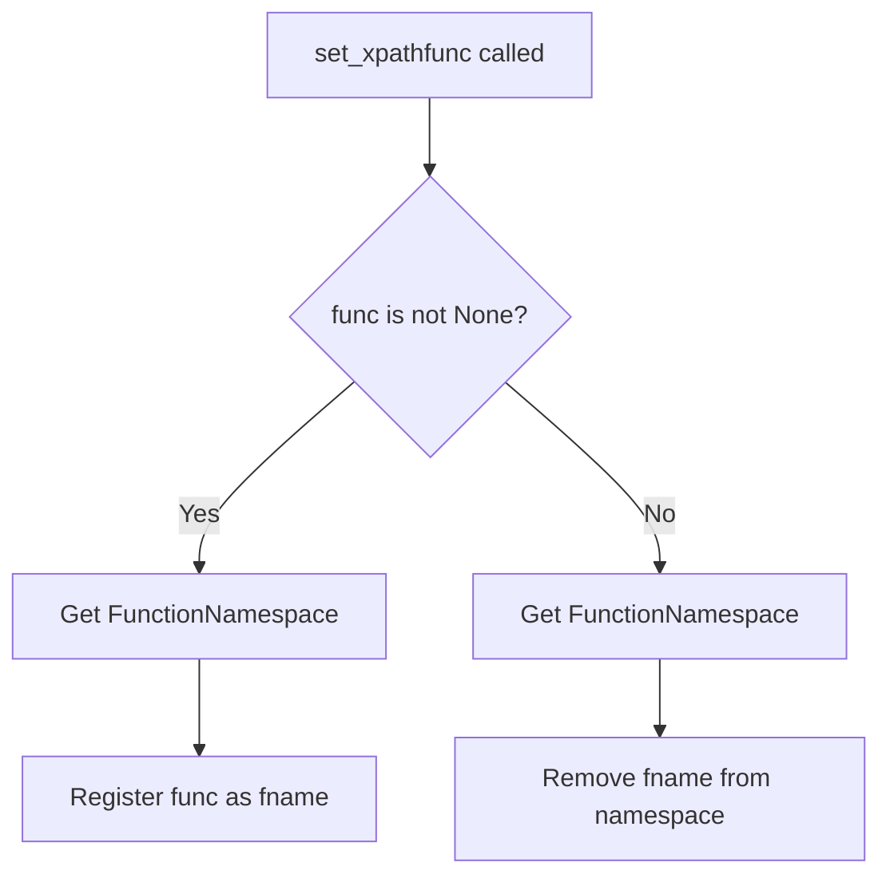
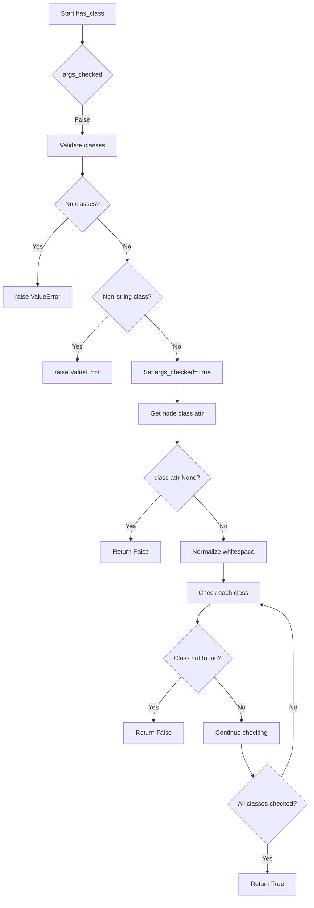

# `xpathfuncs.py`

## `parsel.xpathfuncs.set_xpathfunc` · *function*

## Summary:
Registers or unregisters a custom XPath function within lxml's global function namespace.

## Description:
This function provides a mechanism to add or remove custom XPath functions that can be used in XPath expressions processed by lxml. When a function is provided, it registers the function under the specified name in the global XPath function namespace; when None is provided, it removes the function from the namespace.

## Args:
    fname (str): The name under which the XPath function will be registered or unregistered.
    func (Optional[Callable]): The callable function to register, or None to unregister a function.

## Returns:
    None: This function does not return any value.

## Raises:
    None explicitly raised: The function doesn't declare or raise any exceptions directly.

## Constraints:
    Preconditions:
    - fname must be a valid string identifier for an XPath function name
    - func must be either a callable object or None
    
    Postconditions:
    - If func is not None, the function is registered in lxml's global function namespace under fname
    - If func is None, the function is removed from lxml's global function namespace under fname

## Side Effects:
    - Mutates lxml's global XPath function namespace
    - Modifies the global state of lxml's XPath function registry

## Control Flow:


## Examples:
```python
# Register a custom XPath function
def my_function(context, arg1, arg2):
    return arg1 + arg2

set_xpathfunc('myfunc', my_function)

# Unregister a custom XPath function
set_xpathfunc('myfunc', None)
```

## `parsel.xpathfuncs.setup` · *function*

## Summary:
Initializes the parsel library's XPath function registry by registering the "has-class" XPath function.

## Description:
This function serves as a setup initializer that registers the custom "has-class" XPath function with lxml's global XPath function namespace. The "has-class" function enables XPath expressions to check if HTML elements possess specific CSS classes, which is a common requirement in web scraping and HTML parsing tasks.

The function is designed to be called once during library initialization to make the custom XPath function available for use in subsequent XPath evaluations. This extraction into a dedicated setup function follows the principle of separating initialization concerns from runtime logic, ensuring that XPath functions are properly registered before they are needed.

## Args:
    None: This function takes no parameters.

## Returns:
    None: This function does not return any value.

## Raises:
    None explicitly raised: The function itself does not raise any exceptions, though underlying registration mechanisms may raise exceptions if the function name or implementation is invalid.

## Constraints:
    Preconditions:
    - The parsel.xpathfuncs module must be imported and available
    - The lxml library must be properly installed and functional
    - The has_class function must be defined and accessible in the module scope
    
    Postconditions:
    - The "has-class" XPath function is registered in lxml's global function namespace
    - The function can now be used in XPath expressions like `//*[has-class('btn', 'primary')]`

## Side Effects:
    - Mutates lxml's global XPath function namespace by registering a new function
    - Modifies the global state of lxml's XPath function registry

## Control Flow:
```mermaid
flowchart TD
    A[setup() called] --> B[Call set_xpathfunc("has-class", has_class)]
    B --> C[Register has_class function under "has-class" name]
    C --> D[Function completes successfully]
```

## Examples:
```python
# Typical usage during library initialization
from parsel import xpathfuncs
xpathfuncs.setup()

# After setup, the function can be used in XPath expressions
# For example: //*[@has-class('btn', 'primary')]
```

## `parsel.xpathfuncs.has_class` · *function*

## Summary:
Checks if an HTML node has all specified CSS classes assigned to it.

## Description:
This function determines whether an HTML element contains all the specified CSS classes in its class attribute. It's designed to be used as an XPath function within the parsel library for web scraping and HTML parsing tasks.

The function performs argument validation to ensure proper usage, normalizes HTML5 whitespace characters in the class attribute to regular spaces using w3lib's utility, and implements strict word-boundary matching for class presence. This ensures reliable class detection even when HTML contains inconsistent whitespace formatting.

## Args:
    context (Any): XPath evaluation context containing the node being evaluated and evaluation metadata
    *classes (str): Variable number of CSS class names to check for existence on the node

## Returns:
    bool: True if the node has ALL specified classes, False otherwise

## Raises:
    ValueError: When no classes are provided as arguments, or when any argument is not a string

## Constraints:
    Preconditions:
        - The context parameter must be a valid XPath evaluation context object
        - The context must have a context_node with a "class" attribute
        - At least one class name must be provided
        - All class names must be strings
    
    Postconditions:
        - Returns a boolean value indicating class membership
        - Does not modify the input context or node data

## Side Effects:
    None

## Control Flow:


## Examples:
    # Check if node has both "btn" and "primary" classes
    result = has_class(context, "btn", "primary")
    
    # Check if node has single "active" class
    result = has_class(context, "active")
    
    # This would raise ValueError: has-class must have at least 1 argument
    # result = has_class(context)
    
    # This would raise ValueError: has-class arguments must be strings
    # result = has_class(context, 123)

