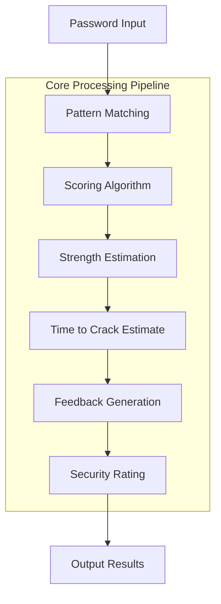

# `zxcvbn-python`

# zxcvbn-python Repository Documentation

## Tree:
```
zxcvbn-python/
└── zxcvbn/
    ├── __init__.py
    ├── matcher.py
    ├── scoring.py
    ├── time_estimates.py
    ├── dictionary.py
    └── utils.py
```

### Directory Responsibilities:
- **zxcvbn/**: Main package directory containing all core implementation files for the zxcvbn password strength estimator

## Purpose:
The zxcvbn-python repository implements the zxcvbn password strength estimation algorithm originally developed by Dropbox. It analyzes passwords for strength by identifying common patterns, dictionary words, sequences, and other predictable elements. This helps applications enforce strong password policies while providing meaningful feedback to users about password security.

This library is particularly valuable for:
- Password policy enforcement in web applications
- Security auditing tools
- User education about password safety
- Real-time password strength feedback systems

## Architecture:


Key architectural patterns:
- **Pipeline Architecture**: Password analysis flows through multiple stages
- **Modular Design**: Separation of pattern matching, scoring, and feedback generation
- **Plugin-like Pattern Matching**: Extensible matching strategies for different password patterns

## Entry Points:
1. **Importable API**: `from zxcvbn import zxcvbn`
   - Exposes main `zxcvbn()` function for password analysis
   - Target audience: Developers integrating password strength checking into applications

2. **CLI Interface**: `python -m zxcvbn [password]`
   - Command-line interface for quick password analysis
   - Target audience: System administrators, security professionals, developers testing passwords

## Core Features:
- **Password Strength Analysis**: Comprehensive assessment of password entropy and predictability
- **Pattern Detection**: Identifies common patterns like sequences, repeated characters, keyboard patterns
- **Dictionary Word Detection**: Recognizes common words, names, and dictionary terms
- **Time to Crack Estimation**: Provides realistic time estimates for password brute-force attacks
- **User Feedback**: Generates actionable suggestions for improving password strength
- **Security Rating**: Returns a numerical strength rating (0-4) with detailed breakdown

## Dependencies:
- **Python 3.6+**: Required runtime environment
- **Standard Library Only**: No external dependencies beyond Python's built-in modules
- **No Third-party Libraries**: Pure Python implementation for maximum portability

## Configuration:
None required. The library uses hardcoded dictionaries and parameters optimized for general use cases.

## Extension Points:
- **Custom Matchers**: Extend pattern detection by implementing new matcher classes
- **Custom Scoring**: Override scoring functions for domain-specific requirements
- **Additional Dictionaries**: Add custom word lists for industry-specific terminology

