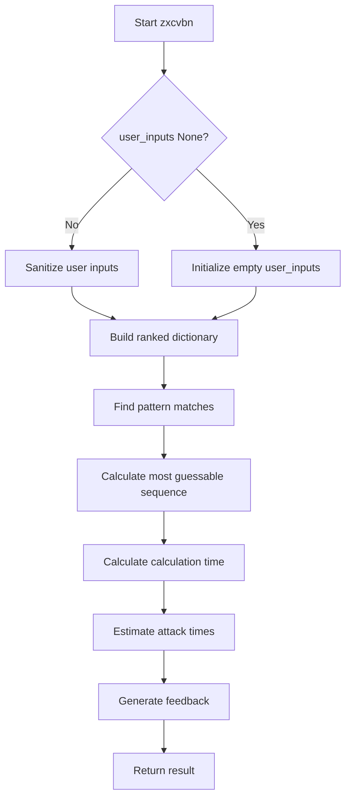

# `__init__.py`

## `zxcvbn.__init__.zxcvbn` · *function*

## Summary:
Estimates password strength and provides detailed security feedback by analyzing patterns, guessability, and estimated attack times.

## Description:
The main entry point for password strength analysis that evaluates a password's security by identifying common patterns, calculating guess probabilities, estimating attack times, and providing actionable feedback to users. Handles Python 2/3 string type compatibility.

## Args:
    password (str): The password to analyze for strength
    user_inputs (list[str], optional): Additional personal information to consider during analysis. Defaults to None.

## Returns:
    dict: Comprehensive password analysis containing all properties from scoring results plus:
        - calc_time (timedelta): Time taken to perform the analysis
        - attack_times (dict): Dictionary with various attack time estimates (offline_fast_hashing_1e10_per_second, offline_slow_hashing_1e4_per_second, online_no_throttling_10_per_second, online_throttling_100_per_hour)
        - feedback (dict): Human-readable feedback about password strength

## Raises:
    None explicitly raised by this function

## Constraints:
    Preconditions:
        - Password must be a string
        - User inputs, if provided, should be iterable
    Postconditions:
        - Returns a dictionary with standardized keys regardless of password strength
        - All time calculations are performed using datetime objects
        - User inputs are sanitized to lowercase strings

## Side Effects:
    None

## Control Flow:

## Examples:
    >>> result = zxcvbn("password123")
    >>> print(result['score'])  # 1 (weak)
    >>> print(result['feedback']['warning'])  # "This is a commonly used password"
    
    >>> result = zxcvbn("MyP@ssw0rd!", ["john", "doe"])
    >>> print(result['score'])  # 3 (strong)
    >>> print(result['calc_time'])  # timedelta object showing processing time

