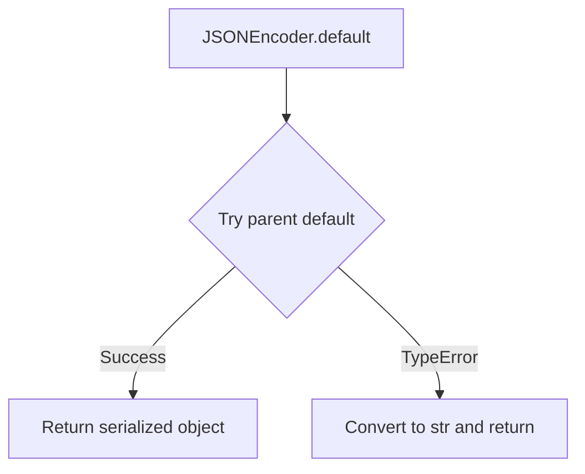
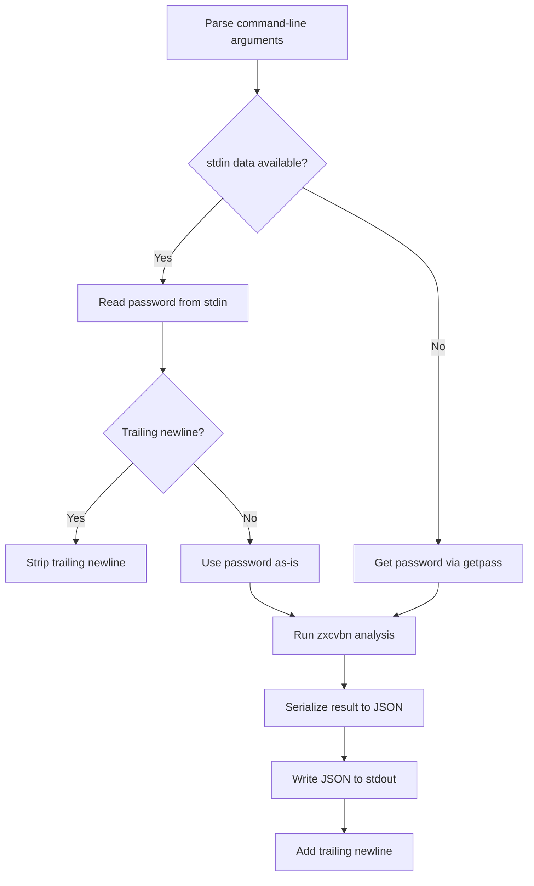

# `__main__.py`

## `zxcvbn.__main__.JSONEncoder` · *class*

## Summary:
A custom JSON encoder that extends the standard library's JSONEncoder to handle non-serializable objects by converting them to strings.

## Description:
This class provides a fallback mechanism for JSON serialization when objects cannot be handled by the standard JSON encoder. It is designed to prevent serialization errors when attempting to encode objects that are not natively supported by JSON (such as custom objects, datetime objects, or other non-primitive types). The encoder attempts to use the parent's default serialization logic, and if that fails with a TypeError, it falls back to converting the object to its string representation.

## State:
- Inherits all state from json.JSONEncoder
- No additional instance attributes beyond those inherited from the parent class
- The `default` method is the primary behavioral component

## Lifecycle:
- Creation: Instantiated automatically when used with json.dump() or json.dumps() functions
- Usage: Called internally by the JSON serialization process when encountering non-serializable objects
- Destruction: Managed automatically by Python's garbage collection

## Method Map:


## Raises:
- TypeError: Raised by the parent JSONEncoder.default() when an object cannot be serialized, which is caught and handled by returning str(o)

## Example:
```python
import json
from zxcvbn.__main__ import JSONEncoder

# Custom object that can't be serialized by default JSON encoder
class CustomObject:
    def __init__(self, value):
        self.value = value

obj = CustomObject("test")
# Without custom encoder, this would raise TypeError
result = json.dumps(obj, cls=JSONEncoder)
# Result would be something like '{"value": "test"}' or similar string representation
```

### `zxcvbn.__main__.JSONEncoder.default` · *method*

## Summary:
Handles serialization of non-standard Python objects by falling back to string representation when the standard JSON encoder fails.

## Description:
Overrides the default serialization behavior of json.JSONEncoder to gracefully handle objects that cannot be serialized to JSON format. When the parent class's default method raises a TypeError, this implementation converts the object to its string representation instead of failing.

## Args:
    self: The JSONEncoder instance
    o: The object to serialize to JSON

## Returns:
    The serialized representation of the object, either from the parent encoder or as a string conversion

## Raises:
    TypeError: Only raised when the object cannot be serialized by either the parent encoder or string conversion

## State Changes:
    Attributes READ: None
    Attributes WRITTEN: None

## Constraints:
    Preconditions: The object must be serializable by the parent JSONEncoder or convertible to string
    Postconditions: The returned value is either a JSON-serializable type or a string representation of the object

## Side Effects:
    None

## `zxcvbn.__main__.cli` · *function*

## Summary:
Command-line interface for analyzing password strength using the zxcvbn algorithm.

## Description:
Provides a terminal-based interface to evaluate password security by analyzing patterns, guessability, and estimated attack times. Accepts passwords via stdin or interactive prompt and outputs detailed security analysis in JSON format.

## Args:
    None: This function does not accept parameters directly, but reads from command-line arguments via a global parser.

## Returns:
    None: This function does not return a value but outputs JSON results to stdout.

## Raises:
    None explicitly raised by this function, though underlying operations may raise exceptions during JSON serialization or password input handling.

## Constraints:
    Preconditions:
        - Command-line arguments must be properly formatted for the global parser
        - Password input must be a string
        - Parser must be initialized before calling this function
    Postconditions:
        - JSON output is written to stdout with proper formatting
        - Function exits after writing results

## Side Effects:
    - Reads password input from stdin or getpass (secure terminal input)
    - Writes JSON-formatted analysis results to stdout
    - May prompt user for password input via terminal if stdin is empty

## Control Flow:


## Examples:
    # Using stdin input
    echo "mypassword123" | python -m zxcvbn
    
    # Interactive input
    python -m zxcvbn
    # Then enter password when prompted
    
    # With user inputs
    python -m zxcvbn --user-input john doe

