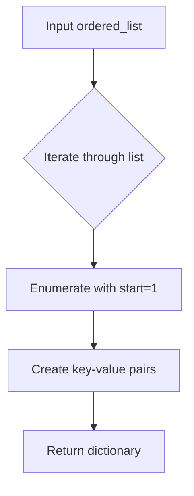
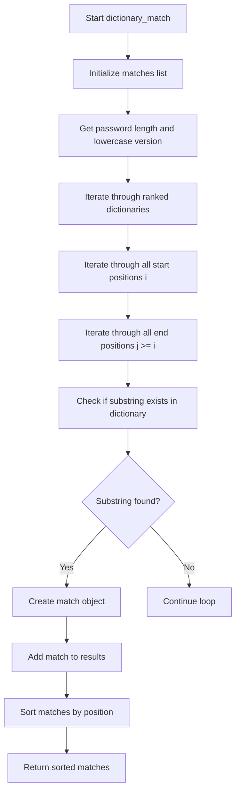
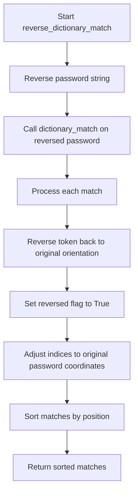
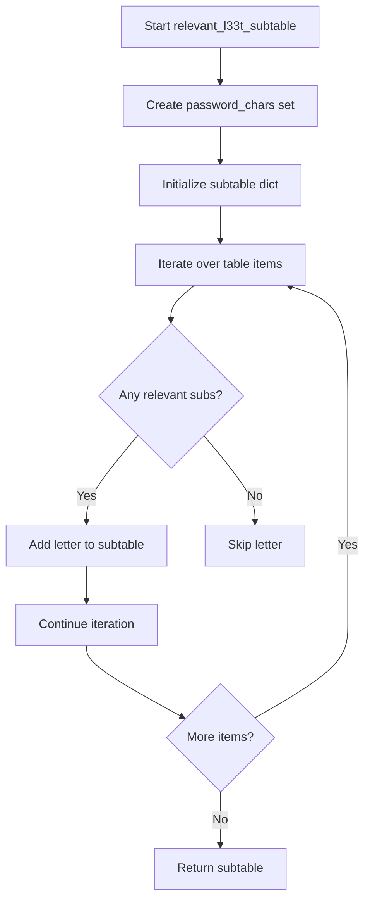
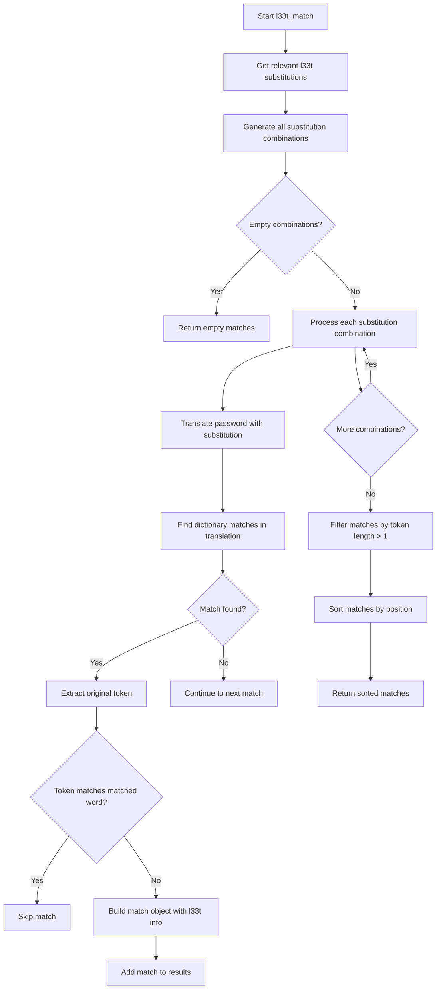
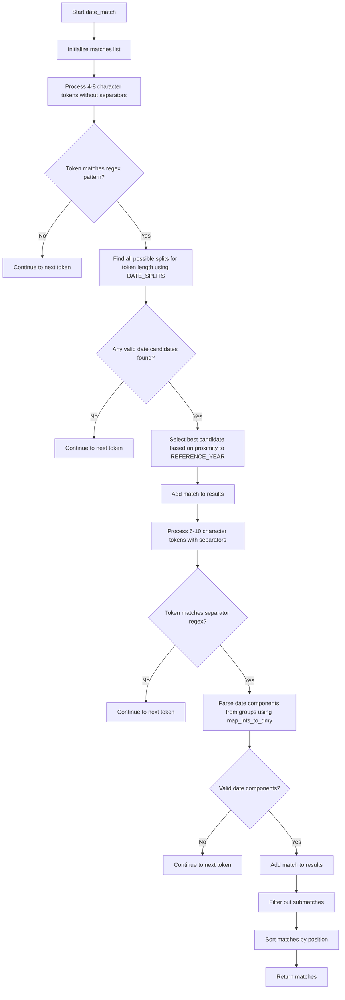

# `matching.py`

## `zxcvbn.matching.build_ranked_dict` · *function*

## Summary:
Creates a dictionary mapping words to their ranked positions in an ordered list.

## Description:
Transforms an ordered list of words into a dictionary where each word is mapped to its position (1-indexed) in the original list. This ranked dictionary is used for frequency-based analysis in password strength estimation.

## Args:
    ordered_list (list[str]): A list of words sorted in descending order of frequency or importance.

## Returns:
    dict[str, int]: A dictionary where keys are words from the input list and values are their 1-indexed positions.

## Raises:
    None: This function does not raise any exceptions.

## Constraints:
    Preconditions:
        - The input must be a valid iterable containing hashable elements (strings).
        - The elements in the list should be unique for meaningful ranking.
    
    Postconditions:
        - The returned dictionary will have exactly as many entries as the input list.
        - All keys in the dictionary will be strings from the input list.
        - All values will be positive integers starting from 1.

## Side Effects:
    None: This function has no side effects.

## Control Flow:


## Examples:
```python
# Basic usage
words = ["password", "123456", "admin"]
ranked_dict = build_ranked_dict(words)
# Result: {"password": 1, "123456": 2, "admin": 3}

# Empty list
empty_dict = build_ranked_dict([])
# Result: {}

# Single item
single = build_ranked_dict(["hello"])
# Result: {"hello": 1}
```

## `zxcvbn.matching.add_frequency_lists` · *function*

## Summary:
Populates the global ranked dictionaries with frequency-ranked word lists for password strength analysis.

## Description:
Initializes or updates the global `RANKED_DICTIONARIES` collection by converting provided frequency lists into rank-based dictionaries. This function serves as a configuration utility that prepares frequency data structures used by the password strength estimation algorithms.

The function is designed to be called during system initialization or when extending the default frequency dictionaries with custom word lists. It processes each provided list by transforming it into a dictionary mapping words to their 1-indexed ranks, which enables efficient lookup during password strength calculations.

## Args:
    frequency_lists_ (dict[str, list[str]]): A dictionary where keys are string identifiers and values are lists of words sorted in descending order of frequency or importance.

## Returns:
    None: This function does not return any value.

## Raises:
    None: This function does not explicitly raise exceptions.

## Constraints:
    Preconditions:
        - The input dictionary must be a valid dictionary-like object
        - Each value in the dictionary must be an iterable of hashable elements (typically strings)
        - Words in each list should ideally be unique for meaningful ranking
        
    Postconditions:
        - The global `RANKED_DICTIONARIES` will contain entries for each key in the input dictionary
        - Each entry in `RANKED_DICTIONARIES` will be a dictionary mapping words to their 1-indexed positions in the original list

## Side Effects:
    - Mutates the global `RANKED_DICTIONARIES` dictionary by adding or updating entries
    - No external I/O operations or service calls

## Control Flow:
```mermaid
flowchart TD
    A[Input frequency_lists_] --> B{Iterate through items}
    B --> C{Key, Value pair}
    C --> D[Call build_ranked_dict(lst)]
    D --> E[Assign to RANKED_DICTIONARIES[name]]
    E --> F[Continue iteration]
    F --> G[End]
```

## Examples:
```python
# Adding custom frequency lists
custom_lists = {
    "common_passwords": ["password", "123456", "admin"],
    "common_words": ["the", "be", "to"]
}
add_frequency_lists(custom_lists)

# This would populate RANKED_DICTIONARIES with:
# {"common_passwords": {"password": 1, "123456": 2, "admin": 3},
#  "common_words": {"the": 1, "be": 2, "to": 3}}
```

## `zxcvbn.matching.omnimatch` · *function*

## Summary:
Applies all available pattern matching strategies to identify structural elements within a password, returning a comprehensive list of matches sorted by position.

## Description:
Serves as the central coordination point for all pattern matching operations in the zxcvbn password strength estimator. This function sequentially applies eight distinct matching strategies to extract various types of structural patterns from a password, including dictionary words, reversed words, l33t substitutions, spatial keyboard patterns, repeated sequences, character sequences, regular expressions, and date patterns.

The function aggregates results from all matching strategies and returns them sorted by their position within the password, ensuring consistent ordering for subsequent analysis. This orchestration approach allows each matching strategy to remain focused on its specific pattern type while maintaining a unified interface for the broader password analysis system.

## Args:
    password (str): The password string to analyze for structural patterns
    _ranked_dictionaries (any, optional): Dictionary of ranked word lists used by various matching strategies. Defaults to RANKED_DICTIONARIES global constant. This parameter is passed through to all individual matcher functions to maintain consistency in dictionary usage across all pattern matching approaches.

## Returns:
    list[dict]: A sorted list of match dictionaries, each representing a detected pattern with standardized fields including:
        - pattern (str): Type of pattern matched ('dictionary', 'date', 'regex', 'repeat', 'sequence', 'spatial')
        - i (int): Starting index of the match in the password (inclusive)
        - j (int): Ending index of the match in the password (inclusive)
        - token (str): The actual substring from the password that matched the pattern
        - Additional pattern-specific fields depending on the match type

## Raises:
    None explicitly raised - relies on individual matcher functions for any exceptions

## Constraints:
    Preconditions:
        - Password must be a string
        - Ranked dictionaries must be compatible with the expected structure for individual matchers
        
    Postconditions:
        - Returns a list of match dictionaries with consistent field structure
        - All matches are sorted by starting position (i) and then by ending position (j)
        - No matches overlap in their positional ranges (though they may touch)

## Side Effects:
    None - Pure function with no external state mutations or I/O operations

## Control Flow:
```mermaid
flowchart TD
    A[Start omnimatch] --> B[Initialize empty matches list]
    B --> C[Iterate through 8 matcher functions]
    C --> D[Call matcher(password, _ranked_dictionaries=_ranked_dictionaries)]
    D --> E{Matcher returns matches?}
    E -->|Yes| F[Extend matches list with returned matches]
    E -->|No| G[Continue to next matcher]
    F --> H[All matchers processed?]
    H -->|No| C
    H -->|Yes| I[Sort matches by (i, j)]
    I --> J[Return sorted matches]
```

## Examples:
    >>> omnimatch("password123")
    [{'pattern': 'dictionary', 'i': 0, 'j': 7, 'token': 'password', ...},
     {'pattern': 'repeat', 'i': 8, 'j': 10, 'token': '123', ...}]

    >>> omnimatch("qwerty123")
    [{'pattern': 'spatial', 'i': 0, 'j': 5, 'token': 'qwerty', ...},
     {'pattern': 'sequence', 'i': 6, 'j': 8, 'token': '123', ...}]

## `zxcvbn.matching.dictionary_match` · *function*

## Summary:
Identifies dictionary words within a password and returns structured match information for each occurrence.

## Description:
Performs dictionary-based pattern matching on a password by scanning all possible substrings to find matches in predefined ranked dictionaries. This function is part of the zxcvbn password strength estimation algorithm, specifically designed to detect common dictionary words that may weaken password security.

The function extracts all contiguous substrings from the password and checks if they exist in any of the provided ranked dictionaries. Each match is recorded with detailed metadata including position, matched word, dictionary source, and ranking information.

## Args:
    password (str): The password string to analyze for dictionary matches
    _ranked_dictionaries (dict): Optional mapping of dictionary names to ranked word dictionaries. Defaults to RANKED_DICTIONARIES global constant containing multiple predefined word lists. Each dictionary should map words to their frequency rankings.

## Returns:
    list[dict]: A sorted list of match dictionaries, each containing:
        - pattern (str): Always 'dictionary' indicating this is a dictionary match
        - i (int): Starting index (inclusive) of the matched substring in the password
        - j (int): Ending index (inclusive) of the matched substring in the password  
        - token (str): The original case substring from the password
        - matched_word (str): Lowercase version of the matched word
        - rank (int): Position of the word in its dictionary (lower is more common)
        - dictionary_name (str): Name of the dictionary where the word was found
        - reversed (bool): Always False for dictionary matches
        - l33t (bool): Always False for dictionary matches

## Raises:
    None explicitly raised by this function

## Constraints:
    Preconditions:
    - Password must be a string
    - Ranked dictionaries must be a mapping where keys are dictionary names and values are mappings of words to ranks
    
    Postconditions:
    - Returns a list of match dictionaries sorted by starting position (i) and then by ending position (j)
    - All returned matches represent actual substrings found in the dictionaries
    - Match objects contain consistent field structure with all required keys present

## Side Effects:
    None

## Control Flow:


## Examples:
    >>> dictionary_match("password123")
    [{'pattern': 'dictionary', 'i': 0, 'j': 7, 'token': 'password', 'matched_word': 'password', 'rank': 1, 'dictionary_name': 'common', 'reversed': False, 'l33t': False}]
    
    >>> dictionary_match("hello world")
    [{'pattern': 'dictionary', 'i': 0, 'j': 4, 'token': 'hello', 'matched_word': 'hello', 'rank': 5, 'dictionary_name': 'common', 'reversed': False, 'l33t': False}, 
     {'pattern': 'dictionary', 'i': 6, 'j': 10, 'token': 'world', 'matched_word': 'world', 'rank': 15, 'dictionary_name': 'common', 'reversed': False, 'l33t': False}]

## `zxcvbn.matching.reverse_dictionary_match` · *function*

## Summary:
Finds dictionary word matches in a password by analyzing the reversed password, useful for detecting reversed dictionary words in password patterns.

## Description:
Analyzes a password for dictionary words by reversing the entire password string and performing dictionary matching on the reversed version. This approach helps identify cases where dictionary words appear in reverse order within passwords, such as "password" being encoded as "drowssap". The function processes the resulting matches to restore proper orientation and positioning within the original password.

This function is part of the zxcvbn password strength estimation algorithm, specifically designed to enhance detection of dictionary-based patterns that might be obscured by reversal or other transformations.

## Args:
    password (str): The password string to analyze for reversed dictionary matches
    _ranked_dictionaries (dict, optional): Mapping of dictionary names to ranked word dictionaries. Defaults to RANKED_DICTIONARIES global constant containing multiple predefined word lists. Each dictionary should map words to their frequency rankings.

## Returns:
    list[dict]: A sorted list of match dictionaries representing reversed dictionary matches, each containing:
        - pattern (str): Always 'dictionary' indicating this is a dictionary match
        - i (int): Starting index (inclusive) of the matched substring in the password
        - j (int): Ending index (inclusive) of the matched substring in the password  
        - token (str): The original case substring from the password that matches a dictionary word
        - matched_word (str): Lowercase version of the matched word
        - rank (int): Position of the word in its dictionary (lower is more common)
        - dictionary_name (str): Name of the dictionary where the word was found
        - reversed (bool): Always True for reverse dictionary matches
        - l33t (bool): Always False for dictionary matches

## Raises:
    None explicitly raised by this function

## Constraints:
    Preconditions:
    - Password must be a string
    - Ranked dictionaries must be a mapping where keys are dictionary names and values are mappings of words to ranks
    
    Postconditions:
    - Returns a list of match dictionaries sorted by starting position (i) and then by ending position (j)
    - All returned matches represent actual substrings found in the dictionaries
    - Match objects contain consistent field structure with all required keys present

## Side Effects:
    None

## Control Flow:


## Examples:
    >>> reverse_dictionary_match("mypassword123")
    [{'pattern': 'dictionary', 'i': 0, 'j': 7, 'token': 'mypassword', 'matched_word': 'mypassword', 'rank': 1, 'dictionary_name': 'common', 'reversed': True, 'l33t': False}]
    
    >>> reverse_dictionary_match("123drowssap")
    [{'pattern': 'dictionary', 'i': 3, 'j': 10, 'token': 'drowssap', 'matched_word': 'password', 'rank': 1, 'dictionary_name': 'common', 'reversed': True, 'l33t': False}]

## `zxcvbn.matching.relevant_l33t_subtable` · *function*

## Summary:
Filters a l33t substitution table to include only letters whose substitutions appear in the given password.

## Description:
This function processes a l33t (leet) substitution table by filtering out letters that don't have any of their possible substitutions present in the password. It's used during password strength estimation to optimize the matching process by only considering relevant character substitutions.

The function is typically called as part of the l33t matching algorithm in the zxcvbn password strength estimator, where it helps reduce computational overhead by eliminating irrelevant substitution patterns.

## Args:
    password (str): The password string to analyze for relevant substitutions
    table (dict): A dictionary mapping letters to lists of possible l33t substitutions (e.g., {'a': ['@', '4'], 'e': ['3', '€']})

## Returns:
    dict: A filtered dictionary containing only letters from the original table that have at least one substitution present in the password. Each key maps to a list of relevant substitutions.

## Raises:
    None explicitly raised

## Constraints:
    Preconditions:
    - password must be a string
    - table must be a dictionary where values are iterable collections
    
    Postconditions:
    - The returned dictionary will only contain keys that were present in the input table
    - All values in the returned dictionary will be subsets of the corresponding values in the input table
    - The returned dictionary will be empty if none of the substitutions in the table appear in the password

## Side Effects:
    None

## Control Flow:


## Examples:
    >>> table = {'a': ['@', '4'], 'e': ['3', '€'], 'i': ['1']}
    >>> relevant_l33t_subtable("p@ssw0rd", table)
    {'a': ['@'], 'e': ['3']}
    
    >>> relevant_l33t_subtable("hello", table)
    {'e': ['3']}
    
    >>> relevant_l33t_subtable("world", table)
    {}
```

## `zxcvbn.matching.enumerate_l33t_subs` · *function*

## Summary:
Generates all valid combinations of l33t character substitutions from a given substitution table.

## Description:
This function computes all possible combinations of l33t (leet) character substitutions for password analysis. It takes a substitution table mapping characters to their potential l33t equivalents and returns a list of dictionaries representing valid substitution mappings. The function ensures no duplicate combinations are returned by deduplicating based on substitution patterns.

## Args:
    table (dict): A dictionary mapping characters to lists of their l33t substitutions. Keys are characters that can be substituted, values are lists of possible l33t representations.

## Returns:
    list[dict]: A list of dictionaries, where each dictionary maps l33t characters to their original characters. Each dictionary represents a unique combination of substitutions.

## Raises:
    None explicitly raised

## Constraints:
    Preconditions:
    - Input table must be a dictionary
    - All values in the table must be iterable (lists/sequences)
    
    Postconditions:
    - Returns a list of dictionaries
    - Each dictionary contains valid l33t-to-character mappings
    - No duplicate substitution combinations are present

## Side Effects:
    None

## Control Flow:
```mermaid
flowchart TD
    A[Start enumerate_l33t_subs] --> B{table.keys()}
    B --> C[Initialize subs = [[]]]
    C --> D[Call helper(keys, subs)]
    D --> E{keys empty?}
    E -->|Yes| F[Return subs]
    E -->|No| G[Process first_key]
    G --> H[Iterate l33t_chr in table[first_key]]
    H --> I[Iterate sub in subs]
    I --> J{dup_l33t_index == -1?}
    J -->|Yes| K[Create sub_extension]
    K --> L[Append to next_subs]
    J -->|No| M[Create sub_alternative]
    M --> N[Pop dup index]
    N --> O[Append [l33t_chr, first_key]]
    O --> P[Add both sub and sub_alternative to next_subs]
    P --> Q[Apply dedup to next_subs]
    Q --> R[Recursively call helper with rest_keys]
    R --> S[Convert assoc lists to dicts]
    S --> T[Return sub_dicts]
```

## Examples:
    Example usage with a simple substitution table:
    ```python
    table = {'a': ['@', '4'], 'b': ['8']}
    result = enumerate_l33t_subs(table)
    # Returns [{'@': 'a', '8': 'b'}, {'4': 'a', '8': 'b'}]
    ```

## `zxcvbn.matching.translate` · *function*

## Summary:
Translates characters in a string according to a provided character mapping dictionary.

## Description:
Maps each character in the input string to a replacement character using the provided mapping dictionary. If a character is not found in the mapping, it remains unchanged in the output string. This utility function is commonly used for preprocessing text data by replacing characters with their equivalents.

## Args:
    string (str): The input string to be translated
    chr_map (dict): A dictionary mapping original characters to their replacement characters

## Returns:
    str: A new string with characters translated according to the mapping dictionary

## Raises:
    None

## Constraints:
    Preconditions:
    - The input string must be a valid string object
    - The chr_map parameter must be a dictionary-like object
    
    Postconditions:
    - The returned string has the same length as the input string
    - Characters not present in chr_map remain unchanged in the result

## Side Effects:
    None

## Control Flow:
```mermaid
flowchart TD
    A[Start translate] --> B{char in chr_map?}
    B -- Yes --> C[Append chr_map[char]]
    B -- No --> D[Append char]
    C --> E[Next character]
    D --> E
    E --> F{End of string?}
    F -- No --> B
    F -- Yes --> G[Return joined string]
```

## Examples:
    >>> translate("hello", {'e': '3', 'o': '0'})
    'h3ll0'
    
    >>> translate("abc", {'x': 'y'})
    'abc'
    
    >>> translate("", {'a': 'b'})
    ''

## `zxcvbn.matching.l33t_match` · *function*

## Summary:
Identifies dictionary word matches in passwords that contain l33t (leet) character substitutions by testing all possible substitution combinations.

## Description:
Processes a password to detect dictionary words that may be hidden by l33t substitutions such as '4' for 'a', '@' for 'a', etc. This function systematically tests all valid combinations of character substitutions to find matches in predefined word dictionaries, returning detailed match information including the original token and substitution mappings.

The function is part of the zxcvbn password strength estimation algorithm and specifically handles the detection of dictionary words that are obscured by common leet speak patterns. It works by filtering relevant substitutions, generating all possible substitution combinations, translating the password with each combination, and then finding dictionary matches in the translated versions.

## Args:
    password (str): The password string to analyze for l33t dictionary matches
    _ranked_dictionaries (dict, optional): Mapping of dictionary names to ranked word dictionaries. Defaults to RANKED_DICTIONARIES global constant containing multiple predefined word lists. Each dictionary should map words to their frequency rankings.
    _l33t_table (dict, optional): Dictionary mapping characters to their possible l33t substitutions. Defaults to L33T_TABLE global constant containing standard leet character mappings.

## Returns:
    list[dict]: A sorted list of match dictionaries, each containing:
        - pattern (str): Always 'dictionary' indicating this is a dictionary match
        - i (int): Starting index (inclusive) of the matched substring in the password
        - j (int): Ending index (inclusive) of the matched substring in the password  
        - token (str): The original case substring from the password that matched a dictionary word
        - matched_word (str): Lowercase version of the matched word from the dictionary
        - rank (int): Position of the word in its dictionary (lower is more common)
        - dictionary_name (str): Name of the dictionary where the word was found
        - reversed (bool): Always False for dictionary matches
        - l33t (bool): Always True for l33t matches
        - sub (dict): Dictionary mapping l33t characters to their original characters
        - sub_display (str): String representation of the substitutions for display purposes

## Raises:
    None explicitly raised

## Constraints:
    Preconditions:
    - Password must be a string
    - Ranked dictionaries must be a mapping where keys are dictionary names and values are mappings of words to ranks
    - L33T table must be a dictionary mapping characters to lists of possible substitutions
    
    Postconditions:
    - Returns a list of match dictionaries sorted by starting position (i) and then by ending position (j)
    - All returned matches represent actual substrings found in the dictionaries
    - Match objects contain consistent field structure with all required keys present
    - Only matches with tokens of length greater than 1 are returned

## Side Effects:
    None

## Control Flow:


## Examples:
    >>> l33t_match("p@ssw0rd")
    [{'pattern': 'dictionary', 'i': 0, 'j': 7, 'token': 'p@ssw0rd', 'matched_word': 'password', 'rank': 1, 'dictionary_name': 'common', 'reversed': False, 'l33t': True, 'sub': {'@': 'a', '0': 'o'}, 'sub_display': '@ -> a, 0 -> o'}]
    
    >>> l33t_match("h3ll0w0rld")
    [{'pattern': 'dictionary', 'i': 0, 'j': 4, 'token': 'h3ll0', 'matched_word': 'hello', 'rank': 5, 'dictionary_name': 'common', 'reversed': False, 'l33t': True, 'sub': {'3': 'e', '0': 'o'}, 'sub_display': '3 -> e, 0 -> o'}, 
     {'pattern': 'dictionary', 'i': 5, 'j': 9, 'token': 'w0rld', 'matched_word': 'world', 'rank': 15, 'dictionary_name': 'common', 'reversed': False, 'l33t': True, 'sub': {'0': 'o'}, 'sub_display': '0 -> o'}]

## `zxcvbn.matching.repeat_match` · *function*

## Summary:
Identifies and analyzes repeated character or substring patterns within a password.

## Description:
Finds sequences in a password where a substring is repeated consecutively, such as "abcabc" or "123123". This function is part of the zxcvbn password strength estimation library's pattern matching system, specifically designed to detect repetition-based patterns that may indicate weak password construction.

The function uses multiple regular expressions to identify both greedy and lazy matches for repeated patterns, then analyzes the base token using the standard zxcvbn analysis approach to estimate guessability.

## Args:
    password (str): The password string to analyze for repeated patterns
    _ranked_dictionaries (dict, optional): Dictionary of ranked word lists for pattern matching. Defaults to RANKED_DICTIONARIES from frequency_lists module.

## Returns:
    list[dict]: A list of match dictionaries, each containing:
        - pattern (str): Always 'repeat' for this matcher
        - i (int): Starting index of the repeated pattern in the password
        - j (int): Ending index of the repeated pattern in the password
        - token (str): The full repeated substring found
        - base_token (str): The base substring being repeated
        - base_guesses (float): Guess count for the base token
        - base_matches (list): Match sequence for the base token
        - repeat_count (float): Number of times the base token is repeated

## Raises:
    None explicitly raised - relies on underlying functions that may raise exceptions

## Constraints:
    Preconditions:
        - Password must be a string
        - Password length must be >= 0
    
    Postconditions:
        - Returns a list of match dictionaries (empty list if no repeats found)
        - All returned match dictionaries contain the same set of keys

## Side Effects:
    None - Pure function with no external state mutation

## Control Flow:
```mermaid
flowchart TD
    A[Start repeat_match] --> B{Password length > 0?}
    B -- No --> C[Return empty list]
    B -- Yes --> D[Initialize regex patterns]
    D --> E[Initialize last_index = 0]
    E --> F[While last_index < len(password)]
    F --> G[Find greedy match]
    G --> H[Find lazy match]
    H --> I{Greedy match found?}
    I -- No --> J[Break loop]
    I -- Yes --> K{Greedy longer than lazy?}
    K -- Yes --> L[Use greedy match]
    K -- No --> M[Use lazy match]
    L --> N[Extract base token]
    M --> N
    N --> O[Analyze base token]
    O --> P[Create match dict]
    P --> Q[Add to matches list]
    Q --> R[last_index = j + 1]
    R --> F
    J --> S[Return matches]
    S --> T[End]
```

## Examples:
    >>> repeat_match("abcabc")
    [{'pattern': 'repeat', 'i': 0, 'j': 5, 'token': 'abcabc', 'base_token': 'abc', 'base_guesses': 123.0, 'base_matches': [...], 'repeat_count': 2.0}]
    
    >>> repeat_match("hello123hello123")
    [{'pattern': 'repeat', 'i': 0, 'j': 11, 'token': 'hello123hello123', 'base_token': 'hello123', 'base_guesses': 456.0, 'base_matches': [...], 'repeat_count': 2.0}]
    
    >>> repeat_match("no_repeats_here")
    []
```

## `zxcvbn.matching.spatial_match` · *function*

## Summary:
Identifies spatial keyboard pattern matches across multiple keyboard layouts in a password string.

## Description:
Scans a password for sequences that follow spatial patterns on various keyboard layouts (such as QWERTY, Dvorak, etc.). This function serves as the main entry point for spatial pattern matching, delegating the actual detection work to the `spatial_match_helper` function for each keyboard layout. It aggregates matches from all available keyboard layouts and returns them sorted by position in the password.

## Args:
    password (str): The password string to analyze for spatial patterns
    _graphs (dict, optional): Dictionary mapping keyboard layout names to their adjacency graph data structures. Defaults to GRAPHS constant.
    _ranked_dictionaries (dict, optional): Dictionary mapping dictionary names to ranked word lists. Defaults to RANKED_DICTIONARIES constant.

## Returns:
    list[dict]: A sorted list of match dictionaries, each representing a detected spatial pattern with fields:
        - pattern (str): Always 'spatial' indicating this is a spatial pattern match
        - i (int): Starting index of the matched sequence in the password
        - j (int): Ending index of the matched sequence in the password  
        - token (str): The actual character sequence that forms the spatial pattern
        - graph (str): The keyboard layout name used for this match
        - turns (int): Number of directional changes in the pattern
        - shifted_count (int): Count of shifted keys used in the pattern

## Raises:
    None explicitly raised - relies on spatial_match_helper for any internal exceptions

## Constraints:
    Preconditions:
        - Password must be a string
        - Graphs dictionary must contain valid keyboard layout mappings
        - Ranked dictionaries must contain valid word list mappings
    Postconditions:
        - Returns only matches of length 3 or greater (excludes length 1 and 2 chains)
        - All returned matches are properly formatted dictionaries with required fields
        - Results are sorted by starting position (i) and ending position (j) in the password

## Side Effects:
    None - This is a pure function with no external state mutations or I/O operations

## Control Flow:
```mermaid
flowchart TD
    A[Start spatial_match] --> B[Initialize empty matches list]
    B --> C[For each graph in _graphs]
    C --> D[Call spatial_match_helper with password, graph, graph_name]
    D --> E[Extend matches with helper results]
    E --> F[Sort matches by (i, j)]
    F --> G[Return sorted matches]
```

## Examples:
    Basic usage detecting spatial patterns:
    ```python
    # Given password = "asdf"
    # Returns matches for QWERTY spatial patterns like [{'pattern': 'spatial', 'i': 0, 'j': 3, 'token': 'asdf', 'graph': 'qwerty', 'turns': 0, 'shifted_count': 0}]
    ```

    Multiple layout detection:
    ```python
    # Given password = "qaz"
    # Returns matches for both QWERTY and Dvorak patterns if applicable
    ```

## `zxcvbn.matching.spatial_match_helper` · *function*

## Summary:
Identifies and extracts spatial keyboard pattern matches from a password string.

## Description:
This helper function scans a password for sequences of characters that follow spatial patterns on keyboard layouts (such as QWERTY or Dvorak). It detects character chains where each subsequent character is adjacent to the previous one on the keyboard, tracking directional changes and shifted key usage. The function is part of the spatial pattern matching system and is called by `spatial_match()` for each keyboard layout.

## Args:
    password (str): The password string to analyze for spatial patterns
    graph (dict): Keyboard layout adjacency information where keys are characters and values are lists of adjacent characters
    graph_name (str): Name of the keyboard layout being analyzed (e.g., 'qwerty', 'dvorak')

## Returns:
    list[dict]: A list of match dictionaries, each containing:
        - pattern (str): Always 'spatial' indicating this is a spatial pattern match
        - i (int): Starting index of the matched sequence in the password
        - j (int): Ending index of the matched sequence in the password  
        - token (str): The actual character sequence that forms the spatial pattern
        - graph (str): The keyboard layout name used for this match
        - turns (int): Number of directional changes in the pattern
        - shifted_count (int): Count of shifted keys used in the pattern

## Raises:
    None explicitly raised - uses try/except internally to handle missing keys in the graph dictionary

## Constraints:
    Preconditions:
        - Password must be a string
        - Graph must be a dictionary mapping characters to their adjacent characters
        - Graph name must be a valid identifier for a keyboard layout
    Postconditions:
        - Returns only matches of length 3 or greater (excludes length 1 and 2 chains)
        - All returned matches are properly formatted dictionaries with required fields

## Side Effects:
    None - This is a pure function with no external state mutations or I/O operations

## Control Flow:
```mermaid
flowchart TD
    A[Start spatial matching] --> B{Password length > 1?}
    B -- Yes --> C[Initialize i=0]
    C --> D[i < len(password)-1?]
    D -- Yes --> E[j=i+1]
    E --> F{Graph name in ['qwerty','dvorak'] AND char is shifted?}
    F -- Yes --> G[shifted_count = 1]
    F -- No --> H[shifted_count = 0]
    G --> I[Initialize last_direction=None, turns=0]
    H --> I
    I --> J[While True loop]
    J --> K[Get prev_char = password[j-1]]
    K --> L[Try to get adjacents from graph]
    L --> M{adjacents found?}
    M -- No --> N[adjacents = []]
    M -- Yes --> N
    N --> O{j < len(password)?}
    O -- Yes --> P[cur_char = password[j]]
    P --> Q[Iterate through adjacents]
    Q --> R{cur_char in adj?}
    R -- Yes --> S[found = True]
    S --> T[Update found_direction]
    T --> U{adj.index(cur_char) == 1?}
    U -- Yes --> V[shifted_count += 1]
    U -- No --> W[Continue]
    V --> X[Check direction change]
    X --> Y{last_direction != found_direction?}
    Y -- Yes --> Z[turns += 1, last_direction = found_direction]
    Y -- No --> AA[Continue]
    R -- No --> AB[Continue loop]
    AB --> AC{found?}
    AC -- Yes --> AD[j += 1]
    AC -- No --> AE{Length > 2?}
    AE -- Yes --> AF[Add match to results]
    AF --> AG[i = j]
    AE -- No --> AH[i = j]
    AG --> AI[Break inner loop]
    AH --> AI
    AD --> AJ[Continue loop]
    AJ --> AK[Check if j < len(password)]
    AK -- Yes --> AL[Continue inner loop]
    AK -- No --> AM[Add match to results]
    AM --> AN[i = j]
    AN --> AO[Break inner loop]
    AO --> AP[Check outer loop condition]
    AP --> AQ{i < len(password)-1?}
    AQ -- Yes --> AR[Continue outer loop]
    AQ -- No --> AS[Return matches]

    B -- No --> AT[Return empty matches]
    AT --> AU[End]
```

## Examples:
    Example 1: Finding a QWERTY sequence
    ```python
    # Given password = "asdf" on qwerty layout
    # Returns [{'pattern': 'spatial', 'i': 0, 'j': 3, 'token': 'asdf', 'graph': 'qwerty', 'turns': 0, 'shifted_count': 0}]
    ```

    Example 2: Finding a sequence with directional turns
    ```python
    # Given password = "qaz" on qwerty layout  
    # Returns [{'pattern': 'spatial', 'i': 0, 'j': 2, 'token': 'qaz', 'graph': 'qwerty', 'turns': 1, 'shifted_count': 0}]
    ```

## `zxcvbn.matching.sequence_match` · *function*

## Summary:
Identifies sequential character patterns in passwords including alphabetical, numeric, and other character sequences.

## Description:
This function scans a password string to detect sequential character patterns where consecutive characters maintain a consistent difference in their ASCII values. These patterns include alphabetical sequences like "abc" or "ZYX", numeric sequences like "123" or "987", and other character sequences that follow a consistent increment/decrement pattern.

The function is part of the zxcvbn password strength estimation algorithm, specifically designed to identify predictable sequential patterns that weaken password security. It operates on character-level differences and categorizes sequences by character type, returning detailed structural information about each detected sequence.

## Args:
    password (str): The password string to analyze for sequential patterns
    _ranked_dictionaries (dict, optional): Dictionary of ranked word lists for matching. Defaults to RANKED_DICTIONARIES global constant, which contains common sequences and words used for pattern matching.

## Returns:
    list[dict]: A list of dictionaries describing each sequential pattern found. Each dictionary contains:
        - pattern (str): Always 'sequence' indicating this is a sequential pattern match
        - i (int): Starting index of the sequence in the password
        - j (int): Ending index of the sequence in the password  
        - token (str): The actual sequential substring found
        - sequence_name (str): Type of sequence ('lower', 'upper', 'digits', or 'unicode')
        - sequence_space (int): Size of the character set for this sequence type (26 for letters, 10 for digits)
        - ascending (bool): Whether the sequence is ascending (True) or descending (False)

## Raises:
    None explicitly raised by this function

## Constraints:
    Preconditions:
        - Password must be a string
        - Password length must be at least 1 character
    Postconditions:
        - Returns an empty list for passwords of length 1
        - All returned sequences have at least 2 characters
        - All returned sequences have consistent character differences
        - Sequences are identified only when the absolute character difference falls within the implementation-defined MAX_DELTA threshold (typically 1-3)

## Side Effects:
    None

## Control Flow:
```mermaid
flowchart TD
    A[Start sequence_match] --> B{Password length == 1?}
    B -- Yes --> C[Return empty list]
    B -- No --> D[Initialize result=[], i=0, last_delta=None]
    D --> E[Loop through password indices 1 to len(password)-1]
    E --> F[Calculate delta = ord(password[k]) - ord(password[k-1])]
    F --> G{last_delta is None?}
    G -- Yes --> H[last_delta = delta]
    G -- No --> I{delta == last_delta?}
    I -- Yes --> J[Continue to next character]
    I -- No --> K[Call update(i, k-1, last_delta)]
    K --> L[Update i = k-1, last_delta = delta]
    L --> M[Continue loop]
    M --> N{End of password?}
    N -- No --> E
    N -- Yes --> O[Final update call(i, len(password)-1, last_delta)]
    O --> P[Return result]
```

## Examples:
    >>> sequence_match("abc")
    [{'pattern': 'sequence', 'i': 0, 'j': 2, 'token': 'abc', 'sequence_name': 'lower', 'sequence_space': 26, 'ascending': True}]
    
    >>> sequence_match("1234")
    [{'pattern': 'sequence', 'i': 0, 'j': 3, 'token': '1234', 'sequence_name': 'digits', 'sequence_space': 10, 'ascending': True}]
    
    >>> sequence_match("xyz")
    [{'pattern': 'sequence', 'i': 0, 'j': 2, 'token': 'xyz', 'sequence_name': 'lower', 'sequence_space': 26, 'ascending': True}]
    
    >>> sequence_match("cba")
    [{'pattern': 'sequence', 'i': 0, 'j': 2, 'token': 'cba', 'sequence_name': 'lower', 'sequence_space': 26, 'ascending': False}]
```

## `zxcvbn.matching.regex_match` · *function*

*No documentation generated.*

## `zxcvbn.matching.date_match` · *function*

## Summary:
Identifies and extracts date patterns from passwords, returning structured match objects with positional information and parsed date components.

## Description:
Finds potential date patterns within password strings by analyzing contiguous digit sequences of varying lengths. The function handles both date formats without separators (like 19901225) and with separators (like 12/25/1990). It attempts to interpret ambiguous numeric sequences as valid dates and returns the most plausible interpretation based on proximity to a reference year (scoring.REFERENCE_YEAR).

This logic is extracted into its own function to encapsulate the complex date pattern recognition and parsing logic, separating it from other password matching strategies like dictionary attacks or spatial patterns. This modular approach allows for easier maintenance and testing of date-specific matching behavior.

## Args:
    password (str): The password string to analyze for date patterns
    _ranked_dictionaries (any): Optional parameter with default value RANKED_DICTIONARIES (likely a dictionary of ranked word lists). This parameter appears to be part of the zxcvbn matching interface but is not actively used in this function.

## Returns:
    list[dict]: A list of match dictionaries, each containing:
        - 'pattern' (str): Always 'date' for these matches
        - 'token' (str): The matched date string from the password
        - 'i' (int): Starting index of the match in the password
        - 'j' (int): Ending index of the match in the password
        - 'separator' (str): The separator character used (empty string for no separator)
        - 'year' (int): The parsed year component
        - 'month' (int): The parsed month component (1-12)
        - 'day' (int): The parsed day component (1-31)

## Raises:
    None explicitly raised.

## Constraints:
    Preconditions:
    - Password must be a string
    - Input should contain at least 4 characters to potentially match date patterns
    
    Postconditions:
    - Returns a sorted list of unique date matches
    - Each match contains valid date components (year, month, day)
    - No overlapping submatches are included in the result

## Side Effects:
    None.

## Control Flow:


## Examples:
    >>> date_match("My birthday is 12/25/1990")
    [{'pattern': 'date', 'token': '12/25/1990', 'i': 15, 'j': 23, 'separator': '/', 'year': 1990, 'month': 12, 'day': 25}]
    
    >>> date_match("Password19901225")
    [{'pattern': 'date', 'token': '19901225', 'i': 8, 'j': 15, 'separator': '', 'year': 1990, 'month': 12, 'day': 25}]

## `zxcvbn.matching.map_ints_to_dmy` · *function*

## Summary:
Maps a sequence of three integers to a date dictionary with year, month, and day keys, attempting to parse various common date formats.

## Description:
This function interprets a sequence of three integers as a potential date by testing different arrangements of the integers as year, month, and day values. It validates that the integers form plausible date components according to standard calendar constraints and returns a dictionary with normalized date values. The function is designed to handle ambiguous date representations that users might enter in passwords or other contexts.

The function performs several validation checks:
1. Ensures the second integer (assumed to be month) is within valid range (1-31)
2. Validates that all integers fall within reasonable year boundaries
3. Checks for impossible combinations (e.g., too many integers > 31, too many > 12, or too many ≤ 0)
4. Attempts to split the integers into year and day/month combinations in multiple ways
5. Uses helper functions to validate and normalize the date components

## Args:
    ints (list[int]): A sequence of exactly three integers that may represent a date in various formats.

## Returns:
    dict or None: A dictionary with 'year', 'month', and 'day' keys when valid date values are found, or None if no valid interpretation exists. The returned dictionary contains:
    - 'year' (int): A 4-digit year value
    - 'month' (int): Month value (1-12)
    - 'day' (int): Day value (1-31)
    When no valid date can be parsed, returns None.

## Raises:
    None explicitly raised.

## Constraints:
    Preconditions:
    - Input must be a sequence (list) of exactly three integers
    - All integers should be positive numbers (though negative values are handled)
    
    Postconditions:
    - If valid, returns a dictionary with 'year' (int), 'month' (int), and 'day' (int) keys
    - If invalid, returns None

## Side Effects:
    None.

## Control Flow:
```mermaid
flowchart TD
    A[Start map_ints_to_dmy] --> B{ints[1] > 31 OR ints[1] <= 0?}
    B -- Yes --> C[Return None]
    B -- No --> D[Initialize counters]
    D --> E[Validate each integer]
    E --> F{Integer out of year range?}
    F -- Yes --> G[Return None]
    F -- No --> H[Update counters]
    H --> I{Too many invalid values?}
    I -- Yes --> J[Return None]
    I -- No --> K[Try first split pattern (y, rest)]
    K --> L{Year in valid range?}
    L -- Yes --> M[Call map_ints_to_dm(rest)]
    M --> N{dm result valid?}
    N -- Yes --> O[Return date dict]
    N -- No --> P[Continue to next pattern]
    L -- No --> Q[Continue to next pattern]
    Q --> R[Try second split pattern (y, rest)]
    R --> S[Call map_ints_to_dm(rest)]
    S --> T{dm result valid?}
    T -- Yes --> U[Convert year with two_to_four_digit_year]
    U --> V[Return date dict]
    T -- No --> W[Return None]
```

## Examples:
    >>> map_ints_to_dmy([1990, 12, 25])
    {'year': 1990, 'month': 12, 'day': 25}
    
    >>> map_ints_to_dmy([25, 12, 90])
    {'year': 1990, 'month': 12, 'day': 25}
    
    >>> map_ints_to_dmy([31, 13, 2020])
    None
```

## `zxcvbn.matching.map_ints_to_dm` · *function*

## Summary:
Maps a sequence of two integers to a date dictionary with day and month keys, testing both possible orderings.

## Description:
This function attempts to interpret a pair of integers as a valid date by testing both possible orderings (day-month and month-day). It's designed to handle ambiguous date representations where the order of integers is unclear. The function checks if the first integer is a valid day (1-31) and the second is a valid month (1-12), and returns a dictionary with 'day' and 'month' keys when valid.

## Args:
    ints (list or tuple of int): A sequence containing exactly two integers to be interpreted as day and month values.

## Returns:
    dict or None: A dictionary with 'day' and 'month' keys when valid date values are found, or None if no valid interpretation exists.

## Raises:
    None explicitly raised.

## Constraints:
    Preconditions:
    - Input must be a sequence (list or tuple) of exactly two integers
    - Both integers should be positive numbers
    
    Postconditions:
    - If valid, returns a dictionary with 'day' (int) and 'month' (int) keys
    - If invalid, returns None

## Side Effects:
    None.

## Control Flow:
```mermaid
flowchart TD
    A[Start map_ints_to_dm] --> B{Test first ordering [d,m]} 
    B -- Valid (1≤d≤31 and 1≤m≤12) --> C[Return {'day': d, 'month': m}]
    B -- Invalid --> D{Test second ordering [m,d]}
    D -- Valid (1≤m≤31 and 1≤d≤12) --> E[Return {'day': m, 'month': d}]
    D -- Invalid --> F[Return None]
```

## Examples:
    >>> map_ints_to_dm([15, 3])
    {'day': 15, 'month': 3}
    
    >>> map_ints_to_dm([3, 15])
    {'day': 3, 'month': 15}
    
    >>> map_ints_to_dm([31, 13])
    None
```

## `zxcvbn.matching.two_to_four_digit_year` · *function*

## Summary:
Converts 2-4 digit year representations to standardized 4-digit year format using common heuristics for ambiguous year interpretations.

## Description:
This function handles the conversion of 2-digit and 3-digit year values to proper 4-digit years. It applies standard heuristics where years greater than 99 are returned as-is, years greater than 50 are interpreted as being in the 1900s, and years 50 or less are interpreted as being in the 2000s. This logic is commonly used in password analysis systems to properly interpret date patterns that users might enter in various formats.

## Args:
    year (int): A year value that can be 2, 3, or 4 digits. Values greater than 99 are treated as already 4-digit years.

## Returns:
    int: A 4-digit year representation. 
    - If year > 99: returns year unchanged
    - If 50 < year <= 99: returns year + 1900
    - If year <= 50: returns year + 2000

## Raises:
    None

## Constraints:
    Preconditions:
    - Input year must be an integer
    - Input year should be a reasonable year value (though no strict bounds are enforced)
    
    Postconditions:
    - Output is always a 4-digit integer year
    - The function preserves the semantic meaning of the original year while standardizing its representation

## Side Effects:
    None

## Control Flow:
```mermaid
flowchart TD
    A[Start: two_to_four_digit_year(year)] --> B{year > 99?}
    B -- Yes --> C[Return year]
    B -- No --> D{year > 50?}
    D -- Yes --> E[Return year + 1900]
    D -- No --> F[Return year + 2000]
    C --> G[End]
    E --> G
    F --> G
```

## Examples:
    >>> two_to_four_digit_year(23)
    2023
    >>> two_to_four_digit_year(75)
    1975
    >>> two_to_four_digit_year(1995)
    1995
    >>> two_to_four_digit_year(45)
    2045
```

