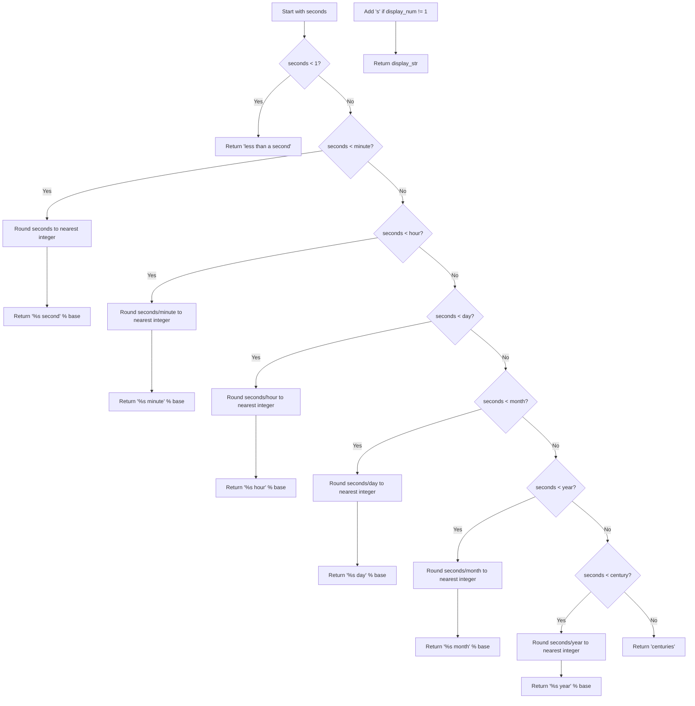

# `time_estimates.py`

## `zxcvbn.time_estimates.estimate_attack_times` · *function*

## Summary:
Calculates estimated attack times for password cracking under four different scenarios and determines the corresponding security strength score.

## Description:
This function computes how long it would take to crack a password using various attack methods, including online attacks with and without throttling, and offline attacks with different hashing speeds. It also calculates a security strength score based on the number of guesses required. This function is part of the zxcvbn password strength estimation system and provides comprehensive timing estimates for different threat models.

## Args:
    guesses (int or float): The number of guesses required to crack the password. Must be a non-negative numeric value representing the brute-force search space size.

## Returns:
    dict: A dictionary containing three keys:
        - 'crack_times_seconds' (dict): Mapping of attack scenarios to time estimates in seconds as Decimal objects
        - 'crack_times_display' (dict): Mapping of attack scenarios to human-readable time strings
        - 'score' (int): Security strength score from 0-4 based on the number of guesses

## Raises:
    None explicitly raised by this function. However, underlying helper functions may raise exceptions if given invalid inputs.

## Constraints:
    Preconditions:
        - Input `guesses` must be a numeric value (int or float)
        - Input `guesses` must be non-negative
        - Input `guesses` should represent a reasonable guess count for password analysis
    
    Postconditions:
        - All returned time values are represented as Decimal objects for precision
        - Display times are properly formatted strings with correct pluralization
        - Score is always an integer between 0 and 4 inclusive

## Side Effects:
    None. This is a pure function with no side effects.

## Control Flow:
```mermaid
flowchart TD
    A[Start estimate_attack_times(guesses)] --> B[Calculate 4 attack scenarios in seconds]
    B --> C[Convert seconds to Decimal objects]
    C --> D[Initialize crack_times_display dict]
    D --> E[Loop through scenarios]
    E --> F[Call display_time(seconds) for each scenario]
    F --> G[Store display string in crack_times_display]
    G --> H[Call guesses_to_score(guesses)]
    H --> I[Return dict with crack_times_seconds, crack_times_display, and score]
```

## Examples:
    >>> estimate_attack_times(1000)
    {
        'crack_times_seconds': {
            'online_throttling_100_per_hour': Decimal('0.0002777777777777777777777777778'),
            'online_no_throttling_10_per_second': Decimal('100.0'),
            'offline_slow_hashing_1e4_per_second': Decimal('0.1'),
            'offline_fast_hashing_1e10_per_second': Decimal('1e-7')
        },
        'crack_times_display': {
            'online_throttling_100_per_hour': 'less than a second',
            'online_no_throttling_10_per_second': '100 seconds',
            'offline_slow_hashing_1e4_per_second': '1 second',
            'offline_fast_hashing_1e10_per_second': 'less than a second'
        },
        'score': 0
    }

## `zxcvbn.time_estimates.guesses_to_score` · *function*

## Summary:
Converts a number of guesses into a security strength score ranging from 0 to 4.

## Description:
Maps the number of guesses required to crack a password to a discrete security strength score. This function is used to categorize password strength based on brute-force guess counts, with higher scores indicating stronger passwords that would require more attempts to crack.

## Args:
    guesses (float or int): The number of guesses required to crack a password. Must be a non-negative numeric value.

## Returns:
    int: Security strength score ranging from 0 to 4, where:
        - 0: Very weak (less than 1,005 guesses)
        - 1: Weak (less than 1,000,005 guesses)  
        - 2: Medium (less than 100,000,005 guesses)
        - 3: Strong (less than 10,000,000,005 guesses)
        - 4: Very strong (10,000,000,005 or more guesses)

## Raises:
    None: This function does not raise any exceptions.

## Constraints:
    Preconditions:
        - Input must be a numeric value (int or float)
        - Input must be non-negative
    Postconditions:
        - Return value is always an integer between 0 and 4 inclusive

## Side Effects:
    None: This function has no side effects.

## Control Flow:
```mermaid
flowchart TD
    A[guesses_to_score(guesses)] --> B{guesses < 1005?}
    B -- Yes --> C[return 0]
    B -- No --> D{guesses < 1000005?}
    D -- Yes --> E[return 1]
    D -- No --> F{guesses < 100000005?}
    F -- Yes --> G[return 2]
    F -- No --> H{guesses < 10000000005?}
    H -- Yes --> I[return 3]
    H -- No --> J[return 4]
```

## Examples:
    >>> guesses_to_score(100)
    0
    >>> guesses_to_score(500000)
    1
    >>> guesses_to_score(50000000)
    2
    >>> guesses_to_score(5000000000)
    3
    >>> guesses_to_score(50000000000)
    4

## `zxcvbn.time_estimates.display_time` · *function*

## Summary:
Converts a time duration in seconds into a human-readable string representation with appropriate units and pluralization.

## Description:
Formats a numeric time duration into a readable string that uses the largest appropriate time unit (seconds, minutes, hours, days, months, years, or centuries) and adds proper pluralization for quantities greater than one. This function is typically used to display estimated password cracking times in a user-friendly format.

## Args:
    seconds (float): The time duration in seconds to convert. Must be a non-negative number.

## Returns:
    str: A human-readable string representation of the time duration. Possible return values include:
        - 'less than a second'
        - '<number> second(s)'
        - '<number> minute(s)'  
        - '<number> hour(s)'
        - '<number> day(s)'
        - '<number> month(s)'
        - '<number> year(s)'
        - 'centuries'

## Raises:
    None explicitly raised. The function handles all edge cases internally.

## Constraints:
    Preconditions:
        - Input `seconds` must be a numeric value (int or float)
        - Input `seconds` should be non-negative
    
    Postconditions:
        - Always returns a string value
        - Returns a properly formatted time string with correct pluralization

## Side Effects:
    None. This is a pure function with no side effects.

## Control Flow:


## Examples:
    >>> display_time(0.5)
    'less than a second'
    
    >>> display_time(30)
    '30 seconds'
    
    >>> display_time(120)
    '2 minutes'
    
    >>> display_time(7200)
    '2 hours'
    
    >>> display_time(1000000)
    '11 days'
    
    >>> display_time(50000000)
    '1 year'
    
    >>> display_time(5000000000)
    'centuries'

## `zxcvbn.time_estimates.float_to_decimal` · *function*

## Summary:
Converts a floating-point number to an exact Decimal representation with maximum precision.

## Description:
This function transforms a Python float into a Decimal object with the highest possible precision by using the float's exact rational representation (numerator/denominator) and iteratively increasing precision until an exact division result is achieved. This avoids floating-point representation errors that can occur when directly converting floats to Decimals. The function is primarily used in zxcvbn's password strength estimation calculations where mathematical precision is critical.

## Args:
    f (float): The floating-point number to convert to Decimal. Must be a finite float (not NaN or infinity).

## Returns:
    Decimal: An exact Decimal representation of the input float with maximum precision achievable without floating-point errors.

## Raises:
    ValueError: If the input float is NaN or infinity
    Exception: May raise exceptions from underlying Decimal operations if input is malformed

## Constraints:
    Preconditions:
        - Input must be a valid Python float
        - Input must be finite (not NaN or infinity)
    
    Postconditions:
        - Returned value is an exact mathematical representation of the input float
        - Result has maximum precision achievable for the input without floating-point errors

## Side Effects:
    None

## Control Flow:
```mermaid
flowchart TD
    A[Start float_to_decimal(f)] --> B{f.as_integer_ratio()}
    B --> C[n, d = f.as_integer_ratio()]
    C --> D[numerator = Decimal(n)]
    D --> E[denominator = Decimal(d)]
    E --> F[ctx = Context(prec=60)]
    F --> G[result = ctx.divide(numerator, denominator)]
    G --> H{ctx.flags[Inexact] == True?}
    H -->|Yes| I[ctx.flags[Inexact] = False]
    I --> J[ctx.prec *= 2]
    J --> K[result = ctx.divide(numerator, denominator)]
    K --> H
    H -->|No| L[Return result]
```

## Examples:
    >>> from decimal import Decimal
    >>> float_to_decimal(0.1)
    Decimal('0.1')
    >>> float_to_decimal(0.3333333333333333)
    Decimal('0.3333333333333333')
    >>> float_to_decimal(1.0)
    Decimal('1')

