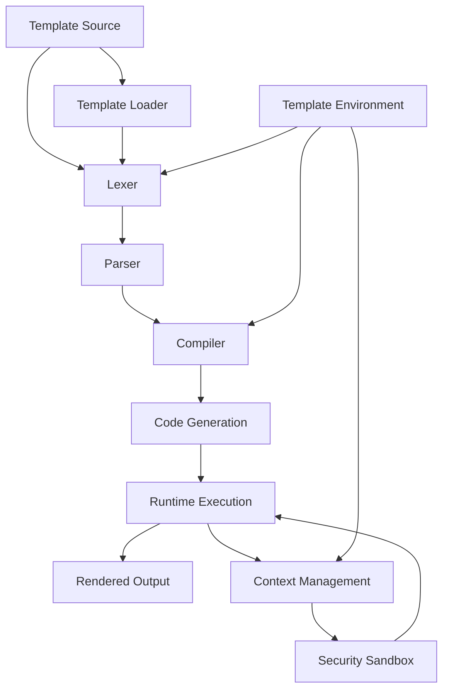

# `Jinja2`

## Repository Overview

### Tree Structure
```
Jinja2/
├── docs/          # Documentation files and guides
├── scripts/       # Utility scripts for maintenance
│   └── generate_identifier_pattern.py
└── src/           # Main source code
    ├── jinja2/    # Core Jinja2 package
    │   ├── async_utils.py
    │   ├── debug.py
    │   ├── lexer.py
    │   ├── nativetypes.py
    │   ├── optimizer.py
    │   ├── sandbox.py
    │   ├── tests.py
    │   └── utils.py
```

### Purpose

Jinja2 is a modern and designer-friendly templating engine for Python, widely used for generating HTML, XML, or any other markup format. It provides a clean separation between the presentation layer and business logic while offering powerful features like template inheritance, macros, and automatic HTML escaping.

**Target Users:**
- Web developers building web applications with frameworks like Flask or Django
- Content management systems requiring dynamic template generation
- Developers needing flexible text generation capabilities
- Designers working with template-based content creation

**Why It Matters:**
Jinja2 addresses the need for secure, maintainable, and flexible template systems in Python applications. Its combination of security features (automatic escaping), powerful templating constructs, and integration with popular Python web frameworks makes it indispensable for modern Python web development.

### Architecture



**Key Abstractions:**
- **Template Engine Pipeline**: Templates flow through a standardized pipeline of lexing, parsing, compiling, and executing
- **Security Sandboxing**: Built-in protection against malicious template code execution
- **Caching Mechanisms**: Optimized performance through template and expression caching
- **Extensible Runtime**: Support for custom filters, tests, and global functions

### Entry Points

**CLI Commands:**
- `jinja2` command-line interface for basic template processing
- Command-line tools for template debugging and testing

**Importable APIs:**
- `from jinja2 import Environment, Template` - Core templating interface
- `from jinja2 import FileSystemLoader, DictLoader` - Template loading strategies
- `from jinja2 import select_autoescape` - Autoescape configuration utilities

**Target Audience:**
- Web framework developers integrating Jinja2
- Template designers and content creators
- System administrators using Jinja2 for configuration management

### Core Features

1. **Template Inheritance** - Extend and override templates using `` blocks
2. **Macros** - Reusable template fragments with parameters
3. **Automatic Escaping** - Protection against XSS attacks with configurable autoescaping
4. **Filters** - Transform data with built-in and custom filter functions
5. **Control Structures** - Conditional rendering (``) and loops (``)
6. **Template Loading** - Multiple loaders for different source types (filesystem, dict, etc.)
7. **Security Features** - Sandboxed execution environment preventing dangerous operations
8. **Performance Optimization** - Caching, expression compilation, and lazy evaluation

### Dependencies

**Core Dependencies:**
- `markupsafe` - For HTML escaping and security
- `typing` - Type hints for better IDE support and documentation
- Standard library modules: `collections`, `json`, `re`, `threading`, `random`

**Version Requirements:**
- Python 3.7+ (for typing support and async features)
- Compatible with modern Python web frameworks

### Configuration

**Environment Variables:**
- `JINJA2_DEBUG` - Enable/disable debug mode for template compilation
- `JINJA2_CACHE_SIZE` - Configure template cache size limits

**Config Files:**
- Template environment settings via `Environment` constructor parameters
- Custom loader configurations for different template sources

### Extension Points

**Plugins and Hooks:**
- Custom filters, tests, and globals via `Environment` methods
- Custom loaders implementing the `BaseLoader` interface
- Custom extensions with `Extension` base class

**Subclassing:**
- Extend `Environment` for custom template behavior
- Override `BaseLoader` for specialized template loading
- Inherit from `Extension` for template syntax extensions

**Configuration-Driven Behavior:**
- Environment options control autoescaping, trim blocks, and other behaviors
- Template-specific settings via `Template` constructor parameters

---

## Modules

- [`docs/examples`](docs/examples.md)
- [`scripts`](scripts.md)
- [`src`](src.md)
- [`src/jinja2`](src/jinja2.md)

