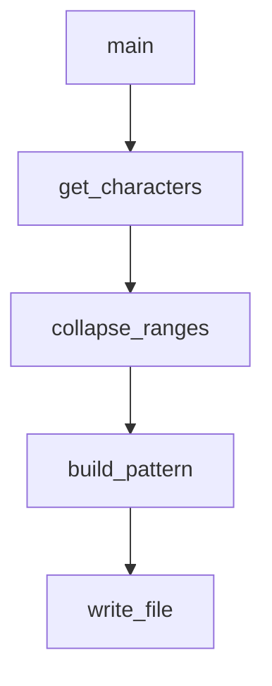

# `scripts`

## Tree:
scripts/
└── generate_identifier_pattern.py

## Role:
Generates and maintains regex patterns for Python identifier validation by processing Unicode character sets.

## Description:
This module provides functionality to automatically generate regex patterns used for validating Python identifiers. It identifies Unicode characters that are valid in Python identifiers but not classified as standard word characters, groups them into ranges, and compiles them into efficient regex patterns stored in source files. The module serves as a utility for maintaining identifier validation logic that adapts to changes in Python's identifier specification.

## Components:
- `get_characters()` - Generates Unicode characters valid as Python identifiers but not word characters
- `collapse_ranges(data)` - Groups consecutive characters into range tuples
- `build_pattern(ranges)` - Converts character ranges into compact string representation
- `main()` - Entry point that orchestrates the pattern generation and file writing process

## Public API:
- `get_characters()` -> Generator[str]: Generates Unicode characters that are valid Python identifiers but not word characters
- `collapse_ranges(data: str) -> Generator[Tuple[str, str], None, None]`: Groups consecutive characters into range tuples
- `build_pattern(ranges: Iterable[Tuple[str, str]]) -> str`: Converts character ranges into compact string representation
- `main() -> None`: Entry point for generating and writing identifier validation patterns

## Dependencies:
- Internal: None
- External: 
  - `sys` - Used for accessing maxunicode constant
  - `re` - Used for regular expression operations
  - `os.path` - Used for path manipulation

## Constraints:
- Must be run from the scripts directory for correct relative path resolution
- Requires write permissions to the target directory (src/jinja2/)
- Assumes sys.maxunicode is available for character generation
- All input character ranges must satisfy a <= b precondition

---

## Files

- [`generate_identifier_pattern.py`](scripts/generate_identifier_pattern.md)

