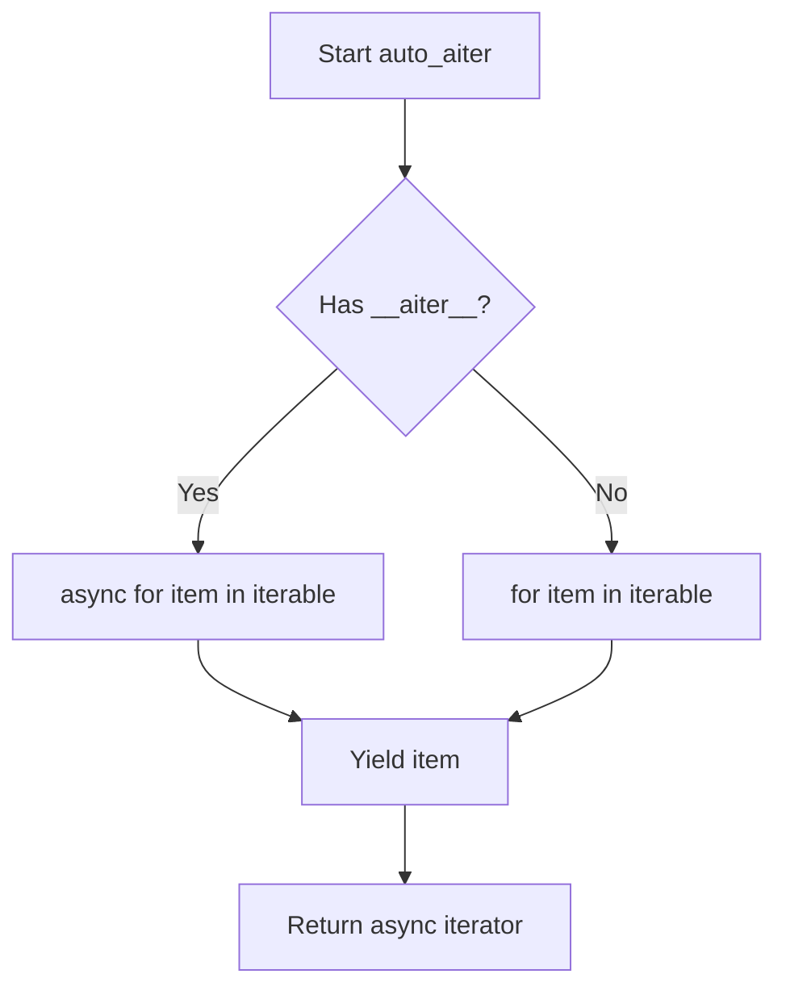

# `async_utils.py`

## `src.jinja2.async_utils.async_variant` · *function*

## Summary:
Creates an async variant decorator that enables runtime selection between synchronous and asynchronous function implementations based on the execution environment.

## Description:
The `async_variant` decorator factory generates a wrapper function that dynamically dispatches to either a synchronous or asynchronous implementation depending on whether the current Jinja2 environment is configured for asynchronous execution. This allows the same function interface to work in both synchronous and asynchronous contexts without requiring separate function definitions.

This abstraction is extracted into its own function to enforce a clean separation between synchronous and asynchronous execution paths while maintaining a unified interface for callers. The pattern enables Jinja2 templates to seamlessly work in both synchronous and asynchronous contexts.

## Args:
    normal_func (callable): The synchronous function to create an async variant of

## Returns:
    callable: A decorator function that accepts an async function and returns a wrapper that intelligently routes calls to either the sync or async implementation

## Raises:
    None explicitly raised - behavior depends on underlying functions

## Constraints:
    Preconditions:
    - `normal_func` must be a callable that can be wrapped
    - The function should be designed to work with both sync and async variants
    - Environment must have proper async detection capabilities
    
    Postconditions:
    - Returned decorator properly handles argument forwarding
    - Wrapper maintains function metadata from both original functions
    - The wrapper has a `jinja_async_variant` attribute set to True

## Side Effects:
    None directly - but the wrapper may cause side effects depending on which function (sync or async) it ultimately calls

## Control Flow:
```mermaid
flowchart TD
    A[async_variant called with normal_func] --> B[Returns decorator]
    B --> C[decorator called with async_func]
    C --> D[Create wrapper function]
    D --> E[Detect pass_arg via _PassArg.from_obj(normal_func)]
    E --> F{pass_arg is _PassArg.environment?}
    F -->|Yes| G[is_async checks args[0].is_async]
    F -->|No| H[is_async checks args[0].environment.is_async]
    G --> I[Get is_async result]
    H --> I
    I --> J{need_eval_context?}
    J -->|Yes| K[Remove first arg (args = args[1:]) ]
    J -->|No| L[Keep args as-is]
    L --> M[Call is_async(args)]
    K --> M
    M --> N{is_async result?}
    N -->|True| O[Return async_func(*args, **kwargs)]
    N -->|False| P[Return normal_func(*args, **kwargs)]
    O --> Q[Return]
    P --> Q
```

## Examples:
```python
# Define a synchronous function
@async_variant
def my_filter(value):
    return value.upper()

# Create async variant by decorating with async function
@my_filter.async_variant
async def my_filter_async(value):
    return value.upper() + "_ASYNC"

# Usage in template context:
# In sync context: calls my_filter
# In async context: calls my_filter_async
```

## `src.jinja2.async_utils.auto_await` · *function*

## Summary:
Automatically resolves awaitable values while passing through non-awaitable values unchanged.

## Description:
This utility function serves as a bridge between synchronous and asynchronous code by automatically awaiting awaitable objects while leaving regular values untouched. It's commonly used in template rendering contexts where values may originate from either synchronous or asynchronous sources. The function optimizes performance by avoiding unnecessary awaits on primitive types that are known to never be awaitable.

## Args:
    value (Union[Awaitable[V], V]): A value that may be either an awaitable object (coroutine, future, etc.) or a regular value of type V. The type V can be any valid Python type.

## Returns:
    V: The resolved value. If the input was awaitable, this will be the awaited result; otherwise, it will be the original value unchanged.

## Raises:
    None explicitly raised - though underlying await operations may propagate exceptions from the awaited coroutines.

## Constraints:
    Preconditions:
    - The input value must be of type Union[Awaitable[V], V] where V is a valid type.
    - If the input is awaitable, it must resolve to a value compatible with type V.
    
    Postconditions:
    - The returned value will be of type V.
    - If the input was awaitable, it will have been awaited and resolved to its final value.
    - Primitive types in `_common_primitives` are returned without awaiting for performance optimization.

## Side Effects:
    None directly observable - but may cause coroutine scheduling and I/O when awaiting awaitable inputs.

## Control Flow:
```mermaid
flowchart TD
    A[Input Value] --> B{Type in _common_primitives?}
    B -- Yes --> C[Return value casted to V]
    B -- No --> D{inspect.isawaitable(value)?}
    D -- Yes --> E[Await value and return result]
    D -- No --> F[Return value casted to V]
    C --> G[End]
    E --> G
    F --> G
```

## Examples:
```python
# In template context where async functions might be called
result = await auto_await(some_async_function())  # Returns awaited result
value = auto_await(42)  # Returns 42 unchanged (primitive type)
text = auto_await("hello")  # Returns "hello" unchanged (primitive type)
```

## `src.jinja2.async_utils.auto_aiter` · *function*

## Summary:
Converts a synchronous or asynchronous iterable into an asynchronous iterator that yields items from the source.

## Description:
This utility function abstracts the complexity of handling both synchronous and asynchronous iterables by detecting whether the input has an `__aiter__` method. When present, it performs asynchronous iteration; otherwise, it falls back to synchronous iteration. This enables uniform processing of mixed iterable types in asynchronous contexts.

## Args:
    iterable (Union[AsyncIterable[V], Iterable[V]]): An iterable object that may be either synchronous or asynchronous. The iterable must support the standard iteration protocol.

## Returns:
    AsyncIterator[V]: An asynchronous iterator that yields items from the input iterable, regardless of whether it was originally synchronous or asynchronous.

## Raises:
    None explicitly raised - the function delegates to the underlying iteration mechanisms which may raise appropriate exceptions.

## Constraints:
    Preconditions:
    - The input iterable must be iterable (support __iter__ or __aiter__ methods)
    - The iterable must be compatible with the type V specified in the generic parameter
    
    Postconditions:
    - The returned async iterator will yield all items from the input iterable
    - The iteration order is preserved from the original iterable

## Side Effects:
    None - This function is a pure generator that doesn't modify external state or perform I/O operations beyond the iteration itself.

## Control Flow:


## Examples:
```python
# Usage with async iterable
async def async_data_source():
    for i in range(3):
        yield i

# Using auto_aiter with async iterable
async for item in auto_aiter(async_data_source()):
    print(item)  # Prints 0, 1, 2

# Usage with sync iterable  
sync_list = [1, 2, 3]

# Using auto_aiter with sync iterable
async for item in auto_aiter(sync_list):
    print(item)  # Prints 1, 2, 3
```

## `src.jinja2.async_utils.auto_to_list` · *function*

## Summary:
Converts an asynchronous or synchronous iterable into a list by asynchronously iterating over its elements.

## Description:
This function provides a unified interface for converting both synchronous and asynchronous iterables into concrete lists. It leverages the `auto_aiter` utility to handle the complexity of determining whether the input is synchronous or asynchronous, then uses async list comprehension to collect all elements into a list. This abstraction allows downstream code to work with a consistent list type regardless of the input's iteration mechanism.

## Args:
    value (Union[AsyncIterable[V], Iterable[V]]): An iterable object that may be either synchronous or asynchronous. The iterable must support the standard iteration protocol and be compatible with the type V specified in the generic parameter.

## Returns:
    List[V]: A list containing all items from the input iterable, preserving the original iteration order. The list will be empty if the input iterable contains no elements.

## Raises:
    None explicitly raised - the function delegates to the underlying iteration mechanisms which may raise appropriate exceptions during iteration.

## Constraints:
    Preconditions:
    - The input value must be iterable (support __iter__ or __aiter__ methods)
    - The iterable must be compatible with the type V specified in the generic parameter
    
    Postconditions:
    - The returned list will contain all items from the input iterable
    - The iteration order is preserved from the original iterable
    - The function will always return a concrete list object

## Side Effects:
    None - This function is a pure transformation that doesn't modify external state or perform I/O operations beyond the iteration itself.

## Control Flow:
```mermaid
flowchart TD
    A[Start auto_to_list] --> B[Call auto_aiter(value)]
    B --> C{auto_aiter returns}
    C --> D[Async list comprehension [x async for x in ...]]
    D --> E[Return list of items]
```

## Examples:
```python
# Usage with async iterable
async def async_data_source():
    for i in range(3):
        yield i

# Convert async iterable to list
result = await auto_to_list(async_data_source())
print(result)  # Output: [0, 1, 2]

# Usage with sync iterable  
sync_list = [1, 2, 3]

# Convert sync iterable to list
result = await auto_to_list(sync_list)
print(result)  # Output: [1, 2, 3]

# Usage with empty iterable
empty_async_iter = async def empty_source():
    return
    yield  # unreachable

result = await auto_to_list(empty_async_iter())
print(result)  # Output: []
```

