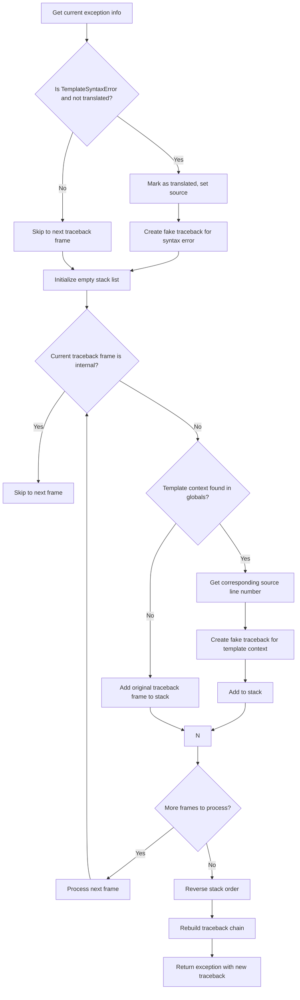

# `debug.py`

## `src.jinja2.debug.rewrite_traceback_stack` · *function*

## Summary:
Rewrites a traceback stack to provide clearer debugging information for Jinja2 template exceptions by filtering internal frames and mapping template line numbers to source locations.

## Description:
This function processes the current exception's traceback to improve debugging experience for Jinja2 templates. It removes internal Jinja2 implementation frames from the traceback, remaps template line numbers to actual source line numbers, and creates enhanced traceback entries for template execution contexts. The function is typically called within exception handling blocks to provide more meaningful error messages to template authors.

The logic is extracted into its own function to encapsulate the complex traceback manipulation required for proper template debugging, separating this concern from the main template rendering flow and making the exception handling reusable across different template execution paths.

## Args:
    source (Optional[str]): The source code of the template being rendered, used to provide context for syntax errors. Defaults to None.

## Returns:
    BaseException: The original exception instance with a rewritten traceback that provides better debugging information for template errors.

## Raises:
    None explicitly raised - the function operates on the current exception context and returns the exception with modified traceback.

## Constraints:
    Preconditions:
    - Must be called within an exception handler (using sys.exc_info())
    - The current exception must be a valid BaseException instance
    - The traceback chain must be accessible through sys.exc_info()

    Postconditions:
    - Returns the same exception instance but with an enhanced traceback
    - Internal Jinja2 frames are filtered out from the traceback
    - Template line numbers are mapped to actual source line numbers where applicable

## Side Effects:
    None

## Control Flow:


## Examples:
```python
# Typical usage within Jinja2's exception handling
try:
    # Template rendering code
    pass
except Exception as e:
    # Rewrite traceback to provide better debugging context
    rewritten_exception = rewrite_traceback_stack("template_source_here")
    raise rewritten_exception
```

## `src.jinja2.debug.fake_traceback` · *function*

## Summary:
Creates a fake traceback for Jinja2 template exceptions by generating executable code that mimics the template execution context.

## Description:
This function generates a synthetic traceback that accurately reflects the location and context of template execution errors. It's used internally by Jinja2's debugging infrastructure to provide meaningful stack traces when template exceptions occur. The function constructs a fake execution environment that simulates the template's execution context, allowing debugging tools to display proper line numbers and function names.

The logic is extracted into its own function to separate the traceback generation concern from the main template execution flow, enabling cleaner debugging and better error reporting without cluttering the core template rendering logic.

## Args:
    exc_value (BaseException): The exception instance that occurred during template rendering
    tb (Optional[TracebackType]): The original traceback from the template execution, or None if not available
    filename (str): The filename of the template being executed
    lineno (int): The line number in the template where the exception occurred

## Returns:
    TracebackType: A fake traceback object that provides proper context for debugging template errors, pointing to the template location where the exception occurred

## Raises:
    None explicitly raised - the function catches all exceptions internally and returns the next traceback in the chain

## Constraints:
    Preconditions:
    - exc_value must be a valid exception instance
    - filename must be a valid string representing a template file path
    - lineno must be a positive integer indicating the line number in the template
    - tb can be None or a valid traceback object

    Postconditions:
    - Returns a valid TracebackType object suitable for exception chaining
    - The returned traceback accurately reflects the template execution context
    - Original exception information is preserved in the traceback

## Side Effects:
    None

## Control Flow:
```mermaid
flowchart TD
    A[Start fake_traceback] --> B{tb is not None?}
    B -- Yes --> C[Get template locals from tb frame]
    B -- No --> D[Initialize empty locals dict]
    C --> E[Remove __jinja_exception__ from locals]
    D --> E
    E --> F[Create globals dict with filename and exception]
    F --> G[Compile fake code with raise statement]
    G --> H[Set location to "template"]
    H --> I{tb is not None?}
    I -- Yes --> J[Get function name from tb frame]
    J --> K{Function is "root"?}
    K -- Yes --> L[Set location to "top-level template code"]
    K -- No --> M{Function starts with "block_"?}
    M -- Yes --> N[Set location to block name]
    M -- No --> O[Keep location as "template"]
    L --> P
    N --> P
    O --> P
    P --> Q{Python version >= 3.8?}
    Q -- Yes --> R[Use code.replace() to set co_name]
    Q -- No --> S[Use CodeType constructor to create modified code]
    R --> T[Execute compiled code]
    S --> T
    T --> U[Try to execute code]
    U --> V{Exception caught?}
    V -- Yes --> W[Return sys.exc_info()[2].tb_next]
    V -- No --> X[Return None]
```

## Examples:
```python
# Typical usage within Jinja2's exception handling
try:
    # Template rendering code
    pass
except Exception as e:
    # Jinja2 internally calls fake_traceback to enhance error reporting
    fake_tb = fake_traceback(e, sys.exc_info()[2], "template.html", 42)
    # The fake_tb provides better debugging context for template errors
```

## `src.jinja2.debug.get_template_locals` · *function*

## Summary:
Extracts and resolves template local variables from execution context, handling variable scoping and overrides based on nesting depth.

## Description:
This function processes local variables from Jinja2 template execution frames to extract meaningful template context data. It combines context information with local variable overrides, resolving conflicts by preferring higher-depth variable definitions. This function serves as a debugging utility that provides a clean view of effective template variables during execution, particularly useful for introspecting template scopes and debugging template rendering issues.

## Args:
    real_locals (Mapping[str, Any]): A mapping of local variables from a template execution frame, typically obtained via `locals()` during template rendering. Expected to contain:
    - An optional "context" key holding a Context object
    - Local variables with names starting with "l_" followed by depth number and variable name (e.g., "l_0_var1", "l_2_var3")

## Returns:
    Dict[str, Any]: A consolidated dictionary of template-local variables including:
    - All context variables (when context is present)
    - Resolved local variables with depth-based override resolution
    - Proper handling of missing variables (removal from result when marked as missing)

## Raises:
    None explicitly raised in the function body.

## Constraints:
    Preconditions:
    - Input `real_locals` must be a mapping-like object
    - Local variable names must follow the "l_<depth>_<name>" pattern for processing
    - The `missing` sentinel value is used to mark undefined variables
    
    Postconditions:
    - Returned dictionary is a copy of context data plus processed locals
    - Variable shadowing follows depth precedence (higher depth overrides lower)
    - Variables marked as `missing` are removed from the result
    - No modifications are made to the input `real_locals` mapping

## Side Effects:
    None

## Control Flow:
```mermaid
flowchart TD
    A[Start get_template_locals] --> B{ctx is not None?}
    B -- Yes --> C[Get ctx.get_all().copy()]
    B -- No --> D[data = {}]
    C --> E[data = ctx data]
    D --> E
    E --> F[Initialize local_overrides]
    F --> G[Iterate real_locals]
    G --> H{Variable starts with "l_" AND value is not missing?}
    H -- No --> I[Continue loop]
    H -- Yes --> J[Split name by "_"]
    J --> K{Split successful?}
    K -- No --> I
    K -- Yes --> L[Parse depth as int]
    L --> M{cur_depth < depth?}
    M -- Yes --> N[Update local_overrides[name]]
    M -- No --> O[Skip update]
    N --> P[Continue loop]
    O --> P
    P --> Q[Process local_overrides]
    Q --> R[Apply overrides to data]
    R --> S[Return data]
```

## Examples:
```python
# Typical usage in debugging context
def debug_template_locals(frame_locals):
    # Called internally by Jinja2 debugging infrastructure
    template_locals = get_template_locals(frame_locals)
    print("Effective template variables:", template_locals)
    return template_locals

# Example of variable resolution
frame_locals = {
    "context": template_context,
    "l_0_name": "Alice",      # Base definition
    "l_1_name": "Bob",        # Overrides at depth 1
    "l_2_name": "Charlie",    # Overrides at depth 2 (wins)
    "l_1_age": 30,            # Valid local variable
    "l_3_age": missing        # Will be removed from result
}

effective_vars = get_template_locals(frame_locals)
# Result contains: context data + name="Charlie" + age=30 (age removed due to missing)

# Simple case without context
simple_locals = {
    "l_0_var1": "value1",
    "l_2_var2": "value2"
}
result = get_template_locals(simple_locals)
# Result contains: var1="value1", var2="value2"
```

