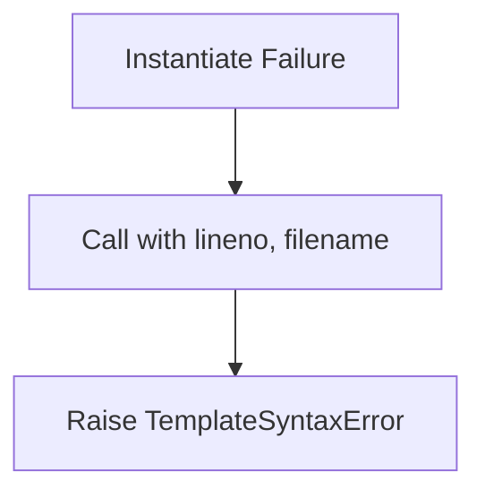
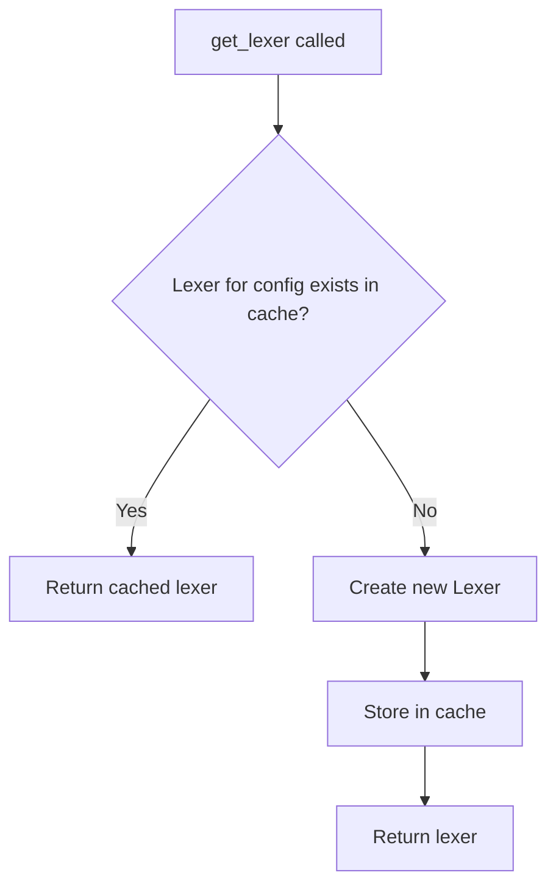
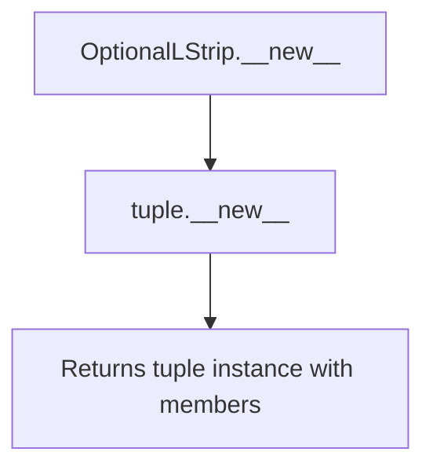
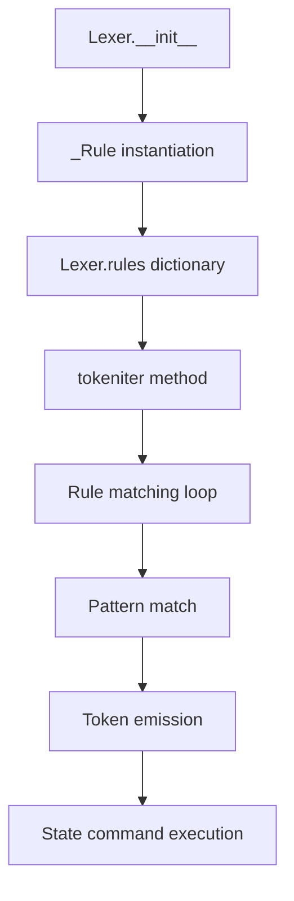

# `lexer.py`

## `src.jinja2.lexer._describe_token_type` · *function*

## Summary:
Maps internal token type identifiers to descriptive strings for debugging and error reporting.

## Description:
This utility function converts internal token type identifiers into human-readable descriptions. It serves as a lookup mechanism to provide meaningful explanations of token types used in the Jinja2 template lexer.

The function implements two lookup strategies:
1. First checks if the token_type exists in a global reverse_operators mapping (if defined) and returns the corresponding value if found
2. Falls back to a predefined dictionary mapping for standard template token types
3. Returns the original token_type string if no mapping is found

This logic is encapsulated in its own function to separate the concern of token description from parsing logic, improving code organization and maintainability.

## Args:
    token_type (str): The internal identifier for a token type, such as "TOKEN_COMMENT_BEGIN" or an operator token identifier

## Returns:
    str: A human-readable description of the token type. If no specific mapping exists, returns the original token_type string unchanged.

## Raises:
    None explicitly raised

## Constraints:
    Preconditions:
    - The token_type parameter must be a string
    - The reverse_operators variable must be accessible in the function's scope (though it may be undefined)
    - The predefined dictionary must be properly initialized
    
    Postconditions:
    - Always returns a string value
    - If token_type matches an entry in reverse_operators, returns the mapped value
    - If token_type matches an entry in the predefined dictionary, returns the corresponding description
    - If no mapping exists, returns the original token_type unchanged

## Side Effects:
    None

## Control Flow:
```mermaid
flowchart TD
    A[Start _describe_token_type] --> B{token_type in reverse_operators?}
    B -- Yes --> C[Return reverse_operators[token_type]]
    B -- No --> D[Lookup token_type in predefined dict]
    D --> E{Found in dict?}
    E -- Yes --> F[Return description]
    E -- No --> G[Return token_type]
    F --> H[End]
    G --> H
```

## Examples:
    >>> _describe_token_type("TOKEN_COMMENT_BEGIN")
    "begin of comment"
    
    >>> _describe_token_type("TOKEN_DATA")
    "template data / text"
    
    >>> _describe_token_type("UNKNOWN_TOKEN_TYPE")
    "UNKNOWN_TOKEN_TYPE"
```

## `src.jinja2.lexer.describe_token` · *function*

## Summary:
Returns a human-readable description of a token, optimized for name tokens to return their actual value.

## Description:
This function provides a descriptive representation of a token for debugging and error reporting purposes. When the token represents a name (identifier), it returns the token's actual value directly. For all other token types, it delegates to `_describe_token_type()` to provide a standardized description.

The function serves as a utility for converting internal token representations into user-friendly descriptions while maintaining performance by avoiding unnecessary processing for name tokens.

This logic is extracted into its own function to separate the concern of token description from parsing logic, improving code organization and maintainability.

## Args:
    token (Token): A token object containing line number, type, and value information

## Returns:
    str: For TOKEN_NAME tokens, returns the token's value directly; for all other tokens, returns a descriptive string from _describe_token_type()

## Raises:
    None explicitly raised

## Constraints:
    Preconditions:
    - The token parameter must be a Token instance with valid lineno, type, and value attributes
    - The token.type attribute must be a string
    - TOKEN_NAME constant must be defined in the module scope
    
    Postconditions:
    - Always returns a string value
    - For tokens where token.type == TOKEN_NAME, returns token.value unchanged
    - For all other tokens, returns result from _describe_token_type(token.type)

## Side Effects:
    None

## Control Flow:
```mermaid
flowchart TD
    A[Start describe_token] --> B{token.type == TOKEN_NAME?}
    B -- Yes --> C[Return token.value]
    B -- No --> D[Return _describe_token_type(token.type)]
```

## Examples:
    >>> token = Token(1, "TOKEN_NAME", "variable_name")
    >>> describe_token(token)
    "variable_name"
    
    >>> token = Token(1, "TOKEN_DATA", "some text")
    >>> describe_token(token)
    "template data / text"

## `src.jinja2.lexer.describe_token_expr` · *function*

*No documentation generated.*

## `src.jinja2.lexer.count_newlines` · *function*

## Summary:
Counts the number of newline characters in a given string using a compiled regex pattern.

## Description:
This function counts newline characters in a string by finding all matches of a predefined newline regex pattern (`newline_re`). It is used internally by the Jinja2 lexer to track line numbers during template parsing, which is essential for accurate error reporting and position tracking in templates.

## Args:
    value (str): The input string to count newlines in. Must be a string type.

## Returns:
    int: The total number of newline characters found in the input string.

## Raises:
    AttributeError: If the input value does not support the findall method (should not occur with str type).

## Constraints:
    Preconditions:
        - The input value must be a string type
    Postconditions:
        - The return value is always a non-negative integer representing the count of newline characters
        - The function does not modify the input string

## Side Effects:
    None: This function has no side effects and is purely functional.

## Control Flow:
```mermaid
flowchart TD
    A[Input String] --> B[Find all newlines using newline_re.findall()]
    B --> C[Count total matches]
    C --> D[Return match count]
```

## Examples:
    >>> count_newlines("Hello\\nWorld")
    1
    >>> count_newlines("Line1\\nLine2\\nLine3")
    2
    >>> count_newlines("No newlines here")
    0
```

## `src.jinja2.lexer.compile_rules` · *function*

*No documentation generated.*

## `src.jinja2.lexer.Failure` · *class*

## Summary:
A callable exception factory that creates and raises TemplateSyntaxError with line number and filename context.

## Description:
The Failure class serves as a utility for raising template syntax errors with proper contextual information. It is designed to be instantiated once with an error message and optionally an error class, then called with line number and filename to raise the appropriate exception. This pattern allows for centralized error handling with consistent error formatting throughout the Jinja2 lexer.

## State:
- message (str): The error message to be included in the raised exception
- error_class (Type[TemplateSyntaxError]): The exception class to raise, defaults to TemplateSyntaxError

## Lifecycle:
- Creation: Instantiate with a message string and optional error class
- Usage: Call the instance with line number and filename arguments to raise the exception
- Destruction: No explicit cleanup required as it raises an exception and never returns

## Method Map:


## Raises:
- TemplateSyntaxError (or custom error class): Raised when the instance is called with line number and filename parameters

## Example:
```python
# Create failure handler
failure = Failure("Unexpected end of template")

# Raise error at line 10 in template file
failure(10, "template.html")
# This raises: TemplateSyntaxError("Unexpected end of template", 10, "template.html")
```

### `src.jinja2.lexer.Failure.__init__` · *method*

## Summary:
Initializes a Failure object with an error message and error class for later exception raising.

## Description:
Constructs a Failure instance that stores an error message and error class. When subsequently called with line number and filename arguments, this instance will raise an exception of the specified class with the stored message and context information.

## Args:
    message (str): The error message to be included in the raised exception.
    cls (Type[TemplateSyntaxError], optional): The exception class to raise. Defaults to TemplateSyntaxError.

## Returns:
    None: This method does not return a value.

## Raises:
    None: This method does not raise exceptions directly.

## State Changes:
    Attributes READ: None
    Attributes WRITTEN: self.message, self.error_class

## Constraints:
    Preconditions: The message parameter must be a string. The cls parameter must be a subclass of TemplateSyntaxError.
    Postconditions: After initialization, the Failure instance will store the provided message and error class for later use.

## Side Effects:
    None: This method performs no I/O operations or external service calls.

### `src.jinja2.lexer.Failure.__call__` · *method*

*No documentation generated.*

## `src.jinja2.lexer.Token` · *class*

## Summary:
Immutable data structure representing a lexical token in Jinja2 template parsing, containing line number, type, and value information.

## Description:
The Token class represents a single lexical element identified by Jinja2's template lexer during the parsing process. Each token consists of three components: line number, token type identifier, and the actual textual value. Tokens are created by the lexer and consumed by the parser to build the template's abstract syntax tree.

This class provides specialized methods for token matching and testing, enabling parser components to efficiently identify and process different types of tokens based on their characteristics.

## State:
- lineno: int - The line number (1-indexed) in the source template where this token begins
- type: str - The token type identifier (e.g., "TOKEN_NAME", "TOKEN_DATA", "TOKEN_OPERATOR")  
- value: str - The actual text content of the token (e.g., "variable_name", "hello world", "+")

All fields are immutable due to the NamedTuple inheritance, ensuring token consistency throughout the parsing process.

## Lifecycle:
- Creation: Tokens are constructed by the Jinja2 lexer during template compilation
- Usage: Parser components consume tokens by examining their type and value attributes
- Destruction: Tokens are automatically garbage collected when no longer referenced

## Method Map:
```mermaid
flowchart TD
    A[Token Creation] --> B[Token.__str__()]
    A --> C[Token.test()]
    A --> D[Token.test_any()]
    C --> E[describe_token()]
    D --> C
    E --> F[_describe_token_type()]
```

## Raises:
- None explicitly raised by Token constructor or methods
- The describe_token function may raise exceptions if passed invalid Token objects

## Example:
```python
# Creating a token
token = Token(lineno=1, type="TOKEN_NAME", value="username")

# String representation shows human-readable description
print(str(token))  # Displays descriptive string via describe_token()

# Test single token type
if token.test("TOKEN_NAME"):
    print("This is a name token")

# Test multiple token types
if token.test_any("TOKEN_NAME", "TOKEN_NUMBER"):
    print("This is either a name or number token")

# Advanced pattern matching
# token.test("TOKEN_NAME:username") matches type and value exactly
```

### `src.jinja2.lexer.Token.__str__` · *method*

## Summary:
Returns a human-readable string representation of the token for debugging and error reporting.

## Description:
This method provides a string representation of the token that is optimized for readability. When the token represents a name (identifier), it returns the token's actual value directly. For all other token types, it returns a descriptive string that identifies the token type and value. This method is automatically called when a token is converted to a string or printed, making it useful for debugging and error message generation.

The implementation delegates to the `describe_token` function to handle the actual formatting logic, separating concerns between token representation and token description logic.

## Args:
    None

## Returns:
    str: For TOKEN_NAME tokens, returns the token's value directly; for all other tokens, returns a descriptive string from _describe_token_type()

## Raises:
    None

## State Changes:
    Attributes READ: self.lineno, self.type, self.value
    Attributes WRITTEN: None

## Constraints:
    Preconditions:
    - The token object must be properly initialized with lineno, type, and value attributes
    - The token.type attribute must be a string
    - TOKEN_NAME constant must be defined in the module scope
    
    Postconditions:
    - Always returns a string value
    - For tokens where token.type == TOKEN_NAME, returns token.value unchanged
    - For all other tokens, returns result from _describe_token_type(token.type)

## Side Effects:
    None

### `src.jinja2.lexer.Token.test` · *method*

## Summary:
Tests whether the token matches a specified expression pattern, supporting both direct type matching and type-value pair matching.

## Description:
The test method evaluates whether the current token matches a given expression pattern. It supports two matching modes: direct type matching and type-value pair matching. This method is commonly used during template parsing to validate token types and values against expected patterns.

The method is typically called during parsing phases when the lexer needs to verify that tokens conform to expected formats, particularly in template syntax validation and parsing logic.

This logic is encapsulated in its own method rather than being inlined because token matching is a fundamental operation in template parsing that needs to be reusable across different parsing contexts, and the dual matching modes (type-only vs type-value) make it cleaner to separate this logic.

## Args:
    expr (str): A string expression to match against the token. Can be either:
        - A simple token type string (e.g., "NAME", "NUMBER")
        - A type-value pair in the format "type:value" (e.g., "NAME:variable_name")

## Returns:
    bool: True if the token matches the expression pattern, False otherwise.
        - Returns True immediately if self.type equals expr
        - For expressions containing ":", compares expr.split(":", 1) with [self.type, self.value]
        - Returns False for all other cases

## Raises:
    None explicitly raised

## State Changes:
    Attributes READ: self.type, self.value
    Attributes WRITTEN: None

## Constraints:
    Preconditions:
    - The expr parameter must be a string
    - The token object must have valid type and value attributes
    
    Postconditions:
    - Always returns a boolean value
    - The comparison operations are strictly based on string equality
    - No modifications are made to the token object's state

## Side Effects:
    None

### `src.jinja2.lexer.Token.test_any` · *method*

## Summary:
Checks if the token matches any of the provided expression patterns.

## Description:
Determines whether the current token matches at least one of the given expression patterns by testing each pattern against the token's type and value. This method provides a convenient way to perform multiple token type/value checks in a single operation.

## Args:
    *iterable (str): Variable-length argument list of expression patterns to test against the token. Each pattern can be either:
        - A token type string (e.g., "name", "number")
        - A colon-separated type:value pair (e.g., "name:foo")

## Returns:
    bool: True if the token matches any of the provided expressions, False otherwise.

## Raises:
    None: This method does not raise any exceptions.

## State Changes:
    Attributes READ: self.type, self.value
    Attributes WRITTEN: None

## Constraints:
    Preconditions: The token object must be properly initialized with type and value attributes.
    Postconditions: The method returns a boolean value indicating match status without modifying the token object.

## Side Effects:
    None: This method performs no I/O operations or external service calls. It only accesses the token's internal attributes.

## `src.jinja2.lexer.TokenStreamIterator` · *class*

## Summary:
An iterator that traverses a TokenStream, yielding tokens one by one until reaching the end-of-file marker.

## Description:
The TokenStreamIterator class provides an iterator interface for consuming tokens from a TokenStream. It enables sequential access to tokens in a template's lexical analysis phase, making it easy to process tokens in a for-loop or other iteration contexts. This class is typically created internally by the TokenStream class when iterating over tokens.

The iterator handles the special case of end-of-file tokens (TOKEN_EOF) by closing the underlying stream and raising StopIteration to signal completion of iteration.

## State:
- stream: TokenStream - The underlying token stream being iterated over. Must not be None and must support the iterator protocol.
- The iterator maintains no additional state beyond referencing the TokenStream.

## Lifecycle:
- Creation: Instantiated with a TokenStream object; typically created by TokenStream.__iter__()
- Usage: Called repeatedly with next() or used in for-loops; each call advances the stream position
- Destruction: Automatically handled by Python's iteration protocol; stream is closed when EOF is reached

## Method Map:
```mermaid
flowchart TD
    A[TokenStreamIterator.__init__] --> B[stream = TokenStream]
    B --> C[TokenStreamIterator.__iter__]
    C --> D[TokenStreamIterator.__next__]
    D --> E{token.type is TOKEN_EOF?}
    E -- Yes --> F[stream.close()]
    E -- No --> G[next(stream)]
    G --> H[return token]
    F --> I[Raise StopIteration]
```

## Raises:
- StopIteration: Raised when the iterator reaches the end-of-file token (TOKEN_EOF) in the stream
- TemplateSyntaxError: May be raised indirectly when stream operations fail (though not directly in this class)

## Example:
```python
# Typical usage with TokenStream
stream = TokenStream(generator, name, filename)
iterator = iter(stream)  # Creates TokenStreamIterator

for token in iterator:
    print(f"Token: {token.type} = {token.value}")
    if token.type is TOKEN_EOF:
        break  # This won't be reached due to StopIteration

# Alternative manual iteration
iterator = iter(stream)
try:
    while True:
        token = next(iterator)
        print(f"Token: {token.type} = {token.value}")
except StopIteration:
    print("End of token stream reached")
```

### `src.jinja2.lexer.TokenStreamIterator.__init__` · *method*

## Summary:
Initializes a TokenStreamIterator with a token stream for sequential token consumption.

## Description:
Constructs a TokenStreamIterator instance that will iterate over tokens from the provided TokenStream. This iterator enables sequential access to tokens during template parsing by maintaining a reference to the underlying token stream.

The iterator follows Python's iterator protocol, where __iter__ returns self and __next__ advances through tokens in the stream. This design allows parsers to consume tokens one-by-one while maintaining proper state management.

## Args:
    stream (TokenStream): The token stream to iterate over. Must be a valid TokenStream instance containing tokens to be consumed.

## Returns:
    None: This method initializes the iterator object and does not return a value.

## Raises:
    None: This method does not explicitly raise exceptions under normal circumstances.

## State Changes:
    Attributes READ: None
    Attributes WRITTEN: self.stream - stores the reference to the provided TokenStream

## Constraints:
    Preconditions: 
    - The stream parameter must be a valid TokenStream instance
    - The TokenStream should be properly initialized with tokens
    
    Postconditions:
    - The iterator is ready to consume tokens from the provided stream
    - self.stream attribute contains a reference to the input TokenStream

## Side Effects:
    None: This method performs no I/O operations or external service calls. It only stores a reference to the provided TokenStream object.

### `src.jinja2.lexer.TokenStreamIterator.__iter__` · *method*

## Summary:
Returns the iterator instance itself, implementing the Python iterator protocol for token stream iteration.

## Description:
Implements the `__iter__` method of the iterator protocol, allowing `TokenStreamIterator` instances to be used directly in for-loops and other iteration contexts. This method simply returns `self`, making the iterator object its own iterator.

The `TokenStreamIterator` class is designed to wrap a `TokenStream` and provide sequential access to tokens during template parsing. When used in iteration contexts, it delegates to the underlying `__next__` method to retrieve tokens one by one until reaching the end of the stream.

## Args:
    None

## Returns:
    TokenStreamIterator: The iterator instance itself, enabling iteration over tokens in the wrapped token stream.

## Raises:
    None

## State Changes:
    Attributes READ: None
    Attributes WRITTEN: None

## Constraints:
    Preconditions: The `TokenStreamIterator` instance must be properly initialized with a valid `TokenStream` object.
    Postconditions: The returned iterator instance maintains the same state as the original object.

## Side Effects:
    None

### `src.jinja2.lexer.TokenStreamIterator.__next__` · *method*

## Summary:
Returns the next token from the token stream iterator, advancing the iterator position and handling end-of-stream conditions.

## Description:
Implements the iterator protocol's `__next__` method for `TokenStreamIterator`. This method retrieves the current token from the underlying token stream, checks if it's an end-of-file marker, and advances the stream position accordingly. When an EOF token is encountered, the stream is closed and a `StopIteration` exception is raised to terminate iteration.

This method is part of the standard iterator protocol and is automatically called by Python's iteration mechanisms (for loops, list comprehensions, etc.) when iterating over token streams.

## Args:
    None

## Returns:
    Token: The next available token from the token stream, or raises StopIteration when the end of stream is reached.

## Raises:
    StopIteration: Raised when the current token is of type TOKEN_EOF, signaling the end of the token stream.

## State Changes:
    Attributes READ: 
    - self.stream: The underlying token stream being iterated
    - self.stream.current: The current token in the stream
    
    Attributes WRITTEN:
    - self.stream.current: Updated to the next token in the stream when not at EOF

## Constraints:
    Preconditions:
    - The iterator must be initialized with a valid TokenStream
    - The TokenStream must be in a valid state (not already closed)
    
    Postconditions:
    - When returning a token, the iterator's position advances to the next token
    - When raising StopIteration, the stream is properly closed

## Side Effects:
    - Mutates the internal state of the TokenStream by advancing its position
    - Calls the TokenStream's close() method when encountering EOF
    - May raise StopIteration to terminate iteration

## `src.jinja2.lexer.TokenStream` · *class*

## Summary:
A token stream manager that provides sequential access to tokens with push-back and lookahead capabilities for Jinja2 template parsing.

## Description:
The TokenStream class manages an ordered sequence of tokens generated by the Jinja2 template lexer, providing methods for consuming tokens sequentially while supporting advanced parsing operations like push-back, lookahead, and conditional skipping. It serves as the primary interface between the lexer and parser components during template compilation.

This class is typically instantiated by the Lexer during template processing and is used by the parser to consume tokens in a controlled manner. The stream manages internal state for token buffering, end-of-stream detection, and error reporting with contextual information.

## State:
- _iter: Iterator over the original token generator
- _pushed: Deque of tokens that have been pushed back for reprocessing
- name: Optional string identifier for the template source (used in error messages)
- filename: Optional string filename for the template source (used in error messages)
- closed: Boolean flag indicating whether the stream has been closed
- current: Current Token object being processed

## Lifecycle:
- Creation: Constructed with a token generator, name, and filename; initializes with a TOKEN_INITIAL token
- Usage: Tokens are consumed via next(), look(), skip(), or expect() methods; supports push-back with push()
- Destruction: Automatically closed when encountering EOF or when explicitly calling close()

## Method Map:
```mermaid
flowchart TD
    A[TokenStream.__init__] --> B[Initialize _iter, _pushed, name, filename]
    B --> C[Set current = TOKEN_INITIAL token]
    C --> D[next(self) to advance to first real token]
    
    D --> E[TokenStream.__iter__] --> F[TokenStreamIterator(self)]
    
    E --> G[TokenStream.__next__] --> H{Has pushed tokens?}
    H -- Yes --> I[Pop from _pushed]
    H -- No --> J{Current is not TOKEN_EOF?}
    J -- Yes --> K[Get next from _iter]
    J -- No --> L[Close stream]
    
    G --> M[Return current token]
    
    F --> N[TokenStreamIterator.__next__] --> O[Call TokenStream.__next__]
    O --> P{Is current TOKEN_EOF?}
    P -- Yes --> Q[Raise StopIteration]
    P -- No --> R[Return token]
    
    S[TokenStream.push] --> T[Append token to _pushed]
    
    U[TokenStream.look] --> V[Call next(self)]
    V --> W[Save current to result]
    W --> X[Push result back]
    X --> Y[Restore old token]
    Y --> Z[Return result]
    
    AA[TokenStream.skip] --> AB[Call next(self) n times]
    
    AC[TokenStream.next_if] --> AD{current.test(expr)?}
    AD -- Yes --> AE[Call next(self)]
    AD -- No --> AF[Return None]
    
    AG[TokenStream.skip_if] --> AH[Call next_if(expr)]
    AH --> AI{Result is not None?}
    AI -- Yes --> AJ[Return True]
    AI -- No --> AK[Return False]
    
    AL[TokenStream.expect] --> AM{current.test(expr)?}
    AM -- No --> AN[Throw TemplateSyntaxError]
    AM -- Yes --> AO[Call next(self)]
```

## Raises:
- TemplateSyntaxError: Raised by expect() method when the current token doesn't match the expected expression, with detailed context including line number, template name, and filename
- StopIteration: Raised by TokenStreamIterator when reaching the end-of-file token

## Example:
```python
# Create a token stream from a lexer generator
tokens = lexer.tokenize(template_source)
stream = TokenStream(tokens, name="my_template", filename="/path/to/template.html")

# Consume tokens sequentially
for token in stream:
    if token.type == "TOKEN_NAME":
        print(f"Variable: {token.value}")
    elif token.type == "TOKEN_OPERATOR":
        print(f"Operator: {token.value}")

# Or manually consume tokens
token = next(stream)  # Get first token
while not stream.eos:
    if token.type == "TOKEN_NAME":
        # Process name token
        pass
    token = next(stream)  # Advance to next token

# Look ahead at next token without consuming it
next_token = stream.look()

# Push a token back for reprocessing
stream.push(some_token)

# Expect a specific token type
expected_token = stream.expect("TOKEN_NAME")
```

### `src.jinja2.lexer.TokenStream.__init__` · *method*

## Summary:
Initializes a TokenStream object with a token generator, name, and filename, preparing internal state for token consumption.

## Description:
The TokenStream.__init__ method constructs a token stream from an iterable of tokens, establishing the necessary internal state for token consumption. It initializes the internal iterator, sets up a push-back buffer, and prepares the stream's starting state by creating an initial TOKEN_INITIAL token.

This initialization is critical for establishing the proper starting state of the token stream before parsing begins. The method is designed as a dedicated initialization routine rather than being inlined because it performs several distinct setup operations that need to be clearly separated from other stream management logic.

## Args:
    generator (t.Iterable[Token]): An iterable producing Token objects that form the token stream
    name (t.Optional[str]): Optional name identifying the template source, used for error reporting
    filename (t.Optional[str]): Optional filename identifying the template source, used for error reporting

## Returns:
    None: This method initializes the object in-place and returns no value

## Raises:
    None explicitly raised by this method

## State Changes:
    Attributes READ: None
    Attributes WRITTEN: 
    - self._iter: Set to iter(generator) to create an iterator from the token generator
    - self._pushed: Initialized as an empty deque for token push-back functionality
    - self.name: Set to the provided name parameter
    - self.filename: Set to the provided filename parameter
    - self.closed: Set to False to indicate the stream is initially open
    - self.current: Set to a new Token with line number 1, type TOKEN_INITIAL, and empty value

## Constraints:
    Preconditions:
    - The generator parameter must be iterable and produce Token objects
    - The name and filename parameters must be strings or None
    - TOKEN_INITIAL must be defined in the module scope
    
    Postconditions:
    - self._iter contains an iterator over the provided generator
    - self._pushed is initialized as an empty deque
    - self.name and self.filename are set to the provided values
    - self.closed is False
    - self.current is initialized to a TOKEN_INITIAL token
    - The stream's internal state is prepared for consuming the first token

## Side Effects:
    None: This method does not perform I/O or mutate external objects. However, calling next(self) at the end advances the internal state to prepare for consuming the first token from the generator.

### `src.jinja2.lexer.TokenStream.__iter__` · *method*

## Summary:
Returns an iterator that enables sequential traversal of tokens in the token stream.

## Description:
Provides Python's iterator protocol implementation for the TokenStream class, allowing it to be used in for-loops and other iteration contexts. When called, this method creates and returns a TokenStreamIterator instance that manages the sequential consumption of tokens from the underlying token stream.

This method is essential for enabling the standard iteration pattern in Jinja2 template processing, where templates are parsed by consuming tokens one-by-one. The returned iterator handles the internal state management and proper termination when reaching the end-of-file token.

## Returns:
    TokenStreamIterator: An iterator object that yields tokens from this token stream until EOF is reached.

## State Changes:
    Attributes READ: None - This method only reads the implicit `self` reference
    Attributes WRITTEN: None - This method does not modify any instance attributes

## Constraints:
    Preconditions: The TokenStream instance must be properly initialized with a token generator and valid name/filename
    Postconditions: The returned TokenStreamIterator is ready to yield tokens from the stream

## Side Effects:
    None - This method performs no I/O operations or external service calls. It only creates and returns an iterator object.

### `src.jinja2.lexer.TokenStream.__bool__` · *method*

## Summary:
Returns whether the token stream contains more tokens to process or is not at end-of-file.

## Description:
This method implements the boolean conversion protocol (__bool__) for the TokenStream class. It determines if the token stream is in an active state where more tokens can be consumed. The stream is considered truthy when either there are pushed tokens waiting to be processed, or when the current token is not the end-of-file marker.

## Args:
    None

## Returns:
    bool: True if the token stream has more tokens available for consumption or is not at end-of-file; False otherwise.

## Raises:
    None

## State Changes:
    Attributes READ: 
    - self._pushed: deque of pushed tokens
    - self.current: current token being processed
    - self.current.type: type of the current token

    Attributes WRITTEN: None

## Constraints:
    Preconditions:
    - The TokenStream instance must be properly initialized
    - self.current must be a valid Token object with a .type attribute
    
    Postconditions:
    - Returns a boolean value indicating stream activity status
    - Does not modify the state of the TokenStream object

## Side Effects:
    None

### `src.jinja2.lexer.TokenStream.eos` · *method*

## Summary:
Returns whether the token stream has reached its end-of-stream condition.

## Description:
The `eos` property provides a convenient way to check if the token stream has been completely consumed. It returns `True` when no more tokens are available for consumption, and `False` when tokens remain in the stream. This property is implemented as a simple boolean inversion of the stream's truthiness, making it a clean interface for end-of-stream detection.

## Args:
    None

## Returns:
    bool: True if the token stream is exhausted (no more tokens available), False otherwise.

## Raises:
    None

## State Changes:
    Attributes READ: self._pushed, self.current
    Attributes WRITTEN: None

## Constraints:
    Preconditions: The TokenStream instance must be properly initialized with tokens
    Postconditions: The method does not modify the stream's state or advance token consumption

## Side Effects:
    None

### `src.jinja2.lexer.TokenStream.push` · *method*

## Summary:
Adds a token to the internal buffer of the token stream.

## Description:
The `push` method appends a token to the internal `_pushed` deque of the TokenStream. This allows the token to be made available for consumption by subsequent calls to `next()` before other tokens from the source generator are processed.

This method is part of the TokenStream's token buffering mechanism that enables temporary storage of tokens for later consumption.

## Args:
    token (Token): The token to be added to the internal buffer. Must be a valid Token instance.

## Returns:
    None: This method modifies the internal state of the TokenStream and returns no value.

## Raises:
    None: This method does not explicitly raise exceptions.

## State Changes:
    Attributes READ: 
    - self._pushed: The internal deque used for buffering tokens
    
    Attributes WRITTEN:
    - self._pushed: Appended with the provided token

## Constraints:
    Preconditions:
    - The TokenStream must be in a valid state (not closed)
    - The token parameter must be a valid Token instance
    
    Postconditions:
    - The provided token is added to the internal `_pushed` buffer

## Side Effects:
    None: This method only modifies the internal state of the TokenStream object and does not perform I/O operations or affect external objects.

### `src.jinja2.lexer.TokenStream.look` · *method*

## Summary:
Peeks at the next token in the stream without consuming it, enabling lookahead for parsing decisions.

## Description:
Provides a lookahead mechanism that examines the next token in the token stream without permanently advancing the stream position. This method temporarily advances the internal token position to fetch the next token, saves the current token back to the internal buffer, restores the previous token as the current token, and returns the token that would have been consumed.

This method is essential for predictive parsing where grammar rules require examining upcoming tokens to make parsing decisions without consuming them. It allows parsers to "peek ahead" at future tokens to determine appropriate production rules without permanently consuming those tokens.

## Args:
    None

## Returns:
    Token: The next token in the stream that would normally be consumed by a call to `next(self)`. This token is not permanently consumed by the operation.

## Raises:
    TemplateSyntaxError: If the stream encounters an unexpected end of template while attempting to fetch the next token.

## State Changes:
    Attributes READ: 
    - self.current: The current token in the stream being examined
    - self._pushed: The internal buffer of previously pushed tokens
    
    Attributes WRITTEN:
    - self.current: Updated to the token that was peeked at, effectively restoring the previous token as current
    - self._pushed: Modified by pushing the current token back into the internal buffer

## Constraints:
    Preconditions:
    - The TokenStream must be in a valid state (not closed)
    - The underlying token generator must be iterable
    - The current token must be a valid token instance
    
    Postconditions:
    - The stream position remains unchanged after the operation
    - The returned token is the same as what would be returned by calling `next(self)` once
    - The internal state is restored to its original configuration after the operation

## Side Effects:
    - Modifies the internal token buffer by pushing the current token back into the buffer
    - Temporarily changes the internal state of the stream during execution
    - May raise TemplateSyntaxError if the underlying iterator is exhausted

### `src.jinja2.lexer.TokenStream.skip` · *method*

## Summary:
Advances the token stream by skipping a specified number of tokens.

## Description:
Skips forward in the token stream by advancing the current position. This method is commonly used during template parsing to move past unwanted tokens such as whitespace or delimiters.

## Args:
    n (int): Number of tokens to skip. Defaults to 1. Must be non-negative.

## Returns:
    None: This method modifies the stream state in-place and returns nothing.

## Raises:
    None: This method does not explicitly raise exceptions, though underlying iteration may raise StopIteration if the stream ends.

## State Changes:
    Attributes READ: 
        - self.current: The current token in the stream
        - self._pushed: Tokens that have been pushed back onto the stream
        - self._iter: The underlying iterator of tokens
    
    Attributes WRITTEN:
        - self.current: Updated to point to the token that was skipped to

## Constraints:
    Preconditions:
        - The TokenStream must not be closed
        - The number of tokens to skip must not exceed available tokens in the stream
    
    Postconditions:
        - The current token pointer is advanced by n positions
        - If the stream runs out of tokens, the stream will be marked as closed

## Side Effects:
    None: This method only modifies internal state of the TokenStream instance.

### `src.jinja2.lexer.TokenStream.next_if` · *method*

## Summary:
Conditionally advances the token stream and returns the next token if the current token matches the specified expression pattern.

## Description:
Checks whether the current token matches the given expression pattern using the token's test() method. If there's a match, advances the stream to the next token and returns it; otherwise, returns None without advancing the stream.

This method is commonly used during template parsing to conditionally consume tokens when they match expected patterns. It's particularly useful in grammar rules where certain tokens are optional or conditional.

The logic is separated into its own method rather than being inlined because it represents a common parsing idiom - attempting to consume a token only if it matches expected criteria. This pattern appears frequently in recursive descent parsers and makes the parsing logic more readable and maintainable.

## Args:
    expr (str): A string expression to match against the current token. This follows the same format as Token.test() expressions, supporting both simple type matching (e.g., "NAME") and type-value pair matching (e.g., "NAME:variable_name").

## Returns:
    Token or None: Returns the next token in the stream if the current token matches the expression pattern, or None if there's no match. When a token is returned, the stream has advanced to the next position.

## Raises:
    None explicitly raised by this method

## State Changes:
    Attributes READ: self.current
    Attributes WRITTEN: None (though the underlying stream state changes when next() is called)

## Constraints:
    Preconditions:
    - The TokenStream must be initialized and not closed
    - The expr parameter must be a string
    - self.current must be a valid Token object
    
    Postconditions:
    - If a token is returned, the stream has advanced to the next token (via internal next() call)
    - If None is returned, the stream position remains unchanged
    - The returned token is the one that was previously at self.current

## Side Effects:
    None

### `src.jinja2.lexer.TokenStream.skip_if` · *method*

## Summary:
Conditionally advances the token stream by one position if the current token matches the specified expression.

## Description:
Attempts to match the current token against the given expression pattern. If there's a match, advances the token stream to the next token and returns True. If there's no match, leaves the stream position unchanged and returns False.

This method is commonly used during template parsing to conditionally consume tokens when they match expected patterns. It provides a convenient way to skip tokens without having to manually check the result of next_if().

The logic is separated into its own method rather than being inlined because it represents a common parsing idiom - attempting to consume a token only if it matches expected criteria. This pattern appears frequently in recursive descent parsers and makes the parsing logic more readable and maintainable.

## Args:
    expr (str): A string expression to match against the current token. This follows the same format as Token.test() expressions, supporting both simple type matching (e.g., "NAME") and type-value pair matching (e.g., "NAME:variable_name").

## Returns:
    bool: True if the current token matched the expression and the stream was advanced, False otherwise.

## Raises:
    None explicitly raised by this method

## State Changes:
    Attributes READ: self.current
    Attributes WRITTEN: None (though the underlying stream state changes when next() is called via next_if())

## Constraints:
    Preconditions:
    - The TokenStream must be initialized and not closed
    - The expr parameter must be a string
    - self.current must be a valid Token object
    
    Postconditions:
    - If True is returned, the stream has advanced to the next token (via internal next() call through next_if())
    - If False is returned, the stream position remains unchanged
    - The method does not modify any TokenStream attributes directly

## Side Effects:
    None

### `src.jinja2.lexer.TokenStream.__next__` · *method*

## Summary:
Returns the next token from the token stream, advancing the internal position pointer and handling token buffering and iteration.

## Description:
Implements the iterator protocol's `__next__` method for the TokenStream class. This method retrieves the current token and prepares the internal state for the next call, managing buffered tokens from previous pushes and fetching new tokens from the underlying iterator.

The method follows this logic:
1. Returns the current token as the result
2. If there are buffered tokens (pushed), it prepares the internal state to return the oldest buffered token on the next call
3. If there are no buffered tokens and the current token is not EOF, it prepares the internal state to return the next token from the iterator on the next call
4. If there are no buffered tokens and the current token is EOF, it continues preparing to return the EOF token on subsequent calls

This method is essential for maintaining proper token consumption order in the Jinja2 template parsing pipeline.

## Args:
    None

## Returns:
    Token: The next available token in the stream, which may be either a buffered token or a newly fetched token from the source iterator.

## Raises:
    None explicitly raised by this method, though StopIteration may propagate from the underlying iterator.

## State Changes:
    Attributes READ: self.current, self._pushed
    Attributes WRITTEN: self.current (when updating the internal reference to point to a different token)

## Constraints:
    Preconditions: 
    - The TokenStream must be properly initialized with a valid generator
    - The current token must be a valid Token instance
    - The underlying iterator must be iterable
    
    Postconditions:
    - The method always returns the current token before potentially updating the internal reference for the next call
    - If there are buffered tokens, the next call will return the oldest buffered token
    - If there are no buffered tokens and the current token is not EOF, the next call will return the next token from the iterator
    - If there are no buffered tokens and the current token is EOF, subsequent calls continue returning the EOF token

## Side Effects:
    None - This method does not perform I/O operations or mutate external state beyond the TokenStream's internal state.

### `src.jinja2.lexer.TokenStream.close` · *method*

## Summary:
Marks the token stream as closed and prepares it for termination by setting the current token to an end-of-file token.

## Description:
The close method signals that the token stream has reached its end by replacing the current token with an end-of-file (EOF) token, clearing the underlying iterator, and setting the closed flag. This method is typically called internally when the lexer exhausts input or when explicit cleanup is required. It ensures that subsequent token consumption operations will immediately return the EOF token, effectively terminating the parsing process.

## Args:
    None

## Returns:
    None

## Raises:
    None

## State Changes:
    Attributes READ: self.current, self.current.lineno
    Attributes WRITTEN: self.current (reference reassigned), self._iter, self.closed

## Constraints:
    Preconditions: The TokenStream instance must be in a valid state
    Postconditions: The stream's closed flag is set to True, the current token reference is updated to an EOF token, and the underlying iterator is cleared

## Side Effects:
    None

### `src.jinja2.lexer.TokenStream.expect` · *method*

## Summary:
Validates that the current token matches an expected expression and advances to the next token if successful.

## Description:
The `expect` method verifies that the current token in the token stream matches a specified expression pattern. If the match succeeds, it advances the stream to the next token and returns it. If the match fails, it raises a `TemplateSyntaxError` with a descriptive message indicating what was expected versus what was encountered.

This method is crucial for template parsing as it enforces syntactic correctness by ensuring tokens appear in the expected order and format. It's commonly used in parser components that require specific token sequences to construct the template's abstract syntax tree.

The method is separated from inline validation logic to provide a reusable, consistent interface for token validation throughout the parsing process, improving code maintainability and error reporting quality.

## Args:
    expr (str): A string expression to match against the current token. Can be either:
        - A simple token type string (e.g., "NAME", "NUMBER")
        - A type-value pair in the format "type:value" (e.g., "NAME:variable_name")

## Returns:
    Token: The next token in the stream if the current token matches the expected expression.

## Raises:
    TemplateSyntaxError: Raised in two scenarios:
        1. When the current token doesn't match the expected expression and the current token is EOF
           - Error message: "unexpected end of template, expected {expected_token!r}."
        2. When the current token doesn't match the expected expression and the current token is not EOF
           - Error message: "expected token {expected_token!r}, got {actual_token!r}"

## State Changes:
    Attributes READ: 
    - self.current (Token): The current token being validated
    - self.current.type (str): The type of the current token
    - self.name (str): The template name for error reporting
    - self.filename (str): The template filename for error reporting
    - self.current.lineno (int): The line number for error reporting
    
    Attributes WRITTEN:
    - self.current (Token): Updated to point to the next token in the stream

## Constraints:
    Preconditions:
    - The TokenStream must be in a valid state (not closed)
    - The expr parameter must be a string
    - The current token must be a valid Token instance with proper type and value attributes
    
    Postconditions:
    - If the method succeeds, self.current will reference the next token in the stream
    - If the method fails, a TemplateSyntaxError is raised with detailed context
    - The returned token is always the next token after the matched token

## Side Effects:
    None

## `src.jinja2.lexer.get_lexer` · *function*

## Summary
Returns a cached Lexer instance configured for the given environment, creating a new instance if none exists for those settings.

## Description
This function serves as a factory for Lexer objects, implementing a caching strategy to avoid creating redundant lexer instances with identical environment configurations. It's designed to optimize performance by reusing existing lexers when the same template environment settings are encountered repeatedly.

The function extracts key environment configuration parameters to form a cache key, checking if a matching lexer already exists in the global cache. If not, it creates a new Lexer instance with the provided environment and stores it in the cache for future use.

## Args
- environment (Environment): The template environment configuration containing lexer-related settings such as block delimiters, variable delimiters, and formatting options.

## Returns
- Lexer: A Lexer instance configured for the specified environment. The same instance is returned for identical environments due to caching.

## Raises
- None explicitly raised by this function

## Constraints
- Preconditions: The environment parameter must be a valid Environment instance with properly initialized configuration attributes
- Postconditions: The returned Lexer instance is fully initialized and ready for tokenization operations

## Side Effects
- May modify the global `_lexer_cache` by storing a newly created Lexer instance
- No direct I/O operations or external state mutations

## Control Flow


## Examples
```python
# Typical usage in template processing pipeline
env = Environment()
lexer = get_lexer(env)
# Subsequent calls with same env will return the same lexer instance
lexer2 = get_lexer(env)
assert lexer is lexer2  # True - same cached instance returned
```

## `src.jinja2.lexer.OptionalLStrip` · *class*

## Summary:
A tuple-like container class for storing lstrip-related configuration in Jinja2 template parsing.

## Description:
OptionalLStrip is a specialized tuple subclass used internally by the Jinja2 lexer to represent optional left-strip markers or configuration flags. It inherits from tuple and provides an immutable container for storing lstrip-related data during template tokenization. This class serves as a lightweight data structure to hold configuration information that determines how whitespace should be handled during template rendering.

## State:
- Inherits all state from tuple parent class
- Stores variable number of members passed during instantiation via `__new__`
- Members are immutable once created due to tuple inheritance
- No additional instance variables beyond those inherited from tuple

## Lifecycle:
- Creation: Instantiate with zero or more arguments using `OptionalLStrip(*args)`
- Usage: Used as an immutable container for lstrip-related data in lexer operations
- Destruction: Automatic garbage collection when no references remain

## Method Map:


## Raises:
- No explicit exceptions raised by `__new__` method
- May raise `TypeError` from underlying tuple construction if arguments are invalid
- Inherited behavior from tuple construction for invalid arguments

## Example:
```python
# Create an OptionalLStrip with multiple members
lstrip_config = OptionalLStrip('lstrip', 'rstrip', 'trim')

# Access elements like a regular tuple
print(lstrip_config[0])  # 'lstrip'
print(len(lstrip_config))  # 3

# Iterate over members
for item in lstrip_config:
    print(item)
```

### `src.jinja2.lexer.OptionalLStrip.__new__` · *method*

*No documentation generated.*

## `src.jinja2.lexer._Rule` · *class*

## Summary:
Represents a tokenization rule used by the Jinja2 template lexer to match patterns and emit tokens.

## Description:
The `_Rule` class defines a single rule for tokenizing Jinja2 template content. It encapsulates a regular expression pattern, the tokens to emit when the pattern matches, and an optional command for managing lexer state transitions. This class is used internally by the `Lexer` class to define how different parts of a template should be parsed into tokens.

## State:
- pattern (Pattern[str]): A compiled regular expression object used to match input text
- tokens (Union[str, Tuple[str, ...], Tuple[Failure]]): Either a single token name (str), a tuple of token names, or a tuple containing a Failure object for error handling
- command (Optional[str]): An optional command string that controls lexer state transitions (e.g., "#pop", "#bygroup") or None for no state change

## Lifecycle:
- Creation: Rules are created by the `Lexer` class during initialization and typically constructed using the `_Rule()` constructor
- Usage: Rules are iterated over by the lexer's tokenization process to match input text and emit appropriate tokens
- Destruction: No explicit cleanup required as this is a simple NamedTuple

## Method Map:


## Raises:
- None: The `_Rule` class itself does not raise exceptions; exceptions are raised by the `Failure` objects contained in the tokens field when pattern matching fails

## Example:
```python
# Creating a rule for whitespace tokens
rule = _Rule(
    pattern=re.compile(r'\s+', re.M | re.S),
    tokens='TOKEN_WHITESPACE',
    command=None
)

# Creating a rule that emits multiple tokens and pops from stack
rule = _Rule(
    pattern=re.compile(r'endfor'),
    tokens=('TOKEN_KEYWORD', 'TOKEN_ENDFOR'),
    command='#pop'
)
```

## `src.jinja2.lexer.Lexer` · *class*

*No documentation generated.*

### `src.jinja2.lexer.Lexer.__init__` · *method*

## Summary:
Initializes a Jinja2 template lexer with environment-specific configuration and comprehensive tokenization rules for parsing template syntax.

## Description:
Configures the lexer instance by extracting environment settings and building a complete set of regular expression rules for tokenizing Jinja2 template syntax. This method establishes the core parsing framework by creating state-specific rule sets for handling blocks, variables, comments, raw sections, and line-based constructs according to the provided environment configuration.

The method processes environment delimiter strings to construct regex patterns for identifying template syntax elements, and builds a rules dictionary that maps parsing states to their respective tokenization rules. This initialization occurs once during lexer creation and prepares the lexer for template tokenization.

## Args:
    environment (Environment): Configuration object containing template syntax delimiters (block_start_string, block_end_string, etc.) and formatting options (trim_blocks, lstrip_blocks, newline_sequence, etc.)

## Returns:
    None: This method initializes instance attributes and does not return a value

## Raises:
    None explicitly raised: The method doesn't contain explicit raise statements

## State Changes:
    Attributes READ: environment.block_start_string, environment.block_end_string, environment.comment_end_string, environment.variable_end_string, environment.trim_blocks, environment.lstrip_blocks, environment.newline_sequence, environment.keep_trailing_newline, environment.line_statement_prefix, environment.line_comment_prefix, environment.comment_start_string, environment.variable_start_string
    Attributes WRITTEN: self.lstrip_blocks, self.newline_sequence, self.keep_trailing_newline, self.rules

## Constraints:
    Preconditions: The environment parameter must be a valid Environment instance with properly configured delimiter strings and formatting options
    Postconditions: The lexer instance will have a fully initialized self.rules dictionary containing all necessary tokenization rules for template parsing, and environment-specific attributes properly copied to instance variables

## Side Effects:
    None: This method performs no I/O operations or external service calls

### `src.jinja2.lexer.Lexer._normalize_newlines` · *method*

## Summary
Normalizes various newline sequences in a string to a consistent format specified by the environment.

## Description
This method standardizes different newline representations (such as Windows-style `\r\n`, Mac-style `\r`, or Unix-style `\n`) into a single consistent newline sequence defined by the template environment. It is primarily used during token processing to ensure consistent line ending handling throughout the template parsing workflow.

The method is called during the `wrap` phase of token processing when handling `TOKEN_DATA` and `TOKEN_STRING` tokens, ensuring that all text content maintains consistent line endings regardless of the input format.

## Args
    value (str): The input string containing potentially mixed newline sequences to normalize

## Returns
    str: A string with all newline sequences replaced by the consistent sequence specified by `self.newline_sequence`

## Raises
    None explicitly raised - relies on underlying regex operations which may raise `re.error` if `newline_re` pattern is invalid (though this would be a configuration error)

## State Changes
    Attributes READ: 
        - self.newline_sequence: The target newline sequence to normalize to
    Attributes WRITTEN: None

## Constraints
    Preconditions:
        - `self.newline_sequence` must be a valid string representing a newline sequence
        - `value` must be a string
    Postconditions:
        - All newline sequences in the returned string will match `self.newline_sequence`
        - The method preserves all other content while only normalizing line endings

## Side Effects
    None - This is a pure transformation method with no external I/O or state mutation beyond the return value

### `src.jinja2.lexer.Lexer.tokenize` · *method*

## Summary:
Converts template source text into a token stream for parsing by processing the source through the lexer's token iteration and wrapping phases.

## Description:
The tokenize method serves as the primary entry point for lexing Jinja2 template source code. It orchestrates the complete tokenization process by first generating raw token tuples through the tokeniter method, then transforming these into properly typed Token objects via the wrap method, and finally packaging them into a TokenStream for parser consumption.

This method is designed as a cohesive unit that encapsulates the entire lexical analysis workflow, separating concerns between raw token generation (tokeniter), token transformation (wrap), and stream management (TokenStream construction). It provides a clean interface for template compilation pipelines where the lexer needs to convert source text into a consumable token sequence.

## Args:
    source (str): The template source text to be tokenized
    name (Optional[str]): Name of the template for error reporting and debugging purposes
    filename (Optional[str]): Filename for error reporting and debugging purposes
    state (Optional[str]): Initial parsing state ('variable' or 'block') that determines the starting lexer state; defaults to None for normal root state

## Returns:
    TokenStream: An iterator-based stream of properly typed Token objects ready for parsing, with metadata including template name and filename for error context

## Raises:
    TemplateSyntaxError: Raised by underlying tokeniter or wrap methods when encountering malformed syntax, unbalanced brackets, or invalid identifiers during tokenization

## State Changes:
    Attributes READ: 
        - None (method accesses self indirectly through tokeniter and wrap calls)
    Attributes WRITTEN: 
        - None (method is stateless and doesn't modify instance attributes)

## Constraints:
    Preconditions:
        - source must be a string containing valid template syntax
        - name and filename are optional but useful for error reporting
        - state, if provided, must be either None, 'variable', or 'block'
    Postconditions:
        - Returns a fully initialized TokenStream object
        - All tokens in the stream are properly transformed and validated
        - Stream maintains proper line number tracking and error context

## Side Effects:
    None (pure function with respect to external state, though internally processes source text through multiple stages)

### `src.jinja2.lexer.Lexer.wrap` · *method*

*No documentation generated.*

### `src.jinja2.lexer.Lexer.tokeniter` · *method*

## Summary:
Generates tokens from template source text by applying regex patterns and maintaining parsing state.

## Description:
Processes template source code into an iterator of token tuples containing line numbers, token types, and token values. This method implements the core lexical analysis logic for Jinja2 templates, handling state transitions, regex-based token matching, and balanced bracket checking for control structures.

The method manages a parsing stack to handle nested template constructs like blocks, variables, and comments, and applies various transformations to the source text such as newline normalization and lstrip processing.

## Args:
    source (str): The template source text to tokenize
    name (Optional[str]): Name of the template for error reporting
    filename (Optional[str]): Filename for error reporting
    state (Optional[str]): Initial parsing state ('variable' or 'block'), defaults to None

## Returns:
    Iterator[Tuple[int, str, str]]: Iterator yielding (line_number, token_type, token_value) tuples

## Raises:
    TemplateSyntaxError: When encountering unexpected characters or unbalanced brackets
    RuntimeError: When regex patterns yield empty strings without stack changes or dynamic state resolution fails

## State Changes:
    Attributes READ: 
        - self.rules: Dictionary mapping state names to token rules
        - self.keep_trailing_newline: Flag controlling trailing newline handling
        - self.lstrip_blocks: Flag controlling automatic block stripping
    Attributes WRITTEN: 
        - None (method is stateless and doesn't modify instance attributes)

## Constraints:
    Preconditions:
        - source must be a string
        - state, if provided, must be either None, 'variable', or 'block'
        - self.rules must be properly initialized with required state mappings
    Postconditions:
        - Returns an iterator that yields valid token tuples
        - All tokens are properly associated with line numbers
        - Balanced bracket checking ensures proper nesting of control structures

## Side Effects:
    None (pure function with respect to external state)

