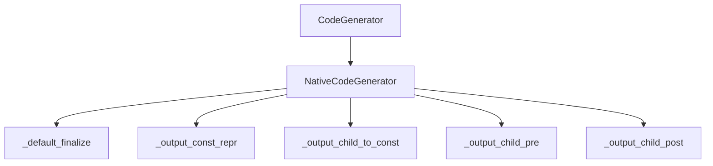
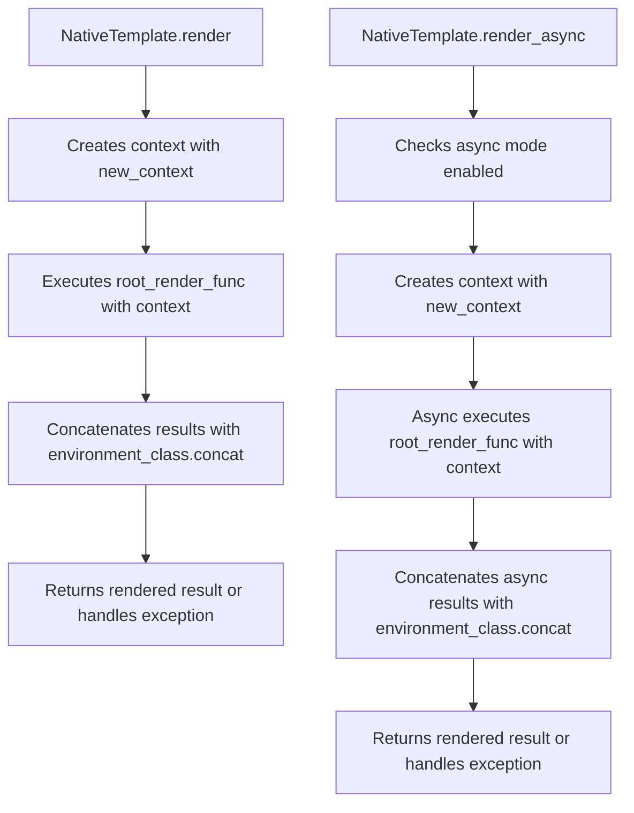

# `nativetypes.py`

## `src.jinja2.nativetypes.native_concat` · *function*

## Summary:
Concatenates iterable values and attempts to parse the result as a Python literal expression.

## Description:
Processes an iterable of values by joining them into a string and attempting to evaluate as a Python literal expression. This function is designed to safely handle mixed-type sequences while preserving the semantic meaning of Python literals when possible.

## Args:
    values (Iterable[Any]): An iterable of values to concatenate and potentially evaluate as Python literals.

## Returns:
    Optional[Any]: The evaluated Python literal if successful, otherwise the concatenated string representation of the values, or None if the input is empty.

## Raises:
    None explicitly raised, but may raise ValueError, SyntaxError, or MemoryError internally during literal evaluation.

## Constraints:
    Precondition: Input must be an iterable of any type.
    Postcondition: Returns either a parsed Python literal, the raw string representation, or None for empty inputs.

## Side Effects:
    None

## Control Flow:
```mermaid
flowchart TD
    A[Start native_concat] --> B{values empty?}
    B -- Yes --> C[Return None]
    B -- No --> D{len(head) == 1?}
    D -- Yes --> E{isinstance(raw, str)?}
    E -- Yes --> F[Return raw]
    E -- No --> G[Return raw]
    D -- No --> H{isinstance(values, GeneratorType)?}
    H -- Yes --> I[chain(head, values)]
    H -- No --> J[Use values directly]
    J --> K[Join all values as strings]
    K --> L[Try literal_eval(parse(raw, mode="eval"))]
    L --> M{Parse succeeds?}
    M -- Yes --> N[Return parsed result]
    M -- No --> O[Return raw]
```

## Examples:
    >>> native_concat([1, 2, 3])
    '123'
    
    >>> native_concat(['1', '2', '3'])
    '123'
    
    >>> native_concat(['[1, 2, 3]'])
    [1, 2, 3]
    
    >>> native_concat([])
    None
    
    >>> native_concat(['{"a": 1}'])
    {'a': 1}
```

## `src.jinja2.nativetypes.NativeCodeGenerator` · *class*

## Summary:
A specialized code generator for compiling Jinja2 templates that handles native Python types and expressions.

## Description:
The NativeCodeGenerator class extends the base CodeGenerator to provide specialized code generation capabilities for native Python types within Jinja2 templates. It is responsible for converting template expressions into appropriate Python code representations, particularly handling constant values and expressions that can be safely evaluated at compile time.

This class is typically instantiated by the Jinja2 template compilation system when generating Python bytecode from template source code. It provides implementations for various code generation hooks that control how different types of template expressions are compiled into executable Python code.

## State:
- Inherits all state from CodeGenerator parent class
- No additional instance attributes defined in this class
- All methods operate on the compilation context maintained by the parent class

## Lifecycle:
- Creation: Instantiated automatically by the Jinja2 template compilation system
- Usage: Called internally during template compilation process when generating Python code from template AST nodes
- Destruction: Managed by Python garbage collection when the compilation context is discarded

## Method Map:


## Raises:
- nodes.Impossible: Raised when attempting to convert a node with unsafe representation to a constant

## Example:
```python
# This class is typically used internally by Jinja2
# during template compilation, not directly instantiated by users

# Typical usage scenario:
# When a template contains expressions like {{ "hello" + "world" }},
# the NativeCodeGenerator would handle converting these to appropriate
# Python constant representations during compilation
```

### `src.jinja2.nativetypes.NativeCodeGenerator._default_finalize` · *method*

## Summary:
Returns the input value unchanged as a default finalization callback for code generation.

## Description:
A static method that serves as the default finalization callback in the NativeCodeGenerator class. This method is used during template compilation to provide a safe fallback when no custom finalization logic is specified for processing values in generated code. It simply returns the input value unchanged, making it suitable for cases where values don't require special processing.

This method is typically called as part of a callback mechanism through the `finalize.const()` interface, where it acts as the default implementation when no specialized finalization is needed.

## Args:
    value (Any): Any Python value that needs to be finalized during code generation.

## Returns:
    Any: The same value that was passed as input, unchanged.

## Raises:
    None: This method does not raise any exceptions.

## State Changes:
    None: This method is stateless and does not modify any object attributes.

## Constraints:
    Preconditions: The method accepts any Python value as input.
    Postconditions: The returned value is identical to the input value.

## Side Effects:
    None: This method performs no I/O operations or external service calls. It is a pure function that only processes and returns the input value.

### `src.jinja2.nativetypes.NativeCodeGenerator._output_const_repr` · *method*

## Summary:
Generates a quoted string representation of concatenated values for template constant expressions.

## Description:
Processes an iterable of values by converting each element to a string and joining them together, then returns the repr() of the resulting string. This method is used during Jinja2 template compilation to handle constant expressions by creating proper Python string representations of concatenated template constants.

## Args:
    group (Iterable[Any]): An iterable collection of values to be converted to strings and joined together.

## Returns:
    str: The repr() of the concatenated string formed by converting each element in group to a string and joining them.

## Raises:
    None explicitly raised by this method.

## State Changes:
    Attributes READ: None
    Attributes WRITTEN: None

## Constraints:
    Preconditions: The group parameter must be iterable and each element must be convertible to a string.
    Postconditions: The returned string is a valid Python repr() of the concatenated string.

## Side Effects:
    None

### `src.jinja2.nativetypes.NativeCodeGenerator._output_child_to_const` · *method*

## Summary:
Extracts and processes a constant value from an expression node with safety validation.

## Description:
Processes an expression node to extract its constant value, validates that the constant has a safe string representation, and applies appropriate finalization. This method is part of the NativeCodeGenerator class and is used during Jinja2 template compilation to handle constant expression evaluation in native code generation.

## Args:
    self: The NativeCodeGenerator instance
    node (nodes.Expr): The expression node to convert to a constant value
    frame (Frame): The evaluation frame containing context for node evaluation
    finalize (CodeGenerator._FinalizeInfo): Finalization information to apply to the constant

## Returns:
    Any: The constant value extracted from the node, either returned directly for TemplateData nodes or processed through finalization for other node types

## Raises:
    nodes.Impossible: When the constant value extracted from the node does not have a safe string representation

## State Changes:
    Attributes READ: None - this method only reads from parameters
    Attributes WRITTEN: None - this method doesn't modify instance state

## Constraints:
    Preconditions:
        - The node must be convertible to a constant via its as_const() method
        - The frame must provide a valid evaluation context
        - The finalize parameter must be a valid CodeGenerator._FinalizeInfo instance
    
    Postconditions:
        - If node is TemplateData, returns the raw constant value from node.as_const()
        - If node is not TemplateData, returns finalize.const(const) result where const is from node.as_const()
        - The returned constant must have a safe string representation

## Side Effects:
    None - This method performs no I/O operations or external service calls

### `src.jinja2.nativetypes.NativeCodeGenerator._output_child_pre` · *method*

## Summary:
Writes pre-computed source code to output when available during template compilation.

## Description:
This method conditionally outputs pre-computed source code during template compilation. It checks if finalized source code exists in the finalize information and writes it to the output stream when present. This method is part of the code generation pipeline for handling expression nodes in Jinja2 templates.

## Args:
    node (nodes.Expr): The expression node being processed during compilation.
    frame (Frame): Compilation frame context containing scope and variable information.
    finalize (CodeGenerator._FinalizeInfo): Finalization information containing pre-computed source code.

## Returns:
    None: This method performs I/O operations and does not return a value.

## Raises:
    None explicitly raised: The method doesn't raise exceptions directly.

## State Changes:
    Attributes READ: 
    - finalize.src: Source code to be written when not None
    
    Attributes WRITTEN:
    - None: This method doesn't modify instance attributes directly.

## Constraints:
    Preconditions:
    - finalize.src must be accessible (not raising AttributeError)
    - self.write() method must be callable
    
    Postconditions:
    - If finalize.src is not None, it is written to output via self.write()
    - If finalize.src is None, no write operation occurs

## Side Effects:
    I/O: Calls self.write() to output finalize.src when it is not None

### `src.jinja2.nativetypes.NativeCodeGenerator._output_child_post` · *method*

## Summary:
Writes a closing parenthesis to the output when finalize information requires it.

## Description:
This method performs post-processing during Jinja2 template code generation by writing a closing parenthesis character ")" to the output stream when the finalize information indicates that a closing parenthesis is needed. It's called as part of the expression compilation process to handle syntax elements that require balanced parentheses.

The method is symmetric with the `_output_child_pre` method which writes opening syntax elements, forming a matched pair for syntax handling during code generation.

## Args:
    node (nodes.Expr): The AST expression node currently being processed
    frame (Frame): Compilation frame containing evaluation context
    finalize (CodeGenerator._FinalizeInfo): Finalization information that determines formatting requirements

## Returns:
    None: This method performs I/O operations and returns no value

## Raises:
    None explicitly raised: The method doesn't contain explicit exception handling

## State Changes:
    Attributes READ: 
        - finalize.src (checked for None value to determine if closing paren is needed)
    Attributes WRITTEN:
        - Output stream managed by self.write() method (not directly tracked)

## Constraints:
    Preconditions:
        - The finalize parameter must be a valid CodeGenerator._FinalizeInfo instance
        - The node parameter must be a valid nodes.Expr instance
        - The frame parameter must be a valid Frame instance
    
    Postconditions:
        - When finalize.src is not None, a closing parenthesis is written to the output stream
        - The method does not modify internal object state beyond output operations

## Side Effects:
    I/O operations: Writes a closing parenthesis character to the output stream via self.write()

## `src.jinja2.nativetypes.NativeEnvironment` · *class*

## Summary:
A Jinja2 environment subclass that uses native code generation and specialized concatenation for template processing.

## Description:
`NativeEnvironment` extends the standard `Environment` class by overriding two key class attributes to provide alternative template compilation and value handling behavior. This environment is specifically designed for scenarios where native code generation offers performance benefits or when specialized value concatenation is required.

The class serves as a configuration point that changes how templates are compiled and rendered, making it suitable for optimized or specialized template processing workflows.

## State:
- `code_generator_class`: Class attribute set to `NativeCodeGenerator` - specifies the code generator to use when compiling templates into executable Python code
- `concat`: Class attribute set to `staticmethod(native_concat)` - specifies the function used to concatenate values during template rendering operations

## Lifecycle:
- Creation: Instantiated like any `Environment` subclass, typically through direct instantiation or via factory methods
- Usage: Used as a template environment for creating and rendering templates with native code generation and specialized concatenation
- Destruction: Inherits standard `Environment` cleanup behavior through the parent class

## Method Map:
```mermaid
flowchart TD
    A[NativeEnvironment.__init__] --> B[Sets code_generator_class to NativeCodeGenerator]
    B --> C[Sets concat to staticmethod(native_concat)]
    C --> D[Inherits Environment methods]
```

## Raises:
- No explicit exceptions raised in `__init__` as it only sets class attributes
- Inherited exceptions from `Environment` base class may be raised during normal usage

## Example:
```python
from jinja2.nativetypes import NativeEnvironment
from jinja2 import Template

# Create a native environment
env = NativeEnvironment()

# Create and render a template
template = env.from_string("Hello {{ name }}!")
result = template.render(name="World")
print(result)  # Output: Hello World!

# The environment uses native code generation and special concatenation
```

## `src.jinja2.nativetypes.NativeTemplate` · *class*

## Summary:
A Jinja2 template subclass that renders templates using NativeEnvironment's specialized compilation and concatenation mechanisms.

## Description:
The NativeTemplate class extends the standard Template class to integrate with NativeEnvironment for optimized template rendering. It provides synchronous and asynchronous rendering methods that leverage NativeEnvironment's native code generation and specialized value concatenation capabilities.

This template class is intended to be used with NativeEnvironment and should typically be created through NativeEnvironment's factory methods rather than direct instantiation.

## State:
- `environment_class`: Class attribute set to `NativeEnvironment` - determines the environment class used for template compilation and rendering
- Inherited attributes from `Template`: Includes template source, AST, compiled code, etc.

## Lifecycle:
- Creation: Typically created through NativeEnvironment's template creation methods (such as `from_string`)
- Usage: Rendered using `render()` for synchronous operations or `render_async()` for asynchronous operations
- Destruction: Inherits standard cleanup behavior from the parent Template class

## Method Map:


## Raises:
- `RuntimeError`: Raised by `render_async()` when the environment is not configured for async mode
- All exceptions raised by inherited methods (`new_context`, `root_render_func`) and environment methods (`handle_exception`)
- Any exceptions occurring during template execution are caught and handled by `environment.handle_exception()`

## Example:
```python
from jinja2.nativetypes import NativeEnvironment

# Create a native environment
env = NativeEnvironment()

# Create a template (creates a NativeTemplate instance)
template = env.from_string("Hello {{ name }}!")

# Render synchronously
result = template.render(name="World")
print(result)  # Output: Hello World!

# For async rendering (requires async environment setup)
# async_result = await template.render_async(name="World")
```

### `src.jinja2.nativetypes.NativeTemplate.render_async` · *method*

## Summary:
Asynchronously renders a Jinja2 template with the provided context data and returns the concatenated result.

## Description:
This method provides asynchronous template rendering capability for NativeTemplate instances. It validates that the environment is configured for async operation, creates a rendering context from the provided arguments, executes the template's root render function asynchronously, and concatenates the resulting values into a single output.

The method is designed to be called during the template rendering lifecycle when asynchronous execution is required, typically in async web frameworks or applications that need non-blocking template processing.

## Args:
    *args (t.Any): Positional arguments to be merged into the rendering context dictionary
    **kwargs (t.Any): Keyword arguments to be merged into the rendering context dictionary

## Returns:
    t.Any: The concatenated result of the template rendering process, typically a string containing the rendered template content

## Raises:
    RuntimeError: When the environment was not created with async mode enabled (environment.is_async is False)

## State Changes:
    Attributes READ: 
    - self.environment.is_async
    - self.environment_class
    - self.root_render_func
    - self.new_context
    - self.environment.handle_exception
    
    Attributes WRITTEN: None

## Constraints:
    Preconditions:
    - The environment must be initialized with async mode enabled (environment.is_async must be True)
    - The template must have a valid root_render_func method
    - The template must have a valid new_context method
    
    Postconditions:
    - Returns a properly concatenated result from template rendering
    - If an exception occurs during rendering, returns the result of environment.handle_exception()

## Side Effects:
    - May perform I/O operations during template rendering through the root_render_func
    - May call external functions during template processing
    - May raise exceptions that are handled internally by the environment

