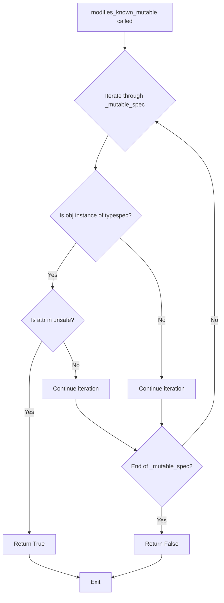

# `sandbox.py`

## `src.jinja2.sandbox.inspect_format_method` · *function*

## Summary:
Extracts the string object from a format or format_map method call for security inspection.

## Description:
Analyzes a callable to determine if it represents a string format or format_map method invocation. When identified, returns the string object being formatted; otherwise returns None. This function is used in Jinja2's sandbox security system to monitor and potentially restrict string formatting operations.

## Args:
    callable (typing.Callable): A callable object to inspect for format method identification.

## Returns:
    typing.Optional[str]: The string object if the callable is a format/format_map method bound to a string; otherwise None.

## Raises:
    None explicitly raised.

## Constraints:
    Preconditions:
    - The callable must be a method type (types.MethodType or types.BuiltinMethodType)
    - The callable's __name__ must be either "format" or "format_map"
    
    Postconditions:
    - Returns None for non-format methods or non-string objects
    - Returns the string object when conditions are met

## Side Effects:
    None.

## Control Flow:
```mermaid
flowchart TD
    A[Start inspect_format_method] --> B{Is callable MethodType?}
    B -- No --> C[Return None]
    B -- Yes --> D{Is callable.__name__ in ["format","format_map"]?}
    D -- No --> C
    D -- Yes --> E[Get callable.__self__]
    E --> F{Is __self__ instance of str?}
    F -- No --> C
    F -- Yes --> G[Return __self__]
```

## Examples:
```python
# Example 1: Valid string format method
text = "Hello {name}"
method = text.format
result = inspect_format_method(method)  # Returns "Hello {name}"

# Example 2: Invalid method
number = 42
method = number.__str__
result = inspect_format_method(method)  # Returns None

# Example 3: Non-format method
text = "test"
method = text.upper
result = inspect_format_method(method)  # Returns None
```

## `src.jinja2.sandbox.safe_range` · *function*

## Summary:
Creates a range object with size validation to prevent resource exhaustion attacks in sandboxed environments.

## Description:
This function serves as a secure wrapper around Python's built-in range() constructor. It validates that the resulting range object doesn't exceed a predefined maximum size (MAX_RANGE) to prevent potential denial-of-service attacks through excessively large ranges. The function is designed for use in sandboxed contexts where untrusted input might be processed.

## Args:
    *args (int): Variable arguments passed directly to the built-in range() function. These can be 1, 2, or 3 integers representing stop, start, and step parameters respectively.

## Returns:
    range: A range object with the specified parameters, provided its length doesn't exceed MAX_RANGE.

## Raises:
    OverflowError: When the length of the resulting range exceeds the MAX_RANGE constant, indicating the range is too large for safe execution in a sandboxed environment.

## Constraints:
    Preconditions:
    - All arguments must be integers compatible with the built-in range() function
    - The resulting range length must not exceed MAX_RANGE (security threshold)
    
    Postconditions:
    - Returns a valid range object with the same parameters as provided
    - The returned range object will have length <= MAX_RANGE

## Side Effects:
    None: This function has no side effects beyond creating and returning a range object.

## Control Flow:
```mermaid
flowchart TD
    A[Call safe_range with args] --> B{len(range(*args)) > MAX_RANGE?}
    B -- Yes --> C[Raise OverflowError]
    B -- No --> D[Return range(*args)]
```

## Examples:
```python
# Valid usage - creates a small range
small_range = safe_range(10)  # Returns range(0, 10)

# Valid usage - creates a range with start and stop
medium_range = safe_range(5, 15)  # Returns range(5, 15)

# Invalid usage - would raise OverflowError if range length exceeds MAX_RANGE
# large_range = safe_range(1000000)  # Would raise OverflowError if 1000000 > MAX_RANGE
```

## `src.jinja2.sandbox.unsafe` · *function*

## Summary:
Decorator that marks a callable as unsafe by setting its `unsafe_callable` attribute to `True`.

## Description:
The `unsafe` decorator is a simple utility function used in Jinja2's sandbox security system. When applied to a callable, it sets the `unsafe_callable` attribute to `True`, signaling to the sandbox that this function should bypass normal security restrictions.

This decorator implements the standard Python decorator pattern where a function is wrapped to modify the behavior of another function. It's used internally by Jinja2 to identify functions that are known to be safe but would otherwise be restricted by sandbox security policies.

## Args:
    f (F): A callable object (function, method, or other callable) to be marked as unsafe.
        The type `F` represents a generic callable type that can be any function-like object.

## Returns:
    F: The same callable object that was passed in, with the `unsafe_callable` attribute set to `True`.

## Raises:
    None: This function does not explicitly raise any exceptions.

## Constraints:
    Preconditions:
    - The input `f` must be a callable object (function, method, lambda, etc.)
    
    Postconditions:
    - The returned object is identical to the input `f`
    - The `unsafe_callable` attribute is set to `True` on the returned object

## Side Effects:
    None: This function has no side effects beyond modifying the attribute of the input callable.

## Control Flow:
```mermaid
flowchart TD
    A[unsafe(f) called] --> B[f.unsafe_callable = True]
    B --> C[return f]
```

## Examples:
```python
# Basic usage as a decorator
@unsafe
def my_function():
    pass

# Usage as a function call
def another_function():
    pass

unsafe(another_function)  # Marks another_function as unsafe
```

## `src.jinja2.sandbox.is_internal_attribute` · *function*

## Summary
Determines whether an attribute access should be blocked in a sandboxed environment based on object type and attribute name.

## Description
This function implements security checks to prevent access to potentially dangerous or internal attributes in a sandboxed Jinja2 environment. It evaluates both the type of object being accessed and the specific attribute name to determine if the access should be restricted.

The function serves as a core security mechanism in Jinja2's sandboxed execution environment, blocking access to implementation details that could enable code execution exploits or information disclosure. It specifically blocks access to:
- Unsafe attributes of function objects (defined in UNSAFE_FUNCTION_ATTRIBUTES)
- Unsafe attributes of method objects (defined in UNSAFE_FUNCTION_ATTRIBUTES and UNSAFE_METHOD_ATTRIBUTES)  
- The 'mro' attribute of type objects
- All attributes of code, traceback, and frame objects
- Unsafe attributes of generator objects (defined in UNSAFE_GENERATOR_ATTRIBUTES)
- Unsafe attributes of coroutine objects (defined in UNSAFE_COROUTINE_ATTRIBUTES)
- Unsafe attributes of async generator objects (defined in UNSAFE_ASYNC_GENERATOR_ATTRIBUTES)
- All private attributes (those starting with "__")

## Args
    obj (Any): The Python object whose attribute is being accessed
    attr (str): The name of the attribute being accessed

## Returns
    bool: True if the attribute access should be blocked (considered internal/unsafe), False otherwise

## Raises
    None explicitly raised

## Constraints
    Preconditions:
    - obj parameter can be any Python object
    - attr parameter must be a string representing an attribute name
    
    Postconditions:
    - Returns a boolean value indicating whether access should be blocked
    - The function handles all standard Python types appropriately
    - The fallback behavior blocks all attributes starting with "__"

## Side Effects
    None

## Control Flow
```mermaid
flowchart TD
    A[is_internal_attribute] --> B{obj is FunctionType?}
    B -- Yes --> C{attr in UNSAFE_FUNCTION_ATTRIBUTES?}
    C -- Yes --> D[return True]
    C -- No --> E[continue]
    B -- No --> F{obj is MethodType?}
    F -- Yes --> G{attr in UNSAFE_FUNCTION_ATTRIBUTES OR attr in UNSAFE_METHOD_ATTRIBUTES?}
    G -- Yes --> D
    G -- No --> E
    F -- No --> H{obj is type?}
    H -- Yes --> I{attr == "mro"?}
    I -- Yes --> D
    I -- No --> E
    H -- No --> J{obj is Code/Traceback/FrameType?}
    J -- Yes --> D
    J -- No --> K{obj is GeneratorType?}
    K -- Yes --> L{attr in UNSAFE_GENERATOR_ATTRIBUTES?}
    L -- Yes --> D
    L -- No --> E
    K -- No --> M{hasattr(types, "CoroutineType") AND obj is CoroutineType?}
    M -- Yes --> N{attr in UNSAFE_COROUTINE_ATTRIBUTES?}
    N -- Yes --> D
    N -- No --> E
    M -- No --> O{hasattr(types, "AsyncGeneratorType") AND obj is AsyncGeneratorType?}
    O -- Yes --> P{attr in UNSAFE_ASYNC_GENERATOR_ATTRIBUTES?}
    P -- Yes --> D
    P -- No --> E
    O -- No --> Q[attr.startswith("__")]
    Q -- Yes --> D
    Q -- No --> R[return False]
```

## Examples
    # Function with unsafe attribute access - blocks access to internal attributes
    def test_func(): pass
    is_internal_attribute(test_func, "__code__")  # Returns True (unsafe attribute)
    
    # Method with unsafe attribute access - blocks access to internal attributes  
    class TestClass:
        def method(self): pass
    obj = TestClass()
    is_internal_attribute(obj.method, "__func__")  # Returns True (unsafe attribute)
    
    # Regular object with private attribute - blocks access to private attributes
    class TestClass:
        def __init__(self): pass
    obj = TestClass()
    is_internal_attribute(obj, "__dict__")  # Returns True (private attribute)
    
    # Safe attribute access - allows access to normal attributes
    class TestClass:
        def __init__(self): pass
    obj = TestClass()
    is_internal_attribute(obj, "public_attr")  # Returns False (safe attribute)

## `src.jinja2.sandbox.modifies_known_mutable` · *function*

## Summary:
Checks if accessing a specific attribute on an object would modify a known mutable type in a potentially unsafe manner according to Jinja2's security specifications.

## Description:
This function is a core component of Jinja2's sandbox security system that determines whether a particular attribute access on mutable objects could result in unauthorized modifications. It evaluates whether the specified attribute operation on the given object is considered unsafe based on predefined security specifications.

The function is designed to be used in security-sensitive contexts where template code must be restricted from performing potentially harmful operations on mutable objects. By extracting this logic into a separate function, Jinja2 maintains clean separation between security decision-making and execution flow.

## Args:
    obj (Any): The object whose attribute access is being evaluated for security compliance
    attr (str): The name of the attribute being accessed on the object

## Returns:
    bool: True if accessing the specified attribute on the object would modify a known mutable type in an unsafe way, False otherwise

## Raises:
    None: This function does not explicitly raise exceptions

## Constraints:
    Preconditions:
    - The `obj` parameter must be a valid Python object
    - The `attr` parameter must be a string representing a valid attribute name
    
    Postconditions:
    - Returns a boolean value indicating the security status of the attribute access
    - The function does not modify either input parameter
    - The function operates purely on the type and attribute information of the inputs

## Side Effects:
    None: This function has no side effects beyond evaluating the input parameters

## Control Flow:


## Examples:
```python
# Example usage in sandbox security checking
# This would return True if accessing 'append' on a list is unsafe
result = modifies_known_mutable([1, 2, 3], 'append')

# This would return False if accessing 'size' on a list is safe
result = modifies_known_mutable([1, 2, 3], 'size')

# This would return False for immutable types regardless of attribute
result = modifies_known_mutable("hello", "upper")
```

## `src.jinja2.sandbox.SandboxedEnvironment` · *class*

## Summary:
A Jinja2 environment implementation that provides a secure sandboxed execution context by restricting access to potentially dangerous operations and attributes.

## Description:
SandboxedEnvironment is a subclass of Environment designed to provide a secure execution context for template rendering. It prevents access to internal attributes, unsafe callable objects, and potentially dangerous operations that could lead to code execution exploits or information disclosure. This environment is particularly useful when rendering templates with untrusted input or user-generated content.

The class implements various security checks through overridden methods like `is_safe_attribute`, `is_safe_callable`, `getitem`, and `getattr`. It also provides controlled access to binary and unary operations through configurable operation tables, and ensures safe string formatting and method invocation.

## State:
- `sandboxed`: Class attribute set to True, indicating this is a sandboxed environment
- `default_binop_table`: Dictionary mapping binary operators to safe implementations from the operator module
- `default_unop_table`: Dictionary mapping unary operators to safe implementations from the operator module  
- `intercepted_binops`: Frozen set of binary operators that are intercepted (defaults to empty set)
- `intercepted_unops`: Frozen set of unary operators that are intercepted (defaults to empty set)
- `binop_table`: Instance copy of default_binop_table that can be customized
- `unop_table`: Instance copy of default_unop_table that can be customized
- `globals`: Inherited from Environment, contains global variables including the safe_range function

## Lifecycle:
- Creation: Instantiate with standard Environment constructor arguments; automatically registers safe_range in globals
- Usage: Templates are rendered using standard Environment methods, but with enhanced security checks applied
- Destruction: Cleanup handled by parent Environment class

## Method Map:
```mermaid
flowchart TD
    A[SandboxedEnvironment.__init__] --> B[super().__init__()]
    B --> C[self.globals["range"] = safe_range]
    C --> D[self.binop_table = self.default_binop_table.copy()]
    D --> E[self.unop_table = self.default_unop_table.copy()]
    
    A --> F[call_binop] --> G[binop_table lookup]
    F --> H[binop_table[operator](left, right)]
    
    A --> I[call_unop] --> J[unop_table lookup]
    I --> K[unop_table[operator](arg)]
    
    A --> L[getitem] --> M[try obj[argument]]
    L --> N{exception?}
    N -->|Yes| O[try getattr(obj, str(argument))]
    O --> P{is_safe_attribute?}
    P -->|Yes| Q[return value]
    P -->|No| R[return unsafe_undefined]
    N -->|No| S[return obj[argument]]
    
    A --> T[getattr] --> U[try getattr(obj, attribute)]
    T --> V{exception?}
    V -->|Yes| W[try obj[attribute]]
    W --> X{exception?}
    X -->|Yes| Y[return undefined]
    X -->|No| Z[return obj[attribute]]
    V -->|No| AA{is_safe_attribute?}
    AA -->|Yes| AB[return value]
    AA -->|No| AC[return unsafe_undefined]
    
    A --> AD[call] --> AE[inspect_format_method]
    AD --> AF{fmt is not None?}
    AF -->|Yes| AG[format_string]
    AF -->|No| AH[is_safe_callable]
    AH --> AI{not safe?}
    AI -->|Yes| AJ[raise SecurityError]
    AI -->|No| AK[context.call(__obj, *args, **kwargs)]
```

## Raises:
- SecurityError: Raised by `call` method when attempting to invoke unsafe callable objects, and by `unsafe_undefined` when accessing unsafe attributes
- TypeError: Raised by `format_string` method when `format_map` is called with invalid arguments
- OverflowError: Raised by `safe_range` when range size exceeds security limits (inherited from safe_range)

## Example:
```python
from jinja2.sandbox import SandboxedEnvironment

# Create a sandboxed environment
env = SandboxedEnvironment()

# Render a template (safe)
template = env.from_string("Hello {{ name }}!")
result = template.render(name="World")  # Returns "Hello World!"

# Attempting to access unsafe attributes will be blocked
class TestClass:
    def __init__(self):
        self.public_attr = "safe"
        self._private_attr = "unsafe"

obj = TestClass()
template = env.from_string("{{ obj.public_attr }} {{ obj._private_attr }}")
result = template.render(obj=obj)  # Will render "safe" and undefined for private attr
```

### `src.jinja2.sandbox.SandboxedEnvironment.__init__` · *method*

## Summary:
Initializes a SandboxedEnvironment instance with security restrictions and safe global functions.

## Description:
Configures a Jinja2 environment with enhanced security measures by replacing dangerous built-in functions with safe alternatives and establishing restricted operation tables. This method ensures that template rendering occurs in a controlled environment that prevents potentially harmful operations.

## Args:
    *args (Any): Positional arguments passed to the parent Environment.__init__ method
    **kwargs (Any): Keyword arguments passed to the parent Environment.__init__ method

## Returns:
    None: This method initializes the object in-place and does not return a value

## Raises:
    None: This method does not explicitly raise exceptions beyond those potentially raised by the parent class initialization

## State Changes:
    Attributes READ:
    - self.default_binop_table
    - self.default_unop_table
    
    Attributes WRITTEN:
    - self.globals["range"]
    - self.binop_table
    - self.unop_table

## Constraints:
    Preconditions:
    - The parent Environment class must be properly initialized
    - The default_binop_table and default_unop_table attributes must exist on the instance
    
    Postconditions:
    - The globals dictionary contains a safe_range function under the "range" key
    - The binop_table and unop_table are copies of their default counterparts
    - The environment is configured for sandboxed operation

## Side Effects:
    None: This method only modifies internal state attributes of the object and does not perform I/O or external service calls

### `src.jinja2.sandbox.SandboxedEnvironment.is_safe_attribute` · *method*

## Summary
Determines whether an attribute access is permitted in a sandboxed environment by checking if the attribute is either private (starts with underscore) or considered internal/unsafe.

## Description
This method implements a core security check in Jinja2's sandboxed environment to prevent access to potentially dangerous or internal attributes. It evaluates whether an attribute access should be allowed based on two criteria: 
1. Whether the attribute name starts with an underscore (private attributes)
2. Whether the attribute is classified as internal/unsafe by the `is_internal_attribute` function

The method is called during attribute access operations in sandboxed templates to enforce security boundaries and prevent unauthorized access to implementation details that could lead to code execution exploits or information disclosure.

## Args
    obj (Any): The Python object whose attribute is being accessed
    attr (str): The name of the attribute being accessed
    value (Any): The value that would be assigned to the attribute (unused in current implementation)

## Returns
    bool: True if the attribute access is considered safe (permitted), False if it should be blocked

## Raises
    None explicitly raised

## State Changes
    Attributes READ: None
    Attributes WRITTEN: None

## Constraints
    Preconditions:
    - obj parameter can be any Python object
    - attr parameter must be a string representing an attribute name
    - value parameter can be any Python value (though currently unused in logic)
    
    Postconditions:
    - Returns a boolean value indicating whether the attribute access should be permitted
    - The method does not modify any object state

## Side Effects
    None

### `src.jinja2.sandbox.SandboxedEnvironment.is_safe_callable` · *method*

## Summary:
Determines whether a callable object is safe to execute within a sandboxed environment by checking for unsafe attributes.

## Description:
Checks if a callable object can be safely invoked in a sandboxed Jinja2 environment. This method examines two specific attributes on the object: "unsafe_callable" and "alters_data". If either attribute exists and evaluates to True, the object is considered unsafe for execution. This method is used by the sandbox security system to prevent execution of potentially dangerous callables.

The method is called during template rendering when attempting to execute callable objects, ensuring that only trusted functions and methods are invoked within the restricted environment.

## Args:
    obj (Any): The callable object to check for safety

## Returns:
    bool: True if the object is considered safe to call, False otherwise

## Raises:
    None explicitly raised

## State Changes:
    Attributes READ: None
    Attributes WRITTEN: None

## Constraints:
    Preconditions:
    - The object may be any Python object, though typically used with callable objects
    - The object should support attribute access via getattr()
    
    Postconditions:
    - Returns a boolean indicating the safety status of the callable
    - Does not modify the input object or environment state

## Side Effects:
    None directly observable. The method performs attribute access but does not mutate any objects or trigger external operations.

### `src.jinja2.sandbox.SandboxedEnvironment.call_binop` · *method*

## Summary:
Executes a binary operation on two operands using a predefined operator table within the sandboxed environment.

## Description:
This method serves as a secure interface for performing binary operations in a sandboxed Jinja2 environment. It retrieves the appropriate operation function from the environment's binary operation table using the provided operator string, then applies that function to the left and right operands. This design ensures that only explicitly allowed binary operations can be executed, providing security isolation in the sandboxed context.

The method is typically invoked during template compilation and execution when binary operators (like +, -, *, /) appear in expressions within templates. It acts as a bridge between the template's operator syntax and the underlying Python operations, while maintaining the security restrictions imposed by the SandboxedEnvironment.

## Args:
    context (Context): The Jinja2 rendering context, providing access to template variables and execution state
    operator (str): The string representation of the binary operator to execute (e.g., '+', '-', '*', '/')
    left (Any): The left operand for the binary operation
    right (Any): The right operand for the binary operation

## Returns:
    Any: The result of applying the binary operation to the left and right operands

## Raises:
    KeyError: When the specified operator is not found in the binop_table, causing a lookup failure
    TypeError: When the operands are incompatible with the operation function
    Exception: When the operation function itself raises an exception during execution

## State Changes:
    Attributes READ: 
    - self.binop_table: Accesses the mapping of operator strings to operation functions
    Attributes WRITTEN: None

## Constraints:
    Preconditions:
    - The operator parameter must be a key present in self.binop_table
    - The operands must be compatible with the operation function associated with the operator
    - The context parameter must be a valid Jinja2 Context instance
    
    Postconditions:
    - The method returns the result of applying the binary operation to the operands
    - No modifications are made to the SandboxedEnvironment instance state

## Side Effects:
    - May raise exceptions if the operator is not supported or operands are incompatible
    - Invokes operation functions from the binop_table which may have side effects
    - No direct I/O operations or external service calls

### `src.jinja2.sandbox.SandboxedEnvironment.call_unop` · *method*

## Summary:
Executes a unary operation on an argument using a predefined operator table within the sandboxed environment.

## Description:
This method serves as a secure interface for performing unary operations in a sandboxed Jinja2 environment. It retrieves the appropriate operation function from the environment's unary operation table using the provided operator string, then applies that function to the argument. This design ensures that only explicitly allowed unary operations can be executed, providing security isolation in the sandboxed context.

The method is typically invoked during template compilation and execution when unary operators (like +, -) appear in expressions within templates. It acts as a bridge between the template's operator syntax and the underlying Python operations, while maintaining the security restrictions imposed by the SandboxedEnvironment.

## Args:
    context (Context): The Jinja2 rendering context, providing access to template variables and execution state
    operator (str): The string representation of the unary operator to execute (e.g., '+', '-')
    arg (Any): The argument to apply the unary operation to

## Returns:
    Any: The result of applying the unary operation to the argument

## Raises:
    KeyError: When the specified operator is not found in the unop_table, causing a lookup failure
    TypeError: When the argument is incompatible with the operation function
    Exception: When the operation function itself raises an exception during execution

## State Changes:
    Attributes READ: 
    - self.unop_table: Accesses the mapping of operator strings to operation functions
    Attributes WRITTEN: None

## Constraints:
    Preconditions:
    - The operator parameter must be a key present in self.unop_table
    - The argument must be compatible with the operation function associated with the operator
    - The context parameter must be a valid Jinja2 Context instance
    
    Postconditions:
    - The method returns the result of applying the unary operation to the argument
    - No modifications are made to the SandboxedEnvironment instance state

## Side Effects:
    - May raise exceptions if the operator is not supported or argument is incompatible
    - Invokes operation functions from the unop_table which may have side effects
    - No direct I/O operations or external service calls

### `src.jinja2.sandbox.SandboxedEnvironment.getitem` · *method*

## Summary
Retrieves an item or attribute from an object with secure fallback mechanisms, prioritizing item access over attribute access while enforcing security restrictions.

## Description
The `getitem` method provides a secure way to access elements from objects in a sandboxed environment. It first attempts to access the object using the provided argument as an index/key. If this fails with TypeError or LookupError, it falls back to attribute access when the argument is a string. During attribute access, it enforces security checks to ensure the attribute access is safe according to the sandbox's security policies.

This method is designed to be used in template rendering contexts where untrusted user input might be used for attribute/item access, ensuring that potentially dangerous operations are prevented while still allowing legitimate access patterns.

## Args
- obj (Any): The object from which to retrieve the item or attribute
- argument (Union[str, Any]): The key/index to access, or attribute name if accessing as attribute

## Returns
- Union[Any, Undefined]: The retrieved value if successful, or an Undefined object if access fails or is deemed unsafe. Returns a regular Undefined for general failures, or an unsafe Undefined when attribute access is detected but deemed unsafe.

## Raises
- None: This method does not explicitly raise exceptions, though underlying operations may raise exceptions that are caught internally

## State Changes
- Attributes READ: self.is_safe_attribute, self.unsafe_undefined, self.undefined
- Attributes WRITTEN: None - this method does not modify instance state

## Constraints
- Preconditions: The method assumes that `self` is a SandboxedEnvironment instance with the required methods available
- Postconditions: Returns either a valid value from the object or an Undefined instance representing failed access

## Side Effects
- None: This method has no side effects beyond the internal operations of retrieving values or creating Undefined instances

## Behavior Details
1. First attempts `obj[argument]` - if successful, returns the result
2. If TypeError or LookupError occurs during item access, and argument is a string:
   a. Converts argument to string (if possible)
   b. Attempts `getattr(obj, str(argument))`
   c. If getattr succeeds, checks `self.is_safe_attribute(obj, argument, value)`:
      - If safe, returns the attribute value
      - If unsafe, returns `self.unsafe_undefined(obj, argument)`
3. If all access attempts fail, returns `self.undefined(obj=obj, name=argument)`

## Implementation Details
- Catches specific exceptions: TypeError and LookupError when attempting item access
- Only attempts attribute access for string arguments
- Uses `self.is_safe_attribute()` to validate attribute access security
- Creates appropriate Undefined instances based on the failure scenario

### `src.jinja2.sandbox.SandboxedEnvironment.getattr` · *method*

## Summary
Retrieves an attribute from an object while enforcing security restrictions in the sandboxed environment.

## Description
This method provides a secure way to access object attributes by first attempting to retrieve them using Python's built-in `getattr()` function. If that fails due to an `AttributeError`, it tries dictionary-style access using the object's `__getitem__` method. The method enforces security by checking if the attribute access is safe before returning the value, falling back to creating an undefined object if access is deemed unsafe.

The method implements a three-stage lookup process:
1. Try standard attribute access with `getattr()`
2. If that fails with AttributeError, try dictionary-style access with `obj[attribute]`
3. If neither succeeds, return an undefined object

This method is part of the sandboxing mechanism that prevents templates from accessing potentially dangerous attributes or methods that could compromise security. It's designed to be called internally by the Jinja2 templating engine during attribute access operations.

## Args
- obj (Any): The object from which to retrieve the attribute
- attribute (str): The name of the attribute to retrieve

## Returns
- Union[Any, Undefined]: The retrieved attribute value if it's safe to access, otherwise an Undefined object representing the failed access

## Raises
- None: This method doesn't explicitly raise exceptions, though underlying operations may raise exceptions that are caught and handled internally

## State Changes
- Attributes READ: self.is_safe_attribute, self.unsafe_undefined, self.undefined
- Attributes WRITTEN: None - this method doesn't modify any instance attributes

## Constraints
- Preconditions: The `obj` parameter must be a valid Python object and `attribute` must be a string
- Postconditions: Returns either the attribute value (if safe) or an Undefined object (if unsafe or not found)

## Side Effects
- None: This method performs no I/O operations or external service calls
- The method may create and return Undefined objects but doesn't mutate any external state

### `src.jinja2.sandbox.SandboxedEnvironment.unsafe_undefined` · *method*

## Summary
Creates and returns an Undefined object representing an unsafe attribute access in a sandboxed environment, configured to raise SecurityError upon evaluation.

## Description
This method generates an Undefined object with a descriptive error message indicating that access to a specific attribute of an object is unsafe, and configures it to raise a SecurityError when evaluated. It is invoked by the SandboxedEnvironment's getattr() and getitem() methods when attribute access is detected but determined to be unsafe according to the sandbox's security policies.

The method serves as a critical security mechanism in Jinja2's sandboxed environment, preventing templates from accessing potentially dangerous attributes or methods that could compromise system security. When called, it creates an Undefined instance that will raise a SecurityError with a descriptive message when the undefined value is actually used in template rendering.

This method exists specifically to provide a centralized way to handle unsafe attribute access while maintaining consistent error messaging and security enforcement throughout the sandboxed environment.

## Args
- obj (Any): The object whose attribute access is being restricted
- attribute (str): The name of the attribute that cannot be safely accessed

## Returns
- Undefined: An Undefined object configured to raise SecurityError when evaluated, containing information about the unsafe attribute access including the object type, attribute name, and security context

## Raises
- None: This method does not raise exceptions directly, but the returned Undefined object will raise SecurityError when accessed

## State Changes
- Attributes READ: self.undefined (method used to create Undefined instance)
- Attributes WRITTEN: None - this method doesn't modify any instance attributes

## Constraints
- Preconditions: The method assumes that `self` is a SandboxedEnvironment instance with the `undefined` method available
- Postconditions: Returns an Undefined object properly configured with the security error context and appropriate error message

## Side Effects
- None: This method performs no I/O operations or external service calls
- The method creates and returns an Undefined object but doesn't mutate any external state

### `src.jinja2.sandbox.SandboxedEnvironment.format_string` · *method*

## Summary:
Formats a string using a sandboxed formatter that prevents unsafe attribute and item access while maintaining compatibility with standard Python string formatting.

## Description:
This method provides secure string formatting within a sandboxed environment by selecting the appropriate formatter based on the input string type. It handles both regular strings and Markup objects (from markupsafe) with specialized formatters that ensure safe attribute and item access through the Jinja2 Environment's security mechanisms.

The method specifically handles the `format_map` function case by validating argument counts and restructuring the arguments appropriately before delegation to the formatter's `vformat` method. The result preserves the input string's type through conversion using `type(s)(rv)`.

## Args:
    s (str): The format string to be processed, which may be a regular string or a Markup object
    args (tuple): Positional arguments to be passed to the formatter
    kwargs (dict): Keyword arguments to be passed to the formatter  
    format_func (callable, optional): A function reference that may indicate special formatting behavior (specifically for format_map)

## Returns:
    str: The formatted string with the same type as the input string `s`

## Raises:
    TypeError: When `format_map()` is called with incorrect argument count (must be exactly one argument)

## State Changes:
    Attributes READ: None
    Attributes WRITTEN: None

## Constraints:
    Preconditions:
    - The `s` parameter must be a string-like object (str or Markup)
    - If `format_func` is provided and named "format_map", it must be callable
    - Arguments must be compatible with string formatting operations
    
    Postconditions:
    - The returned string maintains the same type as the input string `s`
    - All attribute and item access follows the sandboxed environment's security rules
    - The formatting result is properly escaped when dealing with Markup objects

## Side Effects:
    None

### `src.jinja2.sandbox.SandboxedEnvironment.call` · *method*

## Summary:
Calls an object with the given arguments and keyword arguments, applying sandbox security restrictions.

## Description:
This method provides a secure way to invoke objects within a sandboxed Jinja2 environment. It first attempts to handle string formatting operations specially for security inspection, then validates that the object is safely callable before executing it. This method serves as the primary entry point for executing functions and methods in the sandboxed environment.

## Args:
    __self (SandboxedEnvironment): The SandboxedEnvironment instance (first parameter due to method binding)
    __context (Context): The execution context for the call
    __obj (Any): The callable object to invoke
    *args (Any): Positional arguments to pass to the callable
    **kwargs (Any): Keyword arguments to pass to the callable

## Returns:
    Any: The result of calling the object with the provided arguments

## Raises:
    SecurityError: When the object is not considered "safely callable" according to the sandbox security policy

## State Changes:
    Attributes READ: None
    Attributes WRITTEN: None

## Constraints:
    Preconditions:
    - The object must be callable
    - If the object is a string format method, it must be properly formatted
    - The environment must be properly initialized
    
    Postconditions:
    - If the object is a string format method, the result is returned via format_string
    - If the object is not safely callable, SecurityError is raised
    - Otherwise, the object is called with the provided arguments and the result returned

## Side Effects:
    None directly observable. However, the underlying call operation may have side effects depending on the callable being invoked.

## `src.jinja2.sandbox.ImmutableSandboxedEnvironment` · *class*

## Summary:
An extension of SandboxedEnvironment that provides additional security by preventing modification of mutable objects through attribute access.

## Description:
ImmutableSandboxedEnvironment is a specialized Jinja2 environment that builds upon SandboxedEnvironment's security features to prevent potentially dangerous attribute modifications on mutable objects. While SandboxedEnvironment already restricts access to unsafe attributes and operations, this class adds an extra layer of protection by ensuring that attribute access patterns that could modify mutable objects (like lists, dicts, sets) are blocked.

This environment is particularly useful when rendering templates that might be exposed to untrusted input, where you want to guarantee that template code cannot mutate existing mutable objects in the template context, even if those mutations wouldn't be directly executable.

## State:
- Inherits all state from SandboxedEnvironment including:
  - `sandboxed`: Boolean flag indicating this is a sandboxed environment
  - `default_binop_table` and `default_unop_table`: Safe operator mappings
  - `binop_table` and `unop_table`: Instance copies of operator tables
  - `globals`: Global variables including safe_range
- No additional instance attributes beyond those inherited from parent class

## Lifecycle:
- Creation: Instantiate with standard Environment constructor arguments, similar to SandboxedEnvironment
- Usage: Templates are rendered using standard Environment methods, but with enhanced security checks
- Destruction: Cleanup handled by parent Environment class

## Method Map:
```mermaid
flowchart TD
    A[ImmutableSandboxedEnvironment.__init__] --> B[super().__init__()]
    B --> C[Inherits all SandboxedEnvironment setup]
    
    A --> D[is_safe_attribute override] --> E[super().is_safe_attribute()]
    E --> F{Returns False?}
    F -->|Yes| G[Return False]
    F -->|No| H[modifies_known_mutable(obj, attr)]
    H --> I{Returns True?}
    I -->|Yes| J[Return False]
    I -->|No| K[Return True]
```

## Raises:
- SecurityError: Inherited from SandboxedEnvironment, raised when attempting to access unsafe attributes or call unsafe functions
- TypeError: Inherited from SandboxedEnvironment, raised during unsafe operations
- OverflowError: Inherited from SandboxedEnvironment, raised by safe_range when range size exceeds limits

## Example:
```python
from jinja2.sandbox import ImmutableSandboxedEnvironment

# Create an immutable sandboxed environment
env = ImmutableSandboxedEnvironment()

# Define an object with mutable attributes
data = {
    'items': [1, 2, 3],
    'name': 'test'
}

# Template that tries to access potentially unsafe attributes
template = env.from_string("{{ data.items }} {{ data.items.append(4) }}")

# This will raise SecurityError because append() modifies the mutable list
try:
    result = template.render(data=data)
except SecurityError:
    print("Access blocked due to potential mutation")

# This works fine because accessing the list itself is safe
template2 = env.from_string("{{ data.items }}")
result2 = template2.render(data=data)  # Returns "[1, 2, 3]"
```

### `src.jinja2.sandbox.ImmutableSandboxedEnvironment.is_safe_attribute` · *method*

## Summary
Determines whether accessing a specific attribute on an object is safe within the immutable sandbox environment by combining parent security checks with additional mutable type protection.

## Description
This method extends the security validation logic of the parent `SandboxedEnvironment` class by adding an extra layer of protection against potentially dangerous attribute access on mutable objects. It first delegates to the parent's `is_safe_attribute` method to perform standard security checks, then applies additional validation to prevent modifications to known mutable types through attribute access.

The method is crucial for maintaining the integrity of the immutable sandbox by preventing template code from accessing attributes that could lead to unauthorized modifications of mutable objects like lists, dictionaries, or other container types.

## Args
- obj (Any): The object whose attribute access is being evaluated for security compliance
- attr (str): The name of the attribute being accessed on the object  
- value (Any): The value that would result from accessing the attribute

## Returns
- bool: True if the attribute access is considered safe within the immutable sandbox context, False otherwise

## Raises
- None: This method does not explicitly raise exceptions

## State Changes
- Attributes READ: None - this method only reads input parameters
- Attributes WRITTEN: None - this method does not modify any instance attributes

## Constraints
- Preconditions: All arguments must be valid Python objects with appropriate types
- Postconditions: Returns a boolean value indicating the security status of the attribute access

## Side Effects
- None: This method has no side effects beyond evaluating the input parameters

## `src.jinja2.sandbox.SandboxedFormatter` · *class*

## Summary:
A secure string formatter that provides sandboxed access to object attributes and items through a Jinja2 Environment.

## Description:
The SandboxedFormatter extends Python's standard string.Formatter to provide secure attribute and item access when formatting strings. Instead of using direct attribute access (obj.attr) or item access (obj[key]), it leverages the Jinja2 Environment's safe getattr() and getitem() methods to prevent potentially dangerous access patterns that could lead to security vulnerabilities.

This formatter is particularly useful in template systems where user-provided format strings might contain unsafe field references that could expose internal object internals or execute unintended operations. It ensures that attribute and item access follows the security model defined by the Jinja2 Environment.

## State:
- `_env`: Environment instance used for secure attribute and item access. Type: Environment. Required parameter during initialization.
- All other state is inherited from the parent string.Formatter class.

## Lifecycle:
- Creation: Instantiate with an Environment object and optional keyword arguments for the parent string.Formatter class
- Usage: Call standard Formatter methods like format() or format_field() which internally invoke get_field()
- Destruction: No special cleanup required; relies on Python's garbage collection

## Method Map:
```mermaid
graph TD
    A[format()] --> B[format_field()]
    B --> C[get_field()]
    C --> D[get_value()]
    C --> E[_env.getattr()]
    C --> F[_env.getitem()]
```

## Raises:
- TypeError: If the Environment parameter is not provided or is not of the correct type
- Any exceptions that might be raised by the parent string.Formatter class during normal operation

## Example:
```python
from jinja2 import Environment
from jinja2.sandbox import SandboxedFormatter

# Create environment and formatter
env = Environment()
formatter = SandboxedFormatter(env)

# Format a string with secure attribute access
data = {'name': 'John', 'age': 30}
result = formatter.format("Hello {name}, you are {age} years old", **data)
print(result)  # Output: "Hello John, you are 30 years old"

# With nested access (using environment's safe getattr/getitem)
class Person:
    def __init__(self, name):
        self.name = name
        self.address = {'city': 'New York'}

person = Person('Alice')
result2 = formatter.format("Hello {name}, you live in {address.city}", person)
print(result2)  # Output: "Hello Alice, you live in New York"
```

### `src.jinja2.sandbox.SandboxedFormatter.get_field` · *method*

## Summary:
Parses a formatted field name and retrieves the corresponding value through sandboxed attribute/item access, maintaining security boundaries.

## Description:
This method implements field name parsing for Jinja2's sandboxed formatter, handling complex field references that may contain nested attribute access (like "user.name") or item access (like "data[0]"). It splits the field name using Python's standard `formatter_field_name_split` function and safely retrieves values through the sandboxed environment's getattr/getitem methods.

Called during template formatting when processing format strings, this method ensures that field access follows Jinja2's security model by delegating to the environment's safe attribute/item access methods rather than allowing arbitrary Python attribute access.

## Args:
    field_name (str): The field name to parse, potentially containing nested access patterns (e.g., "user.name" or "data[0].value")
    args (Sequence[Any]): Positional arguments passed to the formatter
    kwargs (Mapping[str, Any]): Keyword arguments passed to the formatter

## Returns:
    Tuple[Any, str]: A tuple containing (retrieved_object, first_component) where:
        - retrieved_object is the value found by traversing all field name components
        - first_component is the first part of the parsed field name (before any nested access)

## Raises:
    None explicitly documented - depends on underlying implementations of get_value, getattr, and getitem

## State Changes:
    Attributes READ: self._env
    Attributes WRITTEN: None

## Constraints:
    Preconditions: 
    - field_name must be a valid string
    - args must be a sequence
    - kwargs must be a mapping
    - self._env must be initialized
    
    Postconditions:
    - Returns a tuple with the retrieved object and the first field component
    - The returned object is accessed according to sandbox security rules
    - Field name parsing follows Python's standard formatter field name conventions

## Side Effects:
    None directly - delegates to other methods that may have side effects

## `src.jinja2.sandbox.SandboxedEscapeFormatter` · *class*

## Summary:
A secure string formatter that combines sandboxed attribute/item access with HTML escaping capabilities.

## Description:
The SandboxedEscapeFormatter is a hybrid formatter that inherits from both SandboxedFormatter and EscapeFormatter. It provides secure attribute and item access through a Jinja2 Environment while also applying HTML escaping to formatted values. This dual functionality makes it suitable for safely rendering user-provided templates that may contain untrusted data.

This class serves as a bridge between secure template processing (via SandboxedFormatter) and safe HTML output (via EscapeFormatter), ensuring that both attribute access and rendered content are properly secured.

## State:
- `_env`: Environment instance used for secure attribute and item access. Type: Environment. Required parameter during initialization.
- Inherits all other state from the parent string.Formatter class
- All state is inherited from SandboxedFormatter (which itself inherits from string.Formatter)

## Lifecycle:
- Creation: Instantiate with an Environment object and optional keyword arguments for the parent string.Formatter class
- Usage: Call standard Formatter methods like format() or format_field() which internally handle both secure access and escaping
- Destruction: No special cleanup required; relies on Python's garbage collection

## Method Map:
```mermaid
graph TD
    A[format()] --> B[format_field()]
    B --> C[get_field()]
    C --> D[get_value()]
    C --> E[_env.getattr()]
    C --> F[_env.getitem()]
```

## Raises:
- TypeError: If the Environment parameter is not provided or is not of the correct type
- Any exceptions that might be raised by the parent formatters during normal operation

## Example:
```python
from jinja2 import Environment
from jinja2.sandbox import SandboxedEscapeFormatter

# Create environment and formatter
env = Environment()
formatter = SandboxedEscapeFormatter(env)

# Format a string with secure attribute access and HTML escaping
data = {'name': '<script>alert("xss")</script>', 'age': 30}
result = formatter.format("Hello {name}, you are {age} years old", **data)
print(result)  # Output: "Hello &lt;script&gt;alert(&quot;xss&quot;)&lt;/script&gt;, you are 30 years old"

# With nested access (using environment's safe getattr/getitem)
class Person:
    def __init__(self, name):
        self.name = name
        self.address = {'city': '<b>New York</b>'}

person = Person('Alice')
result2 = formatter.format("Hello {name}, you live in {address.city}", person)
print(result2)  # Output: "Hello Alice, you live in &lt;b&gt;New York&lt;/b&gt;"
```

