# `tests.py`

## `src.jinja2.tests.test_odd` · *function*

## Summary:
Determines whether an integer value is odd by checking if it has a remainder of 1 when divided by 2.

## Description:
This function implements a basic odd-number test that evaluates whether a given integer is odd. It's designed to work with integer values and returns True for odd numbers and False for even numbers. The function is typically used in Jinja2 template testing contexts where conditional logic needs to distinguish between odd and even integers.

## Args:
    value (int): An integer value to test for oddness. Must be a whole number.

## Returns:
    bool: True if the value is odd (remainder 1 when divided by 2), False if the value is even (remainder 0 when divided by 2).

## Raises:
    No exceptions are raised by this function under normal circumstances.

## Constraints:
    Preconditions:
        - Input must be an integer type (or convertible to integer)
        - Function assumes integer arithmetic
    
    Postconditions:
        - Always returns a boolean value (True or False)
        - Result is mathematically correct for integer inputs

## Side Effects:
    None - This function has no side effects and is purely computational.

## Control Flow:
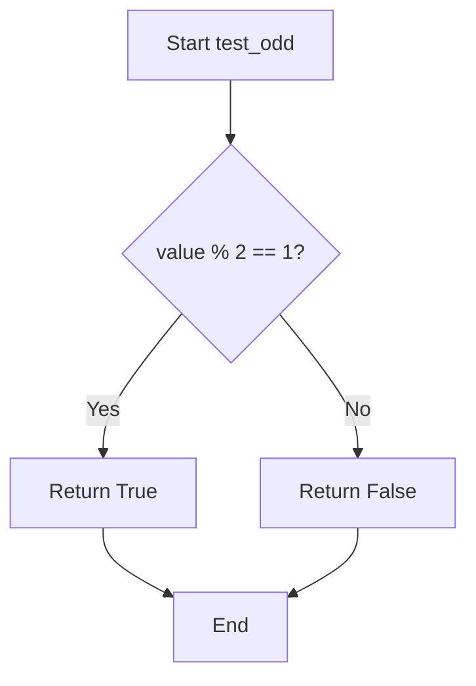

## Examples:
    >>> test_odd(3)
    True
    >>> test_odd(4)
    False
    >>> test_odd(-1)
    True
    >>> test_odd(0)
    False
```

## `src.jinja2.tests.test_even` · *function*

## Summary:
Determines whether an integer value is divisible by two without remainder.

## Description:
This function evaluates if a given integer is an even number by checking if it's evenly divisible by 2. It's designed to be used as a template test within Jinja2 templates to conditionally render content based on whether a value is even.

## Args:
    value (int): An integer to test for evenness. Must be a whole number.

## Returns:
    bool: True if the value is divisible by 2 with no remainder, False otherwise.

## Raises:
    None explicitly raised by this function.

## Constraints:
    Preconditions:
        - Input must be an integer type (or convertible to integer)
        - Behavior is undefined for non-numeric inputs
    
    Postconditions:
        - Always returns a boolean value (True or False)
        - The result accurately reflects mathematical evenness of the input

## Side Effects:
    None.

## Control Flow:
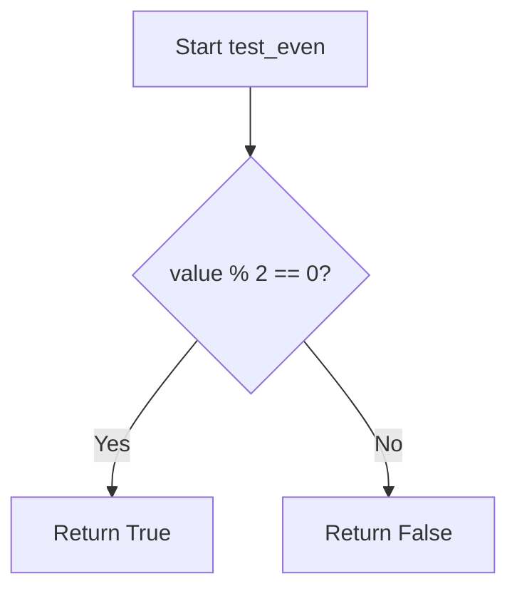

## Examples:
    # Basic usage in template context
    {{ 4 is even }}  # Returns True
    {{ 7 is even }}  # Returns False
    {{ 0 is even }}  # Returns True
```

## `src.jinja2.tests.test_divisibleby` · *function*

## Summary:
Checks whether one integer is evenly divisible by another integer.

## Description:
This function determines if a given integer value is divisible by another integer without remainder. It's commonly used in template logic to make conditional decisions based on divisibility requirements.

## Args:
    value (int): The number to be tested for divisibility.
    num (int): The divisor to test against. Must be non-zero.

## Returns:
    bool: True if value is evenly divisible by num (i.e., value % num == 0), False otherwise.

## Raises:
    ZeroDivisionError: When num is zero, as division by zero is undefined in Python.

## Constraints:
    Preconditions:
        - Both value and num should be numeric types that support the modulo operation
        - num must not be zero
    
    Postconditions:
        - Returns a boolean value
        - If num is zero, raises ZeroDivisionError

## Side Effects:
    None

## Control Flow:
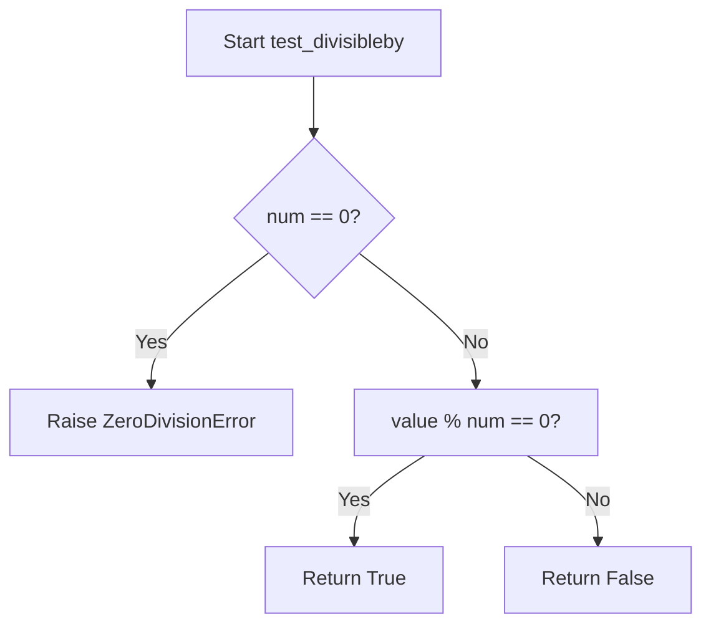

## Examples:
    # Check if 10 is divisible by 2
    result = test_divisibleby(10, 2)  # Returns True
    
    # Check if 10 is divisible by 3
    result = test_divisibleby(10, 3)  # Returns False
    
    # Check if 15 is divisible by 5
    result = test_divisibleby(15, 5)  # Returns True
    
    # Handle division by zero
    try:
        result = test_divisibleby(10, 0)
    except ZeroDivisionError:
        print("Cannot divide by zero")

## `src.jinja2.tests.test_defined` · *function*

## Summary:
Tests whether a template variable is defined and not undefined in Jinja2 templates.

## Description:
Determines if a given value is not an instance of the Undefined class, which represents variables that are not defined in the template context. This function is part of Jinja2's built-in test suite and is typically used in template expressions with the `is defined` syntax to check for variable existence before accessing them.

## Args:
    value (Any): The value to test for definition status. Can be any type of object including Undefined instances.

## Returns:
    bool: True if the value is not an instance of Undefined (i.e., it is defined), False otherwise.

## Raises:
    None

## Constraints:
    Preconditions: The function accepts any type of value as input.
    Postconditions: Always returns a boolean value indicating whether the value is defined.

## Side Effects:
    None

## Control Flow:
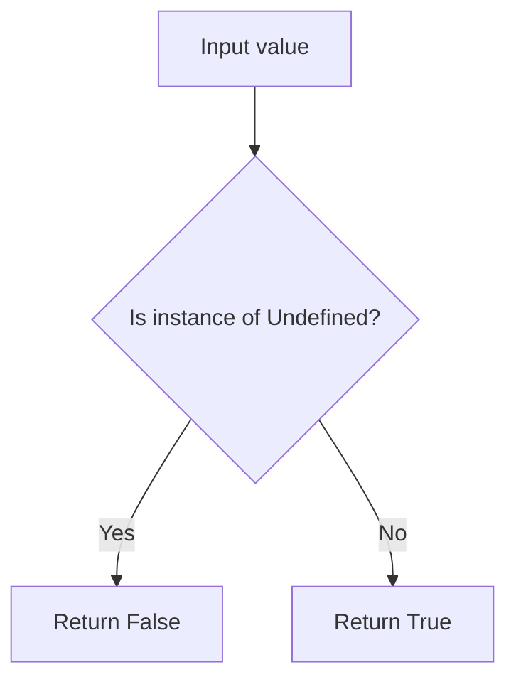

## Examples:
```python
# In a Jinja2 template context:
# {{ foo is defined }}  # Returns True if foo is defined, False if undefined
# {{ bar is defined }}  # Returns False if bar is undefined
# {{ undefined_var is defined }}  # Returns False for undefined variables
```

## `src.jinja2.tests.test_undefined` · *function*

## Summary:
Tests whether a value is an instance of the Undefined class in Jinja2 templating.

## Description:
This function determines if a given value is an undefined variable in Jinja2 templates. In Jinja2, when a template variable is referenced but not defined in the context, it becomes an instance of the `Undefined` class rather than `None` or raising an exception. This utility function allows template code to safely check for undefined variables before processing them.

## Args:
    value (Any): The value to test for being undefined.

## Returns:
    bool: True if the value is an instance of Undefined, False otherwise.

## Raises:
    None explicitly raised.

## Constraints:
    Preconditions: The function accepts any type of value as input.
    Postconditions: Always returns a boolean value indicating the undefined status.

## Side Effects:
    None.

## Control Flow:
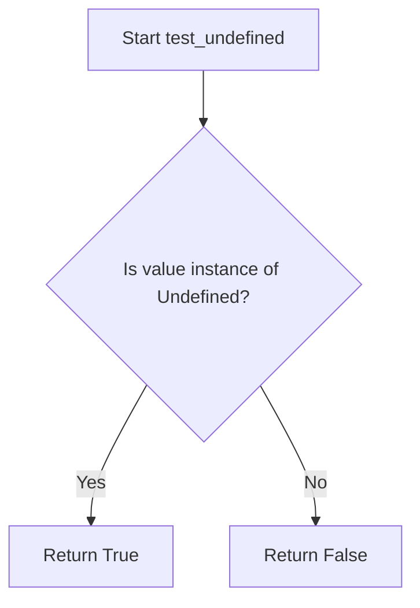

## Examples:
    # Check if a variable is undefined in a Jinja2 template context
    from jinja2.runtime import Undefined
    
    # This would typically happen in a template context
    undefined_var = Undefined()  # Created internally by Jinja2
    result = test_undefined(undefined_var)  # Returns True
    
    # Check if a defined variable is not undefined
    result = test_undefined("defined_value")  # Returns False
    
    # Check with None (not undefined)
    result = test_undefined(None)  # Returns False
    
    # Typical usage in template logic
    if test_undefined(template_context.get('optional_field')):
        # Handle the undefined case gracefully
        processed_value = "default_value"
    else:
        processed_value = template_context['optional_field']
```

## `src.jinja2.tests.test_filter` · *function*

## Summary:
Checks whether a given filter name exists in the Jinja2 environment's filter registry.

## Description:
This function performs a membership test to determine if a specified filter name is registered in the Jinja2 environment's filters collection. It serves as a utility for validating filter availability before attempting to use them in template processing.

## Args:
    env (Environment): The Jinja2 environment instance containing registered filters
    value (str): The name of the filter to check for existence

## Returns:
    bool: True if the filter name exists in env.filters, False otherwise

## Raises:
    None explicitly raised

## Constraints:
    Preconditions:
    - env must be a valid Environment instance
    - env.filters must be a collection supporting the 'in' operator (e.g., dict, set, list)
    - value must be a string type

    Postconditions:
    - Returns a boolean value indicating membership status
    - Does not modify the environment or its filters

## Side Effects:
    None

## Control Flow:
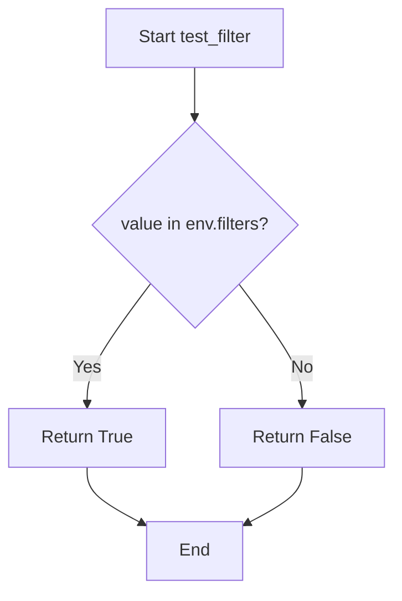

## Examples:
```python
# Check if a filter exists
env = Environment()
result = test_filter(env, "upper")
# Returns True if 'upper' filter is registered, False otherwise

# Typical usage in template validation
if test_filter(env, "custom_filter"):
    # Safe to use custom_filter in templates
    pass
```

## `src.jinja2.tests.test_test` · *function*

## Summary:
Checks whether a specified test name exists in the Jinja2 environment's test registry.

## Description:
This function performs a membership test to determine if a given test name is registered in the Jinja2 environment's collection of available tests. It's typically used during template compilation or execution to validate that referenced tests exist before attempting to use them.

The function extracts validation logic for test existence checking into a dedicated utility, separating concerns between test registration/validation and template processing workflows.

## Args:
    env (Environment): The Jinja2 environment instance containing registered tests
    value (str): The name of the test to check for existence

## Returns:
    bool: True if the test name exists in the environment's test registry, False otherwise

## Raises:
    None explicitly raised

## Constraints:
    Preconditions:
    - The `env` parameter must be a valid Environment instance
    - The `value` parameter must be a string representing a test name
    - The `env.tests` attribute must support the `in` operator for membership testing
    
    Postconditions:
    - Returns a boolean value indicating test existence status
    - Does not modify the environment or test registry

## Side Effects:
    None

## Control Flow:
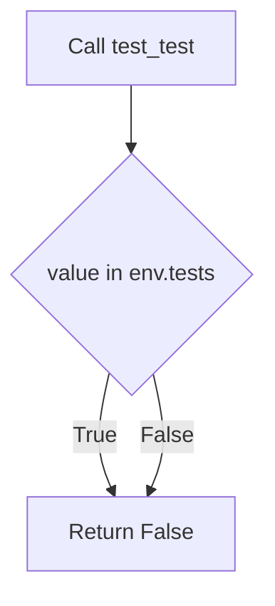

## Examples:
    # Check if 'equalto' test exists
    result = test_test(environment, 'equalto')  # Returns True if 'equalto' is registered
    
    # Check if non-existent test exists  
    result = test_test(environment, 'nonexistent')  # Returns False
```

## `src.jinja2.tests.test_none` · *function*

## Summary:
Checks whether a given value is explicitly None.

## Description:
This function serves as a built-in test in Jinja2's template engine to determine if a variable evaluates to the None singleton value. It's commonly used in conditional template logic to handle cases where variables might be undefined or explicitly set to None.

## Args:
    value (Any): The value to test for None equality. Can be any Python object including None itself.

## Returns:
    bool: True if the value is exactly None, False otherwise.

## Raises:
    None: This function does not raise any exceptions.

## Constraints:
    Preconditions: The function accepts any Python value as input.
    Postconditions: Always returns a boolean value (True or False).

## Side Effects:
    None: This function has no side effects and is purely a predicate check.

## Control Flow:
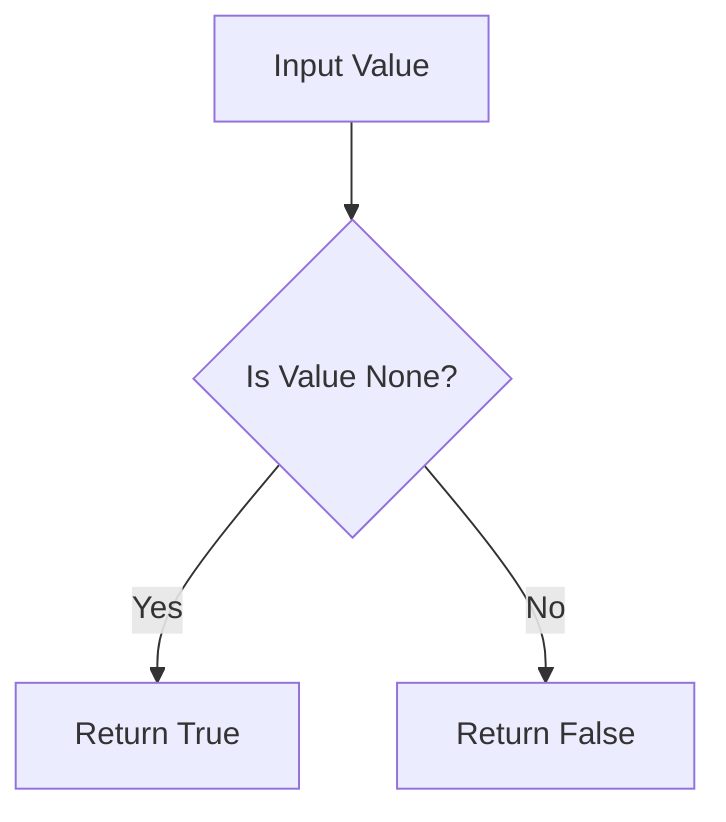

## Examples:
```jinja2
{# Check if a variable is None #}

    Variable is None

    Variable has a value


{# Using in a filter context #}
{{ my_var|default('Default Value') if my_var is none else my_var }}
```

## `src.jinja2.tests.test_boolean` · *function*

## Summary:
Determines whether a given value is a boolean literal (True or False).

## Description:
This function performs a strict identity check to determine if the provided value is exactly the boolean literal True or False. It is used in Jinja2's template testing system to validate boolean values.

## Args:
    value (Any): The value to test for boolean identity. Can be any Python object.

## Returns:
    bool: True if the value is exactly True or False (using identity comparison), False otherwise.

## Raises:
    None: This function does not raise any exceptions.

## Constraints:
    Preconditions: The function accepts any Python object as input.
    Postconditions: The return value is always a boolean (True or False).

## Side Effects:
    None: This function has no side effects.

## Control Flow:
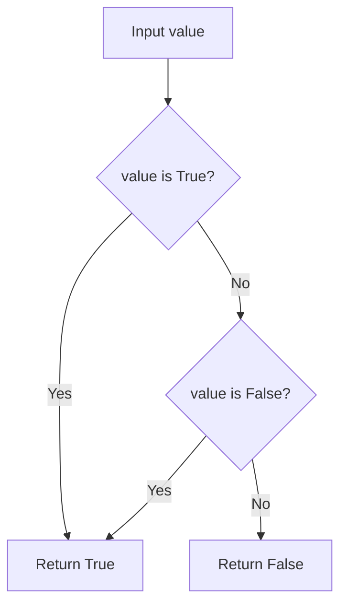

## Examples:
    >>> test_boolean(True)
    True
    >>> test_boolean(False)
    True
    >>> test_boolean(1)
    False
    >>> test_boolean(0)
    False
    >>> test_boolean("True")
    False
```

## `src.jinja2.tests.test_false` · *function*

## Summary:
Checks if a value is exactly the boolean False constant.

## Description:
This function performs an identity check to determine if the provided value is exactly the boolean False object. It uses the `is` operator rather than equality comparison, ensuring that only the literal `False` value returns True.

## Args:
    value (Any): The value to test for being exactly False.

## Returns:
    bool: True if the value is exactly False (using identity comparison), False otherwise.

## Raises:
    None: This function does not raise any exceptions.

## Constraints:
    Preconditions: The function accepts any type of input value.
    Postconditions: Always returns a boolean value (True or False).

## Side Effects:
    None: This function has no side effects.

## Control Flow:
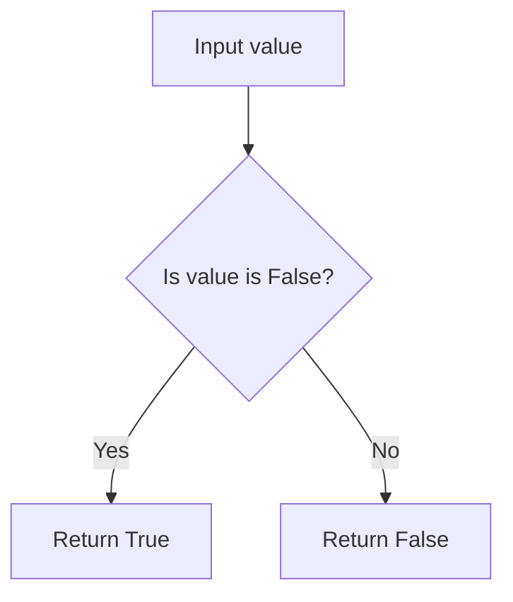

## Examples:
    >>> test_false(False)
    True
    >>> test_false(True)
    False
    >>> test_false(0)
    False
    >>> test_false("")
    False
    >>> test_false(None)
    False
```

## `src.jinja2.tests.test_true` · *function*

## Summary:
Tests whether a value is exactly the boolean True constant.

## Description:
This function performs an identity check to determine if the provided value is exactly the Python boolean `True` object. Unlike truthiness checks, this function distinguishes between `True` and other truthy values such as non-zero numbers, non-empty strings, or non-empty containers.

## Args:
    value (Any): The value to test for being exactly True. Can be any Python object.

## Returns:
    bool: True if the value is exactly the boolean True object; False otherwise.

## Raises:
    None: This function does not raise any exceptions.

## Constraints:
    Preconditions: The function accepts any Python object as input.
    Postconditions: The return value is always a boolean (True or False).

## Side Effects:
    None: This function has no side effects.

## Control Flow:
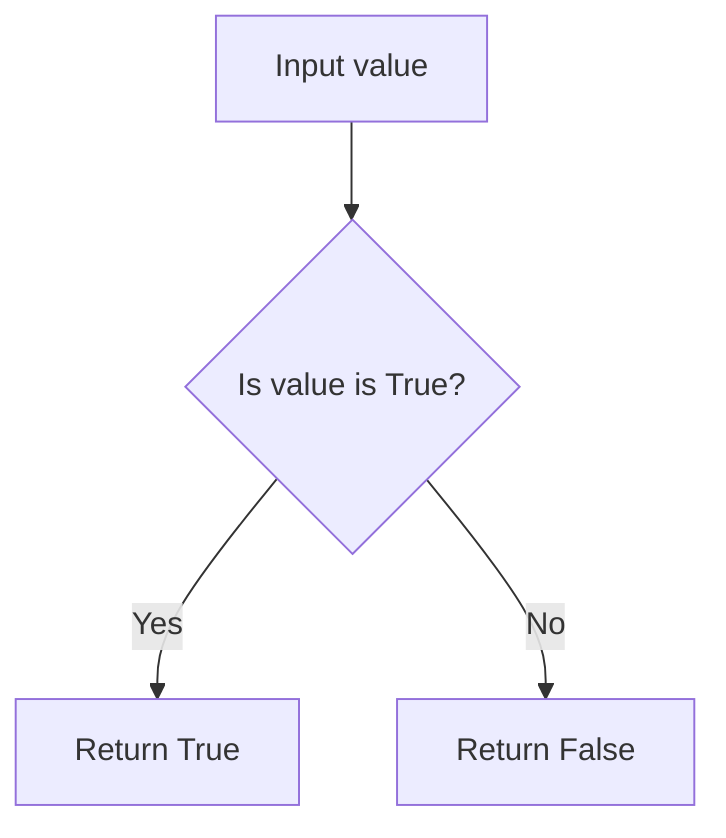

## Examples:
    # Basic usage
    test_true(True)        # Returns: True
    test_true(False)       # Returns: False
    test_true(1)           # Returns: False
    test_true("hello")     # Returns: False
    test_true([])          # Returns: False
```

## `src.jinja2.tests.test_integer` · *function*

## Summary:
Determines whether a value is an integer type while excluding boolean values.

## Description:
Checks if a given value is an instance of the int type but explicitly excludes boolean values (True and False) since they are technically instances of int in Python. This function is commonly used in template rendering contexts where distinguishing between integer and boolean values is important.

## Args:
    value (Any): The value to test for integer type membership

## Returns:
    bool: True if the value is an integer type and not a boolean; False otherwise

## Raises:
    None: This function does not raise any exceptions

## Constraints:
    Preconditions: The input value can be of any type
    Postconditions: Always returns a boolean value

## Side Effects:
    None: This function has no side effects

## Control Flow:
```mermaid
flowchart TD
    A[Start test_integer] --> B{isinstance(value, int)?}
    B -- Yes --> C{value is True?}
    C -- Yes --> D[Return False]
    C -- No --> E{value is False?}
    E -- Yes --> F[Return False]
    E -- No --> G[Return True]
    B -- No --> H[Return False]
```

## Examples:
```python
# Basic usage
test_integer(42)        # Returns True
test_integer(True)      # Returns False
test_integer(False)     # Returns False
test_integer(3.14)      # Returns False
test_integer("42")      # Returns False
```

## `src.jinja2.tests.test_float` · *function*

## Summary:
Checks whether a given value is of type float.

## Description:
This function performs a type check to determine if the provided value is specifically an instance of Python's float type. It is typically used in Jinja2 template contexts where type validation is required for conditional rendering or filtering operations.

## Args:
    value (Any): The value to be tested for float type. Can be any Python object.

## Returns:
    bool: True if the value is an instance of float, False otherwise.

## Raises:
    None: This function does not raise any exceptions.

## Constraints:
    Preconditions: The function accepts any Python object as input.
    Postconditions: The return value is always a boolean indicating the type match.

## Side Effects:
    None: This function has no side effects and is purely a type checking operation.

## Control Flow:
```mermaid
flowchart TD
    A[Input value] --> B{isinstance(value, float)?}
    B -->|Yes| C[Return True]
    B -->|No| D[Return False]
```

## Examples:
    # Basic usage
    >>> test_float(3.14)
    True
    >>> test_float(42)
    False
    >>> test_float("3.14")
    False
    >>> test_float(None)
    False
```

## `src.jinja2.tests.test_lower` · *function*

## Summary:
Tests whether a string value contains only lowercase characters.

## Description:
This function evaluates whether the provided value, when converted to a string, consists entirely of lowercase letters. It is designed as a Jinja2 template test function to enable conditional logic in templates based on string case properties.

## Args:
    value (str): The input value to test for lowercase characters. This parameter is converted to a string internally, allowing any type of input to be tested.

## Returns:
    bool: Returns True if the string representation of the value contains only lowercase characters and is not empty. Returns False if the string is empty, contains uppercase characters, or contains non-alphabetic characters.

## Raises:
    None: This function does not raise any exceptions under normal operation.

## Constraints:
    Preconditions:
        - The function accepts any type of input as the value parameter
        - The function internally converts the input to a string using str()
    
    Postconditions:
        - The function always returns a boolean value (True or False)
        - The result accurately reflects whether the string representation contains only lowercase characters

## Side Effects:
    None: This function has no side effects and is purely functional.

## Control Flow:
```mermaid
flowchart TD
    A[Input value] --> B{Convert to string}
    B --> C{String is empty?}
    C -->|Yes| D[Return False]
    C -->|No| E[Check islower()]
    E --> F{Contains only lowercase?}
    F -->|Yes| G[Return True]
    F -->|No| H[Return False]
```

## Examples:
    >>> test_lower("hello")
    True
    >>> test_lower("Hello")
    False
    >>> test_lower("HELLO")
    False
    >>> test_lower("")
    False
    >>> test_lower(123)
    False
    >>> test_lower("hello123")
    False
```

## `src.jinja2.tests.test_upper` · *function*

## Summary:
Checks if a string value is entirely uppercase.

## Description:
This function tests whether the provided value, when converted to a string, consists entirely of uppercase characters. It's typically used in template conditionals to validate string formatting requirements.

## Args:
    value (Any): The input value to test for uppercase formatting. This parameter is converted to string internally, so any type that can be converted to string is acceptable.

## Returns:
    bool: True if the string representation of value contains only uppercase letters, False otherwise. Empty strings return False.

## Raises:
    None

## Constraints:
    Preconditions:
        - The function accepts any type that can be converted to string
        - No specific validation is performed on the input type
    
    Postconditions:
        - Always returns a boolean value
        - The conversion to string happens before the uppercase check

## Side Effects:
    None

## Control Flow:
```mermaid
flowchart TD
    A[Input value] --> B{Convert to str}
    B --> C{Check isupper()}
    C --> D[Return bool result]
```

## Examples:
    >>> test_upper("HELLO")
    True
    >>> test_upper("Hello")
    False
    >>> test_upper("hello")
    False
    >>> test_upper("")
    False
    >>> test_upper(123)
    False
```

## `src.jinja2.tests.test_string` · *function*

## Summary:
Checks whether a given value is an instance of the string type.

## Description:
This function serves as a type test utility that determines if the provided value is a string instance. It is part of the Jinja2 template testing framework and is typically used within template expressions to validate data types before processing.

## Args:
    value (typing.Any): Any Python object to be tested for string type compatibility.

## Returns:
    bool: True if the value is an instance of str, False otherwise.

## Raises:
    None: This function does not raise any exceptions under normal operation.

## Constraints:
    Preconditions: The function accepts any Python object as input.
    Postconditions: The return value is always a boolean indicating string type membership.

## Side Effects:
    None: This function has no side effects and is purely a type checking utility.

## Control Flow:
```mermaid
flowchart TD
    A[Input value] --> B{isinstance(value, str)?}
    B -- Yes --> C[Return True]
    B -- No --> D[Return False]
```

## Examples:
    >>> test_string("hello")
    True
    >>> test_string(123)
    False
    >>> test_string(None)
    False
```

## `src.jinja2.tests.test_mapping` · *function*

## Summary:
Tests whether a value is a mapping type such as dictionaries or other dictionary-like objects.

## Description:
Determines if the provided value implements the mapping interface defined by `collections.abc.Mapping`. This function is commonly used in template rendering to check if a variable can be treated as a key-value store.

## Args:
    value (Any): The value to test for mapping compatibility

## Returns:
    bool: True if the value is an instance of `collections.abc.Mapping`, False otherwise

## Raises:
    None

## Constraints:
    Preconditions: None
    Postconditions: Always returns a boolean value

## Side Effects:
    None

## Control Flow:
```mermaid
flowchart TD
    A[Input value] --> B{isinstance(value, abc.Mapping)?}
    B -->|Yes| C[Return True]
    B -->|No| D[Return False]
```

## Examples:
```python
# Basic usage
test_mapping({'a': 1, 'b': 2})  # Returns True
test_mapping([1, 2, 3])         # Returns False
test_mapping("hello")           # Returns False
```

## `src.jinja2.tests.test_number` · *function*

## Summary:
Checks whether a given value is a numeric type according to Python's numbers hierarchy.

## Description:
This function determines if the provided value is an instance of Python's abstract Number class, which includes integers, floats, complex numbers, and other numeric types from the numbers module. It serves as a type-checking utility for template expressions and filters that require numeric inputs.

## Args:
    value (Any): The value to test for numeric type compatibility

## Returns:
    bool: True if the value is an instance of numbers.Number, False otherwise

## Raises:
    None

## Constraints:
    Preconditions: The function accepts any Python object as input
    Postconditions: Always returns a boolean value indicating numeric type membership

## Side Effects:
    None

## Control Flow:
```mermaid
flowchart TD
    A[Input value] --> B{isinstance(value, Number)?}
    B -->|Yes| C[Return True]
    B -->|No| D[Return False]
```

## Examples:
    >>> test_number(42)
    True
    >>> test_number(3.14)
    True
    >>> test_number("42")
    False
    >>> test_number(None)
    False

## `src.jinja2.tests.test_sequence` · *function*

## Summary:
Determines whether a value supports the sequence protocol by testing for length and indexing capabilities.

## Description:
Checks if a given value implements the sequence interface by attempting to invoke the built-in `len()` function and the `__getitem__` method. This function is used to identify objects that behave like sequences (such as lists, tuples, strings, etc.) without requiring them to inherit from a specific base class.

## Args:
    value (Any): The object to test for sequence compatibility

## Returns:
    bool: True if the value supports both `len()` and `__getitem__` operations, False otherwise

## Raises:
    None: This function catches all exceptions internally and returns False for any failure

## Constraints:
    Preconditions: The value parameter can be any Python object
    Postconditions: Always returns a boolean value (True or False)

## Side Effects:
    None: This function performs no I/O operations or external state mutations

## Control Flow:
```mermaid
flowchart TD
    A[Start test_sequence] --> B{Can call len(value)?}
    B -- Yes --> C{Can call value.__getitem__?}
    C -- Yes --> D[Return True]
    C -- No --> E[Return False]
    B -- No --> F[Return False]
```

## Examples:
    >>> test_sequence([1, 2, 3])
    True
    >>> test_sequence("hello")
    True
    >>> test_sequence(42)
    False
    >>> test_sequence({})
    False
```

## `src.jinja2.tests.test_sameas` · *function*

## Summary:
Tests whether two values refer to the exact same object in memory.

## Description:
This function performs an identity comparison between two values using Python's `is` operator. It returns True only when both parameters reference the identical object in memory, not just objects with equal values. This is particularly useful in template contexts where distinguishing between object identity and value equality is important.

## Args:
    value (Any): The first value to compare
    other (Any): The second value to compare

## Returns:
    bool: True if value and other are the same object in memory, False otherwise

## Raises:
    None

## Constraints:
    Preconditions: Both arguments can be any Python objects
    Postconditions: Always returns a boolean value

## Side Effects:
    None

## Control Flow:
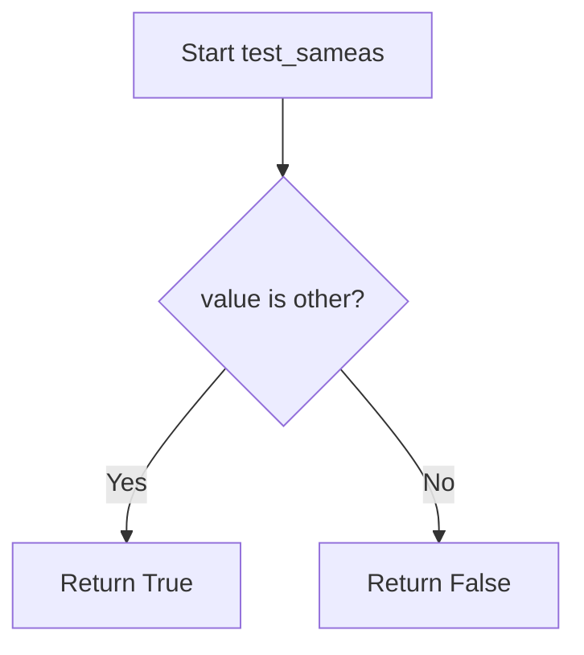

## Examples:
```python
# Basic usage
result = test_sameas([1, 2, 3], [1, 2, 3])  # Returns False (different list objects)
result = test_sameas([1, 2, 3], [1, 2, 3])  # Returns False (different list objects)
a = [1, 2, 3]
result = test_sameas(a, a)  # Returns True (same object reference)
result = test_sameas(42, 42)  # Returns True (small integers are interned)
result = test_sameas("hello", "hello")  # Returns True (strings are interned)
```

## `src.jinja2.tests.test_iterable` · *function*

## Summary:
Checks whether a given value is iterable by attempting to create an iterator from it.

## Description:
This function determines if a value can be iterated over in Python. It attempts to call the built-in `iter()` function on the provided value. If a `TypeError` is raised, the value is not iterable and the function returns `False`. Otherwise, it returns `True`.

This function is commonly used in Jinja2 templates to test if a variable can be looped over in template expressions.

## Args:
    value (Any): The value to test for iterability. Can be any Python object.

## Returns:
    bool: `True` if the value is iterable, `False` otherwise.

## Raises:
    None: This function does not raise any exceptions directly. It catches `TypeError` internally.

## Constraints:
    Preconditions: The function accepts any Python object as input.
    Postconditions: The function always returns a boolean value (`True` or `False`).

## Side Effects:
    None: This function has no side effects. It only performs a type check and returns a boolean result.

## Control Flow:
```mermaid
flowchart TD
    A[Start test_iterable] --> B{Can call iter()?}
    B -- Yes --> C[Return True]
    B -- No --> D[Return False]
```

## Examples:
    # Testing with iterable objects
    test_iterable([1, 2, 3])     # Returns True
    test_iterable("hello")       # Returns True
    test_iterable({1, 2, 3})     # Returns True
    
    # Testing with non-iterable objects
    test_iterable(42)            # Returns False
    test_iterable(None)          # Returns False
    test_iterable({'a': 1})      # Returns True (dicts are iterable)
```

## `src.jinja2.tests.test_escaped` · *function*

## Summary:
Determines whether a value contains HTML content that should not be escaped during template rendering.

## Description:
Checks if the provided value has an `__html__` method, indicating that it contains pre-escaped HTML content that should be rendered as-is without further escaping. This function is used internally by Jinja2's template engine to identify safe HTML content that can be rendered directly.

## Args:
    value (Any): The object to test for HTML escaping status. Can be any Python object.

## Returns:
    bool: True if the value has an `__html__` attribute, False otherwise.

## Raises:
    None: This function does not raise any exceptions.

## Constraints:
    Preconditions: The function accepts any Python object as input.
    Postconditions: Always returns a boolean value (True or False).

## Side Effects:
    None: This function performs no I/O operations or state modifications.

## Control Flow:
```mermaid
flowchart TD
    A[Input value] --> B{Has __html__ attribute?}
    B -- Yes --> C[Return True]
    B -- No --> D[Return False]
```

## Examples:
    >>> test_escaped("hello")
    False
    
    >>> class SafeHTML:
    ...     def __html__(self):
    ...         return "<p>Hello</p>"
    ...
    >>> test_escaped(SafeHTML())
    True

## `src.jinja2.tests.test_in` · *function*

## Summary:
Checks if a value exists within a container or sequence.

## Description:
Implements the `in` operator for Jinja2 template testing, determining whether a given value is contained within a sequence or container object. This function serves as a test predicate that can be used in conditional expressions within Jinja2 templates.

## Args:
    value (Any): The value to search for within the container. Can be of any type.
    seq (Container): The container or sequence to search within. Must support the `in` operator.

## Returns:
    bool: True if the value is found within the sequence, False otherwise.

## Raises:
    None: This function does not explicitly raise exceptions, though underlying container operations may raise exceptions.

## Constraints:
    Preconditions:
        - The `seq` parameter must support the `in` operator (i.e., implement `__contains__` method)
        - Both parameters can be of any type, but the comparison behavior depends on the container's implementation
        
    Postconditions:
        - Returns a boolean value (True or False)
        - The function is pure and has no side effects

## Side Effects:
    None: This function performs no I/O operations or external state mutations.

## Control Flow:
```mermaid
flowchart TD
    A[Start test_in] --> B{value in seq?}
    B -->|Yes| C[Return True]
    B -->|No| D[Return False]
```

## Examples:
    # Basic usage
    result = test_in(2, [1, 2, 3])  # Returns True
    
    # String containment
    result = test_in('hello', 'hello world')  # Returns True
    
    # Not found case
    result = test_in(5, [1, 2, 3])  # Returns False
    
    # With custom container
    class MyContainer:
        def __contains__(self, item):
            return item > 0
    
    container = MyContainer()
    result = test_in(3, container)  # Returns True
```

