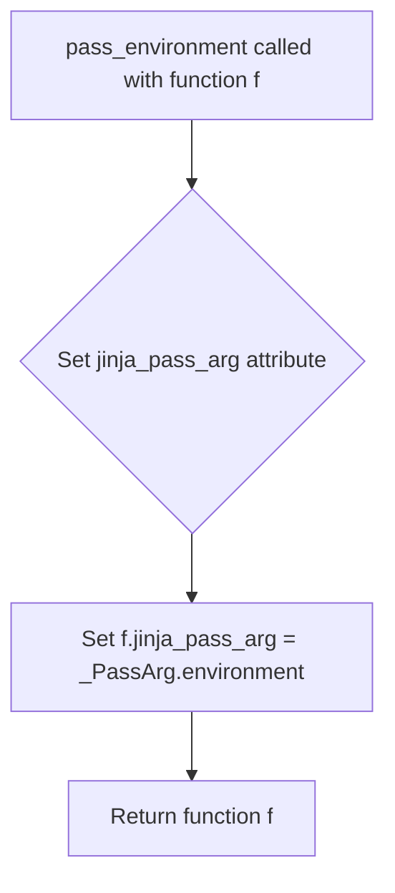
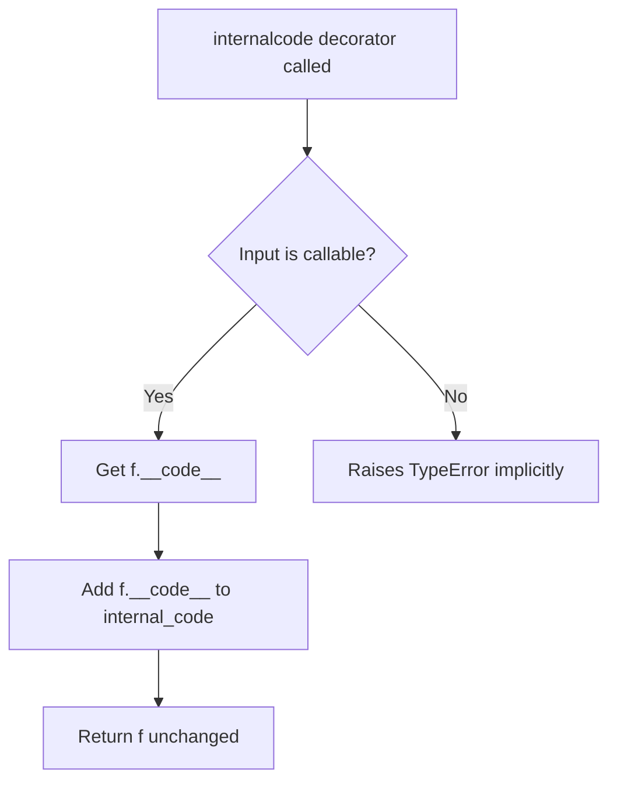
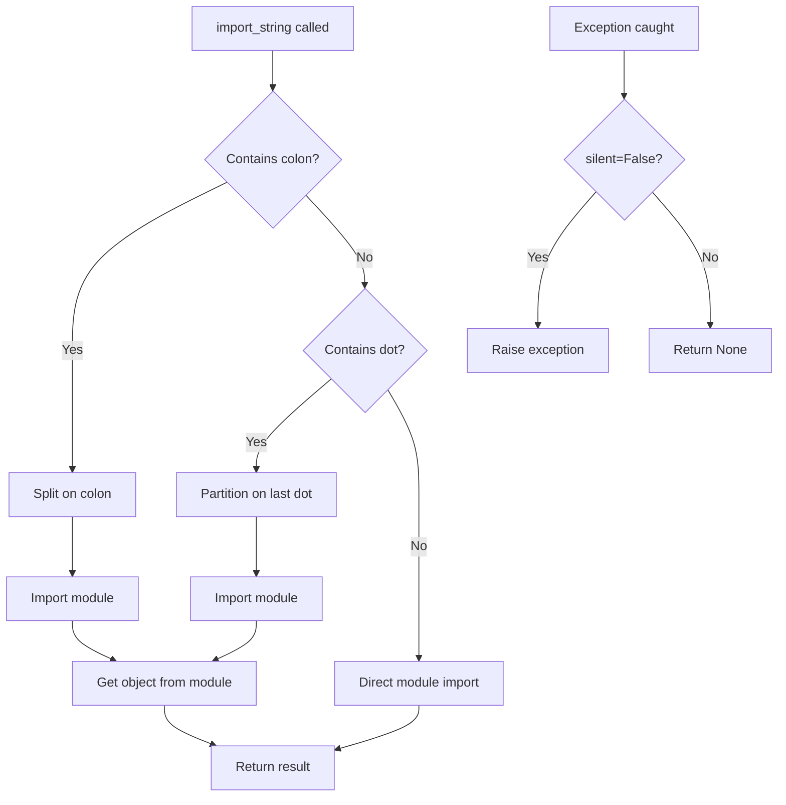
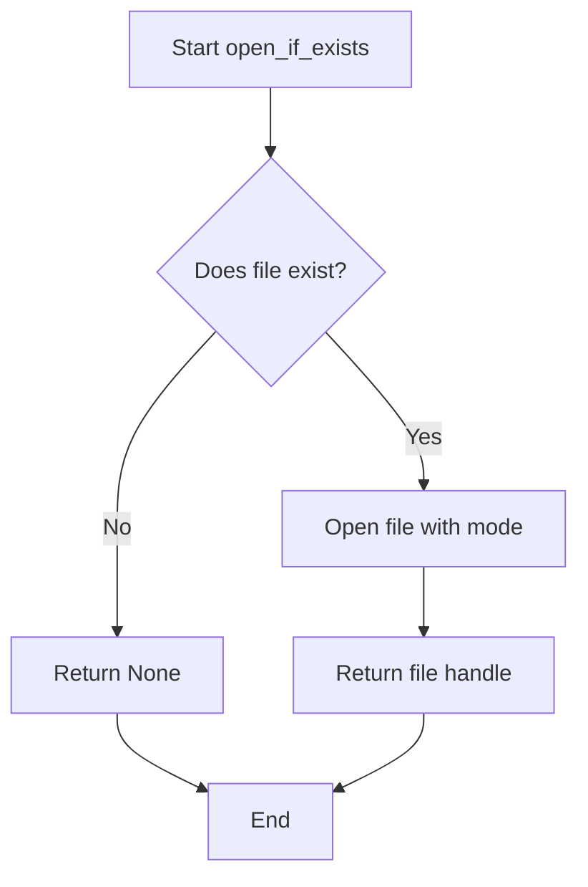
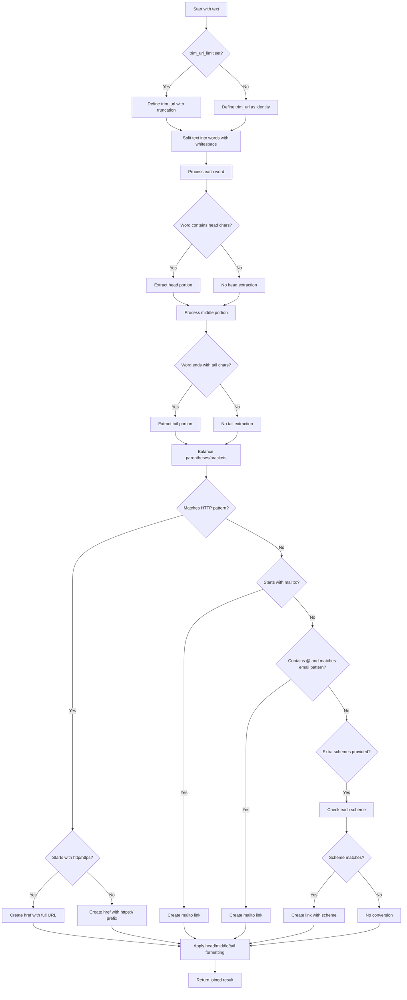
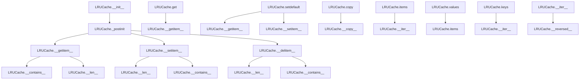
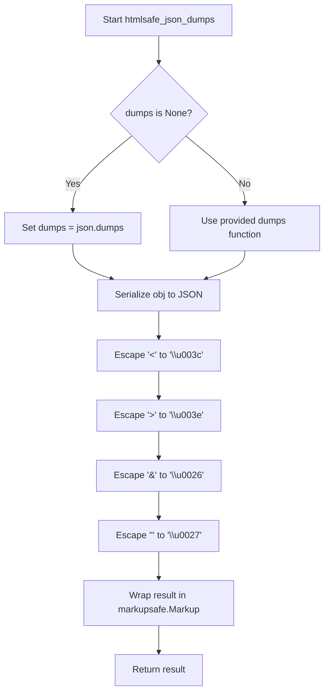
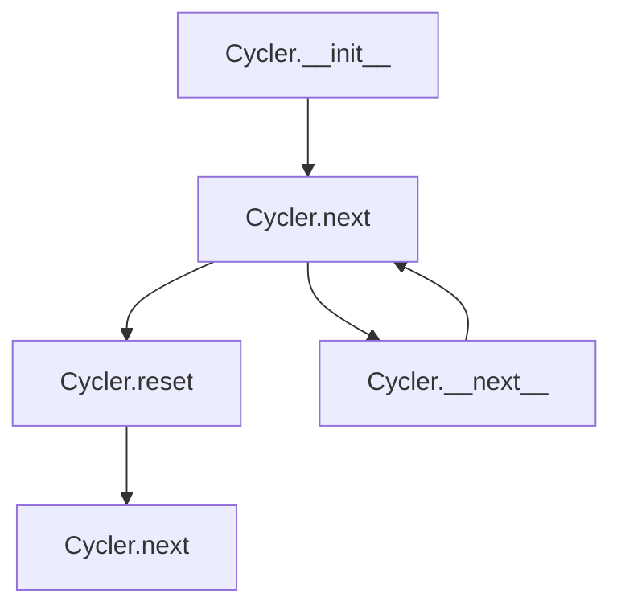
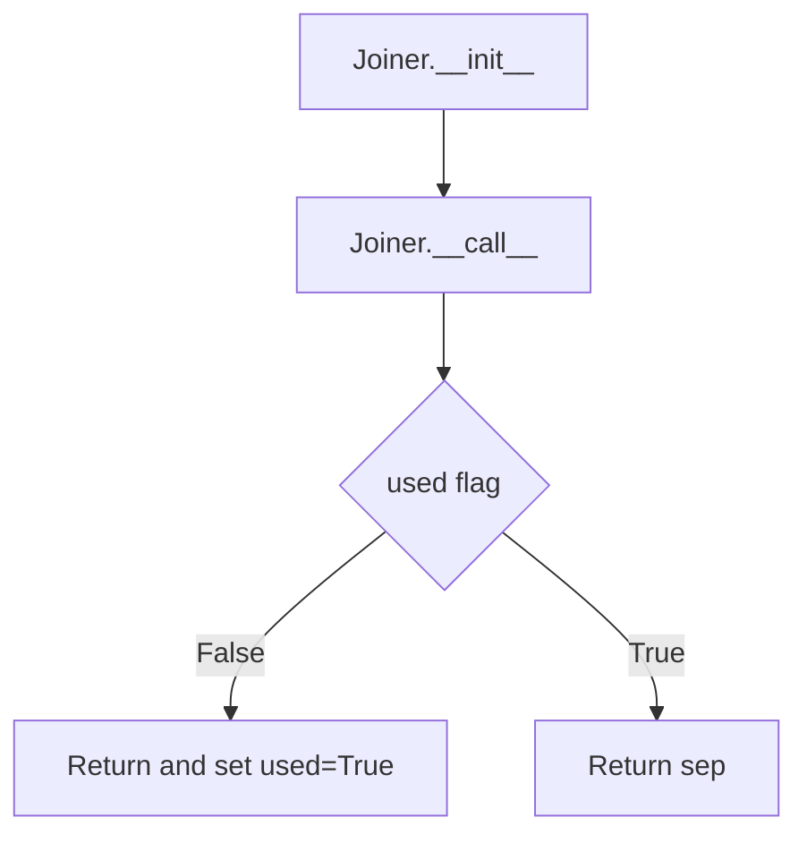

# `utils.py`

## `src.jinja2.utils.pass_context` · *function*

*No documentation generated.*

## `src.jinja2.utils.pass_eval_context` · *function*

*No documentation generated.*

## `src.jinja2.utils.pass_environment` · *function*

## Summary:
Decorator that marks a function to receive the Jinja2 environment as its first argument during template execution.

## Description:
This decorator is used to indicate that a function should receive the Jinja2 environment object as its first argument when called during template rendering. It sets an internal attribute on the decorated function that signals to the Jinja2 engine how arguments should be passed to the function during template execution.

## Args:
    f (F): The function to be decorated, where F is a generic type representing a callable.

## Returns:
    F: The same function that was passed in, with the added attribute indicating environment passing behavior.

## Raises:
    None explicitly raised.

## Constraints:
    Preconditions:
    - The function `f` must be callable
    - The global `_PassArg` enumeration must be defined and accessible
    
    Postconditions:
    - The returned function will have an attribute `jinja_pass_arg` set to `_PassArg.environment`
    - The function object remains unchanged except for the added attribute

## Side Effects:
    None

## Control Flow:


## Examples:
```python
@pass_environment
def my_filter(value, environment):
    # This function will receive the Jinja2 environment as the second argument
    return value.upper()

# When used in a Jinja2 template, the environment will be automatically passed
# during function execution
```

## `src.jinja2.utils._PassArg` · *class*

## Summary:
An enumeration defining argument passing modes used internally by Jinja2 during template compilation and execution.

## Description:
The `_PassArg` enum represents three different ways arguments can be passed to callable objects during Jinja2 template processing. This is used internally by the Jinja2 engine to determine how to provide context information to functions and filters when they are invoked during template rendering. The enum values correspond to different contextual information that may be needed by template functions.

This class is primarily used as a marker interface for callable objects that require specific argument passing behavior, allowing the Jinja2 compiler to generate appropriate code for passing context information to these functions.

## State:
- `context` (enum auto): Represents passing the template context as an argument
- `eval_context` (enum auto): Represents passing the evaluation context as an argument  
- `environment` (enum auto): Represents passing the Jinja2 environment as an argument

The enum values are automatically assigned by `enum.auto()` and serve as unique identifiers for the different argument passing modes.

## Lifecycle:
- Creation: Instances are created automatically as enum members during class definition
- Usage: Objects are typically created via the `from_obj` classmethod which extracts the `jinja_pass_arg` attribute from callable objects
- Destruction: No explicit cleanup required as enums are singleton instances

## Method Map:
```mermaid
graph TD
    A[_PassArg.from_obj] --> B{hasattr obj "jinja_pass_arg"}
    B -- True --> C[return obj.jinja_pass_arg]
    B -- False --> D[return None]
```

## Raises:
- No exceptions are raised by the enum itself
- The `from_obj` method may raise AttributeError if `hasattr` fails (though this is unlikely in normal operation)

## Example:
```python
# Creating a callable with explicit argument passing mode
def my_filter(value):
    return value.upper()

my_filter.jinja_pass_arg = _PassArg.context

# Using the enum extraction
pass_arg = _PassArg.from_obj(my_filter)  # Returns _PassArg.context
```

### `src.jinja2.utils._PassArg.from_obj` · *method*

## Summary:
Extracts a _PassArg enum value from an object if it has a jinja_pass_arg attribute.

## Description:
This class method serves as a utility for retrieving _PassArg enum instances from objects that have been marked with a jinja_pass_arg attribute. It's used internally by Jinja2 to determine how arguments should be passed in template contexts.

## Args:
    obj: Any object that may have a jinja_pass_arg attribute

## Returns:
    _PassArg or None: The _PassArg enum value if the object has a jinja_pass_arg attribute, otherwise None

## Raises:
    None

## State Changes:
    Attributes READ: obj.jinja_pass_arg
    Attributes WRITTEN: None

## Constraints:
    Preconditions: The obj parameter can be any object
    Postconditions: Returns either a _PassArg enum value or None

## Side Effects:
    None

## `src.jinja2.utils.internalcode` · *function*

## Summary:
Decorator that marks a function's code object as internal by adding it to a tracking set.

## Description:
This decorator is used to identify functions that are considered internal to the Jinja2 system. When applied to a function, it records the function's code object in a global set called `internal_code`. This allows the system to distinguish between internal implementation details and externally exposed functionality, which may be useful for debugging, security, or optimization purposes.

## Args:
    f (F): A callable function to be marked as internal. The type `F` represents a generic function type.

## Returns:
    F: The same function that was passed in, unchanged. This enables the decorator to be used in a chain or without affecting the decorated function's behavior.

## Raises:
    None explicitly raised by this function.

## Constraints:
    Preconditions:
    - The input `f` must be a callable object (function, method, etc.)
    - The global variable `internal_code` must be initialized as a set-like object
    
    Postconditions:
    - The function's code object (`f.__code__`) will be added to the `internal_code` set
    - The returned function is identical to the input function

## Side Effects:
    - Mutates the global `internal_code` set by adding the decorated function's code object
    - No other side effects; the function itself is not modified beyond being returned

## Control Flow:


## Examples:
```python
# Basic usage
@internalcode
def my_internal_function():
    return "internal result"

# This marks my_internal_function's code object as internal
# and returns the function unchanged
```

## `src.jinja2.utils.is_undefined` · *function*

## Summary:
Determines whether an object is an instance of Jinja2's Undefined class, identifying undefined template variables.

## Description:
This utility function tests if a given object is an instance of Jinja2's Undefined class, which represents variables that have not been defined in a template context. It serves as a type-checking utility for detecting undefined template variables during rendering.

## Args:
    obj (Any): The object to test for being undefined. Can be any Python object.

## Returns:
    bool: True if the object is an instance of Jinja2's Undefined class, False otherwise.

## Raises:
    None: This function does not raise any exceptions.

## Constraints:
    Preconditions:
        - The function accepts any Python object as input
        - The `Undefined` class from `jinja2.runtime` must be importable
    
    Postconditions:
        - Returns a boolean value (True or False)
        - Does not modify the input object
        - Function execution is deterministic for the same input

## Side Effects:
    None: This function performs no I/O operations or state modifications.

## Control Flow:
```mermaid
flowchart TD
    A[is_undefined called with obj] --> B{isinstance(obj, Undefined)?}
    B -- Yes --> C[Return True]
    B -- No --> D[Return False]
```

## Examples:
```python
# Basic usage to check if a variable is undefined
from jinja2.utils import is_undefined
from jinja2.runtime import Undefined

# Test with an undefined variable
undefined_var = Undefined()
result = is_undefined(undefined_var)  # Returns True

# Test with a defined variable
defined_var = "hello"
result = is_undefined(defined_var)  # Returns False

# Test with None
result = is_undefined(None)  # Returns False

# Usage in conditional logic
if is_undefined(some_template_variable):
    # Handle undefined variable case
    pass
```

## `src.jinja2.utils.consume` · *function*

## Summary:
Consumes an iterable by iterating through all elements and discarding them.

## Description:
This function iterates through the provided iterable and processes each element, but discards all values. It is commonly used to exhaust iterators or generators when the actual values are not needed, but the iteration process itself is important for side effects or resource management. In templating systems, this is often used to process template expressions or filters without storing intermediate results.

## Args:
    iterable (t.Iterable[t.Any]): An iterable object containing elements to be consumed.

## Returns:
    None: This function does not return any value.

## Raises:
    No exceptions are explicitly raised by this function.

## Constraints:
    Preconditions:
    - The input must be an iterable object that supports the iterator protocol
    - The iterable should not raise exceptions during iteration
    
    Postconditions:
    - All elements in the iterable have been processed and discarded
    - The iterable is exhausted after calling this function

## Side Effects:
    None: This function does not have any side effects beyond consuming the input iterable.

## Control Flow:
```mermaid
flowchart TD
    A[Start consume()] --> B[Get iterator from iterable]
    B --> C[Loop: while next() succeeds]
    C --> D[Process element (discard)]
    C --> E[Iterator exhausted?]
    E -->|No| C
    E -->|Yes| F[End]
```

## Examples:
```python
# Basic usage with a list
numbers = [1, 2, 3, 4, 5]
consume(numbers)  # Consumes all elements, numbers is now exhausted

# Usage with generator
def number_generator():
    for i in range(5):
        yield i * 2

gen = number_generator()
consume(gen)  # Consumes all yielded values

# Useful for triggering side effects in iterators
def side_effect_iterator():
    for i in range(3):
        print(f"Processing {i}")
        yield i

consume(side_effect_iterator())  # Prints "Processing 0", "Processing 1", "Processing 2"
```

## `src.jinja2.utils.clear_caches` · *function*

## Summary:
Clears internal caches used by the Jinja2 template engine to free memory and reset cached state.

## Description:
This utility function clears two critical caches within the Jinja2 template engine: the spontaneous environment cache and the lexer cache. It is typically called during testing, development, or when cache invalidation is required to ensure clean state or prevent memory leaks.

The function extracts cache clearing logic into a dedicated utility to provide a centralized way to invalidate cached data without requiring direct access to internal cache objects.

## Args:
    None

## Returns:
    None

## Raises:
    None

## Constraints:
    Preconditions:
    - The function assumes that `get_spontaneous_environment` is a cached function with a `cache_clear()` method
    - The function assumes that `_lexer_cache` is a mutable cache object with a `clear()` method
    
    Postconditions:
    - Both caches are emptied
    - No cached data remains in either cache

## Side Effects:
    None

## Control Flow:
```mermaid
flowchart TD
    A[clear_caches()] --> B[get_spontaneous_environment.cache_clear()]
    B --> C[_lexer_cache.clear()]
    C --> D[Return None]
```

## Examples:
```python
# Clear all caches
clear_caches()

# Typically used in test cleanup
def test_template_rendering():
    # ... test code ...
    clear_caches()  # Reset cache state between tests
```

## `src.jinja2.utils.import_string` · *function*

## Summary:
Dynamically imports Python objects from string representations of import paths.

## Description:
This utility function enables dynamic import of Python modules and objects using string-based import specifications. It supports three import formats: "module:object" for importing specific attributes from modules, "module.object" for nested attribute access, and "module" for simple module imports. The function is commonly used in Jinja2 for loading template extensions, filters, and other dynamic components.

## Args:
    import_name (str): String representation of the import path. Can be in formats:
        - "module:object" - imports object from module
        - "module.object" - imports nested attribute from module  
        - "module" - imports entire module
    silent (bool): If True, suppresses ImportError and AttributeError exceptions. Defaults to False.

## Returns:
    Any: The imported module or object. Returns the module itself when import_name contains no dots or colons.

## Raises:
    ImportError: When the specified module cannot be imported and silent=False.
    AttributeError: When the specified object cannot be found in the imported module and silent=False.

## Constraints:
    Preconditions:
        - import_name must be a valid string
        - The referenced module and object must exist if silent=False
    Postconditions:
        - Returns either a module or an object from a module
        - Raises appropriate exceptions when silent=False and import fails

## Side Effects:
    None: This function performs no I/O operations or external state mutations. It only uses Python's built-in import mechanism.

## Control Flow:


## Examples:
```python
# Import a module
import_string('os')  # Returns the os module

# Import an object from a module  
import_string('os.path:join')  # Returns os.path.join function

# Import a nested object
import_string('collections.defaultdict')  # Returns defaultdict class

# Silent import (no exception raised)
result = import_string('nonexistent_module', silent=True)  # Returns None
```

## `src.jinja2.utils.open_if_exists` · *function*

## Summary:
Attempts to open a file only if it exists, returning None if the file does not exist.

## Description:
This utility function provides a safe way to open files by first checking if they exist. It prevents FileNotFoundError exceptions that would occur when trying to open non-existent files. The function is commonly used in template processing and file handling contexts where files may or may not be present.

## Args:
    filename (str): Path to the file to be opened
    mode (str): File opening mode, defaults to "rb" (read binary)

## Returns:
    IO or None: File handle if file exists and can be opened, None otherwise

## Raises:
    None explicitly raised, but underlying open() may raise OSError/FileNotFoundError

## Constraints:
    Preconditions:
        - filename must be a valid path string
        - mode must be a valid file mode string
    Postconditions:
        - If file exists, returns a valid file handle
        - If file doesn't exist, returns None

## Side Effects:
    - May perform file system I/O operations
    - May raise OS-level exceptions if file exists but cannot be opened due to permissions

## Control Flow:


## Examples:
```python
# Safe file opening
file_handle = open_if_exists("template.html")
if file_handle:
    content = file_handle.read()
    file_handle.close()
else:
    # Handle missing file case
    print("Template file not found")

# With custom mode
binary_file = open_if_exists("data.bin", "rb")
text_file = open_if_exists("config.txt", "r")
```

## `src.jinja2.utils.object_type_repr` · *function*

## Summary:
Returns a human-readable string representation of an object's type, with special handling for None and Ellipsis values.

## Description:
This function generates a descriptive string representation of an object's type. It provides special formatting for built-in Python types versus user-defined types, making it useful for debugging and error reporting in Jinja2 template processing.

## Args:
    obj (Any): The object whose type representation is to be generated

## Returns:
    str: A string describing the object's type. For None, returns "None"; for Ellipsis, returns "Ellipsis"; for built-in types, returns "{type_name} object"; for other types, returns "{module}.{type_name} object"

## Raises:
    No exceptions are raised by this function

## Constraints:
    Preconditions:
    - The function accepts any Python object as input
    
    Postconditions:
    - Always returns a string value
    - The returned string follows a consistent format pattern

## Side Effects:
    None

## Control Flow:
```mermaid
flowchart TD
    A[Start: object_type_repr(obj)] --> B{obj is None?}
    B -- Yes --> C[Return "None"]
    B -- No --> D{obj is Ellipsis?}
    D -- Yes --> E[Return "Ellipsis"]
    D -- No --> F[Get type(cls = type(obj))]
    F --> G{cls.__module__ == "builtins"?}
    G -- Yes --> H[Return f"{cls.__name__} object"]
    G -- No --> I[Return f"{cls.__module__}.{cls.__name__} object"]
```

## Examples:
    >>> object_type_repr(None)
    'None'
    
    >>> object_type_repr(...)
    'Ellipsis'
    
    >>> object_type_repr(42)
    'int object'
    
    >>> object_type_repr("hello")
    'str object'
    
    >>> object_type_repr([1, 2, 3])
    'list object'
```

## `src.jinja2.utils.pformat` · *function*

*No documentation generated.*

## `src.jinja2.utils.urlize` · *function*

## Summary:
Converts URLs, email addresses, and other web-related content in text into HTML anchor links while preserving text formatting and handling various edge cases.

## Description:
This function processes plain text to automatically detect and convert URLs, email addresses, and other web-related content into HTML anchor links. It intelligently handles text formatting preservation, including parentheses, brackets, and HTML entities, while ensuring safe HTML output through proper escaping. The function is commonly used in template rendering contexts to create clickable links from plain text content.

## Args:
    text (str): The input text to process for URL/email conversion
    trim_url_limit (int, optional): Maximum length of URL to display in link text. URLs longer than this will be truncated with an ellipsis. If None, no truncation occurs
    rel (str, optional): Value for the HTML rel attribute on created links. If None, no rel attribute is added
    target (str, optional): Value for the HTML target attribute on created links. If None, no target attribute is added
    extra_schemes (Iterable[str], optional): Additional URL schemes to recognize beyond standard HTTP/HTTPS/mailto. Each scheme should not include the trailing colon (e.g., "ftp" not "ftp:")

## Returns:
    str: The processed text with URLs and email addresses converted to HTML anchor links, with proper HTML escaping applied

## Raises:
    None explicitly raised

## Constraints:
    Preconditions:
    - Input text should be a string
    - All attributes (rel, target) should be valid HTML attribute values if provided
    - The function assumes the existence of internal regex patterns `_http_re` and `_email_re` for URL/email detection
    
    Postconditions:
    - Output is properly escaped HTML-safe text
    - URLs matching standard protocols (http/https) are wrapped in appropriate anchor tags
    - Email addresses are converted to mailto links with proper href attributes
    - Text formatting is preserved through careful handling of parentheses, brackets, and HTML entities
    - URLs with schemes not in standard list are handled via extra_schemes parameter

## Side Effects:
    None

## Control Flow:


## Examples:
    # Basic URL conversion
    urlize("Visit https://example.com for more info")
    # Returns: 'Visit <a href="https://example.com">https://example.com</a> for more info'
    
    # Email address conversion
    urlize("Contact us at test@example.com")
    # Returns: 'Contact us at <a href="mailto:test@example.com">test@example.com</a>'
    
    # With URL truncation
    urlize("See https://very-long-url.example.com/path", trim_url_limit=10)
    # Returns: 'See <a href="https://very-long-url.example.com/path">https://very-...</a>'
    
    # With custom target attribute
    urlize("Go to example.com", target="_blank")
    # Returns: 'Go to <a href="https://example.com" target="_blank">example.com</a>'

## `src.jinja2.utils.generate_lorem_ipsum` · *function*

## Summary:
Generates randomized lorem ipsum text paragraphs with proper punctuation and capitalization.

## Description:
Creates randomized lorem ipsum text consisting of a specified number of paragraphs. Each paragraph contains a random number of words within the specified range, with automatic punctuation and capitalization. The function can return either plain text or HTML markup format.

This logic is extracted into its own function to encapsulate the complex text generation algorithm, making it reusable and testable. It separates the concerns of text generation from template rendering and provides a clean interface for generating placeholder content.

## Args:
    n (int): Number of paragraphs to generate. Defaults to 5. Must be non-negative.
    html (bool): Whether to return HTML markup with paragraph tags. Defaults to True.
    min (int): Minimum number of words per paragraph. Defaults to 20. Must be positive.
    max (int): Maximum number of words per paragraph. Defaults to 100. Must be >= min.

## Returns:
    str: Generated lorem ipsum text. If html=True, returns markupsafe.Markup with HTML paragraph tags. If html=False, returns plain text separated by double newlines. The return type is always a string, but when html=True, it's a markupsafe.Markup instance which behaves like a string but is marked as safe for HTML rendering.

## Raises:
    None explicitly raised.

## Constraints:
    Preconditions:
    - n must be non-negative integer
    - min and max must be positive integers with min <= max
    - LOREM_IPSUM_WORDS constant must be available and contain space-separated words
    
    Postconditions:
    - Returns a string with properly formatted paragraphs
    - Each paragraph ends with a period or comma
    - First word of each paragraph is capitalized
    - When html=True, returned value is markupsafe.Markup instance

## Side Effects:
    - Uses random number generation (choice, randrange)
    - Accesses LOREM_IPSUM_WORDS constant from constants module
    - Performs string operations and formatting

## Control Flow:
```mermaid
flowchart TD
    A[Start generate_lorem_ipsum] --> B[n iterations]
    B --> C[Initialize paragraph variables]
    C --> D[Generate random word count between min and max]
    D --> E[Loop through word count]
    E --> F[Choose random word from LOREM_IPSUM_WORDS]
    F --> G[Ensure word differs from previous word]
    G --> H[Check if word needs capitalization]
    H --> I{next_capitalized?}
    I -->|Yes| J[Capitalize word]
    J --> K[Set next_capitalized = False]
    K --> L[Check for comma insertion]
    L --> M{idx - randrange(3,8) > last_comma?}
    M -->|Yes| N[Add comma to word]
    N --> O[Update last_comma and last_fullstop]
    O --> P[Check for period insertion]
    P --> Q{idx - randrange(10,20) > last_fullstop?}
    Q -->|Yes| R[Add period to word]
    R --> S[Update last_comma and last_fullstop]
    S --> T[Set next_capitalized = True]
    T --> U[Append word to paragraph]
    U --> V[End word loop]
    V --> W[Join words into paragraph string]
    W --> X[Fix ending punctuation]
    X --> Y[Append paragraph to result]
    Y --> Z[End paragraph loop]
    Z --> AA[Format final result]
    AA --> AB{html flag}
    AB -->|False| AC[Return plain text with \\n\\n separators]
    AB -->|True| AD[Return HTML markup with <p> tags]
```

## Examples:
    # Generate 3 paragraphs with default settings
    text = generate_lorem_ipsum(3)
    # Returns HTML formatted text with 3 paragraphs
    
    # Generate 2 paragraphs as plain text
    text = generate_lorem_ipsum(2, html=False)
    # Returns plain text with double newlines between paragraphs
    
    # Generate paragraphs with custom word counts
    text = generate_lorem_ipsum(1, min=10, max=30)
    # Returns 1 paragraph with 10-30 words

## `src.jinja2.utils.url_quote` · *function*

## Summary:
URL-encodes an object for use in URLs or query strings, handling various input types and encoding options.

## Description:
Converts an input object (string, bytes, or other types) into a URL-encoded string. The function handles automatic type conversion and provides special handling for query string encoding by replacing spaces with plus signs. This utility is commonly used in template rendering to safely encode values for URLs.

## Args:
    obj (Any): The object to URL-encode. Can be a string, bytes, or any object that can be converted to string.
    charset (str): Character encoding to use when converting non-byte, non-string objects to bytes. Defaults to "utf-8".
    for_qs (bool): When True, encodes the result for use in query strings, replacing %20 with +. Defaults to False.

## Returns:
    str: URL-encoded string representation of the input object.

## Raises:
    UnicodeEncodeError: If the object cannot be encoded with the specified charset.

## Constraints:
    Preconditions:
    - The charset parameter must be a valid character encoding recognized by Python's encode() method
    - The obj parameter can be of any type that can be converted to string or bytes
    
    Postconditions:
    - Always returns a string containing only URL-safe characters
    - When for_qs=True, spaces are represented as '+' instead of '%20'

## Side Effects:
    None

## Control Flow:
```mermaid
flowchart TD
    A[Start url_quote] --> B{isinstance(obj, bytes)?}
    B -- Yes --> C[Set safe = b"/"]
    B -- No --> D{isinstance(obj, str)?}
    D -- No --> E[obj = str(obj)]
    E --> F[obj = obj.encode(charset)]
    D -- Yes --> G[obj = obj.encode(charset)]
    F --> C
    G --> C
    C --> H[quote_from_bytes(obj, safe)]
    H --> I{for_qs?}
    I -- Yes --> J[rv = rv.replace("%20", "+")]
    I -- No --> K[Return rv]
    J --> K
```

## Examples:
    >>> url_quote("hello world")
    'hello%20world'
    
    >>> url_quote("hello world", for_qs=True)
    'hello+world'
    
    >>> url_quote(123)
    '123'
    
    >>> url_quote(b"hello world")
    'hello%20world'
    
    >>> url_quote("café", charset="utf-8")
    'caf%C3%A9'

## `src.jinja2.utils.LRUCache` · *class*

## Summary:
LRUCache is a thread-safe, fixed-capacity cache implementation that follows the Least Recently Used eviction policy.

## Description:
LRUCache provides an in-memory cache with automatic eviction of the least recently used items when the capacity is exceeded. It maintains insertion order and tracks access patterns to efficiently manage cached data. This class is commonly used in Jinja2 templating engine for caching compiled templates, lexed tokens, and other frequently accessed data structures.

The cache is designed to be thread-safe and supports standard dictionary-like operations while enforcing a maximum capacity constraint. It implements Python's special methods for dict-like behavior and supports serialization for persistence.

## State:
- capacity: int - Maximum number of items the cache can hold; immutable after initialization
- _mapping: dict - Dictionary mapping cache keys to values for O(1) lookup
- _queue: deque - Double-ended queue maintaining access order of keys; most recent at the end
- _popleft: method - Reference to deque.popleft for efficient removal of oldest item
- _pop: method - Reference to deque.pop for removing last item
- _remove: method - Reference to deque.remove for removing specific item
- _wlock: Lock - Thread lock for synchronizing concurrent access
- _append: method - Reference to deque.append for adding item to end

The class maintains the invariant that the length of _mapping never exceeds capacity, and _queue contains all keys in access order with most recently accessed at the end.

## Lifecycle:
Creation: Instantiate with a positive integer capacity parameter
Usage: Access items via bracket notation (cache[key]), set items with assignment (cache[key] = value), or use dict-like methods (get, setdefault)
Destruction: Automatic cleanup when object goes out of scope; no explicit cleanup required

## Method Map:


## Raises:
- None explicitly raised by __init__
- KeyError raised by __getitem__ when key is not found
- TypeError may be raised by underlying deque operations with invalid arguments

## Example:
```python
# Create cache with capacity 3
cache = LRUCache(3)

# Add items
cache['a'] = 1
cache['b'] = 2
cache['c'] = 3

# Access items (updates LRU order)
value = cache['a']  # Returns 1, moves 'a' to most recent

# Add item that exceeds capacity (evicts least recent)
cache['d'] = 4  # Evicts 'b' since it was least recently used

# Check contents
print(len(cache))  # Returns 3
print('a' in cache)  # Returns True
print(list(cache.keys()))  # Shows keys in LRU order

# Other operations
cached_value = cache.get('nonexistent', 'default')  # Returns 'default'
cache.setdefault('missing_key', 'default_value')  # Sets and returns 'default_value'
```

### `src.jinja2.utils.LRUCache.__init__` · *method*

## Summary:
Initializes an LRU cache with the specified maximum capacity and sets up internal data structures.

## Description:
Constructs a new LRUCache instance with the given capacity limit. This method initializes the internal mapping dictionary and access queue, then calls _postinit to set up thread safety mechanisms and method references. The cache will automatically evict the least recently used items when the capacity is exceeded.

## Args:
    capacity (int): Maximum number of items the cache can hold. Must be a positive integer.

## Returns:
    None

## Raises:
    None

## State Changes:
    Attributes READ: None
    Attributes WRITTEN: 
    - self.capacity: Set to the provided capacity value
    - self._mapping: Initialized as an empty dictionary for O(1) key-value storage
    - self._queue: Initialized as an empty deque for tracking access order

## Constraints:
    Preconditions: The capacity parameter must be a positive integer
    Postconditions: The LRUCache instance is ready for use with all internal structures initialized

## Side Effects:
    None

### `src.jinja2.utils.LRUCache._postinit` · *method*

## Summary:
Initializes internal method references and synchronization primitives for thread-safe LRU cache operations.

## Description:
This method caches frequently-used deque methods and initializes a write lock for thread-safety. It's called during object initialization and deserialization to ensure all internal state is properly set up. The method avoids repeated attribute lookups by caching references to deque methods, improving performance during cache operations.

## Args:
    self: The LRUCache instance being initialized

## Returns:
    None

## Raises:
    None

## State Changes:
    Attributes READ: self._queue
    Attributes WRITTEN: self._popleft, self._pop, self._remove, self._wlock, self._append

## Constraints:
    Preconditions: The instance must have self._queue properly initialized as a deque object before calling this method
    Postconditions: All internal method references are cached and self._wlock is initialized as a threading.Lock for concurrent access protection

## Side Effects:
    None

### `src.jinja2.utils.LRUCache.__getstate__` · *method*

## Summary:
Returns the internal state of the LRU cache for serialization during pickling operations.

## Description:
This special method is part of Python's pickle protocol and is invoked during the serialization process to capture the essential state of the LRUCache instance. It returns a dictionary containing the cache's capacity, mapping, and queue state, enabling proper reconstruction of the cache during unpickling. This method ensures that all critical cache data is preserved when the object is serialized.

## Args:
    None

## Returns:
    dict: A dictionary mapping attribute names to their current values containing:
        - "capacity" (int): Maximum number of items the cache can hold
        - "_mapping" (dict): Dictionary mapping cache keys to values
        - "_queue" (collections.deque): Deque maintaining item access order

## Raises:
    None

## State Changes:
    Attributes READ: self.capacity, self._mapping, self._queue
    Attributes WRITTEN: None

## Constraints:
    Preconditions: The LRUCache instance must be properly initialized with valid capacity, mapping, and queue attributes.
    Postconditions: The returned dictionary contains exactly the three specified attributes with their current values.

## Side Effects:
    None

### `src.jinja2.utils.LRUCache.__setstate__` · *method*

## Summary:
Restores the internal state of an LRUCache instance during unpickling by updating instance attributes and reinitializing internal helpers.

## Description:
This method is part of Python's pickle protocol and is automatically called during object deserialization. It restores the cache's internal state by updating the instance dictionary with the provided state data and then reinitializes internal helper attributes through a post-initialization step.

## Args:
    d (Mapping[str, Any]): A dictionary containing the serialized state of the LRUCache instance, typically including capacity, mapping, and queue data.

## Returns:
    None: This method modifies the instance in-place and does not return a value.

## Raises:
    None: This method does not explicitly raise exceptions, though underlying operations may raise exceptions from dict updates or _postinit().

## State Changes:
    Attributes READ: None (reads from the input dictionary but doesn't reference existing instance attributes)
    Attributes WRITTEN: All attributes from the input dictionary are written to self.__dict__, including capacity, _mapping, and _queue.

## Constraints:
    Preconditions: The input dictionary must contain valid state data that can be merged into self.__dict__
    Postconditions: The LRUCache instance will have restored state and all internal helper attributes will be properly initialized via _postinit()

## Side Effects:
    None: This method only modifies the internal state of the instance and does not perform I/O or external service calls.

### `src.jinja2.utils.LRUCache.__getnewargs__` · *method*

## Summary:
Returns the constructor arguments needed to recreate the LRU cache instance during unpickling.

## Description:
This special method is part of Python's pickle protocol and is called during the unpickling process to determine the arguments needed to reconstruct the LRUCache instance. It returns a tuple containing the cache capacity, which is used by the constructor to properly initialize the cache during deserialization.

## Args:
    None

## Returns:
    tuple: A single-element tuple containing the cache capacity (int) used to reconstruct the LRUCache instance.

## Raises:
    None

## State Changes:
    Attributes READ: self.capacity
    Attributes WRITTEN: None

## Constraints:
    Preconditions: The LRUCache instance must be properly initialized with a capacity value.
    Postconditions: The returned tuple contains exactly one element representing the cache capacity.

## Side Effects:
    None

### `src.jinja2.utils.LRUCache.copy` · *method*

## Summary:
Creates a shallow copy of the LRU cache with identical capacity and contents.

## Description:
This method creates a new LRUCache instance with the same capacity as the current instance and copies all key-value mappings and access order tracking from the current cache. It's typically used when a separate copy of the cache is needed without affecting the original cache's state.

## Args:
    None

## Returns:
    LRUCache: A new LRUCache instance containing the same capacity, mappings, and queue state as the original.

## Raises:
    None

## State Changes:
    Attributes READ: self.capacity, self._mapping, self._queue
    Attributes WRITTEN: None (the returned instance has its own state)

## Constraints:
    Preconditions: The current instance must be properly initialized with capacity, _mapping, and _queue attributes.
    Postconditions: The returned instance will have identical capacity, mappings, and queue contents to the original.

## Side Effects:
    None

### `src.jinja2.utils.LRUCache.get` · *method*

## Summary:
Retrieves a value from the cache by key, returning a default value if the key is not present.

## Description:
This method provides dictionary-like access to cached values while maintaining the LRU (Least Recently Used) eviction policy. When a key is found, it updates the key's position in the usage queue to mark it as recently accessed. This method is commonly used to safely retrieve cached values without raising KeyError exceptions.

## Args:
    key (Any): The key to look up in the cache
    default (Any, optional): The value to return if the key is not found. Defaults to None

## Returns:
    Any: The cached value associated with the key, or the default value if the key is not present

## Raises:
    None: This method does not raise exceptions directly, though underlying operations may raise exceptions

## State Changes:
    Attributes READ: 
    - self._mapping: Dictionary storing key-value pairs
    - self._queue: Deque tracking usage order of keys
    
    Attributes WRITTEN:
    - self._queue: May be modified when a key is found and needs to be moved to the end (most recently used position)

## Constraints:
    Preconditions:
    - The LRUCache instance must be properly initialized with a valid capacity
    - The key parameter should be hashable (as required by dict keys)
    
    Postconditions:
    - If the key exists, it becomes the most recently used item in the cache
    - If the key doesn't exist, the cache state remains unchanged
    - The returned value is either the cached value or the provided default

## Side Effects:
    None: This method performs no I/O operations or external service calls. It only operates on internal cache state.

### `src.jinja2.utils.LRUCache.setdefault` · *method*

## Summary:
Retrieves a value from the cache by key, or sets and returns a default value if the key is not present.

## Description:
This method implements the standard dict.setdefault behavior for the LRUCache. It attempts to retrieve a value associated with the given key from the cache. If the key exists, it returns the cached value. If the key does not exist, it stores the default value under that key and returns it. This operation is thread-safe and maintains the LRU ordering of cache entries.

## Args:
    key (Any): The cache key to look up or set
    default (Any, optional): The default value to store and return if key is not present. Defaults to None.

## Returns:
    Any: The cached value if key exists, otherwise the default value that was stored and returned.

## Raises:
    None: This method does not raise exceptions directly, though underlying operations may raise exceptions from dict operations.

## State Changes:
    Attributes READ: 
        - self._mapping: Dictionary used for fast key-value lookups
        - self._queue: Deque tracking the usage order of keys
    
    Attributes WRITTEN:
        - self._mapping: May be modified when setting a new key-value pair
        - self._queue: May be modified to update the usage order when accessing existing keys

## Constraints:
    Preconditions:
        - The LRUCache instance must be properly initialized with a positive capacity
        - The key argument must be hashable (as required by Python dictionaries)
        
    Postconditions:
        - If key exists: returns the existing cached value without modification
        - If key doesn't exist: stores the default value under the key and returns it
        - The LRU queue is updated to reflect the most recent access of the key

## Side Effects:
    - Thread synchronization via self._wlock when accessing/modifying cache contents
    - Potential cache eviction if capacity is exceeded when setting new items
    - Modifies internal cache state (both _mapping and _queue)

### `src.jinja2.utils.LRUCache.clear` · *method*

## Summary:
Clears all cached items from the LRU cache, resetting both the mapping and queue data structures.

## Description:
Removes all key-value pairs from the LRU cache by clearing both the internal mapping dictionary and queue deque. This operation is thread-safe as it acquires the write lock before performing the clear operations.

## Args:
    None

## Returns:
    None

## Raises:
    None

## State Changes:
    Attributes READ: self._wlock, self._mapping, self._queue
    Attributes WRITTEN: self._mapping, self._queue

## Constraints:
    Preconditions: The LRUCache instance must be properly initialized with a valid capacity and the internal data structures must be accessible.
    Postconditions: Both self._mapping and self._queue will be empty after the call, and the cache will be effectively reset to its initial state.

## Side Effects:
    None

### `src.jinja2.utils.LRUCache.__contains__` · *method*

## Summary:
Checks if a key exists in the LRU cache without modifying the cache state.

## Description:
Implements the Python `__contains__` magic method (the `in` operator) for the LRUCache class. This method allows users to test membership of keys in the cache using the `key in cache` syntax. The implementation delegates to the underlying dictionary mapping to perform the lookup.

## Args:
    key (Any): The key to check for existence in the cache.

## Returns:
    bool: True if the key exists in the cache, False otherwise.

## State Changes:
    Attributes READ: self._mapping
    Attributes WRITTEN: None

## Constraints:
    Preconditions: The method can be called on any LRUCache instance.
    Postconditions: The cache remains unchanged after the operation.

## Side Effects:
    None

### `src.jinja2.utils.LRUCache.__len__` · *method*

## Summary:
Returns the number of key-value pairs currently stored in the LRU cache.

## Description:
Implements the Python `__len__` magic method, enabling the use of the built-in `len()` function on LRUCache instances. This method provides the count of items currently held in the cache, which corresponds to the size of the internal mapping dictionary.

The method is called in various contexts throughout the Jinja2 template engine when determining cache size, particularly during cache management operations and debugging scenarios. It's part of the standard Python container protocol that allows seamless integration with built-in functions and utilities.

## Args:
    None: This method takes no arguments beyond the implicit `self` parameter.

## Returns:
    int: The number of key-value pairs currently stored in the cache. Returns 0 for empty caches.

## Raises:
    None: This method does not raise any exceptions under normal circumstances.

## State Changes:
    Attributes READ: self._mapping
    Attributes WRITTEN: None

## Constraints:
    Preconditions: The LRUCache instance must be properly initialized with a valid capacity and internal structures.
    Postconditions: The cache state remains unchanged after the operation.

## Side Effects:
    None: This method performs no I/O operations or external service calls. It only accesses internal state.

### `src.jinja2.utils.LRUCache.__repr__` · *method*

## Summary:
Returns a string representation of the LRU cache showing its type and internal mapping state.

## Description:
This method provides a human-readable representation of the LRUCache instance for debugging and logging purposes. It displays the class name and the internal mapping dictionary, making it easy to inspect the current state of the cache.

## Args:
    None

## Returns:
    str: A formatted string representation in the form "<ClassName mapping_content>" where mapping_content is the repr() of the internal _mapping dictionary.

## Raises:
    None

## State Changes:
    Attributes READ: self._mapping
    Attributes WRITTEN: None

## Constraints:
    Preconditions: The LRUCache instance must be properly initialized with a _mapping attribute that is a dictionary-like object.
    Postconditions: The returned string representation accurately reflects the current state of the cache's internal mapping.

## Side Effects:
    None

### `src.jinja2.utils.LRUCache.__getitem__` · *method*

## Summary:
Retrieves an item from the cache and updates its position in the usage queue to mark it as most recently used.

## Description:
This method implements the standard dictionary `__getitem__` protocol for the LRUCache class. When an item is accessed, it ensures the item is moved to the end of the usage queue (making it the most recently used item) to maintain the LRU eviction policy. This method is thread-safe and uses a write lock to protect concurrent access.

The method is called internally by other cache methods such as `get()` and `setdefault()` when retrieving values, and is also invoked directly when using bracket notation (e.g., `cache[key]`) on LRUCache instances.

## Args:
    key (Any): The key to look up in the cache. Can be any hashable type.

## Returns:
    Any: The value associated with the given key in the cache.

## Raises:
    KeyError: When the specified key is not found in the cache.

## State Changes:
    Attributes READ: 
    - self._mapping: Dictionary storing key-value pairs
    - self._queue: Deque tracking usage order of keys
    - self._wlock: Write lock for thread safety
    
    Attributes WRITTEN:
    - self._queue: Modified via _append() to move accessed key to end when needed

## Constraints:
    Preconditions:
    - The key must exist in the cache (otherwise KeyError is raised)
    - The cache instance must be properly initialized with _postinit()
    
    Postconditions:
    - If the accessed key was not already at the end of the usage queue, it will be moved to the end
    - The returned value is identical to the value stored under the given key
    - Thread safety is maintained through the use of _wlock

## Side Effects:
    - Modifies the internal usage queue ordering to reflect the most recent access
    - May modify the internal _queue deque when reordering elements
    - Acquires and releases a thread lock during execution

### `src.jinja2.utils.LRUCache.__setitem__` · *method*

## Summary:
Sets a key-value pair in the LRU cache, updating the usage order and managing capacity limits.

## Description:
Implements the LRU (Least Recently Used) cache eviction policy when setting items. This method ensures that the cache maintains at most `capacity` items by removing the least recently used item when necessary. The method is thread-safe and updates the internal ordering to reflect recent usage.

## Args:
    key (Any): The key to set in the cache
    value (Any): The value to associate with the key

## Returns:
    None: This method does not return a value

## Raises:
    None: This method does not explicitly raise exceptions

## State Changes:
    Attributes READ: 
        - self._mapping: Dictionary storing key-value pairs
        - self.capacity: Maximum number of items the cache can hold
        - self._wlock: Write lock for thread safety
    
    Attributes WRITTEN:
        - self._mapping: Updated with new key-value pair or modified for existing keys
        - self._queue: Modified to update usage order via _append and _remove operations

## Constraints:
    Preconditions:
        - The cache instance must be properly initialized with a positive capacity
        - The key and value arguments must be hashable and serializable respectively
        - The _wlock attribute must be a valid threading.Lock object
    
    Postconditions:
        - The key-value pair is stored in self._mapping
        - The key is positioned at the end of the usage queue (most recently used)
        - If capacity was exceeded, the least recently used item is removed
        - The cache size never exceeds self.capacity

## Side Effects:
    - Modifies internal state of self._mapping and self._queue
    - Acquires and releases self._wlock for thread safety
    - May remove items from the cache when capacity is exceeded

### `src.jinja2.utils.LRUCache.__delitem__` · *method*

## Summary:
Removes a key-value pair from the LRU cache and updates internal tracking structures.

## Description:
Implements the `del` operator for the LRUCache, removing a key-value pair from the cache. This method ensures consistency between the internal mapping and queue structures while maintaining thread safety.

## Args:
    key (Any): The key to remove from the cache.

## Returns:
    None: This method does not return a value.

## Raises:
    KeyError: If the key is not present in the cache's mapping.

## State Changes:
    Attributes READ: 
        - self._mapping: Accesses the internal dictionary to verify key existence
        - self._wlock: Acquired for thread safety
    
    Attributes WRITTEN:
        - self._mapping: Removes the key-value pair
        - self._queue: Removes the key from the tracking queue

## Constraints:
    Preconditions:
        - The key must exist in the cache's mapping (otherwise KeyError is raised)
        - Thread safety is maintained through the write lock
        
    Postconditions:
        - The key-value pair is completely removed from the cache
        - The internal queue is updated to reflect removal
        - Cache size decreases by one (if the key existed)

## Side Effects:
    None: This method only operates on internal state and does not perform I/O or external operations.

### `src.jinja2.utils.LRUCache.items` · *method*

## Summary:
Returns all key-value pairs from the cache in least-recently-used order.

## Description:
This method returns all key-value pairs currently stored in the LRU cache, ordered from least recently used to most recently used. The implementation constructs a list of (key, value) tuples by iterating through the internal queue and retrieving values from the mapping, then reverses the result to provide the correct LRU ordering.

## Args:
    None

## Returns:
    list[tuple[t.Any, t.Any]]: A list of (key, value) tuples ordered from least recently used to most recently used.

## Raises:
    None explicitly raised

## State Changes:
    Attributes READ: self._mapping, self._queue
    Attributes WRITTEN: None

## Constraints:
    Preconditions: The LRUCache instance must be properly initialized with valid _mapping and _queue attributes.
    Postconditions: The returned list contains all key-value pairs currently in the cache, with proper LRU ordering where the first element is the least recently used item.

## Side Effects:
    None

### `src.jinja2.utils.LRUCache.values` · *method*

## Summary:
Returns an iterable of all cached values in least-recently-used order.

## Description:
Retrieves all values currently stored in the LRU cache, returning them in the order from most recently used to least recently used. This method provides access to the cached values without exposing the underlying key-value storage structure.

## Args:
    None

## Returns:
    typing.Iterable[typing.Any]: An iterable containing all cached values in LRU order (most recent first).

## Raises:
    None

## State Changes:
    Attributes READ: self._queue, self._mapping
    Attributes WRITTEN: None

## Constraints:
    Preconditions: The LRUCache instance must be properly initialized.
    Postconditions: The returned iterable reflects the current state of the cache at the time of method invocation.

## Side Effects:
    None

### `src.jinja2.utils.LRUCache.keys` · *method*

## Summary:
Returns an iterable of all keys currently stored in the LRU cache, ordered from most recently used to least recently used.

## Description:
This method provides access to all keys currently present in the LRU cache. It converts the cache instance to a list, which leverages the cache's `__iter__` method to return keys in reverse chronological order of access (most recently used first). This follows the standard dictionary interface pattern for the `keys()` method.

## Args:
    None

## Returns:
    t.Iterable[t.Any]: An iterable containing all keys in the cache, ordered from most recently used to least recently used.

## Raises:
    None

## State Changes:
    Attributes READ: self._queue, self._mapping
    Attributes WRITTEN: None

## Constraints:
    Preconditions: The LRUCache instance must be properly initialized
    Postconditions: The returned iterable contains all keys currently in the cache

## Side Effects:
    None

### `src.jinja2.utils.LRUCache.__iter__` · *method*

## Summary:
Returns an iterator over the cache keys in most-recently-used order.

## Description:
This method implements the Python iterator protocol for the LRUCache class, allowing the cache to be iterated over directly. When iterated, the cache yields keys in order from most recently used to least recently used. This method is primarily used internally by the `keys()` method and other container operations.

## Args:
    None

## Returns:
    Iterator[Any]: An iterator over the cache keys in most-recently-used order (most recent first).

## Raises:
    None

## State Changes:
    Attributes READ: self._queue
    Attributes WRITTEN: None

## Constraints:
    Preconditions: The LRUCache instance must be properly initialized with a valid _queue attribute.
    Postconditions: The returned iterator will yield all keys currently in the cache, ordered by recency of use.

## Side Effects:
    None

### `src.jinja2.utils.LRUCache.__reversed__` · *method*

## Summary:
Returns an iterator over the cache keys in least-recently-used to most-recently-used order.

## Description:
Implements the Python `__reversed__` special method, enabling the use of Python's built-in `reversed()` function on LRUCache instances. This method provides iteration over cache keys in reverse chronological order, starting with the least recently used item and ending with the most recently used item. It is typically used internally by the `reversed()` built-in function and may be called by other methods that require reverse iteration over the cache contents.

## Args:
    None

## Returns:
    Iterator[Any]: An iterator over the cache keys in least-recently-used to most-recently-used order (least recent first).

## Raises:
    None

## State Changes:
    Attributes READ: self._queue
    Attributes WRITTEN: None

## Constraints:
    Preconditions: The LRUCache instance must be properly initialized with a valid _queue attribute containing cache keys.
    Postconditions: The returned iterator will yield all keys currently in the cache, ordered from least to most recently used.

## Side Effects:
    None

## `src.jinja2.utils.select_autoescape` · *function*

## Summary:
Creates a callable that determines whether autoescaping should be enabled for Jinja2 templates based on file extensions.

## Description:
This function generates a predicate function that evaluates whether autoescaping should be enabled for a given template name. It's designed to be used as a configuration option in Jinja2 environments to control when HTML/XML escaping occurs automatically. The returned function accepts a template name and returns a boolean indicating whether autoescaping should be applied.

The logic is based on matching template names against configured enabled and disabled extension patterns, falling back to default behaviors when no match is found.

## Args:
    enabled_extensions (Collection[str]): Collection of file extensions that should enable autoescaping. Defaults to ("html", "htm", "xml").
    disabled_extensions (Collection[str]): Collection of file extensions that should disable autoescaping. Defaults to ().
    default_for_string (bool): Default behavior when template_name is None (typically for string templates). Defaults to True.
    default (bool): Default behavior when template_name doesn't match any enabled/disabled patterns. Defaults to False.

## Returns:
    Callable[[Optional[str]], bool]: A function that takes an optional template name and returns a boolean indicating whether autoescaping should be enabled.

## Raises:
    No explicit exceptions are raised by this function.

## Constraints:
    Preconditions:
    - enabled_extensions and disabled_extensions should contain valid file extension strings
    - Template names should be strings or None
    
    Postconditions:
    - The returned function will always return a boolean value
    - When template_name is None, it returns default_for_string
    - When template_name ends with an enabled extension, it returns True
    - When template_name ends with a disabled extension, it returns False
    - Otherwise, it returns the default value

## Side Effects:
    None - This function has no side effects.

## Control Flow:
```mermaid
flowchart TD
    A[select_autoescape called] --> B{enabled_extensions}
    B --> C{disabled_extensions}
    C --> D[Create autoescape function]
    D --> E[Return autoescape function]
    
    F[autoescape called with name] --> G{name is None?}
    G -- Yes --> H[Return default_for_string]
    G -- No --> I[name to lowercase]
    I --> J[name ends with enabled_patterns?}
    J -- Yes --> K[Return True]
    J -- No --> L[name ends with disabled_patterns?}
    L -- Yes --> M[Return False]
    L -- No --> N[Return default]
```

## Examples:
```python
# Basic usage with defaults
autoescape_func = select_autoescape()
print(autoescape_func("template.html"))  # True
print(autoescape_func("template.txt"))   # False

# Custom extensions
autoescape_func = select_autoescape(
    enabled_extensions=("html", "htm", "xml", "json"),
    disabled_extensions=("txt",)
)
print(autoescape_func("data.json"))      # True
print(autoescape_func("document.txt"))   # False

# With None template name
autoescape_func = select_autoescape(default_for_string=False)
print(autoescape_func(None))             # False
```

## `src.jinja2.utils.htmlsafe_json_dumps` · *function*

## Summary:
Converts a Python object to a JSON string with HTML-safe character escaping for secure template rendering.

## Description:
Serializes a Python object to JSON format and escapes HTML special characters (<, >, &, ') to their Unicode escape sequences to prevent Cross-Site Scripting (XSS) vulnerabilities when embedding JSON data in HTML templates. The result is wrapped in markupsafe.Markup to indicate it's safe for HTML rendering.

This function extracts the JSON serialization and HTML escaping logic into a reusable component to ensure consistent security practices across the Jinja2 templating system.

## Args:
    obj (Any): The Python object to serialize to JSON format
    dumps (Callable[..., str], optional): Custom JSON serialization function. Defaults to json.dumps if None
    **kwargs (Any): Additional keyword arguments passed to the dumps function

## Returns:
    markupsafe.Markup: A JSON string with HTML characters escaped and marked as safe for HTML rendering

## Raises:
    Any exceptions raised by the underlying json.dumps function or custom dumps function

## Constraints:
    Preconditions:
    - The obj parameter must be serializable to JSON
    - If a custom dumps function is provided, it must accept the same parameters as json.dumps
    
    Postconditions:
    - The returned value is always a markupsafe.Markup instance
    - All HTML special characters (<, >, &, ') in the JSON string are escaped to Unicode sequences

## Side Effects:
    None

## Control Flow:


## Examples:
```python
# Basic usage with a dictionary
data = {"name": "John", "message": "<script>alert('xss')</script>"}
result = htmlsafe_json_dumps(data)
# Returns: markupsafe.Markup('{\\"name\\": \\"John\\", \\"message\\": \\"\\\\u003cscript\\\\u003ealert(\\\\u0027xss\\\\u0027)\\\\u003c/script\\\\u003e\\"}')

# Usage with custom dumps function
import json
def custom_dumps(obj):
    return json.dumps(obj, indent=2)

result = htmlsafe_json_dumps({"key": "value"}, dumps=custom_dumps)
```

## `src.jinja2.utils.Cycler` · *class*

## Summary:
A cyclic iterator that cycles through a fixed set of items, maintaining internal state to track the current position.

## Description:
The Cycler class provides a mechanism to iterate through a collection of items in a circular fashion. It maintains an internal position counter that advances each time the next() method is called, wrapping around to the beginning when reaching the end. This class is commonly used in templating systems where repeated patterns or sequences need to be cycled through.

## State:
- items: tuple of t.Any, stores the collection of items to cycle through
- pos: int, tracks the current position in the items sequence, initialized to 0

## Lifecycle:
- Creation: Instantiate with one or more items using Cycler(*items)
- Usage: Call next() or __next__() to get the current item and advance to the next item in the sequence, use reset() to restart from the beginning
- Destruction: No special cleanup required; standard Python garbage collection handles destruction

## Method Map:


## Raises:
- RuntimeError: Raised during initialization when no items are provided

## Example:
```python
# Create a cycler with color names
colors = Cycler('red', 'green', 'blue')
print(colors.current)  # 'red'
print(next(colors))    # 'red' (returns current item and advances position)
print(next(colors))    # 'green' (returns current item and advances position)
print(next(colors))    # 'blue' (returns current item and advances position)
print(next(colors))    # 'red' (wraps around and returns current item)
colors.reset()
print(colors.current)  # 'red'
```

### `src.jinja2.utils.Cycler.__init__` · *method*

## Summary:
Initializes a Cycler instance with a sequence of items to cycle through, setting the internal position to the first item.

## Description:
The Cycler.__init__ method constructs a new cyclic iterator object by storing the provided items and initializing the internal position counter. This method ensures that at least one item is provided, raising a RuntimeError if no items are given. The cycler maintains an internal position that advances each time next() is called, enabling circular iteration through the stored items.

## Args:
    *items (t.Any): Variable-length argument list containing the items to be cycled through. Must contain at least one item.

## Returns:
    None: This method initializes the object's state and does not return a value.

## Raises:
    RuntimeError: Raised when no items are provided to the constructor, ensuring that the cycler always has at least one item to cycle through.

## State Changes:
    Attributes READ: None
    Attributes WRITTEN: self.items, self.pos

## Constraints:
    Preconditions: At least one item must be provided in the *items argument.
    Postconditions: The self.items attribute contains all provided items as a tuple, and self.pos is initialized to 0.

## Side Effects:
    None: This method only initializes object state and does not perform any I/O operations or mutate external objects.

### `src.jinja2.utils.Cycler.reset` · *method*

## Summary:
Resets the cycler's position to the beginning of the item sequence.

## Description:
This method resets the internal position counter of the Cycler instance back to zero, effectively making the next call to `next()` or accessing `current` return the first item in the sequence. This is useful when you want to restart iteration from the beginning of a cyclic sequence without modifying the underlying items.

## Args:
    None

## Returns:
    None

## Raises:
    None

## State Changes:
    Attributes READ: None
    Attributes WRITTEN: self.pos

## Constraints:
    Preconditions: The Cycler instance must be properly initialized with items
    Postconditions: The `pos` attribute will be set to 0, making the first item in the sequence current

## Side Effects:
    None

### `src.jinja2.utils.Cycler.current` · *method*

## Summary:
Returns the current item from the cycler without advancing the position.

## Description:
This method provides access to the item at the current position in the cycler's sequence. It is commonly used in template rendering contexts where values need to be cycled through repeatedly. The method does not modify the cycler's internal state, making it safe to call multiple times without affecting the cycling behavior.

## Args:
    None

## Returns:
    t.Any: The item at the current position in the cycler's sequence.

## Raises:
    None

## State Changes:
    Attributes READ: self.items, self.pos
    Attributes WRITTEN: None

## Constraints:
    Preconditions: The cycler must have been initialized with at least one item, and self.pos must be a valid index within the range [0, len(self.items)).
    Postconditions: The cycler's position remains unchanged after calling this method.

## Side Effects:
    None

### `src.jinja2.utils.Cycler.next` · *method*

## Summary:
Returns the current item from the cycler and advances the internal position to the next item in the sequence.

## Description:
This method implements the core cycling behavior of the Cycler class. It retrieves the item at the current position, advances the internal position counter to the next item (wrapping around to the beginning when reaching the end), and returns the retrieved item. This method is typically used in template rendering contexts where values need to be cycled through repeatedly.

The method is designed to work as part of an iterator protocol, with `__next__` being an alias to this method, allowing Cycler instances to be used directly in for-loops and other iteration contexts.

## Args:
    None

## Returns:
    t.Any: The item at the current position in the cycler's sequence before advancing the position.

## Raises:
    None

## State Changes:
    Attributes READ: self.items, self.pos, self.current
    Attributes WRITTEN: self.pos

## Constraints:
    Preconditions: The cycler must have been initialized with at least one item, and self.pos must be a valid index within the range [0, len(self.items)).
    Postconditions: The cycler's position advances to the next item in the sequence, wrapping around to index 0 when reaching the end.

## Side Effects:
    None

## `src.jinja2.utils.Joiner` · *class*

## Summary:
A callable separator generator that returns an empty string on first use and the configured separator on subsequent uses.

## Description:
The Joiner class provides a mechanism for generating appropriate separators in join operations. It's designed to handle the common pattern where the first element in a sequence doesn't need a preceding separator, while all subsequent elements do. This is particularly useful in template rendering contexts where elements are joined with separators.

## State:
- sep: str - The separator string to be returned on subsequent calls. Default is ", ".
- used: bool - Boolean flag tracking whether the Joiner has been invoked. Initially set to False.

## Lifecycle:
- Creation: Instantiate with optional separator string (default ", ")
- Usage: Call the instance repeatedly to get appropriate separator strings
- Destruction: No special cleanup required; standard Python garbage collection applies

## Method Map:


## Raises:
None explicitly raised by __init__ or __call__ methods

## Example:
```python
# Create a joiner with default separator
joiner = Joiner()
result1 = joiner()  # Returns ""
result2 = joiner()  # Returns ", "

# Create a joiner with custom separator
joiner = Joiner(" | ")
result1 = joiner()  # Returns ""
result2 = joiner()  # Returns " | "
result3 = joiner()  # Returns " | "
```

### `src.jinja2.utils.Joiner.__init__` · *method*

## Summary:
Initializes a Joiner instance with a separator string and reset flag.

## Description:
Configures the Joiner object with a separator string and initializes its internal state to indicate it hasn't been used yet. This constructor prepares the instance for its role as a separator generator in join operations, where the first invocation returns an empty string and subsequent invocations return the configured separator.

## Args:
    sep (str): Separator string to be used for subsequent calls. Defaults to ", ".

## Returns:
    None: This method initializes instance attributes and returns nothing.

## Raises:
    None: This method does not raise any exceptions.

## State Changes:
    Attributes READ: None
    Attributes WRITTEN: 
    - self.sep: Set to the provided separator string
    - self.used: Set to False to indicate the joiner has not yet been invoked

## Constraints:
    Preconditions: None
    Postconditions: 
    - self.sep contains the provided separator string
    - self.used is initialized to False

## Side Effects:
    None: This method performs only local attribute assignments.

### `src.jinja2.utils.Joiner.__call__` · *method*

## Summary:
Returns either an empty string or the separator string, controlling leading separator behavior in join operations.

## Description:
This method implements the callable interface of the Joiner class to manage separator insertion. On the first invocation, it returns an empty string to avoid leading separators. Subsequent invocations return the configured separator string. This pattern is commonly used in templating systems to properly format lists or joined sequences without leading delimiters.

## Args:
    None

## Returns:
    str: An empty string on first call, otherwise returns the configured separator string.

## Raises:
    None

## State Changes:
    Attributes READ: self.sep, self.used
    Attributes WRITTEN: self.used

## Constraints:
    Preconditions: The Joiner instance must be properly initialized with a separator string and used flag.
    Postconditions: After first call, self.used is set to True; subsequent calls return self.sep.

## Side Effects:
    None

## `src.jinja2.utils.Namespace` · *class*

*No documentation generated.*

### `src.jinja2.utils.Namespace.__init__` · *method*

## Summary:
Initializes a Namespace object with key-value pairs from positional and keyword arguments, storing them in an internal dictionary.

## Description:
The `__init__` method configures the internal dictionary storage (`self.__attrs`) for a Namespace instance. It processes both positional arguments (which should be iterable key-value pairs) and keyword arguments, combining them into a single dictionary that serves as the backing store for the namespace. This initialization enables the Namespace to function as a container for key-value pairs that can be accessed both as dictionary items and as object attributes through the custom `__getattribute__` method.

## Args:
    *args (tuple): Variable length argument list that can contain:
        - A single iterable of key-value pairs (such as a dict, list of tuples, or other mapping)
        - Multiple key-value pairs as separate arguments
    **kwargs (dict): Arbitrary keyword arguments representing key-value pairs to store

## Returns:
    None: This method does not return a value

## Raises:
    TypeError: When the arguments cannot be converted to a dictionary (e.g., invalid iterable format, non-string keys in mappings)

## State Changes:
    Attributes READ: None
    Attributes WRITTEN: self.__attrs (initialized as a dictionary containing all provided key-value pairs)

## Constraints:
    Preconditions: The Namespace instance must be properly instantiated with the standard Python object creation mechanism
    Postconditions: The `self.__attrs` attribute is initialized as a dictionary containing all provided key-value pairs, with keyword arguments taking precedence over positional arguments when keys overlap

## Side Effects:
    None: This method only initializes the internal state of the namespace object

### `src.jinja2.utils.Namespace.__getattribute__` · *method*

## Summary:
Retrieves an attribute value from the namespace's internal dictionary storage.

## Description:
Provides custom attribute access for the Namespace class, allowing attribute-style access to stored values while preserving special attributes like `__class__` and `__attrs`. This method enables the Namespace to behave like a dictionary with attribute-style access patterns.

## Args:
    name (str): The name of the attribute to retrieve from the namespace.

## Returns:
    Any: The value associated with the given attribute name in the internal storage dictionary.

## Raises:
    AttributeError: When the requested attribute name is not found in the namespace's internal storage.

## State Changes:
    Attributes READ: self.__attrs
    Attributes WRITTEN: None

## Constraints:
    Preconditions: The Namespace instance must be properly initialized with `__attrs` dictionary.
    Postconditions: The returned value is the exact value stored under the given key in `self.__attrs`.

## Side Effects:
    None

### `src.jinja2.utils.Namespace.__setitem__` · *method*

## Summary:
Sets an attribute value in the namespace using bracket notation.

## Description:
This method enables dictionary-style assignment to the namespace object, allowing users to set key-value pairs using bracket notation (e.g., `namespace['key'] = value`). It stores the provided value in the internal `__attrs` dictionary under the specified name.

## Args:
    name (str): The attribute name/key to set
    value (Any): The value to associate with the attribute name

## Returns:
    None: This method does not return a value

## Raises:
    None: This method does not explicitly raise exceptions

## State Changes:
    Attributes READ: None
    Attributes WRITTEN: self.__attrs

## Constraints:
    Preconditions: The namespace object must be initialized and accessible
    Postconditions: The specified key-value pair is stored in self.__attrs

## Side Effects:
    None: This method only modifies the internal state of the namespace object

### `src.jinja2.utils.Namespace.__repr__` · *method*

## Summary:
Returns a string representation of the Namespace object showing its internal attributes.

## Description:
This method provides a human-readable string representation of a Namespace instance, displaying the object type and its internal `__attrs` dictionary. The `__repr__` method is automatically called by Python's built-in functions like `repr()` and when printing the object directly.

## Args:
    None

## Returns:
    str: A formatted string in the format "<Namespace {self.__attrs!r}>" where __attrs is the internal dictionary of attributes stored in the namespace.

## Raises:
    None

## State Changes:
    Attributes READ: self.__attrs
    Attributes WRITTEN: None

## Constraints:
    Preconditions: The Namespace object must have been initialized and must have a valid `__attrs` attribute containing a dictionary.
    Postconditions: The returned string accurately represents the internal state of the Namespace object's attributes.

## Side Effects:
    None

