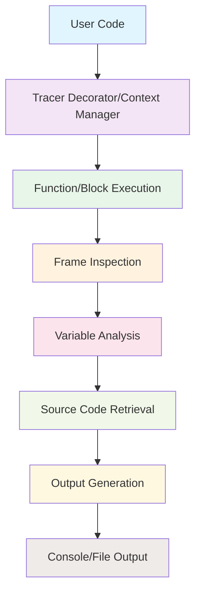

# `PySnooper`

## PySnooper Repository Documentation

### Tree Structure
```
PySnooper/
├── misc/
│   └── generate_authors.py
├── pysnooper/
│   ├── pycompat.py
│   ├── tracer.py
│   ├── utils.py
│   └── variables.py
└── setup.py
```

### Purpose
PySnooper is a powerful Python debugging tool that provides comprehensive code tracing and execution monitoring capabilities. It enables developers to observe function execution, track variable states, and analyze program flow without modifying the source code. This tool is particularly valuable for debugging complex functions where traditional debugging methods fall short.

**Target Users:**
- Python developers working on complex applications requiring detailed execution monitoring
- Debugging specialists who need to understand program behavior without intrusive breakpoints
- Software engineers performing performance analysis and optimization
- Developers working with generators, async code, or multithreaded applications

**Use Cases:**
- Debugging hard-to-reproduce issues in production code
- Monitoring function execution flow and variable changes
- Analyzing performance bottlenecks in complex algorithms
- Understanding behavior of generators and async functions
- Observing thread-specific execution patterns

### Architecture


**Key Abstractions:**
- **Tracer**: Core debugging component that manages tracing sessions and variable inspection
- **Variable Inspectors**: Specialized classes (Keys, Indices, Attrs, Exploding) that handle different data type inspection strategies
- **Output Management**: Flexible writing system supporting console, file, and custom output destinations
- **Cross-Version Compatibility**: Pycompat module ensures consistent behavior across Python versions

### Entry Points
1. **Decorator Interface**: `@snoop` decorator for tracing functions
2. **Context Manager**: `with snoop():` block tracing
3. **Direct Import**: `from pysnooper import Tracer` for programmatic control

**Usage Examples:**
```python
import pysnooper

@pysnooper.snoop()
def my_function(x, y):
    z = x + y
    return z

# Or as context manager
with pysnooper.Tracer():
    result = some_complex_operation()
```

### Core Features
1. **Function Tracing**: Monitor execution flow and variable changes in decorated functions
2. **Variable Watching**: Track specific variables or expressions during execution
3. **Multi-threading Support**: Handle thread-specific execution tracking
4. **File Output**: Write traces to files for later analysis
5. **Custom Representation**: Format specific object types with custom rules
6. **Performance Timing**: Measure execution duration of traced code blocks

### Dependencies
- **Standard Library**: inspect, sys, os, abc, collections, functools, traceback, threading, datetime, opcode, itertools, re, collections.abc
- **Cross-Version Compatibility**: pycompat module handles Python version differences
- **No External Dependencies**: Pure Python implementation relying only on standard library

### Extension Points
1. **Custom Variable Inspectors**: Subclass BaseVariable to add new inspection strategies
2. **Custom Output Writers**: Implement custom write functions for alternative output destinations
3. **Custom Representation Rules**: Add custom formatting rules for specific object types
4. **Thread Information**: Extend thread tracking capabilities for distributed systems

---

## Modules

- [`misc`](misc.md)
- [`pysnooper`](pysnooper.md)

