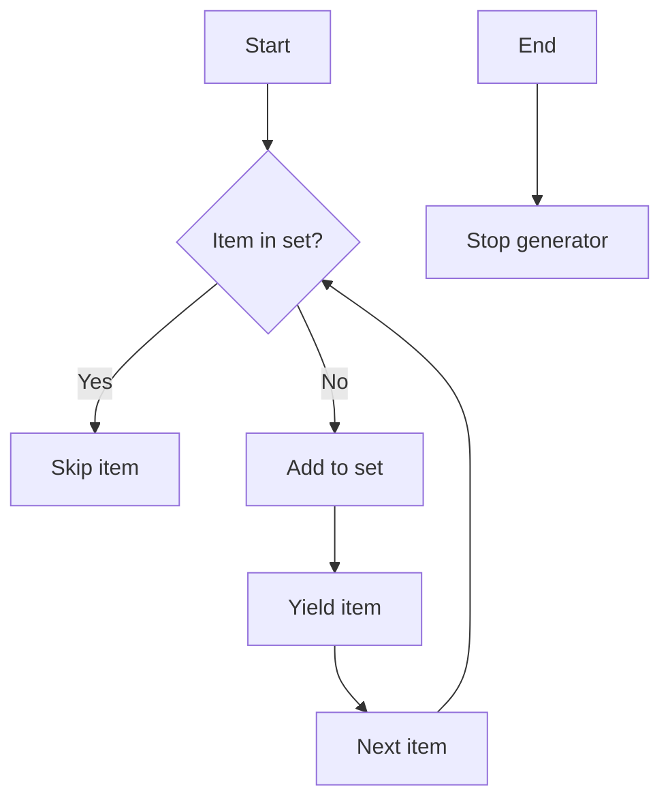

# `generate_authors.py`

## `misc.generate_authors.drop_recurrences` · *function*

## Summary:
Removes duplicate elements from an iterable while preserving their original order.

## Description:
A generator function that iterates through an input iterable and yields only the first occurrence of each element, effectively removing duplicates. This implementation maintains the order of elements as they first appear in the input.

## Args:
    iterable: An iterable object containing elements to deduplicate.

## Returns:
    A generator that yields unique elements in the order of their first appearance.

## Raises:
    None explicitly raised.

## Constraints:
    Preconditions:
        - Input must be iterable
        - Elements must be hashable (since they're stored in a set)
    
    Postconditions:
        - Output generator yields elements in the same order as their first appearance
        - Duplicate elements are excluded from output
        - All elements from input that appear at least once are included in output

## Side Effects:
    None.

## Control Flow:


## Examples:
    # Basic usage
    >>> list(drop_recurrences([1, 2, 2, 3, 1]))
    [1, 2, 3]
    
    # With strings
    >>> list(drop_recurrences(['a', 'b', 'a', 'c', 'b']))
    ['a', 'b', 'c']
    
    # With unhashable types (will raise TypeError)
    >>> list(drop_recurrences([[1], [2], [1]]))
    TypeError: unhashable type: 'list'
```

## `misc.generate_authors.iterate_authors_by_chronological_order` · *function*

## Summary:
Returns a sequence of unique author names from Git commit history in chronological order.

## Description:
Retrieves Git commit history for a specified branch and extracts author names in chronological order, removing duplicate entries. This function is designed to provide a clean list of contributors to a project based on commit history.

## Args:
    branch (str): The Git branch name to query for commit history. This parameter specifies which branch's commit log to process.

## Returns:
    generator: A generator yielding unique author names in chronological order. Each author name is a string representing the committer's name from Git.

## Raises:
    subprocess.CalledProcessError: When the Git command fails to execute properly, though this is not explicitly handled in the current implementation.

## Constraints:
    Preconditions:
        - The branch parameter must refer to a valid Git branch in the repository
        - Git must be installed and accessible in the system PATH
        - The repository must be a valid Git repository
    
    Postconditions:
        - The returned generator will yield author names in chronological order (oldest to newest commits)
        - All duplicate author names are removed from the result
        - Author names are extracted from Git commit logs using standard Git format

## Side Effects:
    - Executes a subprocess command (`git log`) which may involve I/O operations
    - May cause temporary disk I/O from Git's internal operations
    - No modifications to external state or files

## Control Flow:
```mermaid
flowchart TD
    A[Start] --> B[Execute git log command]
    B --> C[Capture stdout and stderr]
    C --> D[Decode UTF-8 output]
    D --> E[Split output into lines]
    E --> F[Process each line]
    F --> G{Line empty?}
    G -- Yes --> H[Skip line]
    G -- No --> I[Split line by semicolon]
    I --> J[Extract author name (index 1)]
    J --> K[Yield author name]
    K --> L[Continue to next line]
    L --> G
    M[End] --> N[Return generator]
```

## Examples:
    # Get authors from main branch
    >>> authors = iterate_authors_by_chronological_order("main")
    >>> list(authors)
    ['John Doe', 'Jane Smith', 'Bob Johnson']
    
    # Get authors from feature branch
    >>> authors = iterate_authors_by_chronological_order("feature/new-feature")
    >>> print(next(authors))
    'Alice Brown'

## `misc.generate_authors.print_authors` · *function*

## Summary:
Prints unique author names from Git commit history in chronological order to standard output.

## Description:
This function retrieves Git commit history for a specified branch and prints unique author names in chronological order (oldest to newest commits) to standard output. It leverages the `iterate_authors_by_chronological_order` helper function to fetch the author data and writes each author name followed by a newline character to stdout.

The function is designed to be used in command-line tools or scripts that need to display contributor information from Git repositories. It separates the concern of data retrieval (handled by `iterate_authors_by_chronological_order`) from the presentation logic (this function's responsibility to output the data).

## Args:
    branch (str): The Git branch name to query for commit history. This parameter specifies which branch's commit log to process.

## Returns:
    None: This function does not return any value. It performs output operations directly to stdout.

## Raises:
    subprocess.CalledProcessError: When the underlying Git command fails to execute properly, though this is not explicitly handled in the current implementation.

## Constraints:
    Preconditions:
        - The branch parameter must refer to a valid Git branch in the repository
        - Git must be installed and accessible in the system PATH
        - The repository must be a valid Git repository
    
    Postconditions:
        - Author names are printed to stdout in chronological order (oldest to newest commits)
        - Duplicate author names are automatically removed from the output
        - Each author name is followed by a newline character

## Side Effects:
    - Writes to standard output (stdout) using binary buffer writing
    - Executes a subprocess command (`git log`) which may involve I/O operations
    - May cause temporary disk I/O from Git's internal operations
    - No modifications to external state or files

## Control Flow:
```mermaid
flowchart TD
    A[Start print_authors] --> B[Call iterate_authors_by_chronological_order(branch)]
    B --> C[Iterate through author names]
    C --> D{Next author available?}
    D -- Yes --> E[Encode author name to bytes]
    E --> F[Write author to stdout.buffer]
    F --> G[Write newline to stdout.buffer]
    G --> H[Continue to next author]
    H --> D
    D -- No --> I[End iteration]
    I --> J[Function completes]
```

## Examples:
    # Print authors from main branch
    >>> print_authors("main")
    John Doe
    Jane Smith
    Bob Johnson
    
    # Print authors from feature branch
    >>> print_authors("feature/new-feature")
    Alice Brown
    Charlie Davis
    Eve Wilson
```

