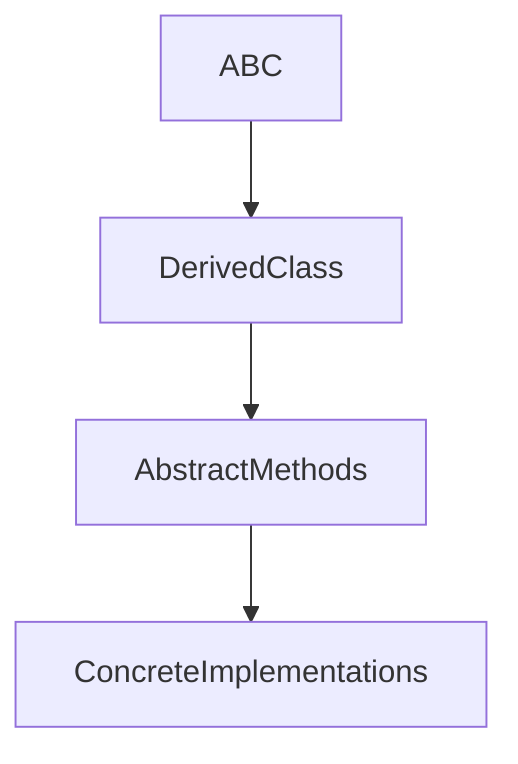
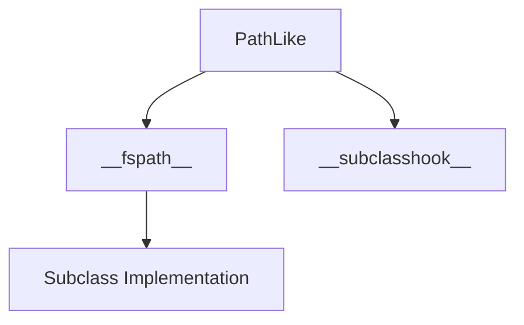
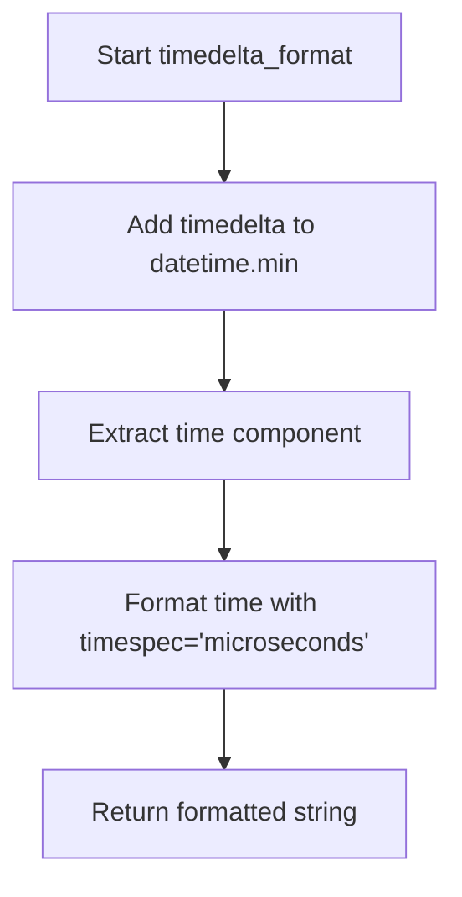
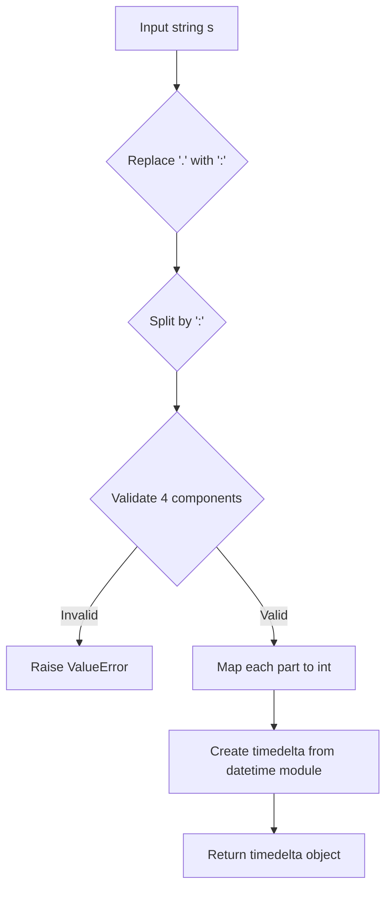

# `pycompat.py`

## `pysnooper.pycompat.ABC` · *class*

## Summary:
Abstract Base Class compatibility wrapper for cross-version Python support.

## Description:
A compatibility shim that provides the ABC functionality in older Python versions. This class serves as a drop-in replacement for `abc.ABC` in Python versions prior to 3.4, allowing developers to define abstract base classes without version-specific conditional imports.

## State:
- No instance attributes: This is a pure metaclass marker with no state
- Class-level metaclass: `abc.ABCMeta` ensures proper abstract base class behavior
- No initialization parameters: The class doesn't accept constructor arguments

## Lifecycle:
- Creation: Instantiated like any regular class, but primarily used as a base class
- Usage: Inherit from this class to create abstract base classes
- Destruction: No special cleanup required - follows normal Python object lifecycle

## Method Map:


## Raises:
- No exceptions raised during instantiation
- Abstract method enforcement occurs at subclass instantiation time

## Example:
```python
# Define an abstract base class
class MyABC(pysnooper.pycompat.ABC):
    @abstractmethod
    def my_method(self):
        pass

# Create concrete implementation
class ConcreteClass(MyABC):
    def my_method(self):
        return "implemented"

# Usage
obj = ConcreteClass()  # Works fine
# obj = MyABC()       # Would raise TypeError due to abstract methods
```

## `pysnooper.pycompat.PathLike` · *class*

## Summary:
Abstract base class implementing the os.PathLike protocol for path-like objects.

## Description:
The PathLike class defines an abstract base class that implements the os.PathLike protocol. It requires subclasses to implement the `__fspath__` method which should return a string or bytes representation of a path. The class also provides a `__subclasshook__` mechanism that enables automatic recognition of path-like objects through duck typing.

This class serves as a foundation for creating path-like objects that can be used with Python's filesystem APIs.

## State:
- `__fspath__`: Abstract method that must be implemented by subclasses to return a string or bytes representation of a path. Raises NotImplementedError when called on the base class instance.
- `__subclasshook__`: Class method that determines if a class qualifies as a PathLike subclass by checking for the presence of `__fspath__` method or classes with 'path' in their name containing an 'open' method.

## Lifecycle:
- Creation: Cannot be instantiated directly due to abstract method requirements
- Usage: Subclasses must implement `__fspath__` to provide path conversion functionality
- Destruction: No special cleanup required

## Method Map:


## Raises:
- `NotImplementedError`: Raised when `__fspath__` is called on the abstract base class, indicating that subclasses must override this method

## Example:
```python
from pysnooper.pycompat import PathLike

class MyPath(PathLike):
    def __init__(self, path):
        self.path = path
    
    def __fspath__(self):
        return self.path

# Usage
mypath = MyPath("/tmp/example.txt")
# This satisfies the os.PathLike protocol
```

### `pysnooper.pycompat.PathLike.__fspath__` · *method*

## Summary:
Returns the string representation of a path-like object, implementing the os.PathLike protocol.

## Description:
This abstract method defines the interface for path-like objects in the os.PathLike protocol. It must be implemented by subclasses to return a string representation of the path. The method is called by functions that accept path-like objects, allowing them to work with custom path-like classes seamlessly.

## Args:
    self: The instance of the path-like object implementing this method.

## Returns:
    str: A string representation of the path.

## Raises:
    NotImplementedError: Always raised by the base implementation, indicating that subclasses must override this method.

## State Changes:
    Attributes READ: None
    Attributes WRITTEN: None

## Constraints:
    Preconditions: This method should only be called on instances of subclasses that properly implement the method.
    Postconditions: When implemented, the method should return a valid string representation of a path.

## Side Effects:
    None

### `pysnooper.pycompat.PathLike.__subclasshook__` · *method*

## Summary:
Determines if a class qualifies as a path-like object according to the os.PathLike protocol.

## Description:
This method implements the abstract base class hook mechanism to dynamically classify objects as path-like without requiring explicit inheritance. It enables isinstance() and issubclass() checks to recognize classes that implement the path-like interface, making the PathLike ABC compatible with the os.PathLike protocol.

The method uses two criteria to determine path-likeness:
1. Presence of the __fspath__ method (standard os.PathLike protocol)
2. Presence of an 'open' method AND 'path' in the class name (heuristic fallback)

This approach allows for duck-typing compatibility with path-like objects while maintaining the benefits of ABC enforcement.

## Args:
    cls: The PathLike class itself (passed automatically by Python's ABC mechanism)
    subclass: The class being tested for path-like compatibility

## Returns:
    bool: True if the subclass implements the path-like interface, False otherwise

## Raises:
    None: This method does not raise exceptions directly

## State Changes:
    Attributes READ: None
    Attributes WRITTEN: None

## Constraints:
    Preconditions: 
    - The subclass parameter must be a class object (not an instance)
    - The method is called automatically by Python's ABC machinery during isinstance()/issubclass() checks
    
    Postconditions:
    - Returns a boolean value indicating path-like compatibility
    - Does not modify any state of the PathLike class or the subclass

## Side Effects:
    None: This method performs only attribute checks and does not cause any I/O operations or external service calls

## `pysnooper.pycompat.timedelta_format` · *function*

## Summary:
Converts a timedelta object into a time string with microsecond precision.

## Description:
Formats a timedelta object by adding it to the minimum datetime value, extracting the resulting time component, and applying time formatting with microsecond precision. This function serves as a compatibility wrapper for time formatting in the pysnooper library.

## Args:
    timedelta (datetime.timedelta): A timedelta object to convert to time string format.

## Returns:
    str: A time string representation with microsecond precision.

## Raises:
    AttributeError: When datetime operations or time formatting functions are not available.

## Constraints:
    Preconditions: The timedelta argument must be a valid datetime.timedelta object.
    Postconditions: Returns a time string formatted with microsecond precision.

## Side Effects:
    None

## Control Flow:


## Examples:
    >>> from datetime import timedelta
    >>> # Converts timedelta to time string format
    >>> # Result format depends on time_isoformat implementation
```

## `pysnooper.pycompat.timedelta_parse` · *function*

## Summary
Parses a time duration string into a datetime.timedelta object.

## Description
Converts a string representation of time duration (in hours:minutes:seconds.microseconds format) into a datetime.timedelta object. This function normalizes time strings that may contain periods as decimal separators by converting them to colon-separated format before parsing.

## Args
    s (str): Time duration string in format "HH:MM:SS.MICROSECONDS" where hours, minutes, seconds, and microseconds are integers separated by colons and optional periods. Must contain exactly 4 numeric components when processed.

## Returns
    datetime.timedelta: A timedelta object representing the parsed time duration with hours, minutes, seconds, and microseconds components set accordingly.

## Raises
    ValueError: When the input string cannot be properly parsed or converted to integers, or when the string doesn't contain exactly 4 components after processing.

## Constraints
    Precondition: Input string must be in valid HH:MM:SS.MICROSECONDS format with exactly 4 numeric components
    Postcondition: Returns a valid datetime.timedelta object with the specified time components

## Side Effects
    None

## Control Flow


## Examples
    >>> timedelta_parse("01:30:45.123456")
    datetime.timedelta(hours=1, minutes=30, seconds=45, microseconds=123456)
    
    >>> timedelta_parse("00:00:00.000001")
    datetime.timedelta(microseconds=1)
    
    >>> timedelta_parse("23:59:59.999999")
    datetime.timedelta(hours=23, minutes=59, seconds=59, microseconds=999999)
```

