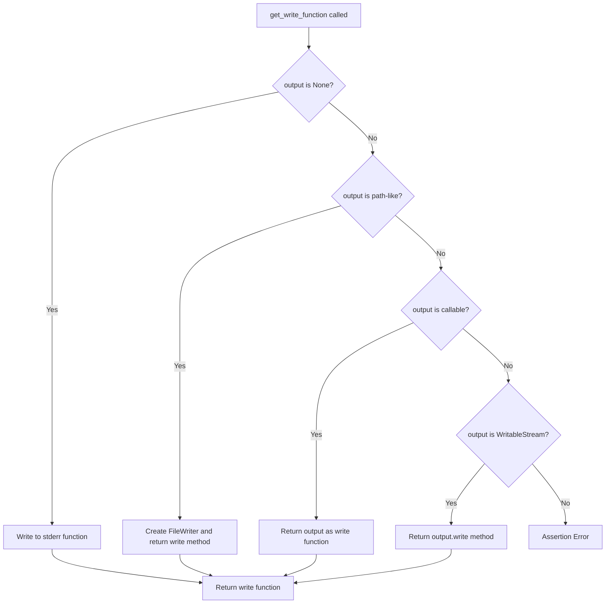

# `tracer.py`

## `pysnooper.tracer.get_local_reprs` · *function*

## Summary
Generates a sorted, formatted dictionary of local variable representations from a Python execution frame, including additional watched variables.

## Description
Processes local variables from a Python frame to create string representations suitable for debugging output. This function organizes variables in declaration order and incorporates additional watched variables for comprehensive inspection. It's a core utility in the pysnooper library for capturing variable states during code execution tracing.

The function first extracts all local variables from the frame, generates their string representations using `utils.get_shortish_repr`, sorts them according to variable declaration order, and then appends any additional watched variables that were specified for monitoring.

## Args
- frame (frame): A Python frame object containing local variables to process
- watch (tuple, optional): Collection of variable objects (typically BaseVariable instances) to monitor and include in the result. Defaults to empty tuple.
- custom_repr (tuple, optional): Custom representation rules as (condition, action) pairs for formatting specific object types. Defaults to empty tuple.
- max_length (int, optional): Maximum length for string representations. If None, no truncation occurs. Defaults to None.
- normalize (bool): Whether to apply normalization to remove certain patterns from representations. Defaults to False.

## Returns
- collections.OrderedDict: An ordered dictionary mapping variable names to their string representations, sorted by variable declaration order. Includes both regular local variables and watched variables.

## Raises
- None explicitly raised by this function

## Constraints
- Preconditions:
  - frame must be a valid Python frame object with f_locals attribute
  - watch must be iterable containing objects with items() method
  - custom_repr must be iterable of (condition, action) tuples
  - max_length, when provided, must be a non-negative integer or None
  - normalize must be a boolean value

- Postconditions:
  - Returns an OrderedDict with all local variables and watched variables
  - Variable order follows declaration order in the frame's code object
  - All representations are properly formatted via utils.get_shortish_repr

## Side Effects
- None

## Control Flow
```mermaid
flowchart TD
    A[Start get_local_reprs] --> B[Extract code object from frame]
    B --> C[Build vars_order from co_varnames, co_cellvars, co_freevars, and f_locals keys]
    C --> D[Process f_locals items with get_shortish_repr]
    D --> E[Sort result_items by vars_order index]
    E --> F[Create OrderedDict from sorted items]
    F --> G{Watch variables provided?}
    G -- Yes --> H[Iterate through watch variables]
    H --> I[Call variable.items(frame, normalize) for each watch variable]
    I --> J[Update OrderedDict with sorted watch items]
    J --> K[Return result]
    G -- No --> K
```

## Examples
```python
# Basic usage with a frame object
result = get_local_reprs(frame)

# Usage with custom representation and length limits
result = get_local_reprs(frame, custom_repr=(lambda x: isinstance(x, int), str), max_length=50)

# Usage with watched variables - typically used internally by pysnooper
watched_var = BaseVariable("some_variable")
result = get_local_reprs(frame, watch=(watched_var,))

# Typical usage pattern in pysnooper debugging
# This function is called internally by pysnooper when tracing code execution
```

## `pysnooper.tracer.UnavailableSource` · *class*

## Summary:
A sentinel class that provides a consistent fallback message when source code cannot be retrieved.

## Description:
The `UnavailableSource` class serves as a placeholder object used when pysnooper cannot obtain source code for a frame. It implements the `__getitem__` method to always return the string "SOURCE IS UNAVAILABLE", ensuring that when source code is not accessible, a clear and consistent message is displayed instead of causing errors or returning None.

This class is typically instantiated by the `get_path_and_source_from_frame` function when all attempts to retrieve source code from various sources (file system, loaders, IPython, etc.) fail.

## State:
- `__getitem__` method: Takes an integer index parameter and always returns the string "SOURCE IS UNAVAILABLE"
- No instance attributes or state beyond the method implementation

## Lifecycle:
- Creation: Instantiated automatically by `get_path_and_source_from_frame` when source code retrieval fails
- Usage: Accessed via indexing (e.g., `source[0]`) to retrieve the fallback message
- Destruction: Managed automatically by Python's garbage collection

## Method Map:
```mermaid
graph TD
    A[get_path_and_source_from_frame] --> B[UnavailableSource()]
    B --> C[source[0] returns "SOURCE IS UNAVAILABLE"]
```

## Raises:
- This class does not raise any exceptions as it simply returns a constant string regardless of input

## Example:
```python
# When source code cannot be retrieved
source = UnavailableSource()
message = source[0]  # Returns "SOURCE IS UNAVAILABLE"

# In pysnooper context
# When tracing a function where source cannot be read:
# Source path: /some/path/file.py
# 123    SOURCE IS UNAVAILABLE
```

### `pysnooper.tracer.UnavailableSource.__getitem__` · *method*

## Summary:
Returns a constant string indicating that source code is unavailable for indexing operations.

## Description:
This method serves as a fallback implementation when source code cannot be retrieved for inspection. It implements the __getitem__ protocol to provide a consistent response regardless of the index requested, ensuring that code analysis tools can gracefully handle cases where source code is inaccessible.

## Args:
    i (int): Index parameter for the getitem operation, unused in implementation

## Returns:
    str: Always returns the string 'SOURCE IS UNAVAILABLE'

## Raises:
    None: This method does not raise any exceptions

## State Changes:
    Attributes READ: None
    Attributes WRITTEN: None

## Constraints:
    Preconditions: None
    Postconditions: Always returns the same constant string value

## Side Effects:
    None: This method performs no I/O operations or external service calls

## `pysnooper.tracer.get_path_and_source_from_frame` · *function*

## Summary:
Retrieves the file path and source code lines from a Python frame object, handling various source locations and encoding scenarios.

## Description:
Extracts file path and source code from a frame object, implementing a multi-layered approach to source retrieval. The function first checks a cache for previously retrieved source data, then attempts to get source through various methods including module loaders, IPython history, Ansible archives, and direct file reading. It handles encoding detection for byte-based source content and provides a fallback mechanism when source cannot be retrieved.

This function is extracted from inline logic to centralize source retrieval logic and provide a consistent interface for accessing source code regardless of where it originates (regular files, IPython sessions, Ansible archives, etc.).

## Args:
    frame (types.FrameType): A Python frame object containing execution context information

## Returns:
    tuple[str, list[str] or UnavailableSource]: A tuple containing:
        - file_name (str): The absolute path to the source file
        - source (list[str] or UnavailableSource): Either a list of source code lines or an UnavailableSource sentinel object

## Raises:
    None explicitly raised - all exceptions are caught and handled internally

## Constraints:
    Preconditions:
        - The frame parameter must be a valid Python frame object
        - The frame's f_globals dictionary should contain appropriate metadata (__name__, __loader__)
        - The frame's f_code.co_filename should be a valid file path
    
    Postconditions:
        - Always returns a tuple with two elements
        - The second element is either a list of strings or an UnavailableSource instance
        - The result is cached for future calls with the same frame

## Side Effects:
    - Reads from the file system when source is not cached or available through loaders
    - Accesses IPython history manager when processing IPython frames
    - Reads from ZIP archives when processing Ansible frames
    - Modifies the global source_and_path_cache dictionary

## Control Flow:
```mermaid
flowchart TD
    A[Start get_path_and_source_from_frame] --> B{Cache Hit?}
    B -- Yes --> C[Return cached result]
    B -- No --> D[Get loader from globals]
    D --> E{Loader has get_source?}
    E -- Yes --> F[Call loader.get_source]
    F --> G{Source obtained?}
    G -- Yes --> H[Split source into lines]
    G -- No --> I[Check for IPython pattern]
    I --> J{IPython match?}
    J -- Yes --> K[Access IPython history]
    K --> L{History access successful?}
    L -- Yes --> M[Split history source into lines]
    L -- No --> N[Check for Ansible pattern]
    N --> O{Ansible match?}
    O -- Yes --> P[Read from ZIP archive]
    P --> Q{Archive read successful?}
    Q -- Yes --> R[Split archive source into lines]
    Q -- No --> S[Read from file system]
    S --> T{File read successful?}
    T -- Yes --> U[Split file source into lines]
    T -- No --> V[Set UnavailableSource]
    V --> W[Handle encoding detection]
    W --> X[Return (file_name, source)]
```

## Examples:
```python
# Basic usage with a regular Python frame
frame = inspect.currentframe()
file_path, source_lines = get_path_and_source_from_frame(frame)
print(f"File: {file_path}")
print(f"Source lines: {len(source_lines)}")

# When source cannot be retrieved
frame = some_frame_with_unavailable_source()
file_path, source = get_path_and_source_from_frame(frame)
if isinstance(source, UnavailableSource):
    print("Source is unavailable")
else:
    print(f"Source has {len(source)} lines")
```

## `pysnooper.tracer.get_write_function` · *function*

## Summary:
Creates and returns an appropriate write function based on the output destination specification.

## Description:
This function acts as a factory that determines the correct writing mechanism based on the type of the `output` parameter. It encapsulates the logic for handling different output destinations including standard error, files, callable objects, and writable streams. This extraction allows the calling code to consistently work with a simple write function regardless of the underlying output mechanism.

## Args:
    output (None, str, pathlib.Path, callable, or WritableStream): Specifies where to write output. 
        - If None, output is written to stderr
        - If str or pathlib.Path, output is written to a file at that path
        - If callable, the callable itself is returned as the write function
        - Otherwise, assumes it's a WritableStream and uses its write method
    overwrite (bool): When True, overwrites existing files when writing to a file path. 
        Must be used only when output is a file path.

## Returns:
    callable: A write function that accepts a string argument and writes it to the determined destination.

## Raises:
    Exception: Raised when overwrite=True is specified but output is not a file path (str or pathlib.Path).

## Constraints:
    Preconditions:
        - If overwrite=True, then output must be a path-like object (str or pathlib.Path)
        - output parameter must be one of: None, str, pathlib.Path, callable, or WritableStream
    
    Postconditions:
        - Always returns a callable write function
        - The returned function accepts a single string argument

## Side Effects:
    - When output is a file path, may create or modify files on disk
    - When output is None, writes to standard error stream
    - May raise file I/O exceptions when writing to files

## Control Flow:


## Examples:
```python
# Write to stderr
write_func = get_write_function(None, False)
write_func("Debug message\\n")

# Write to file (overwrites)
write_func = get_write_function("/tmp/debug.log", True)
write_func("Trace output\\n")

# Write to custom callable
def custom_writer(s):
    print(f"Custom: {s}")
write_func = get_write_function(custom_writer, False)
write_func("Message\\n")

# Write to writable stream
import sys
write_func = get_write_function(sys.stdout, False)
write_func("Output to stdout\\n")
```

## `pysnooper.tracer.FileWriter` · *class*

## Summary:
A file writer utility that handles writing content to files with overwrite or append behavior.

## Description:
The FileWriter class provides a simple interface for writing content to files. It maintains state about whether to overwrite existing files or append to them, making it suitable for logging or tracing operations where file behavior needs to be controlled. This class is typically used in debugging contexts where trace output needs to be written to a file.

## State:
- path (str): The file path to write to, converted to text type for compatibility
- overwrite (bool): Flag indicating whether to overwrite existing file content (True) or append to it (False)

## Lifecycle:
- Creation: Instantiate with a file path and overwrite boolean flag
- Usage: Call write() method with string content to write to the file
- Destruction: No explicit cleanup required; relies on Python's file handling

## Method Map:
```mermaid
graph TD
    A[FileWriter.__init__] --> B[FileWriter.write]
    B --> C[open(file, 'w' or 'a', encoding='utf-8')]
    C --> D[output_file.write(s)]
    D --> E[overwrite = False]
```

## Raises:
- None explicitly raised by __init__
- May raise standard file I/O exceptions during write operation (IOError, OSError)

## Example:
```python
# Create a FileWriter that overwrites the file
writer = FileWriter('/tmp/trace.log', overwrite=True)
writer.write('First line of trace\n')

# Create a FileWriter that appends to the file  
writer = FileWriter('/tmp/trace.log', overwrite=False)
writer.write('Second line of trace\n')
```

### `pysnooper.tracer.FileWriter.__init__` · *method*

## Summary:
Initializes a FileWriter instance with a target file path and overwrite behavior configuration.

## Description:
Configures the FileWriter object to manage file operations with the specified path and overwrite settings. This method prepares the object's internal state for subsequent write operations.

## Args:
    path (str): The file path where content will be written. Converted to text type for compatibility.
    overwrite (bool): Flag indicating whether to overwrite existing file content (True) or append to it (False).

## Returns:
    None: This method does not return a value.

## Raises:
    None: This method does not explicitly raise exceptions.

## State Changes:
    Attributes READ: None
    Attributes WRITTEN: self.path, self.overwrite

## Constraints:
    Preconditions: The path argument should be a valid file path string.
    Postconditions: The FileWriter instance will have self.path set to the text-converted path and self.overwrite set to the provided boolean value.

## Side Effects:
    None: This method performs no I/O operations or external service calls.

### `pysnooper.tracer.FileWriter.write` · *method*

## Summary:
Writes a string to a file using either write or append mode based on the overwrite flag, then disables future overwrites.

## Description:
This method handles writing string content to a file specified by the FileWriter's path attribute. It determines whether to overwrite the existing file or append to it based on the `overwrite` flag. After writing, it resets the overwrite flag to prevent subsequent writes from overwriting.

## Args:
    s (str): The string content to write to the file.

## Returns:
    None: This method does not return any value.

## Raises:
    IOError: If the file cannot be opened or written to due to permission issues or invalid paths.

## State Changes:
    Attributes READ: self.path, self.overwrite
    Attributes WRITTEN: self.overwrite

## Constraints:
    Preconditions: 
    - The FileWriter instance must have been initialized with a valid path
    - The `s` parameter must be a string
    - The file system must allow writing to the specified path
    
    Postconditions:
    - The string content is written to the file at self.path
    - self.overwrite is set to False after execution

## Side Effects:
    - Performs file I/O operations
    - May modify the contents of the file at self.path
    - Writes data to disk

## `pysnooper.tracer.Tracer` · *class*

*No documentation generated.*

### `pysnooper.tracer.Tracer.__init__` · *method*

## Summary:
Initializes a Tracer instance with configuration options for debugging output and variable tracking.

## Description:
Configures the Tracer object with various settings that control how debug information is captured and displayed. This method sets up internal state management, variable watching mechanisms, and output handling for the tracing functionality. It processes watch parameters to convert them into appropriate variable tracking objects and configures output formatting options.

## Args:
    output (None, str, pathlib.Path, callable, or WritableStream, optional): Specifies where to write output. If None, output is written to stderr. If str or pathlib.Path, output is written to a file at that path. If callable, the callable itself is returned as the write function. Otherwise, assumes it's a WritableStream and uses its write method. Defaults to None.
    watch (tuple, optional): Tuple of variable names or expressions to watch during tracing. These will be tracked with normal representation. Defaults to ().
    watch_explode (tuple, optional): Tuple of variable names or expressions to watch with deep inspection during tracing. These will be tracked with exploding representation. Defaults to ().
    depth (int, optional): Maximum frame depth to trace. Must be >= 1. Defaults to 1.
    prefix (str, optional): Prefix string added to each traced line. Defaults to ''.
    overwrite (bool, optional): When True, overwrites existing files when writing to a file path. Must be used only when output is a file path. Defaults to False.
    thread_info (bool, optional): Whether to include thread information in output. Defaults to False.
    custom_repr (tuple, optional): Custom representation functions for specific types. Can be a tuple of (type, repr_function) pairs or a single (type, repr_function) pair. Defaults to ().
    max_variable_length (int, optional): Maximum length of variable representations. Defaults to 100.
    normalize (bool, optional): Whether to normalize whitespace in output. Defaults to False.
    relative_time (bool, optional): Whether to show relative timestamps. Defaults to False.
    color (bool, optional): Whether to use colored output. Defaults to True.

## Returns:
    None: This is a constructor method that initializes the object's state.

## Raises:
    AssertionError: When depth is less than 1.

## State Changes:
    Attributes READ: None
    Attributes WRITTEN: 
    - self._write: Set to the result of get_write_function(output, overwrite)
    - self.watch: Set to a combined list of watched variables where:
      * Items in watch are converted to CommonVariable instances
      * Items in watch_explode are converted to Exploding instances
      * Both lists are concatenated into a single watch list
    - self.frame_to_local_reprs: Initialized as empty dict
    - self.start_times: Initialized as empty dict
    - self.depth: Set to the provided depth value
    - self.prefix: Set to the provided prefix value
    - self.thread_info: Set to the provided thread_info value
    - self.thread_info_padding: Initialized to 0
    - self.target_codes: Initialized as empty set
    - self.target_frames: Initialized as empty set
    - self.thread_local: Initialized as threading.local()
    - self.custom_repr: Set to processed custom_repr value where:
      * If custom_repr is a tuple of 2 items that are not iterable, it's wrapped in a tuple
      * Otherwise, it remains as provided
    - self.last_source_path: Initialized to None
    - self.max_variable_length: Set to the provided max_variable_length value
    - self.normalize: Set to the provided normalize value
    - self.relative_time: Set to the provided relative_time value
    - self.color: Set based on color parameter and platform support
    - self._FOREGROUND_BLUE, _FOREGROUND_CYAN, _FOREGROUND_GREEN, _FOREGROUND_MAGENTA, _FOREGROUND_RED, _FOREGROUND_RESET, _FOREGROUND_YELLOW, _STYLE_BRIGHT, _STYLE_DIM, _STYLE_NORMAL, _STYLE_RESET_ALL: Set based on color flag

## Constraints:
    Preconditions:
    - depth must be >= 1
    - If overwrite=True, then output must be a path-like object (str or pathlib.Path)
    - output parameter must be one of: None, str, pathlib.Path, callable, or WritableStream
    - custom_repr must be either a tuple of (type, repr_function) pairs or a single (type, repr_function) pair
    
    Postconditions:
    - All internal state attributes are properly initialized
    - self._write is always a callable write function
    - self.watch contains properly converted variable objects (CommonVariable and Exploding instances)
    - self.depth is guaranteed to be >= 1 due to assertion
    - self.custom_repr is properly formatted as a tuple of (type, repr_function) pairs

## Side Effects:
    - May create or modify files on disk when output specifies a file path
    - Writes to standard error stream when output is None
    - May raise file I/O exceptions when writing to files

### `pysnooper.tracer.Tracer.__call__` · *method*

## Summary:
Enables tracing for functions or classes by wrapping them with monitoring capabilities.

## Description:
This method serves as the entry point for the pysnooper tracer decorator. It determines whether the input is a function or class and applies appropriate wrapping logic. When tracing is disabled via the global `DISABLED` flag, the original object is returned unchanged. Otherwise:
- For functions: delegates to `self._wrap_function()` to create a traced wrapper
- For classes: delegates to `self._wrap_class()` to trace all methods in the class

## Args:
    function_or_class (callable or type): A function or class to be traced. If a class is provided, all its methods will be wrapped.

## Returns:
    callable or type: The original function or class, wrapped with tracing functionality if tracing is enabled, or returned unchanged if tracing is disabled.

## Raises:
    NotImplementedError: Raised by `_wrap_function` when attempting to wrap coroutine or async generator functions (though not directly raised by this method).

## State Changes:
    Attributes READ: None
    Attributes WRITTEN: None

## Constraints:
    Preconditions: The input must be either a callable function or a class type.
    Postconditions: If tracing is enabled, the returned object will have tracing behavior applied; if disabled, the original object is returned unchanged.

## Side Effects:
    None directly, but the wrapped objects will produce tracing output when executed.

### `pysnooper.tracer.Tracer._wrap_class` · *method*

## Summary:
Wraps all functions in a class with tracing functionality while skipping coroutine functions.

## Description:
This method processes all attributes of a given class and replaces regular functions with their traced counterparts. It's used internally by the Tracer class to enable function tracing for entire classes rather than individual functions. The method specifically excludes coroutine functions and generator functions, focusing only on standard Python functions.

## Args:
    cls (type): The class whose methods need to be wrapped with tracing functionality.

## Returns:
    type: The same class with its methods replaced by traced versions.

## Raises:
    None explicitly raised by this method.

## State Changes:
    Attributes READ: None
    Attributes WRITTEN: None (the method modifies the class in-place but doesn't read/write any instance attributes)

## Constraints:
    Preconditions: The argument must be a valid Python class object.
    Postconditions: All regular functions in the class are replaced with traced versions, and the class object is returned unchanged.

## Side Effects:
    Modifies the class object in-place by replacing function attributes with wrapped versions.
    No external I/O or service calls are made.

### `pysnooper.tracer.Tracer._wrap_function` · *method*

## Summary:
Wraps a function with tracing capabilities, returning an appropriate wrapper based on function type.

## Description:
This method creates a traced wrapper around the provided function to enable detailed execution monitoring. It handles different function types appropriately:
- Coroutine and async generator functions raise NotImplementedError (unsupported)
- Generator functions receive a special generator wrapper that traces each yield point
- Regular functions receive a simple wrapper that traces the entire execution

The wrapper ensures that when the function is called, the Tracer's context manager (`__enter__` and `__exit__`) is activated, enabling variable tracking and execution logging.

## Args:
    function (callable): The function to be wrapped with tracing functionality.

## Returns:
    callable: A wrapper function that executes the original function under tracing context. The specific wrapper type depends on the input function's nature:
    - For generator functions: returns `generator_wrapper` 
    - For regular functions: returns `simple_wrapper`
    - For coroutine/async generator functions: raises NotImplementedError

## Raises:
    NotImplementedError: When attempting to wrap a coroutine function or async generator function.

## State Changes:
    Attributes READ: None
    Attributes WRITTEN: `self.target_codes` (adds the function's code object to the set)

## Constraints:
    Preconditions: The input must be a callable function object.
    Postconditions: The returned wrapper will execute the original function with tracing enabled.

## Side Effects:
    None directly, but the returned wrapper will cause tracing output when executed.

### `pysnooper.tracer.Tracer.write` · *method*

## Summary:
Formats and writes debug information with a prefix to the configured output destination.

## Description:
Writes a string to the configured output destination by prepending the tracer's prefix and appending a newline character. This method serves as the primary interface for emitting debug log entries from the tracer, ensuring consistent formatting across all traced execution information.

## Args:
    s (str): The string content to write, typically containing debug information about function execution, variable states, or execution events.

## Returns:
    None: This method does not return a value.

## Raises:
    Exception: May raise exceptions from the underlying write function (`self._write`) when writing to files or streams fails.

## State Changes:
    Attributes READ: 
        - self.prefix: Used to prepend to the string before writing
    Attributes WRITTEN: 
        - None: This method does not modify any instance attributes directly

## Constraints:
    Preconditions:
        - The Tracer instance must be properly initialized with a valid `_write` function
        - The `s` parameter must be a string that can be formatted with the prefix
    Postconditions:
        - The formatted string (prefix + s + newline) is written to the configured output destination
        - The method does not alter the state of the Tracer instance

## Side Effects:
    - Writes to the configured output destination (stderr, file, or custom writer)
    - May cause file I/O operations when writing to files
    - May produce console output when writing to stderr or stdout

### `pysnooper.tracer.Tracer.__enter__` · *method*

## Summary:
Enters the tracing context by setting up frame tracing and recording start time for the calling frame.

## Description:
This method is part of the context manager protocol and is called when entering a `with` statement. It configures the tracer to begin monitoring the calling frame's execution by installing trace functions and tracking execution metadata. The method handles disabling tracing when the global DISABLED flag is set, manages thread-local state for trace function stacks, and sets up the tracing infrastructure for the current execution context.

Known callers:
- Called automatically by Python's context manager protocol when using `with Tracer():` syntax
- Invoked during function wrapping in `_wrap_function` method when a traced function is called

This logic is separated into its own method because it needs to:
1. Set up the tracing infrastructure before execution begins
2. Manage thread-local state for nested tracing contexts
3. Record timing information for performance measurement
4. Handle the special case of disabled tracing gracefully

## Returns:
    None: This method does not return a value.

## State Changes:
    Attributes READ:
    - self._is_internal_frame
    - self.trace
    - self.target_frames
    - self.thread_local
    - self.start_times

    Attributes WRITTEN:
    - thread_global.depth: Incremented to track nesting level
    - self.target_frames: Added calling_frame if not internal
    - self.start_times: Recorded start time for calling_frame
    - sys.trace: Set to self.trace to begin tracing

## Constraints:
    Preconditions:
    - The Tracer instance must be properly initialized
    - The calling frame must be available via inspect.currentframe().f_back
    - Thread-local storage must be accessible

    Postconditions:
    - The calling frame will be registered for tracing if it's not an internal frame
    - System-wide tracing will be enabled via sys.settrace
    - Original trace function will be preserved on the thread-local stack
    - Start time for the calling frame will be recorded

## Side Effects:
    - Modifies global sys.trace function to enable tracing
    - Sets up frame tracing on the calling frame
    - May modify thread-local storage for trace function management
    - Records execution start time for performance tracking

### `pysnooper.tracer.Tracer.__exit__` · *method*

## Summary:
Exits a tracing context and reports the elapsed time for the traced operation.

## Description:
This method is called when exiting a tracing context (typically via a `with` statement) to clean up tracing resources and display the execution duration of the traced code block. It restores the previous trace function, removes tracking data for the current frame, and formats and writes the elapsed time information to the configured output.

## Args:
    exc_type (type or None): Exception type if an exception occurred during execution, otherwise None
    exc_value (Exception or None): Exception instance if an exception occurred during execution, otherwise None  
    exc_traceback (traceback or None): Traceback if an exception occurred during execution, otherwise None

## Returns:
    None: This method always returns None

## Raises:
    None explicitly raised by this method

## State Changes:
    Attributes READ:
        - self.thread_local.original_trace_functions
        - self._FOREGROUND_YELLOW
        - self._STYLE_DIM
        - self._STYLE_NORMAL
        - self._STYLE_RESET_ALL
        - self.start_times
        - thread_global.depth

    Attributes WRITTEN:
        - self.thread_local.original_trace_functions (popped from stack)
        - self.target_frames (discarded calling_frame)
        - self.frame_to_local_reprs (removed entry for calling_frame)
        - self.start_times (removed entry for calling_frame)

## Constraints:
    Preconditions:
        - The Tracer instance must be in a tracing context (i.e., __enter__ was previously called)
        - The calling frame must be tracked by this tracer instance
        - The DISABLED flag must be False for actual tracing to occur
        
    Postconditions:
        - The previous trace function is restored in the thread's trace function stack
        - Tracking data for the calling frame is cleaned up
        - Elapsed time is written to the configured output destination
        - The thread's depth counter is decremented

## Side Effects:
    - Writes formatted timing information to the configured output destination
    - Modifies the thread's trace function stack by restoring the previous trace function
    - Updates thread-global depth counter
    - May perform I/O operations when writing to output destination

### `pysnooper.tracer.Tracer._is_internal_frame` · *method*

## Summary:
Determines whether a given frame represents internal tracer code rather than user code being traced.

## Description:
This method checks if a frame's source file matches the source file of the Tracer.__enter__ method, identifying frames that belong to the internal implementation of the tracer rather than the user's code being monitored. This distinction is crucial for proper tracing behavior, particularly when filtering out internal frames from trace output and preventing recursive tracing issues.

Known callers and usage context:
- Called from `Tracer.__enter__` method during context setup to avoid tracing internal frames
- Called from `Tracer.trace` method when depth > 1 to skip internal frames in the call stack
- Used as part of the frame filtering logic to ensure only user code is traced

This logic is separated into its own method rather than being inlined because:
1. It provides a reusable predicate for determining internal vs user frames
2. It centralizes the filename comparison logic for consistency
3. It makes the tracing logic cleaner and more readable by abstracting this check

## Args:
    frame (FrameType): A Python frame object representing the execution context to check

## Returns:
    bool: True if the frame's source file matches the Tracer.__enter__ method's source file, indicating it's an internal frame; False otherwise

## Raises:
    None: This method does not raise any exceptions

## State Changes:
    Attributes READ:
    - None: This method only reads the frame parameter and class attributes

    Attributes WRITTEN:
    - None: This method does not modify any instance attributes

## Constraints:
    Preconditions:
    - The frame parameter must be a valid Python frame object
    - The Tracer class must be properly initialized with a valid __enter__ method

    Postconditions:
    - The method returns a boolean value indicating internal frame status
    - No modifications are made to the Tracer instance state

## Side Effects:
    None: This method performs only pure computation and has no side effects

### `pysnooper.tracer.Tracer.set_thread_info_padding` · *method*

## Summary:
Sets thread information padding to ensure consistent column alignment in traced output.

## Description:
This method manages padding for thread identification information in the tracing output. When thread information is enabled, it ensures that all thread identifiers are displayed with consistent width by tracking the maximum length of thread info strings encountered and left-justifying subsequent entries to that width.

## Args:
    thread_info (str): Thread identification string to process and pad

## Returns:
    str: The input thread_info string left-justified to the current maximum padding width

## Raises:
    None

## State Changes:
    Attributes READ: self.thread_info_padding
    Attributes WRITTEN: self.thread_info_padding

## Constraints:
    Preconditions: None
    Postconditions: self.thread_info_padding is updated to be at least the length of thread_info, and the returned string is left-justified to this padding width

## Side Effects:
    None

### `pysnooper.tracer.Tracer.trace` · *method*

## Summary:
Handles Python tracing events to provide detailed execution information including variable states, execution flow, and timing.

## Description:
This method serves as the core callback for Python's tracing mechanism, processing execution events to provide detailed debugging information. It monitors function calls, returns, and exceptions, tracking variable changes and displaying execution context with timestamps and source code information. The method integrates with the Tracer's configuration to control output formatting, variable inspection, and tracing depth.

The trace method is invoked automatically by Python's sys.settrace() mechanism and processes events in real-time during program execution. It maintains thread-safe execution depth tracking and manages variable state changes to provide comprehensive debugging output.

## Args:
    self: The Tracer instance
    frame (types.FrameType): The current execution frame being traced
    event (str): The type of tracing event ('call', 'return', 'exception')
    arg: Additional argument depending on event type (exception info for 'exception', return value for 'return')

## Returns:
    callable: Returns self.trace to continue tracing, or None to stop tracing

## Raises:
    NotImplementedError: When thread_info is enabled with normalize=True

## State Changes:
    Attributes READ:
        - self.target_codes: Set of code objects to trace
        - self.target_frames: Set of frame objects to trace
        - self.depth: Maximum tracing depth
        - self.normalize: Flag for normalizing output
        - self.relative_time: Flag for relative timing
        - self.start_times: Mapping of frames to start times
        - self.last_source_path: Last source path tracked
        - self.thread_info: Flag for thread information inclusion
        - self.frame_to_local_reprs: Mapping of frames to variable representations
        - self.watch: Watched variables to track
        - self.custom_repr: Custom representation rules
        - self.max_variable_length: Maximum variable representation length
        - self._FOREGROUND_* constants: Color formatting codes
        - self._STYLE_* constants: Text style formatting codes
        - thread_global.depth: Thread-local execution depth counter
    
    Attributes WRITTEN:
        - self.frame_to_local_reprs: Updates variable representations for current frame
        - self.start_times: Updates start times for frames
        - self.last_source_path: Updates last source path tracking
        - thread_global.depth: Increments/decrements execution depth counter

## Constraints:
    Preconditions:
        - frame must be a valid Python frame object
        - event must be one of 'call', 'return', or 'exception'
        - self.target_codes and self.target_frames must be sets of valid frame/code objects
        - self.depth must be >= 1
        - thread_global must be initialized with a depth attribute
    
    Postconditions:
        - For 'call' events: thread_global.depth is incremented
        - For 'return' events: thread_global.depth is decremented
        - Variable representations are updated in self.frame_to_local_reprs
        - Timing information is recorded in self.start_times
        - Source path information is tracked in self.last_source_path

## Side Effects:
    - Writes formatted tracing information to output destination via self.write()
    - Modifies thread-local depth tracking
    - Updates frame-to-variable representation mappings
    - Records start times for performance measurement
    - May raise NotImplementedError when incompatible options are used

