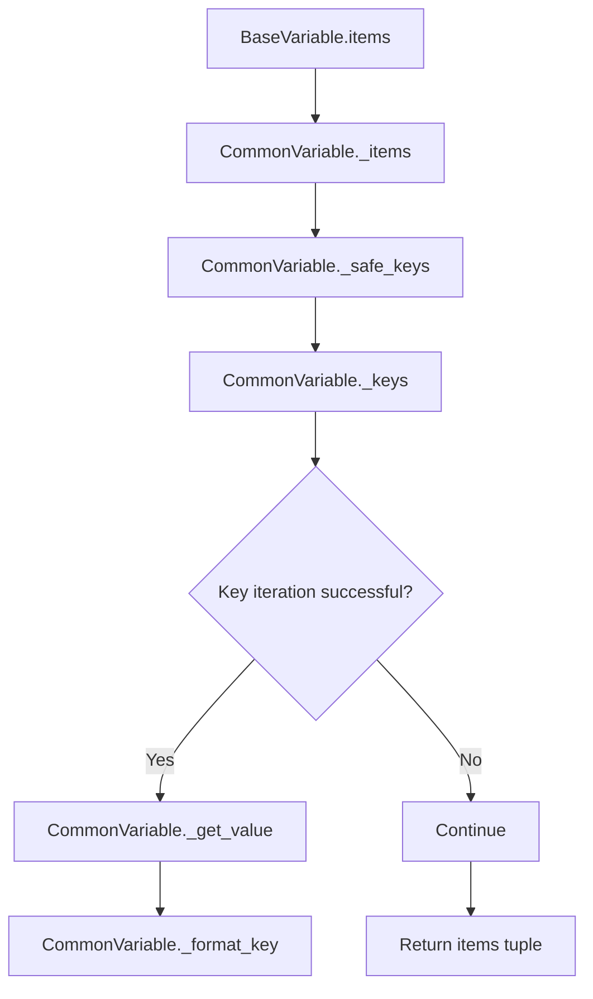
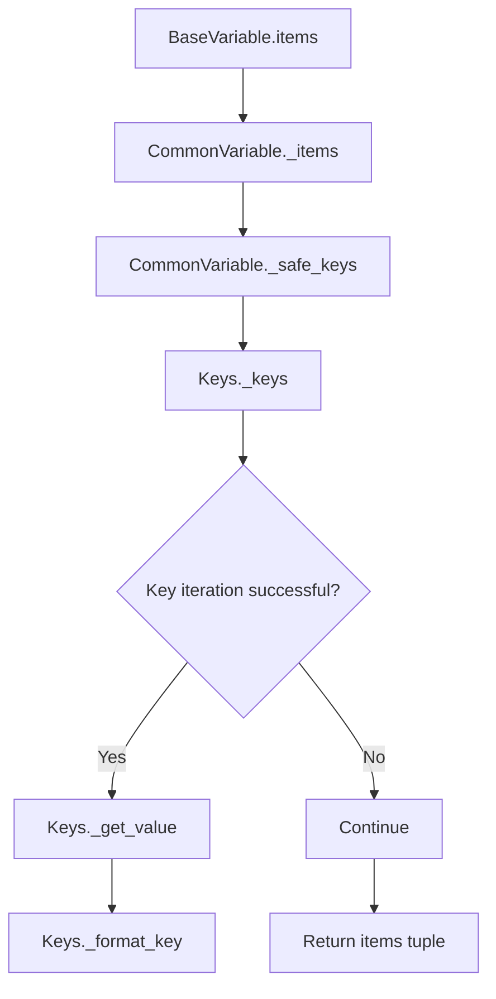

# `variables.py`

## `pysnooper.variables.needs_parentheses` · *function*

*No documentation generated.*

## `pysnooper.variables.BaseVariable` · *class*

## Summary
Abstract base class representing a variable expression to be inspected during code tracing in the pysnooper library.

## Description
The BaseVariable class serves as the foundation for variable inspection in the pysnooper debugging tool. It encapsulates a Python expression (source code) that can be evaluated within a specific execution frame to retrieve variable values for inspection. This abstract base class defines the common interface and behavior for all variable types that pysnooper can track during code execution.

The class handles compilation of the source code, proper evaluation within frame contexts, and provides consistent interfaces for variable inspection. Subclasses implement the specific extraction logic for different variable types.

## State
- source (str): The Python expression to be evaluated when inspecting the variable
- exclude (tuple): Collection of names to exclude from inspection results, normalized to tuple format
- code (code object): Compiled bytecode representation of the source expression for efficient evaluation
- unambiguous_source (str): The source expression wrapped in parentheses when needed to prevent parsing ambiguities

## Lifecycle
- Creation: Instantiate with a source expression string and optional exclude tuple
- Usage: Call the `items()` method with a frame object to evaluate and extract variable items
- Destruction: No special cleanup required; relies on Python's garbage collection

## Method Map
```mermaid
flowchart TD
    A[BaseVariable.__init__] --> B[BaseVariable.items]
    B --> C[eval(self.code, frame.f_globals, frame.f_locals)]
    C --> D[BaseVariable._items]
    D --> E[Return items tuple]
```

## Raises
- None explicitly raised by __init__
- The `items()` method catches all exceptions during evaluation and returns an empty tuple instead

## Example
```python
# Creating a BaseVariable instance
var = BaseVariable("my_dict['key']")

# Using it to inspect a variable in a frame context
# (assuming frame is a valid Python frame object)
items = var.items(frame)
```

### `pysnooper.variables.BaseVariable.__init__` · *method*

## Summary:
Initializes a BaseVariable instance with source code and exclusion configuration for variable tracking.

## Description:
Constructs a BaseVariable object that represents a variable expression to be tracked during code execution. This method sets up the internal state needed to evaluate the variable expression in different contexts and determine appropriate formatting for display purposes.

## Args:
    source (str): The source code string representing the variable or expression to track.
    exclude (tuple, optional): Tuple of variable names to exclude from tracking. Defaults to empty tuple.

## Returns:
    None: This method initializes instance attributes and does not return a value.

## Raises:
    None explicitly raised.

## State Changes:
    Attributes READ: None
    Attributes WRITTEN: 
    - self.source: Stores the original source code string
    - self.exclude: Stores the normalized exclude tuple
    - self.code: Stores compiled bytecode for evaluating the source
    - self.unambiguous_source: Stores source with surrounding parentheses if needed

## Constraints:
    Preconditions:
    - source must be a valid Python expression string that can be compiled with 'eval'
    - exclude, if provided, should contain valid variable names to exclude
    
    Postconditions:
    - self.source contains the original source string unchanged
    - self.exclude contains a tuple representation of the exclude parameter
    - self.code contains valid compiled bytecode for evaluation
    - self.unambiguous_source contains properly formatted source for display

## Side Effects:
    None.

### `pysnooper.variables.BaseVariable.items` · *method*

## Summary:
Evaluates a variable expression in a given frame context and extracts its constituent items for inspection.

## Description:
This method serves as the primary interface for variable inspection within the pysnooper library. It attempts to evaluate the variable source code (stored in `self.code`) within the provided frame's local and global namespace. When successful, it delegates to the abstract `_items` method to process the evaluated value and return its constituent items. If evaluation fails for any reason, it gracefully returns an empty tuple.

The method is typically called during code tracing operations when the debugger needs to inspect variable values at specific points in execution. It provides a robust mechanism for handling variable evaluation errors while maintaining consistent return types.

## Args:
    frame (FrameType): The execution frame in which to evaluate the variable source code.
    normalize (bool): Flag controlling whether the returned items should be normalized/formatted. Defaults to False.

## Returns:
    tuple: A tuple containing the constituent items of the evaluated variable. Returns an empty tuple if evaluation fails.

## Raises:
    None: This method catches all exceptions during evaluation and returns an empty tuple instead.

## State Changes:
    Attributes READ: 
    - self.code: Used to compile and evaluate the variable source
    - self._items: Called to process the evaluated value
    
    Attributes WRITTEN: None

## Constraints:
    Preconditions:
    - The `frame` parameter must be a valid Python frame object with accessible f_globals and f_locals attributes
    - The variable source code stored in `self.source` must be a valid Python expression that can be compiled with 'eval'
    
    Postconditions:
    - Always returns a tuple (empty or populated)
    - Does not modify the state of the BaseVariable instance

## Side Effects:
    I/O: May involve file I/O if the variable evaluation accesses file-based resources
    External service calls: Potentially calls external services if the variable evaluation involves network requests
    Mutations: Does not mutate any objects outside the scope of evaluation and processing

### `pysnooper.variables.BaseVariable._items` · *method*

## Summary:
Abstract method that processes a value and returns its constituent items for inspection.

## Description:
This abstract method is responsible for extracting and formatting items from a given value for variable inspection. It is called internally by the `items` method after evaluating the variable source code in a given frame context. Each subclass of `BaseVariable` must implement this method to handle the specific structure and semantics of different variable types.

The method serves as the core interface for variable inspection, enabling the pysnooper library to extract meaningful information from various Python data structures for debugging purposes.

## Args:
    key (Any): The value to process, typically the result of evaluating the variable source code in a frame context.
    normalize (bool): Flag controlling whether the returned items should be normalized/formatted. Defaults to False.

## Returns:
    tuple: A tuple of items extracted from the key value. The exact structure depends on the implementing subclass and the nature of the key value.

## Raises:
    NotImplementedError: This is an abstract method that must be implemented by subclasses.

## State Changes:
    Attributes READ: None - this method doesn't read any instance attributes directly
    Attributes WRITTEN: None - this method doesn't modify any instance attributes

## Constraints:
    Preconditions: 
    - The `key` parameter must be a valid Python object that can be processed by the implementing subclass
    - The method should handle any type of Python object appropriately
    
    Postconditions:
    - Must return a tuple of items representing the structure of the key value
    - Should not raise unexpected exceptions beyond the NotImplementedError

## Side Effects:
    None - This method is pure and doesn't cause any I/O, external service calls, or mutations to objects outside the scope of processing the key parameter.

### `pysnooper.variables.BaseVariable._fingerprint` · *method*

## Summary:
Returns a unique identifier tuple for this BaseVariable instance based on its type, source code, and exclusion configuration.

## Description:
This property generates a fingerprint tuple that uniquely identifies a BaseVariable instance by combining its class type, source code string, and exclusion configuration. The fingerprint is used to implement hash-based equality comparisons and enable BaseVariable objects to function as dictionary keys and set elements. This method is called by both `__hash__` and `__eq__` methods to maintain consistency in object identity comparisons.

## Args:
    None: This method takes no arguments beyond the implicit `self`.

## Returns:
    tuple: A 3-element tuple containing:
        - type(self): The class type of this BaseVariable instance
        - self.source: The source code string used to evaluate this variable
        - self.exclude: The exclusion configuration tuple for this variable

## Raises:
    None: This method does not raise any exceptions.

## State Changes:
    Attributes READ: 
    - self.source: The source code string for this variable
    - self.exclude: The exclusion configuration for this variable

## Constraints:
    Preconditions:
    - The `source` attribute must be a string
    - The `exclude` attribute must be convertible to a tuple
    - All elements in the returned tuple must be hashable
    
    Postconditions:
    - Returns a tuple of length 3
    - The tuple elements are immutable and suitable for hashing
    - The returned tuple uniquely identifies this BaseVariable instance among variables with the same type

## Side Effects:
    None: This method performs no I/O operations or external service calls.

### `pysnooper.variables.BaseVariable.__hash__` · *method*

## Summary:
Returns the hash value of this BaseVariable instance based on its fingerprint.

## Description:
Implements the Python `__hash__` magic method for BaseVariable objects, making them hashable. This method enables BaseVariable instances to be used as dictionary keys and set elements. The hash is computed from the object's `_fingerprint` property, which uniquely identifies the variable by its type, source code, and exclusion configuration. This method works in conjunction with `__eq__` to maintain hash consistency.

## Args:
    None: This method takes no arguments beyond the implicit `self`.

## Returns:
    int: An integer hash value derived from the object's fingerprint.

## Raises:
    TypeError: If the `_fingerprint` property contains unhashable elements (though this should not occur with the current implementation).

## State Changes:
    Attributes READ: 
    - self._fingerprint: The unique identifier tuple for this BaseVariable instance

## Constraints:
    Preconditions:
    - The `_fingerprint` property must return a hashable value
    - This method must be consistent with `__eq__` - equal objects must have equal hashes
    
    Postconditions:
    - Returns an integer hash value
    - The returned hash value remains constant during the object's lifetime

## Side Effects:
    None: This method performs no I/O operations or external service calls.

### `pysnooper.variables.BaseVariable.__eq__` · *method*

## Summary:
Compares two BaseVariable instances for equality based on their type, source code, and exclusion configuration.

## Description:
Implements the equality operator (`==`) for BaseVariable objects. Two BaseVariable instances are considered equal if they are instances of the same class and have identical source code and exclusion configurations. This method leverages the `_fingerprint` property which uniquely identifies a variable by its type, source string, and exclude tuple.

## Args:
    other (object): Another object to compare with this BaseVariable instance.

## Returns:
    bool: True if `other` is a BaseVariable instance with the same type, source, and exclude configuration; False otherwise.

## Raises:
    None

## State Changes:
    Attributes READ: 
    - self._fingerprint
    - other._fingerprint (when other is a BaseVariable)

## Constraints:
    Preconditions:
    - The method can accept any object as input (not just BaseVariable instances)
    - The comparison is symmetric: if a == b, then b == a
    
    Postconditions:
    - Returns a boolean value
    - If two BaseVariable instances are equal, they must have identical fingerprints
    - The method maintains consistency with the `__hash__` method

## Side Effects:
    None

## `pysnooper.variables.CommonVariable` · *class*

## Summary
Abstract base class for container-like variable inspection in the pysnooper debugging tool.

## Description
The CommonVariable class serves as an abstract base class for implementing variable inspection logic specifically for container-like objects (dictionaries, lists, sequences, etc.) in the pysnooper library. It extends BaseVariable and provides a standardized framework for extracting both the main variable value and its constituent elements (keys/items) for debugging purposes.

This class implements common patterns for safely iterating over variable keys, handling exceptions during key iteration, and formatting key-value pairs for display. Concrete subclasses must implement the abstract methods `_format_key` and `_get_value` to handle specific container types such as dictionaries or lists.

The class is designed to work within the pysnooper framework where variables are represented as expressions that can be evaluated within execution frames to retrieve their current values for inspection.

## State
- source (str): The Python expression to be evaluated when inspecting the variable (inherited from BaseVariable)
- exclude (tuple): Collection of names to exclude from inspection results, normalized to tuple format (inherited from BaseVariable)  
- code (code object): Compiled bytecode representation of the source expression for efficient evaluation (inherited from BaseVariable)
- unambiguous_source (str): The source expression wrapped in parentheses when needed to prevent parsing ambiguities (inherited from BaseVariable)

## Lifecycle
- Creation: Instantiate with a source expression string and optional exclude tuple (inherited from BaseVariable)
- Usage: Call the `items()` method with a frame object to evaluate and extract variable items (inherited from BaseVariable)
- Destruction: No special cleanup required; relies on Python's garbage collection

## Method Map


## Raises
- None explicitly raised by __init__ (inherits from BaseVariable)
- The `items()` method catches all exceptions during evaluation and returns an empty tuple instead (inherited from BaseVariable)

## Example
```python
# This is an abstract class - concrete implementations would be used instead
# For example, DictVariable and ListVariable would inherit from CommonVariable

# Creating a variable instance (conceptual)
var = SomeConcreteVariable("my_dict")

# Using it to inspect a variable in a frame context
# items = var.items(frame)  # Would return key-value pairs for inspection
```

### `pysnooper.variables.CommonVariable._items` · *method*

## Summary:
Generates a list of key-value pairs representing the inspected variable's contents for debugging display.

## Description:
Processes a variable's value to create a structured representation suitable for debugging output. This method is called internally by the `BaseVariable.items()` method during variable inspection operations. It creates a list of tuples where each tuple contains a formatted key and the short representation of a corresponding value from the variable.

The method handles both the main variable itself (as a root element) and its constituent elements (keys/values from containers like dictionaries or lists). It filters out excluded keys and gracefully handles exceptions during value extraction.

## Args:
    main_value (Any): The evaluated value of the variable being inspected
    normalize (bool): Flag controlling whether to normalize the string representations of values. Defaults to False

## Returns:
    list[tuple[str, str]]: A list of key-value pairs where each pair consists of a formatted key string and a short representation of the corresponding value. The first element represents the main variable itself, followed by key-value pairs for its constituents.

## Raises:
    None: Exceptions during value extraction are caught and skipped silently

## State Changes:
    Attributes READ: 
    - self.source: Used to create the initial key for the main variable
    - self.unambiguous_source: Used to format keys for constituent elements
    - self.exclude: Used to filter out excluded keys from the output
    
    Attributes WRITTEN: None

## Constraints:
    Preconditions:
    - main_value must be a Python object that can be processed by the helper methods
    - self._safe_keys, self._get_value, and self._format_key must be properly implemented by subclasses
    
    Postconditions:
    - Always returns a list of tuples
    - The first tuple always contains the main variable's source and representation
    - Keys in the result are properly formatted according to the implementing subclass

## Side Effects:
    None: This method performs no I/O operations, external service calls, or mutations to objects outside its scope

### `pysnooper.variables.CommonVariable._safe_keys` · *method*

## Summary:
A safe wrapper around the `_keys` method that yields keys from a main value while suppressing exceptions.

## Description:
This method provides a fault-tolerant way to iterate over keys from a main value by wrapping the abstract `_keys` method in a try-except block. When `_keys` raises an exception during key iteration, the exception is caught and suppressed, allowing the inspection process to continue without interruption.

The method is called by `CommonVariable._items()` during variable inspection to enumerate keys for container-like objects such as dictionaries, lists, or custom objects with attributes.

## Args:
    main_value (Any): The object from which to extract keys. This is passed directly to the underlying `_keys` implementation.

## Returns:
    generator: A generator yielding keys from the main_value. If the underlying `_keys` method raises an exception, the generator yields nothing.

## Raises:
    None: All exceptions from the underlying `_keys` method are caught and suppressed.

## State Changes:
    Attributes READ: None - this method only reads from the input parameter
    Attributes WRITTEN: None - this method doesn't modify any instance attributes

## Constraints:
    Preconditions:
    - main_value must be compatible with the underlying `_keys` implementation
    - The `_keys` method must be implemented by subclasses (e.g., `Attrs._keys`)

    Postconditions:
    - Always returns a generator object
    - If `_keys` succeeds, the generator yields all keys from the main_value
    - If `_keys` fails, the generator yields nothing (empty iteration)

## Side Effects:
    None: This method performs no I/O operations, external service calls, or mutations to objects outside its scope

### `pysnooper.variables.CommonVariable._keys` · *method*

*No documentation generated.*

### `pysnooper.variables.CommonVariable._format_key` · *method*

## Summary:
Formats a key for display in variable inspection output by converting it into a string representation suitable for hierarchical access notation.

## Description:
This abstract method is responsible for formatting keys from container-like objects (dictionaries, sequences, etc.) for display in the variable inspection output. The formatted key is concatenated with `self.unambiguous_source` to create a complete key path representation in the output.

The method is designed to be overridden by subclasses to provide appropriate formatting based on the type of container being inspected. For example, attribute keys are typically prefixed with a period to indicate hierarchical access, while dictionary keys might be formatted with quotes or brackets depending on their type.

This method is called from `CommonVariable._items()` during the process of generating formatted key-value pairs for display in the snooping output. It ensures that different types of keys are consistently formatted for clear visual representation in debugging output.

## Args:
    key (Any): The key to be formatted, typically representing an index, attribute name, or dictionary key from a container object.

## Returns:
    str: A formatted string representation of the key suitable for inclusion in variable inspection output. The exact format depends on the implementing subclass.

## Raises:
    NotImplementedError: This abstract method raises NotImplementedError when called directly on the base class.

## State Changes:
    Attributes READ: None - this method only operates on its input parameter
    Attributes WRITTEN: None - this method is immutable and doesn't modify any instance state

## Constraints:
    Preconditions: The method should handle any key type that might be encountered during variable inspection
    Postconditions: The returned string should be a valid representation that can be safely concatenated with `self.unambiguous_source`

## Side Effects:
    None: This method performs no I/O operations, external service calls, or mutations to objects outside its scope.

### `pysnooper.variables.CommonVariable._get_value` · *method*

## Summary:
Retrieves a value from a container object using a specified key for variable inspection.

## Description:
This abstract method is responsible for extracting a specific value from a container-like object using a provided key. It is called during variable inspection operations to access individual elements of complex data structures such as dictionaries, sequences, or object attributes. The method serves as a pluggable interface that allows different variable types to implement their own value extraction logic.

The method is invoked by `CommonVariable._items()` when enumerating the contents of a variable for debugging output. It's designed to be overridden by subclasses to handle different data structure types appropriately.

## Args:
    main_value (Any): The container or object from which to extract a value
    key (Any): The key, index, or attribute name used to identify which value to retrieve from main_value

## Returns:
    Any: The value associated with the specified key in the main_value container

## Raises:
    NotImplementedError: This is an abstract method that must be implemented by subclasses

## State Changes:
    Attributes READ: None - this method only operates on its parameters
    Attributes WRITTEN: None - this method doesn't modify any instance attributes

## Constraints:
    Preconditions:
        - main_value must be a container or object that supports value extraction using the provided key
        - key must be compatible with the type of main_value being accessed
        
    Postconditions:
        - Must return the value associated with key in main_value
        - Should raise appropriate exceptions (like KeyError, IndexError, AttributeError) when the key is invalid

## Side Effects:
    None - this method is pure and doesn't perform I/O operations, external service calls, or mutate objects outside its scope

## `pysnooper.variables.Attrs` · *class*

## Summary
A variable inspector for object attributes, designed to extract and format attribute key-value pairs from objects with `__dict__` or `__slots__` attributes.

## Description
The Attrs class is a concrete subclass of CommonVariable that specializes in inspecting objects with attributes. It enables pysnooper to examine the attributes of custom objects by accessing their `__dict__` and `__slots__` attributes. This class is particularly useful for debugging user-defined classes where attribute inspection is needed.

The class implements the abstract methods defined in CommonVariable to provide specific behavior for attribute-based variable inspection. It follows the CommonVariable pattern by implementing three key methods that define how to extract keys, format them for display, and retrieve their corresponding values from the inspected object.

## State
- source (str): The Python expression to be evaluated when inspecting the variable (inherited from BaseVariable)
- exclude (tuple): Collection of names to exclude from inspection results, normalized to tuple format (inherited from BaseVariable)  
- code (code object): Compiled bytecode representation of the source expression for efficient evaluation (inherited from BaseVariable)
- unambiguous_source (str): The source expression wrapped in parentheses when needed to prevent parsing ambiguities (inherited from BaseVariable)

## Lifecycle
- Creation: Instantiate with a source expression string and optional exclude tuple, following the same pattern as other CommonVariable subclasses
- Usage: Called internally by pysnooper's variable inspection mechanism when encountering objects with attributes during debugging
- Destruction: No special cleanup required; relies on Python's garbage collection

## Method Map
```mermaid
flowchart TD
    A[CommonVariable.items] --> B[CommonVariable._items]
    B --> C[CommonVariable._safe_keys]
    C --> D[Attrs._keys]
    D --> E[getattr(main_value, '__dict__', ())]
    E --> F[getattr(main_value, '__slots__', ())]
    F --> G[itertools.chain]
    G --> H[CommonVariable._get_value]
    H --> I[Attrs._get_value]
    I --> J[getattr(main_value, key)]
    J --> K[CommonVariable._format_key]
    K --> L[Attrs._format_key]
    L --> M["'.' + key"]
```

## Raises
- Inherits exception handling from CommonVariable
- May raise AttributeError when accessing `__dict__` or `__slots__` if the object doesn't support these attributes (handled gracefully by CommonVariable's error handling mechanisms)

## Example
```python
# This class is typically instantiated internally by pysnooper
# when it encounters an object with attributes during debugging

# Example usage scenario:
class Person:
    def __init__(self, name, age):
        self.name = name
        self.age = age

person = Person("Alice", 30)
# When pysnooper inspects 'person', it would use Attrs to extract:
# - Keys: ['name', 'age'] (from __dict__)
# - Values: ['Alice', 30] (accessed via getattr)
# - Formatted keys: ['.name', '.age'] (prefixed with dot)

# For objects with __slots__:
class Point:
    __slots__ = ['x', 'y']
    def __init__(self, x, y):
        self.x = x
        self.y = y

point = Point(1, 2)
# Attrs would extract keys: ['x', 'y'] from __slots__
```

### `pysnooper.variables.Attrs._keys` · *method*

## Summary:
Returns an iterator of attribute names from an object's `__dict__` and `__slots__` attributes.

## Description:
This method extracts all attribute names from a given object by combining keys from both its `__dict__` (instance attributes) and `__slots__` (defined attributes) attributes. It's used internally by the variable inspection system to enumerate all accessible attributes of an object for debugging purposes.

The method is called by `CommonVariable._safe_keys()` which wraps it in exception handling to ensure robust operation even when accessing object attributes fails.

## Args:
    main_value (object): The object whose attributes are to be enumerated

## Returns:
    iterator: An itertools.chain object containing attribute names from both `__dict__` and `__slots__` of the main_value object

## Raises:
    None explicitly raised - however, underlying `getattr` operations may raise exceptions if the object doesn't support the requested attributes

## State Changes:
    Attributes READ: None - this method only reads from the input parameter
    Attributes WRITTEN: None - this method doesn't modify any instance attributes

## Constraints:
    Preconditions: 
    - main_value must be an object that supports `getattr` operations
    - main_value should have either `__dict__` or `__slots__` attributes (or both)
    
    Postconditions:
    - Returns an iterator that yields string attribute names
    - If `__dict__` or `__slots__` don't exist, returns empty iterators

## Side Effects:
    None - this method is pure and doesn't perform I/O or mutate external state

### `pysnooper.variables.Attrs._format_key` · *method*

## Summary:
Formats a key by prepending a period character to enable hierarchical attribute access representation.

## Description:
This method is responsible for formatting attribute keys in the variable inspection system. It prepends a period ('.') to the provided key to indicate hierarchical access in the output representation. This method is part of the Attrs class which implements the formatting strategy for object attributes during variable snooping.

The method is called from `CommonVariable._items()` during the process of generating formatted key-value pairs for display in the snooping output. It ensures that attribute access paths are clearly represented with leading periods to distinguish them from top-level variables.

## Args:
    key (str): The attribute key to be formatted, typically representing an object attribute name.

## Returns:
    str: The formatted key with a leading period character prepended to the original key.

## Raises:
    None: This method does not raise any exceptions under normal operation.

## State Changes:
    Attributes READ: None - this method only operates on its input parameter
    Attributes WRITTEN: None - this method is immutable and doesn't modify any instance state

## Constraints:
    Preconditions: The input key must be a string type
    Postconditions: The returned string will always have a leading period followed by the original key content

## Side Effects:
    None: This method performs no I/O operations, external service calls, or mutations to objects outside its scope.

### `pysnooper.variables.Attrs._get_value` · *method*

## Summary:
Retrieves the value of a specified attribute from an object using Python's built-in getattr function.

## Description:
This method implements the abstract `_get_value` interface defined in `CommonVariable` to fetch attribute values from objects. It is called during variable inspection operations to extract specific attribute values from objects being monitored by pysnooper. The method is part of the `Attrs` class, which specializes in handling object attribute inspection.

## Args:
    main_value (Any): The object from which to retrieve the attribute value
    key (str): The name of the attribute to retrieve from the object

## Returns:
    Any: The value of the specified attribute from the object, or raises AttributeError if the attribute doesn't exist

## Raises:
    AttributeError: When the specified key (attribute name) does not exist on the main_value object

## State Changes:
    Attributes READ: None - this method only reads its parameters
    Attributes WRITTEN: None - this method doesn't modify any instance attributes

## Constraints:
    Preconditions:
        - main_value must be a Python object that supports attribute access
        - key must be a string representing a valid attribute name on main_value
    Postconditions:
        - Returns the actual value stored in the attribute
        - If the attribute doesn't exist, raises AttributeError (this is handled by caller)

## Side Effects:
    None - this method performs no I/O operations or external service calls

## `pysnooper.variables.Keys` · *class*

## Summary
A container variable inspector that implements key-based access patterns for dictionary-like objects in pysnooper debugging.

## Description
The Keys class is a concrete implementation of CommonVariable that provides the specific implementation for accessing and formatting key-value pairs from dictionary-like objects during debugging sessions in the pysnooper library. It implements the abstract methods required by CommonVariable to enable inspection of container variables.

This class is designed to work with objects that support the standard dictionary interface (objects with `.keys()` method and `[]` indexing). It provides the necessary hooks for pysnooper to extract, format, and display key-value information from such containers during code execution tracing.

## State
- Inherits all state from CommonVariable parent class including:
  - source (str): The Python expression to be evaluated when inspecting the variable
  - exclude (tuple): Collection of names to exclude from inspection results
  - code (code object): Compiled bytecode representation of the source expression
  - unambiguous_source (str): The source expression wrapped in parentheses when needed

## Lifecycle
- Creation: Instantiate with a source expression string (and optional exclude tuple) following CommonVariable initialization pattern
- Usage: Called internally by the pysnooper framework when processing variable inspection requests via the items() method inherited from BaseVariable
- Destruction: No special cleanup required; relies on Python's garbage collection

## Method Map


## Raises
- None explicitly raised by __init__ (inherits from CommonVariable)
- All exceptions during key iteration and value retrieval are caught and handled gracefully by the parent class framework

## Example
```python
# This class is typically instantiated indirectly by pysnooper
# when analyzing dictionary-like variables in code being traced

# Example usage within pysnooper's internal framework:
# var = Keys("my_dict")  # Creates a Keys variable inspector
# items = var.items(frame)  # Returns formatted key-value pairs for debugging display

# Internally, the methods work as follows:
# Keys._keys(my_dict) -> my_dict.keys()
# Keys._get_value(my_dict, key) -> my_dict[key]  
# Keys._format_key(key) -> "[{repr_of_key}]"
```

### `pysnooper.variables.Keys._keys` · *method*

## Summary
Extracts the keys from a dictionary-like object for variable inspection purposes.

## Description
This method retrieves the keys from a dictionary-like object (such as dict, OrderedDict, or other mapping types) for use in the pysnooper debugging tool's variable inspection system. It is part of the Keys class, which specializes in handling dictionary-like variables during debugging sessions.

The method is called internally by the CommonVariable._safe_keys method as part of the process to safely iterate over variable keys while handling potential exceptions during key extraction. It serves as a bridge between the variable inspection framework and the underlying dictionary's key interface.

## Args
    main_value (Mapping): A dictionary-like object from which to extract keys. Must support the .keys() method and be non-None.

## Returns
    KeysView: An object representing the keys of the dictionary-like main_value. This is typically a dict_keys object or similar view object that supports iteration and membership testing.

## Raises
    AttributeError: If main_value does not have a .keys() method or is not dictionary-like.
    TypeError: If main_value is None or not a mapping type.

## State Changes
    Attributes READ: None
    Attributes WRITTEN: None

## Constraints
    Preconditions: 
    - main_value must be a dictionary-like object that implements the .keys() method
    - main_value must not be None
    
    Postconditions:
    - Returns a KeysView object containing all keys from main_value
    - The returned object maintains the same key ordering as main_value
    - The method is idempotent and does not modify the input object

## Side Effects
    None

### `pysnooper.variables.Keys._format_key` · *method*

## Summary:
Formats a key for display by wrapping it in square brackets with a shortened representation.

## Description:
Formats a dictionary or sequence key for debugging output by applying a shortened representation and wrapping it in square brackets. This method is part of the Keys class that handles container-like variable inspection in pysnooper. It's called during the item enumeration process when displaying variable contents in debug output, specifically when rendering keys in a human-readable format.

The formatted key appears in debugging output like `[key_value]` where `key_value` is a cleaned, truncated representation of the actual key.

## Args:
    key (Any): The key to format, typically a dictionary key or sequence index

## Returns:
    str: A formatted string representation of the key enclosed in square brackets

## Raises:
    None explicitly raised by this method

## State Changes:
    Attributes READ: None
    Attributes WRITTEN: None

## Constraints:
    Preconditions:
        - The key parameter can be any Python object that can be represented as a string
        - The method assumes the key is valid for use as a dictionary key or sequence index
        
    Postconditions:
        - Always returns a string with the format "[{key_repr}]"
        - The key representation is cleaned and truncated appropriately by utils.get_shortish_repr

## Side Effects:
    None

## Example:
    >>> _format_key('my_key')
    "[my_key]"
    
    >>> _format_key(123)
    "[123]"
    
    >>> _format_key(['nested', 'list'])
    "[['nested', 'list']]"

### `pysnooper.variables.Keys._get_value` · *method*

## Summary:
Retrieves a value from a container object using the specified key.

## Description:
Extracts a value from a container-like object (dictionary, list, sequence, etc.) using the provided key. This method is part of the Keys class in pysnooper's variable inspection system and is called during the generation of debugging output to access individual elements of container variables.

The method is invoked by `CommonVariable._items()` as part of the process that enumerates container contents for display in debugging output. It serves as a bridge between the key enumeration phase and the value extraction phase of variable inspection.

## Args:
    main_value (Any): The container object (dictionary, list, sequence, etc.) from which to extract a value
    key (Any): The key used to index into the container object

## Returns:
    Any: The value associated with the specified key in the container object

## Raises:
    KeyError: When the specified key does not exist in the container object
    IndexError: When the specified index is out of bounds for sequence containers
    TypeError: When the container object does not support indexing operations

## State Changes:
    Attributes READ: None - this method only operates on its input parameters
    Attributes WRITTEN: None - this method is immutable and doesn't modify any instance state

## Constraints:
    Preconditions:
        - main_value must be a container object that supports indexing operations (has __getitem__ method)
        - key must be a valid index/key for the given container type
        - Both parameters must be compatible with the container's indexing mechanism
        
    Postconditions:
        - Returns the value stored at the specified key/index in the container
        - Raises appropriate exception types when key/index is invalid or unsupported

## Side Effects:
    None: This method performs no I/O operations, external service calls, or mutations to objects outside its scope

## `pysnooper.variables.Indices` · *class*

*No documentation generated.*

### `pysnooper.variables.Indices._keys` · *method*

*No documentation generated.*

### `pysnooper.variables.Indices.__getitem__` · *method*

## Summary
Returns a copy of this Indices object with the specified slice applied to its internal slice attribute.

## Description
This method enables slicing operations on Indices objects, allowing users to specify a slice pattern that will be applied when retrieving keys from container variables. The method creates a deep copy of the current object and updates its internal `_slice` attribute with the provided slice, returning the modified copy. This follows the standard Python protocol for the `[]` operator.

The method is primarily used within the pysnooper debugging framework to enable flexible inspection of container variable elements through slicing syntax. When an Indices object is sliced (e.g., `indices[1:5]`), it returns a new Indices instance that will apply that slice when extracting keys from the container being inspected.

## Args
    item (slice): A Python slice object specifying the indexing pattern to apply to container elements

## Returns
    Indices: A new Indices object instance with the same properties as self, but with its `_slice` attribute set to the provided slice

## Raises
    AssertionError: When the provided item is not an instance of slice type

## State Changes
    Attributes READ: self._slice
    Attributes WRITTEN: result._slice (on the returned copy)

## Constraints
    Preconditions: The item argument must be a slice object
    Postconditions: The returned object is a deep copy of self with updated _slice attribute

## Side Effects
    None: This method performs no I/O operations or external service calls. It only creates a new object instance and modifies its internal state.

## `pysnooper.variables.Exploding` · *class*

## Summary
A dynamic variable inspector that automatically selects the appropriate inspection strategy based on the runtime type of the variable being examined.

## Description
The `Exploding` class serves as a polymorphic dispatcher within pysnooper's variable inspection framework. When a variable needs to be inspected during code tracing, this class determines the most suitable inspection approach based on the variable's type and delegates to the appropriate specialized inspector class.

This abstraction enables pysnooper to handle diverse data types uniformly while leveraging type-specific inspection strategies. The class is designed to be used internally by pysnooper's variable inspection mechanism rather than being instantiated directly by users.

## State
- source (str): The Python expression to be evaluated when inspecting the variable (inherited from BaseVariable)
- exclude (tuple): Collection of names to exclude from inspection results, normalized to tuple format (inherited from BaseVariable)
- code (code object): Compiled bytecode representation of the source expression for efficient evaluation (inherited from BaseVariable)
- unambiguous_source (str): The source expression wrapped in parentheses when needed to prevent parsing ambiguities (inherited from BaseVariable)

## Lifecycle
- Creation: Instantiated with a source expression string and optional exclude tuple, following the same pattern as other BaseVariable subclasses
- Usage: Called internally by pysnooper's variable inspection mechanism when processing variable inspection requests via the `items()` method inherited from BaseVariable
- Destruction: No special cleanup required; relies on Python's garbage collection

## Method Map
```mermaid
flowchart TD
    A[BaseVariable.items] --> B[Exploding._items]
    B --> C{isinstance(main_value, Mapping)?}
    C -- Yes --> D[Keys._items]
    C -- No --> E{isinstance(main_value, Sequence)?}
    E -- Yes --> F[Indices._items]
    E -- No --> G[Attrs._items]
```

## Raises
- None explicitly raised by `__init__` (inherits from BaseVariable)
- All exceptions during type checking or delegation are handled gracefully by the parent class framework

## Example
```python
# This class is typically instantiated internally by pysnooper
# when it encounters variables of different types during debugging

# Example scenarios:
# For a dictionary: Exploding dispatches to Keys
my_dict = {'a': 1, 'b': 2}
# Inspection uses Keys._items to extract keys and values

# For a list: Exploding dispatches to Indices  
my_list = [10, 20, 30]
# Inspection uses Indices._items to extract indices and values

# For an object: Exploding dispatches to Attrs
class Person:
    def __init__(self, name):
        self.name = name

person = Person("Alice")
# Inspection uses Attrs._items to extract attributes and values
```

### `pysnooper.variables.Exploding._items` · *method*

## Summary
Determines the appropriate variable inspector class based on the type of main_value and delegates inspection to that class.

## Description
The `_items` method in the `Exploding` class serves as a dispatcher that selects the most appropriate variable inspector class (`Keys`, `Indices`, or `Attrs`) based on the type of the provided `main_value`. This method enables polymorphic variable inspection by routing different data types to their specialized handlers.

This logic is implemented as a separate method rather than being inlined because it provides a clean abstraction layer that allows the `Exploding` class to remain agnostic about the specific inspection strategies for different data types while maintaining a consistent interface. The `Exploding` class is part of pysnooper's variable inspection framework and is used to dynamically choose the best inspection approach based on the runtime type of variables being traced.

## Args
- main_value: The variable value to be inspected, which can be a Mapping, Sequence, or other object type
- normalize: Boolean flag indicating whether to apply normalization to the inspection results (default: False)

## Returns
- tuple: A tuple containing the formatted key-value pairs from the appropriate variable inspector class

## Raises
- None explicitly raised by this method (exceptions are handled by the delegated classes)

## State Changes
- Attributes READ: self.source, self.exclude
- Attributes WRITTEN: None

## Constraints
- Preconditions: The `main_value` parameter must be a valid Python object that can be checked against Mapping and Sequence types
- Postconditions: The returned tuple contains properly formatted key-value pairs for debugging display

## Side Effects
- None directly caused by this method
- Indirect side effects occur through delegation to the respective inspector classes which may perform evaluations or formatting operations

