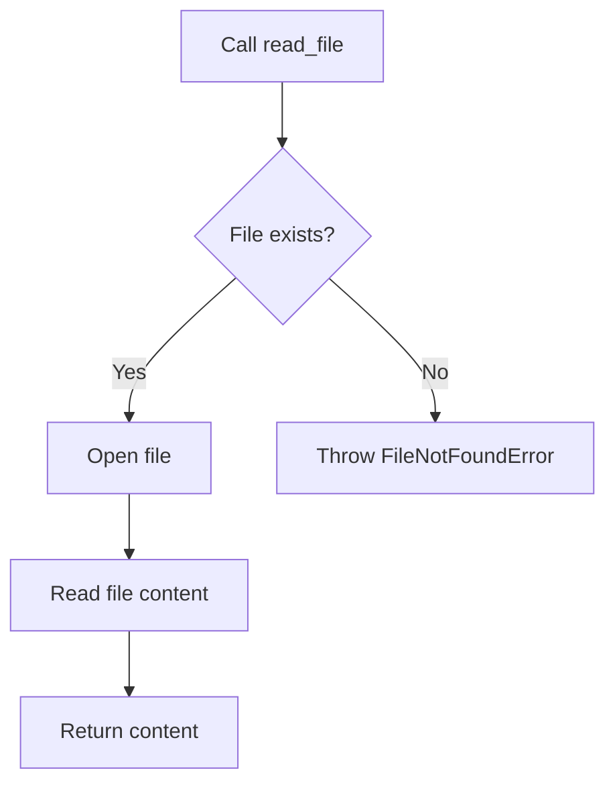

# `setup.py`

## `read_file` · *function*

## Summary:
Reads the complete contents of a file and returns it as a string.

## Description:
Opens the specified file in read mode and returns its entire content as a string. This utility function is commonly used in setup scripts to read configuration files, license files, or README content for package metadata.

## Args:
    filename (str): Path to the file to be read. Can be absolute or relative path.

## Returns:
    str: The complete contents of the file as a string.

## Raises:
    FileNotFoundError: If the specified file does not exist.
    PermissionError: If the process does not have permission to read the file.

## Constraints:
    Preconditions: The filename argument must be a valid string representing an existing file path.
    Postconditions: The returned string contains the complete file content with all formatting preserved.

## Side Effects:
    File I/O operation: Reads from the filesystem at the specified path.
    No external state mutations occur.

## Control Flow:


## Examples:
```python
# Reading a README file for package description
long_description = read_file('README.md')

# Reading a license file
license_content = read_file('LICENSE.txt')
```

