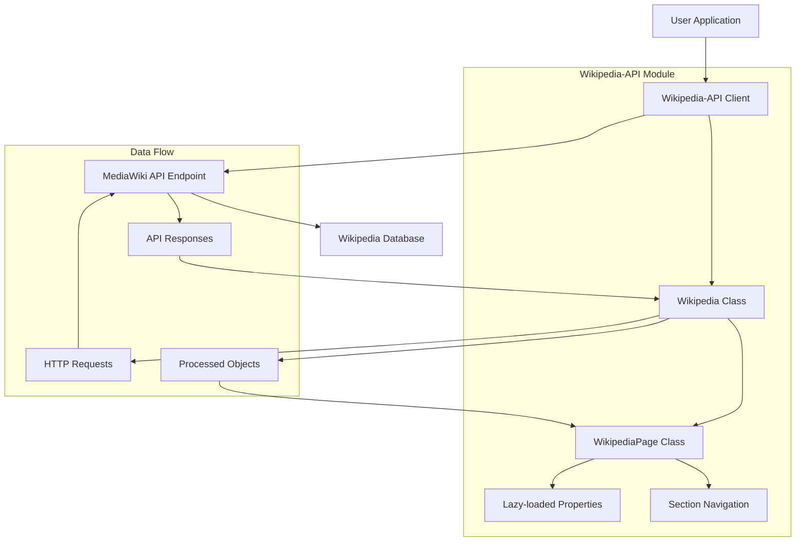

# `Wikipedia-API`

## Wikipedia-API Repository Documentation

### Tree Structure
```
Wikipedia-API/
├── wikipediaapi/          # Core Python API module
│   └── __init__.py        # Module entry point
├── example.py             # Example usage scripts
└── setup.py               # Package configuration
```

### Purpose
The Wikipedia-API repository provides a Python interface for programmatically accessing Wikipedia content through the MediaWiki API. It enables developers to retrieve page content, metadata, links, categories, and other Wikipedia information in a clean, object-oriented manner.

**Target Users:**
- Data scientists analyzing Wikipedia content
- Developers building applications that integrate with Wikipedia
- Researchers conducting corpus analysis or information retrieval studies
- Content curators and editors needing programmatic access to Wikipedia data

**Use Cases:**
- Building Wikipedia-based knowledge bases
- Creating educational tools that reference Wikipedia content
- Performing content analysis and information extraction
- Developing multilingual applications using Wikipedia data

### Architecture


The system follows a client-server pattern where the Wikipedia-API module acts as a client to the MediaWiki API. It uses lazy loading principles to fetch data only when needed, optimizing network usage and performance.

### Entry Points
1. **Importable API**: `from wikipediaapi import Wikipedia`
   - Primary interface for accessing Wikipedia content
   - Requires user-agent specification for proper API usage
   - Supports multiple languages and content formats

2. **Example Scripts**: `example.py`
   - Demonstrates various usage patterns
   - Shows how to work with pages, sections, categories, and links
   - Provides practical examples for common use cases

3. **Command Line Interface**: Not explicitly mentioned, but could be built upon the API

### Core Features
1. **Page Content Retrieval** - Fetch full page content with sections
2. **Metadata Access** - Retrieve page information like revision ID, timestamp, etc.
3. **Link Navigation** - Access internal links, backlinks, and language links
4. **Category Management** - Explore page categories and category hierarchies
5. **Section Navigation** - Traverse hierarchical page sections
6. **Multi-language Support** - Access content in various Wikipedia languages
7. **Flexible Content Formats** - Support for WikiText and HTML extraction

### Dependencies
- **requests**: HTTP library for making API calls to MediaWiki
- **logging**: For informational and debugging messages
- **Python 3.6+**: Minimum version requirement for modern Python features

### Configuration
The system primarily relies on:
- User-Agent header (required for API compliance)
- Language selection for different Wikipedia editions
- Content format preferences (WikiText vs HTML)
- HTTP headers for custom requests

### Extension Points
1. **Custom Content Processing**: Extend page parsing logic
2. **Additional API Endpoints**: Add support for new MediaWiki API features
3. **Alternative Storage Backends**: Implement caching mechanisms
4. **Authentication Plugins**: Support for authenticated API access
5. **Custom Extractors**: Different content formatting strategies

---

## Modules

- [`wikipediaapi`](wikipediaapi.md)

