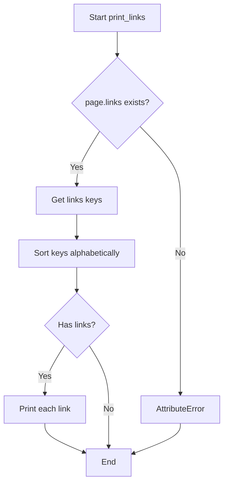

# `example.py`

## `print_sections` · *function*

## Summary:
Recursively prints hierarchical section information with indentation based on nesting level.

## Description:
Prints section titles and truncated text content with increasing indentation for nested sections. This function implements a depth-first traversal of a hierarchical section structure, displaying each section's metadata with visual hierarchy indicators.

## Args:
    sections (list): A list of section objects containing title, text, and sections attributes
    level (int): Current nesting level for indentation calculation, defaults to 0

## Returns:
    None: This function performs I/O operations and does not return a value

## Raises:
    AttributeError: If section objects lack required attributes (title, text, sections)
    TypeError: If sections parameter is not iterable or contains non-section objects

## Constraints:
    Preconditions:
    - sections parameter must be iterable
    - Each section object must have title, text, and sections attributes
    - Text attribute must support slicing operation [0:40]
    
    Postconditions:
    - All sections and their subsections are printed to standard output
    - Function terminates when all sections are processed

## Side Effects:
    - Writes formatted text to standard output (stdout)
    - No external state mutations

## Control Flow:
```mermaid
flowchart TD
    A[Start print_sections] --> B{sections empty?}
    B -- Yes --> C[Return]
    B -- No --> D[For each section in sections]
    D --> E[Print formatted section info]
    E --> F[Recursive call print_sections(s.sections, level+1)]
    F --> G[Return to loop]
    G --> B
```

## Examples:
```python
# Basic usage with sections from wikipediaapi
sections = page.sections  # From wikipediaapi page object
print_sections(sections)

# With custom starting level
print_sections(sections, level=2)
```

## `print_langlinks` · *function*

## Summary:
Prints language links for a Wikipedia page in a standardized format.

## Description:
This function extracts and displays language links from a Wikipedia page object, presenting each link with its language code, target language, title, and full URL. It's designed to provide a clean, sorted presentation of multilingual references for Wikipedia articles.

## Args:
    page: A Wikipedia page object from the wikipediaapi library that contains a langlinks attribute

## Returns:
    None

## Raises:
    AttributeError: If the page parameter lacks a langlinks attribute, or if any entry in langlinks lacks the expected attributes (language, title, fullurl)

## Constraints:
    Preconditions:
    - The page parameter must be a valid Wikipedia page object from wikipediaapi
    - The page must have a langlinks attribute that behaves like a dictionary mapping language codes to language link objects
    - Each language link object must have language, title, and fullurl attributes
    
    Postconditions:
    - All language links are printed to standard output in ascending order by language code
    - Function completes without returning any value

## Side Effects:
    - Prints formatted text to standard output (stdout)
    - No external state mutations or I/O operations beyond printing

## Control Flow:
```mermaid
flowchart TD
    A[Start print_langlinks] --> B{page has langlinks?}
    B -- Yes --> C[Sort langlinks keys alphabetically]
    C --> D[For each key in sorted order]
    D --> E{key exists in langlinks?}
    E -- Yes --> F[Retrieve langlinks[key] as v]
    F --> G[v has language, title, fullurl?]
    G -- Yes --> H[Print "%s: %s - %s: %s" format]
    H --> I[Continue to next key]
    G -- No --> J[AttributeError raised]
    E -- No --> K[Continue to next key]
    B -- No --> L[AttributeError raised]
    J --> M[End function]
    K --> D
```

## Examples:
```python
import wikipediaapi

# Create a Wikipedia API instance
wiki = wikipediaapi.Wikipedia('en')

# Get a page
page = wiki.page("Python (programming language)")

# Print language links
print_langlinks(page)
# Output example:
# de: German - Python (Programmiersprache): https://de.wikipedia.org/wiki/Python_(Programmiersprache)
# es: Spanish - Python (lenguaje de programación): https://es.wikipedia.org/wiki/Python_(lenguaje_de_programación)
```

## `print_links` · *function*

## Summary:
Prints all links from a Wikipedia page in alphabetical order with their corresponding titles.

## Description:
This function extracts and displays all hyperlinks found on a Wikipedia page in a sorted, formatted manner. It serves as a utility for displaying page link information in a readable format.

## Args:
    page: A Wikipedia page object from the wikipediaapi library containing a links attribute

## Returns:
    None: This function does not return any value; it only produces output via print statements.

## Raises:
    AttributeError: If the provided page object does not have a links attribute.
    TypeError: If page.links is not a dictionary-like object with keys() method.

## Constraints:
    Preconditions:
    - The page parameter must be a valid Wikipedia page object from wikipediaapi
    - The page.links attribute must be accessible and iterable
    
    Postconditions:
    - All links from the page are printed to standard output in alphabetical order
    - No modifications are made to the input page object

## Side Effects:
    - Prints formatted output to standard output (stdout)
    - No external state mutations or I/O operations beyond printing

## Control Flow:


## Examples:
```python
# Basic usage with a Wikipedia page object
wiki_page = wiki_wiki.page("Python (programming language)")
print_links(wiki_page)
# Output would be sorted links like:
# Algorithms: <url>
# Array: <url>
# ...
```

## `print_categories` · *function*

## Summary:
Prints categorized information from a Wikipedia page in alphabetical order.

## Description:
This function extracts category information from a Wikipedia page object and displays it in a formatted manner, sorted alphabetically by category title. It serves as a utility for inspecting the categorization of Wikipedia content.

## Args:
    page: A Wikipedia page object from the wikipediaapi library containing a categories attribute

## Returns:
    None: This function does not return any value; it performs I/O operations only

## Raises:
    None explicitly raised by this function, but runtime errors may occur if page parameter lacks categories attribute or if categories are not properly formatted

## Constraints:
    Preconditions:
    - The page parameter must be a valid wikipediaapi page object
    - The page object must have a categories attribute that behaves like a dictionary
    - Categories keys must be sortable (strings or comparable types)

    Postconditions:
    - All categories from the page are printed to standard output in alphabetical order
    - Function execution completes without returning a value

## Side Effects:
    - Prints formatted output to standard output (stdout)
    - No external state mutations or I/O operations beyond console output

## Control Flow:
```mermaid
flowchart TD
    A[Start print_categories] --> B[Access page.categories]
    B --> C[Get categories dictionary keys]
    C --> D[Sort keys alphabetically]
    D --> E[Iterate through sorted keys]
    E --> F[Print "%s: %s" format]
    F --> G[End]
```

## Examples:
```python
# Basic usage with a valid Wikipedia page
wiki_page = wiki_wiki.page("Python (programming language)")
print_categories(wiki_page)
# Output:
# Category:Computer programming languages: Category:Programming languages
# Category:Dynamic programming languages: Category:Programming languages
# ...
```

## `print_categorymembers` · *function*

## Summary:
Recursively prints Wikipedia category members with hierarchical indentation to visualize category structure.

## Description:
This function displays a hierarchical view of Wikipedia categories by recursively traversing category members. It prints each category member with appropriate indentation based on nesting level and continues traversal for subcategories up to a maximum depth. This utility helps visualize the hierarchical structure of Wikipedia categories.

## Args:
    categorymembers (dict-like): Dictionary of category members where keys are identifiers and values are category objects with title and ns attributes
    level (int): Current nesting level for indentation (default: 0)
    max_level (int): Maximum recursion depth to prevent infinite expansion (default: 2)

## Returns:
    None: This function performs I/O operations and does not return any value

## Raises:
    AttributeError: If categorymembers values don't have title or ns attributes
    RecursionError: If max_level is set too high and causes stack overflow

## Constraints:
    Preconditions:
    - categorymembers must support .values() method to iterate over elements
    - Each element in categorymembers.values() must have title and ns attributes
    - level and max_level must be non-negative integers
    
    Postconditions:
    - All category members up to max_level depth are printed to stdout
    - Function terminates when recursion limit is reached or all members are processed

## Side Effects:
    - Prints formatted output to standard output (stdout)
    - May cause stack overflow if max_level is set too high

## Control Flow:
```mermaid
flowchart TD
    A[Start print_categorymembers] --> B{categorymembers.values()}
    B --> C[Iterate through each category member]
    C --> D[Print member with indentation]
    D --> E{Is member a category?}
    E -->|Yes| F{level < max_level?}
    F -->|Yes| G[Recursive call with level+1]
    G --> H[Return to iteration]
    F -->|No| I[Continue iteration]
    E -->|No| J[Continue iteration]
    C --> K[End iteration]
    K --> L[End function]
```

## Examples:
    # Basic usage
    print_categorymembers(category_dict)
    
    # With custom depth limit
    print_categorymembers(category_dict, max_level=3)
    
    # With custom starting level
    print_categorymembers(category_dict, level=1, max_level=4)
```

