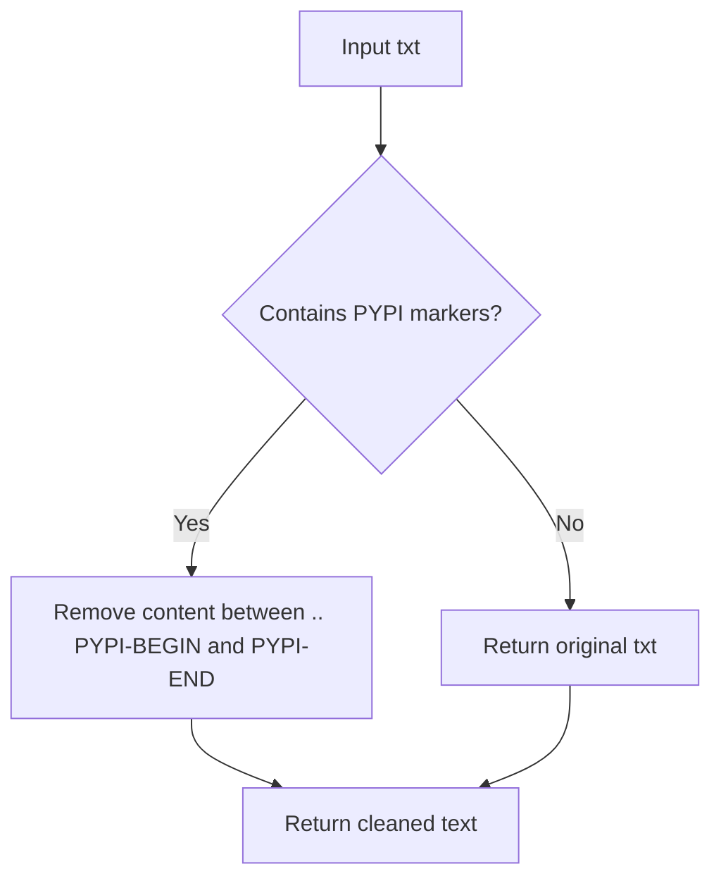

# `setup.py`

## `fix_doc` · *function*

## Summary:
Removes content between PYPI-BEGIN and PYPI-END markers from documentation text.

## Description:
Strips out sections of documentation that are marked for exclusion from PyPI package descriptions. This function processes text to remove content that should not appear in package metadata published to PyPI, allowing authors to include development-specific or build-specific documentation that gets filtered out during packaging.

## Args:
    txt (str): Input text containing documentation content with PYPI-BEGIN/PYPI-END markers

## Returns:
    str: Text with all content between PYPI-BEGIN and PYPI-END markers removed

## Raises:
    None explicitly raised

## Constraints:
    - Input must be a string
    - Markers must be formatted exactly as ".. PYPI-BEGIN" and "PYPI-END"
    - Content between markers is completely removed (including the markers themselves)

## Side Effects:
    None

## Control Flow:


## Examples:
    >>> fix_doc("Hello .. PYPI-BEGIN world PYPI-END")
    'Hello '
    
    >>> fix_doc(".. PYPI-BEGIN start end PYPI-END test")
    'test'
    
    >>> fix_doc("No markers here")
    'No markers here'
```

