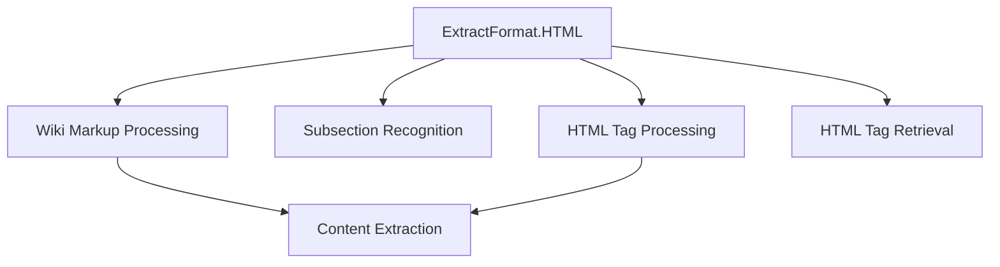
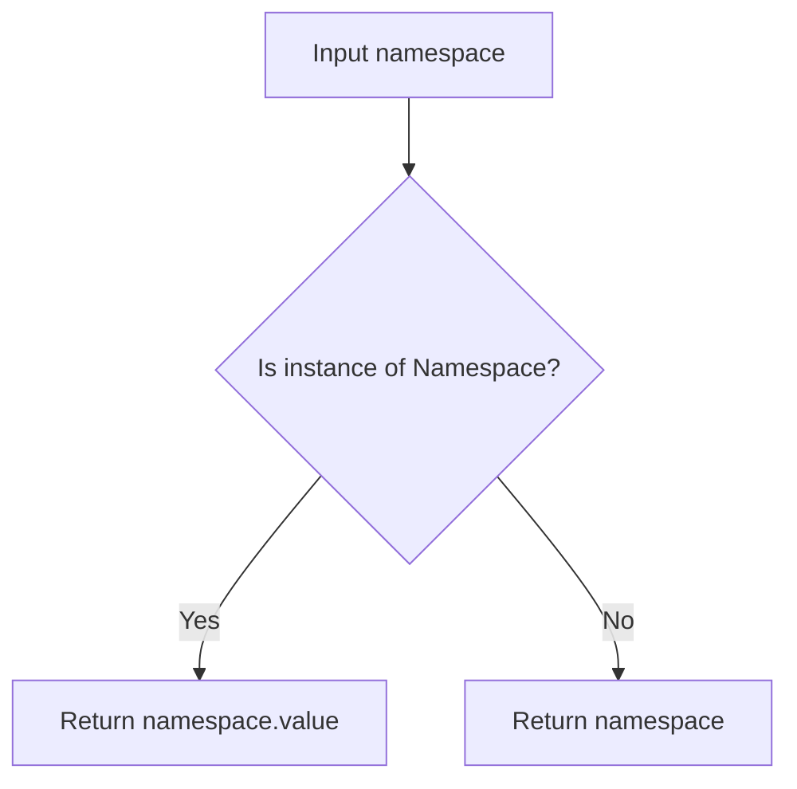
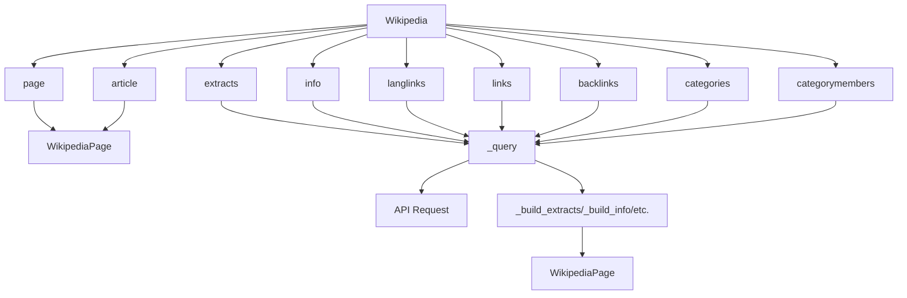
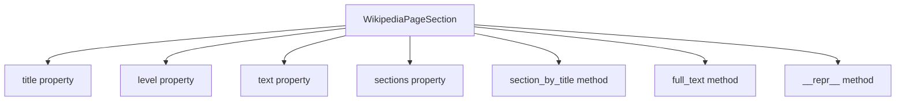
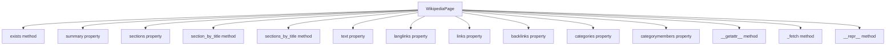

```mermaid
graph TD
    A[Namespace] --> B[MAIN=0]
    A --> C[TALK=1]
    A --> D[USER=2]
    A --> E[USER_TALK=3]
    A --> F[WIKIPEDIA=4]
    A --> G[WIKIPEDIA_TALK=5]
    A --> H[FILE=6]
    A --> I[FILE_TALK=7]
    A --> J[MEDIAWIKI=8]
    A --> K[MEDIAWIKI_TALK=9]
    A --> L[TEMPLATE=10]
    A --> M[TEMPLATE_TALK=11]
    A --> N[HELP=12]
    A --> O[HELP_TALK=13]
    A --> P[CATEGORY=14]
    A --> Q[CATEGORY_TALK=15]
    A --> R[PORTAL=100]
    A --> S[PORTAL_TALK=101]
    A --> T[PROJECT=102]
    A --> U[PROJECT_TALK=103]
    A --> V[REFERENCE=104]
    A --> W[REFERENCE_TALK=105]
    A --> X[BOOK=108]
    A --> Y[BOOK_TALK=109]
    A --> Z[DRAFT=118]
    A --> AA[DRAFT_TALK=119]
    A --> AB[EDUCATION_PROGRAM=446]
    A --> AC[EDUCATION_PROGRAM_TALK=447]
    A --> AD[TIMED_TEXT=710]
    A --> AE[TIMED_TEXT_TALK=711]
    A --> AF[MODULE=828]
    A --> AG[MODULE_TALK=829]
    A --> AH[GADGET=2300]
    A --> AI[GADGET_TALK=2301]
    A --> AJ[GADGET_DEFINITION=2302]
    A --> AK[GADGET_DEFINITION_TALK=2303]
```

# `__init__.py`

## `wikipediaapi.__init__.ExtractFormat` · *class*

## Summary:
Represents available extraction formats for Wikipedia content processing.

## Description:
An enumeration defining the supported formats for extracting content from Wikipedia articles. This class provides a type-safe way to specify whether content should be extracted in wiki markup format or HTML format, enabling different processing approaches for various use cases.

## State:
- WIKI (int): Value 1 representing wiki markup format extraction, which allows recognizing subsections
- HTML (int): Value 2 representing HTML format extraction, which allows retrieval of HTML tags

## Lifecycle:
- Creation: Instantiated automatically when referenced as ExtractFormat.WIKI or ExtractFormat.HTML
- Usage: Used as an enumeration value in functions that require format specification
- Destruction: Managed automatically by Python's garbage collection

## Method Map:


## Raises:
No exceptions are raised during instantiation as this is a simple enum class.

## Example:
```python
# Create instances using enum values
format_wiki = ExtractFormat.WIKI
format_html = ExtractFormat.HTML

# Use in processing functions
def process_content(format_type: ExtractFormat):
    if format_type == ExtractFormat.WIKI:
        # Handle wiki markup processing
        pass
    elif format_type == ExtractFormat.HTML:
        # Handle HTML processing
        pass
```

## `wikipediaapi.__init__.Namespace` · *class*

## Summary:
Represents Wikipedia namespace identifiers as integer constants.

## Description:
This class defines all supported Wikipedia namespaces as integer constants using Python's IntEnum. It provides a standardized way to reference different namespace types in Wikipedia articles and their associated talk pages. The enum values correspond to MediaWiki's internal namespace IDs, making it easy to work with Wikipedia's namespace system programmatically.

## State:
- Inherits from IntEnum, providing integer values with string names
- Each constant represents a specific Wikipedia namespace with its corresponding numeric ID
- All values are integers representing MediaWiki namespace IDs

## Lifecycle:
- Creation: Instantiated automatically when imported; no explicit instantiation required
- Usage: Access constants directly as Namespace.MAIN, Namespace.TALK, etc.
- Destruction: Managed automatically by Python's garbage collection

## Method Map:


## Raises:
- No exceptions raised during initialization as this is a simple enum definition

## Example:
```python
from wikipediaapi import Namespace

# Access namespace constants
main_namespace = Namespace.MAIN  # Value: 0
talk_namespace = Namespace.TALK   # Value: 1
user_namespace = Namespace.USER   # Value: 2

# Use in comparisons
if article.namespace == Namespace.MAIN:
    print("This is a main article")

# Iterate over all namespaces
for ns in Namespace:
    print(f"{ns.name}: {ns.value}")
```

## `wikipediaapi.__init__.namespace2int` · *function*

## Summary:
Converts a Wikipedia namespace identifier into its integer representation.

## Description:
Normalizes various namespace input formats into integer namespace IDs. This function accepts either a Namespace enum instance or an integer and returns the corresponding integer namespace ID. It's designed to handle both enum-based and raw integer namespace representations seamlessly.

## Args:
    namespace (WikiNamespace): A namespace identifier that can be either a Namespace enum instance or an integer representing a Wikipedia namespace ID.

## Returns:
    int: The integer representation of the namespace identifier. If the input is already an integer, it's returned unchanged. If the input is a Namespace enum instance, its .value attribute is returned.

## Raises:
    No explicit exceptions are raised by this function.

## Constraints:
    Preconditions:
    - Input must be either a Namespace enum instance or an integer
    - When input is a Namespace enum instance, it must be a valid enum member
    
    Postconditions:
    - Return value is always an integer
    - Integer values correspond to valid Wikipedia namespace IDs

## Side Effects:
    None

## Control Flow:


## Examples:
```python
from wikipediaapi import Namespace, namespace2int

# Using Namespace enum constant
namespace_int = namespace2int(Namespace.MAIN)  # Returns 0
namespace_int = namespace2int(Namespace.TALK)  # Returns 1

# Using integer directly
namespace_int = namespace2int(0)  # Returns 0
namespace_int = namespace2int(1)  # Returns 1
```

## `wikipediaapi.__init__.Wikipedia` · *class*

## Summary
Wikipedia is a wrapper class for accessing Wikipedia API functionality, providing methods to retrieve page content, metadata, and related information.

## Description
The Wikipedia class serves as the main entry point for interacting with the Wikipedia API. It manages HTTP sessions, handles API requests, and provides methods for fetching various types of information from Wikipedia pages. The class is designed to be instantiated once and reused for multiple page queries.

This class enforces a clear boundary between API interaction and data processing, separating concerns between HTTP communication (_query method), data parsing (_build_* methods), and user-facing interfaces (page, extracts, info, etc.). It follows a lazy-loading pattern for page data retrieval to optimize performance.

## State
- language (str): The language code for Wikipedia (e.g., "en", "fr"). Must be a non-empty string after stripping whitespace.
- extract_format (ExtractFormat): Format used for content extraction, either WIKI or HTML. Default is ExtractFormat.WIKI.
- _session (requests.Session): HTTP session object for making API requests.
- _request_kwargs (dict): Additional keyword arguments passed to HTTP requests (e.g., timeout, proxies).

## Lifecycle
- Creation: Instantiate using `Wikipedia(user_agent, language="en", extract_format=ExtractFormat.WIKI, headers=None, **kwargs)`
- Usage: Call methods like `page()`, `extracts()`, `info()`, etc. to retrieve page information
- Destruction: Automatically closes HTTP session via `__del__` method when object is garbage collected

## Method Map


## Raises
- AssertionError: Raised during initialization if user_agent is missing or too short (< 5 characters), or if language is unspecified/empty
- requests.exceptions.RequestException: Raised by internal _query method when HTTP requests fail

## Example
```python
import wikipediaapi

# Create Wikipedia instance
wiki = wikipediaapi.Wikipedia('my-user-agent', language='en')

# Create page object
page = wiki.page('Python_(programming_language)')

# Retrieve page information
summary = wiki.extracts(page, exsentences=2)
info = wiki.info(page)
links = wiki.links(page)

# Access page properties (lazy loading)
print(page.title)
print(page.summary)
print(page.text)
```

### `wikipediaapi.__init__.Wikipedia.__init__` · *method*

## Summary:
Initializes a Wikipedia client object with configuration for API requests.

## Description:
Constructs a Wikipedia client that handles communication with Wikipedia's API. This method sets up the HTTP session, validates required parameters, and configures request settings for subsequent Wikipedia operations.

## Args:
    user_agent (str): HTTP User-Agent string required by Wikipedia's API policy. Must be longer than 5 characters.
    language (str, optional): Language code for Wikipedia instance. Defaults to "en".
    extract_format (ExtractFormat, optional): Format used for content extraction. Defaults to ExtractFormat.WIKI.
    headers (Dict[str, Any], optional): Additional HTTP headers to include in requests. Defaults to None.
    **kwargs: Additional keyword arguments passed to requests library for configuring HTTP requests.

## Returns:
    None: This method initializes instance attributes and does not return a value.

## Raises:
    AssertionError: When user_agent is not provided or shorter than 6 characters, or when language is not specified.

## State Changes:
    Attributes READ: None
    Attributes WRITTEN: 
        - self.language: Set to stripped and lowercased language parameter
        - self.extract_format: Set to provided extract_format parameter
        - self._session: Initialized requests.Session with configured headers
        - self._request_kwargs: Set to merged kwargs including default timeout

## Constraints:
    Preconditions:
        - user_agent must be a non-empty string with length > 5 characters
        - language must be a non-empty string
    Postconditions:
        - self.language is stored as lowercase, stripped string
        - self._session is initialized with proper headers
        - self._request_kwargs contains timeout and any additional kwargs

## Side Effects:
    - Creates a new requests.Session object
    - Logs initialization information at INFO level
    - Sets default timeout of 10.0 seconds in request kwargs

### `wikipediaapi.__init__.Wikipedia.__del__` · *method*

## Summary:
Closes the HTTP session associated with the Wikipedia instance to release resources.

## Description:
This destructor method ensures proper cleanup of the underlying HTTP session by closing it when the Wikipedia object is being garbage collected. It is automatically invoked by Python's garbage collector when the object goes out of scope or is explicitly deleted.

## Args:
    None

## Returns:
    None

## Raises:
    None

## State Changes:
    Attributes READ: self._session
    Attributes WRITTEN: None

## Constraints:
    Preconditions: The Wikipedia object must have been initialized (i.e., have a _session attribute)
    Postconditions: The session associated with this Wikipedia instance is closed and cannot be used for further requests

## Side Effects:
    I/O operation: Closes the underlying HTTP session, releasing network connections and system resources

### `wikipediaapi.__init__.Wikipedia.page` · *method*

## Summary
Creates and returns a WikipediaPage object representing a Wikipedia page with the specified title and configuration.

## Description
The `page` method serves as the primary entry point for accessing Wikipedia content. It constructs a WikipediaPage object that represents a specific Wikipedia page, enabling subsequent operations like retrieving page content, metadata, and related information. This method is designed to be the first step in any Wikipedia data extraction workflow.

The method accepts a page title and optional namespace and unquoting parameters, then creates a WikipediaPage instance configured with the current Wikipedia instance's settings. When `unquote` is set to True, it automatically decodes URL-encoded titles before creating the page object.

## Args
- title (str): The page title as it appears in the Wikipedia URL, which may be URL-encoded
- ns (WikiNamespace, optional): The Wikipedia namespace identifier, defaults to Namespace.MAIN (0)
- unquote (bool, optional): If True, applies URL decoding to the title parameter, defaults to False

## Returns
- WikipediaPage: An initialized WikipediaPage object representing the specified Wikipedia page

## Raises
- None explicitly raised by this method, though underlying operations may raise exceptions from the WikipediaPage constructor or network operations

## State Changes
- Attributes READ: self.language (accessed to pass to WikipediaPage constructor)
- Attributes WRITTEN: None

## Constraints
- Preconditions: The Wikipedia instance must be properly initialized with a valid language and user agent
- Postconditions: Returns a valid WikipediaPage object with the specified title, namespace, and language configuration

## Side Effects
- I/O: May trigger network requests when the returned WikipediaPage object is accessed for content
- External service calls: The WikipediaPage object will make HTTP requests to Wikimedia API when content is actually fetched
- Mutations: None directly caused by this method, but the returned object may mutate its internal state when content is lazily loaded

### `wikipediaapi.__init__.Wikipedia.article` · *method*

## Summary:
Constructs a Wikipedia page object with the specified title, namespace, and unquoting behavior.

## Description:
This method serves as an alias for the `page` method, providing a convenient way to create WikipediaPage objects. It delegates to the underlying `page` method with the same parameters, making it easier to construct page objects with specific titles and namespaces.

## Args:
    title (str): Page title as used in Wikipedia URL
    ns (WikiNamespace, optional): Namespace identifier for the Wikipedia page. Defaults to Namespace.MAIN
    unquote (bool, optional): If True, the title will be unquoted before processing. Defaults to False

## Returns:
    WikipediaPage: Object representing the requested Wikipedia page

## Raises:
    None explicitly documented - inherits behavior from underlying `page` method

## State Changes:
    Attributes READ: None explicitly mentioned
    Attributes WRITTEN: None explicitly mentioned

## Constraints:
    Preconditions: 
    - The title parameter must be a valid string
    - The ns parameter must be a valid WikiNamespace value
    - The unquote parameter must be a boolean value
    
    Postconditions:
    - Returns a properly initialized WikipediaPage object
    - The returned object represents the page with the specified title and namespace

## Side Effects:
    None explicitly documented - likely performs network operations when the WikipediaPage object is accessed

### `wikipediaapi.__init__.Wikipedia.extracts` · *method*

*No documentation generated.*

### `wikipediaapi.__init__.Wikipedia.info` · *method*

## Summary
Retrieves comprehensive metadata information for a Wikipedia page and populates the page object with the retrieved attributes.

## Description
Fetches detailed metadata about a Wikipedia page from the Wikimedia API using the 'info' property. This method populates the provided WikipediaPage object with various metadata attributes such as protection status, watch information, URLs, readability flags, and display titles. The method is designed to be called as part of the lazy-loading mechanism when page information needs to be accessed.

Known callers include:
- Wikipedia.page() - when creating a page object and fetching its information
- Wikipedia.article() - when creating an article and fetching its information
- Direct calls to fetch metadata for existing page objects

This logic is separated into its own method to provide a clean interface for retrieving page metadata while maintaining consistency with other API query methods in the class. It follows the same pattern as other methods like extracts(), langlinks(), links(), etc., ensuring uniform behavior across the API surface.

## Args
- page (WikipediaPage): The Wikipedia page object to populate with metadata information

## Returns
- WikipediaPage: The same page object that was passed in, now populated with metadata attributes from the Wikimedia API

## Raises
- requests.exceptions.RequestException: If the HTTP request fails due to network issues, timeouts, or invalid responses (raised by the requests library through _query method)
- KeyError: If the API response doesn't contain expected keys (handled by higher-level methods)

## State Changes
- Attributes READ: 
  - page.title: Used to construct the API query
- Attributes WRITTEN: 
  - page._attributes: Populated with metadata from the API response
  - page._attributes["pageid"]: Set to -1 if page doesn't exist (special case handling)

## Constraints
- Preconditions:
  - The page parameter must be a valid WikipediaPage object
  - The Wikipedia instance must be properly initialized with a valid session
- Postconditions:
  - The page._attributes dictionary will contain metadata attributes from the API response
  - If the page doesn't exist (indicated by API returning key "-1"), page._attributes["pageid"] will be set to -1

## Side Effects
- Makes an HTTP GET request to Wikimedia API endpoints
- Logs the constructed request URL at INFO level using the logging module
- May trigger network I/O operations and external service calls

### `wikipediaapi.__init__.Wikipedia.backlinks` · *method*

## Summary
Returns backlinks from other Wikipedia pages that link to the specified page, with support for API parameters and pagination.

## Description
Retrieves all Wikipedia pages that link to the given page using the Wikimedia API's backlinks module. This method constructs API parameters to query backlinks, handles pagination when results exceed the limit, and builds a dictionary of related WikipediaPage objects. It's designed to be a reusable component that populates common page attributes and returns a PagesDict containing the backlinked pages.

Known callers include:
- WikipediaPage.backlinks property - provides lazy-loaded access to backlinks
- Direct calls to Wikipedia.backlinks() method

This method exists as a separate utility to avoid code duplication across different API query methods, following the same pattern as other similar methods like links(), categories(), and langlinks().

## Args
- page (WikipediaPage): The Wikipedia page object for which to retrieve backlinks
- kwargs (Dict[str, Any]): Optional API parameters to customize the backlinks query (e.g., blfilterredir, blnamespace)

## Returns
- PagesDict: Dictionary mapping backlink page titles to WikipediaPage objects representing the pages that link to the specified page

## Raises
- requests.exceptions.RequestException: If the HTTP request fails due to network issues, timeouts, or invalid responses (raised by the requests library through _query method)
- KeyError: If the API response doesn't contain expected keys (handled by higher-level methods)

## State Changes
- Attributes READ: 
  - `page.title`: Used to construct the API query parameter
  - `page.language`: Used to construct the API endpoint URL
- Attributes WRITTEN: 
  - `page._attributes`: Populated with common page metadata (title, pageid, namespace, redirects) via _common_attributes
  - `page._backlinks`: Populated with the backlinked WikipediaPage objects via _build_backlinks

## Constraints
- Preconditions:
  - `page` must be a valid WikipediaPage object with a populated `title` and `language` attribute
  - `page.language` must be a valid language code recognized by Wikimedia API
- Postconditions:
  - The returned PagesDict contains all backlinks to the specified page
  - Common page attributes are populated on the page object
  - The page's _backlinks attribute is updated with the retrieved backlinks

## Side Effects
- Makes HTTP GET requests to Wikimedia API endpoints
- Logs the constructed request URL at INFO level using the logging module
- May trigger network I/O operations and external service calls
- Modifies the page object's internal attributes dictionary

### `wikipediaapi.__init__.Wikipedia.categories` · *method*

## Summary
Retrieves category information for a Wikipedia page by querying the MediaWiki API and constructing category page objects.

## Description
Fetches category data for the specified Wikipedia page using the MediaWiki API's categories module. This method performs an API query to retrieve category information and builds WikipediaPage objects for each category, returning them in a dictionary structure. The method is part of the Wikipedia client's interface for accessing page categorization data.

This method is called internally by the `WikipediaPage.categories` property when lazy-loading category information for a page. It follows the established pattern of other API query methods in the library, ensuring consistent behavior and error handling.

## Args
- page (WikipediaPage): The Wikipedia page object for which to retrieve category information
- **kwargs: Additional API parameters to customize the query (e.g., category filtering options)

## Returns
- PagesDict: Dictionary mapping category titles to WikipediaPage objects representing those categories. Returns an empty dictionary if the page doesn't exist or has no categories.

## Raises
- requests.exceptions.RequestException: If the HTTP request to the Wikimedia API fails due to network issues, timeouts, or invalid responses
- KeyError: If the API response structure is unexpected or missing required keys

## State Changes
- Attributes READ: 
  - `page.title`: Used to construct the API query
- Attributes WRITTEN:
  - `page._categories`: Populated with category WikipediaPage objects
  - `page._attributes`: Updated with common page metadata from API response

## Constraints
- Preconditions:
  - `page` must be a valid WikipediaPage instance with a populated `title` attribute
  - The Wikipedia client instance must be properly initialized with a valid user agent
- Postconditions:
  - The page's `_categories` attribute will be populated with category data
  - The page's `_attributes` will contain common metadata from the API response

## Side Effects
- Makes an HTTP GET request to Wikimedia API endpoints
- Performs network I/O operations through the parent Wikipedia instance's session
- Creates multiple WikipediaPage instances for each category in the API response
- Logs the constructed request URL at INFO level using the logging module

### `wikipediaapi.__init__.Wikipedia.categorymembers` · *method*

## Summary:
Retrieves all pages belonging to a given Wikipedia category, handling pagination automatically.

## Description:
This method queries the MediaWiki API to fetch all pages that are members of the specified category. It uses the categorymembers API module and automatically handles pagination when the number of category members exceeds the default limit of 500 items. The method is designed to be a standalone interface for retrieving category membership information.

This logic is separated into its own method because:
- It implements specific API interaction for category membership
- It handles the complexity of pagination for large categories
- It follows the same pattern as other similar methods in the class (`links`, `backlinks`, `categories`)
- It encapsulates the specific building logic for category members into `_build_categorymembers`

## Args:
    page (WikipediaPage): The WikipediaPage object representing the category whose members are to be retrieved
    **kwargs: Additional parameters to pass to the MediaWiki API call (e.g., cmtype, cmlimit, cmprop)

## Returns:
    PagesDict: Dictionary mapping page titles to WikipediaPage objects representing the category members

## Raises:
    None explicitly documented - may raise exceptions from underlying API calls or session handling

## State Changes:
    Attributes READ: None
    Attributes WRITTEN: Modifies page._categorymembers attribute through _build_categorymembers helper

## Constraints:
    Preconditions: 
    - The page parameter must be a valid WikipediaPage object representing a category
    - The Wikipedia instance must be properly initialized with valid credentials
    
    Postconditions:
    - The returned PagesDict contains all category members
    - The page object's _categorymembers attribute is populated with the results

## Side Effects:
    - Makes HTTP requests to Wikimedia API endpoints
    - May make multiple API calls for large categories due to pagination
    - Uses the Wikipedia instance's session for making requests

### `wikipediaapi.__init__.Wikipedia._query` · *method*

## Summary
Queries the Wikimedia API to fetch content for a specific Wikipedia page using provided parameters.

## Description
This private method serves as the core HTTP communication layer for interacting with the Wikimedia API. It constructs the appropriate API endpoint URL using the page's language, adds standard parameters like JSON format and redirects handling, and executes the HTTP GET request through the session object. The method is called by various public API methods such as `extracts`, `info`, `langlinks`, `links`, `backlinks`, `categories`, and `categorymembers` to retrieve page data from Wikipedia.

## Args
- page (WikipediaPage): The Wikipedia page object containing language and title information used to construct the API endpoint
- params (Dict[str, Any]): Dictionary of API parameters to be sent with the request

## Returns
- dict: JSON response from the Wikimedia API as a Python dictionary containing the parsed API response data

## Raises
- requests.exceptions.RequestException: If the HTTP request fails due to network issues, timeouts, or invalid responses (raised by the requests library)
- KeyError: If the API response doesn't contain expected keys (handled by higher-level methods)

## State Changes
- Attributes READ: 
  - `self._session`: HTTP session object for making requests
  - `self._request_kwargs`: Additional keyword arguments for HTTP requests
  - `page.language`: Language code used to construct the API endpoint URL
- Attributes WRITTEN: 
  - Modifies `params` dictionary by adding "format" and "redirects" keys (these modifications are local to the method)

## Constraints
- Preconditions:
  - `page` must be a valid WikipediaPage object with a populated `language` attribute
  - `params` must be a dictionary containing valid API parameters
  - `self._session` must be initialized (typically in Wikipedia.__init__)
- Postconditions:
  - The returned dictionary contains parsed JSON data from the Wikimedia API
  - The `params` dictionary is modified in-place by adding "format" and "redirects" keys

## Side Effects
- Makes an HTTP GET request to Wikimedia API endpoints
- Logs the constructed request URL at INFO level using the logging module
- May trigger network I/O operations and external service calls

### `wikipediaapi.__init__.Wikipedia._build_extracts` · *method*

*No documentation generated.*

### `wikipediaapi.__init__.Wikipedia._create_section` · *method*

*No documentation generated.*

### `wikipediaapi.__init__.Wikipedia._build_info` · *method*

## Summary
Populates a WikipediaPage object with metadata attributes from API response data.

## Description
This method processes API response data to populate a WikipediaPage object with metadata attributes. It first applies common attributes using `_common_attributes`, then adds all remaining key-value pairs from the extract dictionary to the page's attributes dictionary. This method is specifically used when processing "info" API responses which contain various page metadata properties.

The method is called during the page information retrieval process when the Wikipedia.info() method fetches metadata about a page from the Wikimedia API.

## Args
- extract (dict): Dictionary containing API response data for page information
- page (WikipediaPage): The WikipediaPage object to populate with attributes

## Returns
- WikipediaPage: The same page object that was passed in, now populated with API attributes

## Raises
- None explicitly raised by this method

## State Changes
- Attributes READ: self._common_attributes
- Attributes WRITTEN: page._attributes

## Constraints
- Preconditions: The extract dictionary must contain valid API response data, and page must be a valid WikipediaPage instance
- Postconditions: The page._attributes dictionary will contain all key-value pairs from extract, plus common attributes from the API response

## Side Effects
- None

### `wikipediaapi.__init__.Wikipedia._build_langlinks` · *method*

## Summary
Builds language link data for a Wikipedia page by processing API response extract data and creating WikipediaPage objects for each language link.

## Description
This method processes the language links portion of a Wikipedia API response extract and constructs a dictionary of WikipediaPage objects representing equivalent pages in other languages. It's called internally by the Wikipedia client when retrieving language link information for a page.

The method populates the page's `_langlinks` attribute with a dictionary mapping language codes to WikipediaPage objects, and returns this dictionary for convenience. It leverages the `_common_attributes` helper method to extract common page metadata from the API response.

## Args
- extract: dict, API response extract containing language link data under the "langlinks" key
- page: WikipediaPage, the page object being populated with language link data

## Returns
- PagesDict: Dictionary mapping language codes to WikipediaPage objects representing equivalent pages in other languages

## Raises
- None explicitly raised by this method, though underlying operations may raise exceptions from API calls or object construction

## State Changes
- Attributes READ: 
  - extract.get("langlinks", []): Retrieves language link data from API response
  - self._common_attributes(): Processes common page attributes
- Attributes WRITTEN:
  - page._langlinks: Populated with language link data

## Constraints
- Preconditions:
  - The extract parameter must be a dictionary that may contain a "langlinks" key
  - The page parameter must be a valid WikipediaPage instance
- Postconditions:
  - The page._langlinks attribute will be populated with language link data
  - The returned dictionary will contain the same language link data as page._langlinks

## Side Effects
- Creates multiple WikipediaPage instances for each language link
- Makes no external I/O operations beyond what's already handled by the calling method
- Modifies the page object's internal state by setting the _langlinks attribute

### `wikipediaapi.__init__.Wikipedia._build_links` · *method*

*No documentation generated.*

### `wikipediaapi.__init__.Wikipedia._build_backlinks` · *method*

*No documentation generated.*

### `wikipediaapi.__init__.Wikipedia._build_categories` · *method*

## Summary
Builds category page objects from API response data and associates them with a Wikipedia page.

## Description
Processes the categories data returned by the Wikipedia API and constructs WikipediaPage objects for each category. This method is responsible for populating the `_categories` attribute of a WikipediaPage with category information retrieved from the API.

This method is called internally by the `categories()` method when fetching category information for a Wikipedia page. It follows the same pattern as other build methods like `_build_links`, `_build_langlinks`, etc., ensuring consistency in how related page data is processed and stored.

## Args
- extract: dict, API response data containing category information under the "categories" key
- page: WikipediaPage, the page object whose categories are being built

## Returns
- PagesDict, a dictionary mapping category titles to WikipediaPage objects representing those categories

## Raises
- None explicitly documented, but may raise exceptions from underlying API calls or processing errors

## State Changes
- Attributes READ: None
- Attributes WRITTEN: 
  - `page._categories`: Set to a dictionary mapping category titles to WikipediaPage objects

## Constraints
- Preconditions: 
  - `extract` must be a dictionary that may contain a "categories" key
  - `page` must be a valid WikipediaPage instance
- Postconditions: 
  - `page._categories` will be populated with category WikipediaPage objects
  - The method returns the populated `page._categories` dictionary

## Side Effects
- Calls `self._common_attributes(extract, page)` to set common page attributes
- Creates WikipediaPage objects for each category in the API response
- May perform network I/O through the parent Wikipedia instance's session

### `wikipediaapi.__init__.Wikipedia._build_categorymembers` · *method*

*No documentation generated.*

### `wikipediaapi.__init__.Wikipedia._common_attributes` · *method*

## Summary
Populates common metadata attributes from API response data onto a WikipediaPage object.

## Description
This static method extracts common page metadata attributes (title, pageid, namespace, redirects) from an API response extract dictionary and stores them in the target WikipediaPage's internal attributes dictionary. It is used across various Wikipedia API query methods to standardize attribute population.

Known callers include:
- Wikipedia.extracts() - populates attributes when fetching page extracts/summaries
- Wikipedia.info() - populates attributes when fetching page information  
- Wikipedia.langlinks() - populates attributes when fetching language links
- Wikipedia.links() - populates attributes when fetching page links
- Wikipedia.backlinks() - populates attributes when fetching backlinks
- Wikipedia.categories() - populates attributes when fetching categories
- Wikipedia.categorymembers() - populates attributes when fetching category members
- Wikipedia._build_extracts() - populates attributes during extract processing
- Wikipedia._build_info() - populates attributes during info processing
- Wikipedia._build_langlinks() - populates attributes during langlinks processing
- Wikipedia._build_links() - populates attributes during links processing
- Wikipedia._build_backlinks() - populates attributes during backlinks processing
- Wikipedia._build_categories() - populates attributes during categories processing
- Wikipedia._build_categorymembers() - populates attributes during categorymembers processing

This method exists as a separate utility to avoid code duplication across different API response processing methods, ensuring consistent attribute population regardless of the specific API call being made.

## Args
- extract (dict): API response data containing page metadata attributes
- page (WikipediaPage): Target page object whose _attributes dictionary will be updated

## Returns
None

## Raises
No exceptions are raised by this method directly.

## State Changes
- Attributes READ: None (reads from extract parameter)
- Attributes WRITTEN: page._attributes[attr] for each common attribute found in extract

## Constraints
- Preconditions: extract must be a dictionary-like object that supports the 'in' operator and key access
- Postconditions: If any of the common attributes exist in extract, they will be copied to page._attributes

## Side Effects
No I/O, external service calls, or mutations to objects outside the page parameter.

## `wikipediaapi.__init__.WikipediaPageSection` · *class*

## Summary:
WikipediaPageSection represents a section within a Wikipedia page with title, content text, and nested subsections.

## Description:
This class provides access to the metadata and content of a Wikipedia page section. It contains a title, content text, indentation level, and references to subsections. The class is designed to be read-only and is typically created internally by the Wikipedia API parsing logic when extracting page content.

## State:
- `wiki`: Wikipedia instance that owns this section, type Wikipedia
- `_title`: Section title, type str, valid range any string
- `_level`: Indentation level of the section, type int, valid range 0 and above, represents nesting depth
- `_text`: Content text of the section, type str, valid range any string
- `_section`: List of subsections, type List[WikipediaPageSection], initially empty list

## Lifecycle:
- Creation: Constructed internally by Wikipedia API parsing logic via `_create_section` method
- Usage: Accessed through properties and methods to navigate section hierarchy
- Destruction: Managed automatically by Python garbage collection

## Method Map:


## Raises:
- None explicitly raised by `__init__`
- `NotImplementedError` in `full_text` method when `wiki.extract_format` is neither WIKI nor HTML

## Example:
```python
# Sections are created internally by the Wikipedia API
wiki = Wikipedia('my-user-agent')
page = wiki.page('Python_(programming_language)')

# Access section properties
section = page.sections[0]
title = section.title  # Get section title
level = section.level  # Get indentation level  
text = section.text    # Get section content

# Navigate subsections
subsection = section.section_by_title("History")

# Generate formatted text with nested sections
full_content = section.full_text()
```

### `wikipediaapi.__init__.WikipediaPageSection.__init__` · *method*

## Summary:
Initializes a WikipediaPageSection object with wiki context, title, level, and text content.

## Description:
Constructs a WikipediaPageSection instance that represents a hierarchical section within a Wikipedia page. This constructor initializes the fundamental attributes that define a section's identity, content, and structure within the page hierarchy. The method is part of the standard interface for working with Wikipedia page sections.

## Args:
    wiki (Wikipedia): The Wikipedia instance that owns this section, providing API context and configuration
    title (str): The title of the section, representing its identifying label within the page structure
    level (int): The indentation level of the section, indicating its nesting depth (default: 0)
    text (str): The textual content of the section, typically formatted according to the extract format (default: "")

## Returns:
    None: This method initializes instance attributes and does not return a value

## Raises:
    None: This constructor does not explicitly raise exceptions

## State Changes:
    Attributes READ: None
    Attributes WRITTEN: 
    - self.wiki: Assigned the wiki parameter value
    - self._title: Assigned the title parameter value
    - self._level: Assigned the level parameter value
    - self._text: Assigned the text parameter value
    - self._section: Initialized as an empty list to store subsections

## Constraints:
    Preconditions:
    - The wiki parameter must be a valid Wikipedia instance
    - The title parameter must be a string representing the section title
    - The level parameter must be a non-negative integer representing the section's nesting depth
    - The text parameter must be a string containing the section's content
    
    Postconditions:
    - All instance attributes are properly initialized
    - The _section attribute is initialized as an empty list for future subsection population

## Side Effects:
    None: This method performs only local attribute assignments and does not make external calls or modify external state

### `wikipediaapi.__init__.WikipediaPageSection.title` · *method*

## Summary:
Returns the title of the current Wikipedia page section.

## Description:
Provides access to the title of a Wikipedia page section. This property serves as a clean interface to retrieve the section's title, which is stored internally in the `_title` attribute. The property is implemented as a read-only accessor to maintain encapsulation while providing convenient access to the section's identifying information.

## Args:
    None

## Returns:
    str: The title of the current section as a string

## Raises:
    None

## State Changes:
    Attributes READ: self._title
    Attributes WRITTEN: None

## Constraints:
    Preconditions: The WikipediaPageSection object must be properly initialized with a valid title
    Postconditions: The returned string is immutable and represents the original title value

## Side Effects:
    None

### `wikipediaapi.__init__.WikipediaPageSection.level` · *method*

## Summary:
Returns the indentation level of the current section, representing its hierarchical depth in the Wikipedia page structure.

## Description:
This property provides access to the section's hierarchical level, which indicates how deeply nested the section is within the Wikipedia page's outline structure. The level is typically determined during section parsing and corresponds to the number of heading levels (h1, h2, h3, etc.) above the current section.

The level property is commonly used for:
- Formatting section titles with appropriate HTML heading tags (h1, h2, h3, etc.)
- Determining the visual hierarchy in rendered content
- Recursive traversal of section trees for content generation

This method is implemented as a property to provide controlled read-only access to the internal `_level` attribute.

## Args:
    None

## Returns:
    int: The indentation level of the current section, where 0 typically represents the top-level page content and higher values represent nested subsections.

## Raises:
    None

## State Changes:
    Attributes READ: 
    - self._level

    Attributes WRITTEN: 
    - None

## Constraints:
    Preconditions:
    - The WikipediaPageSection object must be properly initialized
    - The `_level` attribute should be a non-negative integer representing the section's nesting depth
    
    Postconditions:
    - Returns an integer value representing the section's hierarchical level
    - The returned value is immutable and reflects the section's structural position

## Side Effects:
    None

### `wikipediaapi.__init__.WikipediaPageSection.text` · *method*

## Summary:
Returns the textual content of the current section.

## Description:
This property provides access to the main text content of a Wikipedia page section. It serves as a simple getter for the internal `_text` attribute that was populated during the page parsing process. The property enables developers to retrieve the formatted text content of individual sections without direct attribute access.

## Args:
    None

## Returns:
    str: The text content of the current section. Returns an empty string if no text content was parsed for this section.

## Raises:
    None

## State Changes:
    Attributes READ: self._text
    Attributes WRITTEN: None

## Constraints:
    Preconditions: The WikipediaPageSection object must have been properly initialized with a text value.
    Postconditions: The returned string is immutable and represents the text content as parsed from the Wikipedia API response.

## Side Effects:
    None

### `wikipediaapi.__init__.WikipediaPageSection.sections` · *method*

## Summary:
Returns the list of subsections contained within the current section.

## Description:
This property provides read-only access to the subsections of the current Wikipedia page section. It returns a list of WikipediaPageSection objects that represent the hierarchical structure of nested sections within this section. The method is typically called during traversal operations or when examining the structure of a Wikipedia page's content hierarchy.

## Args:
    None

## Returns:
    List[WikipediaPageSection]: A list of subsections belonging to the current section. Returns an empty list if the section has no subsections.

## Raises:
    None

## State Changes:
    Attributes READ: self._section
    Attributes WRITTEN: None

## Constraints:
    Preconditions: The WikipediaPageSection object must be properly initialized with a valid _section attribute (which is always the case for properly constructed instances)
    Postconditions: The returned list is a direct reference to the internal _section list, so modifications to the list will affect the internal state

## Side Effects:
    None

### `wikipediaapi.__init__.WikipediaPageSection.section_by_title` · *method*

## Summary:
Returns the last subsection with the specified title from the current section's subsections.

## Description:
This method searches through all subsections of the current section to find one with the exact matching title. It returns the most recently added subsection with that title, or None if no such subsection exists. This method provides a convenient way to access specific subsections by title without manually iterating through the sections list.

## Args:
    title (str): The exact title of the subsection to search for

## Returns:
    Optional[WikipediaPageSection]: The last subsection with the matching title, or None if no subsection with that title exists

## Raises:
    None explicitly raised

## State Changes:
    Attributes READ: self._section, self._section.title
    Attributes WRITTEN: None

## Constraints:
    Preconditions: The method assumes self._section contains valid WikipediaPageSection objects with title attributes
    Postconditions: The returned section maintains all its original properties and is not modified by this operation

## Side Effects:
    None

### `wikipediaapi.__init__.WikipediaPageSection.full_text` · *method*

## Summary:
Returns the complete text content of this section including all nested subsections formatted according to the extract format.

## Description:
This method recursively constructs the full text representation of a Wikipedia page section, including its title, content, and all subsections. The formatting varies based on the extract format configured in the parent Wikipedia instance. When the format is WIKI, only the section title is included; when HTML, the title is wrapped in appropriate heading tags. The method traverses the entire section hierarchy and concatenates all content with proper spacing.

## Args:
    level (int): The indentation level to use for HTML formatting (default: 1)

## Returns:
    str: The complete formatted text content including this section's title, text, and all subsections

## Raises:
    NotImplementedError: When an unknown extract format is encountered

## State Changes:
    Attributes READ: 
    - self.wiki.extract_format
    - self.title
    - self._text
    - self.sections

## Constraints:
    Preconditions:
    - self.wiki.extract_format must be either ExtractFormat.WIKI or ExtractFormat.HTML
    - self.sections should be a list of WikipediaPageSection objects
    
    Postconditions:
    - Returns a string containing the complete section content with proper formatting
    - The returned string includes all subsections recursively processed

## Side Effects:
    None

### `wikipediaapi.__init__.WikipediaPageSection.__repr__` · *method*

## Summary:
Returns a formatted string representation of a Wikipedia page section including its title, level, text content, and all nested subsections.

## Description:
This method provides a human-readable string representation of a Wikipedia page section for debugging and logging purposes. It displays the section's title and indentation level, followed by its text content and a count of subsections, with recursive representation of all nested subsections. This method is automatically called when using `repr()` on a WikipediaPageSection object or when the object needs to be displayed in a string context.

## Args:
    self: The WikipediaPageSection instance being represented

## Returns:
    str: A formatted multi-line string containing the section's metadata and nested subsection representations

## Raises:
    None: This method does not raise any exceptions

## State Changes:
    Attributes READ: 
    - self._title: Title of the section
    - self._level: Indentation level of the section  
    - self._text: Text content of the section
    - self._section: List of subsections

    Attributes WRITTEN: None

## Constraints:
    Preconditions:
    - All attributes (_title, _level, _text, _section) must be initialized and accessible
    - The _section attribute should be a list of WikipediaPageSection objects
    
    Postconditions:
    - Returns a consistent string format regardless of section content
    - The returned string includes recursive representation of all subsections

## Side Effects:
    None: This method performs no I/O operations or external service calls. It only uses internal object attributes and standard Python operations.

## `wikipediaapi.__init__.WikipediaPage` · *class*

## Summary
Represents a Wikipedia page with lazy-loaded properties and methods for accessing page content, metadata, and related pages.

## Description
The WikipediaPage class serves as a client-side representation of a Wikipedia page, providing access to various page attributes and relationships. It implements lazy loading for performance optimization, fetching data only when requested. The class acts as a proxy to a Wikipedia instance that handles actual API communication.

## State
- `wiki`: Wikipedia instance that owns this page, type Wikipedia
- `_summary`: Page summary text, type str, initially empty string
- `_section`: List of WikipediaPageSection objects representing page sections, type List[WikipediaPageSection]
- `_section_mapping`: Dictionary mapping section titles to lists of sections, type Dict[str, List[WikipediaPageSection]]
- `_langlinks`: Language links to pages in other languages, type PagesDict
- `_links`: Pages linked from this page, type PagesDict
- `_backlinks`: Pages linking to this page, type PagesDict
- `_categories`: Categories associated with this page, type PagesDict
- `_categorymembers`: Pages belonging to this category, type PagesDict
- `_called`: Dictionary tracking which data fetch operations have been performed, type Dict[str, bool]
- `_attributes`: Dictionary storing page metadata attributes, type Dict[str, Any]

## Lifecycle
- Creation: Instantiate using Wikipedia.page() or Wikipedia.article() methods
- Usage: Access properties and methods to retrieve page data (lazy loading occurs automatically)
- Destruction: Managed automatically by Python garbage collection

## Method Map


## Raises
- AssertionError: In Wikipedia.__init__ if user_agent is invalid or language is unspecified
- Various exceptions from underlying HTTP requests in Wikipedia._query method

## Example
```python
import wikipediaapi

# Create Wikipedia instance
wiki = wikipediaapi.Wikipedia('my-user-agent')

# Create page object
page = wiki.page('Python_(programming_language)')

# Access basic properties
print(page.title)        # Get page title
print(page.language)     # Get page language
print(page.namespace)    # Get page namespace

# Access content (lazy loaded)
summary = page.summary   # Fetches summary on first access
sections = page.sections # Fetches sections on first access

# Check if page exists
if page.exists():
    print("Page exists")

# Get page text
text = page.text         # Combines summary and sections

# Access related pages
links = page.links       # Fetches links on first access
categories = page.categories # Fetches categories on first access
```

### `wikipediaapi.__init__.WikipediaPage.__init__` · *method*

## Summary:
Initializes a WikipediaPage instance with core metadata and prepares internal data structures for lazy-loaded page content.

## Description:
Constructs a WikipediaPage object that represents a specific Wikipedia article within a Wikipedia instance. This constructor sets up the fundamental page metadata including title, namespace, and language, while initializing internal caches for various page data types such as summaries, sections, links, categories, and backlinks. The method prepares the object for lazy loading of page content by establishing tracking mechanisms for which data has been requested.

## Args:
    wiki (Wikipedia): The Wikipedia instance that owns this page, used for API interactions.
    title (str): The title of the Wikipedia page, e.g., "Python_(programming_language)".
    ns (WikiNamespace, optional): The namespace identifier for the page. Defaults to Namespace.MAIN (0).
    language (str, optional): The language code for the Wikipedia instance (e.g., "en", "fr"). Defaults to "en".
    url (str, optional): The full URL to the Wikipedia page. If provided, stored in _attributes for direct access.

## Returns:
    None: This method initializes instance attributes and does not return a value.

## Raises:
    None explicitly raised by this method.

## State Changes:
    Attributes READ: None
    Attributes WRITTEN: 
    - self.wiki: Assigned the Wikipedia instance
    - self._summary: Initialized as empty string
    - self._section: Initialized as empty list
    - self._section_mapping: Initialized as empty dict
    - self._langlinks: Initialized as empty dict
    - self._links: Initialized as empty dict
    - self._backlinks: Initialized as empty dict
    - self._categories: Initialized as empty dict
    - self._categorymembers: Initialized as empty dict
    - self._called: Initialized with tracking flags for API calls
    - self._attributes: Initialized with title, namespace, and language metadata

## Constraints:
    Preconditions:
    - wiki parameter must be a valid Wikipedia instance
    - title parameter must be a non-empty string
    - ns parameter must be a valid WikiNamespace or integer
    - language parameter must be a valid language code string
    
    Postconditions:
    - All internal data structures are initialized with appropriate default values
    - _attributes dictionary contains title, ns, and language keys
    - _called dictionary tracks which API operations have been performed
    - Page object is ready for lazy loading of content

## Side Effects:
    None: This method performs only local object initialization and does not make external calls or modify external state.

### `wikipediaapi.__init__.WikipediaPage.__getattr__` · *method*

## Summary:
Implements lazy loading of Wikipedia page attributes by fetching data from the MediaWiki API on-demand when attributes are first accessed.

## Description:
This special method is automatically invoked when an attribute is not found through normal lookup mechanisms. It enables lazy loading of Wikipedia page data by determining which API call(s) are required to fetch the requested attribute, executing the necessary API call if not already performed, and returning the cached attribute value.

The method leverages the `ATTRIBUTES_MAPPING` dictionary to map attribute names to the corresponding API calls (like "info", "extracts", "langlinks") that can provide the data. This design minimizes unnecessary API calls by only fetching data when explicitly requested.

## Args:
    name (str): The name of the attribute being accessed

## Returns:
    Any: The value of the requested attribute, after fetching it from the API if necessary

## Raises:
    AttributeError: When the requested attribute is not in `ATTRIBUTES_MAPPING` and cannot be found through normal attribute lookup

## State Changes:
    Attributes READ: 
    - self.ATTRIBUTES_MAPPING
    - self._attributes  
    - self._called
    
    Attributes WRITTEN:
    - self._attributes (populated with fetched data)
    - self._called (marked as True for executed API calls)

## Constraints:
    Preconditions:
    - The WikipediaPage instance must be properly initialized with a valid Wikipedia client
    - The requested attribute name must either be in `ATTRIBUTES_MAPPING` or be a standard Python attribute
    - The Wikipedia client (`self.wiki`) must be functional and able to make API requests
    
    Postconditions:
    - If the attribute exists in `self._attributes`, it will be returned immediately
    - If the attribute doesn't exist in `self._attributes`, the appropriate API call will be made and the result stored in `self._attributes`
    - The corresponding entry in `self._called` will be set to True after an API call is made

## Side Effects:
    - Makes HTTP requests to the MediaWiki API via the Wikipedia client
    - Modifies internal state by updating `self._attributes` and `self._called` dictionaries
    - May trigger additional object creation (WikipediaPage instances for linked pages)

### `wikipediaapi.__init__.WikipediaPage.language` · *method*

## Summary
Returns the language code of the current Wikipedia page.

## Description
This property provides access to the language identifier associated with the Wikipedia page. It retrieves the language from the internal `_attributes` dictionary where it was initially set during page construction. This property is particularly useful for determining which language version of Wikipedia a page represents, which is essential for making proper API calls and understanding the page's linguistic context.

The method is implemented as a property rather than a regular method to provide clean, intuitive access to the language attribute without requiring parentheses, following Python conventions for simple getters.

## Args
None

## Returns
str: The language code of the current page (e.g., "en", "fr", "de"). This is always returned as a string, even if the underlying stored value might be of another type.

## Raises
None

## State Changes
Attributes READ: `self._attributes`
Attributes WRITTEN: None

## Constraints
Preconditions: The `_attributes` dictionary must contain a "language" key, which is guaranteed to exist due to initialization in `__init__`.
Postconditions: The returned value is always a string representation of the language code.

## Side Effects
None

### `wikipediaapi.__init__.WikipediaPage.title` · *method*

## Summary:
Returns the title of the current Wikipedia page as a string.

## Description:
This property provides access to the title of the Wikipedia page represented by this object. It retrieves the title from the internal attributes dictionary and ensures it is returned as a string format. This method serves as a clean interface to access the page title without direct dictionary manipulation.

## Args:
    None

## Returns:
    str: The title of the current Wikipedia page. Always returns a string representation of the title.

## Raises:
    None

## State Changes:
    Attributes READ: self._attributes
    Attributes WRITTEN: None

## Constraints:
    Preconditions: The WikipediaPage object must be properly initialized with a title in its _attributes dictionary.
    Postconditions: The returned value is always a string representation of the page title.

## Side Effects:
    None

### `wikipediaapi.__init__.WikipediaPage.namespace` · *method*

## Summary:
Returns the namespace identifier of the current Wikipedia page as an integer.

## Description:
Provides access to the namespace of the Wikipedia page, which indicates the type of page (e.g., main article, talk page, user page, etc.). This property is read-only and reflects the MediaWiki namespace ID for the page. The namespace is initialized during page creation and corresponds to MediaWiki's internal namespace IDs.

## Args:
    None

## Returns:
    int: The namespace identifier as an integer, corresponding to MediaWiki's internal namespace IDs.

## Raises:
    KeyError: If the "ns" key is not present in the page's internal attributes dictionary.
    ValueError: If the stored namespace value cannot be converted to an integer.

## State Changes:
    Attributes READ: self._attributes
    Attributes WRITTEN: None

## Constraints:
    Preconditions: The WikipediaPage instance must have been initialized with valid namespace information.
    Postconditions: The returned value is always an integer representing a valid MediaWiki namespace ID.

## Side Effects:
    None

### `wikipediaapi.__init__.WikipediaPage.exists` · *method*

## Summary:
Checks whether the current Wikipedia page exists in the database by examining its page ID.

## Description:
Determines if a Wikipedia page exists by checking if its page ID is not equal to -1. This method leverages lazy loading behavior where page metadata is fetched from the Wikipedia API only when needed. The method is typically called after attempting to access a page that may not exist, such as when creating a page object or after making API calls that populate page attributes.

## Args:
    None

## Returns:
    bool: True if the page exists (pageid != -1), False otherwise

## Raises:
    None

## State Changes:
    Attributes READ: self.pageid
    Attributes WRITTEN: None

## Constraints:
    Preconditions: The WikipediaPage object must have been initialized with a valid title
    Postconditions: Returns a boolean indicating page existence status

## Side Effects:
    None

### `wikipediaapi.__init__.WikipediaPage.summary` · *method*

## Summary:
Returns the summary text of the current Wikipedia page, fetching it from the API if not already retrieved.

## Description:
This property provides access to the summary text of a Wikipedia page. It implements a lazy-loading pattern where the summary data is only fetched from the MediaWiki API when first accessed. The method checks if the "extracts" API call has been previously made, and if not, triggers the fetch operation before returning the summary text.

This method is part of a consistent design pattern used throughout the WikipediaPage class for accessing various page properties, ensuring efficient API usage by only retrieving data when explicitly needed.

## Args:
    None

## Returns:
    str: The summary text of the current Wikipedia page. Returns an empty string if no summary is available or if the API request fails.

## Raises:
    None explicitly raised, but underlying API calls may raise exceptions from the requests library or Wikipedia client.

## State Changes:
    Attributes READ: 
    - self._called["extracts"]: Tracks whether the extracts API call has been made
    - self._summary: Contains the summary text after retrieval
    
    Attributes WRITTEN:
    - self._called["extracts"]: Set to True after the first successful fetch operation

## Constraints:
    Preconditions:
    - The WikipediaPage instance must be properly initialized with a valid Wikipedia client
    - The page must exist on Wikipedia (though this is checked during the API call)
    
    Postconditions:
    - The summary text is available in self._summary
    - The "extracts" API call is marked as completed in self._called

## Side Effects:
    - Makes an HTTP request to the MediaWiki API when first accessed
    - Updates internal state tracking in self._called
    - May trigger additional object creation through the API response processing

### `wikipediaapi.__init__.WikipediaPage.sections` · *method*

## Summary:
Returns all sections of the current Wikipedia page, fetching section data from the MediaWiki API if not already retrieved.

## Description:
This method provides access to all sections of the Wikipedia page. It implements a lazy-loading pattern where the section data is fetched from the MediaWiki API only when first accessed. The method ensures that the "extracts" API call has been made to retrieve section information before returning the sections.

This method is part of the WikipediaPage class's property access pattern, following the same design as other lazy-loaded properties like `summary`, `langlinks`, etc. It's designed to be called by users who want to iterate over or process all sections of a Wikipedia page.

## Args:
    None

## Returns:
    List: A list of section objects representing all sections of the current page. The actual type of objects in the list depends on the WikipediaPageSection class implementation.

## Raises:
    None explicitly raised

## State Changes:
    Attributes READ:
    - self._called["extracts"]: Checks if the extracts API call has been made
    - self._section: Accesses the cached sections data
    
    Attributes WRITTEN:
    - self._called["extracts"]: Set to True after the API call is made (indirectly through _fetch)

## Constraints:
    Preconditions:
    - The WikipediaPage instance must be properly initialized with a valid Wikipedia client
    - The page must have a valid title and namespace
    
    Postconditions:
    - If called for the first time, the "extracts" API call will be made to retrieve section data
    - The returned list will contain all sections of the page
    - The `_called["extracts"]` flag will be set to True after the first call

## Side Effects:
    - Makes HTTP requests to the MediaWiki API via the Wikipedia client when first called
    - May trigger additional object creation through the API response processing
    - Modifies internal state by updating the `_called` tracking dictionary

### `wikipediaapi.__init__.WikipediaPage.section_by_title` · *method*

## Summary:
Returns the last section of the current page with the specified title, fetching page content if necessary.

## Description:
This method retrieves the most recent section (by order of appearance) from the current Wikipedia page that matches the given title. It implements lazy loading by automatically fetching page extracts if they haven't been retrieved yet. The method leverages an internal section mapping structure that groups sections by their titles, allowing efficient lookup of sections by title.

The method is particularly useful when a Wikipedia page contains multiple sections with the same title (which can happen due to page structure or formatting), as it returns the last occurrence rather than the first.

## Args:
    title (str): The exact title of the section to search for

## Returns:
    Optional[WikipediaPageSection]: The last section with the matching title, or None if no such section exists

## Raises:
    None explicitly raised by this method

## State Changes:
    Attributes READ:
    - self._called: Dictionary tracking which API calls have been executed
    - self._section_mapping: Dictionary mapping section titles to lists of sections
    
    Attributes WRITTEN:
    - self._called: May be modified when _fetch is called to retrieve extracts

## Constraints:
    Preconditions:
    - The WikipediaPage instance must be properly initialized with a valid Wikipedia client
    - The title parameter must be a non-empty string
    
    Postconditions:
    - If a matching section exists, it will be returned
    - If no matching section exists, None will be returned
    - Page extracts will be fetched if not already retrieved

## Side Effects:
    - May make HTTP requests to the MediaWiki API when fetching page extracts
    - Modifies internal state by updating the _called tracking dictionary

### `wikipediaapi.__init__.WikipediaPage.sections_by_title` · *method*

## Summary:
Returns all sections of the current page that match the specified title, allowing retrieval of multiple sections with identical titles.

## Description:
This method retrieves all sections from the current Wikipedia page that have the specified title. Unlike `section_by_title` which returns only the last matching section, this method returns all sections with the given title. The method implements lazy loading by fetching page extracts if they haven't been retrieved yet, ensuring that section data is available before querying.

The method leverages the `_section_mapping` dictionary that is populated during the initial extraction of page content. This dictionary maps section titles to lists of `WikipediaPageSection` objects, enabling efficient lookup of sections by title.

## Args:
    title (str): The title of the sections to retrieve

## Returns:
    List[WikipediaPageSection]: A list of all sections with the specified title. Returns an empty list if no sections with the given title exist.

## Raises:
    None explicitly raised by this method

## State Changes:
    Attributes READ: 
    - self._called: Dictionary tracking which API calls have been executed
    - self._section_mapping: Dictionary mapping section titles to lists of sections
    
    Attributes WRITTEN:
    - self._called: May update the "extracts" entry to True if fetch is triggered

## Constraints:
    Preconditions:
    - The WikipediaPage instance must be properly initialized with a valid Wikipedia client
    - The page must have been fetched from the API (either through explicit calls or lazy loading)
    
    Postconditions:
    - If extracts have not been fetched, they will be fetched before searching
    - The returned list will contain all sections with the specified title
    - Empty list is returned if no sections match the title

## Side Effects:
    - May trigger an HTTP request to the MediaWiki API if extracts haven't been fetched yet
    - May modify internal state by marking "extracts" as fetched in the `_called` dictionary

### `wikipediaapi.__init__.WikipediaPage.text` · *method*

## Summary:
Returns the complete text content of the current Wikipedia page by combining the summary with all section contents.

## Description:
This property returns the complete textual content of a Wikipedia page by aggregating the page summary and all section contents. It first retrieves the summary text, adds a paragraph break if the summary exists, then appends all sections with their nested subsections using the full_text method with level=2.

The method is implemented as a property getter that provides a standardized way to access complete page content. It ensures consistent formatting between the summary and sections, and handles the proper concatenation of all page elements.

## Returns:
    str: Complete text content of the current page, including summary and all sections with proper formatting

## State Changes:
    Attributes READ: 
    - self.summary (triggers fetch of extracts data if not already fetched)
    - self.sections (triggers fetch of extracts data if not already fetched)

## Constraints:
    Preconditions:
    - The Wikipedia page must have been fetched from the API (summary and sections must be populated)
    - The page must have valid summary and section data
    
    Postconditions:
    - Returns a properly formatted string with summary and all sections concatenated
    - The returned string is stripped of leading/trailing whitespace

## Side Effects:
    None

### `wikipediaapi.__init__.WikipediaPage.langlinks` · *method*

## Summary:
Returns all language links to pages in other languages for the current Wikipedia page.

## Description:
Provides access to language links that connect this Wikipedia page to equivalent pages in other languages. This property implements a lazy-loading pattern where the actual API request is made only when the property is first accessed. The method wraps the MediaWiki API's langlinks module to retrieve inter-language links.

This method is part of the standard set of property accessors in WikipediaPage that follow the same lazy-loading pattern as `links`, `backlinks`, `categories`, and other similar properties.

## Args:
    None

## Returns:
    PagesDict: A dictionary-like object containing language links to equivalent pages in other languages. The keys are language codes and the values are WikipediaPage objects representing the linked pages.

## Raises:
    None explicitly raised by this method, though underlying API calls may raise exceptions from the Wikipedia client.

## State Changes:
    Attributes READ:
    - self._called["langlinks"]: Tracks whether the langlinks API call has been made
    - self._langlinks: Contains the cached language links data
    
    Attributes WRITTEN:
    - self._called["langlinks"]: Marked as True after successful API call
    - self._langlinks: Populated with language link data from API response (indirectly through _fetch)

## Constraints:
    Preconditions:
    - The WikipediaPage instance must be properly initialized with a valid Wikipedia client
    - The page must exist in the Wikipedia database (though this is checked at API level)
    
    Postconditions:
    - The langlinks API call will be executed once and only once for this page instance
    - The `_called` dictionary will reflect that the langlinks call has been made
    - The `_langlinks` attribute will contain the language links data

## Side Effects:
    - Makes HTTP requests to the MediaWiki API via the Wikipedia client
    - May trigger additional object creation (WikipediaPage instances for linked pages) through the API response processing
    - Modifies internal state by updating the `_called` tracking dictionary

### `wikipediaapi.__init__.WikipediaPage.links` · *method*

## Summary:
Returns all pages linked from the current Wikipedia page by fetching and caching link data from the MediaWiki API.

## Description:
This method provides access to all pages that are linked from the current Wikipedia page. It implements a lazy-loading pattern where the actual API request is made only when the links are first accessed. The method follows the same design pattern as other property accessors like `langlinks`, `summary`, and `sections` in the WikipediaPage class.

The method checks if the links data has already been fetched (using the `_called` tracking dictionary) and if not, makes an API call to retrieve the links data via the `_fetch` method. Once fetched, the data is cached in `self._links` and returned to the caller.

This approach prevents unnecessary API calls and ensures efficient data retrieval by only fetching data when explicitly requested.

## Args:
    None

## Returns:
    PagesDict: A dictionary-like collection of WikipediaPage objects representing all pages linked from the current page. The exact structure of PagesDict is not specified in the provided code but follows the same pattern as other similar collections in the class (e.g., langlinks, categories).

## Raises:
    None explicitly raised in this method, though underlying API calls may raise exceptions through the `_fetch` method.

## State Changes:
    Attributes READ:
    - self._called["links"]: Dictionary key indicating whether links have been fetched
    - self._links: Cached dictionary of linked pages (accessed but not modified directly by this method)
    
    Attributes WRITTEN:
    - self._called["links"]: Set to True after successful API fetch (via `_fetch` method)
    - self._links: Populated with fetched link data (via `_fetch` method)

## Constraints:
    Preconditions:
    - The WikipediaPage instance must be properly initialized with a valid Wikipedia client
    - The Wikipedia client must be functional and able to make API requests
    
    Postconditions:
    - If called for the first time, the links data will be fetched from the MediaWiki API
    - The links data will be cached in `self._links` for subsequent accesses
    - The `self._called["links"]` flag will be set to True to indicate data has been fetched

## Side Effects:
    - Makes HTTP requests to the MediaWiki API via the Wikipedia client when links haven't been previously fetched
    - Updates internal state by marking the "links" API call as completed in the `_called` tracking dictionary
    - May trigger creation of additional WikipediaPage instances for linked pages through the API response processing

### `wikipediaapi.__init__.WikipediaPage.backlinks` · *method*

## Summary:
Returns all pages that link to the current Wikipedia page by fetching backlink data from the MediaWiki API.

## Description:
This method provides access to all Wikipedia pages that contain links pointing to the current page. It implements a lazy-loading pattern where the backlink data is fetched from the MediaWiki API only when first accessed. The method follows the same pattern as other similar properties like `langlinks`, `links`, and `categories`.

The method is called during the page's lifecycle when accessing the backlinks property, typically in scenarios where users want to discover which other pages reference or link to the current page.

## Returns:
    PagesDict: A dictionary-like collection of WikipediaPage objects representing pages that link to the current page. The dictionary keys are typically page titles or identifiers, and the values are WikipediaPage instances.

## State Changes:
    Attributes READ: 
    - self._called["backlinks"]: Tracks whether backlink data has already been fetched
    - self._backlinks: Contains the cached backlink data
    
    Attributes WRITTEN:
    - self._called["backlinks"]: Marked as True after fetching to prevent redundant API calls

## Constraints:
    Preconditions:
    - The WikipediaPage instance must be properly initialized with a valid Wikipedia client
    - The Wikipedia client must be functional and able to make API requests
    
    Postconditions:
    - If called for the first time, backlink data will be fetched from the MediaWiki API
    - The `_called["backlinks"]` flag will be set to True to prevent subsequent redundant calls
    - The returned PagesDict will contain the backlink data for the current page

## Side Effects:
    - Makes an HTTP request to the MediaWiki API endpoint for backlinks
    - May trigger additional object creation (WikipediaPage instances for linked pages) through the API response processing
    - Modifies internal state by updating the `_called` tracking dictionary

### `wikipediaapi.__init__.WikipediaPage.categories` · *method*

## Summary:
Returns the categories associated with the current Wikipedia page, fetching them from the API on first access.

## Description:
This property provides access to the categories that the current Wikipedia page belongs to. It implements lazy loading behavior, meaning the actual API request to fetch category data is only made when this property is first accessed. This approach optimizes performance by avoiding unnecessary API calls when category information is not needed.

The method follows the same pattern as other similar properties in the WikipediaPage class such as `summary`, `sections`, `langlinks`, `links`, and `backlinks`. It leverages the internal `_fetch` mechanism to retrieve data from the MediaWiki API using the "categories" module.

## Args:
    None

## Returns:
    PagesDict: A dictionary-like object containing the categories associated with this page. The exact structure depends on the Wikipedia API response format, but typically contains WikipediaPage objects representing each category.

## Raises:
    None explicitly raised by this method, though underlying API calls may raise exceptions from the Wikipedia client.

## State Changes:
    Attributes READ:
    - self._called["categories"]: Checks if categories have already been fetched
    - self._categories: Accesses the cached categories data
    
    Attributes WRITTEN:
    - self._called["categories"]: Marked as True after successful fetch
    - self._categories: Populated with fetched category data (indirectly through _fetch)

## Constraints:
    Preconditions:
    - The WikipediaPage instance must be properly initialized with a valid Wikipedia client
    - The Wikipedia client must be functional and able to make API requests
    
    Postconditions:
    - If categories haven't been fetched yet, the API call will be executed once and only once
    - The `_called` dictionary will reflect that the "categories" call has been made
    - The `_categories` attribute will contain the fetched category data

## Side Effects:
    - Makes HTTP requests to the MediaWiki API when categories are first accessed
    - Modifies internal state by updating the `_called` tracking dictionary
    - May trigger additional object creation (WikipediaPage instances for category pages) through the API response processing

### `wikipediaapi.__init__.WikipediaPage.categorymembers` · *method*

## Summary:
Returns all pages belonging to the current category by lazily fetching category member data from the Wikipedia API.

## Description:
This method provides access to all pages that belong to the current category page. It implements a lazy loading pattern where the actual API call to retrieve category members is deferred until this property is accessed for the first time. This approach optimizes performance by avoiding unnecessary API calls when the category members are not needed.

The method follows the same pattern as other similar properties in the WikipediaPage class such as `categories`, `langlinks`, and `links`. It checks if the category members have already been fetched, and if not, triggers a fetch operation before returning the cached results.

## Args:
    None

## Returns:
    PagesDict: A dictionary mapping page titles to WikipediaPage objects representing all members of the current category. Returns an empty dictionary if no members exist or if the page is not a category.

## Raises:
    None explicitly raised

## State Changes:
    Attributes READ: 
    - self._called["categorymembers"]: Used to determine if data needs to be fetched
    - self._categorymembers: Used to return cached data
    
    Attributes WRITTEN:
    - self._called["categorymembers"]: Set to True after successful fetch

## Constraints:
    Preconditions:
    - The current WikipediaPage instance must represent a category page (otherwise the result will be empty)
    - The WikipediaPage instance must have a valid wiki connection through self.wiki
    
    Postconditions:
    - If called for the first time, the method will make an API call to fetch category members
    - The returned PagesDict will contain all members of the current category
    - The internal tracking flag self._called["categorymembers"] will be set to True

## Side Effects:
    - Makes an HTTP request to the Wikipedia API endpoint for category members
    - May trigger additional API calls through the _fetch method to populate other page data
    - Modifies internal state by setting the categorymembers tracking flag

### `wikipediaapi.__init__.WikipediaPage._fetch` · *method*

## Summary:
Fetches data from the MediaWiki API for a specific data type and marks it as retrieved.

## Description:
This method performs a dynamic API call to fetch data for a specific data type (such as "info", "extracts", "langlinks", etc.) from the connected Wikipedia client. It uses Python's `getattr` to dynamically invoke the appropriate method on the Wikipedia client object, passing the current page instance as an argument. The method tracks which API calls have been made to prevent redundant requests and returns the current page instance to enable method chaining.

This method is part of the lazy-loading mechanism that retrieves Wikipedia page data only when explicitly requested by property accessors like `summary`, `sections`, `langlinks`, etc.

## Args:
    call (str): The name of the API call to execute (e.g., "info", "extracts", "langlinks")

## Returns:
    WikipediaPage: The current WikipediaPage instance, enabling method chaining

## Raises:
    AttributeError: When the specified API call method doesn't exist on the Wikipedia client

## State Changes:
    Attributes READ: 
    - self.wiki: The Wikipedia client instance
    - self._called: Dictionary tracking which API calls have been executed
    
    Attributes WRITTEN:
    - self._called[call]: Marks the specified API call as having been executed
    - self._attributes: Populated with data from the API call (indirectly through the called API method)

## Constraints:
    Preconditions:
    - The WikipediaPage instance must be properly initialized with a valid Wikipedia client
    - The `call` parameter must correspond to a valid method name on the Wikipedia client
    - The Wikipedia client must be functional and able to make API requests
    
    Postconditions:
    - The specified API call will be executed once and only once for this page instance
    - The `_called` dictionary will reflect that the call has been made
    - The API call's results will be stored in the appropriate internal attributes

## Side Effects:
    - Makes HTTP requests to the MediaWiki API via the Wikipedia client
    - Modifies internal state by updating the `_called` tracking dictionary
    - May trigger additional object creation (WikipediaPage instances for linked pages) through the API response processing

### `wikipediaapi.__init__.WikipediaPage.__repr__` · *method*

## Summary:
Returns a string representation of the Wikipedia page showing its title, page ID (when available), and namespace.

## Description:
Provides a human-readable string representation of a WikipediaPage object that indicates the page's title, page ID (if data has been fetched), and namespace. This method is automatically called when the object is printed or converted to a string, and it respects the lazy-loading nature of the WikipediaPage class by only displaying available information without forcing API calls.

## Args:
    self: The WikipediaPage instance being represented

## Returns:
    str: Formatted string containing the page title, page ID (or "??"), and namespace in the format "{title} (id: {pageid}, ns: {ns})"

## Raises:
    None: This method does not raise exceptions under normal circumstances

## State Changes:
    Attributes READ: 
    - self._called (to check if any API calls have been made)
    - self.title (via property access)
    - self.pageid (via property access) 
    - self.ns (via property access)

## Constraints:
    Preconditions:
    - The WikipediaPage instance must be properly initialized
    - The instance should have a valid title attribute
    - The instance should have a valid namespace attribute
    
    Postconditions:
    - The method returns a consistent string format regardless of data availability
    - No modifications are made to the WikipediaPage instance state

## Side Effects:
    None: This method performs no I/O operations or external service calls
    The property accesses for title, pageid, and ns may trigger lazy loading if those attributes haven't been accessed before, but this is transparent to the caller of __repr__

