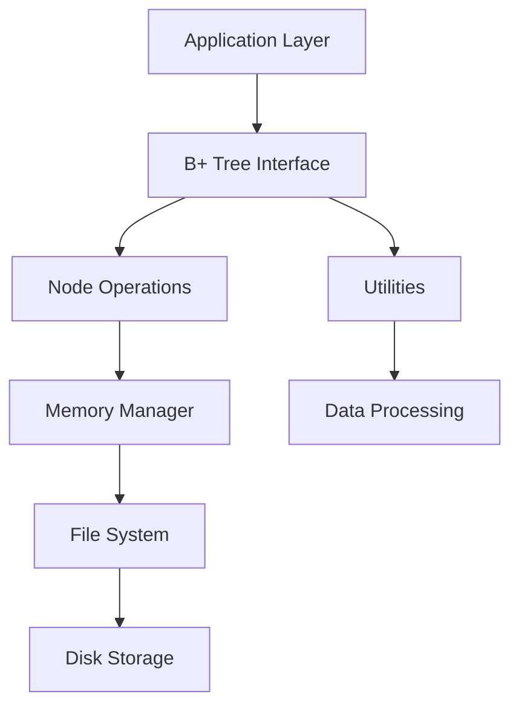

# `bplustree`

## Repository-Level Documentation: bplustree

### Tree Structure
```
bplustree/
├── bplustree/
│   ├── __init__.py
│   ├── tree.py
│   └── utils.py
```

### Purpose
The bplustree repository implements a high-performance, persistent B+ tree data structure designed for efficient key-value storage and retrieval. It addresses the need for ordered data structures that support fast point lookups, range queries, and ordered iteration while handling datasets larger than available RAM through intelligent memory management and disk I/O optimization.

This implementation is particularly valuable for database systems, indexing engines, and any application requiring persistent, ordered key-value storage with excellent performance characteristics for both random access and sequential traversal operations.

### Target Users
- Database engine developers requiring efficient indexing structures
- Data processing pipeline architects needing persistent ordered storage
- Systems engineers building scalable storage solutions
- Application developers requiring high-performance key-value access patterns

### Position in Ecosystem
This is a standalone library module that can be integrated into larger systems as a foundational data structure component. It provides a low-level, high-performance implementation that can serve as the backing store for higher-level database or caching systems.

### Architecture Overview
The system follows a layered architecture pattern with clear separation between:
1. **Core Data Structure Layer**: B+ tree implementation with node management
2. **Memory Management Layer**: Page-level caching and persistence handling  
3. **Utility Layer**: Helper functions for data processing and iteration
4. **File System Abstraction**: Persistent storage interface



### Entry Points
- **Module Import**: `from bplustree import BPlusTree`
- **CLI**: None (library-only)
- **API**: Direct instantiation and method calls on BPlusTree instances

### Core Features
1. **Persistent Key-Value Storage**: Fast point lookups and updates with durability guarantees
2. **Range Queries**: Efficient iteration over key ranges with slice notation support
3. **Ordered Iteration**: Natural ordering of keys for sequential access patterns
4. **Large Dataset Support**: Handles datasets larger than available memory through page-level caching
5. **Overflow Handling**: Automatic management of large values that exceed page capacity
6. **Transaction Safety**: Atomic operations with write transactions for consistency
7. **Checkpointing**: Periodic synchronization of changes to persistent storage

### Dependencies
- **typing**: For type hints and generics
- **os**: For file system operations
- **collections**: For deque data structure
- **contextlib**: For context manager support
- **logging**: For internal logging (implied from usage)

### Configuration
The system supports extensive configuration through constructor parameters:
- `filename`: Path to persistent storage file
- `page_size`: Size of memory pages (default: 4096 bytes)
- `order`: Maximum number of children per node (default: 100)
- `key_size`: Fixed size of keys in bytes (default: 8)
- `value_size`: Fixed size of values in bytes (default: 32)
- `cache_size`: Number of cached pages (default: 64)
- `serializer`: Custom serialization strategy (default: IntSerializer)

### Extension Points
- **Custom Serializers**: Implement Serializer interface for different key/value formats
- **Memory Management**: Extend FileMemory for custom caching strategies
- **Node Types**: Subclass node types for specialized behavior
- **Storage Backends**: Replace FileMemory with alternative persistence mechanisms

---

## Modules

- [`bplustree`](bplustree.md)

