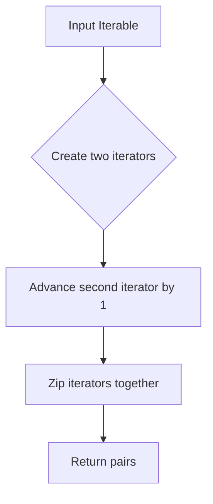

# `utils.py`

## `bplustree.utils.pairwise` · *function*

## Summary:
Returns consecutive pairs of elements from an iterable.

## Description:
Creates pairs of adjacent elements from the input iterable. This utility function is commonly used to iterate over consecutive pairs in sequences, such as comparing neighboring elements or creating sliding windows.

## Args:
    iterable (Iterable): An iterable object containing elements to be paired consecutively.

## Returns:
    zip: An iterator of tuples, where each tuple contains two consecutive elements from the input iterable. If the input has fewer than 2 elements, returns an empty iterator.

## Raises:
    None

## Constraints:
    Preconditions:
    - Input must be an iterable object
    - The iterable should support multiple iterations (i.e., it should be reusable)
    
    Postconditions:
    - Output iterator produces tuples of length 2
    - Each tuple contains consecutive elements from the input
    - Empty input results in empty output

## Side Effects:
    None

## Control Flow:


## Examples:
    >>> list(pairwise([1, 2, 3, 4]))
    [(1, 2), (2, 3), (3, 4)]
    
    >>> list(pairwise('abc'))
    [('a', 'b'), ('b', 'c')]
    
    >>> list(pairwise([]))
    []
    
    >>> list(pairwise([1]))
    []
```

## `bplustree.utils.iter_slice` · *function*

## Summary:
Splits a bytes iterable into fixed-size chunks and indicates which chunk is the final one.

## Description:
Generates chunks of a specified size from a bytes iterable, yielding each chunk along with a boolean flag indicating whether it's the last chunk in the sequence. This utility is useful for processing large binary data in fixed-size segments without loading the entire dataset into memory.

## Args:
    iterable (bytes): The bytes sequence to be split into chunks.
    n (int): The size of each chunk in bytes. Must be positive.

## Returns:
    Generator[tuple[bytes, bool]]: A generator yielding tuples of (chunk, is_last_chunk) where:
        - chunk (bytes): A slice of the original iterable of length n (except possibly the last chunk)
        - is_last_chunk (bool): True if this chunk is the final one, False otherwise

## Raises:
    None explicitly raised, but will raise IndexError if n <= 0 due to slicing behavior.

## Constraints:
    Preconditions:
        - iterable must be a bytes object
        - n must be a positive integer
    Postconditions:
        - All chunks except potentially the last will have exactly n bytes
        - The sum of all chunk sizes equals the length of the original iterable
        - Each yielded tuple contains a valid slice of the original iterable

## Side Effects:
    None

## Control Flow:
```mermaid
flowchart TD
    A[Start] --> B{start >= final_offset?}
    B -- Yes --> C[Break]
    B -- No --> D[rv = iterable[start:stop]]
    D --> E[start = stop]
    E --> F[stop = start + n]
    F --> G[Yield (rv, start >= final_offset)]
    G --> H[Loop back to B]
```

## Examples:
    >>> list(iter_slice(b'hello world', 3))
    [(b'hel', False), (b'lo ', False), (b'wor', False), (b'ld', True)]
    
    >>> list(iter_slice(b'abc', 2))
    [(b'ab', False), (b'c', True)]
    
    >>> list(iter_slice(b'', 2))
    []
```

