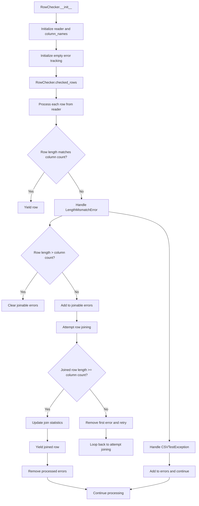

# `cleanup.py`

## `csvkit.cleanup.join_rows` · *function*

## Summary:
Joins multiple rows into a single row by concatenating elements from subsequent rows onto the last element of the first row.

## Description:
This function combines multiple rows into a single row by appending elements from subsequent rows to the last element of the first row, using a specified delimiter. It's primarily used to handle CSV records that have been incorrectly split across multiple lines due to newline characters within quoted fields.

## Args:
    rows (iterable): An iterable of rows (lists) to be joined together. Each row should be a list of string elements.
    joiner (str): String to use for joining elements. Defaults to a single space character ' '.

## Returns:
    list: A single joined row containing all elements from the input rows, with elements from subsequent rows appended to the last element of the first row.

## Raises:
    None explicitly raised by this function.

## Constraints:
    Preconditions:
    - The input `rows` must be iterable and contain at least one row
    - Each row in `rows` should be a list-like object
    
    Postconditions:
    - The returned list contains all elements from all input rows
    - Elements from rows after the first are appended to the last element of the first row
    - Empty rows are treated as having a single empty string element

## Side Effects:
    None

## Control Flow:
```mermaid
flowchart TD
    A[Start join_rows] --> B[Convert rows to list]
    B --> C[Copy first row as fixed_row]
    C --> D[Iterate through rows[1:]]
    D --> E{len(row) == 0?}
    E -->|Yes| F[row = ['']]
    E -->|No| G[Continue]
    F --> H[fixed_row[-1] += joiner + row[0]]
    G --> H
    H --> I[fixed_row.extend(row[1:])]
    I --> J[Next row]
    J --> D
    D --> K[Return fixed_row]
```

## Examples:
    >>> join_rows([['a', 'b'], ['c', 'd']])
    ['a', 'b c', 'd']
    
    >>> join_rows([['hello'], ['world']])
    ['hello world']
    
    >>> join_rows([['a', 'b'], [], ['c']])
    ['a', 'b ', 'c']
```

## `csvkit.cleanup.RowChecker` · *class*

## Summary:
Validates CSV rows for consistent column counts and attempts to repair rows with length mismatches by joining them with adjacent rows.

## Description:
The RowChecker class is responsible for validating CSV data integrity by ensuring all rows have consistent column counts matching the header row. When rows have mismatched lengths, it attempts to repair them by joining adjacent rows that are likely to be continuation lines of the same record. This is particularly useful for handling CSV files where quoted fields contain embedded newlines that cause records to be split across multiple lines.

The class is typically instantiated by CSV processing utilities that need to validate and clean CSV data before further processing. It serves as a bridge between raw CSV parsing and validated data processing.

## State:
- reader: A CSV reader object that provides access to the CSV data stream
- column_names: A list containing the header row values, or an empty list if the CSV is empty
- errors: A list of CSVTestException objects collected during validation
- rows_joined: An integer counting the total number of rows that were successfully joined
- joins: An integer counting the total number of join operations performed

## Lifecycle:
- Creation: Instantiate with a CSV reader object using `RowChecker(reader)`
- Usage: Call `checked_rows()` method to iterate over validated rows, which yields properly formatted rows and updates internal error tracking
- Destruction: No explicit cleanup required; relies on Python's garbage collection

## Method Map:


## Raises:
- StopIteration: Raised internally when the CSV reader is empty, causing column_names to be set to an empty list

## Example:
```python
import csv
from csvkit.cleanup import RowChecker

# Create a CSV reader
with open('data.csv', 'r') as f:
    reader = csv.reader(f)
    
    # Create RowChecker instance
    checker = RowChecker(reader)
    
    # Process validated rows
    for row in checker.checked_rows():
        print(row)
    
    # Check for errors
    if checker.errors:
        print(f"Found {len(checker.errors)} validation errors")
```

### `csvkit.cleanup.RowChecker.__init__` · *method*

## Summary:
Initializes a RowChecker instance with a CSV reader and sets up tracking attributes for row validation.

## Description:
This constructor method initializes a RowChecker object by storing the provided CSV reader and attempting to extract column names from it. If the reader is empty, it gracefully handles this case by setting empty column names. The method also initializes tracking attributes used for monitoring row processing and error reporting during CSV cleanup operations.

## Args:
    reader: A CSV reader object that provides access to CSV data rows

## Returns:
    None

## Raises:
    None explicitly raised

## State Changes:
    Attributes READ: None
    Attributes WRITTEN: 
    - self.reader: Stores the provided CSV reader object
    - self.column_names: Stores column names from the reader or empty list if reader is empty
    - self.errors: Initializes empty list for tracking errors
    - self.rows_joined: Initializes counter for joined rows
    - self.joins: Initializes counter for join operations

## Constraints:
    Preconditions:
    - The reader parameter should be a valid CSV reader object that supports iteration
    - The reader should either contain column names in the first row or be empty
    
    Postconditions:
    - self.reader is set to the provided reader object
    - self.column_names contains column names or an empty list
    - All tracking attributes are initialized to their default values

## Side Effects:
    None

### `csvkit.cleanup.RowChecker.checked_rows` · *method*

## Summary:
Generates validated CSV rows while attempting to fix length-mismatched rows by joining them with subsequent rows.

## Description:
Processes rows from a CSV reader, validating that each row has the correct number of columns matching the header. When a row has too few columns, it accumulates rows that can potentially be joined to form a complete row. When a row has too many columns, it discards accumulated rows and continues processing. This method serves as the core validation and correction mechanism for CSV data cleaning.

## Args:
    None

## Returns:
    Generator yielding lists of strings, where each list represents a properly formatted CSV row with the correct number of columns.

## Raises:
    LengthMismatchError: When a row has a different number of columns than expected, with detailed information about the line number and problematic row.
    CSVTestException: When other CSV validation errors occur during processing.

## State Changes:
    Attributes READ:
        - self.column_names: The expected number of columns for validation
        - self.reader: The CSV reader object providing rows to process
        - self.reader.line_num: Current line number in the CSV file
    Attributes WRITTEN:
        - self.errors: Accumulates validation errors encountered during processing
        - self.rows_joined: Counts total rows that were successfully joined
        - self.joins: Counts successful join operations performed

## Constraints:
    Preconditions:
        - self.column_names must be initialized with column headers
        - self.reader must be a valid CSV reader object
        - self.reader.line_num must be accessible for tracking line numbers
    Postconditions:
        - All yielded rows will have exactly len(self.column_names) columns
        - Error accumulation in self.errors is updated appropriately
        - Join statistics (self.rows_joined, self.joins) are incremented when joins occur

## Side Effects:
    - Modifies self.errors by appending validation errors
    - Modifies self.rows_joined and self.joins counters when row joining occurs
    - Reads from the underlying CSV reader, advancing its position
    - May yield modified rows that result from joining multiple rows together

