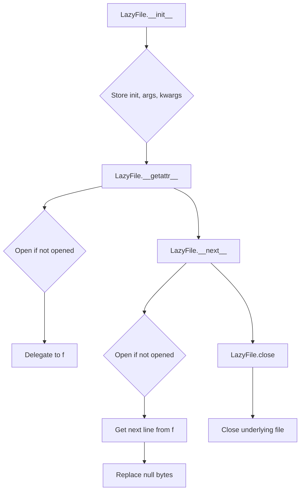

# `cli.py`

## `csvkit.cli.LazyFile` · *class*

## Summary:
A lazy file wrapper that delays file initialization until first access, enabling deferred resource allocation and efficient handling of potentially large files.

## Description:
The LazyFile class serves as a proxy for file-like objects, implementing lazy initialization to defer actual file opening until the file is first accessed. This pattern is particularly useful when working with potentially large files or when file operations might be skipped entirely. The class delegates all method calls to the underlying file object once initialized, while maintaining proper resource management through explicit close methods that clean up the underlying file handle and reset internal state tracking.

## State:
- `init`: Callable that creates the actual file object (e.g., built-in open function)
- `f`: Reference to the actual file object (None initially, set during lazy initialization)
- `_is_lazy_opened`: Boolean flag indicating whether the file has been opened (False initially)
- `_lazy_args`: Tuple of positional arguments passed to the init callable
- `_lazy_kwargs`: Dictionary of keyword arguments passed to the init callable

## Lifecycle:
- Creation: Instantiate with an init callable and any arguments needed to create the file object
- Usage: Access methods or iterate over lines; file opens automatically on first access
- Destruction: Call close() method to properly close the underlying file and reset internal state

## Method Map:


## Raises:
- Any exceptions raised by the underlying file initialization function (init) when called with provided arguments
- AttributeError when accessing non-existent attributes on the underlying file object after initialization

## Example:
```python
# Create a lazy file wrapper
lazy_file = LazyFile(open, 'data.csv', 'r')

# File is not opened yet
# Read first line (triggers lazy initialization)
first_line = next(lazy_file)
# File is now opened and first line is read

# Iterate through remaining lines
for line in lazy_file:
    process(line)

# Explicitly close when done
lazy_file.close()
```

### `csvkit.cli.LazyFile.__init__` · *method*

## Summary:
Initializes a LazyFile object that defers actual file opening until first access.

## Description:
Sets up the lazy file loading mechanism by storing the file constructor function and its initialization parameters. The actual file object is not created until the first attribute access or iteration occurs, enabling efficient resource management when dealing with potentially large files or multiple file operations.

## Args:
    init (callable): A callable (typically a file constructor like open()) that will be used to create the actual file object when needed.
    *args: Variable length argument list passed to the init callable when the file is eventually opened.
    **kwargs: Arbitrary keyword arguments passed to the init callable when the file is eventually opened.

## Returns:
    None: This method initializes instance attributes but does not return a value.

## Raises:
    None: This method does not raise exceptions directly.

## State Changes:
    Attributes READ: None
    Attributes WRITTEN: 
    - self.init: Stores the callable used to create the actual file object
    - self.f: Initialized to None, will hold the actual file object when opened
    - self._is_lazy_opened: Initialized to False, tracks whether the file has been opened
    - self._lazy_args: Stores positional arguments for the init callable
    - self._lazy_kwargs: Stores keyword arguments for the init callable

## Constraints:
    Preconditions:
    - The init parameter must be a callable that can be invoked with the provided args and kwargs
    - The args and kwargs must be compatible with the init callable's signature
    
    Postconditions:
    - self.init contains the provided callable
    - self.f is initialized to None
    - self._is_lazy_opened is initialized to False
    - self._lazy_args contains the provided positional arguments
    - self._lazy_kwargs contains the provided keyword arguments

## Side Effects:
    None: This method performs no I/O or external operations. The actual file opening occurs later when other methods are called.

### `csvkit.cli.LazyFile.__getattr__` · *method*

## Summary:
Delegates attribute access to the underlying file object after ensuring it's lazily opened.

## Description:
This method implements Python's attribute access protocol (__getattr__) to provide transparent access to the underlying file object. When an attribute is requested that isn't defined on the LazyFile instance itself, this method is invoked. It ensures the underlying file is opened (if not already done) and then forwards the attribute access to the actual file object.

## Args:
    name (str): The name of the attribute being accessed.

## Returns:
    Any: The value of the requested attribute from the underlying file object.

## Raises:
    AttributeError: If the requested attribute doesn't exist on the underlying file object.

## State Changes:
    Attributes READ: 
    - self._is_lazy_opened: Checked to determine if file needs to be opened
    - self.f: Accessed to get the underlying file object
    Attributes WRITTEN: 
    - self.f: Set when _open() creates the underlying file object
    - self._is_lazy_opened: Set to True after successful file opening

## Constraints:
    Preconditions:
    - The LazyFile instance must have been properly initialized with a valid init callable
    - The init callable must be able to accept the stored args and kwargs
    - The underlying file object must support the requested attribute access
    
    Postconditions:
    - The underlying file object is opened if it wasn't already
    - The requested attribute is successfully retrieved from the underlying file object

## Side Effects:
    I/O: May trigger file opening operations if the file hasn't been opened yet
    External service calls: Through the underlying file object's methods
    Mutations: May modify the internal state of the underlying file object if the accessed attribute is a method that modifies file state

### `csvkit.cli.LazyFile.__iter__` · *method*

## Summary:
Makes the LazyFile instance iterable by returning itself as an iterator.

## Description:
Implements Python's iterator protocol by returning the LazyFile instance itself. This enables the LazyFile object to be used in for-loops and other iteration contexts. When the object is iterated over, the __next__ method will be called, which handles lazy opening of the underlying file and retrieves the next item.

## Args:
    None: This method takes no arguments beyond the implicit self parameter.

## Returns:
    LazyFile: Returns the LazyFile instance itself, making it an iterator.

## Raises:
    None: This method does not raise exceptions directly.

## State Changes:
    Attributes READ: None
    Attributes WRITTEN: None

## Constraints:
    Preconditions:
    - The LazyFile instance must have been properly initialized with a valid init callable
    - The underlying file object must support iteration if the iterator is actually consumed
    
    Postconditions:
    - The LazyFile instance becomes an iterable object
    - The instance maintains its lazy loading behavior during iteration

## Side Effects:
    None: This method performs no I/O or external operations. The actual file opening and iteration occur during __next__ calls.

### `csvkit.cli.LazyFile.close` · *method*

## Summary:
Closes a lazily opened file handle and resets the internal state tracking.

## Description:
Closes the underlying file handle associated with this LazyFile instance if it was previously opened. This method ensures proper resource cleanup by closing the file and resetting internal tracking flags. It is typically called during the normal lifecycle of a LazyFile instance when the file is no longer needed, either explicitly by the user or implicitly during garbage collection.

## Args:
    None

## Returns:
    None

## Raises:
    Exception: Any exceptions raised by the underlying file's close() method.

## State Changes:
    Attributes READ: 
    - self._is_lazy_opened: Checked to determine if file needs to be closed
    Attributes WRITTEN: 
    - self.f: Set to None after closing the file handle
    - self._is_lazy_opened: Set to False to indicate the file is no longer open

## Constraints:
    Preconditions:
    - The LazyFile instance must have been properly initialized
    - The underlying file handle (if opened) must support the close() method
    
    Postconditions:
    - If the file was open, it is closed and the file handle is cleared
    - Internal state tracking is reset to indicate the file is closed
    - Subsequent accesses to the file will trigger lazy reopening if needed

## Side Effects:
    I/O: Closes the underlying file handle, releasing system resources
    Resource deallocation: Frees file descriptor and related system resources

### `csvkit.cli.LazyFile.__next__` · *method*

## Summary:
Returns the next line from a lazily-opened file after removing null bytes.

## Description:
This method implements the iterator protocol for the LazyFile class, enabling iteration over file contents. It ensures the underlying file is opened before retrieving the next line, then strips null characters from the returned content.

## Args:
    None

## Returns:
    str: The next line from the file with null bytes (\0) replaced by empty strings.

## Raises:
    StopIteration: When the end of file is reached.
    Exception: Any exceptions raised by the underlying file object's __next__ method.

## State Changes:
    Attributes READ: self.f, self._is_lazy_opened
    Attributes WRITTEN: None

## Constraints:
    Preconditions: The LazyFile instance must have been initialized with a callable that returns a file-like object.
    Postconditions: The file is opened if not already opened, and the next line is returned with null bytes removed.

## Side Effects:
    I/O: Reads from the underlying file object.
    File Opening: Triggers file opening if not already opened (lazy initialization).

### `csvkit.cli.LazyFile._open` · *method*

## Summary:
Initializes the underlying file object using lazy initialization when first accessed.

## Description:
Implements the lazy opening mechanism for file handling. This method is automatically invoked when file attributes are accessed via `__getattr__` or when iterating through the file via `__next__`. It ensures that the underlying file object is only created when actually needed, improving performance by deferring expensive file operations until they're required.

## Args:
    None

## Returns:
    None

## Raises:
    Exception: Any exceptions raised by the underlying init callable when creating the file object.

## State Changes:
    Attributes READ: 
    - self._is_lazy_opened: Checked to determine if file initialization is needed
    - self._lazy_args: Arguments passed to the init callable
    - self._lazy_kwargs: Keyword arguments passed to the init callable
    - self.init: The callable used to create the underlying file object
    Attributes WRITTEN: 
    - self.f: Set to the newly created file object
    - self._is_lazy_opened: Set to True to indicate the file has been initialized

## Constraints:
    Preconditions:
    - The LazyFile instance must have been properly initialized with a valid init callable
    - The init callable must be able to accept the stored args and kwargs
    - The init callable should return a file-like object
    
    Postconditions:
    - The underlying file object is created and assigned to self.f
    - The _is_lazy_opened flag is set to True
    - The method is idempotent - subsequent calls have no effect

## Side Effects:
    I/O: May trigger file opening operations when the underlying file is first accessed
    Resource allocation: Creates a new file object instance when first called

## `csvkit.cli.CSVKitUtility` · *class*

*No documentation generated.*

### `csvkit.cli.CSVKitUtility.__init__` · *method*

## Summary:
Initializes a CSVKit utility instance by setting up argument parsing, configuring output handling, and preparing CSV reader/writer parameters.

## Description:
This method serves as the primary constructor for CSVKit utility classes, orchestrating the setup of command-line argument parsing, output file handling, and CSV processing parameters. It is called during object instantiation to prepare the utility for processing CSV data according to user-provided arguments.

The initialization process includes:
1. Setting up a common argument parser with standard CSV processing flags through `_init_common_parser()`
2. Adding utility-specific arguments through the abstract `add_arguments()` method
3. Parsing command-line arguments using `argparser.parse_args()`
4. Configuring output file handling (defaulting to stdout)
5. Extracting CSV reader and writer configuration parameters via `_extract_csv_reader_kwargs()` and `_extract_csv_writer_kwargs()`
6. Installing custom exception handling through `_install_exception_handler()`
7. Setting up signal handling for SIGPIPE to prevent broken pipe errors

This method is designed as a separate method rather than being inlined because it performs multiple distinct initialization steps that could be reused or overridden by subclasses, and it follows the pattern of separating concerns between argument parsing, configuration, and execution setup. It represents the entry point for the utility's lifecycle, where all configuration is established before the actual processing begins.

## Args:
    args (list[str], optional): Command-line arguments to parse. If None, uses sys.argv[1:]. Defaults to None.
    output_file (file-like object, optional): Output file handle to use. If None, defaults to sys.stdout. Defaults to None.

## Returns:
    None: This method initializes instance attributes but does not return a value.

## Raises:
    SystemExit: Raised by argparse when invalid arguments are provided or when help/version is requested.
    ImportError: Raised when signal module cannot be imported (though handled gracefully).
    AttributeError: Raised when signal module doesn't have SIGPIPE or SIG_DFL attributes (though handled gracefully).

## State Changes:
    Attributes READ:
        - self.override_flags (used in `_init_common_parser`)
        - self.description (used in `_init_common_parser`)  
        - self.epilog (used in `_init_common_parser`)
        - self.args.encoding (used in `_install_exception_handler`)
        - self.args.tabs (used in `_extract_csv_reader_kwargs`)
        - self.args.delimiter (used in `_extract_csv_reader_kwargs`)
        - self.args.no_header_row (used in `_extract_csv_reader_kwargs`)
        - self.args.line_numbers (used in `_extract_csv_writer_kwargs`)
        - self.args.skip_lines (used in `skip_lines` method)
        - self.args.columns (used in `get_rows_and_column_names_and_column_ids`)
        - self.args.not_columns (used in `get_rows_and_column_names_and_column_ids`)
        - self.args.zero_based (used in `get_column_offset`)
        - self.args.blanks (used in `get_column_types`)
        - self.args.null_values (used in `get_column_types`)
        - self.args.no_inference (used in `get_column_types`)
        - self.args.date_format (used in `get_column_types`)
        - self.args.datetime_format (used in `get_column_types`)
        - self.args.locale (used in `get_column_types`)
        - self.args.input_path (used in `_open_input_file`)

    Attributes WRITTEN:
        - self.argparser (created by `_init_common_parser`)
        - self.args (set by `argparser.parse_args`)
        - self.output_file (set based on output_file parameter)
        - self.reader_kwargs (set by `_extract_csv_reader_kwargs`)
        - self.writer_kwargs (set by `_extract_csv_writer_kwargs`)

## Constraints:
    Preconditions:
        - The class must implement the abstract `add_arguments()` method
        - The class must define `description` and `epilog` attributes
        - The class must define `override_flags` attribute
        - If `output_file` is provided, it must be a file-like object supporting write operations

    Postconditions:
        - `self.argparser` is initialized with standard CSV arguments plus utility-specific arguments
        - `self.args` contains parsed command-line arguments
        - `self.output_file` is set to either the provided file handle or sys.stdout
        - `self.reader_kwargs` contains CSV reader configuration parameters
        - `self.writer_kwargs` contains CSV writer configuration parameters
        - Exception handler is installed via `_install_exception_handler`
        - Signal handler for SIGPIPE is configured (when possible)

## Side Effects:
    - Creates and configures an argparse ArgumentParser instance
    - Sets `sys.excepthook` to a custom exception handler
    - Attempts to configure signal handling for SIGPIPE to prevent broken pipe errors
    - May modify `sys.stdin.encoding` if input is from stdin
    - Reads command-line arguments via `sys.argv` or provided `args` parameter
    - May open input file handles through `_open_input_file` (though not directly in init)

### `csvkit.cli.CSVKitUtility.add_arguments` · *method*

## Summary:
Adds command-line arguments specific to a CSV utility subclass to the argument parser.

## Description:
This method serves as an abstract interface that must be implemented by all subclasses of CSVKitUtility. It is called during the initialization process to allow each utility to register its specific command-line arguments with the shared argument parser. The method provides a standardized way for utilities to extend the common set of CSV processing arguments with their own functionality.

## Args:
    self: The instance of the CSVKitUtility subclass that implements this method.

## Returns:
    None: This method does not return a value.

## Raises:
    NotImplementedError: Always raised by the base class implementation, indicating that subclasses must override this method.

## State Changes:
    Attributes READ: None
    Attributes WRITTEN: None

## Constraints:
    Preconditions: The method must be called after `_init_common_parser()` has been executed to ensure the `argparser` attribute is initialized.
    Postconditions: After execution, the `argparser` attribute will contain both the common CSV arguments and the subclass-specific arguments.

## Side Effects:
    None: This method does not cause any I/O operations or external service calls. It only modifies the internal argument parser configuration.

### `csvkit.cli.CSVKitUtility.run` · *method*

## Summary:
Executes the CSV processing utility by managing input file lifecycle, handling agate library warnings, and invoking the core processing logic.

## Description:
This method orchestrates the main execution flow for CSVKit utilities. It conditionally opens the input file based on override flags, configures warning handling for the agate library to suppress specific warnings about column names, executes the utility's core logic through the abstract main() method, and ensures proper cleanup of input file resources regardless of execution outcome. The method is designed to be called by the parent class's lifecycle management and handles the common setup and teardown operations that all CSV utilities require.

## Args:
    self: The instance of the CSVKitUtility subclass that implements the specific CSV processing logic.

## Returns:
    None: This method does not return a value directly, but implementations of main() may return processed results.

## Raises:
    Any exceptions raised by:
    - self._open_input_file() when opening input files
    - self.main() when executing the utility's core logic
    - self.input_file.close() when closing input files
    - Warning filters when applying warning configurations
    - Any exceptions raised by the utility-specific main() implementation

## State Changes:
    Attributes READ:
    - self.override_flags: Determines whether input file operations should be skipped (specifically checks for 'f' flag)
    - self.args.input_path: Used to determine input file source when opening
    - self.args.no_header_row: Used to configure warning filters for agate library
    - self.input_file: Read to determine if it needs closing
    
    Attributes WRITTEN:
    - self.input_file: Assigned the result of self._open_input_file() when override_flags don't contain 'f'

## Constraints:
    Preconditions:
    - self.args must be properly initialized (via __init__)
    - self.override_flags must be set to control argument availability
    - The main() method must be implemented by subclasses
    - Input file paths must be valid or '-' for stdin
    - self._open_input_file() must be implemented and functional
    
    Postconditions:
    - Input file is opened and assigned to self.input_file when appropriate (when 'f' is not in override_flags)
    - Input file is closed in all execution paths (even on exceptions) when appropriate (when 'f' is not in override_flags)
    - Warning filters are properly configured for agate library when no_header_row is specified
    - The main() method is called to execute utility-specific logic
    - All exceptions from main() are propagated to the caller

## Side Effects:
    - Opens and closes input file handles through self._open_input_file() and self.input_file.close() when 'f' is not in override_flags
    - Configures warning filters for the agate library when no_header_row is specified
    - Calls the abstract main() method which may perform various I/O operations
    - May reconfigure sys.stdin encoding when reading from stdin (through _open_input_file)
    - Uses try/finally block to guarantee cleanup of input file resources

### `csvkit.cli.CSVKitUtility.main` · *method*

## Summary:
Abstract method that must be implemented by subclasses to define specific CSV processing behavior.

## Description:
This method serves as the primary entry point for CSV processing functionality in concrete implementations of CSVKitUtility. It is called by the parent class's `run()` method after setting up the input file and parsing command-line arguments. The method is intentionally left unimplemented in the base class to enforce that each concrete subclass provides its own specific CSV processing logic.

## Args:
    self: The instance of the concrete subclass implementing this method.

## Returns:
    This method does not return a value directly, but implementations may return processed data or results specific to the utility.

## Raises:
    NotImplementedError: Always raised by the base class implementation, indicating that subclasses must override this method.

## State Changes:
    Attributes READ: 
    - self.args: Command-line arguments parsed by the argument parser
    - self.input_file: Input file handle opened by _open_input_file method
    - self.reader_kwargs: CSV reader configuration parameters
    
    Attributes WRITTEN: None (this is an abstract method)

## Constraints:
    Preconditions:
    - This method must be overridden by concrete subclasses
    - The parent class's `run()` method must be called to properly set up input/output streams and argument parsing
    - Command-line arguments must be properly configured before calling this method
    
    Postconditions:
    - Concrete implementations must handle their own result processing and output
    - The method should not close input files as this is handled by the parent class's run() method

## Side Effects:
    - Depends on concrete implementation, but typically involves reading from self.input_file and writing to self.output_file
    - May involve file I/O operations, data processing, and output formatting

### `csvkit.cli.CSVKitUtility._init_common_parser` · *method*

## Summary:
Initializes a common argument parser with standard CSV processing command-line options for CSVKit utilities.

## Description:
Configures an argparse.ArgumentParser instance with a comprehensive set of command-line arguments commonly needed for CSV processing operations. This method provides a standardized interface for parsing CSV file options such as delimiters, quoting styles, encoding, and various formatting controls. The parser setup respects override flags that allow subclasses to customize which options are available.

## Args:
    self: The instance of CSVKitUtility class containing configuration attributes

## Returns:
    None: This method modifies the instance's argparser attribute in-place

## Raises:
    None explicitly raised

## State Changes:
    Attributes READ: self.description, self.epilog, self.override_flags
    Attributes WRITTEN: self.argparser

## Constraints:
    Preconditions: The instance must have description, epilog, and override_flags attributes defined
    Postconditions: The instance's argparser attribute is initialized with common CSV processing arguments

## Side Effects:
    None: This method only configures the argument parser and doesn't perform I/O or external service calls

### `csvkit.cli.CSVKitUtility._open_input_file` · *method*

## Summary:
Opens and returns a file-like object for CSV input, handling stdin, regular files, and compressed files with lazy initialization.

## Description:
This method provides a unified interface for opening CSV input files, supporting standard input ('-'), regular files, and compressed files (.gz, .bz2, .xz). It uses LazyFile wrapper for efficient resource management by deferring actual file opening until first access. This method is typically called during the setup phase of CSV processing utilities to prepare the input file stream.

## Args:
    path (str): Path to the input file, or '-' to indicate stdin. May be None or empty string.
    opened (bool): Flag indicating whether the file is already opened. Defaults to False.

## Returns:
    file-like object: A file-like object that can be used for reading CSV data. Returns sys.stdin when path is '-' or None/empty, otherwise returns a LazyFile wrapper around the appropriate file opening function.

## Raises:
    Any exceptions raised by the underlying file opening functions (open, gzip.open, bz2.open, lzma.open) when they are called with provided arguments.

## State Changes:
    Attributes READ: self.args.encoding
    Attributes WRITTEN: None

## Constraints:
    Preconditions: 
    - self.args.encoding must be set to a valid encoding string
    - The path parameter should be a valid file path or '-' for stdin
    - When opened=True, the caller must ensure the file is already properly configured
    
    Postconditions:
    - Returns a valid file-like object that can be read from
    - For stdin, the encoding is reconfigured according to self.args.encoding
    - For regular files, returns a LazyFile wrapper that will open the file on first access

## Side Effects:
    - Configures sys.stdin encoding when path is '-' and opened=False
    - Creates LazyFile wrapper for regular files, deferring actual file opening
    - May raise exceptions from underlying file operations

### `csvkit.cli.CSVKitUtility._extract_csv_reader_kwargs` · *method*

## Summary:
Extracts CSV reader configuration keyword arguments from command-line arguments for use with Python's csv module.

## Description:
This method processes the command-line arguments stored in `self.args` to construct a dictionary of keyword arguments suitable for configuring a CSV reader. It handles various CSV parsing options such as delimiter specification, quoting behavior, and header row handling. This method is designed to centralize the logic for translating CLI arguments into CSV reader parameters, making the configuration reusable across different parts of the CSV processing pipeline.

## Args:
    None - This method operates on instance attributes and does not accept parameters.

## Returns:
    dict: A dictionary containing CSV reader configuration parameters including:
        - 'delimiter': Character used to separate fields (either tab or custom delimiter)
        - 'quotechar': Character used to quote fields
        - 'quoting': Quoting style constant
        - 'doublequote': Boolean indicating whether double quotes are doubled
        - 'escapechar': Character used to escape delimiters
        - 'field_size_limit': Maximum field size limit
        - 'skipinitialspace': Boolean indicating whether to ignore whitespace after delimiter
        - 'header': Boolean indicating whether input has header row (note: this is inverted from the CLI flag)

## Raises:
    None - This method does not explicitly raise exceptions.

## State Changes:
    Attributes READ: 
        - self.args.tabs
        - self.args.delimiter
        - self.args.quotechar
        - self.args.quoting
        - self.args.doublequote
        - self.args.escapechar
        - self.args.field_size_limit
        - self.args.skipinitialspace
        - self.args.no_header_row

    Attributes WRITTEN: None - This method only reads from self.args and returns a dictionary.

## Constraints:
    Preconditions:
        - self.args must be initialized (typically by argparse in the constructor)
        - All referenced arguments must be defined in the argument parser
        
    Postconditions:
        - Returns a dictionary with appropriate CSV reader parameters
        - The returned dictionary may be empty if no arguments are specified
        - The 'header' parameter value is inverted from the CLI flag (when no_header_row=True, header=False)

## Side Effects:
    None - This method performs no I/O operations or external service calls.

### `csvkit.cli.CSVKitUtility._extract_csv_writer_kwargs` · *method*

## Summary:
Extracts CSV writer configuration keyword arguments from command-line arguments for use with Python's csv module.

## Description:
This method processes the command-line arguments stored in `self.args` to construct a dictionary of keyword arguments suitable for configuring a CSV writer. It specifically handles the 'line_numbers' option which inserts a column of line numbers at the front of the output when enabled. This method is designed to centralize the logic for translating CLI arguments into CSV writer parameters, making the configuration reusable across different parts of the CSV processing pipeline.

The method is called during the initialization of CSVKitUtility subclasses to populate `self.writer_kwargs`, which are then used when creating CSV writers for output operations.

## Args:
    None - This method operates on instance attributes and does not accept parameters.

## Returns:
    dict: A dictionary containing CSV writer configuration parameters. Currently supports:
        - 'line_numbers' (bool): When True, inserts a column of line numbers at the front of output

## Raises:
    None - This method does not explicitly raise exceptions.

## State Changes:
    Attributes READ: 
        - self.args.line_numbers

    Attributes WRITTEN: None - This method only reads from self.args and returns a dictionary.

## Constraints:
    Preconditions:
        - self.args must be initialized (typically by argparse in the constructor)
        - The 'line_numbers' argument must be defined in the argument parser
        
    Postconditions:
        - Returns a dictionary with appropriate CSV writer parameters
        - The returned dictionary may be empty if no writer-specific arguments are specified

## Side Effects:
    None - This method performs no I/O operations or external service calls.

### `csvkit.cli.CSVKitUtility._install_exception_handler` · *method*

## Summary
Installs a custom exception handler that provides user-friendly error messages for common CSV processing issues while preserving verbose debugging capabilities.

## Description
This method configures the global `sys.excepthook` to intercept unhandled exceptions and display them in a more user-friendly format. When the verbose flag is enabled, it delegates to the default exception handler; otherwise, it provides tailored error messages for Unicode decode errors and generic exceptions.

## Args
    None

## Returns
    None

## Raises
    None

## State Changes
    Attributes READ: self.args.verbose, self.args.encoding
    Attributes WRITTEN: sys.excepthook

## Constraints
    Preconditions: 
    - self.args must be initialized (available after __init__ completes)
    - self.args.verbose must be a boolean attribute
    - self.args.encoding must be a string attribute
    
    Postconditions:
    - sys.excepthook is replaced with a custom handler function
    - The handler respects the verbose flag setting

## Side Effects
    - Modifies the global sys.excepthook
    - Writes error messages to stderr
    - May change the behavior of unhandled exception reporting throughout the application

### `csvkit.cli.CSVKitUtility.get_column_types` · *method*

## Summary:
Constructs and returns an agate.TypeTester instance configured with appropriate data type detectors for CSV column inference, supporting flexible null value handling and type inference options.

## Description:
This method builds a hierarchy of data type detectors used by agate to infer column types when reading CSV files. It configures null value handling based on command-line arguments (--blanks and --null-value) and creates a list of type detectors in priority order, including boolean, timedelta, date, datetime, and text types. The resulting TypeTester is used to automatically detect appropriate data types for CSV columns during processing. When --no-inference is specified, only text type detection is used.

The method dynamically adjusts the order of type detectors based on whether date/datetime formats are specified, placing the Number type appropriately in the detection hierarchy to ensure proper type inference.

## Args:
    None

## Returns:
    agate.TypeTester: An agate TypeTester instance containing a list of data type detectors ordered by priority for column type inference. The detectors include Boolean, TimeDelta, Date, DateTime, and Text types, with Number type inserted based on date format configuration.

## Raises:
    None explicitly raised

## State Changes:
    Attributes READ: self.args.blanks, self.args.null_values, self.args.no_inference, self.args.locale, self.args.date_format, self.args.datetime_format
    Attributes WRITTEN: None

## Constraints:
    Preconditions: The CSVKitUtility instance must have been initialized with parsed arguments (self.args must be populated)
    Postconditions: Returns a properly configured agate.TypeTester object ready for use in column type detection

## Side Effects:
    None

### `csvkit.cli.CSVKitUtility.get_column_offset` · *method*

## Summary:
Determines the appropriate column offset (0 or 1) based on the zero-based command-line flag for consistent column indexing.

## Description:
Returns 0 if the zero-based flag is set, indicating 0-based column indexing, or 1 if unset, indicating 1-based column indexing. This method centralizes the logic for column offset determination to ensure consistent behavior across all CSV processing utilities that work with column identifiers.

## Args:
    None

## Returns:
    int: 0 if zero-based indexing is enabled, 1 otherwise

## Raises:
    None

## State Changes:
    Attributes READ: self.args.zero_based
    Attributes WRITTEN: None

## Constraints:
    Preconditions: The CSVKitUtility instance must have been initialized with command-line arguments containing the 'zero_based' flag
    Postconditions: Always returns either 0 or 1

## Side Effects:
    None

### `csvkit.cli.CSVKitUtility.skip_lines` · *method*

## Summary:
Skips a specified number of lines from the input file and advances the file pointer accordingly.

## Description:
This method reads and discards a specified number of lines from the input file, effectively skipping initial lines such as comments or metadata. It's designed to be called before CSV processing begins to ensure that header rows or other non-data content is properly bypassed. The method modifies the input file's position and decrements the skip_lines counter in the arguments.

## Args:
    None

## Returns:
    io.TextIOWrapper: The input file object with its file pointer advanced past the skipped lines.

## Raises:
    ValueError: When the skip_lines argument is not an integer type.

## State Changes:
    Attributes READ: self.args.skip_lines, self.input_file
    Attributes WRITTEN: self.args.skip_lines (decremented during execution)

## Constraints:
    Preconditions:
        - The CSVKitUtility instance must be properly initialized with command-line arguments
        - self.input_file must be an open file object that supports readline() method
        - self.args.skip_lines must be an integer value
    Postconditions:
        - The input file pointer is advanced by the specified number of lines
        - The skip_lines argument counter is decremented to zero
        - Returns the modified input file object ready for further processing

## Side Effects:
    - Modifies the input file pointer position through readline() operations
    - Reads from the input file stream

### `csvkit.cli.CSVKitUtility.get_rows_and_column_names_and_column_ids` · *method*

## Summary:
Initializes and returns CSV data iterators, column names, and column identifier mappings for subsequent processing in CSVKit utilities.

## Description:
This method prepares CSV data for processing by creating a rows iterator, determining column names, and resolving column identifiers into zero-based indices. It handles both CSV files with and without header rows, manages column offset based on user preferences, and processes column selection/exclusion patterns. This method is a core utility in the CSVKit CLI framework that standardizes data preparation across all CSV processing commands.

## Args:
    **kwargs: Additional keyword arguments passed directly to agate.csv.reader() for CSV parsing configuration.

## Returns:
    tuple: A 3-tuple containing:
        - rows (iterator): An iterator over CSV rows, properly positioned after any skipped lines
        - column_names (list[str]): List of column names extracted from the header row or generated default headers
        - column_ids (list[int] or range): List of zero-based column indices matching user-specified columns, or a range for all columns

## Raises:
    None explicitly raised by this method. However, underlying functions may raise:
        - ColumnIdentifierError: From parse_column_identifiers when column identifiers are invalid
        - StopIteration: When CSV file is empty (handled gracefully)

## State Changes:
    Attributes READ: self.args.no_header_row, self.args.columns, self.args.zero_based, self.args.skip_lines
    Attributes WRITTEN: self.args.skip_lines (decremented during skip_lines call)

## Constraints:
    Preconditions:
        - CSVKitUtility instance must be properly initialized with command-line arguments
        - self.input_file must be opened and accessible
        - self.args.skip_lines must be an integer
    Postconditions:
        - The input file pointer is advanced past any skipped lines
        - Returns valid column names and indices for downstream processing
        - Handles empty CSV files gracefully by returning empty structures

## Side Effects:
    - Modifies the input file pointer position through readline() operations in skip_lines()
    - Reads from stdin or file input stream
    - May modify self.args.skip_lines during execution

### `csvkit.cli.CSVKitUtility.print_column_names` · *method*

## Summary:
Prints column names from a CSV file with numbered formatting to the output file.

## Description:
This method reads the first row of a CSV file and displays each column name with a sequential number. It enforces that the --no-header-row option cannot be used with the -n or --names options. The numbering can be either 1-based (default) or 0-based depending on the --zero flag setting.

## Args:
    None explicitly taken as parameters (uses self.args)

## Returns:
    None

## Raises:
    RequiredHeaderError: When the --no-header-row argument is used in combination with the -n or --names options.

## State Changes:
    Attributes READ:
        - self.args.no_header_row
        - self.args.zero_based
        - self.reader_kwargs
    Attributes WRITTEN:
        - self.output_file (via write operation)

## Constraints:
    Preconditions:
        - The CSV file must be readable and have at least one row
        - The self.input_file attribute must be properly initialized
        - The self.skip_lines() method must work correctly
        - The self.reader_kwargs must be properly configured
    Postconditions:
        - Column names are written to self.output_file in the format "XXX: column_name"
        - The output format is consistent with the zero-based/one-based setting

## Side Effects:
    - Writes formatted text to self.output_file (stdout by default)
    - Reads from self.input_file (the CSV file)
    - Calls self.skip_lines() to skip initial lines
    - Uses agate.csv.reader to parse the CSV data

### `csvkit.cli.CSVKitUtility.additional_input_expected` · *method*

## Summary:
Determines whether the utility should expect additional input from standard input when running interactively.

## Description:
Checks if stdin is connected to a terminal device and no input file path was specified, indicating that the program should read input from standard input. This method is used to control behavior when the utility is run in interactive mode versus when it's provided with a file argument.

## Args:
    self: The CSVKitUtility instance

## Returns:
    bool: True if stdin is connected to a terminal (indicating interactive mode) and no input file path was provided; False otherwise.

## Raises:
    None explicitly raised

## State Changes:
    Attributes READ: self.args.input_path
    Attributes WRITTEN: None

## Constraints:
    Preconditions: The method assumes that sys.stdin is available and has an isatty() method.
    Postconditions: Returns a boolean value indicating whether additional input is expected from stdin.

## Side Effects:
    None

## `csvkit.cli.isatty` · *function*

## Summary:
Determines whether a file-like object is connected to a terminal device.

## Description:
Checks if the provided file-like object represents a terminal (TTY) connection. This is commonly used in command-line interfaces to detect whether output should be formatted for terminal display or redirected to a file.

## Args:
    f (file-like object): A file-like object that supports the isatty() method.

## Returns:
    bool: True if the file-like object is connected to a terminal device, False otherwise. Returns False if the file is closed or if any ValueError occurs when calling the isatty() method.

## Raises:
    None explicitly raised, but may propagate ValueError from underlying isatty() call if not a closed file.

## Constraints:
    Preconditions: The argument must be a file-like object that implements the isatty() method.
    Postconditions: Always returns a boolean value indicating TTY status.

## Side Effects:
    None

## Control Flow:
```mermaid
flowchart TD
    A[Call isatty(f)] --> B{f.isatty() succeeds?}
    B -- Yes --> C[Return f.isatty()]
    B -- No --> D{ValueError caught?}
    D -- Yes --> E[Return False]
    D -- No --> F[Raise ValueError]
```

## Examples:
    # Check if stdout is a terminal
    if isatty(sys.stdout):
        print("Outputting to terminal")
    else:
        print("Outputting to file or pipe")
        
    # Check a file handle
    with open('data.csv', 'r') as f:
        if isatty(f):
            print("File is a TTY")
        else:
            print("File is not a TTY")
```

## `csvkit.cli.default_str_decimal` · *function*

## Summary:
Converts datetime and Decimal objects to JSON-serializable string representations.

## Description:
This function serves as a custom JSON encoder default handler that converts datetime.date, datetime.datetime, and decimal.Decimal objects to their string representations. It is intended to be used with json.dumps() as the 'default' parameter to handle non-JSON-serializable objects gracefully.

## Args:
    obj (object): Any Python object that may be a datetime.date, datetime.datetime, or decimal.Decimal instance.

## Returns:
    str: ISO format string representation for datetime objects, or string representation for Decimal objects.

## Raises:
    TypeError: When the input object is neither a datetime.date, datetime.datetime, nor decimal.Decimal instance.

## Constraints:
    Precondition: The input object must be of a type that can be handled by this function (datetime or decimal types).
    Postcondition: If successful, returns a string representation suitable for JSON serialization.

## Side Effects:
    None

## Control Flow:
```mermaid
flowchart TD
    A[Input Object] --> B{Is datetime.date or datetime.datetime?}
    B -- Yes --> C[Return obj.isoformat()]
    B -- No --> D{Is decimal.Decimal?}
    D -- Yes --> E[Return str(obj)]
    D -- No --> F[Raise TypeError]
```

## Examples:
```python
import json
from datetime import datetime
from decimal import Decimal

# Valid usage
dt = datetime(2023, 1, 1, 12, 0, 0)
result = default_str_decimal(dt)  # Returns "2023-01-01T12:00:00"

dec = Decimal('123.45')
result = default_str_decimal(dec)  # Returns "123.45"

# Error case
try:
    default_str_decimal([1, 2, 3])
except TypeError as e:
    print(e)  # Prints "'[1, 2, 3]' is not JSON serializable"
```

## `csvkit.cli.default_float_decimal` · *function*

## Summary:
Converts decimal.Decimal objects to float values while passing other objects to default_str_decimal.

## Description:
This function serves as a custom JSON encoder default handler that specifically converts decimal.Decimal objects to float values. For decimal.Decimal instances, it returns a float representation. For all other object types, it delegates to the default_str_decimal function, which is designed to handle datetime.date, datetime.datetime, and decimal.Decimal objects by converting them to string representations.

## Args:
    obj (object): Any Python object that may be a decimal.Decimal instance or other type requiring JSON serialization handling.

## Returns:
    float or str: Returns a float value when the input is a decimal.Decimal instance. For other types, returns the result from default_str_decimal (which will be a string representation for datetime and decimal types, or raise TypeError for unsupported types).

## Raises:
    TypeError: When the input object is not a decimal.Decimal and default_str_decimal raises TypeError for unsupported types.

## Constraints:
    Precondition: The input object must be of a type that can be processed by default_str_decimal for non-decimal types.
    Postcondition: If successful, returns a JSON-serializable value (either float for decimals or string for datetime and decimal types).

## Side Effects:
    None

## Control Flow:
```mermaid
flowchart TD
    A[Input Object] --> B{Is decimal.Decimal?}
    B -- Yes --> C[Return float(obj)]
    B -- No --> D[Return default_str_decimal(obj)]
```

## Examples:
```python
import json
from decimal import Decimal

# Convert decimal to float
dec = Decimal('123.45')
result = default_float_decimal(dec)  # Returns 123.45 (float)

# Delegates to default_str_decimal for datetime objects
from datetime import datetime
dt = datetime(2023, 1, 1, 12, 0, 0)
result = default_float_decimal(dt)  # Returns "2023-01-01T12:00:00" (string)
```

## `csvkit.cli.make_default_headers` · *function*

## Summary:
Generates a tuple of default column headers using alphabetical naming convention.

## Description:
Creates a sequence of default column headers starting with 'A', 'B', 'C', etc., up to n headers. This function is used when CSV files lack proper headers and default naming is needed for column identification.

## Args:
    n (int): The number of default headers to generate. Must be a non-negative integer.

## Returns:
    tuple[str]: A tuple containing n string headers named sequentially as 'A', 'B', 'C', ..., up to the nth header.

## Raises:
    None explicitly raised by this function.

## Constraints:
    Preconditions:
        - n must be a non-negative integer
    Postconditions:
        - Returns exactly n header strings
        - Header names follow alphabetical sequence starting with 'A'

## Side Effects:
    None.

## Control Flow:
```mermaid
flowchart TD
    A[Start make_default_headers(n)] --> B{Is n >= 0?}
    B -->|Yes| C[Generate headers using letter_name]
    C --> D[Return tuple of headers]
    B -->|No| E[Return empty tuple]
```

## Examples:
    >>> make_default_headers(3)
    ('A', 'B', 'C')
    
    >>> make_default_headers(0)
    ()
    
    >>> make_default_headers(5)
    ('A', 'B', 'C', 'D', 'E')

## `csvkit.cli.match_column_identifier` · *function*

## Summary:
Maps a column identifier (name or position) to its zero-based index within a list of column names.

## Description:
This function resolves column identifiers that can be either string column names or 1-based numeric positions into zero-based array indices. It serves as a utility for parsing command-line arguments or configuration that allows specifying columns by either name or position.

## Args:
    column_names (list[str]): A list of column names to search within
    c (str or int): The column identifier, either a column name (string) or 1-based column position (integer)
    column_offset (int): Offset applied to numeric column identifiers, defaults to 1 (for 1-based indexing)

## Returns:
    int: Zero-based index of the matching column in the column_names list

## Raises:
    ColumnIdentifierError: When the column identifier is invalid due to:
        - Not being an integer or string column name
        - Being a negative number
        - Exceeding the bounds of available columns

## Constraints:
    Preconditions:
        - column_names must be a non-empty list of strings
        - c must be either a string or integer
        - column_offset must be a positive integer
    
    Postconditions:
        - Returns a valid zero-based index within [0, len(column_names))
        - All returned indices are guaranteed to be within the bounds of column_names

## Side Effects:
    None

## Control Flow:
```mermaid
flowchart TD
    A[Input: column_names, c, column_offset] --> B{Is c a string?}
    B -- Yes --> C{Is c numeric?}
    C -- No --> D{Is c in column_names?}
    D -- Yes --> E[Return column_names.index(c)]
    D -- No --> F[Convert c to int]
    F --> G{Try int conversion}
    G -- Success --> H[Apply offset: c = int(c) - column_offset]
    H --> I{Is c < 0?}
    I -- Yes --> J[Raise ColumnIdentifierError]
    I -- No --> K{Is c >= len(column_names)?}
    K -- Yes --> L[Raise ColumnIdentifierError]
    K -- No --> M[Return c]
    G -- Failure --> N[Raise ColumnIdentifierError]
    C -- Yes --> O[Convert c to int]
    O --> P[Apply offset: c = int(c) - column_offset]
    P --> Q{Is c < 0?}
    Q -- Yes --> R[Raise ColumnIdentifierError]
    Q -- No --> S{Is c >= len(column_names)?}
    S -- Yes --> T[Raise ColumnIdentifierError]
    S -- No --> U[Return c]
    B -- No --> V[Convert c to int]
    V --> W[Apply offset: c = int(c) - column_offset]
    W --> X{Is c < 0?}
    X -- Yes --> Y[Raise ColumnIdentifierError]
    X -- No --> Z{Is c >= len(column_names)?}
    Z -- Yes --> AA[Raise ColumnIdentifierError]
    Z -- No --> AB[Return c]
```

## Examples:
    # Using column name
    column_names = ['id', 'name', 'email']
    index = match_column_identifier(column_names, 'name')  # Returns 1
    
    # Using 1-based position
    column_names = ['id', 'name', 'email']
    index = match_column_identifier(column_names, 2)  # Returns 1 (second column)
    
    # With custom offset
    column_names = ['id', 'name', 'email']
    index = match_column_identifier(column_names, 2, column_offset=0)  # Returns 2 (zero-based)

## `csvkit.cli.parse_column_identifiers` · *function*

## Summary:
Parses column identifiers from command-line arguments into zero-based column indices, supporting both individual columns and range specifications.

## Description:
Resolves column identifiers specified as either column names or 1-based numeric positions into zero-based indices. This function handles complex column specification patterns including individual columns, ranges defined with hyphens or colons, and exclusion of columns. It's designed to be used in CLI tools for processing CSV files where users can specify columns by name or position.

## Args:
    ids (str, optional): Comma-separated column identifiers (names or numbers) to include. If None or empty, all columns are included.
    column_names (list[str]): List of available column names to resolve identifiers against.
    column_offset (int): Offset applied to numeric column identifiers, defaults to 1 (for 1-based indexing).
    excluded_columns (str, optional): Comma-separated column identifiers to exclude from the result.

## Returns:
    list[int]: List of zero-based column indices that match the specified criteria, excluding any excluded columns. When no ids are specified and no excluded_columns are provided, returns a range object representing all column indices.

## Raises:
    ColumnIdentifierError: When column identifiers are invalid due to:
        - Non-numeric string identifiers that don't match column names
        - Invalid range specifications (non-integer values)
        - Out-of-bounds column positions
        - Negative column positions

## Constraints:
    Preconditions:
        - column_names must be a non-empty list of strings
        - If ids is provided, it must be a valid string format
        - If excluded_columns is provided, it must be a valid string format
        - column_offset must be a positive integer
    
    Postconditions:
        - Returns a list of valid zero-based indices within [0, len(column_names))
        - All returned indices are guaranteed to be within the bounds of column_names
        - Excluded columns are properly filtered out from the result

## Side Effects:
    None

## Control Flow:
```mermaid
flowchart TD
    A[Start parse_column_identifiers] --> B{column_names empty?}
    B -- Yes --> C[Return empty list]
    B -- No --> D{ids empty AND excluded_columns empty?}
    D -- Yes --> E[Return range(len(column_names))]
    D -- No --> F{ids provided?}
    F -- Yes --> G[Process ids]
    F -- No --> H[Set columns = range(len(column_names))]
    G --> I{Each id valid?}
    I -- Yes --> J[Add resolved index to columns]
    I -- No --> K{Contains : or -?}
    K -- Yes --> L[Parse range]
    L --> M[Validate range bounds]
    M --> N[Add range indices to columns]
    K -- No --> O[Raise ColumnIdentifierError]
    H --> P[Process excluded_columns]
    P --> Q{Each excluded_column valid?}
    Q -- Yes --> R[Add resolved index to excludes]
    Q -- No --> S{Contains : or -?}
    S -- Yes --> T[Parse range]
    T --> U[Validate range bounds]
    U --> V[Add range indices to excludes]
    S -- No --> W[Raise ColumnIdentifierError]
    N --> X[Filter excludes from columns]
    V --> X
    X --> Y[Return filtered columns]
```

## Examples:
    # Basic usage with column names
    column_names = ['id', 'name', 'email', 'phone']
    result = parse_column_identifiers('name,email', column_names)
    # Returns [1, 2] - zero-based indices for name and email columns
    
    # Using numeric positions (1-based)
    column_names = ['id', 'name', 'email', 'phone']
    result = parse_column_identifiers('2-4', column_names)
    # Returns [1, 2, 3] - zero-based indices for second through fourth columns
    
    # Including and excluding columns
    column_names = ['id', 'name', 'email', 'phone', 'address']
    result = parse_column_identifiers('1-5', column_names, excluded_columns='3,5')
    # Returns [0, 1, 2, 3] - all columns except email (index 2) and address (index 4)
    
    # No ids specified - all columns included
    column_names = ['id', 'name', 'email']
    result = parse_column_identifiers(None, column_names)
    # Returns range(0, 3) - all columns

