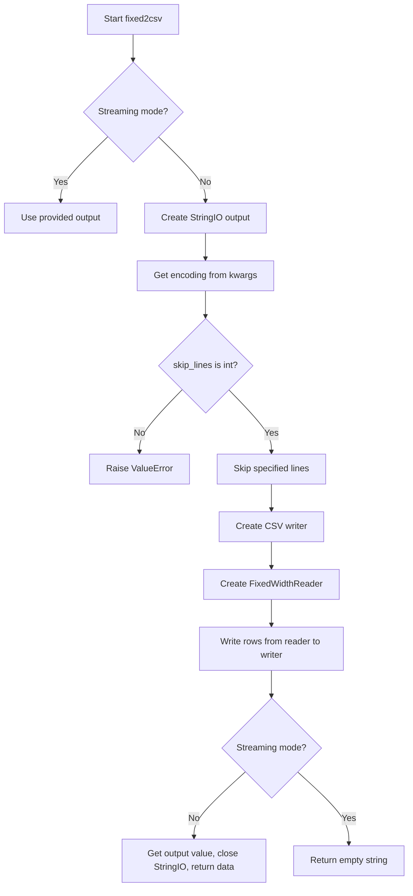
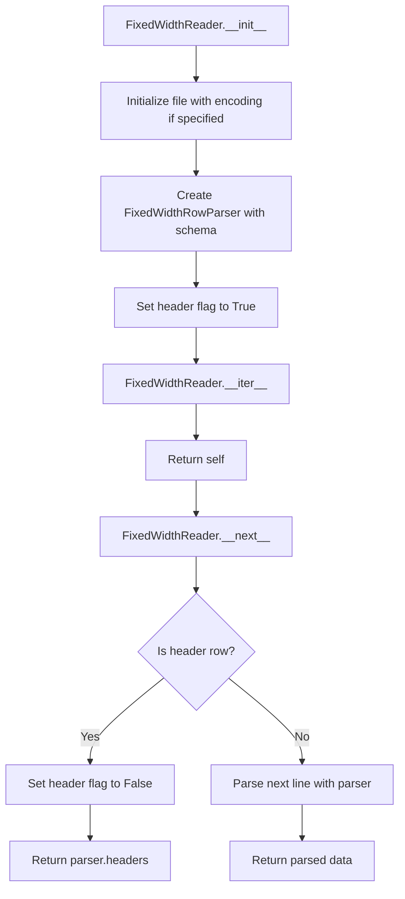
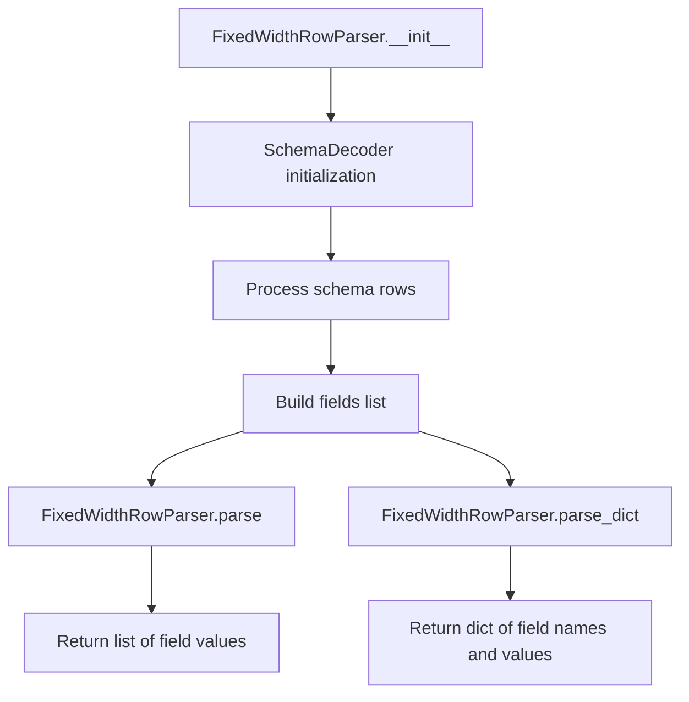
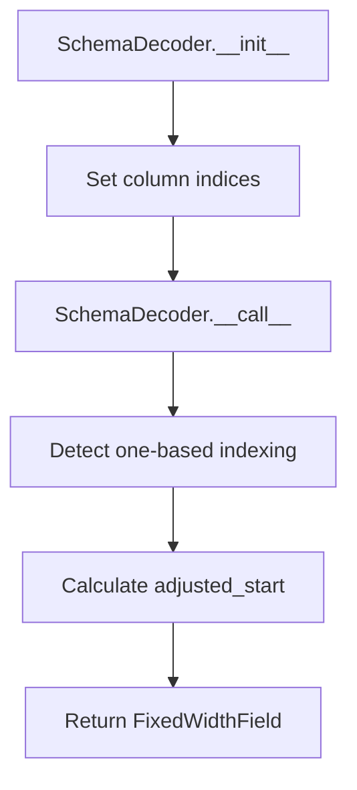

# `fixed.py`

## `csvkit.convert.fixed.fixed2csv` · *function*

## Summary:
Converts fixed-width formatted text data into CSV format, optionally skipping header lines.

## Description:
The fixed2csv function transforms fixed-width formatted text files into standard CSV format. It reads from a file-like object using a provided schema to determine field positions and lengths, then outputs the structured data as CSV. This function is commonly used in data processing pipelines to convert legacy fixed-width formatted data into more accessible CSV format.

The function supports both streaming and buffered output modes. In streaming mode (when an output file-like object is provided), it writes directly to that output. In buffered mode (default), it collects the CSV output in memory and returns it as a string.

## Args:
- f (file-like object): Input file-like object containing fixed-width formatted data
- schema (file-like object or iterable): Schema defining field names, start positions, and lengths for fixed-width parsing
- output (file-like object, optional): Output file-like object for streaming mode. If None, function returns CSV as string
- skip_lines (int, default=0): Number of lines to skip from the beginning of input file before processing
- **kwargs: Additional keyword arguments, primarily for encoding specification

## Returns:
- str: When output parameter is None, returns the complete CSV data as a string
- str: When output parameter is provided, returns empty string (indicating successful streaming)

## Raises:
- ValueError: When skip_lines argument is not an integer
- ValueError: When schema is malformed or invalid (raised by FixedWidthRowParser)

## Constraints:
- Preconditions:
  - Input file-like object `f` must be readable
  - Schema must define valid field positions and lengths
  - skip_lines must be a non-negative integer
- Postconditions:
  - If output is None, the returned string contains properly formatted CSV data
  - If output is provided, the output file-like object is written to successfully

## Side Effects:
- Reads from the input file-like object `f`
- Writes to the output file-like object `output` when streaming mode is used
- May read from stdin or other file-like objects depending on how `f` is constructed
- May write to stdout or other file-like objects depending on how `output` is constructed

## Control Flow:


## Examples:
```python
# Basic usage with buffered output
from io import StringIO
from csvkit.convert.fixed import fixed2csv

# Sample fixed-width data
fixed_data = StringIO("John Doe    25New York City     \nJane Smith  30Los Angeles       ")

# Sample schema
schema_data = StringIO("column,start,length\nname,0,10\nage,10,3\ncity,13,20")

# Convert to CSV
csv_output = fixed2csv(fixed_data, schema_data)
print(csv_output)
# Output: "name,age,city\nJohn Doe,25,New York City\nJane Smith,30,Los Angeles"

# Streaming usage
from io import StringIO
output_file = StringIO()
fixed2csv(fixed_data, schema_data, output=output_file)
print(output_file.getvalue())
# Output: "name,age,city\nJohn Doe,25,New York City\nJane Smith,30,Los Angeles"
```

## `csvkit.convert.fixed.FixedWidthReader` · *class*

## Summary:
A reader class that processes fixed-width formatted text files into structured data rows.

## Description:
The FixedWidthReader class is designed to iterate over fixed-width formatted text data, converting each line into structured data based on a provided schema. It serves as an iterator that yields either header row or parsed data rows from a file-like object. This class is particularly useful for processing legacy data formats or fixed-width formatted files that need to be converted into more manageable data structures.

The reader works in conjunction with FixedWidthRowParser to handle the actual parsing logic, while managing the iteration and header handling. It's commonly used in data processing pipelines where fixed-width formatted input needs to be transformed into row-based data structures.

## State:
- file: file-like object - The input stream containing fixed-width formatted data
- parser: FixedWidthRowParser - An instance responsible for parsing individual lines according to the schema
- header: bool - Flag indicating whether the header row should be returned on next iteration (initially True)

## Lifecycle:
- Creation: Instantiate with a file-like object, schema, and optional encoding parameter
- Usage: Iterate over the reader object using standard Python iteration protocols (__iter__ and __next__)
- Destruction: No explicit cleanup required; standard Python garbage collection handles resource management

## Method Map:


## Raises:
- ValueError: May be raised by FixedWidthRowParser during initialization if the schema is malformed or invalid

## Example:
```python
from csvkit.convert.fixed import FixedWidthReader
from io import StringIO

# Sample fixed-width data
data = '''John Doe    25New York City     
Jane Smith  30Los Angeles       
Bob Johnson 35Chicago           '''

# Sample schema
schema = '''column,start,length
name,0,10
age,10,3
city,13,20'''

# Create reader
reader = FixedWidthReader(StringIO(data), StringIO(schema), encoding='utf-8')

# Iterate through data
for row in reader:
    print(row)
# Output:
# ['name', 'age', 'city']  # Header row
# ['John Doe', '25', 'New York City']
# ['Jane Smith', '30', 'Los Angeles']
# ['Bob Johnson', '35', 'Chicago']
```

### `csvkit.convert.fixed.FixedWidthReader.__init__` · *method*

## Summary:
Initializes a FixedWidthReader instance to process fixed-width formatted text data according to a provided schema.

## Description:
Configures the reader with input file handle, schema-based parser, and header tracking state. This method prepares the reader for sequential iteration over fixed-width formatted data by setting up the underlying parsing infrastructure and initial state management.

## Args:
    f (file-like object): Input file handle containing fixed-width formatted text data
    schema (schema definition): Schema specification defining field names, positions, and lengths for parsing
    encoding (str, optional): Character encoding of the input file. If provided, the file will be decoded using this encoding

## Returns:
    None: This method initializes instance attributes and does not return a value

## Raises:
    None: This method does not explicitly raise exceptions, though instantiation of the underlying FixedWidthRowParser may raise exceptions if the schema is invalid

## State Changes:
    Attributes READ: None
    Attributes WRITTEN: 
    - self.file: Set to the input file handle (potentially wrapped with iterdecode if encoding is specified)
    - self.parser: Set to a new FixedWidthRowParser instance initialized with the provided schema
    - self.header: Set to True to indicate that the header row has not yet been processed

## Constraints:
    Preconditions:
    - The schema parameter must be compatible with FixedWidthRowParser constructor requirements
    - The file handle `f` must be readable and support iteration over lines
    - If encoding is specified, it must be a valid character encoding recognized by Python's codecs module
    
    Postconditions:
    - self.file contains a valid file handle for reading fixed-width data
    - self.parser is properly initialized with the provided schema
    - self.header is initialized to True, indicating the first row should be treated as headers

## Side Effects:
    I/O: Opens and maintains a file handle for reading fixed-width formatted data
    Resource allocation: Creates a FixedWidthRowParser instance which may involve parsing schema data

### `csvkit.convert.fixed.FixedWidthReader.__iter__` · *method*

## Summary:
Returns the iterator object itself, making the FixedWidthReader class iterable.

## Description:
This method implements Python's iterator protocol by returning the instance itself (`self`). When called, it enables the FixedWidthReader to be used in for-loops and other iteration contexts. The actual row-by-row processing is handled by the accompanying `__next__` method, which parses fixed-width formatted lines from the input file according to the defined schema.

This method is part of the standard Python iterator protocol implementation, allowing instances of FixedWidthReader to be consumed in iterative contexts such as for-loops, list comprehensions, or functions that expect iterable objects.

## Args:
    None

## Returns:
    FixedWidthReader: The instance itself, enabling iteration over fixed-width formatted data.

## Raises:
    None

## State Changes:
    Attributes READ: None
    Attributes WRITTEN: None

## Constraints:
    Preconditions: The FixedWidthReader instance must be properly initialized with a file handle and schema.
    Postconditions: The instance remains unchanged and ready to be iterated over.

## Side Effects:
    None

### `csvkit.convert.fixed.FixedWidthReader.__next__` · *method*

## Summary:
Returns the next row from a fixed-width formatted file, handling the header row specially.

## Description:
Implements the iterator protocol's `__next__` method for `FixedWidthReader`. This method manages the distinction between the header row and data rows, returning the parsed headers exactly once before beginning to parse subsequent data rows from the input file.

This logic is separated into its own method to properly implement the iterator protocol while maintaining the special handling required for fixed-width files that often contain header information in the first row.

## Args:
    None

## Returns:
    list: When called the first time, returns the parsed header row as a list of field names. On subsequent calls, returns a parsed data row as a list of field values.

## Raises:
    StopIteration: Raised when the underlying file iterator is exhausted, signaling the end of iteration.

## State Changes:
    Attributes READ: self.header, self.parser, self.file
    Attributes WRITTEN: self.header (set to False after first call)

## Constraints:
    Preconditions: 
    - The reader must be initialized with a valid file iterator and schema
    - The file iterator must support the `next()` function
    - The parser must be properly configured with a valid schema
    
    Postconditions:
    - The header flag is set to False after the first call
    - The returned data is properly parsed according to the schema

## Side Effects:
    I/O: Reads from the underlying file iterator, which may involve disk or network I/O operations
    Mutation: Modifies the internal header flag state

## `csvkit.convert.fixed.FixedWidthRowParser` · *class*

## Summary:
A parser that converts fixed-width formatted text lines into structured data based on a schema definition.

## Description:
The FixedWidthRowParser class is responsible for parsing fixed-width formatted text data according to a predefined schema. It reads a schema that defines field names, starting positions, and lengths, then provides methods to convert raw text lines into structured data formats (lists or dictionaries). This class is commonly used in data processing workflows where fixed-width formatted files need to be converted to more usable formats.

The parser expects a schema file that defines field properties including column names, start positions, and field lengths. It handles both one-based and zero-based indexing conventions automatically through its dependency on SchemaDecoder.

## State:
- fields: list[FixedWidthField] - A list of field definitions containing name, start position, and length information for each field in the fixed-width format
- Each FixedWidthField object must have the following attributes:
  - name (str): The field name identifier
  - start (int): The zero-based starting position of the field in the line
  - length (int): The character length of the field

## Lifecycle:
- Creation: Instantiate with a schema parameter (typically a file-like object or iterable of schema rows)
- Usage: Call parse() or parse_dict() methods with individual text lines to convert them to structured data
- Destruction: No explicit cleanup required; standard Python garbage collection handles resource management

## Method Map:


## Raises:
- ValueError: Raised when there's an error reading the schema at any line, typically due to malformed schema rows or missing required columns

## Example:
```python
# Create parser with schema
schema_content = '''column,start,length
name,0,10
age,10,3
city,13,20'''

parser = FixedWidthRowParser(StringIO(schema_content))

# Parse a fixed-width line
line = "John Doe    25New York City     "
data_list = parser.parse(line)  # ['John Doe', '25', 'New York City']

data_dict = parser.parse_dict(line)  # {'name': 'John Doe', 'age': '25', 'city': 'New York City'}
```

### `csvkit.convert.fixed.FixedWidthRowParser.__init__` · *method*

## Summary:
Initializes a FixedWidthRowParser with a schema definition that specifies field names, start positions, and lengths for fixed-width data parsing.

## Description:
The __init__ method sets up the parser by reading and processing a schema definition that describes how fixed-width formatted text should be parsed. It consumes a schema file or iterable that defines field properties including column names, starting positions, and field lengths. The method validates the schema structure and builds an internal list of field definitions that will be used by subsequent parsing operations.

This logic is encapsulated in its own method because it performs complex schema validation and transformation that could make the constructor overly complex if inlined. Separating this logic allows for cleaner instantiation and makes error handling more specific to schema issues.

## Args:
    schema (file-like object or iterable): A schema definition containing field specifications in CSV format. The first row should contain column headers ('column', 'start', 'length'), followed by data rows defining each field with its name, start position, and length.

## Returns:
    None: This method initializes the object's state and does not return a value.

## Raises:
    ValueError: Raised when there's an error reading the schema at any line, typically due to malformed schema rows, missing required columns, or invalid field definitions.

## State Changes:
    Attributes READ: None
    Attributes WRITTEN: self.fields (populated with FixedWidthField objects)

## Constraints:
    Preconditions: The schema parameter must be iterable and contain valid schema rows with required columns ('column', 'start', 'length')
    Postconditions: The self.fields attribute will contain a list of FixedWidthField objects representing the parsed schema

## Side Effects:
    None: This method performs no I/O operations or external service calls beyond reading from the schema parameter.

### `csvkit.convert.fixed.FixedWidthRowParser.parse` · *method*

## Summary:
Parses a fixed-width formatted line into a list of field values based on predefined field specifications.

## Description:
Extracts field values from a fixed-width formatted input line by slicing the line according to start positions and lengths defined in the parser's field configuration. This method is part of the fixed-width file parsing pipeline and is typically called during CSV conversion processes when processing raw input lines.

## Args:
    line (str): A single line from a fixed-width formatted file containing all fields concatenated together

## Returns:
    list[str]: A list of field values extracted from the input line, with leading/trailing whitespace removed from each field

## Raises:
    IndexError: If the input line is shorter than the maximum field boundary defined in self.fields

## State Changes:
    Attributes READ: self.fields
    Attributes WRITTEN: None

## Constraints:
    Preconditions: 
    - self.fields must be populated with valid field definitions containing start and length attributes
    - line must be a string long enough to accommodate all field boundaries
    Postconditions:
    - Returns a list of field values with whitespace stripped from each value
    - Order of returned values matches the order of fields in self.fields

## Side Effects:
    None

### `csvkit.convert.fixed.FixedWidthRowParser.parse_dict` · *method*

## Summary:
Converts a fixed-width line into a dictionary mapping column headers to their extracted values.

## Description:
This method transforms a single line of fixed-width formatted data into a dictionary structure, where keys are column headers and values are the corresponding field values extracted from the line. It serves as a convenient interface for accessing parsed data in a key-value format rather than as a list of values.

## Args:
    line (str): A single line of fixed-width formatted data to be parsed.

## Returns:
    dict[str, str]: A dictionary mapping column headers (from self.headers) to their corresponding values extracted from the line. Returns an empty dictionary if line is empty or if no fields are defined.

## Raises:
    None explicitly raised, but may propagate exceptions from self.parse() if line format is invalid.

## State Changes:
    Attributes READ: self.headers, self.parse
    Attributes WRITTEN: None

## Constraints:
    Preconditions: 
    - self.headers must be populated with column names
    - self.parse() method must be callable and return a list of values
    - line must be a string that can be processed by the parser configuration
    
    Postconditions:
    - The returned dictionary will have exactly as many key-value pairs as there are fields in the schema
    - Keys will match the column names from self.headers in order
    - Values will be stripped whitespace strings from the corresponding field positions

## Side Effects:
    None

### `csvkit.convert.fixed.FixedWidthRowParser.headers` · *method*

## Summary:
Returns a list of field names from the fixed-width schema fields.

## Description:
Provides access to the field names defined in the fixed-width file schema. This method extracts the `name` attribute from each field in `self.fields` and returns them as a list. It is primarily used internally by the `parse_dict` method to create dictionaries mapping field names to parsed values.

## Args:
    None

## Returns:
    list[str]: A list of field names as strings, one for each field defined in the schema.

## Raises:
    None

## State Changes:
    Attributes READ: self.fields
    Attributes WRITTEN: None

## Constraints:
    Preconditions: 
    - `self.fields` must be initialized and contain FixedWidthField objects
    - Each field in `self.fields` must have a `name` attribute
    
    Postconditions:
    - Returns a list of strings representing field names
    - Order of names matches the order of fields in `self.fields`

## Side Effects:
    None

## `csvkit.convert.fixed.SchemaDecoder` · *class*

## Summary:
A callable class that decodes schema rows into FixedWidthField objects for fixed-width file processing.

## Description:
The SchemaDecoder class is responsible for converting rows from a schema file into FixedWidthField objects. It parses the schema header to determine column positions and then processes each row to create field definitions with column names, start positions, and lengths. This class handles both one-based and zero-based indexing conventions automatically.

## State:
- start: int - Index position of the 'start' column in the schema header
- length: int - Index position of the 'length' column in the schema header  
- column: int - Index position of the 'column' column in the schema header
- one_based: bool or None - Flag indicating if the schema uses one-based indexing (determined automatically from first row)

## Lifecycle:
- Creation: Instantiate with a header row (list or iterable of column names)
- Usage: Call the instance with individual data rows to decode them into FixedWidthField objects
- Destruction: No explicit cleanup required

## Method Map:


## Raises:
- ValueError: Raised when a required column ('column', 'start', or 'length') is not found in the schema header

## Example:
```python
# Create decoder with schema header
header = ['column', 'start', 'length']
decoder = SchemaDecoder(header)

# Process a data row
row = ['name', '1', '10']  # column name, start position, length
field = decoder(row)  # Returns FixedWidthField object
```

### `csvkit.convert.fixed.SchemaDecoder.__init__` · *method*

## Summary:
Initializes the SchemaDecoder by mapping required column names to their positions in the header and setting up index attributes for field processing.

## Description:
This method processes the schema header to identify the positions of required columns ('column', 'start', and 'length') and stores these positions as instance attributes. It automatically validates that all required columns exist in the header and raises a ValueError if any are missing. The method supports type conversion for column positions - when a type constructor is provided for a column, it converts the column index to that type; otherwise, it stores the raw index position.

This logic is separated into its own method rather than being inlined because it performs critical setup operations that need to happen before the decoder can process data rows, and it provides centralized validation of the schema header structure.

## Args:
    header (list or iterable): A sequence of column names from the schema file header

## Returns:
    None: This method modifies instance attributes in-place and does not return a value

## Raises:
    ValueError: Raised when any required column ('column', 'start', or 'length') is not found in the header

## State Changes:
    Attributes READ: self.REQUIRED_COLUMNS
    Attributes WRITTEN: self.column, self.start, self.length (and potentially self.one_based if defined)

## Constraints:
    Preconditions:
    - The header parameter must be iterable and contain at least the required column names
    - All required columns must be present in the header for successful initialization
    
    Postconditions:
    - Instance attributes for column positions are set appropriately
    - Required columns are validated to exist in the header
    - Column positions are converted to appropriate types if type constructors are specified

## Side Effects:
    None

### `csvkit.convert.fixed.SchemaDecoder.__call__` · *method*

## Summary:
Processes a schema row to create a FixedWidthField object with adjusted start position based on indexing convention.

## Description:
This method serves as the core processing function for converting schema rows into FixedWidthField objects. It determines whether the schema uses 1-based or 0-based indexing from the first row of data and adjusts the field start position accordingly. This method is typically called during schema parsing when processing each row of a fixed-width schema file.

The logic is separated into its own method because it encapsulates the complex indexing conversion logic that could otherwise be duplicated throughout the schema processing pipeline, making it easier to test and maintain.

## Args:
    row (list or dict-like): A row of data from a schema file containing column definitions with required columns: 'column', 'start', and 'length'

## Returns:
    FixedWidthField: An object representing a fixed-width field with column name, start position, and length

## Raises:
    ValueError: If the schema row doesn't contain required columns or if conversion fails

## State Changes:
    Attributes READ: self.start, self.column, self.length, self.one_based
    Attributes WRITTEN: self.one_based (only set when initially None)

## Constraints:
    Preconditions: 
    - The row must contain values at indices specified by self.start, self.column, and self.length
    - self.start, self.column, and self.length must be valid indices or column names
    - The schema row must contain the required columns defined in REQUIRED_COLUMNS
    
    Postconditions:
    - If self.one_based was None, it gets set to either True or False based on the first row's data
    - The returned FixedWidthField has properly adjusted start position accounting for indexing convention

## Side Effects:
    None

