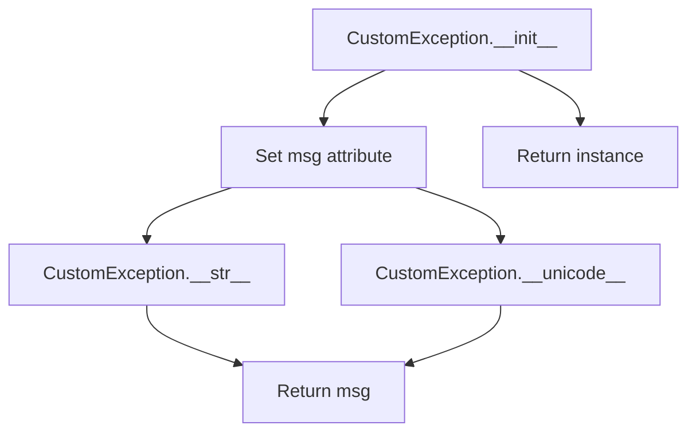
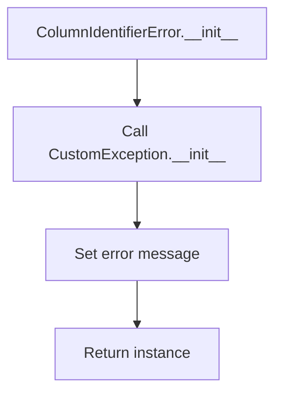
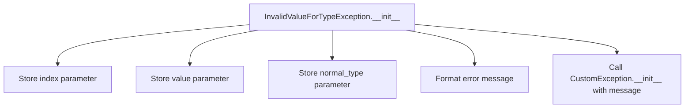
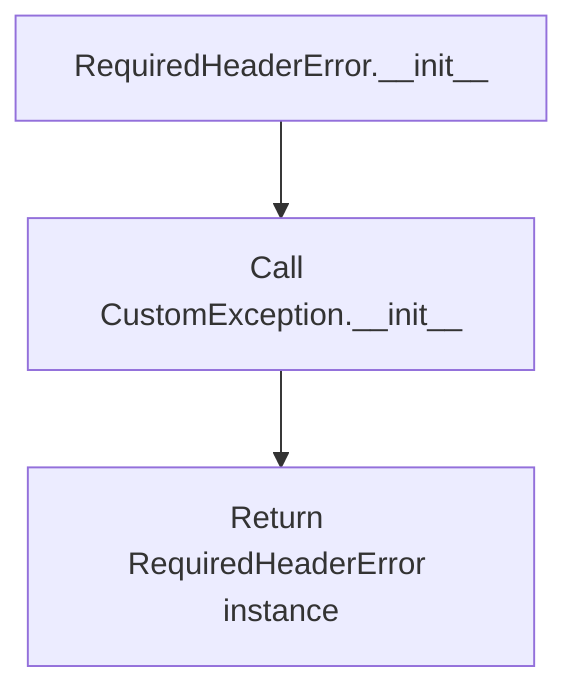

# `exceptions.py`

## `csvkit.exceptions.CustomException` · *class*

## Summary:
A custom exception class that extends Python's built-in Exception class for standardized error handling.

## Description:
This class serves as a base custom exception for the csvkit library, providing a consistent way to raise and handle errors throughout the application. It is designed to be instantiated with a descriptive error message and provides standard string representation methods for debugging and logging purposes.

## State:
- msg (str): The error message associated with this exception instance. Must be a string value that describes the error condition.
- The class maintains no other state beyond the error message provided during initialization.

## Lifecycle:
- Creation: Instantiate with a string message using `CustomException("error message")`
- Usage: Raise the exception using `raise CustomException("message")` or handle it in except blocks
- Destruction: Automatic cleanup when the exception propagates out of scope

## Method Map:


## Raises:
- None explicitly raised by __init__
- Inherits standard Exception behavior for instantiation

## Example:
```python
# Creating and raising the exception
try:
    raise CustomException("Invalid CSV format detected")
except CustomException as e:
    print(f"Caught exception: {e}")
    # Output: Caught exception: Invalid CSV format detected
```

### `csvkit.exceptions.CustomException.__init__` · *method*

## Summary:
Initializes a CustomException instance with a descriptive error message.

## Description:
Sets up a custom exception with the provided error message. This constructor is part of a minimal custom exception class that extends Python's built-in Exception class, providing a simple way to create exceptions with custom messages that can be converted to string representations.

## Args:
    msg (str): The error message to associate with this exception instance.

## Returns:
    None: This method does not return a value.

## Raises:
    None: This method does not raise any exceptions.

## State Changes:
    Attributes READ: None
    Attributes WRITTEN: self.msg

## Constraints:
    Preconditions: The msg parameter should be a string or an object that can be converted to a string.
    Postconditions: After execution, the exception instance will have its msg attribute set to the provided message.

## Side Effects:
    None: This method performs no I/O operations or external service calls. It only modifies the object's internal state.

### `csvkit.exceptions.CustomException.__unicode__` · *method*

## Summary:
Returns the Unicode string representation of the custom exception by returning its stored message.

## Description:
This method provides the Unicode string representation of the CustomException instance. It is called when the exception is converted to a Unicode string, such as when printing the exception or using it in Unicode string formatting operations. The method simply returns the message that was provided during exception initialization. This method is primarily intended for Python 2 compatibility, where separate `__unicode__` and `__str__` methods handle Unicode vs byte string representations.

## Args:
    None

## Returns:
    str: The message string that was set during object initialization.

## Raises:
    None

## State Changes:
    Attributes READ: self.msg
    Attributes WRITTEN: None

## Constraints:
    Preconditions: The object must have been initialized with a msg parameter, and self.msg must be a string.
    Postconditions: The returned value is identical to the message originally provided during initialization.

## Side Effects:
    None

### `csvkit.exceptions.CustomException.__str__` · *method*

## Summary:
Returns the string representation of the custom exception by returning its stored message.

## Description:
This method provides the string representation of the CustomException instance. It is called when the exception is converted to a string, such as when printing the exception or using it in string formatting operations. The method simply returns the message that was provided during exception initialization.

## Args:
    None

## Returns:
    str: The message string that was set during object initialization.

## Raises:
    None

## State Changes:
    Attributes READ: self.msg
    Attributes WRITTEN: None

## Constraints:
    Preconditions: The object must have been initialized with a msg parameter, and self.msg must be a string.
    Postconditions: The returned value is identical to the message originally provided during initialization.

## Side Effects:
    None

## `csvkit.exceptions.ColumnIdentifierError` · *class*

## Summary:
A custom exception class for column identifier-related errors in csvkit.

## Description:
The ColumnIdentifierError exception is raised when there are issues with column identification in CSV processing operations. This specialized exception inherits from CustomException and serves as a semantic marker to distinguish column identifier errors from other types of exceptions in the csvkit library. It is used internally by csvkit components when column names or indices cannot be properly resolved or validated.

## State:
- Inherits all state from CustomException parent class
- Maintains the standard error message handling through the msg attribute
- No additional attributes beyond those inherited from CustomException

## Lifecycle:
- Creation: Instantiate with a descriptive error message using `ColumnIdentifierError("message")`
- Usage: Raise the exception using `raise ColumnIdentifierError("message")` or handle it in except blocks
- Destruction: Automatic cleanup when the exception propagates out of scope

## Method Map:


## Raises:
- None explicitly raised by __init__ (inherits standard Exception behavior)
- Raised when column identifier validation fails during CSV processing operations

## Example:
```python
# Raising the exception
try:
    raise ColumnIdentifierError("Column 'name' not found in CSV header")
except ColumnIdentifierError as e:
    print(f"Column identifier error: {e}")
    # Output: Column identifier error: Column 'name' not found in CSV header

# Typical usage in csvkit context
# This would occur when trying to access a non-existent column
# by name or index in CSV processing functions
```

## `csvkit.exceptions.CSVTestException` · *class*

## Summary:
A custom exception class for CSV validation errors that provides contextual information about the specific line and row where the issue occurred.

## Description:
CSVTestException is raised during CSV file validation or testing processes to indicate that a problem was found in a specific line and row of the CSV data. This exception extends CustomException and adds contextual metadata (line number and row data) to help pinpoint the exact location of validation failures.

The exception is typically used in CSV processing pipelines where detailed error reporting is needed to help users identify and fix issues in their data files.

## State:
- line_number (int): The line number in the CSV file where the validation error occurred. Must be a positive integer representing the line position.
- row (list or dict): The actual row data from the CSV file at the point of failure. Can be either a list of values or dictionary mapping column names to values, depending on how the CSV was parsed.
- msg (str): The error message describing the specific validation failure that occurred.

## Lifecycle:
- Creation: Instantiate with line_number, row, and msg parameters using `CSVTestException(line_number, row, "error message")`
- Usage: Raise the exception when CSV validation fails using `raise CSVTestException(...)`
- Destruction: Automatic cleanup when the exception propagates out of scope

## Method Map:
```mermaid
graph TD
    A[CSVTestException.__init__] --> B[Call super().__init__(msg)]
    A --> C[Set line_number attribute]
    A --> D[Set row attribute]
    B --> E[CustomException.__init__]
    E --> F[Initialize base Exception with msg]
```

## Raises:
- None explicitly raised by __init__
- Inherits standard Exception behavior for instantiation

## Example:
```python
# Example usage in CSV validation
try:
    # Some CSV validation logic
    if invalid_value_found:
        raise CSVTestException(
            line_number=42,
            row=['value1', 'value2', 'invalid_value'],
            msg="Column 3 contains invalid data"
        )
except CSVTestException as e:
    print(f"Validation failed at line {e.line_number}: {e.msg}")
    # Output: Validation failed at line 42: Column 3 contains invalid data
```

### `csvkit.exceptions.CSVTestException.__init__` · *method*

## Summary:
Initializes a CSV test exception with line number, row data, and error message.

## Description:
Constructs a CSVTestException instance that captures detailed information about CSV parsing errors, including the specific line number where the error occurred, the row data that caused the issue, and a descriptive error message. This allows for more informative error reporting during CSV validation and processing operations.

## Args:
    line_number (int): The line number in the CSV file where the error occurred.
    row (list): The row data that caused the CSV parsing error.
    msg (str): A descriptive error message explaining the nature of the validation failure.

## Returns:
    None: This method initializes the exception object and does not return a value.

## Raises:
    None: This method does not raise any exceptions itself.

## State Changes:
    Attributes READ: None
    Attributes WRITTEN: 
    - self.line_number: Stores the line number where the CSV error occurred
    - self.row: Stores the problematic row data that caused the error

## Constraints:
    Preconditions:
    - line_number should be a positive integer representing a valid line in the CSV file
    - row should be a list or iterable containing the CSV row data
    - msg should be a string describing the validation error

    Postconditions:
    - The exception object will have self.line_number set to the provided line_number
    - The exception object will have self.row set to the provided row data
    - The exception object will inherit the message functionality from its parent CustomException class

## Side Effects:
    None: This method performs no I/O operations or external service calls. It only initializes object attributes.

## `csvkit.exceptions.LengthMismatchError` · *class*

## Summary:
A custom exception raised when a CSV row contains a different number of columns than expected during validation.

## Description:
LengthMismatchError is specifically designed to handle CSV validation scenarios where a row's column count doesn't match the expected column count. This exception extends CSVTestException to provide contextual information about the validation failure, including the line number, the problematic row data, and a descriptive error message.

This exception is typically raised during CSV parsing or validation operations when strict column count checking is enabled, helping developers quickly identify malformed rows in their data files.

## State:
- line_number (int): The line number in the CSV file where the column count mismatch occurred. Must be a positive integer representing the line position.
- row (list or dict): The actual row data from the CSV file at the point of failure. Can be either a list of values or dictionary mapping column names to values.
- expected_length (int): The number of columns that were expected in the row. Must be a positive integer.
- msg (str): The error message describing the specific validation failure that occurred, formatted as "Expected X columns, found Y columns".

## Lifecycle:
- Creation: Instantiate with line_number, row, and expected_length parameters using `LengthMismatchError(line_number, row, expected_length)`
- Usage: Raise the exception when CSV validation detects a column count mismatch using `raise LengthMismatchError(...)`
- Destruction: Automatic cleanup when the exception propagates out of scope

## Method Map:
```mermaid
graph TD
    A[LengthMismatchError.__init__] --> B[Create error message]
    A --> C[Call super().__init__(line_number, row, msg)]
    C --> D[CSVTestException.__init__]
    D --> E[CustomException.__init__]
    F[LengthMismatchError.length] --> G[Return len(self.row)]
```

## Raises:
- None explicitly raised by __init__
- Inherits standard Exception behavior for instantiation

## Example:
```python
# Example usage in CSV validation
try:
    # Simulate CSV validation where row has 3 columns but 4 expected
    expected_columns = 4
    actual_row = ['col1', 'col2', 'col3']  # Only 3 columns
    raise LengthMismatchError(
        line_number=15,
        row=actual_row,
        expected_length=expected_columns
    )
except LengthMismatchError as e:
    print(f"Validation failed at line {e.line_number}: {e.args[-1]}")
    # Output: Validation failed at line 15: Expected 4 columns, found 3 columns
    print(f"Actual column count: {e.length}")
    # Output: Actual column count: 3
```

### `csvkit.exceptions.LengthMismatchError.__init__` · *method*

## Summary:
Initializes a LengthMismatchError exception with line number, row data, and expected column count.

## Description:
Constructs a LengthMismatchError exception that occurs when a CSV row contains a different number of columns than expected during validation. This method formats an appropriate error message and initializes the exception with the provided parameters.

## Args:
    line_number (int): The line number in the CSV file where the mismatch occurred.
    row (list): The actual row data that caused the mismatch.
    expected_length (int): The expected number of columns for the row.

## Returns:
    None: This method initializes the exception object and does not return a value.

## Raises:
    None: This method does not raise any exceptions itself.

## State Changes:
    Attributes READ: None
    Attributes WRITTEN: 
    - self.line_number: Set to the provided line_number parameter
    - self.row: Set to the provided row parameter

## Constraints:
    Preconditions:
    - line_number must be a positive integer representing a valid line in the CSV file
    - row must be an iterable (like list or tuple) containing column data
    - expected_length must be a non-negative integer specifying expected column count
    
    Postconditions:
    - The exception instance will have self.line_number set to the provided value
    - The exception instance will have self.row set to the provided value
    - The exception instance will have an appropriate error message for display

## Side Effects:
    None: This method performs no I/O operations or external service calls. It only initializes object attributes.

### `csvkit.exceptions.LengthMismatchError.length` · *method*

## Summary:
Returns the number of columns in the CSV row that caused a length mismatch error.

## Description:
Provides access to the actual column count of the row that failed validation. This property is used to retrieve the length of the problematic row for error reporting and debugging purposes. The method is part of the LengthMismatchError exception class which is raised when a CSV row contains a different number of columns than expected during validation.

## Args:
    None

## Returns:
    int: The number of elements in the row data, representing the actual column count found in the CSV row.

## Raises:
    None

## State Changes:
    Attributes READ: self.row
    Attributes WRITTEN: None

## Constraints:
    Preconditions: The instance must have been properly initialized with a row parameter that supports the len() function
    Postconditions: The returned value is always a non-negative integer representing the row's length

## Side Effects:
    None

## `csvkit.exceptions.InvalidValueForTypeException` · *class*

## Summary:
Represents an error that occurs when a value cannot be converted to a specified data type at a given index position during CSV processing.

## Description:
This exception is raised when csvkit encounters a value that cannot be properly converted to the expected data type at a specific column index. It is commonly used during CSV data parsing and type conversion operations to signal data type mismatches. The exception provides detailed information about the problematic value, the expected type, and its position in the data structure.

## State:
- index (int): The zero-based index position where the conversion failed
- value (str): The string value that could not be converted to the expected type
- normal_type (str): The target data type that the value was expected to convert to

## Lifecycle:
- Creation: Instantiate with three arguments: `index` (int), `value` (str), and `normal_type` (str)
- Usage: Raise the exception when type conversion fails during CSV processing operations
- Destruction: Automatic cleanup when the exception propagates out of scope

## Method Map:


## Raises:
- None explicitly raised by __init__
- Inherits standard Exception behavior for instantiation

## Example:
```python
# Example usage in CSV processing context
try:
    # Attempt to convert a non-numeric value to integer at index 2
    raise InvalidValueForTypeException(2, "not_a_number", "int")
except InvalidValueForTypeException as e:
    print(f"Error at index {e.index}: {e.value} cannot be converted to {e.normal_type}")
    # Output: Error at index 2: not_a_number cannot be converted to int
```

### `csvkit.exceptions.InvalidValueForTypeException.__init__` · *method*

## Summary:
Initializes an InvalidValueForTypeException with conversion failure details including the index, value, and expected type.

## Description:
This constructor creates an exception instance that represents a type conversion failure when processing CSV data. It stores the problematic index, value, and expected type, then formats a descriptive error message for the parent Exception class.

## Args:
    index (int): The zero-based index position where the conversion failed
    value (str): The string value that could not be converted to the expected type
    normal_type (str): The target data type that the value was expected to convert to

## Returns:
    None: This method initializes instance attributes and does not return a value

## Raises:
    None: This method does not raise any exceptions itself

## State Changes:
    Attributes READ: None
    Attributes WRITTEN: self.index, self.value, self.normal_type

## Constraints:
    Preconditions: All arguments must be provided and non-None
    Postconditions: The exception instance will have self.index, self.value, and self.normal_type set to the provided values

## Side Effects:
    None: This method performs no I/O operations or external service calls

## `csvkit.exceptions.RequiredHeaderError` · *class*

## Summary:
Represents an exception that occurs when a required header field is missing from a CSV file during processing.

## Description:
The RequiredHeaderError exception is raised when a CSV processing operation encounters a situation where a required header field is absent from the input data. This typically happens when working with CSV files that must contain specific column names for proper parsing and data extraction. The exception inherits from CustomException, ensuring consistent error handling throughout the csvkit library.

## State:
- Inherits the error message handling from CustomException parent class
- No additional attributes specific to RequiredHeaderError
- The underlying error message is stored in the msg attribute inherited from CustomException

## Lifecycle:
- Creation: Instantiated with an optional error message describing the missing header requirement
- Usage: Raised when header validation fails during CSV processing operations
- Destruction: Handled by standard exception mechanisms or propagated up the call stack

## Method Map:


## Raises:
- Inherits all exception behaviors from CustomException parent class
- No additional exceptions raised during initialization

## Example:
```python
# Example of raising RequiredHeaderError
try:
    # Simulate CSV processing where required header is missing
    if 'email' not in csv_headers:
        raise RequiredHeaderError("CSV file must contain 'email' header field")
except RequiredHeaderError as e:
    print(f"Header validation failed: {e}")
    # Output: Header validation failed: CSV file must contain 'email' header field
```

