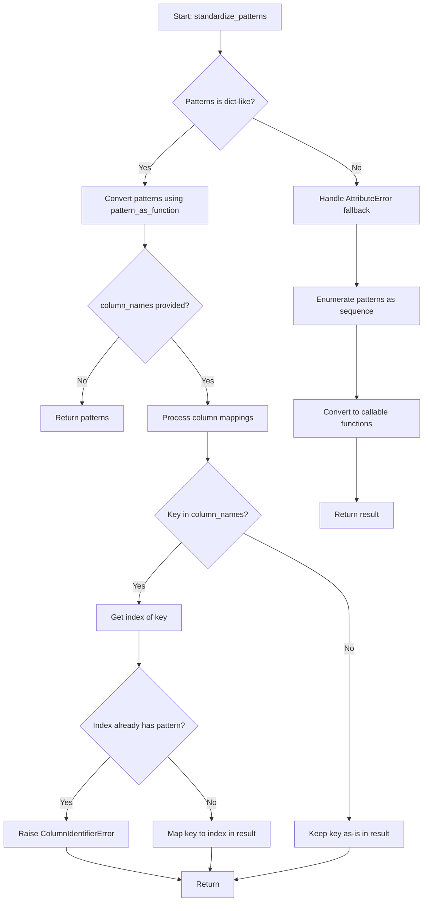

# `grep.py`

## `csvkit.grep.FilteringCSVReader` · *class*

*No documentation generated.*

### `csvkit.grep.FilteringCSVReader.__init__` · *method*

## Summary:
Initializes a FilteringCSVReader object that wraps a CSV reader and applies pattern-based filtering to rows.

## Description:
Configures a CSV reader wrapper that filters rows based on specified patterns. This method sets up the internal state for pattern matching and prepares the reader for iteration with filtered results. The initialization process handles header processing and pattern standardization, making the reader ready for row-by-row filtering operations.

## Args:
    reader: A CSV reader object that provides sequential access to CSV data rows
    patterns: Pattern specifications for filtering, either as a dictionary mapping column identifiers to patterns or as a sequence
    header (bool, optional): Whether the CSV has a header row. Defaults to True
    any_match (bool, optional): If True, a row matches if any pattern matches; if False, all patterns must match. Defaults to False
    inverse (bool, optional): If True, inverts the matching logic (rows that don't match are returned). Defaults to False

## Returns:
    None: This method initializes the object's state and returns nothing

## Raises:
    ColumnIdentifierError: When column name conflicts occur during pattern standardization
    AttributeError: When patterns cannot be processed as a dictionary-like object

## State Changes:
    Attributes READ: None
    Attributes WRITTEN: 
    - self.reader: Set to the provided reader object
    - self.header: Set to the provided header flag
    - self.column_names: Set to the header row if header=True, otherwise remains None
    - self.any_match: Set to the provided any_match flag
    - self.inverse: Set to the provided inverse flag
    - self.patterns: Set to the standardized patterns dictionary

## Constraints:
    Preconditions:
    - reader must be iterable and provide CSV rows
    - patterns must be either a dictionary-like object or sequence of patterns
    - If header=True, reader must provide a header row when next() is called
    - column_names (when available) must be a list of strings if provided

    Postconditions:
    - self.reader is assigned the provided reader object
    - self.header is assigned the provided header flag
    - self.column_names is set to the header row if header=True, otherwise None
    - self.any_match is assigned the provided any_match flag
    - self.inverse is assigned the provided inverse flag
    - self.patterns is assigned the result of standardize_patterns() function

## Side Effects:
    None: This method performs no I/O operations or external service calls. It only initializes internal state.

### `csvkit.grep.FilteringCSVReader.__iter__` · *method*

## Summary:
Makes the FilteringCSVReader instance iterable by returning itself as the iterator.

## Description:
Implements the iterator protocol for the FilteringCSVReader class. This method is called when the instance is used in a for-loop or other iteration context. It simply returns `self`, allowing the class to serve as its own iterator. The actual row filtering and iteration logic is implemented in the `__next__` method.

This method is essential for enabling the class to be used seamlessly in Python's iteration protocols, allowing users to iterate over filtered CSV rows without needing to manually call `next()` or manage the iteration state.

## Args:
    None

## Returns:
    FilteringCSVReader: Returns the instance itself, making it a proper iterator.

## Raises:
    None

## State Changes:
    Attributes READ: None
    Attributes WRITTEN: None

## Constraints:
    Preconditions:
    - The FilteringCSVReader instance must be properly initialized with a CSV reader and filtering patterns
    - The underlying CSV reader must be valid and accessible
    
    Postconditions:
    - The instance remains unchanged after calling __iter__
    - The instance is ready to be iterated over using the __next__ method

## Side Effects:
    None

### `csvkit.grep.FilteringCSVReader.__next__` · *method*

## Summary:
Returns the next filtered row from the CSV data, handling header row processing and applying filter conditions to rows.

## Description:
Implements the iterator protocol for the FilteringCSVReader class, providing access to CSV rows that match the configured filtering criteria. This method manages the special case of returning the header row first, then iterates through the remaining rows, applying the configured filter patterns to determine which rows to yield.

The method is designed as a separate component to encapsulate the iteration logic and filtering behavior, allowing the class to function as a proper iterator while maintaining clean separation between header handling and row filtering logic.

## Args:
    None

## Returns:
    list[str]: A row from the CSV data that matches the filter criteria, or the header row if it hasn't been returned yet.

## Raises:
    StopIteration: When there are no more rows to process in the underlying CSV reader.

## State Changes:
    Attributes READ: self.column_names, self.returned_header, self.reader, self.test_row
    Attributes WRITTEN: self.returned_header

## Constraints:
    Preconditions:
    - The underlying CSV reader must be initialized and iterable
    - Filter patterns must be properly configured via the constructor
    - The class must be initialized with appropriate header handling settings
    
    Postconditions:
    - If a header exists and hasn't been returned, it will be returned on the first call
    - Once a header is returned, subsequent calls will return filtered rows
    - The returned row will always match the configured filter criteria

## Side Effects:
    I/O: Reads from the underlying CSV reader, potentially causing file or stream I/O operations
    Mutation: Updates the internal `returned_header` flag to track iteration state

### `csvkit.grep.FilteringCSVReader.test_row` · *method*

## Summary:
Tests whether a CSV row matches the configured filtering patterns based on match criteria and inversion settings.

## Description:
Evaluates a CSV row against the predefined filtering patterns to determine if the row should be included in the filtered output. This method implements the core filtering logic that decides whether a row passes the configured criteria. It is called internally by the iterator protocol (`__next__`) to filter rows from the underlying CSV reader.

The method supports two matching modes controlled by the `any_match` flag:
- When `any_match=True`: Row passes if ANY pattern matches (OR logic)
- When `any_match=False`: Row passes if ALL patterns match (AND logic)

The `inverse` flag controls whether matching results are inverted:
- When `inverse=False`: Return True if patterns match
- When `inverse=True`: Return True if patterns DON'T match

## Args:
    row (list[str]): A list representing a CSV row, where each element corresponds to a cell value

## Returns:
    bool: True if the row matches the filtering criteria, False otherwise

## Raises:
    None explicitly raised, but may propagate exceptions from pattern functions

## State Changes:
    Attributes READ: self.patterns, self.any_match, self.inverse
    Attributes WRITTEN: None

## Constraints:
    Preconditions:
    - `self.patterns` must be properly initialized with callable pattern functions
    - `self.any_match` and `self.inverse` must be boolean values
    - Input `row` should be a list-like object with appropriate length for pattern indexing
    
    Postconditions:
    - Method returns a boolean value indicating row inclusion/exclusion
    - No modifications are made to the instance state

## Side Effects:
    None

## `csvkit.grep.standardize_patterns` · *function*

## Summary:
Normalizes pattern specifications into a consistent dictionary mapping column indices or names to callable pattern functions for CSV filtering operations.

## Description:
Processes input patterns and converts them into a standardized format where keys represent either column names or numeric indices, and values are callable functions that can test if a value matches the specified pattern. This function handles both named column patterns and indexed patterns, resolving column names to their numeric positions while maintaining consistency in the resulting pattern dictionary structure.

The logic is extracted into its own function to provide a clean abstraction layer for pattern normalization, separating the concerns of input validation and pattern conversion from the core filtering logic. This allows the CSV grep functionality to work with flexible pattern specifications while ensuring consistent internal representation.

## Args:
    column_names (list[str] or None): List of column names from CSV header, or None if not available
    patterns (dict or list/tuple): Pattern specifications where keys can be column names (str) or indices (int), and values are pattern definitions that will be converted to callable functions

## Returns:
    dict: Dictionary mapping column indices (int) or names (str) to callable pattern functions. When column_names is provided, column names in patterns are converted to their corresponding indices.

## Raises:
    ColumnIdentifierError: When a column name in patterns maps to an index that already has a pattern defined
    AttributeError: When patterns is not a dictionary-like object and needs to be treated as a sequence

## Constraints:
    Preconditions:
    - Patterns must be either a dictionary-like object or a sequence (list/tuple)
    - If column_names is provided, it must be a list of strings
    - All pattern values must be convertible by pattern_as_function
    
    Postconditions:
    - Returned dictionary contains only callable functions as values
    - Keys in returned dictionary are either integers (indices) or strings (names)
    - Column name conflicts with existing indices are detected and prevented

## Side Effects:
    None

## Control Flow:


## Examples:
```python
# Basic usage with column names
column_names = ['name', 'age', 'email']
patterns = {'name': 'John', 'age': r'\d+'}  # name pattern, age regex
result = standardize_patterns(column_names, patterns)
# Returns: {0: <callable for 'John'>, 1: <callable for r'\d+'>}

# Usage without column names
patterns = {'name': 'John', 'age': r'\d+'}
result = standardize_patterns(None, patterns)
# Returns: {'name': <callable for 'John'>, 'age': <callable for r'\d+'>}

# Error case - column name conflicts with index
column_names = ['name', 'age']
patterns = {'name': 'John', 0: r'\d+'}  # name maps to index 0
# Raises ColumnIdentifierError: "Column name has index 0 which already has a pattern."
```

## `csvkit.grep.pattern_as_function` · *function*

## Summary:
Converts various input types into callable functions for pattern matching in CSV data filtering operations.

## Description:
This function normalizes different pattern input types into a consistent callable interface suitable for CSV filtering operations. It handles three distinct input categories: already callable objects, regex pattern objects, and literal string patterns. The function is designed to be used in CSV grep operations where patterns need to be converted into filter functions that can be applied to column values.

The logic is extracted into its own function to provide a clean abstraction layer for pattern normalization, separating the concerns of input validation and pattern conversion from the core filtering logic.

## Args:
    obj: The pattern object to convert into a callable function
        - Type: Any object that can be one of three types:
          1. Callable object (function, method, or callable class instance)
          2. Regex pattern object with a 'match' attribute (like re.Pattern)
          3. Literal value to be searched for within strings

## Returns:
    A callable function that accepts a string argument and returns a boolean indicating whether the pattern matches
    - If obj is callable: returns obj unchanged
    - If obj has 'match' attribute: returns regex_callable(obj) 
    - Otherwise: returns lambda x: obj in x

## Raises:
    None explicitly raised by this function, though regex_callable may raise AttributeError if the pattern object lacks a search method

## Constraints:
    Preconditions:
    - Input obj must be a valid object that can be processed by the function logic
    - If obj has a 'match' attribute, it must be compatible with regex_callable expectations
    
    Postconditions:
    - Returned function will accept a string argument
    - Returned function will return a boolean value
    - The returned function can be used in filtering contexts

## Side Effects:
    None

## Control Flow:
```mermaid
flowchart TD
    A[Start: pattern_as_function(obj)] --> B{Is obj callable?}
    B -- Yes --> C[Return obj]
    B -- No --> D{Has obj "match" attribute?}
    D -- Yes --> E[Return regex_callable(obj)]
    D -- No --> F[Return lambda x: obj in x]
```

## Examples:
```python
import re
from csvkit.grep import pattern_as_function

# Using a callable directly
def custom_matcher(text):
    return len(text) > 5

func1 = pattern_as_function(custom_matcher)  # Returns custom_matcher unchanged

# Using a regex pattern
pattern = re.compile(r'\d+')
func2 = pattern_as_function(pattern)  # Returns regex_callable(pattern)

# Using a literal string
func3 = pattern_as_function("hello")  # Returns lambda x: "hello" in x
```

## `csvkit.grep.regex_callable` · *class*

## Summary:
A callable class that wraps regex pattern searching functionality for CSV grep operations.

## Description:
This class serves as a wrapper around regex pattern objects to enable their use in CSV filtering operations. It allows regex patterns to be used in contexts where a callable interface is required, such as filtering CSV rows based on pattern matching. The class is typically used in CSV processing pipelines where regular expressions are needed to match column values.

## State:
- pattern: A compiled regex pattern object (expected to have a search() method)
  - Type: re.Pattern or similar regex pattern object
  - Valid range: Any compiled regex pattern that supports the search() method
  - Invariant: Must be a valid pattern object with a search method

## Lifecycle:
- Creation: Instantiate with a compiled regex pattern object
- Usage: Call the instance with a string argument to perform pattern matching
- Destruction: No special cleanup required; relies on Python's garbage collection

## Method Map:
```mermaid
graph TD
    A[regex_callable.__init__] --> B[Stores pattern]
    C[regex_callable.__call__] --> D[Returns pattern.search(arg)]
```

## Raises:
- AttributeError: If the pattern object does not have a search() method (when __call__ is invoked)

## Example:
```python
import re
from csvkit.grep import regex_callable

# Create a compiled regex pattern
pattern = re.compile(r'\\d+')  # Matches digits

# Create the callable wrapper
matcher = regex_callable(pattern)

# Use it to test strings
result1 = matcher("abc123")  # Returns match object or None
result2 = matcher("hello")   # Returns None
```

### `csvkit.grep.regex_callable.__init__` · *method*

## Summary:
Initializes a regex callable object with a regular expression pattern for CSV filtering operations.

## Description:
This constructor method creates a regex callable object that stores a regular expression pattern for use in CSV filtering operations. The pattern is typically used to match against column values during CSV processing. This method serves as the entry point for creating regex-based filter objects that can be applied to CSV data.

## Args:
    pattern (str): A regular expression pattern to be stored and used for matching CSV column values.

## Returns:
    None: This method initializes the object's state but does not return a value.

## Raises:
    None: This method does not explicitly raise any exceptions.

## State Changes:
    Attributes READ: None
    Attributes WRITTEN: self.pattern - stores the provided regular expression pattern

## Constraints:
    Preconditions: The pattern argument should be a valid string representing a regular expression.
    Postconditions: The instance will have a self.pattern attribute containing the provided pattern string.

## Side Effects:
    None: This method performs no I/O operations or external service calls. It only sets an instance attribute.

### `csvkit.grep.regex_callable.__call__` · *method*

## Summary:
Performs a regular expression search on the provided argument using the instance's compiled pattern.

## Description:
This method implements the callable interface for a regex matching class. When invoked with a string argument, it applies the pre-compiled regular expression pattern stored in `self.pattern` to find matches within the argument string. This allows the class instance to be used directly as a function for regex operations.

## Args:
    arg (str): The string to search for pattern matches.

## Returns:
    MatchObject or None: The result of the regex search operation, or None if no match is found.

## Raises:
    AttributeError: If `self.pattern` is not properly initialized or does not have a `search` method.

## State Changes:
    Attributes READ: self.pattern
    Attributes WRITTEN: None

## Constraints:
    Preconditions: 
    - `self.pattern` must be a compiled regular expression object with a `search` method
    - `arg` must be a string type
    
    Postconditions:
    - Returns a MatchObject if pattern matches, otherwise None
    - Does not modify any instance state

## Side Effects:
    None

